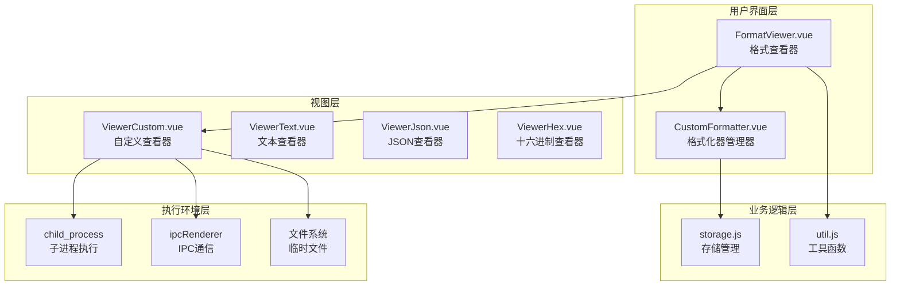
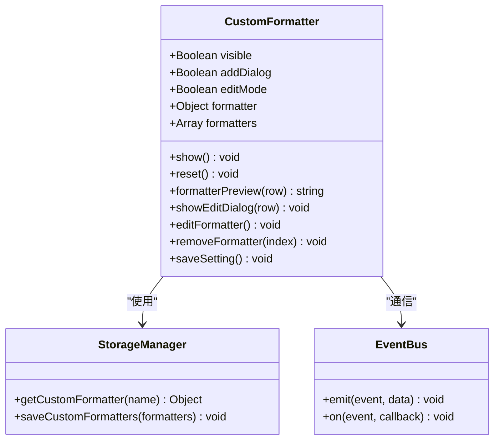
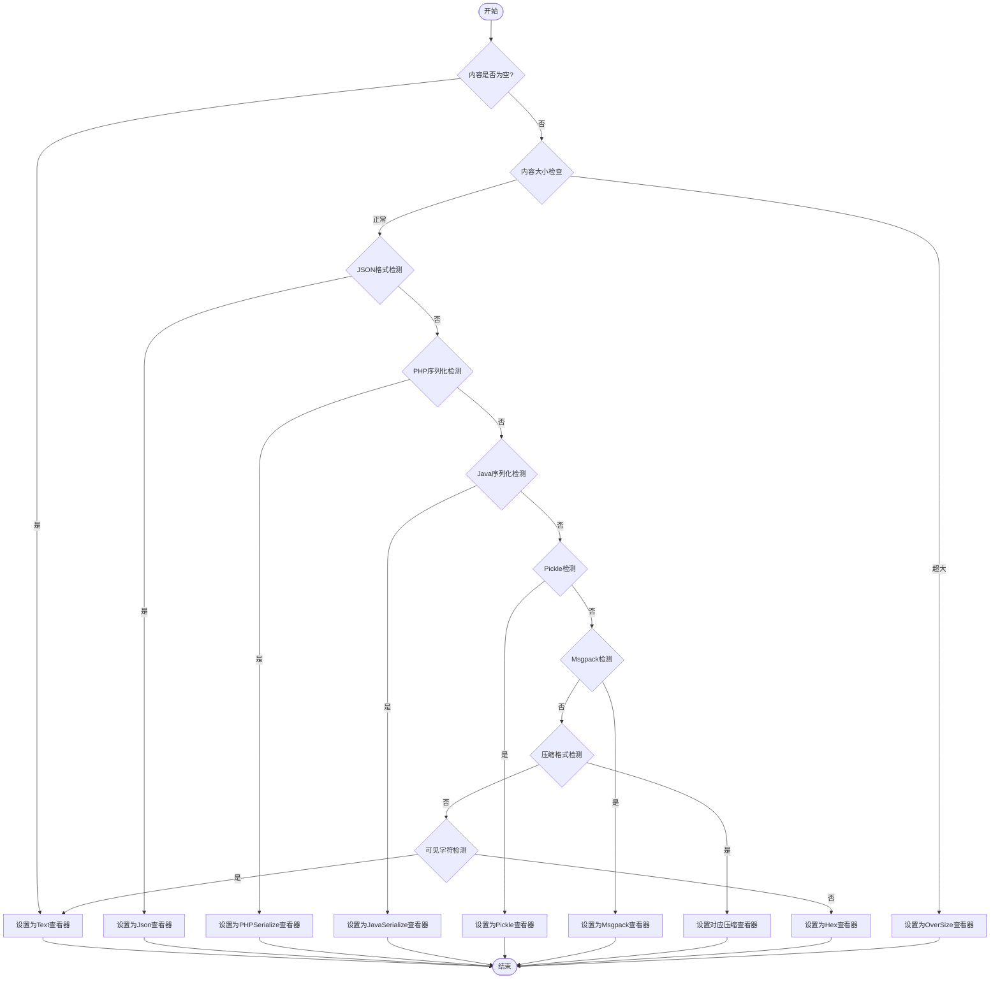
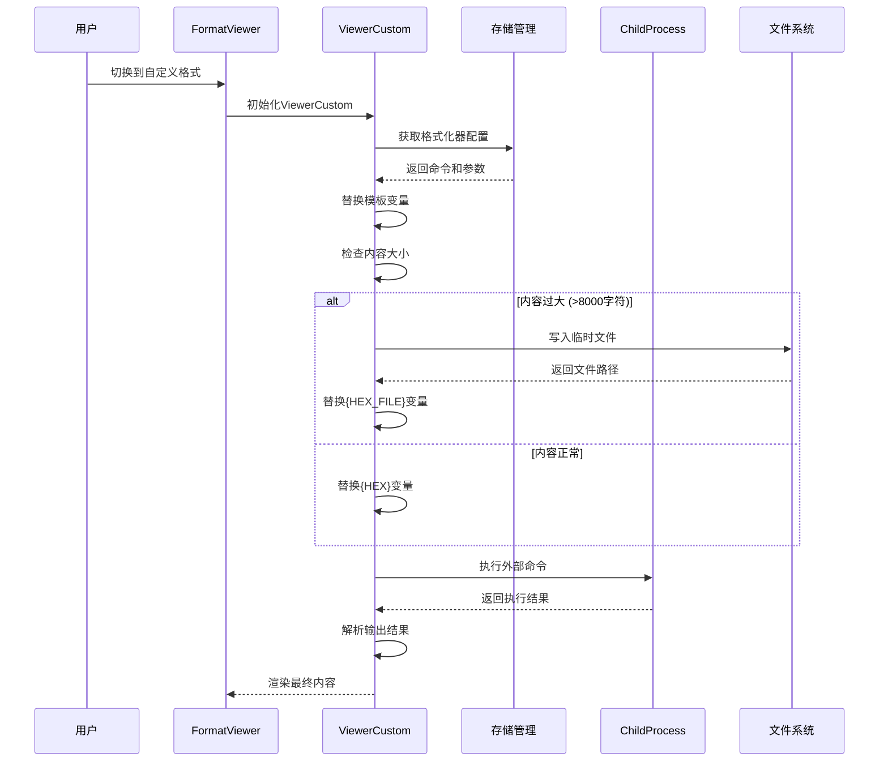
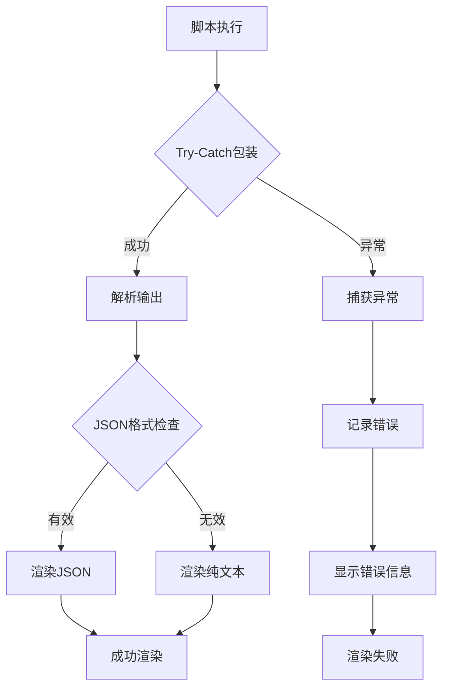
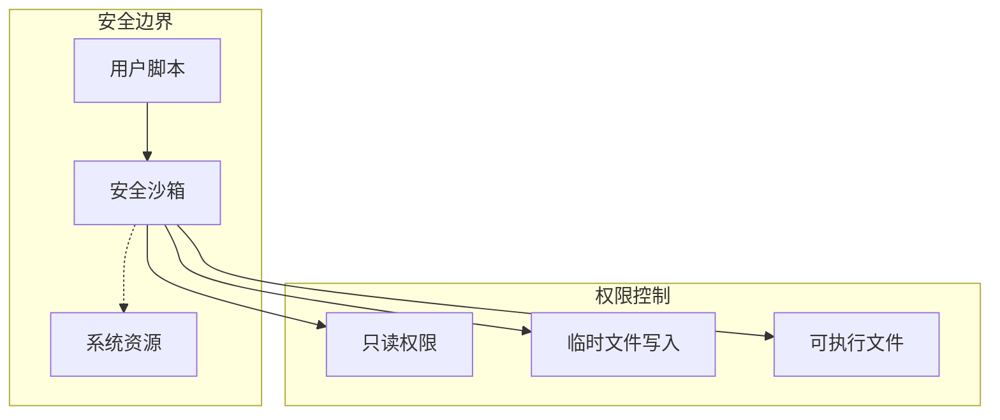
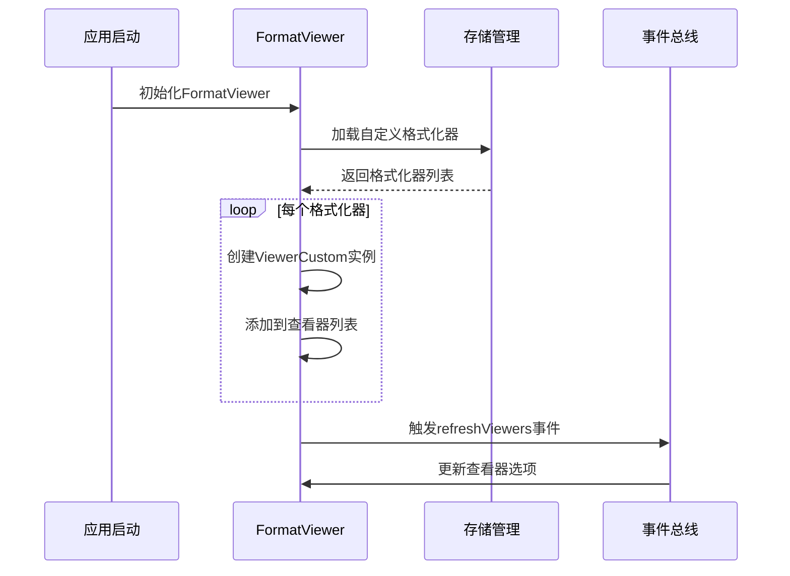
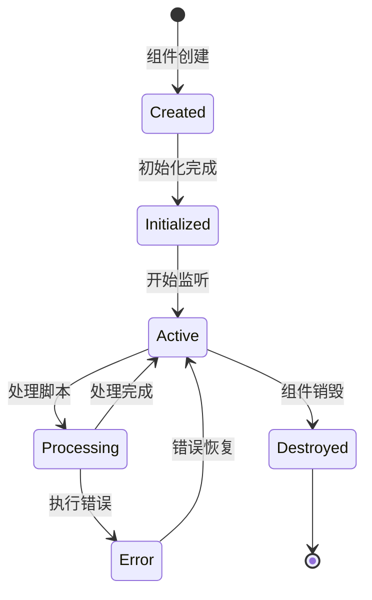

# 自定义格式查看器

<cite>
**本文档中引用的文件**
- [CustomFormatter.vue](file://src/components/CustomFormatter.vue)
- [FormatViewer.vue](file://src/components/FormatViewer.vue)
- [ViewerCustom.vue](file://src/components/viewers/ViewerCustom.vue)
- [storage.js](file://src/storage.js)
- [util.js](file://src/util.js)
- [package.json](file://package.json)
</cite>

## 目录
1. [简介](#简介)
2. [项目架构概览](#项目架构概览)
3. [核心组件分析](#核心组件分析)
4. [插件化接口设计](#插件化接口设计)
5. [JavaScript脚本注入机制](#javascript脚本注入机制)
6. [安全沙箱实现](#安全沙箱实现)
7. [自动匹配流程](#自动匹配流程)
8. [典型扩展示例](#典型扩展示例)
9. [调试与生命周期管理](#调试与生命周期管理)
10. [最佳实践指南](#最佳实践指南)

## 简介

Another Redis Desktop Manager (ARDM) 提供了一套强大的自定义格式扩展能力，通过 `CustomFormatter.vue` 组件实现了插件化的数据解析框架。该系统允许用户通过JavaScript脚本注入的方式定义新的数据解析规则，支持多种数据格式的自定义查看器，并提供了完整的安全沙箱机制来防止潜在的安全威胁。

核心特性包括：
- 基于Electron的本地脚本执行环境
- 模板变量替换系统（{KEY}, {VALUE}, {FIELD}, {SCORE}, {MEMBER}, {HEX}, {HEX_FILE}）
- 自动内容大小检测与文件写入机制
- 完整的错误处理与回调系统
- 实时预览与配置管理

## 项目架构概览

系统采用分层架构设计，主要包含以下层次：



**图表来源**
- [CustomFormatter.vue](file://src/components/CustomFormatter.vue#L1-L177)
- [FormatViewer.vue](file://src/components/FormatViewer.vue#L1-L294)
- [ViewerCustom.vue](file://src/components/viewers/ViewerCustom.vue#L1-L179)

## 核心组件分析

### CustomFormatter.vue - 格式化器管理器

`CustomFormatter.vue` 是整个自定义格式扩展的核心入口点，负责管理用户定义的格式化器配置。

#### 主要功能模块

1. **格式化器列表管理**
   - 显示已配置的格式化器列表
   - 支持添加、编辑、删除操作
   - 实时预览格式化器命令

2. **配置对话框**
   - 名称字段验证
   - 命令路径选择（支持可执行文件）
   - 参数模板配置
   - 模板变量帮助信息

3. **存储集成**
   - 使用localStorage持久化配置
   - 通过$bus事件系统同步更新



**图表来源**
- [CustomFormatter.vue](file://src/components/CustomFormatter.vue#L117-L176)
- [storage.js](file://src/storage.js#L165-L181)

**章节来源**
- [CustomFormatter.vue](file://src/components/CustomFormatter.vue#L1-L177)

### FormatViewer.vue - 格式查看器主控制器

`FormatViewer.vue` 负责协调各种格式查看器的自动匹配和切换逻辑。

#### 自动匹配算法

系统实现了智能的格式自动识别机制：



**图表来源**
- [FormatViewer.vue](file://src/components/FormatViewer.vue#L172-L228)

**章节来源**
- [FormatViewer.vue](file://src/components/FormatViewer.vue#L1-L294)

### ViewerCustom.vue - 自定义查看器

`ViewerCustom.vue` 是实际执行用户脚本的核心组件，提供了完整的脚本执行环境。

#### 脚本执行流程



**图表来源**
- [ViewerCustom.vue](file://src/components/viewers/ViewerCustom.vue#L76-L151)

**章节来源**
- [ViewerCustom.vue](file://src/components/viewers/ViewerCustom.vue#L1-L179)

## 插件化接口设计

### 输入输出格式约定

系统定义了标准的输入输出格式规范：

#### 输入格式规范

| 数据类型 | 模板变量 | 描述 |
|---------|---------|------|
| 字符串 | `{VALUE}` | 直接字符串值 |
| 哈希 | `{FIELD}`, `{VALUE}` | 字段名和对应的值 |
| 列表 | `{VALUE}` | 列表中的元素值 |
| 集合 | `{VALUE}` | 集合中的成员值 |
| 有序集合 | `{SCORE}`, `{MEMBER}` | 分数和成员值 |

#### 输出格式约定

1. **标准输出**：脚本应直接输出需要显示的内容
2. **错误处理**：通过stderr输出错误信息
3. **编码要求**：输出内容应为UTF-8编码
4. **大小限制**：建议单次输出不超过1MB

### 错误处理回调机制

系统实现了多层次的错误处理机制：



**图表来源**
- [ViewerCustom.vue](file://src/components/viewers/ViewerCustom.vue#L140-L151)

**章节来源**
- [ViewerCustom.vue](file://src/components/viewers/ViewerCustom.vue#L45-L151)

## JavaScript脚本注入机制

### 模板变量系统

系统提供了丰富的模板变量替换功能：

#### 变量替换算法

```mermaid
flowchart LR
Input[原始命令模板] --> Regex[正则表达式匹配]
Regex --> Replace[变量替换]
Replace --> Output[最终执行命令]
subgraph "可用变量"
KEY[{KEY}]
VALUE[{VALUE}]
FIELD[{FIELD}]
SCORE[{SCORE}]
MEMBER[{MEMBER}]
HEX[{HEX}]
HEXFILE[{HEX_FILE}]
end
subgraph "替换映射"
KEY --> KeyVal[redisKey]
VALUE --> ValVal[content]
FIELD --> FieldVal[dataMap.key]
SCORE --> ScoreVal[dataMap.score]
MEMBER --> MemberVal[dataMap.member]
HEX --> HexStr[hex字符串]
HEXFILE --> TempPath[临时文件路径]
end
```

**图表来源**
- [ViewerCustom.vue](file://src/components/viewers/ViewerCustom.vue#L59-L75)

### 命令执行机制

脚本执行采用安全的子进程模式：

1. **进程隔离**：每个脚本在独立的子进程中执行
2. **参数转义**：自动处理特殊字符转义
3. **超时控制**：防止脚本无限执行
4. **资源限制**：限制内存和CPU使用

**章节来源**
- [ViewerCustom.vue](file://src/components/viewers/ViewerCustom.vue#L46-L151)

## 安全沙箱实现

### 权限限制策略

系统实施了多层安全防护措施：

#### 1. 进程隔离
- 使用Electron的child_process模块创建独立进程
- 限制脚本访问系统资源的能力
- 防止脚本发起网络请求

#### 2. 文件系统限制
- 仅允许读取指定的临时文件
- 禁止访问用户敏感目录
- 自动清理临时文件

#### 3. 内存保护
- 设置合理的内存使用上限
- 监控脚本内存占用
- 异常情况下自动终止进程



**图表来源**
- [ViewerCustom.vue](file://src/components/viewers/ViewerCustom.vue#L102-L121)

### XSS防护机制

系统通过以下措施防止跨站脚本攻击：

1. **内容过滤**：对输出内容进行HTML实体编码
2. **执行上下文隔离**：脚本运行在独立的JavaScript环境中
3. **输入验证**：严格验证所有用户输入参数

**章节来源**
- [ViewerCustom.vue](file://src/components/viewers/ViewerCustom.vue#L76-L151)

## 自动匹配流程

### 查看器注册机制

系统通过动态注册的方式集成自定义查看器：



**图表来源**
- [FormatViewer.vue](file://src/components/FormatViewer.vue#L237-L247)

### 生命周期管理

#### 组件生命周期

1. **初始化阶段**
   - 加载自定义格式化器配置
   - 注册自定义查看器选项
   - 设置自动匹配监听器

2. **运行阶段**
   - 监听内容变化事件
   - 触发自动格式化
   - 处理用户交互

3. **销毁阶段**
   - 清理临时文件
   - 断开事件监听
   - 释放资源

**章节来源**
- [FormatViewer.vue](file://src/components/FormatViewer.vue#L132-L137)
- [FormatViewer.vue](file://src/components/FormatViewer.vue#L237-L250)

## 典型扩展示例

### 示例1：Base64解码查看器

```bash
# 命令：base64解码
/bin/bash

# 参数：
--value "{VALUE}" --decode
```

### 示例2：AES加密数据解密查看器

```bash
# 命令：AES解密脚本
/usr/bin/python3

# 参数：
--key "your_secret_key" --value "{HEX}" --algorithm AES
```

### 示例3：Protocol Buffers反序列化

```bash
# 命令：protoc编译器
/usr/bin/protoc

# 参数：
--decode_raw --input "{HEX_FILE}" --descriptor_set_in="{HEX_FILE}"
```

### 示例4：自定义二进制格式解析

```bash
# 命令：自定义解析器
/usr/local/bin/custom-parser

# 参数：
--format binary --input "{HEX_FILE}" --output-format json
```

## 调试与生命周期管理

### 脚本调试方法

#### 1. 命令预览功能
系统提供了实时命令预览功能，帮助用户验证模板变量替换效果。

#### 2. 日志记录机制
- 脚本执行日志保存
- 错误信息详细记录
- 性能指标监控

#### 3. 测试环境
- 在开发模式下提供更详细的错误信息
- 支持脚本语法检查
- 提供模拟数据测试

### 生命周期管理策略

#### 1. 资源管理


**图表来源**
- [ViewerCustom.vue](file://src/components/viewers/ViewerCustom.vue#L152-L157)

#### 2. 错误恢复机制
- 自动重试失败的脚本执行
- 错误状态下的降级处理
- 用户友好的错误提示

#### 3. 性能优化
- 脚本执行结果缓存
- 避免重复的格式检测
- 合理的内存使用策略

**章节来源**
- [ViewerCustom.vue](file://src/components/viewers/ViewerCustom.vue#L152-L157)

## 最佳实践指南

### 开发建议

1. **脚本设计原则**
   - 保持脚本简洁高效
   - 处理边界情况和错误输入
   - 提供清晰的错误信息

2. **性能考虑**
   - 避免长时间运行的脚本
   - 合理使用临时文件
   - 控制输出内容大小

3. **安全性注意事项**
   - 不要在脚本中执行危险操作
   - 验证所有输入参数
   - 避免硬编码敏感信息

### 配置管理

1. **命名规范**
   - 使用描述性的格式化器名称
   - 避免使用特殊字符
   - 保持命名一致性

2. **版本控制**
   - 记录重要的配置变更
   - 备份关键的格式化器配置
   - 文档化复杂的脚本逻辑

### 故障排除

1. **常见问题**
   - 脚本无输出：检查脚本语法和权限
   - 编码问题：确保UTF-8编码
   - 性能问题：优化脚本逻辑

2. **诊断工具**
   - 使用内置的日志功能
   - 检查浏览器开发者工具
   - 验证脚本在独立环境中的运行

通过这套完整的自定义格式扩展能力，Another Redis Desktop Manager 为用户提供了强大而灵活的数据查看解决方案，同时保持了良好的安全性和稳定性。