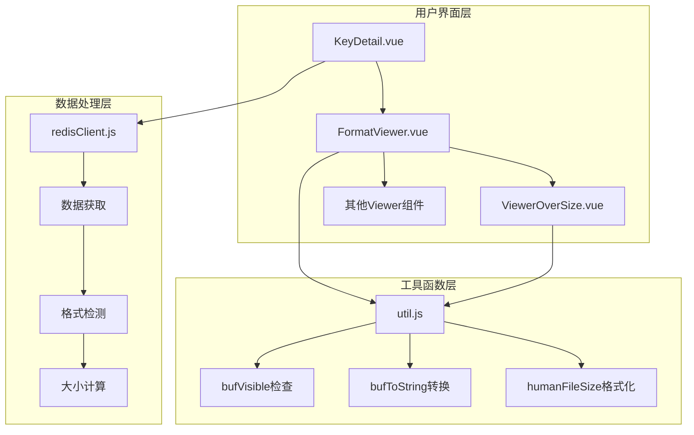
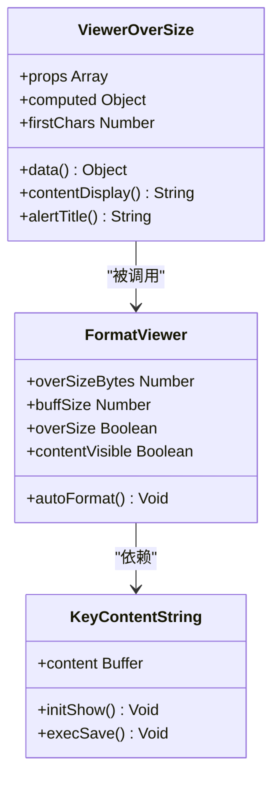
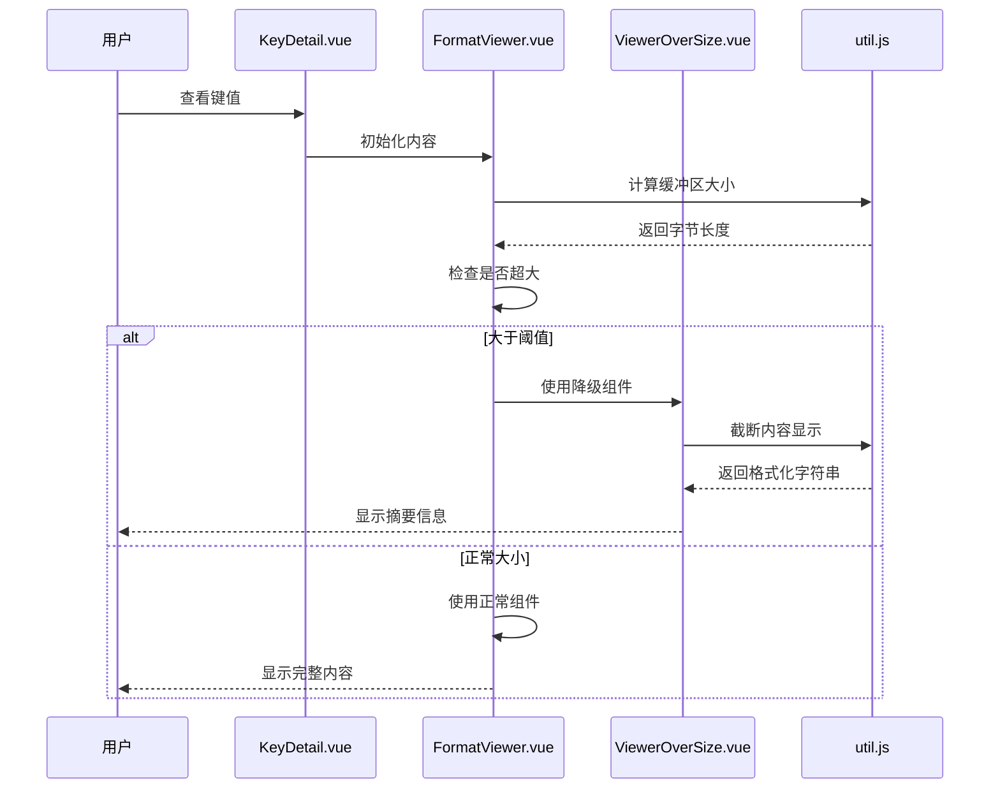
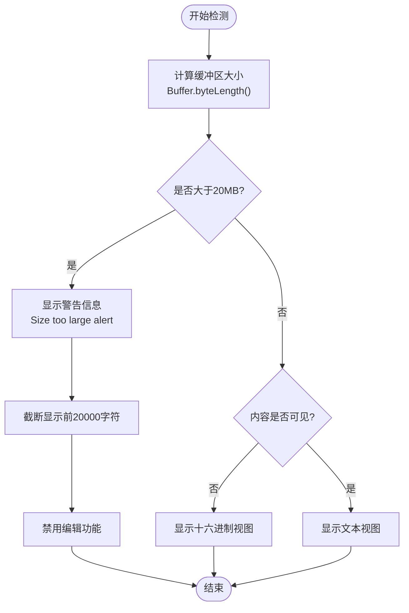
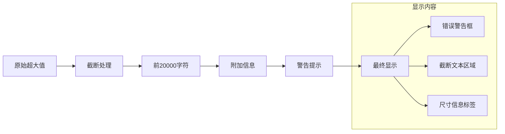
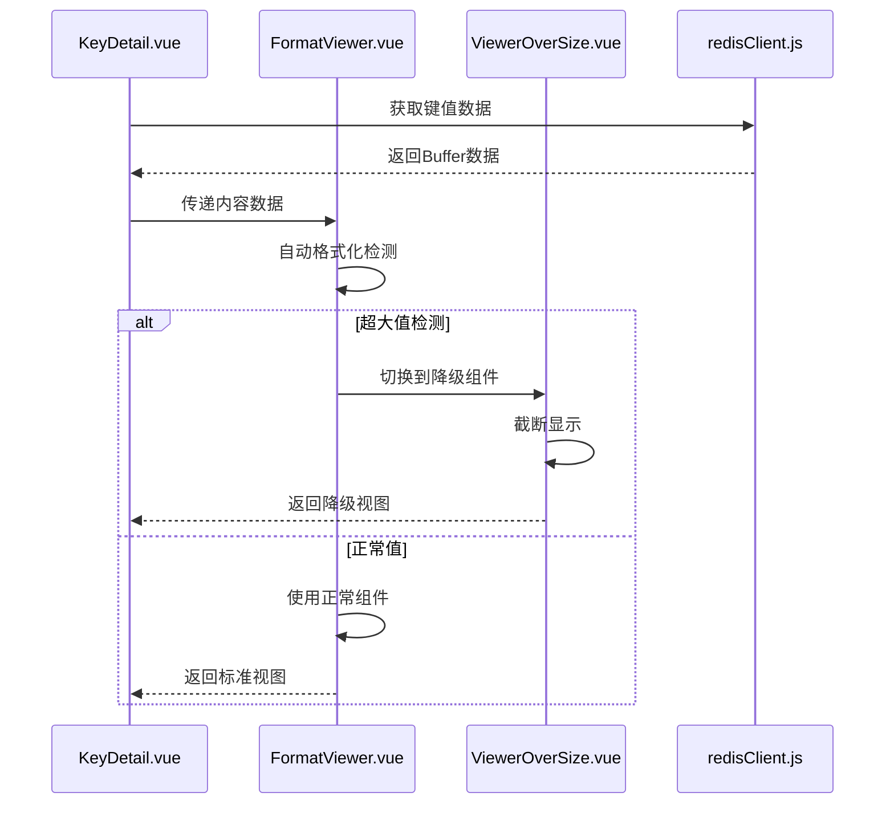
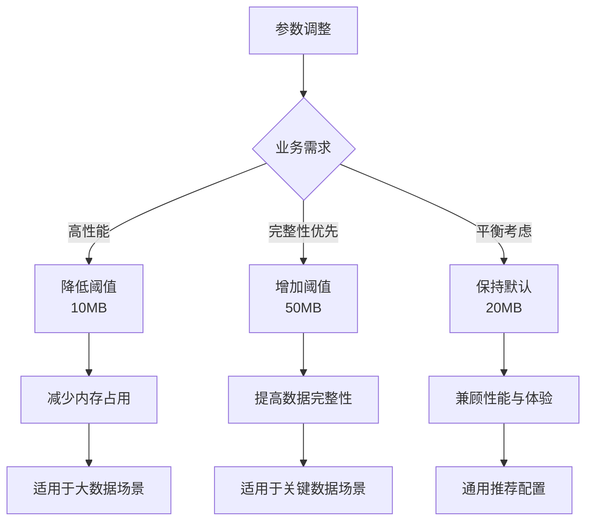
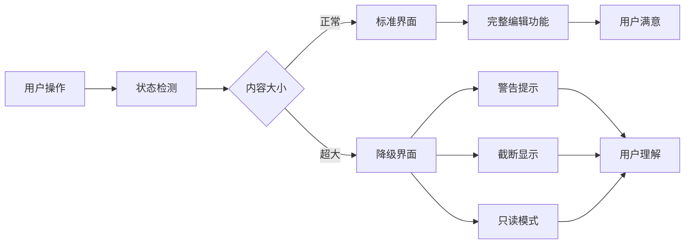

# 超大值查看器

<cite>
**本文档中引用的文件**
- [ViewerOverSize.vue](file://src/components/viewers/ViewerOverSize.vue)
- [FormatViewer.vue](file://src/components/FormatViewer.vue)
- [KeyContentString.vue](file://src/components/contents/KeyContentString.vue)
- [KeyDetail.vue](file://src/components/KeyDetail.vue)
- [util.js](file://src/util.js)
- [redisClient.js](file://src/redisClient.js)
</cite>

## 目录
1. [概述](#概述)
2. [系统架构](#系统架构)
3. [核心组件分析](#核心组件分析)
4. [检测机制](#检测机制)
5. [降级显示策略](#降级显示策略)
6. [与KeyDetail的协作](#与keydetail的协作)
7. [配置参数](#配置参数)
8. [性能优化](#性能优化)
9. [用户体验设计](#用户体验设计)
10. [故障排除指南](#故障排除指南)
11. [总结](#总结)

## 概述

ViewerOverSize.vue是AnotherRedisDesktopManager中专门用于处理超大值的关键组件，当检测到Redis键值超过预设大小阈值时，它会自动触发降级显示策略，防止界面卡顿和内存溢出。该组件通过智能截断和摘要展示的方式，在保证系统稳定性的同时，为用户提供有价值的信息。

## 系统架构

**图表来源**
- [KeyDetail.vue](file://src/components/KeyDetail.vue#L1-L159)
- [FormatViewer.vue](file://src/components/FormatViewer.vue#L1-L294)
- [ViewerOverSize.vue](file://src/components/viewers/ViewerOverSize.vue#L1-L44)

## 核心组件分析

### ViewerOverSize组件结构

ViewerOverSize.vue是一个轻量级的Vue组件，专门负责处理超大值的显示问题：

**图表来源**
- [ViewerOverSize.vue](file://src/components/viewers/ViewerOverSize.vue#L13-L29)
- [FormatViewer.vue](file://src/components/FormatViewer.vue#L56-L130)
- [KeyContentString.vue](file://src/components/contents/KeyContentString.vue#L25-L104)

**章节来源**
- [ViewerOverSize.vue](file://src/components/viewers/ViewerOverSize.vue#L1-L44)
- [FormatViewer.vue](file://src/components/FormatViewer.vue#L1-L294)

### 组件交互流程

**图表来源**
- [FormatViewer.vue](file://src/components/FormatViewer.vue#L176-L180)
- [ViewerOverSize.vue](file://src/components/viewers/ViewerOverSize.vue#L21-L27)
- [util.js](file://src/util.js#L9-L15)

## 检测机制

### 大小阈值检测

系统通过多层检测机制确保及时发现超大值：

| 检测层级 | 实现位置 | 阈值设置 | 检测逻辑 |
|---------|----------|----------|----------|
| 缓冲区大小检测 | FormatViewer.vue | 20MB (20971520字节) | `Buffer.byteLength(content) > overSizeBytes` |
| 内容可见性检测 | util.js | 动态计算 | `bufVisible()`函数检查编码格式 |
| 自动格式化检测 | FormatViewer.vue | 基于内容特征 | JSON、二进制、压缩等格式识别 |

### 检测算法实现

**图表来源**
- [FormatViewer.vue](file://src/components/FormatViewer.vue#L115-L120)
- [util.js](file://src/util.js#L9-L15)

**章节来源**
- [FormatViewer.vue](file://src/components/FormatViewer.vue#L77-L120)
- [util.js](file://src/util.js#L9-L15)

## 降级显示策略

### 截断显示机制

当检测到超大值时，ViewerOverSize组件采用以下策略：

1. **字符截断**：只显示前20,000个字符
2. **警告提示**：显示红色警告框说明情况
3. **不可编辑**：禁用文本输入功能
4. **摘要信息**：提供数据类型和长度信息

### 显示内容结构

**图表来源**
- [ViewerOverSize.vue](file://src/components/viewers/ViewerOverSize.vue#L21-L27)

**章节来源**
- [ViewerOverSize.vue](file://src/components/viewers/ViewerOverSize.vue#L1-L44)

## 与KeyDetail的协作

### 组件链式调用

KeyDetail.vue作为主容器，协调各个子组件的工作：

**图表来源**
- [KeyDetail.vue](file://src/components/KeyDetail.vue#L35-L100)
- [FormatViewer.vue](file://src/components/FormatViewer.vue#L176-L180)

### 数据流转机制

| 组件 | 输入数据 | 处理逻辑 | 输出结果 |
|------|----------|----------|----------|
| KeyDetail | redisKey, client | 获取键值数据 | Buffer对象 |
| FormatViewer | Buffer内容 | 自动格式化检测 | 选择合适的Viewer组件 |
| ViewerOverSize | 超大Buffer | 截断显示 | 警告+摘要信息 |

**章节来源**
- [KeyDetail.vue](file://src/components/KeyDetail.vue#L35-L100)
- [KeyContentString.vue](file://src/components/contents/KeyContentString.vue#L35-L40)

## 配置参数

### 可配置参数表

| 参数名称 | 默认值 | 单位 | 说明 | 修改位置 |
|---------|--------|------|------|----------|
| overSizeBytes | 20971520 | 字节 | 超大值阈值 | FormatViewer.vue第77行 |
| firstChars | 20000 | 字符 | 截断显示字符数 | ViewerOverSize.vue第16行 |
| scanMax | 200000 | 键数量 | 内存分析最大扫描数 | MemoryAnalysis.vue第89行 |

### 参数调整建议

**章节来源**
- [FormatViewer.vue](file://src/components/FormatViewer.vue#L77-L80)
- [ViewerOverSize.vue](file://src/components/viewers/ViewerOverSize.vue#L15-L17)

## 性能优化

### 内存管理策略

1. **延迟加载**：只在需要时加载完整内容
2. **字符截断**：避免一次性加载大段文本
3. **组件复用**：合理使用Vue组件生命周期
4. **事件解绑**：及时清理不需要的监听器

### 性能监控指标

| 指标类型 | 监控方法 | 正常范围 | 异常处理 |
|---------|----------|----------|----------|
| 渲染时间 | Vue DevTools | < 100ms | 启用降级显示 |
| 内存使用 | 浏览器任务管理器 | < 500MB | 减少缓存大小 |
| 响应速度 | 用户操作反馈 | < 500ms | 优化算法逻辑 |
| 错误率 | 控制台日志 | < 1% | 重试机制 |

**章节来源**
- [FormatViewer.vue](file://src/components/FormatViewer.vue#L108-L114)

## 用户体验设计

### 视觉反馈机制

### 用户交互设计

1. **渐进式披露**：先显示摘要信息，再提供完整内容入口
2. **明确提示**：清晰告知用户当前处于降级模式
3. **操作限制**：禁用可能影响性能的操作
4. **恢复机制**：提供重新加载完整内容的选项

**章节来源**
- [ViewerOverSize.vue](file://src/components/viewers/ViewerOverSize.vue#L3-L9)

## 故障排除指南

### 常见问题及解决方案

| 问题类型 | 症状描述 | 可能原因 | 解决方案 |
|---------|----------|----------|----------|
| 显示异常 | 内容不显示或乱码 | 编码格式问题 | 检查bufVisible检测逻辑 |
| 性能下降 | 界面卡顿 | 大量数据处理 | 调整阈值参数 |
| 功能失效 | 无法切换视图 | 组件初始化失败 | 重启应用或清除缓存 |
| 内存泄漏 | 内存持续增长 | 事件监听未清理 | 检查组件销毁钩子 |

### 调试技巧

1. **控制台检查**：查看Vue组件状态和Props传递
2. **网络监控**：确认数据获取是否正常
3. **内存分析**：使用浏览器开发工具监控内存使用
4. **性能分析**：测量渲染时间和响应速度

**章节来源**
- [util.js](file://src/util.js#L9-L15)

## 总结

ViewerOverSize.vue组件通过智能检测和降级显示策略，有效解决了Redis键值过大导致的界面性能问题。其核心优势包括：

1. **智能检测**：基于缓冲区大小和内容特征的双重检测机制
2. **性能保护**：通过截断显示和警告提示防止系统卡顿
3. **用户体验**：提供清晰的视觉反馈和合理的功能限制
4. **可配置性**：支持根据实际需求调整阈值参数
5. **系统集成**：与现有架构无缝协作，无需额外配置

该机制在保证系统稳定性的同时，为用户提供了有价值的数据访问能力，是AnotherRedisDesktopManager中重要的性能优化措施。通过合理的参数配置和持续的性能监控，可以进一步提升系统的整体表现。