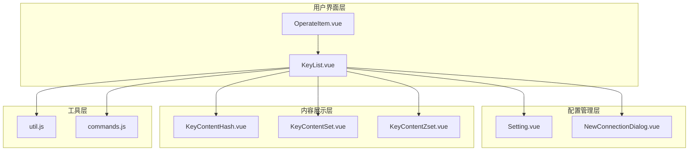
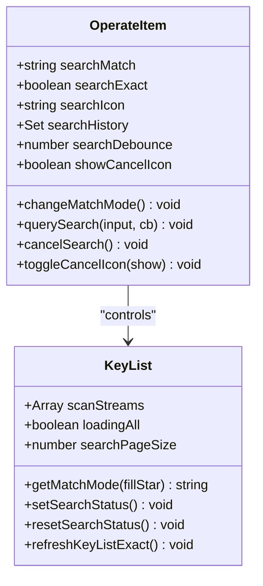
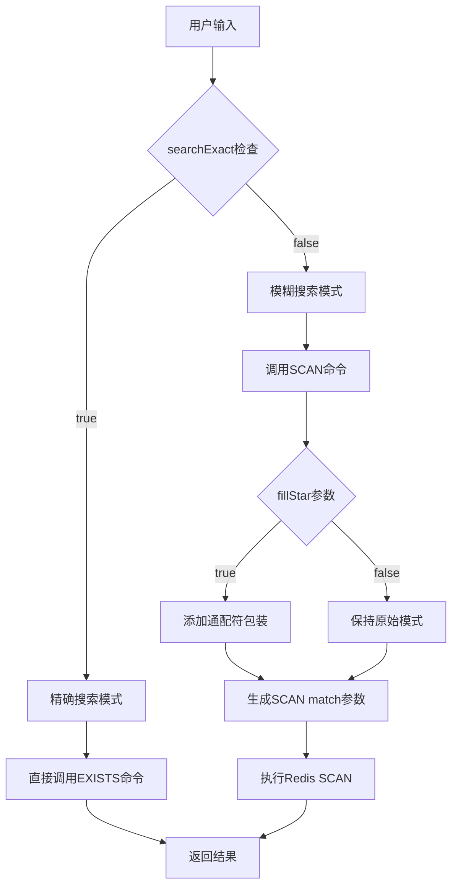
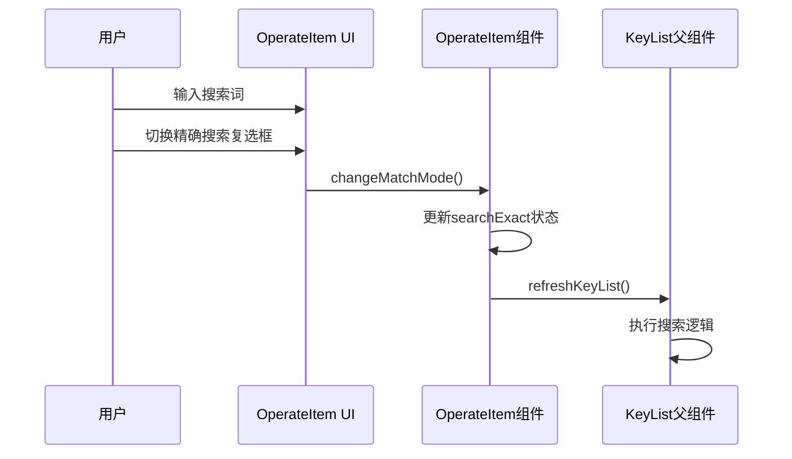
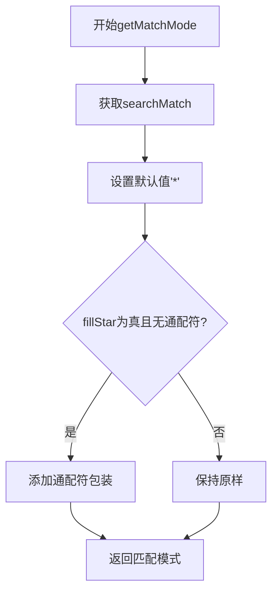
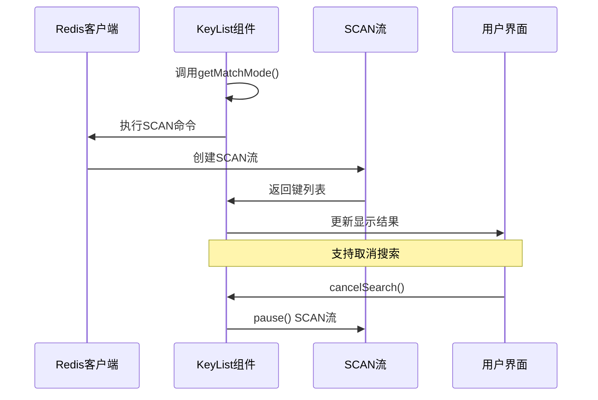
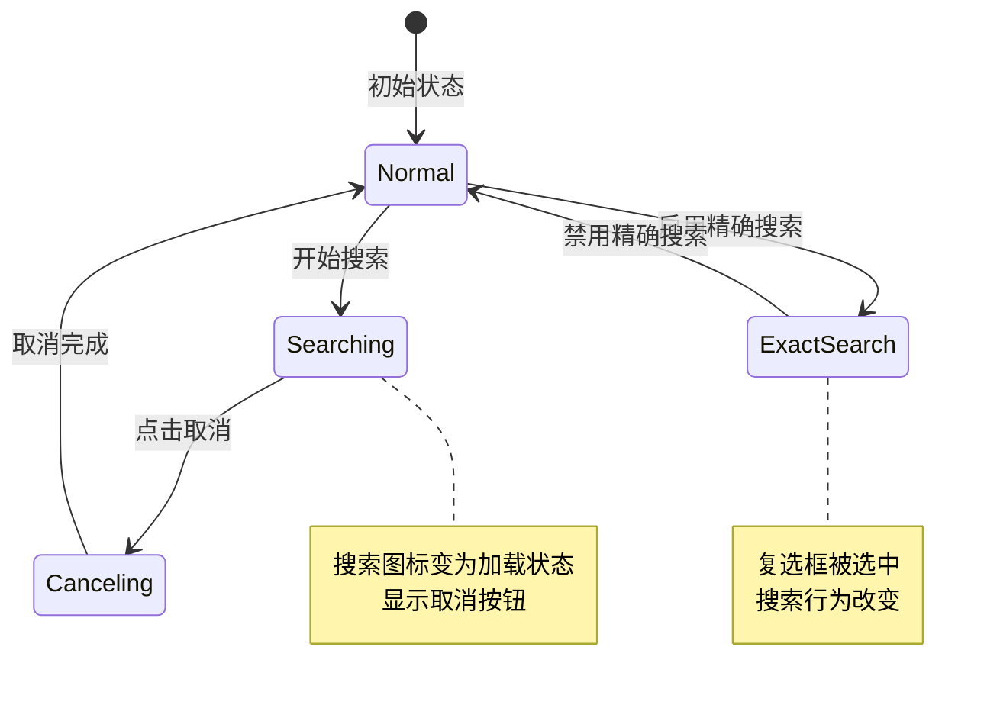
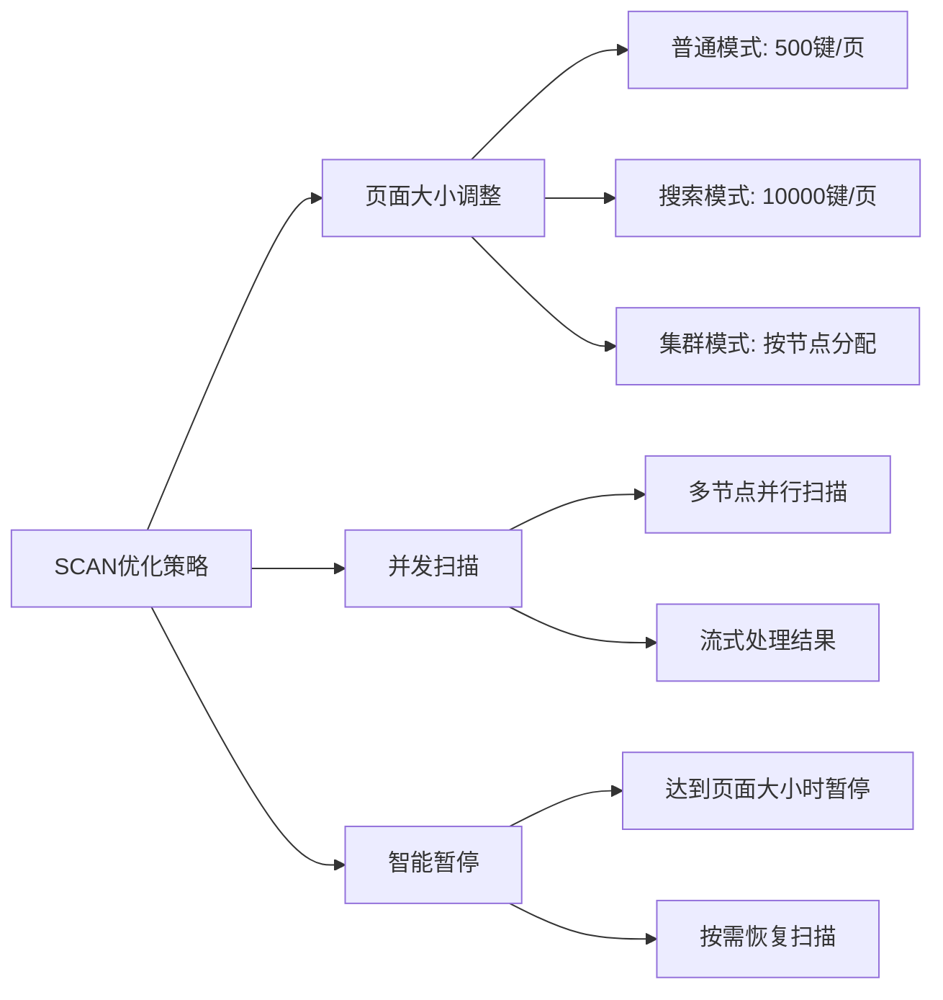
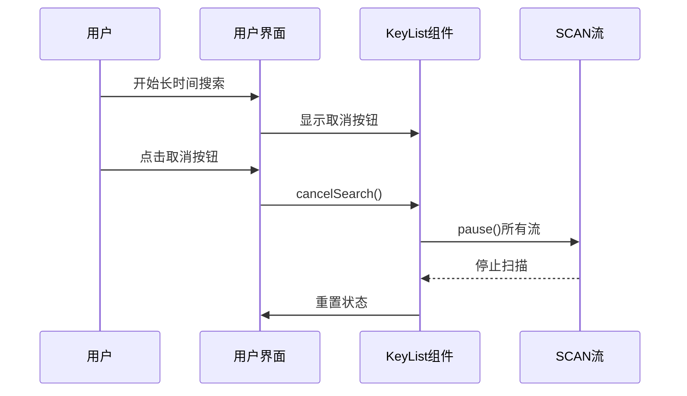
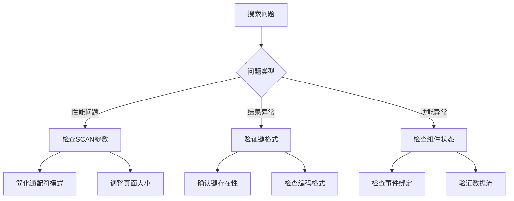

# 匹配模式

<cite>
**本文档中引用的文件**
- [OperateItem.vue](file://src/components/OperateItem.vue)
- [KeyList.vue](file://src/components/KeyList.vue)
- [Setting.vue](file://src/components/Setting.vue)
- [NewConnectionDialog.vue](file://src/components/NewConnectionDialog.vue)
- [KeyContentHash.vue](file://src/components/contents/KeyContentHash.vue)
- [KeyContentSet.vue](file://src/components/contents/KeyContentSet.vue)
- [KeyContentZset.vue](file://src/components/contents/KeyContentZset.vue)
- [DeleteBatch.vue](file://src/components/DeleteBatch.vue)
- [commands.js](file://src/commands.js)
- [util.js](file://src/util.js)
</cite>

## 目录
1. [简介](#简介)
2. [项目结构概览](#项目结构概览)
3. [核心组件分析](#核心组件分析)
4. [匹配模式架构](#匹配模式架构)
5. [详细组件分析](#详细组件分析)
6. [匹配模式实现机制](#匹配模式实现机制)
7. [用户界面交互](#用户界面交互)
8. [性能优化策略](#性能优化策略)
9. [最佳实践指南](#最佳实践指南)
10. [故障排除](#故障排除)
11. [总结](#总结)

## 简介

Another Redis Desktop Manager 的搜索过滤功能提供了三种智能匹配模式：前缀匹配、通配符支持和精确搜索。这些模式通过 OperateItem 组件中的 searchExact 布尔值控制，并由 KeyList 组件中的 getMatchMode 方法根据 fillStar 参数动态生成 Redis SCAN 命令的 match 参数。

该系统的核心优势在于：
- **灵活的搜索模式**：支持从简单前缀到复杂通配符的各种搜索需求
- **高效的性能表现**：通过智能的 SCAN 命令优化减少数据库负载
- **直观的用户界面**：复选框与搜索图标的联动提供良好的用户体验
- **可配置的性能参数**：允许用户调整扫描页面大小以平衡性能和响应性

## 项目结构概览

搜索过滤功能主要分布在以下关键组件中：



**图表来源**
- [OperateItem.vue](file://src/components/OperateItem.vue#L1-L489)
- [KeyList.vue](file://src/components/KeyList.vue#L1-L350)

## 核心组件分析

### OperateItem 组件

OperateItem 组件是搜索功能的入口点，负责处理用户输入和状态管理：



**图表来源**
- [OperateItem.vue](file://src/components/OperateItem.vue#L108-L135)
- [KeyList.vue](file://src/components/KeyList.vue#L45-L78)

**章节来源**
- [OperateItem.vue](file://src/components/OperateItem.vue#L108-L135)
- [KeyList.vue](file://src/components/KeyList.vue#L45-L78)

## 匹配模式架构

搜索过滤功能采用分层架构设计，确保了功能的灵活性和可扩展性：



**图表来源**
- [KeyList.vue](file://src/components/KeyList.vue#L255-L266)
- [OperateItem.vue](file://src/components/OperateItem.vue#L352-L363)

## 详细组件分析

### OperateItem 组件详细分析

OperateItem 组件实现了完整的搜索功能入口，包含以下关键特性：

#### 数据属性管理
- `searchMatch`: 存储当前搜索模式
- `searchExact`: 控制精确搜索模式的布尔标志
- `searchIcon`: 显示搜索状态的图标
- `searchHistory`: 维护搜索历史记录

#### 搜索模式切换机制


**图表来源**
- [OperateItem.vue](file://src/components/OperateItem.vue#L352-L363)

**章节来源**
- [OperateItem.vue](file://src/components/OperateItem.vue#L108-L135)
- [OperateItem.vue](file://src/components/OperateItem.vue#L352-L363)

### KeyList 组件详细分析

KeyList 组件负责执行实际的搜索操作，是匹配模式的核心实现：

#### getMatchMode 方法实现
getMatchMode 方法是匹配模式的核心逻辑，根据 fillStar 参数生成不同的 SCAN 命令参数：



**图表来源**
- [KeyList.vue](file://src/components/KeyList.vue#L255-L266)

#### 搜索执行流程


**图表来源**
- [KeyList.vue](file://src/components/KeyList.vue#L147-L178)
- [KeyList.vue](file://src/components/KeyList.vue#L255-L266)

**章节来源**
- [KeyList.vue](file://src/components/KeyList.vue#L255-L266)
- [KeyList.vue](file://src/components/KeyList.vue#L147-L178)

## 匹配模式实现机制

### 前缀匹配模式

当用户输入简单的字符串且未启用精确搜索时，系统自动添加通配符包装：

| 输入模式 | 内部转换 | SCAN参数 | 效果描述 |
|---------|---------|---------|---------|
| "user" | "*user*" | *user* | 匹配包含"user"的所有键 |
| "user:" | "*user:*" | *user:* | 匹配以"user:"开头的键 |
| ":session" | *:session | *:session | 匹配以":session"结尾的键 |

### 通配符支持模式

系统完全支持 Redis SCAN 命令的通配符语法：

| 通配符语法 | 示例 | 匹配范围 | 性能影响 |
|-----------|------|---------|---------|
| * | user* | 以user开头的所有键 | 中等 |
| *user | *user | 以user结尾的所有键 | 中等 |
| u*er | u*er | 包含u和r之间任意字符的键 | 较高 |
| user? | user? | user后跟单个字符的键 | 较低 |

### 精确搜索模式

当启用精确搜索时，系统直接使用 EXISTS 命令进行匹配：

```mermaid
flowchart TD
A[启用精确搜索] --> B[调用getMatchMode(false)]
B --> C[返回原始搜索词]
C --> D[执行EXISTS命令]
D --> E{键存在?}
E --> |是| F[返回单个键]
E --> |否| G[返回空数组]
```

**图表来源**
- [KeyList.vue](file://src/components/KeyList.vue#L237-L247)

**章节来源**
- [KeyList.vue](file://src/components/KeyList.vue#L255-L266)
- [KeyList.vue](file://src/components/KeyList.vue#L237-L247)

## 用户界面交互

### 复选框与搜索图标联动

用户界面通过复选框和搜索图标的联动提供直观的操作反馈：



**图表来源**
- [OperateItem.vue](file://src/components/OperateItem.vue#L341-L352)
- [OperateItem.vue](file://src/components/OperateItem.vue#L401-L407)

### 搜索历史管理

系统维护智能的搜索历史，提供便捷的搜索词选择：

| 功能特性 | 实现方式 | 用户体验 |
|---------|---------|---------|
| 自动保存 | setTimeout延迟存储 | 防止频繁写入 |
| 智能过滤 | 小写匹配算法 | 提高查找效率 |
| 数量限制 | 最多保留200条 | 避免内存占用过多 |
| 实时更新 | debounce防抖处理 | 平滑的用户体验 |

**章节来源**
- [OperateItem.vue](file://src/components/OperateItem.vue#L341-L352)
- [OperateItem.vue](file://src/components/OperateItem.vue#L401-L407)
- [OperateItem.vue](file://src/components/OperateItem.vue#L365-L379)

## 性能优化策略

### SCAN 命令优化

系统通过多种策略优化 SCAN 命令的性能：



**图表来源**
- [KeyList.vue](file://src/components/KeyList.vue#L50-L78)
- [KeyList.vue](file://src/components/KeyList.vue#L147-L178)

### 不同模式的性能对比

| 搜索模式 | SCAN数量 | 单次处理键数 | 内存占用 | CPU使用率 | 适用场景 |
|---------|---------|-------------|---------|----------|---------|
| 前缀匹配 | 多次SCAN | 10000+ | 中等 | 中等 | 大量数据筛选 |
| 通配符匹配 | 多次SCAN | 10000+ | 中等 | 较高 | 复杂模式匹配 |
| 精确搜索 | 1次SCAN | 1 | 低 | 低 | 确定性查询 |

### 取消搜索机制

系统提供完善的取消搜索功能，防止长时间运行的扫描操作：



**图表来源**
- [KeyList.vue](file://src/components/KeyList.vue#L255-L266)
- [OperateItem.vue](file://src/components/OperateItem.vue#L401-L407)

**章节来源**
- [KeyList.vue](file://src/components/KeyList.vue#L50-L78)
- [KeyList.vue](file://src/components/KeyList.vue#L147-L178)
- [KeyList.vue](file://src/components/KeyList.vue#L255-L266)

## 最佳实践指南

### 通配符语法技巧

1. **使用前缀匹配**：优先使用前缀匹配而非中间通配符
   ```
   # 推荐：前缀匹配
   user:*
   
   # 不推荐：中间通配符（性能较差）
   *user*
   ```

2. **合理使用后缀匹配**：在需要匹配特定后缀时使用
   ```
   # 匹配以":session"结尾的键
   *:session
   ```

3. **避免过度复杂的模式**：复杂的通配符模式会显著降低性能

### 避免全库扫描的最佳实践

1. **使用具体前缀**：始终使用具体的前缀而不是通用的"*"
   ```javascript
   // 好的做法：使用具体前缀
   const matchPattern = "users:*";
   
   // 避免的做法：全库扫描
   const matchPattern = "*";
   ```

2. **结合精确搜索**：对于已知确切键名的情况，启用精确搜索模式

3. **合理设置页面大小**：根据数据量调整扫描页面大小

### 性能监控建议

| 监控指标 | 正常范围 | 警告阈值 | 优化建议 |
|---------|---------|---------|---------|
| 搜索响应时间 | < 2秒 | > 5秒 | 减少通配符复杂度 |
| 内存使用率 | < 50% | > 80% | 调整页面大小 |
| CPU使用率 | < 30% | > 70% | 优化搜索模式 |

**章节来源**
- [KeyList.vue](file://src/components/KeyList.vue#L255-L266)
- [Setting.vue](file://src/components/Setting.vue#L68-L99)

## 故障排除

### 常见问题及解决方案

1. **搜索结果为空**
   - 检查搜索模式是否过于严格
   - 验证键是否存在且格式正确
   - 确认数据库连接状态

2. **搜索性能缓慢**
   - 减少通配符的使用频率
   - 使用更具体的前缀匹配
   - 调整扫描页面大小设置

3. **取消搜索不生效**
   - 检查SCAN流是否正确创建
   - 确认异步操作已完成
   - 重启应用程序

### 调试技巧



**章节来源**
- [OperateItem.vue](file://src/components/OperateItem.vue#L401-L407)
- [KeyList.vue](file://src/components/KeyList.vue#L255-L266)

## 总结

Another Redis Desktop Manager 的搜索过滤功能通过三种匹配模式的巧妙组合，实现了既灵活又高效的键值搜索体验。系统的核心优势包括：

1. **智能的匹配模式**：前缀匹配、通配符支持和精确搜索满足不同场景需求
2. **优秀的性能表现**：通过 SCAN 命令优化和智能缓存机制确保高效运行
3. **直观的用户界面**：复选框与搜索图标的联动提供良好的用户体验
4. **可配置的参数**：允许用户根据具体需求调整性能参数

这种设计不仅保证了功能的完整性，还兼顾了性能和用户体验，是现代 Redis 管理工具的重要特征。通过合理的使用这些匹配模式，用户可以高效地管理和查询 Redis 数据库中的键值对。