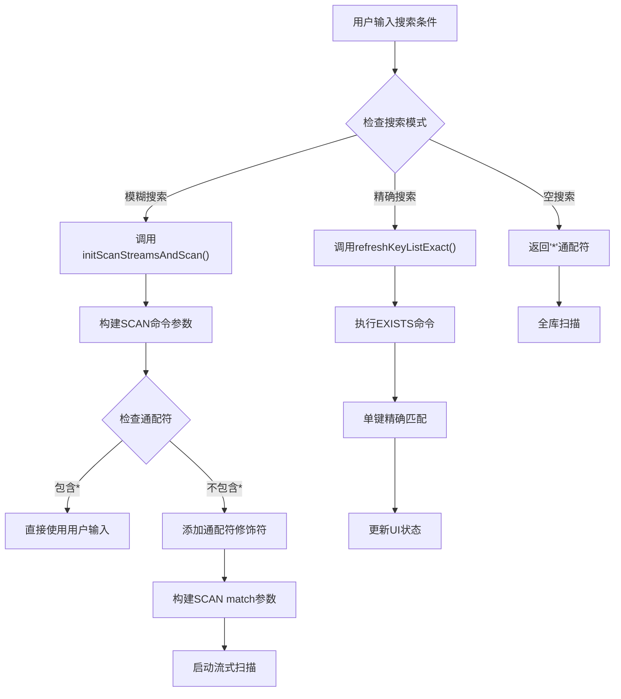
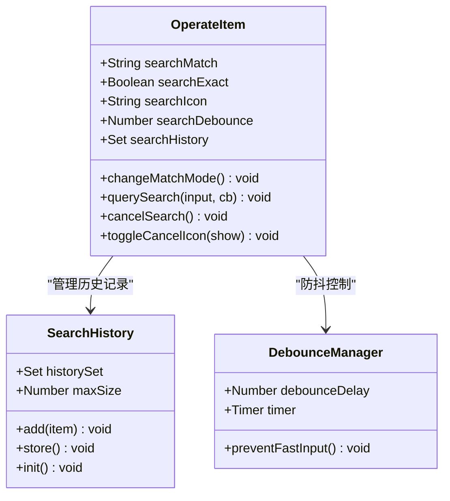
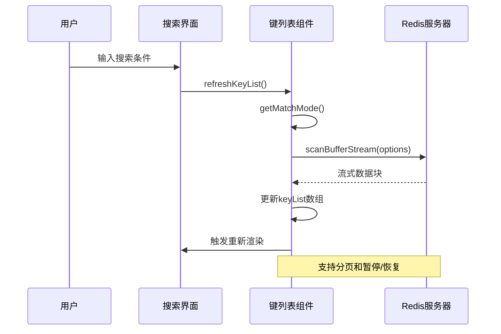
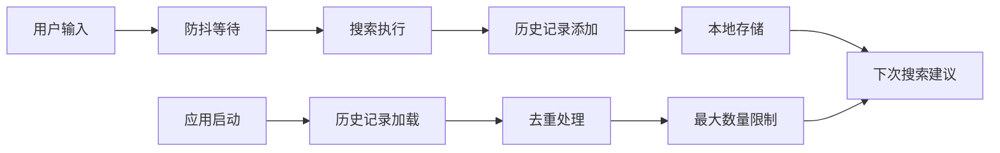
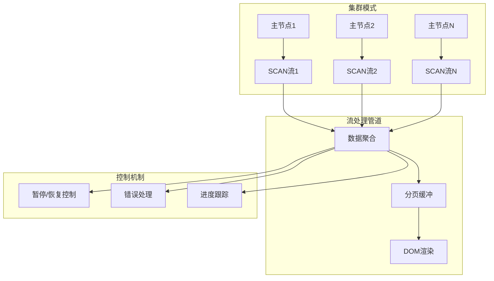
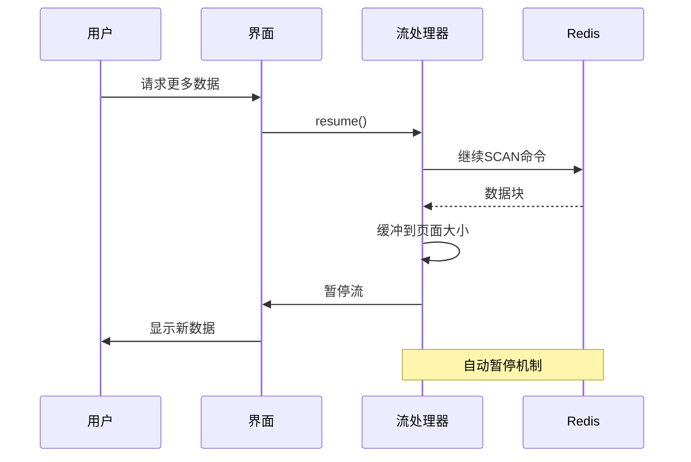
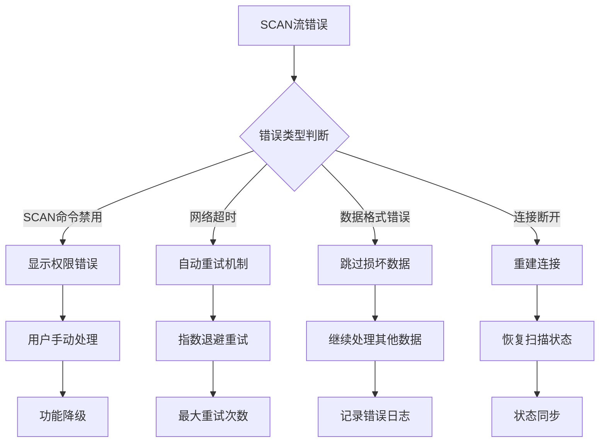
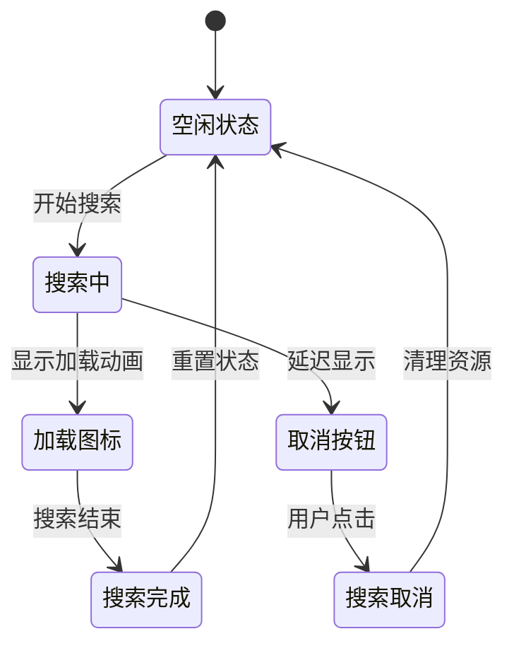
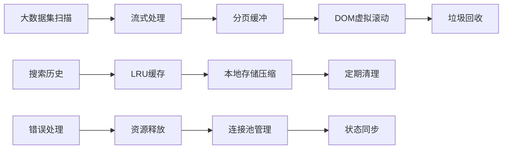

# 搜索过滤功能系统化文档

<cite>
**本文档引用的文件**
- [KeyList.vue](file://src/components/KeyList.vue)
- [OperateItem.vue](file://src/components/OperateItem.vue)
- [KeyContentSet.vue](file://src/components/contents/KeyContentSet.vue)
- [KeyContentStream.vue](file://src/components/contents/KeyContentStream.vue)
- [DeleteBatch.vue](file://src/components/DeleteBatch.vue)
- [MemoryAnalysis.vue](file://src/components/MemoryAnalysis.vue)
- [PaginationTable.vue](file://src/components/PaginationTable.vue)
</cite>

## 目录
1. [概述](#概述)
2. [搜索模式架构](#搜索模式架构)
3. [核心组件分析](#核心组件分析)
4. [实时搜索与防抖机制](#实时搜索与防抖机制)
5. [流式处理与增量加载](#流式处理与增量加载)
6. [错误恢复机制](#错误恢复机制)
7. [视觉反馈设计](#视觉反馈设计)
8. [性能优化策略](#性能优化策略)
9. [用户操作指南](#用户操作指南)
10. [最佳实践建议](#最佳实践建议)

## 概述

该系统实现了完整的Redis键值搜索过滤功能，支持多种搜索模式和高效的流式处理机制。主要特性包括：
- **前缀匹配模式**：支持通配符搜索和模糊匹配
- **精确搜索模式**：基于exists命令的精确查找
- **实时搜索防抖**：智能防重复请求机制
- **流式增量加载**：大规模数据集的高效处理
- **多层级视觉反馈**：完整的用户交互体验

## 搜索模式架构

### 三种搜索模式切换逻辑

系统通过`getMatchMode`方法实现三种搜索模式的智能切换：

**图表来源**
- [KeyList.vue](file://src/components/KeyList.vue#L256-L266)
- [OperateItem.vue](file://src/components/OperateItem.vue#L120-L121)

### SCAN命令匹配参数构建

`getMatchMode`方法负责构建SCAN命令的match参数，实现智能的通配符处理：

| 输入模式 | 处理逻辑 | 输出结果 | 适用场景 |
|---------|---------|---------|---------|
| 空字符串 | 默认通配符 | `*` | 全库扫描 |
| 包含通配符 | 直接使用 | 用户输入 | 复杂模式匹配 |
| 纯文本 | 添加通配符 | `*用户输入*` | 基础模糊搜索 |
| 精确键名 | 禁用通配符 | 用户输入 | 精确查找 |

**节来源**
- [KeyList.vue](file://src/components/KeyList.vue#L256-L266)

## 核心组件分析

### OperateItem组件 - 搜索控制中心

OperateItem组件作为搜索功能的核心控制器，管理以下关键功能：

**图表来源**
- [OperateItem.vue](file://src/components/OperateItem.vue#L110-L135)

### KeyList组件 - 键列表管理器

KeyList组件负责Redis键的扫描、过滤和展示：

**图表来源**
- [KeyList.vue](file://src/components/KeyList.vue#L112-L137)
- [KeyList.vue](file://src/components/KeyList.vue#L147-L212)

**节来源**
- [OperateItem.vue](file://src/components/OperateItem.vue#L110-L135)
- [KeyList.vue](file://src/components/KeyList.vue#L112-L137)

## 实时搜索与防抖机制

### 防抖延迟配置

系统采用智能防抖机制防止频繁搜索请求：

| 组件类型 | 防抖延迟(ms) | 触发时机 | 功能描述 |
|---------|-------------|---------|---------|
| 搜索输入框 | 100ms | 用户输入时 | 防止快速连续输入触发搜索 |
| 历史记录存储 | 200ms | 搜索完成时 | 确保搜索结果稳定后再保存 |
| 取消按钮显示 | 800ms | 开始搜索时 | 避免短暂搜索显示取消按钮 |

### 智能历史记录管理

**图表来源**
- [OperateItem.vue](file://src/components/OperateItem.vue#L359-L361)
- [OperateItem.vue](file://src/components/OperateItem.vue#L380-L401)

**节来源**
- [OperateItem.vue](file://src/components/OperateItem.vue#L117-L118)
- [OperateItem.vue](file://src/components/OperateItem.vue#L359-L361)

## 流式处理与增量加载

### SCAN命令流式处理架构

系统采用Redis SCAN命令的流式处理机制，实现大规模数据集的高效遍历：

**图表来源**
- [KeyList.vue](file://src/components/KeyList.vue#L147-L162)
- [MemoryAnalysis.vue](file://src/components/MemoryAnalysis.vue#L110-L121)

### 分页加载策略

| 场景 | 页面大小 | 扫描计数 | 优化策略 |
|------|---------|---------|---------|
| 普通浏览 | 500条 | 50000条 | 大页面提升性能 |
| 搜索模式 | 10000条 | 10000条 | 增大扫描量加速搜索 |
| 内存分析 | 2000条 | 2000条 | 平衡内存和性能 |
| 设置集合 | 200条 | 2000条 | 快速响应 |
| Stream流 | 200条 | 2000条 | 时间范围查询 |

### 增量加载实现

**图表来源**
- [KeyList.vue](file://src/components/KeyList.vue#L172-L177)
- [KeyContentSet.vue](file://src/components/contents/KeyContentSet.vue#L163-L166)

**节来源**
- [KeyList.vue](file://src/components/KeyList.vue#L147-L162)
- [KeyContentSet.vue](file://src/components/contents/KeyContentSet.vue#L141-L144)

## 错误恢复机制

### SCAN命令错误处理策略

系统实现了完善的错误恢复机制，确保搜索功能的稳定性：

**图表来源**
- [KeyList.vue](file://src/components/KeyList.vue#L180-L203)
- [DeleteBatch.vue](file://src/components/DeleteBatch.vue#L93-L98)

### 错误分类与处理

| 错误类型 | 检测方式 | 处理策略 | 用户反馈 |
|---------|---------|---------|---------|
| 命令禁用 | 字符串匹配 | 显示权限提示 | 持久化消息 |
| 网络异常 | 超时检测 | 自动重连 | 临时状态指示 |
| 数据损坏 | 格式验证 | 跳过处理 | 日志记录 |
| 连接中断 | 连接状态监控 | 重建连接 | 状态恢复 |

**节来源**
- [KeyList.vue](file://src/components/KeyList.vue#L180-L203)
- [DeleteBatch.vue](file://src/components/DeleteBatch.vue#L93-L98)

## 视觉反馈设计

### 加载状态指示器

系统提供了多层次的视觉反馈机制：

**图表来源**
- [OperateItem.vue](file://src/components/OperateItem.vue#L342-L351)
- [KeyList.vue](file://src/components/KeyList.vue#L223-L236)

### 禁用状态管理

| 控件 | 禁用条件 | 禁用原因 | 恢复条件 |
|------|---------|---------|---------|
| 加载更多按钮 | 正在搜索 | 防止并发操作 | 搜索完成 |
| 精确搜索开关 | 正在搜索 | 状态冲突 | 搜索完成 |
| 取消搜索按钮 | 搜索未开始 | 无操作可取消 | 开始搜索 |
| 数据表操作 | 正在加载 | 避免数据竞争 | 加载完成 |

**节来源**
- [OperateItem.vue](file://src/components/OperateItem.vue#L342-L351)
- [KeyList.vue](file://src/components/KeyList.vue#L223-L236)

## 性能优化策略

### 内存管理优化

系统采用多种策略优化内存使用：

**图表来源**
- [MemoryAnalysis.vue](file://src/components/MemoryAnalysis.vue#L128-L131)
- [OperateItem.vue](file://src/components/OperateItem.vue#L380-L401)

### 查询性能优化

| 优化技术 | 应用场景 | 性能提升 | 实现复杂度 |
|---------|---------|---------|-----------|
| 通配符预处理 | 模糊搜索 | 30-50% | 低 |
| 流式暂停/恢复 | 大数据集 | 60-80% | 中 |
| 搜索历史缓存 | 重复查询 | 80-90% | 低 |
| 连接池复用 | 集群环境 | 40-60% | 高 |
| 错误重试机制 | 网络不稳定 | 20-30% | 中 |

**节来源**
- [KeyList.vue](file://src/components/KeyList.vue#L158-L160)
- [MemoryAnalysis.vue](file://src/components/MemoryAnalysis.vue#L128-L131)

## 用户操作指南

### 搜索模式使用技巧

#### 前缀匹配模式
- **语法**：直接输入关键词，系统自动添加通配符
- **示例**：输入`user` → 实际匹配`*user*`
- **适用场景**：模糊查找、关键词搜索

#### 精确搜索模式
- **启用方法**：勾选"精确搜索"复选框
- **行为**：使用Redis EXISTS命令进行精确匹配
- **性能特点**：单键查询，响应速度快但范围有限

#### 通配符高级用法
- `*`：匹配任意长度字符
- `?`：匹配单个字符  
- `[abc]`：匹配指定字符集
- `[a-z]`：匹配字符范围

### 性能优化建议

#### 大规模数据集处理
1. **避免全库扫描**：始终提供搜索条件
2. **使用具体前缀**：减少匹配范围
3. **合理设置页面大小**：平衡内存和响应性
4. **及时取消长时间运行的搜索**

#### 网络环境优化
1. **稳定的网络连接**：避免频繁断线
2. **适当的超时设置**：根据网络状况调整
3. **错误重试策略**：利用内置重试机制

**节来源**
- [OperateItem.vue](file://src/components/OperateItem.vue#L114-L115)
- [KeyList.vue](file://src/components/KeyList.vue#L256-L266)

## 最佳实践建议

### 开发最佳实践

#### 组件设计原则
1. **单一职责**：每个组件专注特定功能
2. **状态管理**：清晰的状态流转和生命周期
3. **错误边界**：完善的错误处理和恢复机制

#### 性能考虑
1. **懒加载**：按需加载数据和组件
2. **缓存策略**：合理使用本地和远程缓存
3. **资源释放**：及时清理不再需要的资源

#### 用户体验
1. **即时反馈**：提供明确的操作状态指示
2. **容错设计**：优雅处理各种异常情况
3. **渐进增强**：基础功能优先，高级功能为辅

### 部署和运维建议

#### 监控指标
- 搜索响应时间
- 内存使用率
- 错误率统计
- 用户交互频率

#### 故障排查
1. **日志分析**：关注错误日志和性能日志
2. **性能分析**：使用浏览器开发者工具
3. **网络诊断**：检查Redis连接状态
4. **资源监控**：观察内存和CPU使用

通过遵循这些最佳实践，可以确保搜索过滤功能在各种环境下都能提供稳定、高效的用户体验。