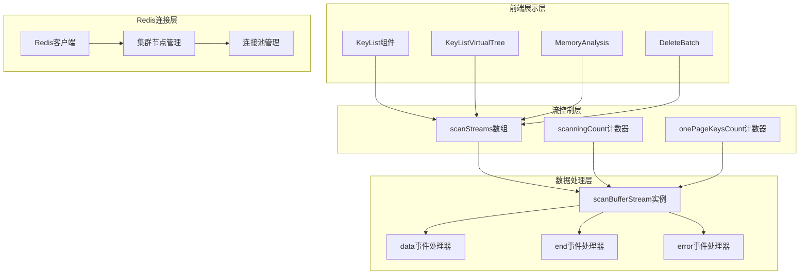
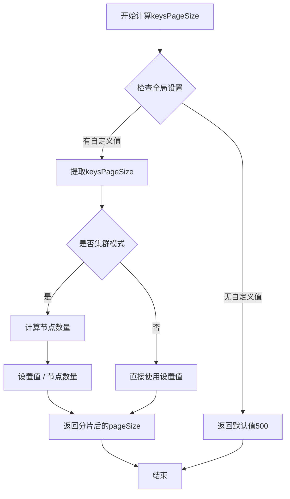
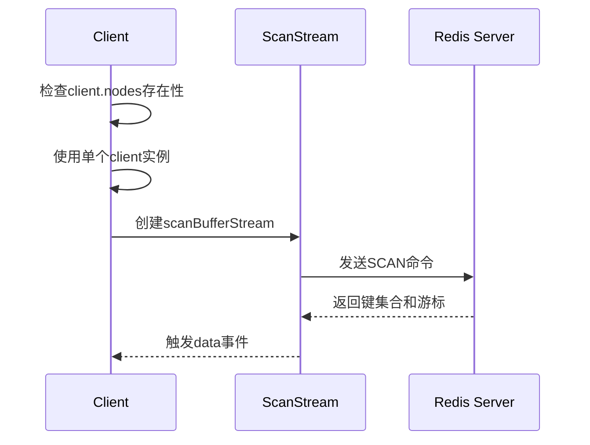
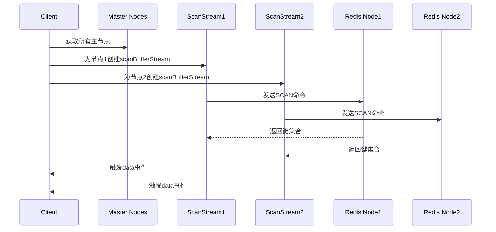
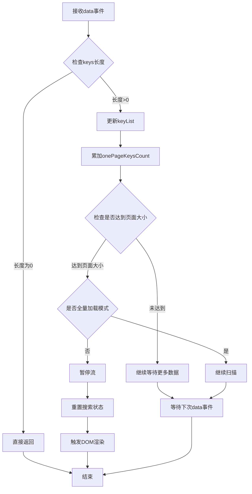
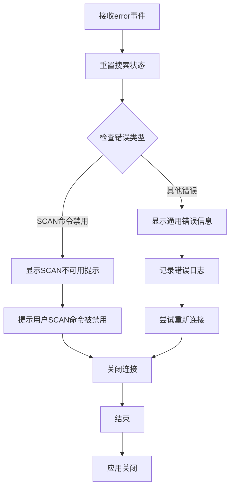
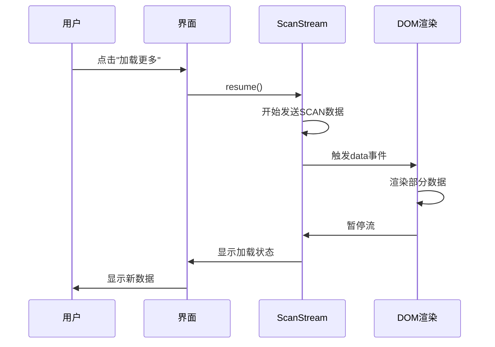
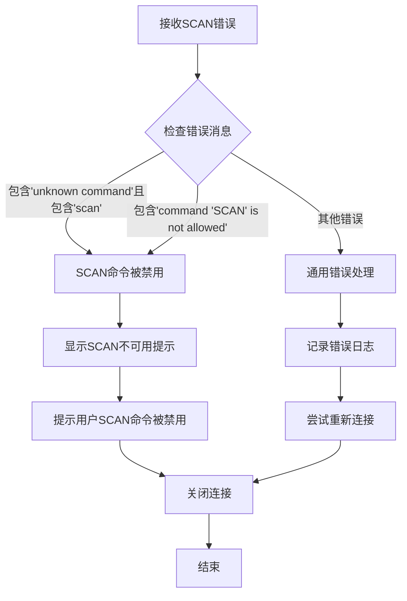
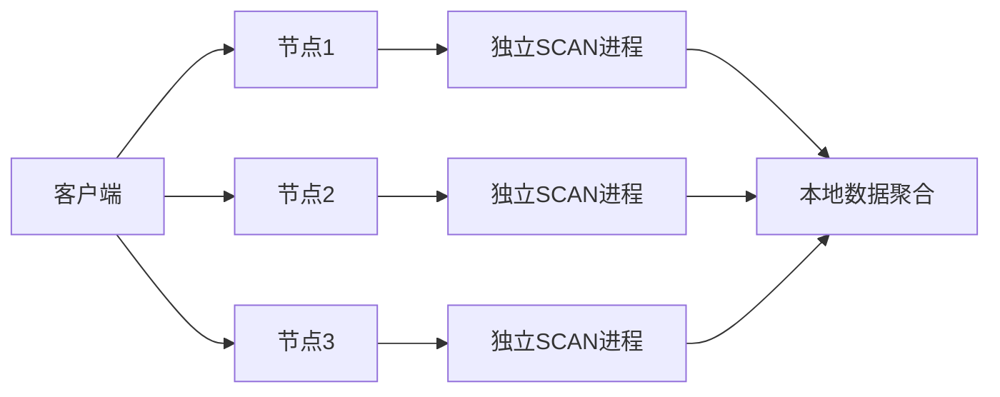

# 流式处理

<cite>
**本文档中引用的文件**
- [KeyList.vue](file://src/components/KeyList.vue)
- [KeyListVirtualTree.vue](file://src/components/KeyListVirtualTree.vue)
- [DeleteBatch.vue](file://src/components/DeleteBatch.vue)
- [MemoryAnalysis.vue](file://src/components/MemoryAnalysis.vue)
- [KeyContentSet.vue](file://src/components/contents/KeyContentSet.vue)
- [redisClient.js](file://src/redisClient.js)
- [util.js](file://src/util.js)
</cite>

## 目录
1. [简介](#简介)
2. [系统架构概览](#系统架构概览)
3. [KeyList组件核心机制](#keylist组件核心机制)
4. [scanBufferStream流实例管理](#scanbufferstream流实例管理)
5. [事件监听与处理逻辑](#事件监听与处理逻辑)
6. [流控机制详解](#流控机制详解)
7. [scanningCount计数器协调](#scanningcount计数器协调)
8. [loadAllKeys全量加载功能](#loadallkeys全量加载功能)
9. [错误恢复机制](#错误恢复机制)
10. [性能调优建议](#性能调优建议)
11. [最佳实践总结](#最佳实践总结)

## 简介

基于scanBufferStream的流式数据处理机制是Another Redis Desktop Manager中的核心技术之一，它为单机和集群模式下的Redis键值对数据提供了高效、可控制的大规模数据浏览能力。该机制通过流式处理避免了传统一次性加载大量数据导致的内存溢出和界面卡顿问题。

## 系统架构概览

整个流式处理系统采用分层架构设计，主要包含以下核心组件：



**图表来源**
- [KeyList.vue](file://src/components/KeyList.vue#L45-L222)
- [DeleteBatch.vue](file://src/components/DeleteBatch.vue#L45-L120)
- [MemoryAnalysis.vue](file://src/components/MemoryAnalysis.vue#L78-L162)

## KeyList组件核心机制

KeyList组件作为流式处理的核心控制器，负责协调整个扫描流程的执行。其核心数据结构包括：

### 核心状态管理

| 状态变量 | 类型 | 默认值 | 用途 |
|---------|------|--------|------|
| keyList | Array | [] | 存储最终的键列表 |
| scanStreams | Array | [] | 扫描流实例数组 |
| scanningCount | Number | 0 | 集群模式下待完成扫描的节点数量 |
| onePageKeysCount | Number | 0 | 当前页面已加载的键数量 |
| loadingAll | Boolean | false | 标识是否处于全量加载状态 |
| scanMoreDisabled | Boolean | false | 标识是否禁用"加载更多"按钮 |

### 分页大小计算逻辑



**图表来源**
- [KeyList.vue](file://src/components/KeyList.vue#L62-L77)

**章节来源**
- [KeyList.vue](file://src/components/KeyList.vue#L45-L77)

## scanBufferStream流实例管理

### 单机模式vs集群模式

系统根据Redis连接类型自动选择不同的扫描策略：

#### 单机模式处理


#### 集群模式处理


**图表来源**
- [KeyList.vue](file://src/components/KeyList.vue#L148-L150)
- [DeleteBatch.vue](file://src/components/DeleteBatch.vue#L71-L72)

### SCAN选项配置

不同场景下的SCAN命令参数配置策略：

| 场景 | match模式 | count值 | 特殊处理 |
|------|-----------|---------|----------|
| 正常浏览 | this.getMatchMode() | keysPageSize | 标准分页处理 |
| 全量加载 | this.getMatchMode() | 50000 | 增大扫描数量 |
| 搜索模式 | this.getMatchMode(false) | searchPageSize | 搜索专用页面大小 |
| 内存分析 | `${pattern}*` | scanPageSize | 内存分析专用 |

**章节来源**
- [KeyList.vue](file://src/components/KeyList.vue#L147-L161)
- [DeleteBatch.vue](file://src/components/DeleteBatch.vue#L75-L78)
- [MemoryAnalysis.vue](file://src/components/MemoryAnalysis.vue#L115-L118)

## 事件监听与处理逻辑

### data事件处理流程

data事件是流式处理的核心，负责接收和处理扫描到的键数据：



**图表来源**
- [KeyList.vue](file://src/components/KeyList.vue#L164-L177)

### end事件处理逻辑

end事件标识单个节点的扫描完成：

```mermaid
flowchart TD
A[接收end事件] --> B[scanningCount递减]
B --> C{检查计数器}
C --> |> 0| D[等待其他节点完成]
C --> |= 0| E[标记scanMoreDisabled为true]
E --> F[重置搜索状态]
F --> G[允许用户点击"加载更多"]
D --> H[继续等待]
G --> I[结束]
H --> I
```

**图表来源**
- [KeyList.vue](file://src/components/KeyList.vue#L205-L210)

### error事件处理机制

系统实现了完善的错误处理机制：



**图表来源**
- [KeyList.vue](file://src/components/KeyList.vue#L180-L202)

**章节来源**
- [KeyList.vue](file://src/components/KeyList.vue#L164-L210)
- [DeleteBatch.vue](file://src/components/DeleteBatch.vue#L83-L106)
- [MemoryAnalysis.vue](file://src/components/MemoryAnalysis.vue#L123-L160)

## 流控机制详解

### pause/resume暂停恢复机制

流控机制是确保系统稳定性的关键组件，通过精确控制数据流的传输速率来平衡性能和资源消耗：

#### 暂停机制的作用
1. **防止DOM过度渲染**：避免短时间内大量DOM操作导致界面卡顿
2. **控制内存使用**：限制同时存在于内存中的数据量
3. **提升用户体验**：保持界面响应性

#### 恢复机制的触发条件
- 用户点击"加载更多"按钮
- 数据处理完成后的异步回调
- 定时器到期后的自动恢复

### 分页加载中的流控策略



**图表来源**
- [KeyList.vue](file://src/components/KeyList.vue#L134-L136)
- [DeleteBatch.vue](file://src/components/DeleteBatch.vue#L87-L90)

**章节来源**
- [KeyList.vue](file://src/components/KeyList.vue#L134-L136)
- [DeleteBatch.vue](file://src/components/DeleteBatch.vue#L87-L90)
- [MemoryAnalysis.vue](file://src/components/MemoryAnalysis.vue#L125-L126)

## scanningCount计数器协调

### 多节点扫描完成状态协调

scanningCount计数器在集群环境中发挥着至关重要的作用，它确保只有当所有节点都完成扫描后才允许用户进行下一步操作：

#### 计数器初始化
```javascript
// 初始化时设置为节点数量
this.scanningCount = nodes.length;
```

#### 完成状态检测流程
```mermaid
flowchart TD
A[每个节点完成扫描] --> B[scanningCount递减]
B --> C{计数器是否<= 0}
C --> |否| D[继续等待其他节点]
C --> |是| E[所有节点扫描完成]
E --> F[设置scanMoreDisabled = true]
F --> G[允许用户点击"加载更多"]
D --> H[等待下一个节点完成]
H --> B
```

**图表来源**
- [KeyList.vue](file://src/components/KeyList.vue#L150-L151)
- [KeyList.vue](file://src/components/KeyList.vue#L207-L209)

### 集群环境下的同步机制

在集群环境中，多个节点可能同时返回数据，scanningCount确保了正确的同步状态：

| 节点状态 | scanningCount值 | UI行为 |
|----------|----------------|--------|
| 节点1开始扫描 | 3 | 显示加载动画 |
| 节点1完成扫描 | 2 | 继续等待其他节点 |
| 节点2完成扫描 | 1 | 继续等待最后一个节点 |
| 节点3完成扫描 | 0 | 允许用户点击"加载更多" |

**章节来源**
- [KeyList.vue](file://src/components/KeyList.vue#L150-L151)
- [KeyList.vue](file://src/components/KeyList.vue#L207-L209)
- [DeleteBatch.vue](file://src/components/DeleteBatch.vue#L73-L74)
- [MemoryAnalysis.vue](file://src/components/MemoryAnalysis.vue#L112-L113)

## loadAllKeys全量加载功能

### 功能实现原理

loadAllKeys方法通过增大count参数值来实现全量加载，突破常规的分页限制：

#### 参数调整策略
```mermaid
flowchart TD
A[调用loadAllKeys] --> B[重置keyList]
B --> C[设置loadingAll = true]
C --> D[显示搜索状态]
D --> E[调用initScanStreamsAndScan(true)]
E --> F{检查loadAll参数}
F --> |true| G[设置keysPageSize = 50000]
F --> |false| H[使用常规pageSize]
G --> I[创建scanBufferStream]
H --> I
I --> J[开始全量扫描]
J --> K[处理所有数据]
K --> L[完成加载]
```

**图表来源**
- [KeyList.vue](file://src/components/KeyList.vue#L139-L146)

### 性能影响分析

全量加载对系统性能的影响：

| 影响方面 | 正常模式 | 全量加载模式 | 影响程度 |
|----------|----------|--------------|----------|
| 内存使用 | 有限分页内存 | 整体数据内存 | 高 |
| CPU占用 | 间歇性处理 | 持续处理 | 中等 |
| 网络带宽 | 分批传输 | 连续传输 | 中等 |
| 界面响应 | 实时响应 | 可能卡顿 | 高 |

**章节来源**
- [KeyList.vue](file://src/components/KeyList.vue#L139-L146)

## 错误恢复机制

### SCAN命令禁用检测

系统能够智能识别SCAN命令被禁用的情况，并提供相应的用户提示：



**图表来源**
- [KeyList.vue](file://src/components/KeyList.vue#L183-L191)

### 错误分类处理策略

| 错误类型 | 检测方式 | 处理策略 | 用户提示 |
|----------|----------|----------|----------|
| SCAN命令禁用 | 错误消息包含特定关键词 | 显示友好提示 | "SCAN命令被禁用，请联系管理员" |
| 网络连接错误 | 连接超时或断开 | 自动重连机制 | "网络连接异常，正在重试..." |
| 权限不足 | 认证失败 | 强制断开连接 | "权限不足，无法访问数据" |
| 其他未知错误 | 通用错误处理 | 记录日志并断开 | "发生未知错误，请检查连接" |

**章节来源**
- [KeyList.vue](file://src/components/KeyList.vue#L180-L202)

## 性能调优建议

### keysPageSize参数优化

合理的keysPageSize设置对系统性能至关重要：

#### 设置原则
1. **小数据集**：设置为200-500，适合快速浏览
2. **中等数据集**：设置为1000-2000，平衡速度和内存
3. **大数据集**：设置为5000-10000，减少网络往返
4. **集群环境**：自动按节点数分片，避免单节点过载

#### 性能影响对比

| keysPageSize | 延迟特性 | 吞吐量 | 内存使用 | 推荐场景 |
|-------------|----------|--------|----------|----------|
| 200 | 快速响应 | 低 | 极低 | 小型数据库浏览 |
| 1000 | 中等响应 | 中等 | 中等 | 日常数据库管理 |
| 5000 | 较慢响应 | 高 | 高 | 大数据集分析 |
| 20000 | 慢响应 | 最高 | 最高 | 全量数据导出 |

### 流控参数调优

#### DOM渲染间隔优化
```javascript
// MemoryAnalysis中的渲染间隔设置
setTimeout(() => {
    this.keysList = this.keysList.concat(keysWithMemory);
    this.reOrder('desc');
    this.isScanning && stream.resume();
}, 100);
```

#### 批处理大小优化
- **DeleteBatch组件**：每次处理20000个键
- **MemoryAnalysis组件**：每次处理2000个键
- **KeyList组件**：根据配置动态调整

### 集群环境优化策略

#### 节点负载均衡


**图表来源**
- [KeyList.vue](file://src/components/KeyList.vue#L148-L150)

#### 网络优化建议
1. **连接池管理**：复用Redis连接，减少握手开销
2. **压缩传输**：启用Redis压缩功能
3. **批量操作**：合并多个SCAN请求

**章节来源**
- [KeyList.vue](file://src/components/KeyList.vue#L62-L77)
- [MemoryAnalysis.vue](file://src/components/MemoryAnalysis.vue#L90-L91)
- [DeleteBatch.vue](file://src/components/DeleteBatch.vue#L77)

## 最佳实践总结

### 开发最佳实践

1. **流控优先**：始终优先考虑流控机制，避免内存溢出
2. **错误处理**：完善错误处理逻辑，提供友好的用户提示
3. **状态管理**：清晰的状态管理有助于调试和维护
4. **资源清理**：及时清理不再需要的流实例和事件监听器

### 用户体验优化

1. **进度反馈**：提供明确的加载进度指示
2. **中断能力**：允许用户随时中断长时间运行的操作
3. **缓存策略**：合理利用缓存减少重复扫描
4. **响应式设计**：适应不同屏幕尺寸和设备类型

### 监控和诊断

1. **性能指标**：监控扫描时间、内存使用率等关键指标
2. **错误统计**：记录各类错误的发生频率和类型
3. **用户行为**：分析用户的操作习惯和偏好
4. **系统健康度**：定期检查系统的整体健康状况

通过以上机制的协同工作，基于scanBufferStream的流式数据处理系统能够高效、稳定地处理大规模Redis数据，为用户提供流畅的数据库管理体验。