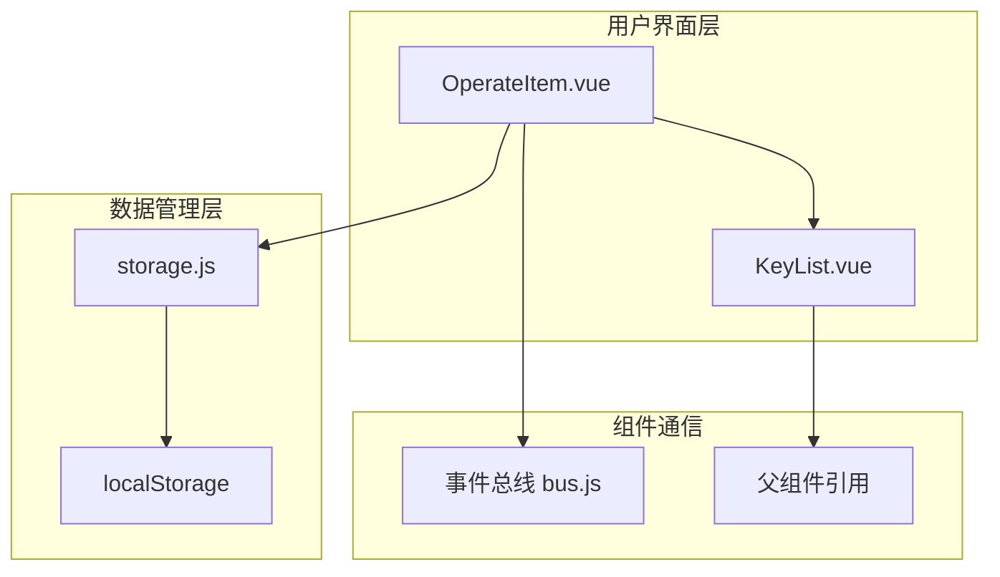
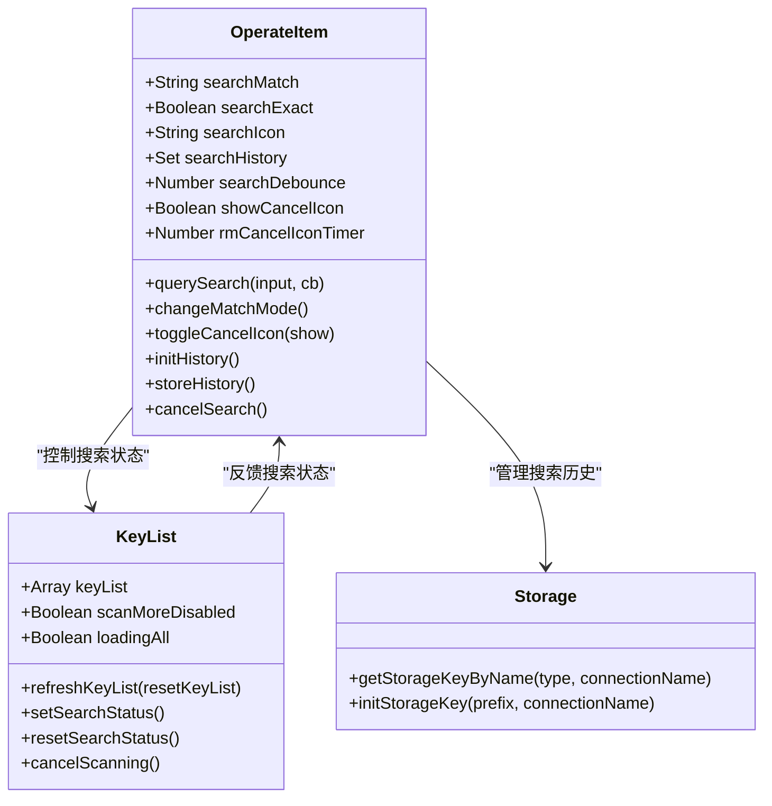
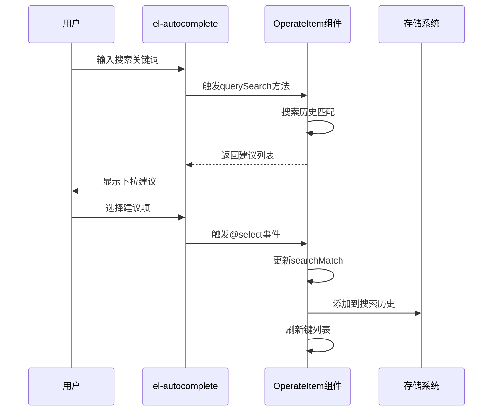
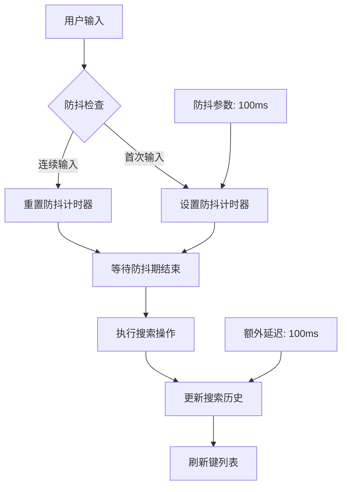
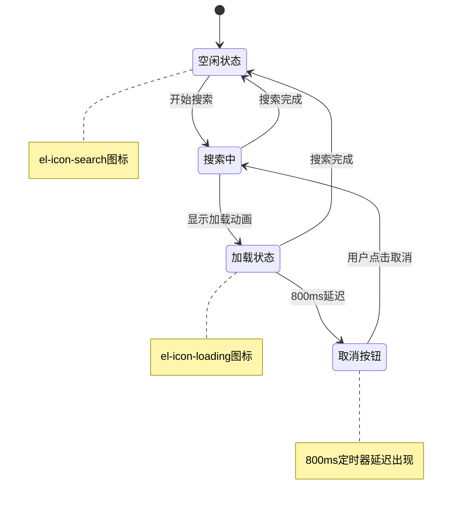
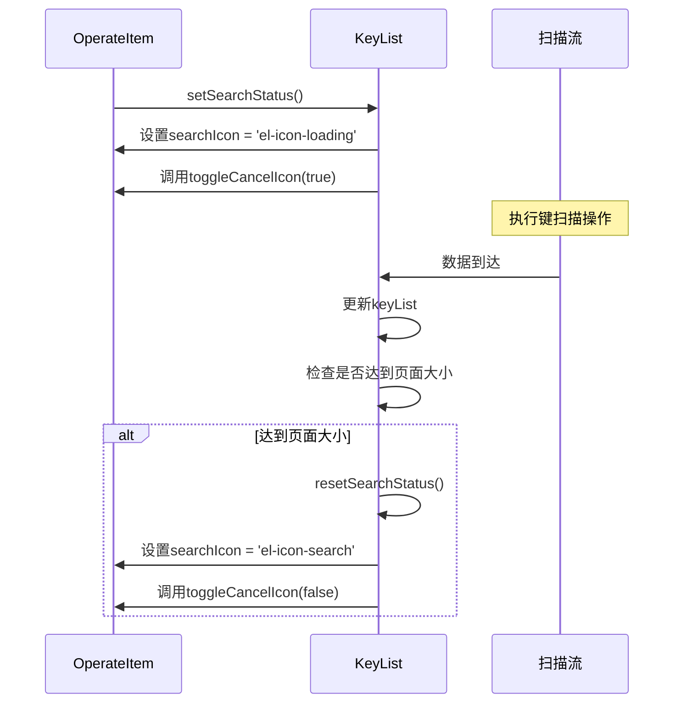
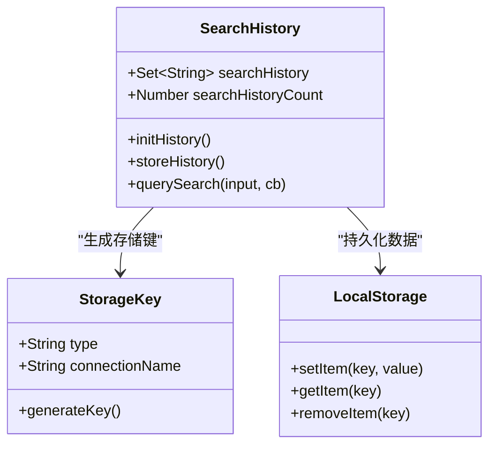
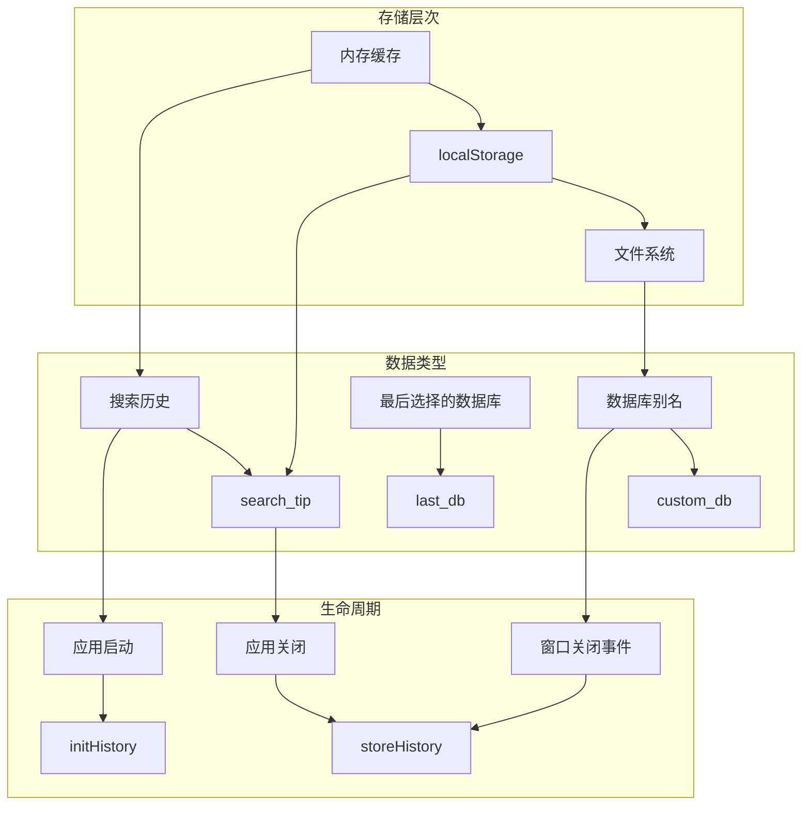
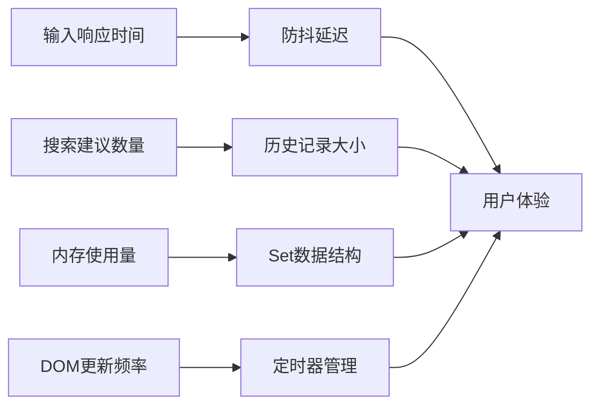

# 用户交互设计与实现：搜索过滤功能

<cite>
**本文档引用的文件**
- [OperateItem.vue](file://src/components/OperateItem.vue)
- [KeyList.vue](file://src/components/KeyList.vue)
- [storage.js](file://src/storage.js)
- [PaginationTable.vue](file://src/components/PaginationTable.vue)
- [en.js](file://src/i18n/langs/en.js)
</cite>

## 目录
1. [引言](#引言)
2. [项目结构概览](#项目结构概览)
3. [核心组件架构](#核心组件架构)
4. [el-autocomplete自动补全实现](#el-autocomplete自动补全实现)
5. [防抖机制与性能优化](#防抖机制与性能优化)
6. [视觉反馈系统](#视觉反馈系统)
7. [搜索历史管理](#搜索历史管理)
8. [用户体验细节](#用户体验细节)
9. [跨会话数据持久化](#跨会话数据持久化)
10. [故障排除指南](#故障排除指南)
11. [总结](#总结)

## 引言

本文档全面分析了Another Redis Desktop Manager中OperateItem组件的搜索过滤功能用户交互设计与实现。该功能通过el-autocomplete组件结合查询建议、搜索历史和防抖机制，为用户提供高效、直观的键值搜索体验。

## 项目结构概览

搜索过滤功能的核心实现分布在以下关键文件中：



**图表来源**
- [OperateItem.vue](file://src/components/OperateItem.vue#L1-L489)
- [KeyList.vue](file://src/components/KeyList.vue#L1-L350)
- [storage.js](file://src/storage.js#L1-L339)

## 核心组件架构

### OperateItem组件结构

OperateItem组件作为搜索功能的主要容器，集成了数据库选择、新键创建和搜索过滤三大核心功能模块：



**图表来源**
- [OperateItem.vue](file://src/components/OperateItem.vue#L107-L416)
- [KeyList.vue](file://src/components/KeyList.vue#L45-L350)
- [storage.js](file://src/storage.js#L320-L325)

**章节来源**
- [OperateItem.vue](file://src/components/OperateItem.vue#L107-L135)
- [KeyList.vue](file://src/components/KeyList.vue#L45-L60)

## el-autocomplete自动补全实现

### 组件配置与绑定

OperateItem组件中的el-autocomplete实现了智能搜索建议功能：



**图表来源**
- [OperateItem.vue](file://src/components/OperateItem.vue#L56-L77)
- [OperateItem.vue](file://src/components/OperateItem.vue#L365-L379)

### 查询建议算法

`querySearch`方法实现了智能的搜索建议匹配逻辑：

| 匹配条件 | 实现方式 | 性能特点 |
|---------|---------|---------|
| 大小写不敏感匹配 | `value.toLowerCase().indexOf(input.toLowerCase())` | 高效字符串查找 |
| 历史记录遍历 | `this.searchHistory.forEach()` | O(n)时间复杂度 |
| 空集合处理 | `if (!this.searchHistory.size)` | 避免不必要的计算 |
| 结果回调 | `cb(items)` | 异步响应模式 |

**章节来源**
- [OperateItem.vue](file://src/components/OperateItem.vue#L365-L379)

## 防抖机制与性能优化

### 防抖参数配置

搜索防抖机制通过`searchDebounce`参数控制输入响应频率：



**图表来源**
- [OperateItem.vue](file://src/components/OperateItem.vue#L117-L118)
- [OperateItem.vue](file://src/components/OperateItem.vue#L358-L361)

### 防抖机制实现细节

防抖机制的关键实现包括：

| 参数 | 值 | 作用 |
|------|---|------|
| `searchDebounce` | 100ms | 主要防抖延迟 |
| `setTimeout`延迟 | `searchDebounce + 100` | 额外延迟确保候选查询显示 |
| 历史记录添加时机 | 防抖结束后 | 避免频繁添加重复搜索 |

**章节来源**
- [OperateItem.vue](file://src/components/OperateItem.vue#L117-L118)
- [OperateItem.vue](file://src/components/OperateItem.vue#L358-L361)

## 视觉反馈系统

### 搜索状态指示器

系统通过多个视觉元素提供实时搜索状态反馈：



**图表来源**
- [OperateItem.vue](file://src/components/OperateItem.vue#L342-L351)
- [KeyList.vue](file://src/components/KeyList.vue#L223-L236)

### 取消按钮延迟机制

取消按钮的显示采用800ms延迟机制：

| 状态 | 显示条件 | 实现方式 |
|------|---------|---------|
| 隐藏 | 默认状态 | `showCancelIcon = false` |
| 延迟显示 | 搜索开始后800ms | `setTimeout(() => showCancelIcon = true, 800)` |
| 立即隐藏 | 搜索完成或取消 | `clearTimeout`清除定时器 |

**章节来源**
- [OperateItem.vue](file://src/components/OperateItem.vue#L342-L351)

### 加载状态管理

KeyList组件提供了完整的加载状态管理：



**图表来源**
- [KeyList.vue](file://src/components/KeyList.vue#L223-L236)
- [OperateItem.vue](file://src/components/OperateItem.vue#L342-L351)

**章节来源**
- [KeyList.vue](file://src/components/KeyList.vue#L223-L236)
- [OperateItem.vue](file://src/components/OperateItem.vue#L342-L351)

## 搜索历史管理

### 历史记录数据结构

搜索历史采用Set数据结构存储，确保唯一性：



**图表来源**
- [OperateItem.vue](file://src/components/OperateItem.vue#L117-L118)
- [storage.js](file://src/storage.js#L320-L325)

### 历史记录生命周期

搜索历史的完整生命周期管理：

| 阶段 | 操作 | 实现位置 |
|------|------|---------|
| 初始化 | 从localStorage加载历史 | `initHistory()` |
| 更新 | 添加新搜索记录 | `changeMatchMode()` |
| 存储 | 持久化到localStorage | `storeHistory()` |
| 清理 | 限制历史数量至200条 | `Array.from().slice(-200)` |

**章节来源**
- [OperateItem.vue](file://src/components/OperateItem.vue#L380-L401)

## 用户体验细节

### 回车键触发机制

系统支持多种方式触发搜索：

```mermaid
flowchart TD
A[用户输入] --> B{触发方式}
B --> |点击搜索图标| C[changeMatchMode]
B --> |按下回车键| D[@keyup.enter]
B --> |选择建议项| E[@select事件]
C --> F[添加到历史]
D --> F
E --> F
F --> G[刷新键列表]
G --> H[开始搜索流程]
```

**图表来源**
- [OperateItem.vue](file://src/components/OperateItem.vue#L59-L60)
- [OperateItem.vue](file://src/components/OperateItem.vue#L352-L364)

### 精确搜索模式

精确搜索功能通过复选框控制：

| 功能特性 | 实现方式 | 用户体验 |
|---------|---------|---------|
| 模式切换 | `searchExact`布尔值 | 即时生效 |
| 搜索行为 | 条件分支判断 | 不同的搜索策略 |
| 界面反馈 | 图标状态变化 | 直观的状态指示 |

**章节来源**
- [OperateItem.vue](file://src/components/OperateItem.vue#L116)
- [KeyList.vue](file://src/components/KeyList.vue#L119-L122)

## 跨会话数据持久化

### 存储策略设计

系统采用分层存储策略确保数据持久化：



**图表来源**
- [storage.js](file://src/storage.js#L320-L325)
- [OperateItem.vue](file://src/components/OperateItem.vue#L380-L401)

### 存储键命名规范

系统使用统一的存储键命名规范：

| 类型 | 前缀 | 示例 |
|------|------|------|
| 搜索提示 | `cliTips_` | `cliTips_connectionName` |
| 数据库别名 | `customDbName_` | `customDbName_connectionName` |
| 最后选择的数据库 | `lastSelectedDb_` | `lastSelectedDb_connectionName` |
| 搜索历史 | `searchTips_` | `searchTips_connectionName` |

**章节来源**
- [storage.js](file://src/storage.js#L310-L325)
- [OperateItem.vue](file://src/components/OperateItem.vue#L381-L382)

## 故障排除指南

### 常见问题诊断

| 问题症状 | 可能原因 | 解决方案 |
|---------|---------|---------|
| 搜索建议不显示 | 搜索历史为空 | 等待用户输入或手动添加测试数据 |
| 防抖效果不明显 | 防抖参数过小 | 调整`searchDebounce`参数 |
| 取消按钮不出现 | 定时器被提前清除 | 检查`cancelSearch`调用逻辑 |
| 历史记录丢失 | localStorage访问失败 | 检查浏览器存储权限 |

### 性能监控指标

关键性能指标的监控要点：



**章节来源**
- [OperateItem.vue](file://src/components/OperateItem.vue#L117-L118)
- [OperateItem.vue](file://src/components/OperateItem.vue#L342-L351)

## 总结

Another Redis Desktop Manager的搜索过滤功能通过精心设计的用户交互系统，为用户提供了高效、直观的键值搜索体验。该系统的核心优势包括：

1. **智能自动补全**：基于el-autocomplete的查询建议功能，结合搜索历史提供个性化建议
2. **性能优化**：通过防抖机制有效减少不必要的搜索请求，提升系统响应速度
3. **实时反馈**：多层级的视觉反馈系统，让用户随时了解搜索状态
4. **数据持久化**：完整的跨会话数据保存机制，确保用户体验的一致性
5. **灵活配置**：支持精确搜索等高级功能，满足不同用户的使用需求

该设计充分体现了现代Web应用中用户体验与技术实现的平衡，为大规模Redis数据管理提供了优秀的前端解决方案。