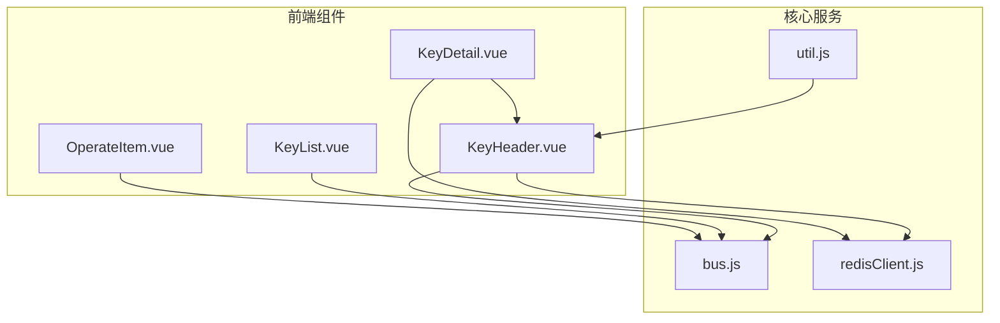
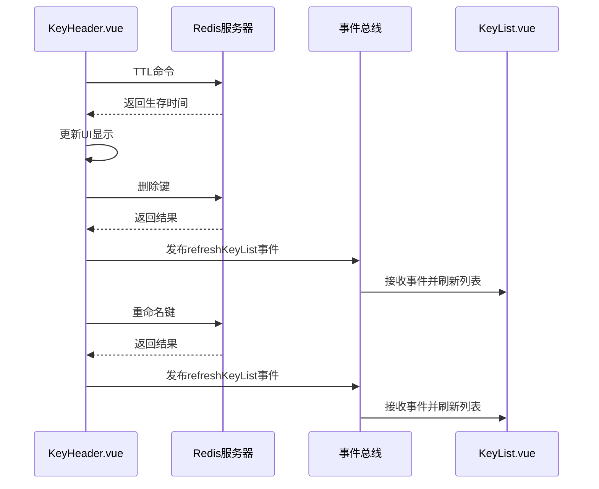
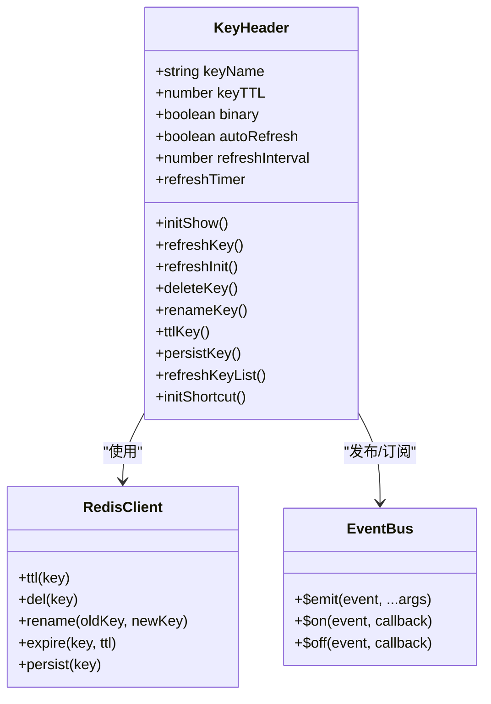
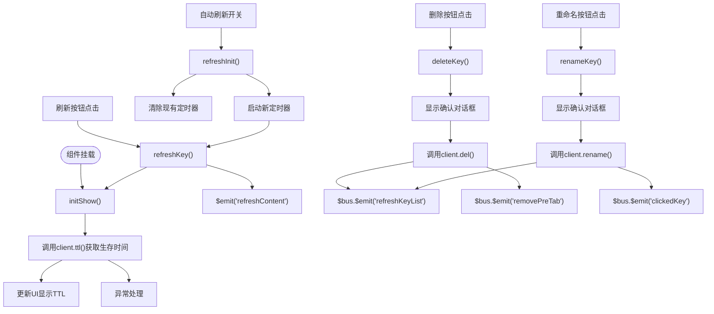
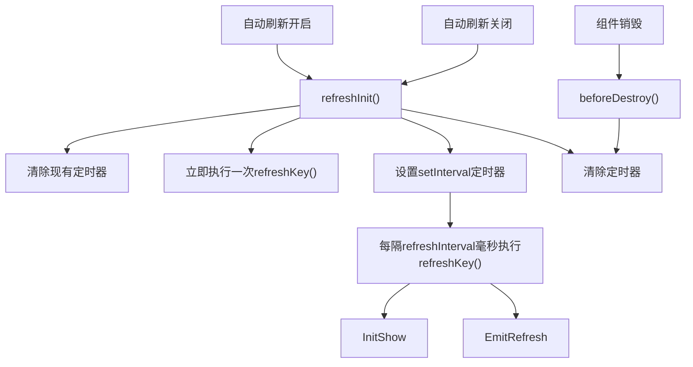
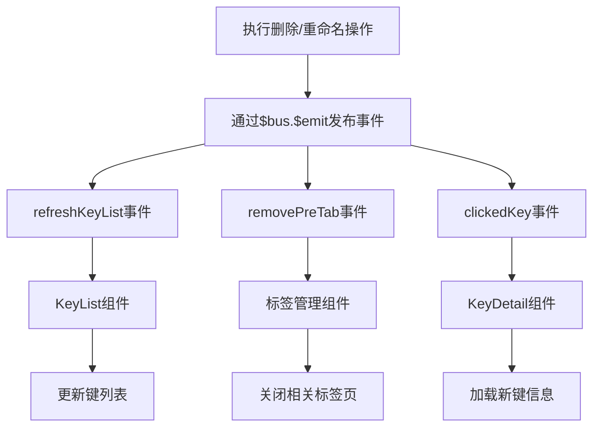
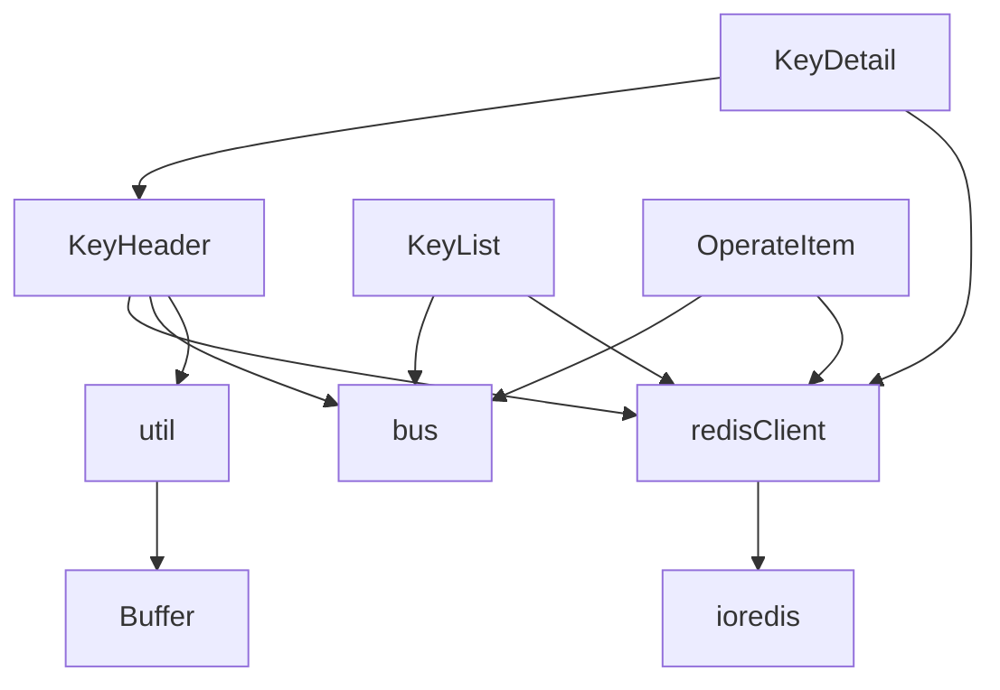

# 数据库统计信息

<cite>
**本文档引用的文件**  
- [KeyHeader.vue](file://src/components/KeyHeader.vue)
- [bus.js](file://src/bus.js)
- [redisClient.js](file://src/redisClient.js)
- [KeyDetail.vue](file://src/components/KeyDetail.vue)
- [KeyList.vue](file://src/components/KeyList.vue)
- [OperateItem.vue](file://src/components/OperateItem.vue)
- [util.js](file://src/util.js)
</cite>

## 目录
1. [引言](#引言)
2. [项目结构](#项目结构)
3. [核心组件](#核心组件)
4. [架构概述](#架构概述)
5. [详细组件分析](#详细组件分析)
6. [依赖分析](#依赖分析)
7. [性能考虑](#性能考虑)
8. [故障排除指南](#故障排除指南)
9. [结论](#结论)

## 引言
本文档深入文档化数据库统计信息的获取与展示机制，重点描述 `KeyHeader.vue` 组件如何通过 Redis TTL 命令获取键的生存时间，并实现自动刷新功能。文档详细解释了统计数据显示的实时性保障措施，包括定时器管理和状态同步机制。同时说明了在执行删除、重命名等操作后统计信息的更新策略，以及如何通过事件总线协调多个组件间的数据一致性。最后提供开发者接口文档，说明 `initShow`、`refreshKey` 等核心方法的调用时序和异常处理。

## 项目结构
本项目采用典型的 Vue.js 单页应用结构，主要组件集中在 `src/components` 目录下。数据库统计信息的核心功能由 `KeyHeader.vue` 组件实现，该组件负责获取和展示键的生存时间（TTL）信息。事件总线机制通过 `bus.js` 实现，用于协调多个组件间的数据一致性。Redis 客户端连接管理由 `redisClient.js` 负责，提供与 Redis 服务器的通信能力。

**图表来源**
- [KeyHeader.vue](file://src/components/KeyHeader.vue)
- [bus.js](file://src/bus.js)
- [redisClient.js](file://src/redisClient.js)

**本节来源**
- [KeyHeader.vue](file://src/components/KeyHeader.vue)
- [bus.js](file://src/bus.js)
- [redisClient.js](file://src/redisClient.js)

## 核心组件
`KeyHeader.vue` 是数据库统计信息展示的核心组件，负责获取和显示键的生存时间（TTL）信息。该组件通过 Redis 的 TTL 命令获取键的剩余生存时间，并提供手动刷新和自动刷新功能。组件还实现了删除、重命名和设置 TTL 等操作，通过事件总线与其他组件保持数据一致性。

**本节来源**
- [KeyHeader.vue](file://src/components/KeyHeader.vue)

## 架构概述
系统采用事件驱动架构，通过事件总线协调多个组件间的数据一致性。`KeyHeader.vue` 组件作为统计信息的展示层，通过 Redis 客户端与服务器通信获取 TTL 信息。当执行删除、重命名等操作时，通过事件总线发布相应事件，通知其他组件更新状态。

**图表来源**
- [KeyHeader.vue](file://src/components/KeyHeader.vue)
- [bus.js](file://src/bus.js)
- [redisClient.js](file://src/redisClient.js)

## 详细组件分析

### KeyHeader组件分析
`KeyHeader.vue` 组件实现了数据库统计信息的获取与展示功能，包括 TTL 获取、自动刷新、删除和重命名等操作。

#### 对象关系图

**图表来源**
- [KeyHeader.vue](file://src/components/KeyHeader.vue)
- [redisClient.js](file://src/redisClient.js)
- [bus.js](file://src/bus.js)

#### 功能调用流程

**图表来源**
- [KeyHeader.vue](file://src/components/KeyHeader.vue)

**本节来源**
- [KeyHeader.vue](file://src/components/KeyHeader.vue)

### 统计信息实时性保障机制
系统通过定时器管理和状态同步机制确保统计信息的实时性。

#### 定时器管理流程

**图表来源**
- [KeyHeader.vue](file://src/components/KeyHeader.vue)

#### 状态同步机制

**图表来源**
- [KeyHeader.vue](file://src/components/KeyHeader.vue)
- [KeyList.vue](file://src/components/KeyList.vue)
- [KeyDetail.vue](file://src/components/KeyDetail.vue)

**本节来源**
- [KeyHeader.vue](file://src/components/KeyHeader.vue)
- [KeyList.vue](file://src/components/KeyList.vue)
- [KeyDetail.vue](file://src/components/KeyDetail.vue)

## 依赖分析
系统各组件之间通过清晰的依赖关系协同工作，确保数据库统计信息的准确获取和展示。

**图表来源**
- [KeyHeader.vue](file://src/components/KeyHeader.vue)
- [KeyDetail.vue](file://src/components/KeyDetail.vue)
- [KeyList.vue](file://src/components/KeyList.vue)
- [OperateItem.vue](file://src/components/OperateItem.vue)
- [redisClient.js](file://src/redisClient.js)
- [util.js](file://src/util.js)

**本节来源**
- [KeyHeader.vue](file://src/components/KeyHeader.vue)
- [KeyDetail.vue](file://src/components/KeyDetail.vue)
- [KeyList.vue](file://src/components/KeyList.vue)
- [OperateItem.vue](file://src/components/OperateItem.vue)

## 性能考虑
系统在设计时考虑了性能优化，通过合理的定时器管理和事件传播机制，避免不必要的资源消耗。自动刷新功能允许用户根据需要开启或关闭，避免持续的服务器请求。事件总线机制确保只有相关组件接收到更新通知，减少不必要的重新渲染。

## 故障排除指南
当遇到数据库统计信息显示异常时，可参考以下排查步骤：

1. **检查 Redis 连接状态**：确保与 Redis 服务器的连接正常
2. **验证 TTL 命令权限**：确认当前用户有执行 TTL 命令的权限
3. **检查自动刷新设置**：确认自动刷新间隔设置合理，避免过于频繁的请求
4. **查看浏览器控制台**：检查是否有 JavaScript 错误或网络请求失败
5. **验证事件总线**：确认事件总线正常工作，事件能够正确发布和订阅

**本节来源**
- [KeyHeader.vue](file://src/components/KeyHeader.vue)
- [bus.js](file://src/bus.js)

## 结论
本文档详细分析了数据库统计信息的获取与展示机制，重点介绍了 `KeyHeader.vue` 组件如何通过 Redis TTL 命令获取键的生存时间，并实现自动刷新功能。系统通过事件总线机制确保多个组件间的数据一致性，在执行删除、重命名等操作后能够及时更新统计信息。提供的开发者接口文档说明了 `initShow`、`refreshKey` 等核心方法的调用时序和异常处理，为后续开发和维护提供了指导。