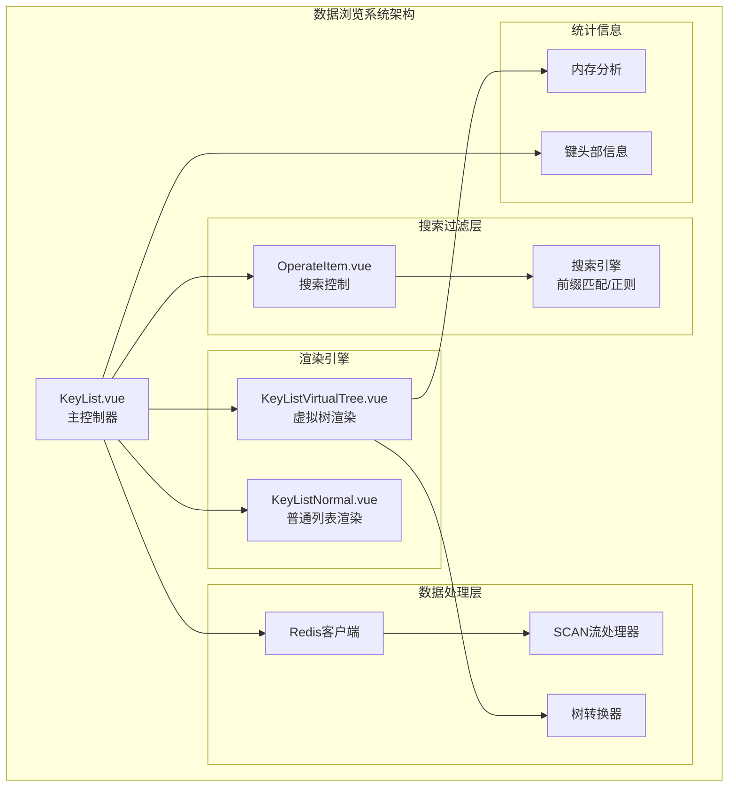
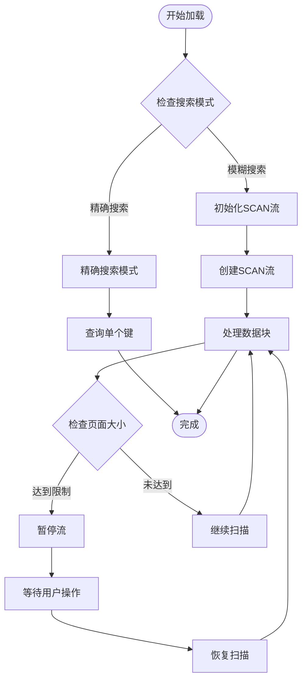
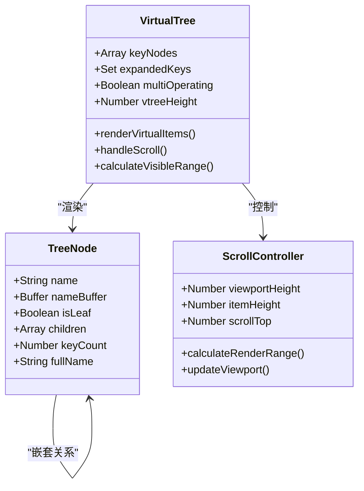
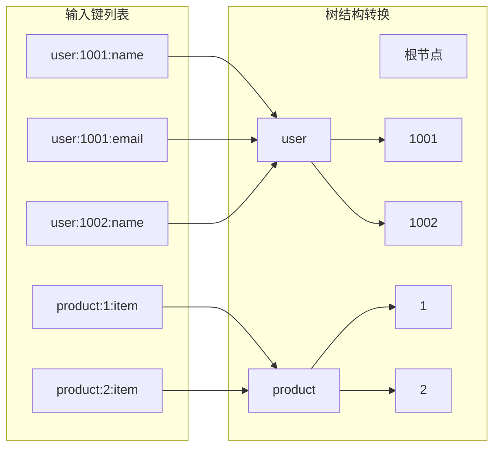
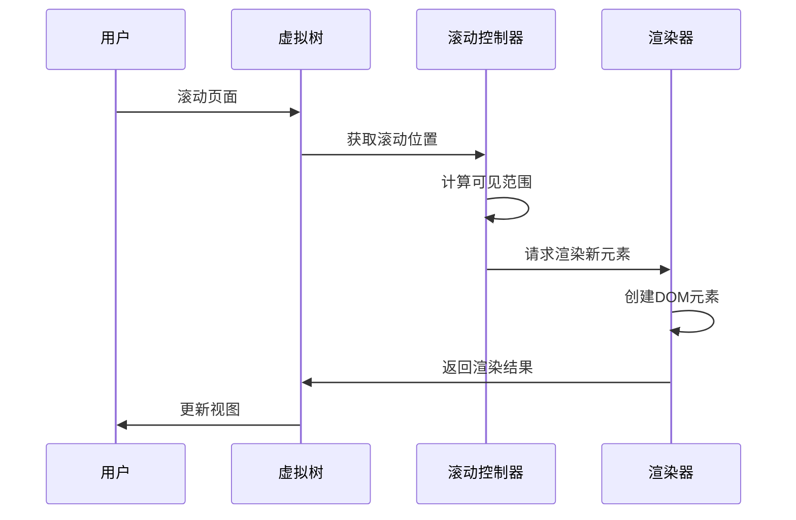
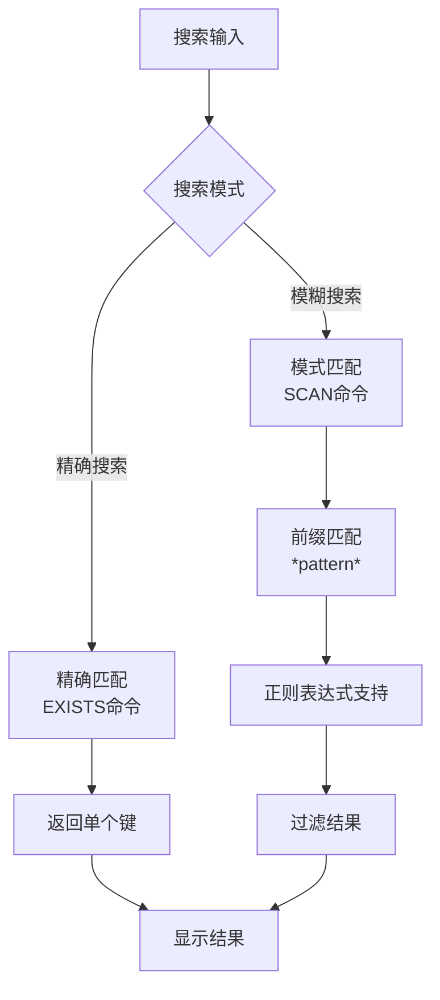
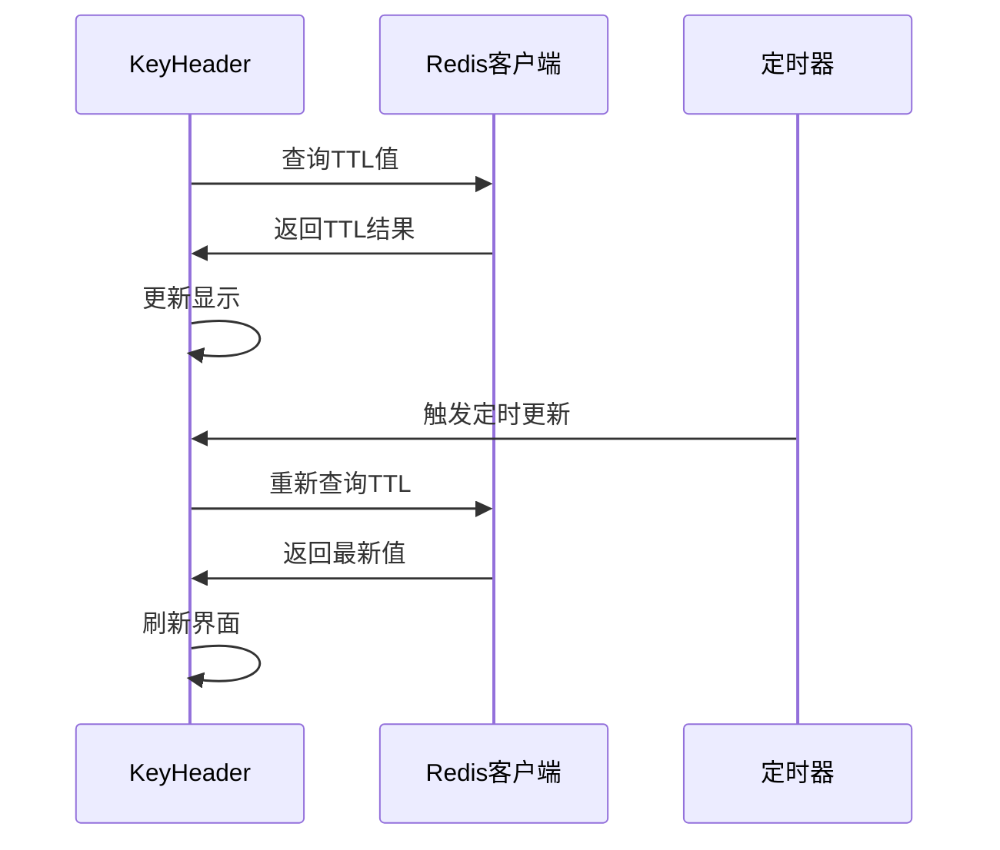
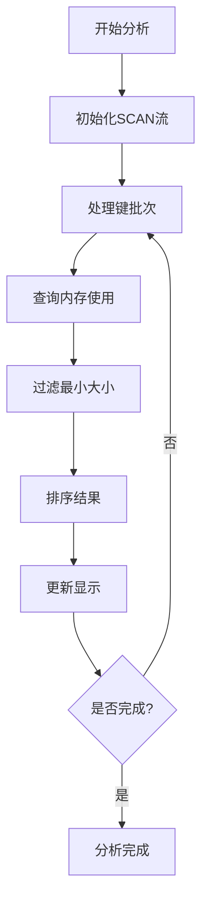
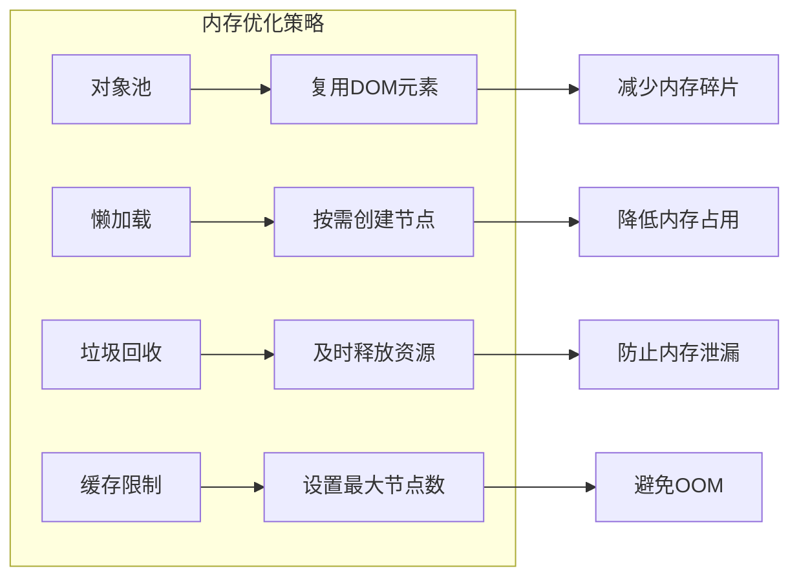

# 数据浏览功能深度文档

<cite>
**本文档引用的文件**
- [KeyList.vue](file://src/components/KeyList.vue)
- [KeyListVirtualTree.vue](file://src/components/KeyListVirtualTree.vue)
- [KeyListNormal.vue](file://src/components/KeyListNormal.vue)
- [KeyHeader.vue](file://src/components/KeyHeader.vue)
- [OperateItem.vue](file://src/components/OperateItem.vue)
- [MemoryAnalysis.vue](file://src/components/MemoryAnalysis.vue)
- [util.js](file://src/util.js)
</cite>

## 目录
1. [概述](#概述)
2. [系统架构](#系统架构)
3. [核心组件分析](#核心组件分析)
4. [虚拟滚动技术](#虚拟滚动技术)
5. [搜索过滤功能](#搜索过滤功能)
6. [数据库统计信息](#数据库统计信息)
7. [性能优化策略](#性能优化策略)
8. [用户操作指南](#用户操作指南)
9. [开发者参考](#开发者参考)
10. [故障排除](#故障排除)

## 概述

数据浏览功能是Another Redis Desktop Manager的核心组件，负责高效展示和管理Redis数据库中的键列表。该功能采用多层次架构设计，支持大规模数据集的流畅浏览，同时提供强大的搜索、过滤和交互功能。

### 主要特性

- **双模式渲染**：支持普通列表模式和虚拟树模式，适应不同数据规模
- **虚拟滚动**：针对数万级键的大规模数据集优化，避免页面卡顿
- **智能搜索**：支持前缀匹配、精确搜索和正则表达式
- **实时统计**：动态显示数据库统计信息和内存占用
- **批量操作**：支持多选、批量删除和导出功能

## 系统架构



**架构图来源**
- [KeyList.vue](file://src/components/KeyList.vue#L1-L50)
- [KeyListVirtualTree.vue](file://src/components/KeyListVirtualTree.vue#L1-L50)
- [OperateItem.vue](file://src/components/OperateItem.vue#L1-L50)

## 核心组件分析

### KeyList.vue - 主控制器

KeyList.vue作为整个数据浏览系统的主控制器，负责协调各个子组件的工作。

#### 核心功能

1. **扫描流管理**：通过Redis SCAN命令实现增量加载
2. **搜索状态控制**：管理搜索过程中的UI状态
3. **批量操作支持**：提供导出和批量删除功能

#### 关键算法



**流程图来源**
- [KeyList.vue](file://src/components/KeyList.vue#L112-L180)

**节源**
- [KeyList.vue](file://src/components/KeyList.vue#L1-L350)

### KeyListVirtualTree.vue - 虚拟树渲染

虚拟树组件专为大规模数据集设计，采用虚拟滚动技术实现高性能渲染。

#### 虚拟滚动实现



**类图来源**
- [KeyListVirtualTree.vue](file://src/components/KeyListVirtualTree.vue#L78-L120)

#### 树结构转换

系统将扁平的键列表转换为层次化的树结构：



**流程图来源**
- [util.js](file://src/util.js#L240-L299)

**节源**
- [KeyListVirtualTree.vue](file://src/components/KeyListVirtualTree.vue#L1-L623)

### KeyListNormal.vue - 普通列表渲染

对于较小的数据集，系统提供简洁的列表渲染模式。

#### 渲染特点

- **简单直接**：逐项渲染，无复杂布局
- **快速响应**：适合少量键的快速浏览
- **内存友好**：占用较少的DOM元素

**节源**
- [KeyListNormal.vue](file://src/components/KeyListNormal.vue#L1-L100)

## 虚拟滚动技术

### 实现原理

虚拟滚动技术通过只渲染可视区域内的元素来显著提升性能：



**序列图来源**
- [KeyListVirtualTree.vue](file://src/components/KeyListVirtualTree.vue#L390-L427)

### 性能优化策略

1. **可视区域计算**：
   - 动态计算当前可见的节点范围
   - 预留缓冲区避免频繁重绘

2. **懒加载机制**：
   - 只渲染当前可见的节点
   - 按需加载子节点数据

3. **内存管理**：
   - 自动回收不可见的DOM元素
   - 限制最大节点数量防止内存溢出

**节源**
- [KeyListVirtualTree.vue](file://src/components/KeyListVirtualTree.vue#L390-L427)

## 搜索过滤功能

### 搜索模式

系统提供多种搜索模式以满足不同的查询需求：



**流程图来源**
- [OperateItem.vue](file://src/components/OperateItem.vue#L352-L364)
- [KeyList.vue](file://src/components/KeyList.vue#L237-L247)

### 实时响应机制

搜索功能采用防抖技术确保用户体验：

1. **输入防抖**：延迟100ms执行搜索
2. **自动完成**：基于历史记录提供智能提示
3. **状态反馈**：搜索过程中显示加载动画

**节源**
- [OperateItem.vue](file://src/components/OperateItem.vue#L1-L200)

## 数据库统计信息

### KeyHeader.vue - 键头部信息

KeyHeader组件负责显示当前选中键的详细信息：

#### 统计指标

| 指标类型 | 描述 | 获取方式 |
|---------|------|----------|
| 键名称 | 当前键的完整名称 | Redis GET/SET命令 |
| 键类型 | 字符串、哈希、列表等 | TYPE命令 |
| TTL值 | 剩余生存时间 | TTL命令 |
| 内存占用 | 键的内存使用量 | MEMORY USAGE命令 |

#### 实时更新机制



**序列图来源**
- [KeyHeader.vue](file://src/components/KeyHeader.vue#L88-L100)

**节源**
- [KeyHeader.vue](file://src/components/KeyHeader.vue#L1-L308)

### MemoryAnalysis.vue - 内存分析

内存分析组件提供全面的数据库内存使用情况统计：

#### 分析流程



**流程图来源**
- [MemoryAnalysis.vue](file://src/components/MemoryAnalysis.vue#L103-L162)

**节源**
- [MemoryAnalysis.vue](file://src/components/MemoryAnalysis.vue#L1-L331)

## 性能优化策略

### 大规模数据处理

针对包含数万级键的大规模数据库，系统采用以下优化策略：

1. **分页加载**：
   - 默认每页500个键
   - 支持自定义页面大小
   - 增量加载避免一次性加载过多数据

2. **智能缓存**：
   - 缓存展开状态
   - 记住用户选择的键
   - 避免重复计算树结构

3. **异步处理**：
   - 使用Promise链处理多个键
   - 非阻塞的内存查询
   - 并行处理多个节点

### 内存管理



## 用户操作指南

### 基本操作

1. **刷新键列表**：
   - 快捷键：Ctrl+R 或 F5
   - 手动点击刷新按钮
   - 自动刷新功能（可配置）

2. **搜索键**：
   - 输入模式：`user:*` 匹配所有user开头的键
   - 精确搜索：勾选精确匹配选项
   - 搜索历史：自动保存常用搜索模式

3. **导航操作**：
   - 单击：打开键详情
   - Ctrl+单击：在新标签页打开
   - 右键菜单：访问上下文操作

### 高级功能

1. **批量操作**：
   - 多选模式：点击"多选"按钮
   - Shift+点击：连续选择多个键
   - 全选/取消：使用顶部复选框

2. **内存分析**：
   - 启动分析：点击内存分析按钮
   - 过滤设置：设置最小内存阈值
   - 排序查看：按内存使用量排序

3. **树形视图**：
   - 展开/折叠：点击文件夹图标
   - 导航到文件夹：右键选择"加载当前文件夹"
   - 删除文件夹：右键选择"删除文件夹"

## 开发者参考

### 虚拟滚动实现细节

#### 滚动容器监听

虚拟树组件通过监听滚动事件来动态调整渲染范围：

```javascript
// 滚动事件处理示例（概念性代码）
handleScroll(event) {
  const scrollTop = event.target.scrollTop;
  const viewportHeight = event.target.clientHeight;
  
  // 计算可见范围
  const startIndex = Math.floor(scrollTop / itemHeight);
  const endIndex = Math.min(
    startIndex + Math.ceil(viewportHeight / itemHeight),
    totalItems
  );
  
  // 更新渲染范围
  this.renderStart = startIndex;
  this.renderEnd = endIndex;
}
```

#### 可视区域计算

```javascript
// 可视区域计算算法
calculateVisibleRange() {
  const scrollTop = this.$refs.treeWrapper.scrollTop;
  const itemHeight = 22; // 固定行高
  
  const startIndex = Math.floor(scrollTop / itemHeight);
  const visibleCount = Math.ceil(this.viewportHeight / itemHeight);
  const endIndex = Math.min(startIndex + visibleCount, this.keyNodes.length);
  
  return { startIndex, endIndex };
}
```

#### 动态渲染策略

1. **预渲染缓冲**：额外渲染20%的节点避免滚动时的空白
2. **优先级渲染**：先渲染可见区域，后渲染缓冲区
3. **渐进式加载**：大数据集分批渲染，避免阻塞主线程

### 工具函数详解

#### keysToTree函数

该函数是树结构转换的核心，将扁平的键列表转换为层次化的树形结构：

```javascript
// 树转换算法概览
keysToTree(keys, separator = ':', openStatus = {}, forceCut = 20000) {
  const tree = {};
  
  // 构建树结构
  keys.forEach(key => {
    let currentNode = tree;
    const keyStr = this.bufToString(key);
    const keySplited = keyStr.split(separator);
    
    keySplited.forEach((value, index) => {
      if (index === lastIndex) {
        // 键节点
        currentNode[`${keyStr}\`k\``] = { keyNode: true, nameBuffer: key };
      } else {
        // 文件夹节点
        if (!currentNode[value]) {
          currentNode[value] = {};
        }
      }
      currentNode = currentNode[value];
    });
  });
  
  return this.formatTreeData(tree, '', openStatus, separator, forceCut);
}
```

#### sortByTreeNodes函数

对树节点进行智能排序，保持文件夹在前、键在后的顺序：

```javascript
// 排序算法
sortByTreeNodes(nodes) {
  nodes.sort((a, b) => {
    // 文件夹vs键：文件夹排在前面
    if (a.isLeaf && !b.isLeaf) return 1;
    if (!a.isLeaf && b.isLeaf) return -1;
    
    // 同类型比较名称
    return a.label > b.label ? 1 : -1;
  });
}
```

**节源**
- [util.js](file://src/util.js#L240-L331)

## 故障排除

### 常见问题及解决方案

#### 页面卡顿问题

**症状**：浏览大量键时页面响应缓慢

**原因分析**：
1. 虚拟滚动配置不当
2. 树结构过于复杂
3. 内存不足

**解决方案**：
1. 调整页面大小设置
2. 减少树分隔符的复杂度
3. 启用内存分析清理大键

#### 搜索无响应

**症状**：输入搜索条件后没有结果

**排查步骤**：
1. 检查Redis SCAN命令是否可用
2. 验证搜索模式是否正确
3. 查看网络连接状态

#### 内存分析失败

**症状**：内存分析无法启动或中途停止

**解决方法**：
1. 确认Redis MEMORY命令可用
2. 调整最小内存阈值
3. 检查Redis版本兼容性

### 性能监控

系统提供了多种性能监控指标：

| 指标 | 监控方法 | 正常范围 |
|------|----------|----------|
| 渲染时间 | 浏览器开发者工具 | < 100ms |
| 内存使用 | 任务管理器 | < 500MB |
| 键加载速度 | 控制台日志 | < 2秒/1000键 |
| 搜索响应 | 网络面板 | < 500ms |

### 最佳实践

1. **合理设置页面大小**：根据硬件性能调整
2. **定期清理大键**：使用内存分析功能
3. **优化搜索模式**：使用具体的前缀而非通配符
4. **监控系统资源**：关注CPU和内存使用情况

通过以上深度分析，我们可以看到Another Redis Desktop Manager的数据浏览功能是一个精心设计的高性能系统，它巧妙地平衡了功能丰富性和用户体验，为用户提供了强大而流畅的Redis数据管理体验。