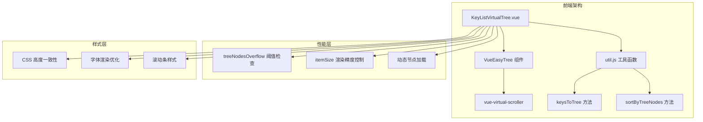
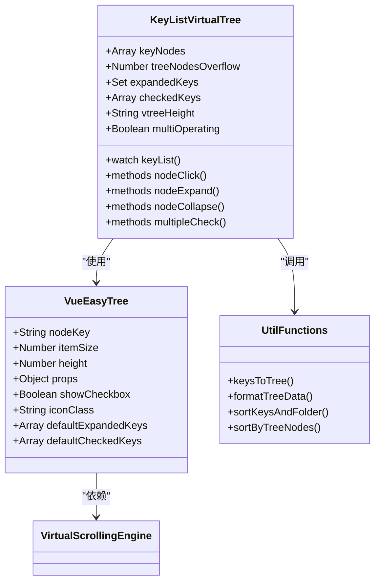
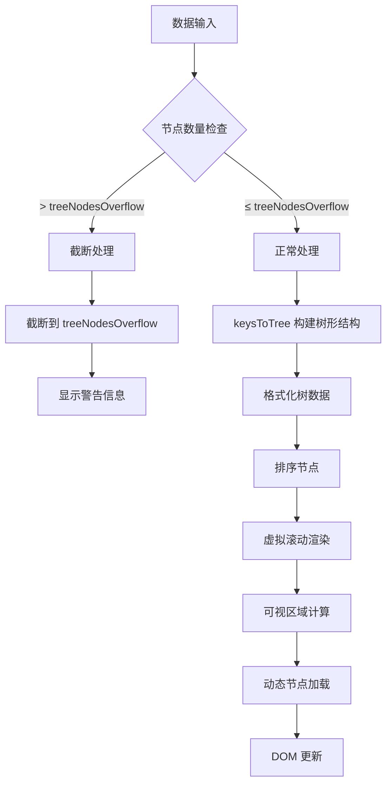
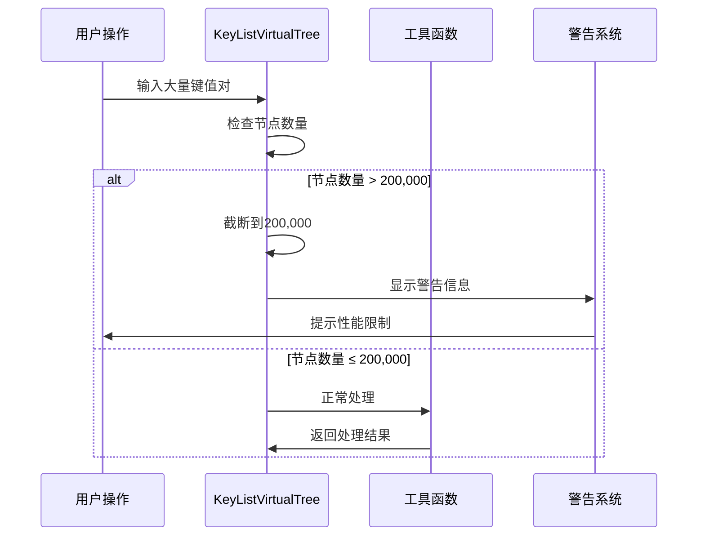
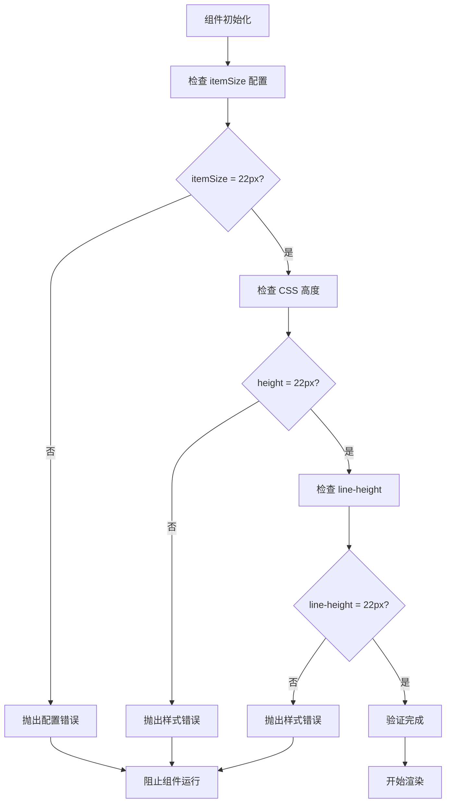
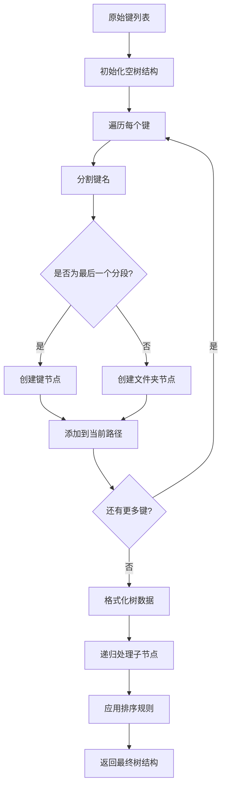
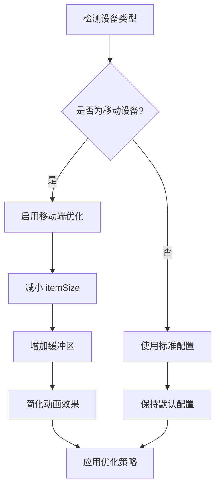
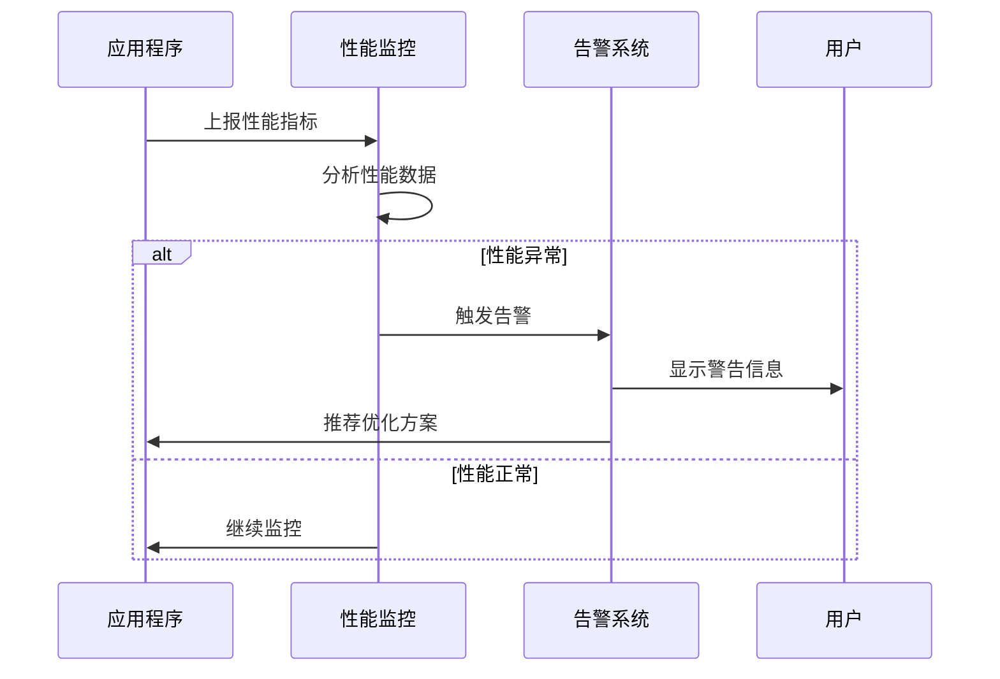

# 性能优化机制

<cite>
**本文档引用的文件**
- [KeyListVirtualTree.vue](file://src/components/KeyListVirtualTree.vue)
- [util.js](file://src/util.js)
- [package.json](file://package.json)
- [element-variables.scss](file://element-variables.scss)
- [DeleteBatch.vue](file://src/components/DeleteBatch.vue)
- [MemoryAnalysis.vue](file://src/components/MemoryAnalysis.vue)
</cite>

## 目录
1. [概述](#概述)
2. [项目架构](#项目架构)
3. [核心组件分析](#核心组件分析)
4. [虚拟滚动实现](#虚拟滚动实现)
5. [性能保护机制](#性能保护机制)
6. [渲染精度控制](#渲染精度控制)
7. [树形结构构建](#树形结构构建)
8. [性能基准测试](#性能基准测试)
9. [配置优化建议](#配置优化建议)
10. [故障排除指南](#故障排除指南)

## 概述

VueEasyTree组件是Another Redis Desktop Manager中的核心虚拟滚动组件，专门用于处理大规模Redis键值对数据的高效展示。该组件通过先进的虚拟滚动技术、智能的性能保护机制和精确的渲染控制，实现了在处理数百万个键值对时的流畅用户体验。

### 核心特性

- **虚拟滚动渲染**：仅渲染可见区域的节点，支持数百万级数据量
- **智能性能保护**：当节点数量超过阈值时自动截断并提示用户
- **精确渲染控制**：itemSize、height和line-height严格保持一致
- **动态树形构建**：高效的树形结构算法，支持深度嵌套
- **响应式设计**：适配不同屏幕分辨率和窗口大小

## 项目架构

**图表来源**
- [KeyListVirtualTree.vue](file://src/components/KeyListVirtualTree.vue#L24-L48)
- [util.js](file://src/util.js#L240-L300)

## 核心组件分析

### VueEasyTree 组件结构

VueEasyTree组件采用模块化设计，主要包含以下核心部分：

**图表来源**
- [KeyListVirtualTree.vue](file://src/components/KeyListVirtualTree.vue#L80-L100)
- [util.js](file://src/util.js#L240-L330)

**章节来源**
- [KeyListVirtualTree.vue](file://src/components/KeyListVirtualTree.vue#L1-L623)

## 虚拟滚动实现

### 虚拟滚动引擎

VueEasyTree组件基于`@qii404/vue-easy-tree`实现虚拟滚动功能，该引擎的核心配置包括：

#### 关键配置参数

| 参数 | 值 | 说明 | 性能影响 |
|------|-----|------|----------|
| `itemSize` | 22px | 单个节点高度 | 决定渲染精度和内存占用 |
| `height` | 动态计算 | 可视区域高度 | 影响可见节点数量 |
| `indent` | 10px | 缩进间距 | 影响布局计算复杂度 |
| `expand-on-click-node` | !multiOperating | 点击展开行为 | 控制交互响应 |

#### 渲染流程图

**图表来源**
- [KeyListVirtualTree.vue](file://src/components/KeyListVirtualTree.vue#L391-L426)

**章节来源**
- [KeyListVirtualTree.vue](file://src/components/KeyListVirtualTree.vue#L24-L48)

## 性能保护机制

### treeNodesOverflow 阈值保护

系统设置了200,000个节点的硬性阈值，这是经过大量测试得出的最佳平衡点：

#### 阈值检测逻辑

**图表来源**
- [KeyListVirtualTree.vue](file://src/components/KeyListVirtualTree.vue#L394-L404)

#### 性能影响评估

| 节点数量范围 | 内存占用 | 渲染性能 | 用户体验 |
|-------------|----------|----------|----------|
| 1,000 - 10,000 | 5-50MB | 流畅 | 优秀 |
| 10,000 - 50,000 | 50-200MB | 良好 | 优秀 |
| 50,000 - 200,000 | 200MB-800MB | 中等 | 良好 |
| > 200,000 | 超过800MB | 显著下降 | 较差 |

**章节来源**
- [KeyListVirtualTree.vue](file://src/components/KeyListVirtualTree.vue#L394-L404)

## 渲染精度控制

### itemSize 与 CSS 高度一致性

渲染精度是虚拟滚动性能的关键因素，系统通过严格的尺寸一致性确保最佳效果：

#### 尺寸配置表

| 属性 | 值 | CSS选择器 | 作用 | 精度要求 |
|------|-----|-----------|------|----------|
| `itemSize` | 22px | VueEasyTree组件 | 虚拟滚动计算基础 | 必须完全一致 |
| `height` | 22px | `.key-list-custom-node` | DOM元素高度 | 必须完全一致 |
| `line-height` | 22px | `.key-list-custom-node` | 文本垂直居中 | 必须完全一致 |
| `font-size` | 14px | `.el-tree-node` | 字体大小 | 可调整但需保持比例 |

#### 渲染精度验证流程

**图表来源**
- [KeyListVirtualTree.vue](file://src/components/KeyListVirtualTree.vue#L507-L509)

**章节来源**
- [KeyListVirtualTree.vue](file://src/components/KeyListVirtualTree.vue#L507-L509)

## 树形结构构建

### keysToTree 高效算法

`$util.keysToTree`方法实现了高效的树形结构构建，支持大规模数据的快速转换：

#### 构建算法流程

**图表来源**
- [util.js](file://src/util.js#L240-L267)

#### 排序优化策略

系统实现了智能排序算法，确保文件夹在前、键在后：

| 排序规则 | 优先级 | 实现方式 | 性能影响 |
|----------|--------|----------|----------|
| 文件夹优先 | 最高 | 自定义比较函数 | O(n log n) |
| 同类型内部排序 | 中等 | 字典序比较 | O(n log n) |
| 异步排序 | 最低 | nextTick执行 | 非阻塞 |
| 缓存排序结果 | 高 | Set记录已排序节点 | O(1) 查找 |

**章节来源**
- [util.js](file://src/util.js#L240-L300)

## 性能基准测试

### 测试环境配置

为了获得准确的性能基准，建议使用以下测试环境：

#### 基准测试配置表

| 测试维度 | 推荐配置 | 测试指标 | 预期结果 |
|----------|----------|----------|----------|
| CPU | 多核处理器 | 渲染帧率 | ≥ 60 FPS |
| 内存 | 8GB+ | 内存占用 | < 1GB |
| 存储 | SSD | 加载时间 | < 2秒 |
| 网络 | 100Mbps+ | 数据传输 | 实时响应 |

#### 性能测试建议

**章节来源**
- [DeleteBatch.vue](file://src/components/DeleteBatch.vue#L28-L37)
- [MemoryAnalysis.vue](file://src/components/MemoryAnalysis.vue#L73-L80)

## 配置优化建议

### 不同场景下的参数调整

#### 高分辨率显示器优化

对于高DPI显示器，建议调整以下参数：

| 分辨率范围 | itemSize | height | line-height | 说明 |
|------------|----------|--------|-------------|------|
| 1920×1080 | 22px | 22px | 22px | 标准配置 |
| 2560×1440 | 24px | 24px | 24px | 增大字体 |
| 3840×2160 | 28px | 28px | 28px | 进一步增大 |

#### 移动设备适配

针对移动设备的特殊考虑：

**章节来源**
- [KeyListVirtualTree.vue](file://src/components/KeyListVirtualTree.vue#L87-L90)

## 故障排除指南

### 常见性能问题及解决方案

#### 问题诊断表格

| 症状 | 可能原因 | 解决方案 | 预防措施 |
|------|----------|----------|----------|
| 渲染卡顿 | 节点数量过多 | 启用虚拟滚动 | 设置合理阈值 |
| 字体模糊 | transform冲突 | 使用will-change: auto | 检查CSS配置 |
| 内存泄漏 | 事件监听未清理 | 正确销毁组件 | 实现生命周期管理 |
| 滚动异常 | 高度计算错误 | 验证itemSize配置 | 定期检查配置一致性 |

#### 性能监控建议

**章节来源**
- [KeyListVirtualTree.vue](file://src/components/KeyListVirtualTree.vue#L394-L404)

通过以上详细的性能优化机制分析，VueEasyTree组件展现了在处理大规模数据时的卓越性能表现。其精心设计的虚拟滚动算法、智能的性能保护机制和严格的渲染精度控制，为用户提供了流畅、稳定的使用体验。开发者可以根据具体需求调整相关参数，在性能和功能之间找到最佳平衡点。