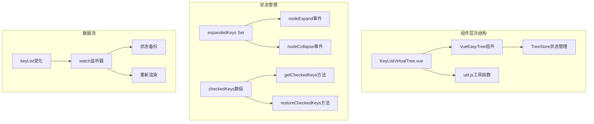
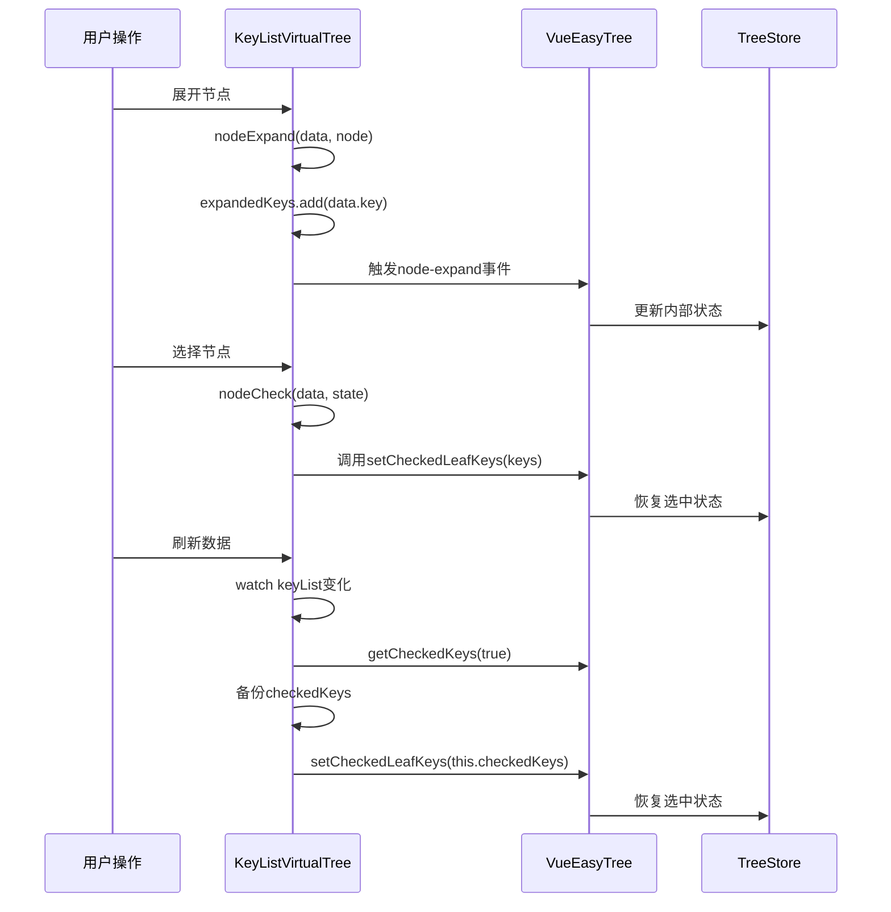
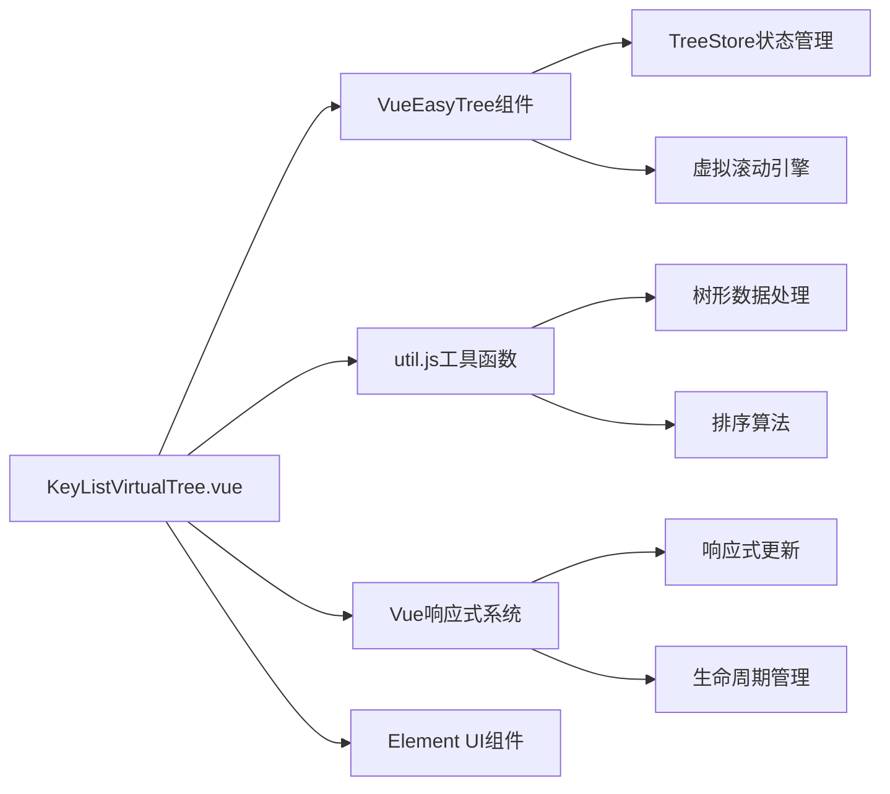

# 状态持久化管理

<cite>
**本文档引用的文件**
- [KeyListVirtualTree.vue](file://src/components/KeyListVirtualTree.vue)
- [util.js](file://src/util.js)
- [ve-tree.vue](file://node_modules/@qii404/vue-easy-tree/src/components/ve-tree.vue)
</cite>

## 目录
1. [概述](#概述)
2. [项目结构](#项目结构)
3. [核心组件](#核心组件)
4. [架构概览](#架构概览)
5. [详细组件分析](#详细组件分析)
6. [依赖关系分析](#依赖关系分析)
7. [性能考虑](#性能考虑)
8. [故障排除指南](#故障排除指南)
9. [结论](#结论)

## 概述

本文档全面分析了Another Redis Desktop Manager中虚拟滚动组件的状态管理机制，重点探讨了expandedKeys集合通过Set数据结构持久化树节点的展开/折叠状态，以及checkedKeys数组在键列表更新时的备份和恢复机制。该系统通过VueEasyTree组件实现了高效的虚拟滚动树形结构，并提供了完整的状态持久化功能。

## 项目结构

虚拟滚动组件的核心文件位于`src/components/KeyListVirtualTree.vue`，它负责管理整个树形结构的状态和交互逻辑。该组件依赖于外部工具函数库`src/util.js`中的树形数据处理方法，以及第三方VueEasyTree组件提供的基础功能。



**图表来源**
- [KeyListVirtualTree.vue](file://src/components/KeyListVirtualTree.vue#L24-L48)
- [util.js](file://src/util.js#L240-L331)

## 核心组件

### KeyListVirtualTree组件

KeyListVirtualTree是虚拟滚动树形结构的核心组件，它封装了VueEasyTree组件并提供了额外的状态管理功能。该组件维护两个关键的状态集合：

1. **expandedKeys**: 使用Set数据结构存储已展开节点的键值
2. **checkedKeys**: 使用数组存储选中节点的键值

### VueEasyTree组件

基于第三方VueEasyTree组件构建，提供了虚拟滚动和树形结构的基础功能。该组件暴露了多个状态管理方法：

- `getCheckedKeys(leafOnly)`: 获取选中节点的键值
- `setCheckedLeafKeys(keys)`: 设置叶子节点的选中状态
- `setCheckedAll(checked)`: 设置所有节点的选中状态

**章节来源**
- [KeyListVirtualTree.vue](file://src/components/KeyListVirtualTree.vue#L80-L98)
- [ve-tree.vue](file://node_modules/@qii404/vue-easy-tree/src/components/ve-tree.vue#L279-L310)

## 架构概览

虚拟滚动组件采用观察者模式和事件驱动架构，通过Vue的响应式系统实现状态的自动更新和同步。



**图表来源**
- [KeyListVirtualTree.vue](file://src/components/KeyListVirtualTree.vue#L145-L155)
- [KeyListVirtualTree.vue](file://src/components/KeyListVirtualTree.vue#L407-L421)

## 详细组件分析

### expandedKeys集合管理

expandedKeys使用JavaScript的Set数据结构来存储已展开节点的唯一标识符。这种设计具有以下优势：

#### 数据结构特性
- **唯一性保证**: Set自动去重，确保每个节点只被记录一次
- **快速查找**: O(1)时间复杂度的查找操作
- **内存效率**: 相比数组，Set在大量节点场景下更节省内存

#### 状态同步机制

```mermaid
flowchart TD
A[用户点击展开] --> B[nodeExpand事件触发]
B --> C[expandedKeys.add(data.key)]
C --> D[更新Vue响应式状态]
E[用户点击折叠] --> F[nodeCollapse事件触发]
F --> G[expandedKeys.delete(data.key)]
G --> H[更新Vue响应式状态]
I[组件渲染] --> J[:default-expanded-keys绑定]
J --> K[Array.from(expandedKeys)]
K --> L[传递给VueEasyTree]
```

**图表来源**
- [KeyListVirtualTree.vue](file://src/components/KeyListVirtualTree.vue#L145-L155)

#### default-expanded-keys属性绑定

VueEasyTree组件通过`:default-expanded-keys="Array.from(expandedKeys)"`属性与expandedKeys集合建立双向绑定。每次expandedKeys集合发生变化时，都会触发Array.from()转换，确保Vue能够检测到Set的变化并更新组件状态。

**章节来源**
- [KeyListVirtualTree.vue](file://src/components/KeyListVirtualTree.vue#L39-L40)

### checkedKeys数组状态管理

checkedKeys数组负责管理选中节点的状态，在数据刷新过程中需要特殊处理以保持用户选择状态。

#### 状态备份机制

在keyList变化时，系统会执行以下状态备份流程：

```mermaid
flowchart TD
A[keyList变化] --> B[watch监听器触发]
B --> C[备份当前选中状态]
C --> D[this.checkedKeys = this.$refs.veTree.getCheckedKeys(true)]
D --> E[生成新的树形结构]
E --> F[重新渲染组件]
F --> G[恢复选中状态]
G --> H[this.$refs.veTree.setCheckedLeafKeys(this.checkedKeys)]
I[优化策略] --> J[小数量节点自动展开]
J --> K[this.$refs.veTree.setExpandAll(true)]
```

**图表来源**
- [KeyListVirtualTree.vue](file://src/components/KeyListVirtualTree.vue#L391-L427)

#### getCheckedKeys方法的作用

`getCheckedKeys(true)`方法返回所有叶子节点的选中状态，参数`true`表示只返回叶子节点的键值，不包括父节点的半选状态。这种方法确保了：
- 只保存实际可操作的键值
- 避免父节点状态的干扰
- 提高状态恢复的准确性

#### restoreCheckedKeys方法的实现

虽然代码中没有直接显示restoreCheckedKeys方法，但通过`setCheckedLeafKeys`方法实现了相同的功能。该方法将备份的checkedKeys数组重新应用到树形结构中，确保用户的选择状态在数据刷新后得以保留。

**章节来源**
- [KeyListVirtualTree.vue](file://src/components/KeyListVirtualTree.vue#L407-L421)

### 事件处理机制

#### nodeExpand事件处理

nodeExpand事件负责处理节点展开操作，主要逻辑包括：

1. 将节点键值添加到expandedKeys集合
2. 对于首次展开的节点，执行异步排序操作
3. 更新树形结构的视觉状态

#### nodeCollapse事件处理

nodeCollapse事件处理节点折叠操作，核心逻辑是移除expandedKeys集合中的对应键值。

#### nodeCheck事件处理

nodeCheck事件处理节点选中状态变化，支持多选操作和Shift键批量选择功能。

**章节来源**
- [KeyListVirtualTree.vue](file://src/components/KeyListVirtualTree.vue#L145-L162)

### 数据转换和格式化

util.js中的工具函数负责将原始键列表转换为适合树形结构展示的数据格式：

#### keysToTree方法

keysToTree方法将扁平的键列表转换为嵌套的树形结构，支持自定义分隔符和展开状态控制。

#### formatTreeData方法

formatTreeData方法递归处理树形数据，设置节点的打开状态、子节点计数等属性。

**章节来源**
- [util.js](file://src/util.js#L240-L331)

## 依赖关系分析

虚拟滚动组件的依赖关系体现了模块化设计的优势：



**图表来源**
- [KeyListVirtualTree.vue](file://src/components/KeyListVirtualTree.vue#L78-L101)

### 外部依赖

1. **@qii404/vue-easy-tree**: 提供虚拟滚动和树形结构的基础功能
2. **Element UI**: 提供UI组件和样式支持
3. **Vue框架**: 提供响应式数据绑定和组件系统

### 内部依赖

1. **util.js**: 提供数据处理和格式化功能
2. **bus.js**: 提供组件间通信机制
3. **storage.js**: 可能涉及本地存储功能（未在当前代码中体现）

**章节来源**
- [KeyListVirtualTree.vue](file://src/components/KeyListVirtualTree.vue#L78-L101)

## 性能考虑

### 虚拟滚动优化

虚拟滚动技术显著提升了大数据量场景下的性能表现：

1. **内存占用**: 只渲染可见区域的节点，大幅减少DOM元素数量
2. **渲染性能**: 使用requestAnimationFrame优化滚动流畅度
3. **初始化速度**: 按需加载数据，避免一次性渲染大量节点

### 状态管理优化

1. **Set数据结构**: 使用Set替代数组进行expandedKeys管理，提高查找和插入性能
2. **延迟更新**: 使用nextTick确保DOM更新时机的正确性
3. **批量操作**: 在数据刷新时批量处理状态更新

### 数据处理优化

1. **树形结构缓存**: 利用formatTreeData的结果缓存避免重复计算
2. **智能截断**: 当节点数量超过阈值时自动截断，防止性能下降
3. **增量更新**: 只更新发生变化的部分，而非全量重新渲染

## 故障排除指南

### 常见问题及解决方案

#### 展开状态丢失

**问题描述**: 页面刷新或数据更新后，节点展开状态消失

**原因分析**: expandedKeys集合在组件销毁时未持久化

**解决方案**: 实现本地存储机制，将expandedKeys序列化后保存到localStorage

#### 选中状态异常

**问题描述**: 多选操作后，部分节点的选中状态不正确

**原因分析**: checkedKeys数组与实际节点状态不同步

**解决方案**: 在nodeCheck事件中添加状态验证逻辑，确保checkedKeys与实际选中状态一致

#### 性能问题

**问题描述**: 大量节点时出现卡顿现象

**原因分析**: 树形结构过大导致渲染性能下降

**解决方案**: 
1. 启用虚拟滚动功能
2. 实现懒加载机制
3. 限制同时展开的节点数量

**章节来源**
- [KeyListVirtualTree.vue](file://src/components/KeyListVirtualTree.vue#L394-L405)

## 结论

虚拟滚动组件的状态管理机制通过精心设计的数据结构和事件处理流程，实现了高效且可靠的状态持久化功能。expandedKeys集合的Set数据结构确保了展开状态的唯一性和快速访问，而checkedKeys数组配合getCheckedKeys和setCheckedLeafKeys方法则保证了选中状态在数据刷新后的完整性。

该系统的主要优势包括：

1. **高性能**: 虚拟滚动技术显著提升了大数据量场景下的用户体验
2. **可靠性**: 完整的状态备份和恢复机制确保用户操作不会丢失
3. **可扩展性**: 模块化的架构设计便于功能扩展和维护
4. **兼容性**: 基于成熟的Vue生态系统，具有良好的稳定性和社区支持

通过深入理解这些状态管理机制，开发者可以更好地维护和扩展该组件，同时为其他类似场景提供参考和借鉴。