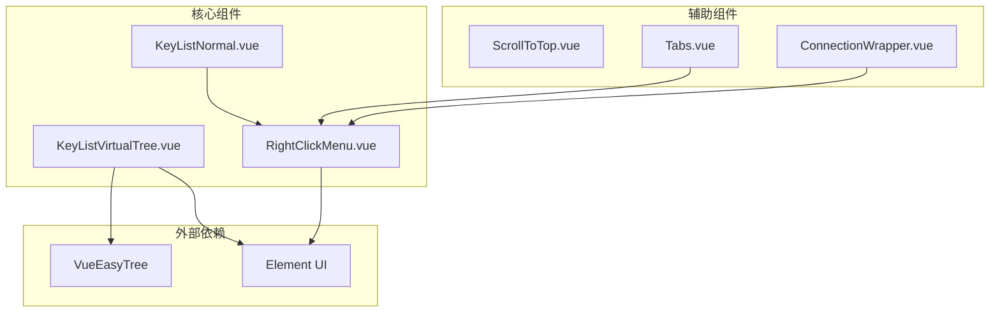
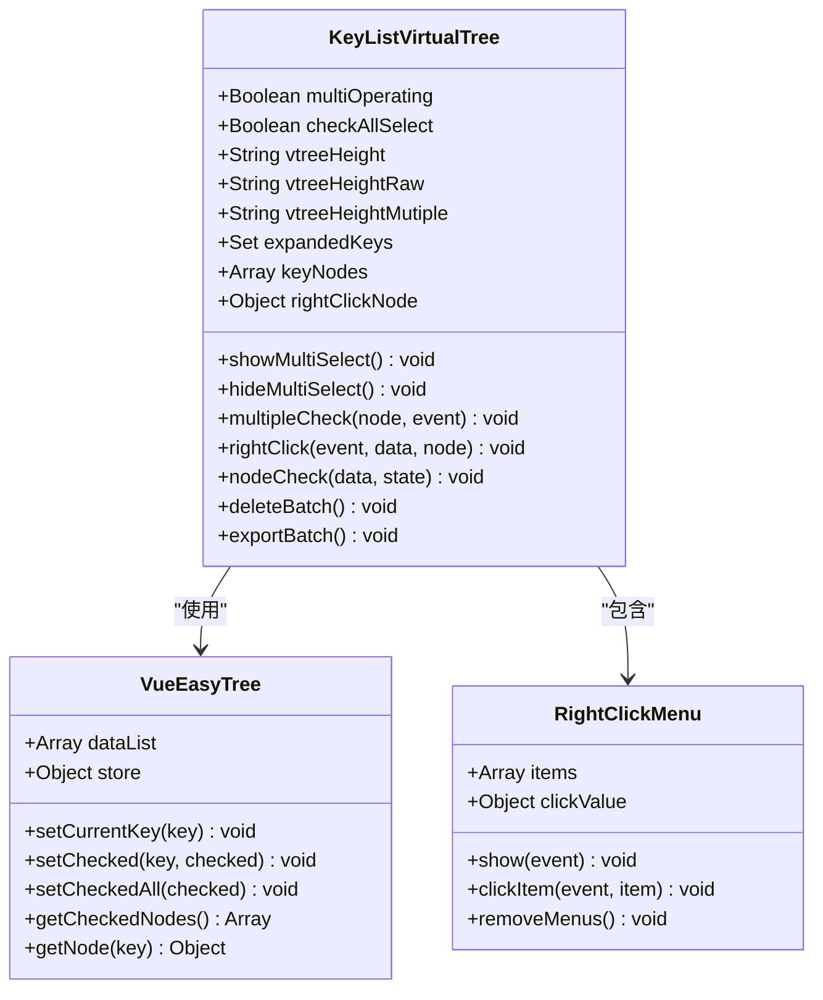
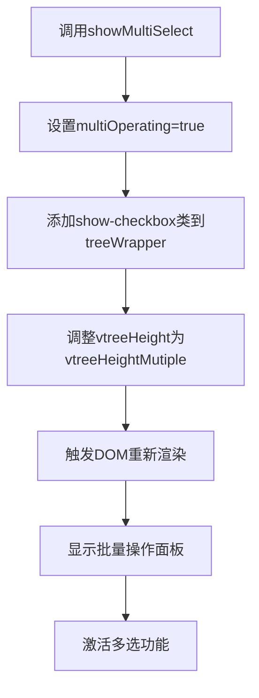
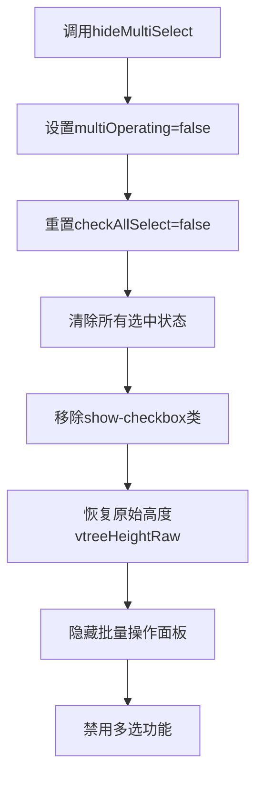
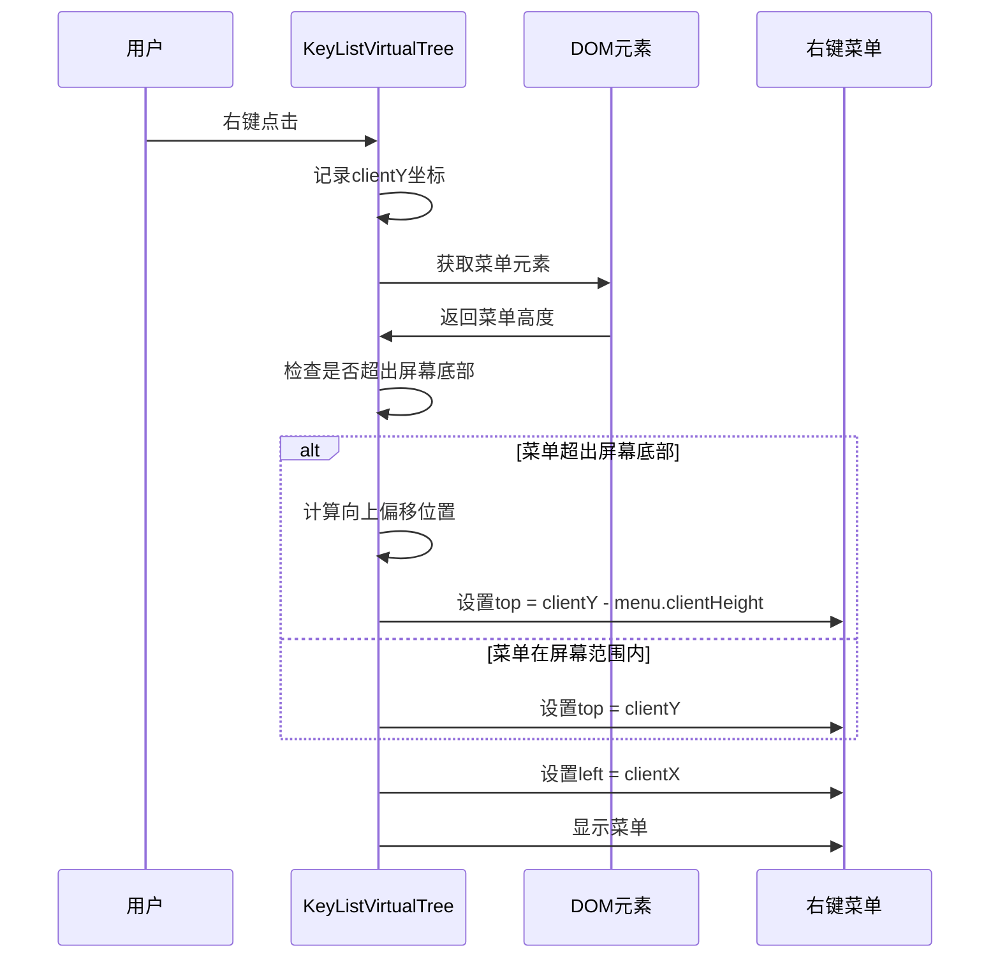
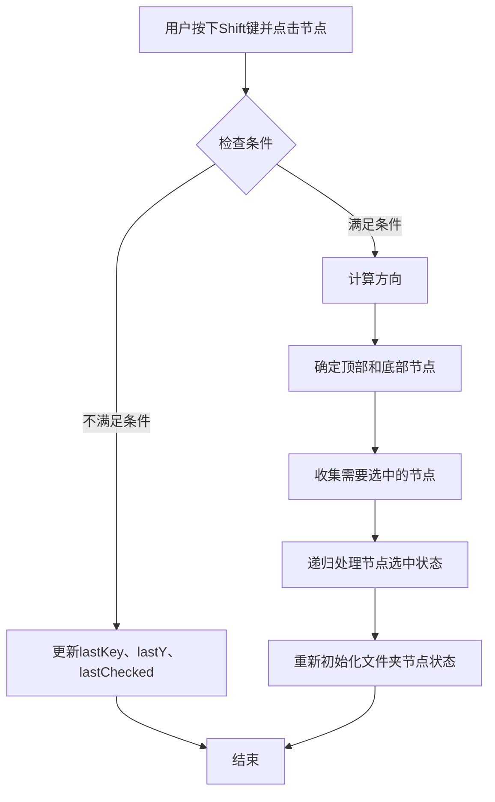
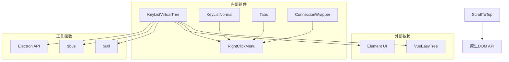
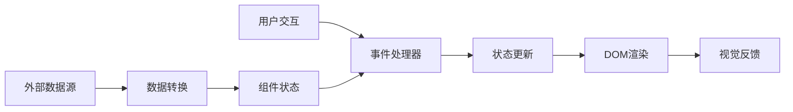

# 虚拟滚动组件用户交互设计

<cite>
**本文档中引用的文件**
- [KeyListVirtualTree.vue](file://src/components/KeyListVirtualTree.vue)
- [RightClickMenu.vue](file://src/components/RightClickMenu.vue)
- [KeyListNormal.vue](file://src/components/KeyListNormal.vue)
- [ScrollToTop.vue](file://src/components/ScrollToTop.vue)
- [Tabs.vue](file://src/components/Tabs.vue)
- [ConnectionWrapper.vue](file://src/components/ConnectionWrapper.vue)
</cite>

## 目录
1. [简介](#简介)
2. [项目结构概览](#项目结构概览)
3. [核心组件分析](#核心组件分析)
4. [多选模式实现机制](#多选模式实现机制)
5. [右键菜单定位逻辑](#右键菜单定位逻辑)
6. [Shift键多选实现原理](#shift键多选实现原理)
7. [依赖关系分析](#依赖关系分析)
8. [性能考虑](#性能考虑)
9. [故障排除指南](#故障排除指南)
10. [结论](#结论)

## 简介

本文档详细分析了Another Redis Desktop Manager中虚拟滚动组件的用户交互设计，重点关注多选模式的实现机制、右键菜单的智能定位逻辑以及Shift键范围选择功能。该系统采用基于Vue.js的虚拟滚动技术，支持大规模数据集的高效展示和交互操作。

## 项目结构概览

该项目采用模块化的组件架构，主要包含以下关键组件：



**图表来源**
- [KeyListVirtualTree.vue](file://src/components/KeyListVirtualTree.vue#L78-L101)
- [RightClickMenu.vue](file://src/components/RightClickMenu.vue#L15-L22)

**章节来源**
- [KeyListVirtualTree.vue](file://src/components/KeyListVirtualTree.vue#L1-L50)
- [RightClickMenu.vue](file://src/components/RightClickMenu.vue#L1-L30)

## 核心组件分析

### KeyListVirtualTree 虚拟树组件

KeyListVirtualTree是整个系统的核心组件，负责展示Redis键列表并提供丰富的交互功能。

#### 主要数据结构

该组件维护多个关键状态变量：

| 状态变量 | 类型 | 描述 | 默认值 |
|---------|------|------|--------|
| multiOperating | Boolean | 多选模式状态标志 | false |
| vtreeHeight | String | 虚拟树高度配置 | vtreeHeightRaw |
| vtreeHeightRaw | String | 原始高度配置 | 'calc(100vh - 248px)' |
| vtreeHeightMutiple | String | 多选模式高度配置 | 'calc(100vh - 284px)' |
| checkAllSelect | Boolean | 全选状态 | false |
| expandedKeys | Set | 展开节点集合 | new Set() |

#### 组件架构图



**图表来源**
- [KeyListVirtualTree.vue](file://src/components/KeyListVirtualTree.vue#L80-L100)
- [KeyListVirtualTree.vue](file://src/components/KeyListVirtualTree.vue#L24-L48)

**章节来源**
- [KeyListVirtualTree.vue](file://src/components/KeyListVirtualTree.vue#L80-L100)
- [KeyListVirtualTree.vue](file://src/components/KeyListVirtualTree.vue#L180-L195)

## 多选模式实现机制

### showMultiSelect 和 hideMultiSelect 方法

多选模式的切换通过两个核心方法实现，它们协同工作控制批量操作面板的显示状态。

#### showMultiSelect 方法流程



**图表来源**
- [KeyListVirtualTree.vue](file://src/components/KeyListVirtualTree.vue#L180-L186)

#### hideMultiSelect 方法流程



**图表来源**
- [KeyListVirtualTree.vue](file://src/components/KeyListVirtualTree.vue#L187-L195)

#### 批量操作面板显示控制

批量操作面板的显示通过CSS类切换实现：

```css
/* 隐藏状态 */
.key-list-vtree .batch-operate {
  display: none;
}

/* 显示状态 */
.key-list-vtree.show-checkbox .batch-operate {
  display: block;
}
```

这种设计确保了在多选模式下自动调整虚拟树的高度，为批量操作面板预留空间。

**章节来源**
- [KeyListVirtualTree.vue](file://src/components/KeyListVirtualTree.vue#L180-L195)
- [KeyListVirtualTree.vue](file://src/components/KeyListVirtualTree.vue#L558-L560)

## 右键菜单定位逻辑

### 智能定位算法

右键菜单的定位逻辑实现了智能的边界检测，确保菜单不会溢出屏幕边界。

#### 定位算法流程



**图表来源**
- [KeyListVirtualTree.vue](file://src/components/KeyListVirtualTree.vue#L108-L130)

#### 边界检测实现

定位逻辑的核心实现如下：

```javascript
// 检查菜单是否超出屏幕底部
if (document.body.clientHeight - top < menu.clientHeight) {
    top -= menu.clientHeight; // 向上移动菜单
}
```

这个算法确保：
1. 当鼠标位置靠近屏幕底部时，菜单会向上显示
2. 避免菜单内容被截断或超出可视区域
3. 提供一致的用户体验

#### 菜单样式配置

右键菜单采用固定定位，具有以下特性：
- `position: fixed` - 固定在视口中的位置
- `z-index: 99999` - 确保菜单始终在最上层
- 自适应背景颜色（支持深色模式）
- 边框圆角和阴影效果

**章节来源**
- [KeyListVirtualTree.vue](file://src/components/KeyListVirtualTree.vue#L108-L130)
- [RightClickMenu.vue](file://src/components/RightClickMenu.vue#L65-L105)

## Shift键多选实现原理

### 状态变量协同工作机制

Shift键多选功能通过三个关键状态变量协同工作：`lastKey`、`lastY`和`lastChecked`。

#### 状态变量定义

| 变量名 | 类型 | 用途 | 更新时机 |
|--------|------|------|----------|
| lastKey | String | 上次点击的节点键值 | 每次Shift多选时更新 |
| lastY | Number | 上次点击的屏幕Y坐标 | 每次Shift多选时更新 |
| lastChecked | Boolean | 上次点击时的选中状态 | 每次Shift多选时更新 |

#### 多选算法流程



**图表来源**
- [KeyListVirtualTree.vue](file://src/components/KeyListVirtualTree.vue#L319-L388)

#### 方向判断逻辑

```javascript
const direction = (event.screenY - this.lastY) <= 0 ? 'up' : 'down';
```

这个逻辑根据当前点击位置与上次点击位置的相对关系判断选择方向：
- 如果当前Y坐标小于上次Y坐标，方向为向上
- 如果当前Y坐标大于等于上次Y坐标，方向为向下

#### 范围选择算法

范围选择算法的核心步骤：

1. **确定选择范围**：根据方向确定顶部和底部节点
2. **收集节点**：从数据列表中收集需要选中的节点
3. **递归处理**：对每个节点及其子节点应用相同的选中状态
4. **状态同步**：重新初始化文件夹节点的选中状态

#### 父节点过滤机制

为了防止父节点影响子节点的选择，实现了父节点过滤：

```javascript
for (const item of selectedNodes) {
    if (bottomNodeParents.has(item.key)) {
        continue; // 跳过父节点
    }
    checkRecursive(item, this.lastChecked);
}
```

这个机制确保：
- 子节点可以独立于父节点进行选择
- 避免不必要的状态传播
- 提高选择操作的精确度

**章节来源**
- [KeyListVirtualTree.vue](file://src/components/KeyListVirtualTree.vue#L319-L388)
- [KeyListVirtualTree.vue](file://src/components/KeyListVirtualTree.vue#L320-L324)

## 依赖关系分析

### 组件间依赖关系



**图表来源**
- [KeyListVirtualTree.vue](file://src/components/KeyListVirtualTree.vue#L78-L80)
- [KeyListNormal.vue](file://src/components/KeyListNormal.vue#L17-L18)

### 数据流分析

系统的数据流向遵循单向数据流原则：



**章节来源**
- [KeyListVirtualTree.vue](file://src/components/KeyListVirtualTree.vue#L390-L427)
- [RightClickMenu.vue](file://src/components/RightClickMenu.vue#L23-L48)

## 性能考虑

### 虚拟滚动优化

虚拟滚动技术通过以下方式提升性能：

1. **内存管理**：只渲染可见区域的节点
2. **DOM操作最小化**：减少频繁的DOM更新
3. **事件委托**：使用事件委托减少事件监听器数量
4. **懒加载**：按需加载节点数据

### 多选操作优化

多选功能的性能优化措施：

1. **批量操作**：一次性处理多个节点的状态变更
2. **状态缓存**：缓存选中状态以避免重复计算
3. **递归优化**：优化递归算法的执行效率
4. **DOM批量更新**：减少DOM重绘和回流

## 故障排除指南

### 常见问题及解决方案

#### 多选功能异常

**问题描述**：Shift键多选无法正常工作

**可能原因**：
1. lastKey状态丢失
2. 事件对象不正确
3. 节点数据结构异常

**解决方案**：
- 检查事件对象的screenY属性
- 验证节点键值的唯一性
- 确认lastKey状态的正确更新

#### 右键菜单定位错误

**问题描述**：菜单位置不正确或超出屏幕边界

**可能原因**：
1. clientY坐标计算错误
2. 菜单高度测量失败
3. 文档高度获取异常

**解决方案**：
- 验证DOM元素的clientHeight属性
- 检查CSS样式对菜单尺寸的影响
- 确认文档滚动位置的正确性

#### 批量操作面板显示异常

**问题描述**：批量操作面板不显示或显示位置错误

**可能原因**：
1. CSS类切换失败
2. 高度计算错误
3. DOM元素不存在

**解决方案**：
- 检查show-checkbox类的添加和移除
- 验证vtreeHeight的正确赋值
- 确认treeWrapper元素的存在性

**章节来源**
- [KeyListVirtualTree.vue](file://src/components/KeyListVirtualTree.vue#L180-L195)
- [KeyListVirtualTree.vue](file://src/components/KeyListVirtualTree.vue#L108-L130)

## 结论

Another Redis Desktop Manager的虚拟滚动组件展现了现代Web应用中复杂用户交互设计的最佳实践。通过精心设计的多选模式、智能的右键菜单定位算法和高效的Shift键范围选择功能，该系统成功地平衡了功能性、性能和用户体验。

### 关键设计亮点

1. **模块化架构**：清晰的组件分离和职责划分
2. **状态管理**：合理的设计状态变量和生命周期
3. **性能优化**：虚拟滚动和批量操作的结合
4. **用户体验**：智能的界面适配和交互反馈

### 技术创新点

- **动态高度调整**：根据多选状态动态调整虚拟树高度
- **智能边界检测**：自适应的菜单定位算法
- **递归状态管理**：高效的节点状态传播机制
- **事件驱动架构**：松耦合的组件通信方式

这套设计方案为大型数据集的Web应用提供了可参考的实现模式，特别是在处理大规模数据展示和复杂交互场景方面具有重要的借鉴价值。