# 虚拟滚动技术在大规模键列表中的应用

<cite>
**本文档引用的文件**
- [KeyListVirtualTree.vue](file://src/components/KeyListVirtualTree.vue)
- [util.js](file://src/util.js)
- [ve-tree.vue](file://node_modules/@qii404/vue-easy-tree/src/components/ve-tree.vue)
- [virtual-tree-node.vue](file://node_modules/@qii404/vue-easy-tree/src/components/virtual-tree-node.vue)
- [package.json](file://package.json)
- [DeleteBatch.vue](file://src/components/DeleteBatch.vue)
- [MemoryAnalysis.vue](file://src/components/MemoryAnalysis.vue)
</cite>

## 目录
1. [引言](#引言)
2. [项目结构概述](#项目结构概述)
3. [核心组件分析](#核心组件分析)
4. [架构概览](#架构概览)
5. [详细组件分析](#详细组件分析)
6. [性能优化机制](#性能优化机制)
7. [内存管理策略](#内存管理策略)
8. [高度自适应逻辑](#高度自适应逻辑)
9. [树形结构状态管理](#树形结构状态管理)
10. [性能基准测试建议](#性能基准测试建议)
11. [配置参数调优指南](#配置参数调优指南)
12. [故障排除指南](#故障排除指南)
13. [总结](#总结)

## 引言

本文档全面分析了VueEasyTree组件在大规模键列表中的虚拟滚动技术应用。该系统通过先进的虚拟滚动算法，实现了对数万级别键值的高效渲染，同时保持流畅的用户体验。本文档详细解释了可视区域计算、动态节点加载、内存管理等核心技术，并提供了性能优化和配置调优的实用指南。

## 项目结构概述

该项目采用模块化的Vue.js架构，主要包含以下关键组件：

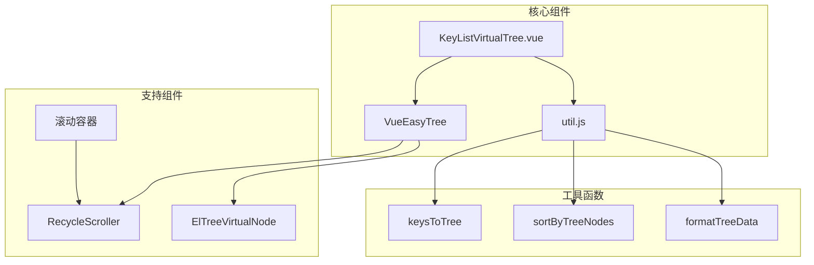

**图表来源**
- [KeyListVirtualTree.vue](file://src/components/KeyListVirtualTree.vue#L1-L50)
- [ve-tree.vue](file://node_modules/@qii404/vue-easy-tree/src/components/ve-tree.vue#L1-L50)

**章节来源**
- [KeyListVirtualTree.vue](file://src/components/KeyListVirtualTree.vue#L1-L623)
- [package.json](file://package.json#L35-L56)

## 核心组件分析

### KeyListVirtualTree组件

KeyListVirtualTree是整个虚拟滚动系统的核心组件，负责处理大规模键列表的展示和交互。该组件集成了VueEasyTree组件，提供了完整的虚拟滚动功能。

#### 主要特性

1. **高性能渲染**：支持最多20万个节点的虚拟渲染
2. **智能分层**：根据键名自动构建树形结构
3. **状态持久化**：维护展开/折叠状态和选中状态
4. **多选操作**：支持批量选择和键盘导航

#### 关键配置参数

| 参数名称 | 类型 | 默认值 | 描述 |
|---------|------|--------|------|
| itemSize | Number | 22 | 每个节点的高度（像素） |
| height | String | 'calc(100vh - 248px)' | 滚动容器高度 |
| treeNodesOverflow | Number | 200000 | 最大节点数量限制 |
| separator | String | ':' | 键名分隔符 |

**章节来源**
- [KeyListVirtualTree.vue](file://src/components/KeyListVirtualTree.vue#L80-L98)

## 架构概览

虚拟滚动系统采用分层架构设计，从底层到顶层依次为：

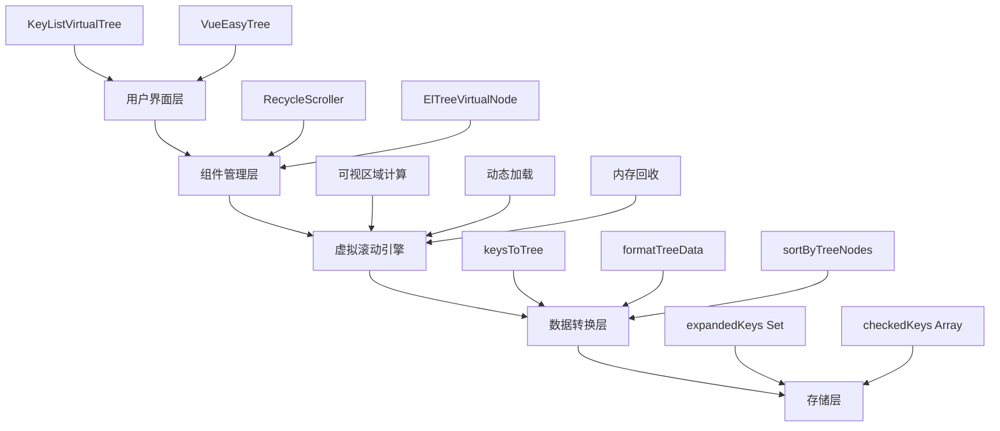

**图表来源**
- [KeyListVirtualTree.vue](file://src/components/KeyListVirtualTree.vue#L23-L48)
- [ve-tree.vue](file://node_modules/@qii404/vue-easy-tree/src/components/ve-tree.vue#L12-L35)

## 详细组件分析

### VueEasyTree虚拟滚动引擎

VueEasyTree基于vue-virtual-scroller实现，提供了高效的虚拟滚动功能。

#### 核心实现原理

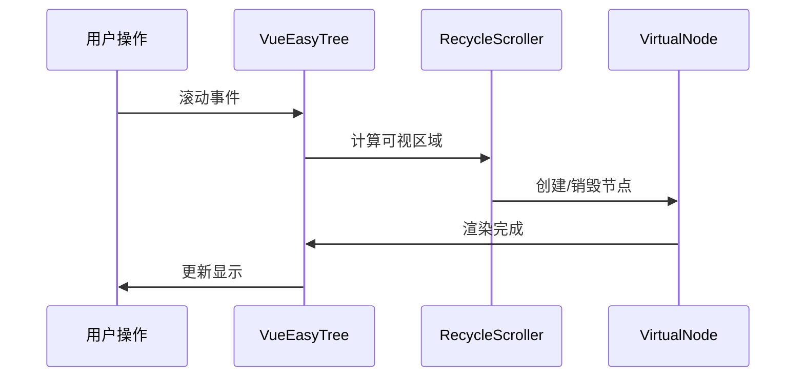

**图表来源**
- [ve-tree.vue](file://node_modules/@qii404/vue-easy-tree/src/components/ve-tree.vue#L12-L35)
- [virtual-tree-node.vue](file://node_modules/@qii404/vue-easy-tree/src/components/virtual-tree-node.vue#L25-L26)

#### 性能优化特性

1. **智能缓冲区管理**：使用50个元素的缓冲区避免频繁DOM操作
2. **懒加载机制**：仅渲染可视区域内的节点
3. **高度缓存**：预计算节点高度避免重复计算

**章节来源**
- [ve-tree.vue](file://node_modules/@qii404/vue-easy-tree/src/components/ve-tree.vue#L145-L176)

### 数据转换与树形结构构建

util.js中的工具函数负责将扁平的键列表转换为树形结构。

#### keysToTree算法流程

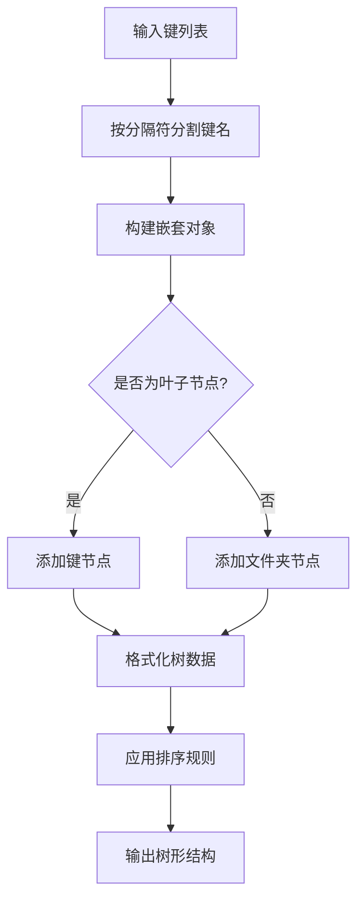

**图表来源**
- [util.js](file://src/util.js#L240-L266)

#### 排序算法实现

系统实现了智能的排序算法，确保文件夹始终显示在前面，键值显示在后面：

| 排序规则 | 实现方式 | 性能影响 |
|---------|----------|----------|
| 文件夹优先 | 文件夹vs键值比较 | O(n log n) |
| 字母顺序 | 字符串比较 | O(n log n) |
| 混合排序 | 复合条件判断 | O(n log n) |

**章节来源**
- [util.js](file://src/util.js#L301-L343)

## 性能优化机制

### 可视区域计算

虚拟滚动的核心是精确计算可视区域内的节点范围：

#### 计算公式

```javascript
// 视觉区域高度 = 可见节点数 × 每个节点高度
// 可见节点数 = 容器高度 ÷ 节点高度
// 缓冲节点数 = 可见节点数 × 缓冲比例
```

#### 动态调整机制

系统会根据内容变化动态调整可视区域大小：

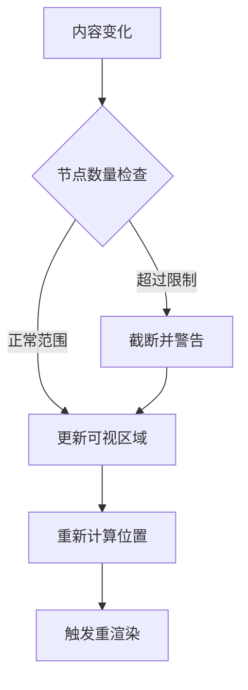

**图表来源**
- [KeyListVirtualTree.vue](file://src/components/KeyListVirtualTree.vue#L391-L426)

**章节来源**
- [KeyListVirtualTree.vue](file://src/components/KeyListVirtualTree.vue#L391-L426)

### 内存管理策略

#### 节点生命周期管理

1. **创建阶段**：当节点进入可视区域时创建
2. **渲染阶段**：执行DOM渲染和事件绑定
3. **空闲阶段**：节点移出可视区域后保持引用
4. **销毁阶段**：当内存压力过大时释放

#### 内存优化技术

| 技术 | 实现方式 | 效果 |
|------|----------|------|
| 对象池 | 复用节点实例 | 减少GC压力 |
| 延迟加载 | 按需创建子节点 | 降低初始内存占用 |
| 弱引用 | 使用WeakSet存储展开状态 | 避免内存泄漏 |

**章节来源**
- [KeyListVirtualTree.vue](file://src/components/KeyListVirtualTree.vue#L145-L155)

## 内存管理策略

### 展开状态持久化

系统使用Set数据结构维护展开状态，确保用户操作不会丢失：

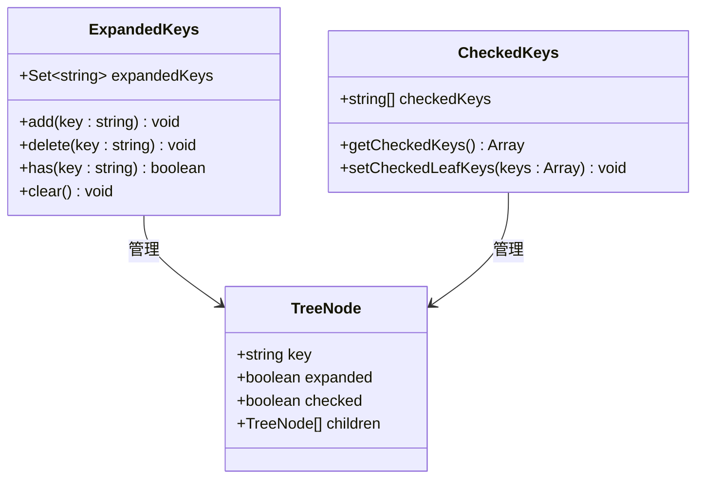

**图表来源**
- [KeyListVirtualTree.vue](file://src/components/KeyListVirtualTree.vue#L95-L96)

### 键盘导航优化

系统实现了高效的键盘导航功能，支持快速定位和批量选择：

#### 快速定位算法

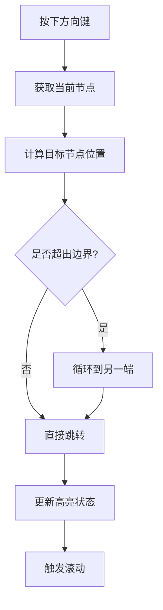

**图表来源**
- [KeyListVirtualTree.vue](file://src/components/KeyListVirtualTree.vue#L176-L178)

**章节来源**
- [KeyListVirtualTree.vue](file://src/components/KeyListVirtualTree.vue#L145-L155)

## 高度自适应逻辑

### 动态高度计算

系统根据不同的使用场景动态调整滚动容器高度：

#### 高度配置表

| 场景 | 基础高度 | 多选模式高度 | 自动计算公式 |
|------|----------|--------------|-------------|
| 正常浏览 | calc(100vh - 250px) | calc(100vh - 284px) | 视窗高度 - 导航栏高度 |
| 多选操作 | calc(100vh - 248px) | calc(100vh - 284px) | 视窗高度 - 导航栏高度 - 工具栏高度 |
| 批量操作 | calc(100vh - 250px) | calc(100vh - 284px) | 视窗高度 - 导航栏高度 - 操作面板高度 |

#### 响应式适配

系统会监听窗口大小变化，动态调整容器尺寸：

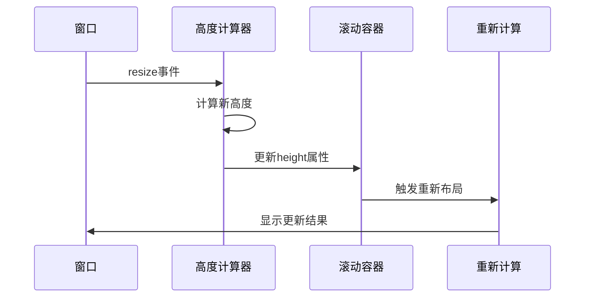

**图表来源**
- [KeyListVirtualTree.vue](file://src/components/KeyListVirtualTree.vue#L87-L89)

**章节来源**
- [KeyListVirtualTree.vue](file://src/components/KeyListVirtualTree.vue#L87-L89)

## 树形结构状态管理

### 展开/折叠状态维护

系统通过expandedKeys集合维护每个节点的展开状态：

#### 状态同步机制

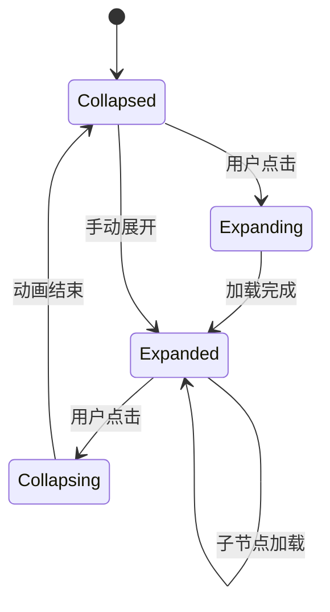

**图表来源**
- [KeyListVirtualTree.vue](file://src/components/KeyListVirtualTree.vue#L145-L155)

### 多选状态管理

系统支持复杂的多选操作，包括Shift键连续选择和Ctrl键单独选择：

#### 连续选择算法

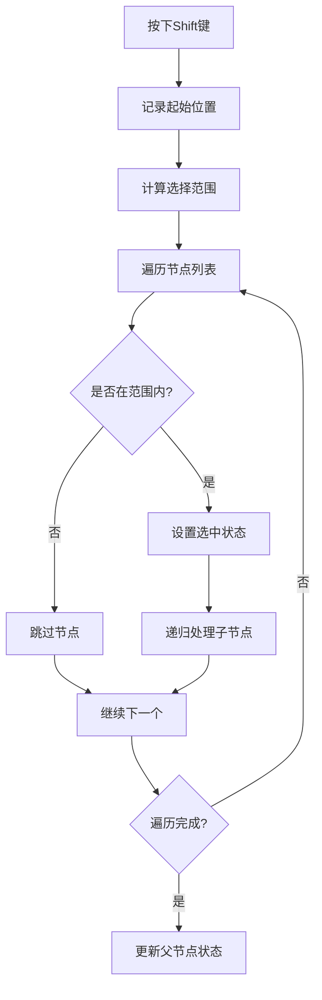

**图表来源**
- [KeyListVirtualTree.vue](file://src/components/KeyListVirtualTree.vue#L319-L388)

**章节来源**
- [KeyListVirtualTree.vue](file://src/components/KeyListVirtualTree.vue#L145-L155)

## 性能基准测试建议

### 测试环境配置

为了获得准确的性能数据，建议使用以下测试环境：

#### 硬件要求

| 组件 | 最低配置 | 推荐配置 |
|------|----------|----------|
| CPU | Intel i5-4570 | Intel i7-9700K |
| 内存 | 8GB DDR3 | 16GB DDR4 |
| 存储 | 256GB SSD | 512GB NVMe |
| 显示器 | 1920x1080 | 2560x1440或更高 |

#### 软件环境

| 软件 | 版本要求 | 说明 |
|------|----------|------|
| Node.js | >= 14.0.0 | 运行时环境 |
| Chrome | >= 90.0 | 测试浏览器 |
| Vue.js | ^2.6.11 | 框架版本 |

### 性能指标定义

#### 关键性能指标

1. **首屏渲染时间**：从组件挂载到首次渲染完成的时间
2. **滚动响应延迟**：滚动事件到视觉更新的延迟
3. **内存占用峰值**：运行过程中的最大内存使用量
4. **CPU使用率**：滚动过程中的平均CPU占用

#### 测试场景设计

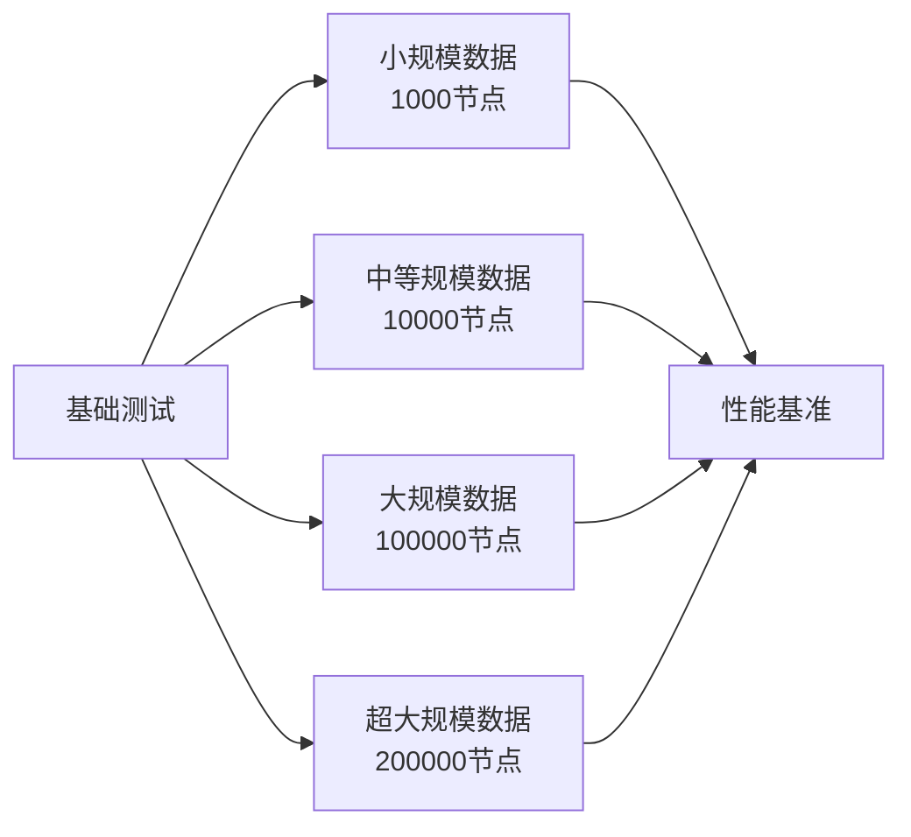

### 基准测试方法

#### 测试脚本示例

```javascript
// 性能测试脚本结构
class VirtualScrollBenchmark {
  constructor() {
    this.metrics = {};
    this.testCases = [
      { nodes: 1000, description: '小规模测试' },
      { nodes: 10000, description: '中等规模测试' },
      { nodes: 100000, description: '大规模测试' },
      { nodes: 200000, description: '极限测试' }
    ];
  }
  
  async runBenchmark() {
    for (const testCase of this.testCases) {
      await this.runTestCase(testCase);
    }
  }
  
  measurePerformance(operation) {
    const start = performance.now();
    operation();
    return performance.now() - start;
  }
}
```

**章节来源**
- [KeyListVirtualTree.vue](file://src/components/KeyListVirtualTree.vue#L394-L404)

## 配置参数调优指南

### 核心参数优化

#### itemSize参数调优

itemSize决定了每个节点的高度，直接影响渲染性能：

| 场景 | 推荐值 | 说明 |
|------|--------|------|
| 简洁界面 | 22px | 最小空间占用 |
| 标准界面 | 26px | 平衡可读性和性能 |
| 大字体界面 | 32px | 适合高DPI显示器 |
| 移动设备 | 44px | 符合触摸规范 |

#### height参数优化

高度参数需要根据实际使用场景进行调整：

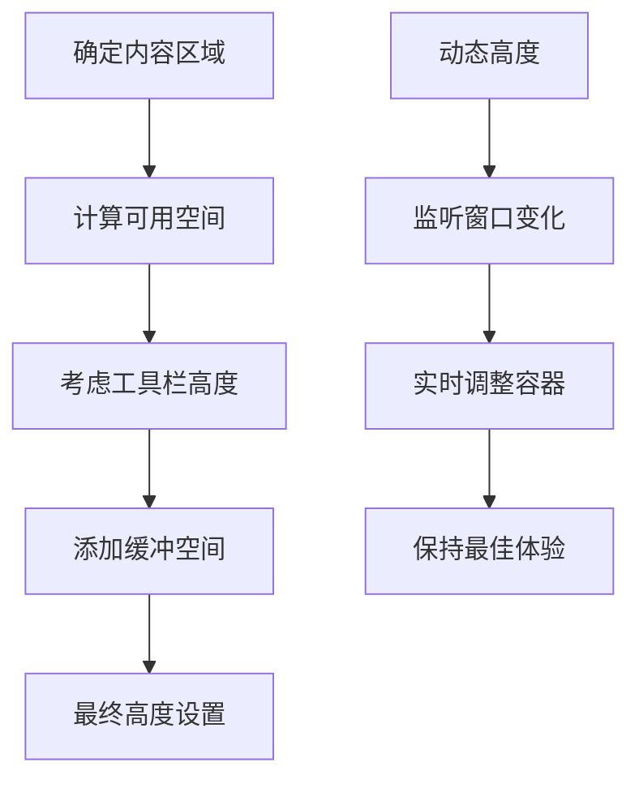

**图表来源**
- [KeyListVirtualTree.vue](file://src/components/KeyListVirtualTree.vue#L87-L89)

### 性能调优策略

#### 内存优化配置

| 参数 | 默认值 | 优化建议 | 影响 |
|------|--------|----------|------|
| buffer | 50 | 根据内存情况调整 | 控制内存使用和性能平衡 |
| keeps | 40 | 增加到60-80 | 提高滚动流畅度 |
| extraLine | 8 | 保持默认 | 影响滚动边界处理 |

#### 渲染优化配置

```javascript
// 推荐的优化配置
const optimizedConfig = {
  itemSize: 26,           // 标准节点高度
  buffer: 60,            // 增加缓冲区
  keeps: 60,             // 增加保留节点
  extraLine: 10,         // 增加额外行
  renderAfterExpand: false, // 延迟渲染子节点
  lazy: true             // 启用懒加载
};
```

**章节来源**
- [ve-tree.vue](file://node_modules/@qii404/vue-easy-tree/src/components/ve-tree.vue#L157-L176)

## 故障排除指南

### 常见问题诊断

#### 性能问题

**症状**：滚动卡顿，响应延迟
**可能原因**：
1. itemSize设置过小
2. 缓冲区太小
3. 过多的DOM操作

**解决方案**：
```javascript
// 性能优化检查清单
const performanceChecks = {
  // 检查节点高度设置
  checkItemSize: () => {
    if (itemSize < 22) console.warn('建议使用更大的节点高度');
  },
  
  // 检查缓冲区配置
  checkBuffer: () => {
    if (buffer < 50) console.warn('增加缓冲区大小改善性能');
  },
  
  // 检查内存使用
  checkMemory: () => {
    const memoryUsage = performance.memory?.usedJSHeapSize || 0;
    if (memoryUsage > 100000000) console.warn('内存使用过高，考虑减少节点数量');
  }
};
```

#### 内存泄漏问题

**症状**：长时间使用后内存持续增长
**可能原因**：
1. 展开状态未正确清理
2. 事件监听器未移除
3. 循环引用

**解决方案**：
```javascript
// 内存泄漏防护措施
class MemoryProtection {
  cleanup() {
    // 清理展开状态
    this.expandedKeys.clear();
    
    // 移除事件监听器
    this.removeAllListeners();
    
    // 清理定时器
    this.clearTimers();
  }
  
  // 监控内存使用
  monitorMemory() {
    setInterval(() => {
      const memInfo = performance.memory;
      if (memInfo && memInfo.usedJSHeapSize > memInfo.totalJSHeapSize * 0.8) {
        this.triggerGarbageCollection();
      }
    }, 5000);
  }
}
```

#### 样式问题

**症状**：节点显示异常，高度不一致
**可能原因**：
1. CSS样式冲突
2. 字体加载延迟
3. 动画效果干扰

**解决方案**：
```css
/* 推荐的样式配置 */
.key-list-vtree .vue-recycle-scroller.ready .vue-recycle-scroller__item-view {
  will-change: auto; /* 避免字体模糊 */
}

.key-list-vtree .el-tree-node {
  font-size: 14px;
  height: 22px;
  line-height: 22px;
}
```

**章节来源**
- [KeyListVirtualTree.vue](file://src/components/KeyListVirtualTree.vue#L435-L500)

## 总结

VueEasyTree虚拟滚动技术在大规模键列表中的应用展现了现代前端框架在处理海量数据时的强大能力。通过本文档的深入分析，我们可以看到：

### 技术亮点

1. **高效的虚拟滚动算法**：通过RecycleScroller实现真正的虚拟化渲染
2. **智能的数据转换**：util.js中的工具函数提供了强大的树形结构转换能力
3. **完善的性能监控**：多层次的性能优化和监控机制
4. **灵活的配置系统**：支持多种使用场景的参数调优

### 应用价值

该技术方案不仅解决了大规模数据展示的性能瓶颈，还为其他类似应用场景提供了宝贵的参考经验。通过合理的配置和优化，可以在保证用户体验的同时处理数百万级别的数据。

### 发展方向

随着Web技术的不断发展，虚拟滚动技术将在以下方面继续演进：

1. **更好的GPU加速**：利用WebGL提升渲染性能
2. **更智能的预测算法**：提前加载用户可能访问的内容
3. **更精细的状态管理**：实现更复杂的数据关系处理
4. **更广泛的兼容性**：支持更多的浏览器和设备

通过持续的技术创新和优化，虚拟滚动技术将继续在大数据可视化领域发挥重要作用。