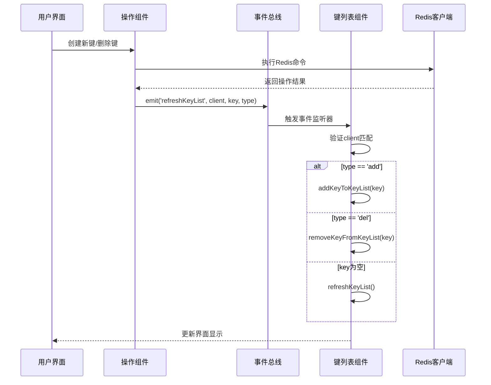
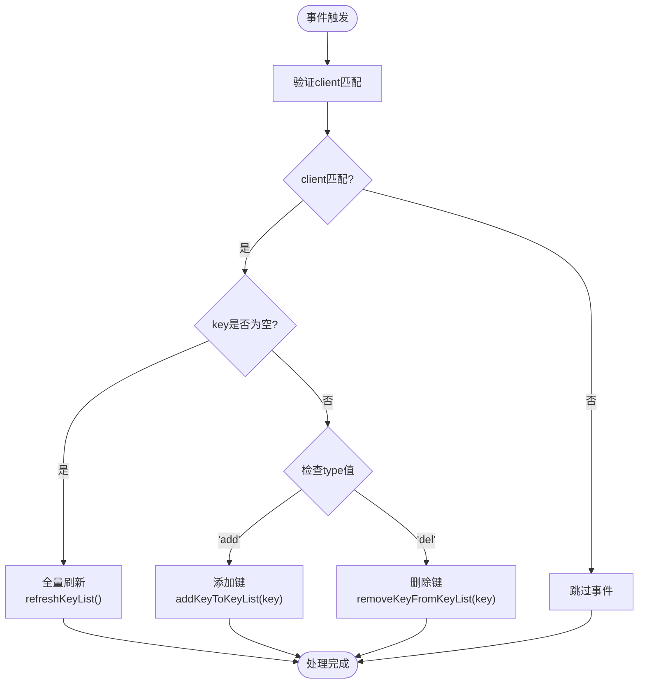

# 事件参数与处理逻辑

<cite>
**本文档中引用的文件**
- [KeyList.vue](file://src/components/KeyList.vue)
- [OperateItem.vue](file://src/components/OperateItem.vue)
- [KeyListVirtualTree.vue](file://src/components/KeyListVirtualTree.vue)
- [DeleteBatch.vue](file://src/components/DeleteBatch.vue)
- [KeyHeader.vue](file://src/components/KeyHeader.vue)
- [bus.js](file://src/bus.js)
</cite>

## 目录
1. [简介](#简介)
2. [refreshKeyList事件概述](#refreshkeylist事件概述)
3. [事件参数详解](#事件参数详解)
4. [事件处理机制](#事件处理机制)
5. [核心方法分析](#核心方法分析)
6. [最佳实践指导](#最佳实践指导)
7. [故障排除指南](#故障排除指南)
8. [总结](#总结)

## 简介

`refreshKeyList`事件是Another Redis Desktop Manager中用于管理键列表同步的核心事件机制。该事件通过事件总线系统在不同组件间传递信息，确保键列表的实时性和一致性。本文档深入解析该事件的三个核心参数：`client`、`key`和`type`的语义含义及使用方式，并阐述完整的处理流程。

## refreshKeyList事件概述

`refreshKeyList`事件是一个全局事件，用于通知键列表组件更新其显示内容。该事件采用发布-订阅模式，由产生键变更的操作触发，被监听该事件的键列表组件接收并处理。



**图表来源**
- [KeyList.vue](file://src/components/KeyList.vue#L89-L103)
- [OperateItem.vue](file://src/components/OperateItem.vue#L308-L310)
- [KeyListVirtualTree.vue](file://src/components/KeyListVirtualTree.vue#L233)

## 事件参数详解

### client参数

`client`参数代表Redis连接实例，用于确保事件只影响正确的连接会话。

#### 参数特性
- **类型**: Redis客户端对象实例
- **用途**: 连接匹配验证，防止跨连接事件干扰
- **验证方式**: 通过严格相等比较（`client !== this.client`）

#### 使用场景
- 多连接环境下的事件隔离
- 确保事件处理的准确性
- 避免不必要的状态更新

#### 实现细节
```javascript
// 在KeyList.vue中验证client匹配
if (client !== this.client) {
    return; // 跳过非当前连接的事件
}
```

**节来源**
- [KeyList.vue](file://src/components/KeyList.vue#L92-L94)

### key参数

`key`参数表示操作的目标键名，可以是具体的键名或空值。

#### 参数特性
- **类型**: Buffer对象或空字符串
- **用途**: 指定操作的具体键或触发全量刷新
- **特殊值**: 空字符串表示全量刷新

#### 数据结构
- **具体键**: Buffer.from(keyName)创建的二进制键名
- **全量刷新**: 空字符串`''`触发完整列表重建

#### 处理逻辑
```javascript
// 全量刷新处理
if (!key) {
    return this.refreshKeyList(); // 触发完整刷新
}

// 具体键操作
(type == 'del') && this.removeKeyFromKeyList(key);
(type == 'add') && this.addKeyToKeyList(key);
```

**节来源**
- [KeyList.vue](file://src/components/KeyList.vue#L97-L102)

### type参数

`type`参数定义操作类型，决定如何处理指定的键。

#### 可选值
- `'add'`: 添加键到列表
- `'del'`: 从列表中移除键
- 默认值: `'del'`

#### 类型处理机制
```javascript
// 基于type值的条件执行
(type == 'del') && this.removeKeyFromKeyList(key); // 删除操作
(type == 'add') && this.addKeyToKeyList(key);     // 添加操作
```

**节来源**
- [KeyList.vue](file://src/components/KeyList.vue#L100-L102)

## 事件处理机制

### 事件监听器注册

事件监听器在KeyList组件的`created`生命周期钩子中注册：

```javascript
created() {
    this.$bus.$on('refreshKeyList', (client, key = '', type = 'del') => {
        // 事件处理逻辑
    });
}
```

### 事件分发流程

1. **事件触发**: 操作组件调用`this.$bus.$emit('refreshKeyList', ...)`发送事件
2. **事件传播**: Vue事件总线将事件广播给所有监听器
3. **事件过滤**: 监听器首先验证`client`匹配
4. **条件处理**: 根据`key`和`type`参数执行相应操作



**图表来源**
- [KeyList.vue](file://src/components/KeyList.vue#L89-L103)

**节来源**
- [KeyList.vue](file://src/components/KeyList.vue#L89-L103)

## 核心方法分析

### addKeyToKeyList方法

该方法负责向键列表中添加新的键。

#### 方法签名
```javascript
addKeyToKeyList(key) {
    // 参数验证
    if (!this.keyList) {
        return false;
    }
    
    // 检查键是否已存在
    for (const i in this.keyList) {
        if (this.keyList[i].equals(key)) {
            return; // 已存在，不重复添加
        }
    }
    
    // 添加新键
    this.keyList.push(key);
}
```

#### 关键特性
- **重复检查**: 使用`equals()`方法避免重复添加
- **性能优化**: 早期返回减少不必要的操作
- **数据完整性**: 确保键列表的唯一性

**节来源**
- [KeyList.vue](file://src/components/KeyList.vue#L279-L292)

### removeKeyFromKeyList方法

该方法负责从键列表中移除指定的键。

#### 方法签名
```javascript
removeKeyFromKeyList(key) {
    if (!this.keyList) {
        return false;
    }
    
    for (const i in this.keyList) {
        if (this.keyList[i].equals(key)) {
            this.keyList.splice(i, 1);
            break;
        }
    }
}
```

#### 关键特性
- **精确匹配**: 使用索引定位要删除的元素
- **及时退出**: 找到后立即停止循环
- **内存管理**: 正确的数组操作避免内存泄漏

**节来源**
- [KeyList.vue](file://src/components/KeyList.vue#L267-L277)

### 全量刷新机制

当`key`参数为空时，触发全量刷新机制：

```javascript
refreshKeyList(resetKeyList = true) {
    // 重置前一个列表
    resetKeyList && this.resetKeyList();
    
    // 显示搜索状态
    this.setSearchStatus();
    
    // 执行扫描操作
    if (!this.scanStreams.length) {
        this.initScanStreamsAndScan();
    }
}
```

#### 刷新流程
1. **状态重置**: 清空现有键列表和扫描流
2. **状态设置**: 更新UI状态指示正在加载
3. **扫描初始化**: 启动新的键扫描过程
4. **增量加载**: 分页获取键数据

**节来源**
- [KeyList.vue](file://src/components/KeyList.vue#L112-L138)

## 最佳实践指导

### 参数校验策略

#### 客户端验证
```javascript
// 严格的客户端匹配
if (client !== this.client) {
    return; // 防止跨连接事件干扰
}
```

#### 键参数验证
```javascript
// 空值检查
if (!key) {
    return this.refreshKeyList(); // 全量刷新
}

// 类型检查
if (!(key instanceof Buffer)) {
    console.warn('Invalid key type:', key);
    return;
}
```

### 边界条件处理

#### 空键列表情况
```javascript
// 添加操作的边界处理
addKeyToKeyList(key) {
    if (!this.keyList) {
        this.keyList = []; // 初始化空数组
    }
    // 继续添加逻辑...
}
```

#### 重复键处理
```javascript
// 删除操作的安全检查
removeKeyFromKeyList(key) {
    if (!this.keyList || this.keyList.length === 0) {
        return; // 空列表直接返回
    }
    // 继续删除逻辑...
}
```

### 异步更新策略

#### 批量更新优化
```javascript
// 使用Vue.nextTick确保DOM更新时机
this.$nextTick(() => {
    // DOM更新后的操作
    this.$refs.veTree.setCheckedLeafKeys(this.checkedKeys);
});
```

#### 性能监控
```javascript
// 监控更新性能
console.time('keyListUpdate');
// 执行更新操作
console.timeEnd('keyListUpdate');
```

### 错误处理模式

#### 优雅降级
```javascript
// 事件处理中的错误捕获
try {
    this.$bus.$emit('refreshKeyList', client, key, type);
} catch (error) {
    console.error('Event emission failed:', error);
    // 回退到手动刷新
    this.refreshKeyList();
}
```

#### 状态恢复
```javascript
// 处理失败时的状态恢复
removeKeyFromKeyList(key) {
    const originalLength = this.keyList.length;
    try {
        // 执行删除操作
        this.performRemoveOperation(key);
    } catch (error) {
        // 发生错误时恢复原状
        this.keyList.length = originalLength;
        throw error;
    }
}
```

## 故障排除指南

### 常见问题诊断

#### 事件未触发
**症状**: 键列表不更新
**可能原因**:
- 事件未正确发送
- 监听器未注册
- 客户端不匹配

**解决方案**:
```javascript
// 检查事件发送
console.log('Emitting refreshKeyList:', { client, key, type });

// 检查监听器注册
console.log('Event listeners:', this.$bus.listeners('refreshKeyList'));
```

#### 键重复添加
**症状**: 键列表中出现重复项
**可能原因**:
- `addKeyToKeyList`方法未正确检查重复
- 多次触发相同事件

**解决方案**:
```javascript
// 添加调试日志
addKeyToKeyList(key) {
    console.log('Adding key:', this.$util.bufToString(key));
    // 检查重复
    const exists = this.keyList.some(k => k.equals(key));
    if (exists) {
        console.warn('Key already exists:', this.$util.bufToString(key));
        return;
    }
    // 继续添加
}
```

#### 内存泄漏
**症状**: 应用程序内存使用持续增长
**可能原因**:
- 事件监听器未正确清理
- 键列表无限增长

**解决方案**:
```javascript
// 在组件销毁时清理监听器
beforeDestroy() {
    this.$bus.$off('refreshKeyList', this.refreshKeyListHandler);
}

// 限制键列表大小
if (this.keyList.length > MAX_KEYS) {
    this.keyList = this.keyList.slice(0, MAX_KEYS);
}
```

### 性能优化建议

#### 批量操作
```javascript
// 避免频繁的单个键更新
const updates = keys.map(key => ({
    client,
    key,
    type: 'add'
}));

updates.forEach(update => {
    this.$bus.$emit('refreshKeyList', update.client, update.key, update.type);
});
```

#### 虚拟化支持
```javascript
// 对大量键使用虚拟滚动
watch: {
    keyList(newList) {
        // 当键数量超过阈值时启用虚拟化
        if (newList.length > VIRTUAL_THRESHOLD) {
            this.useVirtualScroll = true;
        }
    }
}
```

**节来源**
- [KeyList.vue](file://src/components/KeyList.vue#L267-L292)

## 总结

`refreshKeyList`事件机制是Another Redis Desktop Manager中实现键列表同步的核心技术。通过深入理解其三个核心参数的语义和处理逻辑，开发者可以：

1. **准确把握事件语义**: 理解`client`用于连接匹配、`key`作为操作目标、`type`定义操作类型的职责分工
2. **实现高效的事件处理**: 掌握分支执行逻辑和全量刷新机制的最佳实践
3. **构建健壮的应用**: 应用参数校验、边界条件处理和异步更新策略
4. **优化用户体验**: 通过性能监控和错误处理提升应用稳定性

该事件系统的设计体现了现代前端架构中事件驱动模式的优势，为复杂的Redis管理界面提供了可靠的数据同步保障。通过遵循本文档提供的最佳实践，开发者可以构建更加稳定、高效的Redis桌面管理工具。