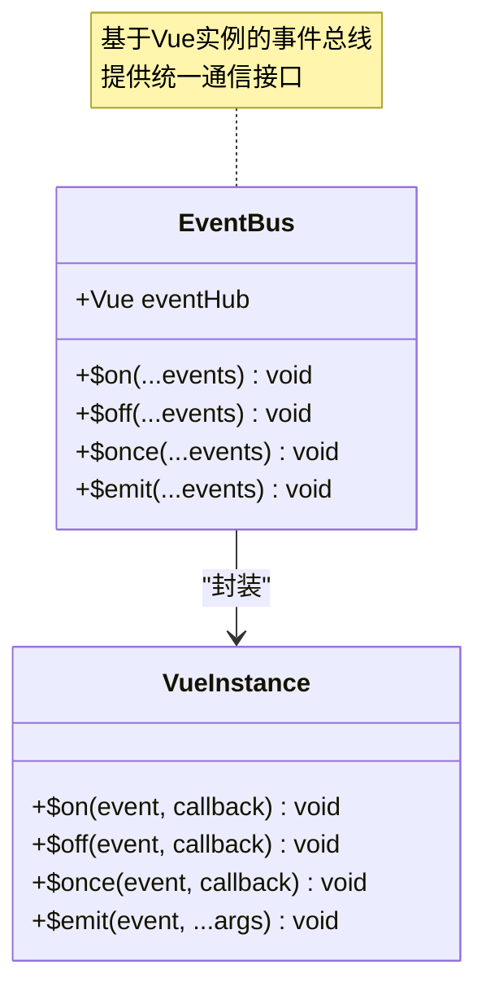
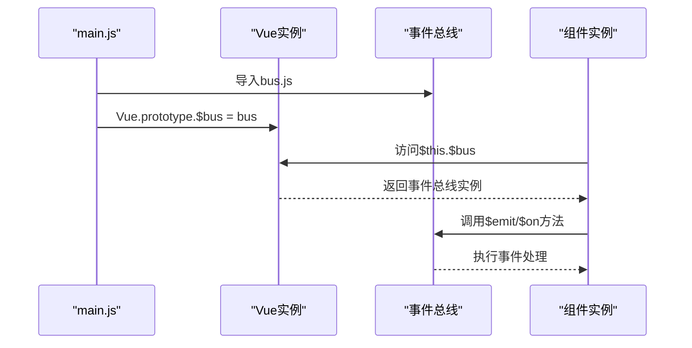
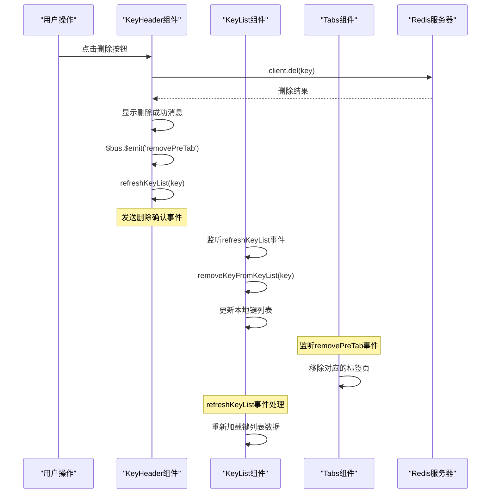
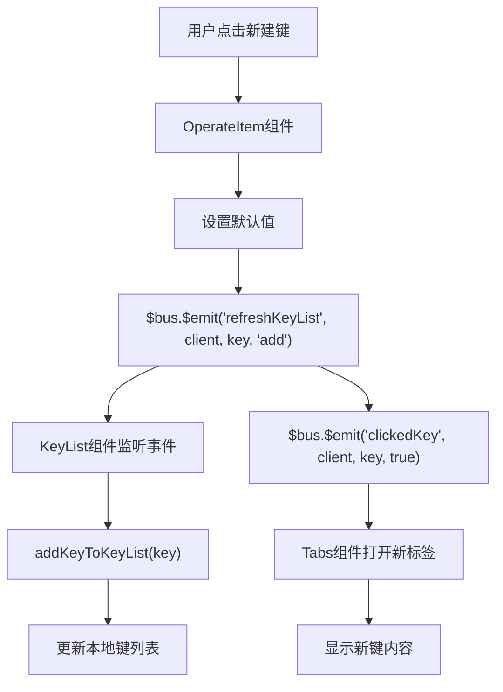
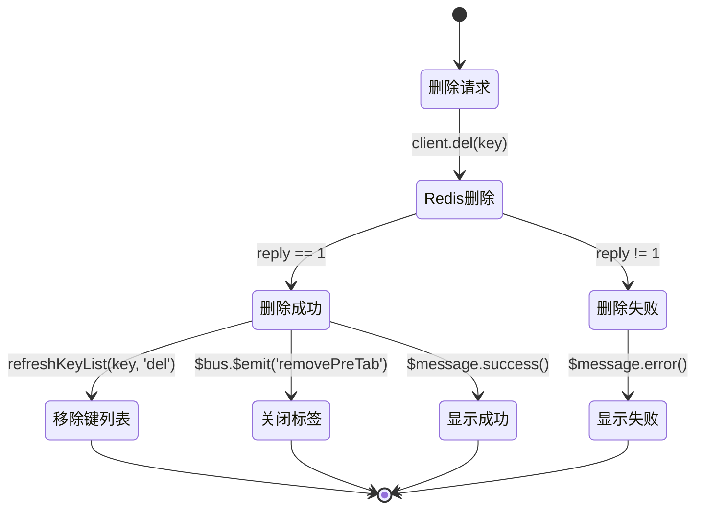
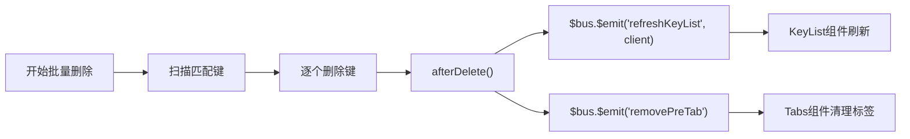
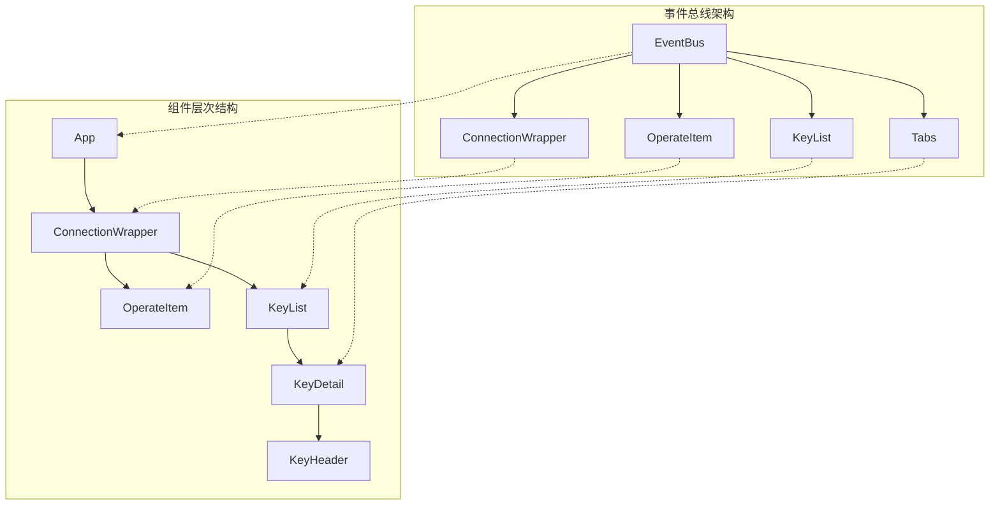

# 事件触发链路

<cite>
**本文档中引用的文件**
- [src/bus.js](file://src/bus.js)
- [src/components/KeyList.vue](file://src/components/KeyList.vue)
- [src/components/KeyHeader.vue](file://src/components/KeyHeader.vue)
- [src/components/KeyDetail.vue](file://src/components/KeyDetail.vue)
- [src/components/DeleteBatch.vue](file://src/components/DeleteBatch.vue)
- [src/components/KeyListNormal.vue](file://src/components/KeyListNormal.vue)
- [src/components/Tabs.vue](file://src/components/Tabs.vue)
- [src/components/OperateItem.vue](file://src/components/OperateItem.vue)
- [src/main.js](file://src/main.js)
</cite>

## 目录
1. [引言](#引言)
2. [事件总线架构概述](#事件总线架构概述)
3. [核心事件类型分析](#核心事件类型分析)
4. [事件触发链路详解](#事件触发链路详解)
5. [业务场景下的事件处理](#业务场景下的事件处理)
6. [事件总线的优势与性能考量](#事件总线的优势与性能考量)
7. [故障排除指南](#故障排除指南)
8. [总结](#总结)

## 引言

在Redis桌面管理器项目中，事件总线（Event Bus）作为核心通信机制，实现了组件间的松耦合通信。本文档深入分析从用户操作到事件最终响应的完整触发链路，重点探讨`$bus.$emit('refreshKeyList', client, key, type)`这一关键事件的传播过程，以及事件总线在整个应用架构中的作用机制。

## 事件总线架构概述

### 事件总线核心设计

事件总线采用基于Vue实例的单例模式设计，提供统一的事件通信接口：



**图表来源**
- [src/bus.js](file://src/bus.js#L1-L19)

### 事件总线初始化

事件总线在应用启动时被注入到Vue原型链中，成为所有组件可访问的全局通信机制：



**图表来源**
- [src/main.js](file://src/main.js#L16)
- [src/bus.js](file://src/bus.js#L3)

**章节来源**
- [src/bus.js](file://src/bus.js#L1-L19)
- [src/main.js](file://src/main.js#L16)

## 核心事件类型分析

### refreshKeyList事件

`refreshKeyList`是系统中最频繁使用的事件，用于同步键列表的更新状态：

| 事件参数 | 类型 | 描述 | 使用场景 |
|---------|------|------|----------|
| client | Redis客户端实例 | 当前连接的Redis客户端 | 区分不同连接的键列表 |
| key | Buffer/字符串 | 操作的键名 | 新增或删除特定键时传递 |
| type | 字符串 | 操作类型：'add'/'del'/'refresh' | 标识具体的操作行为 |

### 其他重要事件

| 事件名称 | 触发时机 | 接收组件 | 主要功能 |
|---------|----------|----------|----------|
| clickedKey | 键点击/双击 | Tabs组件 | 打开新的键详情标签页 |
| removePreTab | 键删除/操作完成 | Tabs组件 | 关闭对应的键详情标签页 |
| refreshConnections | 连接刷新 | ConnectionWrapper组件 | 更新连接列表状态 |
| openStatus/openCli | 功能打开 | Tabs组件 | 创建对应的功能标签页 |
| closeConnection | 连接关闭 | 各组件 | 清理连接相关资源 |

**章节来源**
- [src/components/KeyList.vue](file://src/components/KeyList.vue#L89-L103)
- [src/components/KeyHeader.vue](file://src/components/KeyHeader.vue#L233-L234)

## 事件触发链路详解

### 删除键操作的完整链路

以删除键操作为例，展示完整的事件触发和响应链路：



**图表来源**
- [src/components/KeyHeader.vue](file://src/components/KeyHeader.vue#L127-L141)
- [src/components/KeyList.vue](file://src/components/KeyList.vue#L89-L103)
- [src/components/Tabs.vue](file://src/components/Tabs.vue#L88-L91)

### 新增键操作的链路



**图表来源**
- [src/components/OperateItem.vue](file://src/components/OperateItem.vue#L298-L310)

**章节来源**
- [src/components/KeyHeader.vue](file://src/components/KeyHeader.vue#L127-L141)
- [src/components/OperateItem.vue](file://src/components/OperateItem.vue#L298-L310)

## 业务场景下的事件处理

### 场景一：键删除后的状态同步

当用户删除一个键时，系统需要执行以下同步操作：

1. **删除确认**：向Redis发送DEL命令并验证结果
2. **界面更新**：从当前连接的键列表中移除该键
3. **标签页管理**：关闭对应的键详情标签页
4. **用户体验**：显示成功/失败消息



**图表来源**
- [src/components/KeyHeader.vue](file://src/components/KeyHeader.vue#L133-L141)

### 场景二：批量删除操作

批量删除涉及更复杂的事件协调机制：



**图表来源**
- [src/components/DeleteBatch.vue](file://src/components/DeleteBatch.vue#L185-L198)

### 场景三：键重命名操作

键重命名涉及两个关键事件：

1. **删除原键**：`refreshKeyList(oldKey, 'del')`
2. **添加新键**：`refreshKeyList(newKey, 'add')` 和 `clickedKey(client, newKey)`

**章节来源**
- [src/components/KeyHeader.vue](file://src/components/KeyHeader.vue#L178-L181)
- [src/components/DeleteBatch.vue](file://src/components/DeleteBatch.vue#L185-L198)

## 事件总线的优势与性能考量

### 架构优势

1. **松耦合通信**：组件间无需直接依赖，降低维护成本
2. **集中式管理**：所有事件通过单一入口，便于调试和监控
3. **跨层级通信**：支持任意层级组件间的通信
4. **动态事件处理**：运行时可动态注册和注销事件监听器

### 性能影响分析

#### 优势性能特征

| 特征 | 描述 | 性能影响 |
|------|------|----------|
| 内存占用 | 基于Vue实例的轻量级设计 | 低内存消耗 |
| 事件传播 | 同步事件处理，无额外延迟 | 高性能 |
| 内存泄漏防护 | 支持显式事件解绑 | 可控的内存使用 |

#### 潜在性能问题

1. **事件累积**：大量事件可能导致内存占用增加
2. **事件冲突**：命名冲突可能引发意外行为
3. **调试复杂性**：事件流难以追踪和调试

### 大型组件树中的应用策略



**图表来源**
- [src/components/ConnectionWrapper.vue](file://src/components/ConnectionWrapper.vue#L54-L64)
- [src/components/KeyList.vue](file://src/components/KeyList.vue#L88-L103)

**章节来源**
- [src/bus.js](file://src/bus.js#L1-L19)
- [src/components/ConnectionWrapper.vue](file://src/components/ConnectionWrapper.vue#L54-L64)

## 故障排除指南

### 常见事件处理问题

#### 问题1：事件未触发
**症状**：用户操作后界面没有响应
**排查步骤**：
1. 检查事件是否正确发出：在触发点添加console.log
2. 验证事件监听器是否注册：检查组件的created钩子
3. 确认事件名称拼写：区分大小写

#### 问题2：重复事件处理
**症状**：同一操作触发多次响应
**排查步骤**：
1. 检查事件监听器是否重复注册
2. 确认事件解绑逻辑是否正确执行
3. 避免在多个地方重复监听同一事件

#### 问题3：事件参数错误
**症状**：事件处理函数收到错误的参数
**排查步骤**：
1. 验证$emit调用时的参数顺序
2. 检查参数类型是否符合预期
3. 添加参数验证逻辑

### 调试技巧

```javascript
// 在事件发出处添加调试信息
console.log('Emitting refreshKeyList:', { client, key, type });

// 在事件监听处添加调试信息  
console.log('Received refreshKeyList:', arguments);

// 监控事件总线状态
window.debugBus = {
  listeners: Object.keys(bus._events),
  count: Object.keys(bus._events).length
};
```

**章节来源**
- [src/components/KeyList.vue](file://src/components/KeyList.vue#L89-L103)
- [src/components/KeyHeader.vue](file://src/components/KeyHeader.vue#L233-L234)

## 总结

事件总线作为Redis桌面管理器的核心通信机制，实现了高效的组件间通信。通过`$bus.$emit('refreshKeyList', client, key, type)`这一关键事件，系统能够实现：

1. **实时状态同步**：键的增删改操作能够即时反映到所有相关组件
2. **松耦合架构**：组件间通过事件进行通信，降低了耦合度
3. **可扩展性**：新的业务需求可以通过添加事件监听器轻松实现
4. **维护便利性**：集中式的事件管理使得代码维护更加简单

在大型组件树中，事件总线的优势尤为明显，它避免了复杂的props传递和回调函数嵌套，为构建可维护的Vue应用提供了优秀的解决方案。然而，在使用过程中需要注意事件的生命周期管理和性能优化，确保系统的稳定性和响应速度。