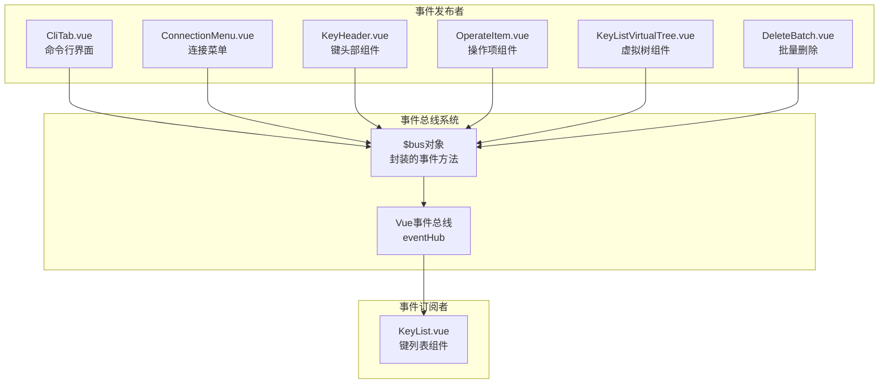
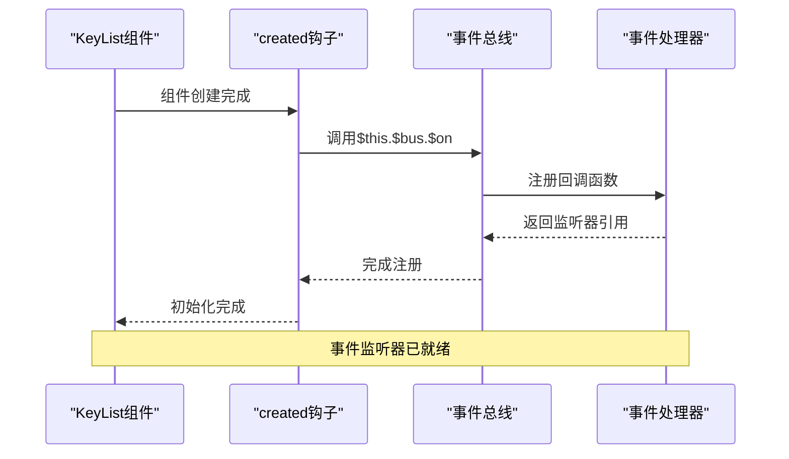
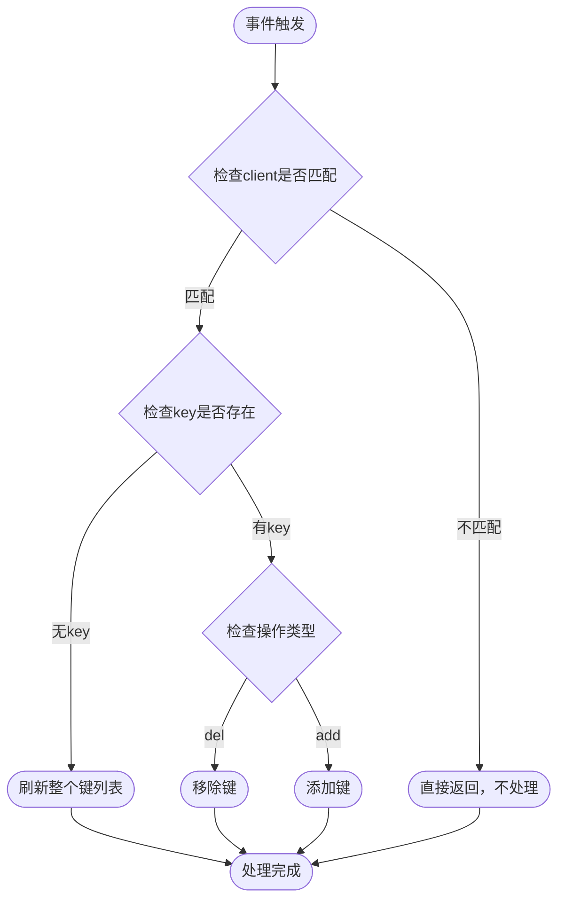
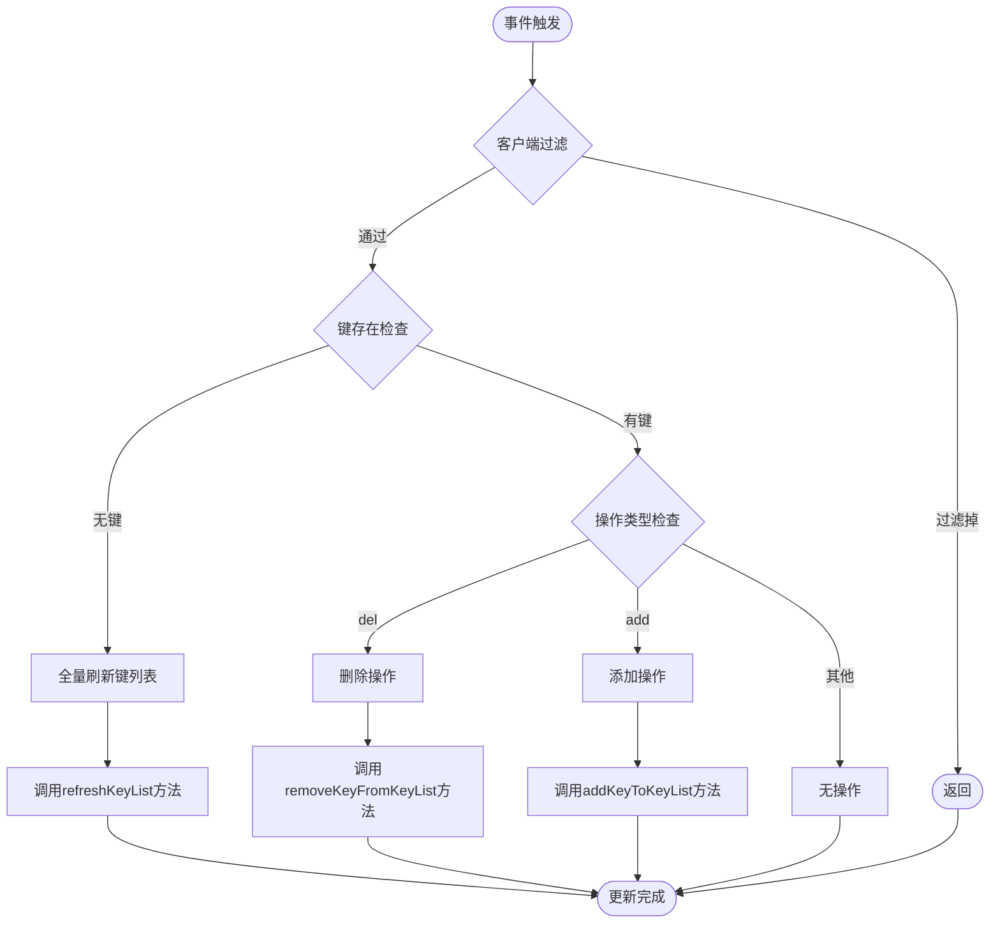
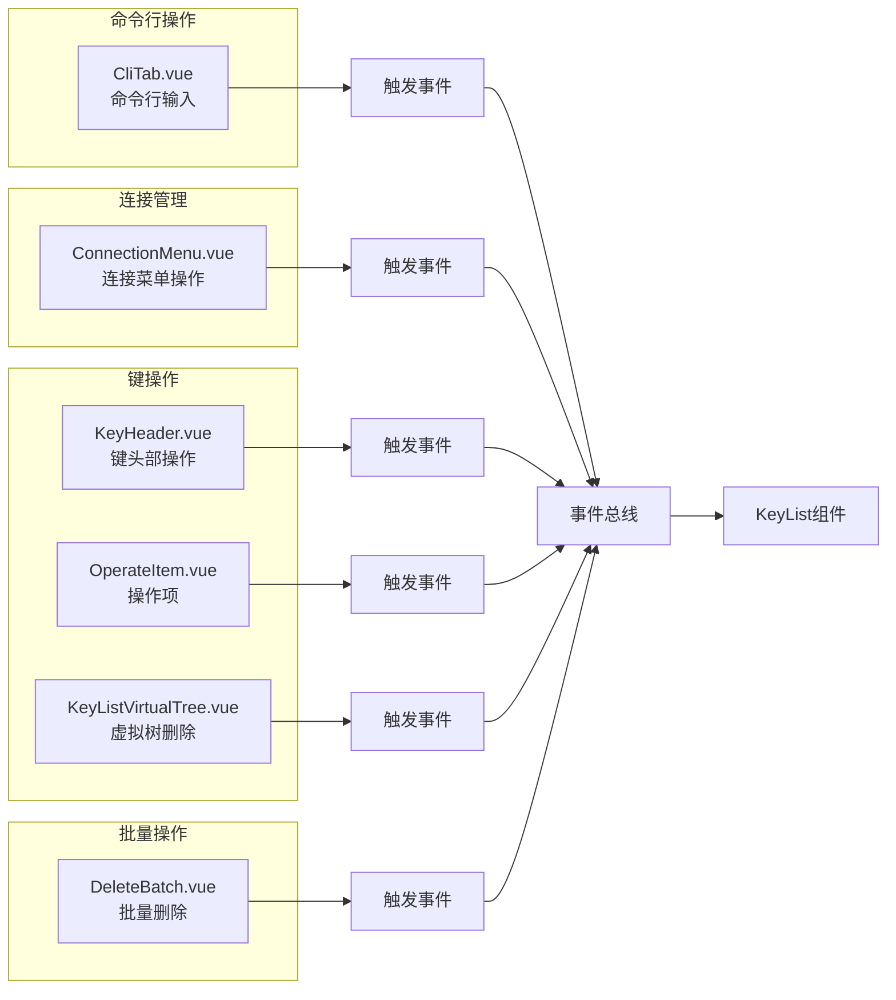

# 事件订阅机制

<cite>
**本文档引用的文件**
- [KeyList.vue](file://src/components/KeyList.vue)
- [bus.js](file://src/bus.js)
- [CliTab.vue](file://src/components/CliTab.vue)
- [ConnectionMenu.vue](file://src/components/ConnectionMenu.vue)
- [KeyHeader.vue](file://src/components/KeyHeader.vue)
- [OperateItem.vue](file://src/components/OperateItem.vue)
- [KeyListVirtualTree.vue](file://src/components/KeyListVirtualTree.vue)
- [DeleteBatch.vue](file://src/components/DeleteBatch.vue)
</cite>

## 目录
1. [简介](#简介)
2. [事件总线架构](#事件总线架构)
3. [KeyList组件事件订阅](#keylist组件事件订阅)
4. [事件监听器注册过程](#事件监听器注册过程)
5. [事件过滤机制](#事件过滤机制)
6. [事件处理逻辑](#事件处理逻辑)
7. [事件触发场景](#事件触发场景)
8. [最佳实践](#最佳实践)
9. [总结](#总结)

## 简介

在Another Redis Desktop Manager项目中，KeyList.vue组件通过Vue的事件总线机制实现了键列表的实时更新功能。该组件在created生命周期钩子中订阅了`refreshKeyList`事件，当接收到相关事件时，能够根据不同的操作类型（添加或删除）动态更新键列表内容。

这种设计模式体现了Vue.js中组件间通信的最佳实践，通过事件总线实现了松耦合的组件交互，确保了键列表数据的一致性和实时性。

## 事件总线架构

项目采用Vue实例作为事件总线的核心架构，通过全局的事件中心实现组件间的解耦通信。



**图表来源**
- [bus.js](file://src/bus.js#L1-L19)
- [KeyList.vue](file://src/components/KeyList.vue#L88-L103)

**章节来源**
- [bus.js](file://src/bus.js#L1-L19)

## KeyList组件事件订阅

KeyList.vue组件在created生命周期钩子中通过`this.$bus.$on`方法订阅`refreshKeyList`事件，建立了与事件总线的连接。

### 订阅语法结构

事件订阅采用标准的Vue事件监听语法：

```javascript
// 订阅refreshKeyList事件
this.$bus.$on('refreshKeyList', (client, key = '', type = 'del') => {
    // 事件处理逻辑
});
```

### 参数解析

事件回调函数接收三个参数：
- `client`: Redis客户端实例，用于标识事件来源
- `key`: 键名（Buffer格式），可选参数，默认为空字符串
- `type`: 操作类型，可选参数，默认为'del'

**章节来源**
- [KeyList.vue](file://src/components/KeyList.vue#L88-L103)

## 事件监听器注册过程

事件监听器的注册过程遵循Vue生命周期管理的最佳实践，确保在组件初始化阶段建立正确的事件监听关系。



**图表来源**
- [KeyList.vue](file://src/components/KeyList.vue#L88-L103)

### 注册时机分析

事件监听器在组件的created生命周期钩子中注册，这一选择具有以下优势：

1. **早期注册**: 在组件渲染前完成事件监听器注册
2. **避免重复**: 确保每个组件实例只注册一次监听器
3. **资源管理**: 便于在组件销毁时进行清理

**章节来源**
- [KeyList.vue](file://src/components/KeyList.vue#L88-L103)

## 事件过滤机制

KeyList组件实现了精确的事件过滤机制，确保只处理与当前连接相关的事件，避免跨连接的数据干扰。

### 过滤逻辑实现

```javascript
// 事件过滤核心逻辑
if (client !== this.client) {
    return;
}
```

### 过滤原理

事件过滤基于Redis客户端实例的引用比较，确保：
- **唯一性**: 每个连接维护独立的键列表
- **隔离性**: 不同连接的事件不会相互影响
- **准确性**: 只更新与当前组件关联的键列表



**图表来源**
- [KeyList.vue](file://src/components/KeyList.vue#L90-L103)

**章节来源**
- [KeyList.vue](file://src/components/KeyList.vue#L90-L103)

## 事件处理逻辑

事件处理逻辑根据不同的操作类型执行相应的键列表更新操作，支持两种主要的操作模式：全量刷新和增量更新。

### 处理流程详解



**图表来源**
- [KeyList.vue](file://src/components/KeyList.vue#L90-L103)

### 具体实现细节

#### 全量刷新处理

当事件中未提供具体键名时，执行全量刷新：

```javascript
// 全量刷新逻辑
if (!key) {
    return this.refreshKeyList();
}
```

#### 删除操作处理

当操作类型为'del'时，调用删除方法：

```javascript
// 删除键逻辑
(type == 'del') && this.removeKeyFromKeyList(key);
```

#### 添加操作处理

当操作类型为'add'时，调用添加方法：

```javascript
// 添加键逻辑
(type == 'add') && this.addKeyToKeyList(key);
```

**章节来源**
- [KeyList.vue](file://src/components/KeyList.vue#L90-L103)

## 事件触发场景

项目中有多个组件会触发`refreshKeyList`事件，涵盖了Redis操作的各种场景。

### 触发源分析



**图表来源**
- [CliTab.vue](file://src/components/CliTab.vue#L294-L298)
- [ConnectionMenu.vue](file://src/components/ConnectionMenu.vue#L356-L357)
- [KeyHeader.vue](file://src/components/KeyHeader.vue#L233-L234)
- [OperateItem.vue](file://src/components/OperateItem.vue#L308-L309)
- [KeyListVirtualTree.vue](file://src/components/KeyListVirtualTree.vue#L232-L233)
- [DeleteBatch.vue](file://src/components/DeleteBatch.vue#L192)

### 典型触发场景

#### 1. 命令行添加键
```javascript
// 添加键操作
this.$bus.$emit('refreshKeyList', this.client, Buffer.from(params[1]), 'add');
```

#### 2. 命令行删除键
```javascript
// 删除键操作  
this.$bus.$emit('refreshKeyList', this.client, Buffer.from(params[1]), 'del');
```

#### 3. 连接导入操作
```javascript
// 导入后刷新键列表
this.$bus.$emit('refreshKeyList', this.client);
```

#### 4. 键头部删除操作
```javascript
// 删除键后刷新
this.$bus.$emit('refreshKeyList', this.client, key, type);
```

**章节来源**
- [CliTab.vue](file://src/components/CliTab.vue#L294-L298)
- [ConnectionMenu.vue](file://src/components/ConnectionMenu.vue#L356-L357)
- [KeyHeader.vue](file://src/components/KeyHeader.vue#L233-L234)
- [OperateItem.vue](file://src/components/OperateItem.vue#L308-L309)
- [KeyListVirtualTree.vue](file://src/components/KeyListVirtualTree.vue#L232-L233)
- [DeleteBatch.vue](file://src/components/DeleteBatch.vue#L192)

## 最佳实践

基于KeyList组件的事件订阅实现，总结出以下最佳实践指南：

### 1. 事件命名规范

使用语义化的事件名称，如`refreshKeyList`，清晰表达事件意图。

### 2. 参数传递约定

- 第一个参数始终为`client`，用于事件过滤
- 第二个参数为可选的`key`，表示具体操作的键
- 第三个参数为可选的`type`，表示操作类型

### 3. 过滤机制的重要性

必须实现客户端过滤，避免跨连接的数据干扰。

### 4. 生命周期管理

在合适的生命周期钩子中注册事件监听器，确保资源的有效管理。

### 5. 错误处理

虽然当前实现中没有显式的错误处理，但在生产环境中应该考虑添加异常捕获机制。

### 6. 性能优化

对于频繁的键操作，可以考虑批量处理或防抖机制，减少不必要的刷新频率。

## 总结

KeyList.vue组件的事件订阅机制展现了Vue.js中组件间通信的优雅解决方案。通过事件总线模式，实现了：

1. **松耦合设计**: 组件间通过事件进行通信，降低了直接依赖
2. **实时响应**: 键列表能够及时反映Redis数据库的变化
3. **精确控制**: 基于客户端实例的过滤确保了数据的正确性
4. **灵活扩展**: 支持多种操作类型的统一处理

这种设计不仅提高了代码的可维护性，也为项目的扩展提供了良好的基础。通过合理的事件命名、参数传递和过滤机制，确保了系统的稳定性和性能。