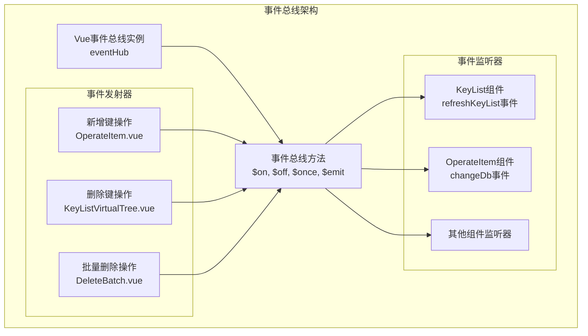
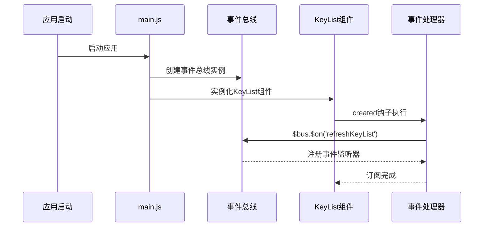
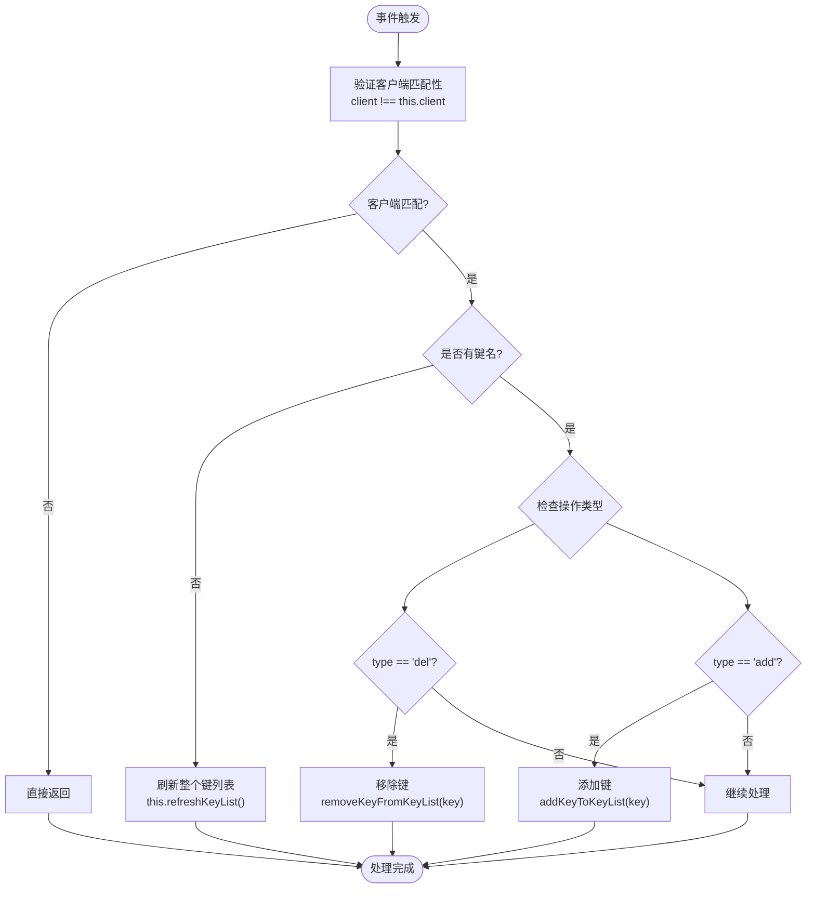
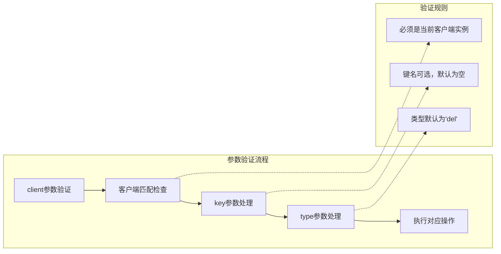
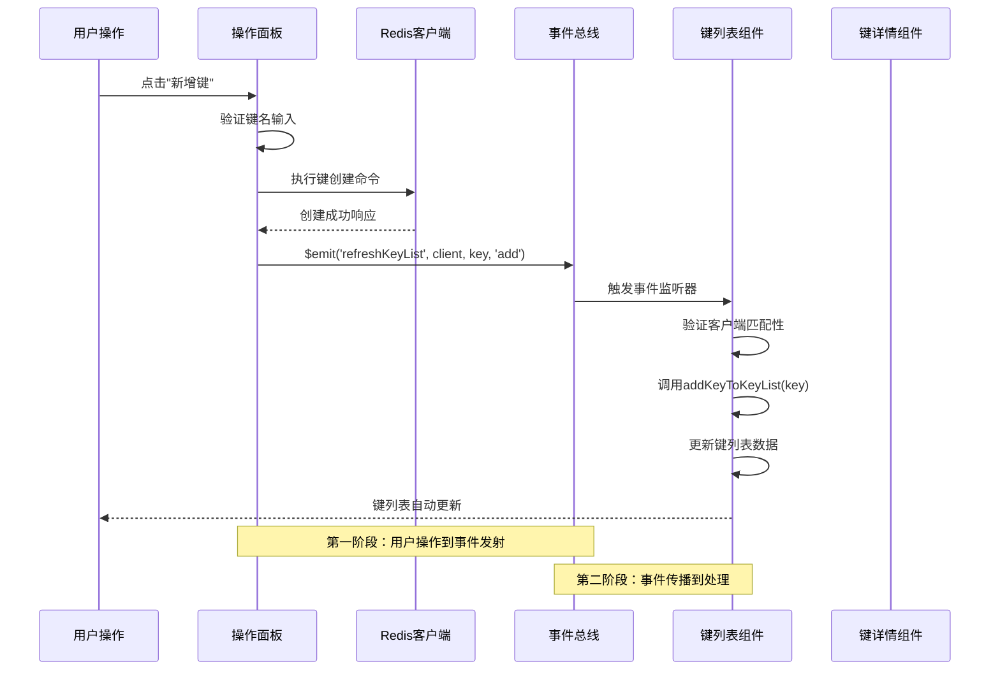
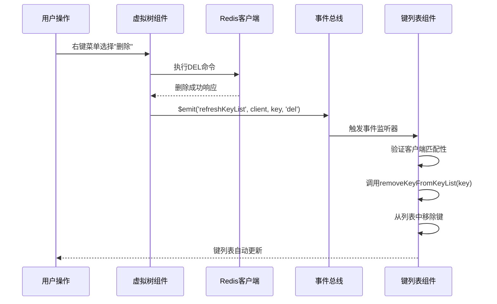
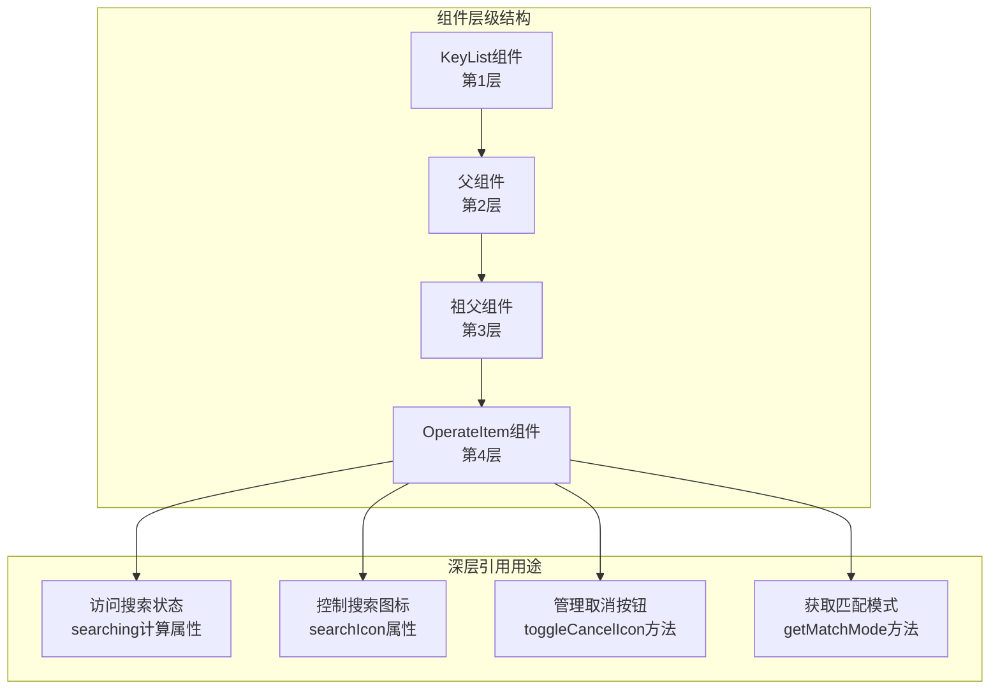
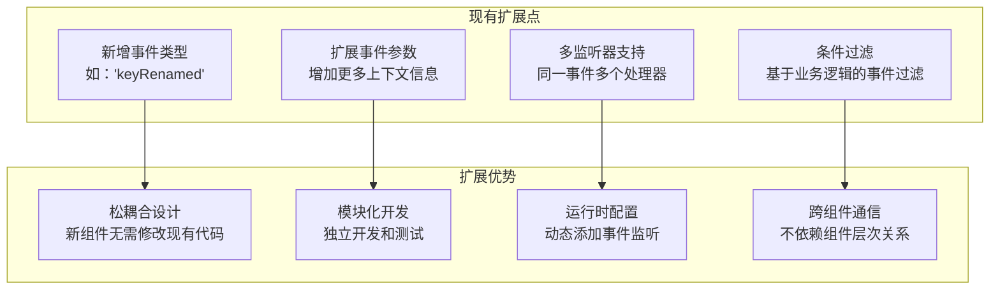
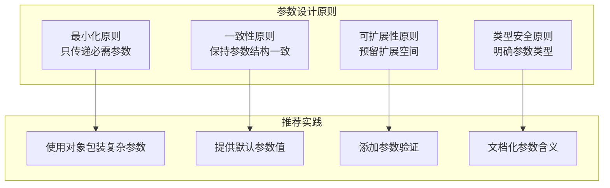

# 事件驱动通信机制文档

<cite>
**本文档中引用的文件**
- [KeyList.vue](file://src/components/KeyList.vue)
- [bus.js](file://src/bus.js)
- [main.js](file://src/main.js)
- [OperateItem.vue](file://src/components/OperateItem.vue)
- [KeyListVirtualTree.vue](file://src/components/KeyListVirtualTree.vue)
- [KeyHeader.vue](file://src/components/KeyHeader.vue)
- [DeleteBatch.vue](file://src/components/DeleteBatch.vue)
</cite>

## 目录
1. [简介](#简介)
2. [事件总线架构](#事件总线架构)
3. [KeyList组件事件订阅机制](#keylist组件事件订阅机制)
4. [事件参数传递模式](#事件参数传递模式)
5. [事件触发链路分析](#事件触发链路分析)
6. [深层引用的使用场景与风险](#深层引用的使用场景与风险)
7. [可扩展性分析](#可扩展性分析)
8. [最佳实践建议](#最佳实践建议)
9. [总结](#总结)

## 简介

本文档深入分析了Another Redis Desktop Manager项目中基于事件总线的组件通信机制，重点关注KeyList.vue组件在created钩子中通过$bus.$on('refreshKeyList')订阅键列表刷新事件的实现方式。该系统采用Vue实例作为事件总线，实现了组件间的松耦合通信，支持键的增删操作和状态同步。

## 事件总线架构

### 事件总线核心实现

事件总线系统基于Vue实例构建，提供了标准的发布-订阅模式功能：

**图表来源**
- [bus.js](file://src/bus.js#L1-L19)
- [main.js](file://src/main.js#L16)

### 事件总线初始化

事件总线在应用启动时通过main.js进行全局注入：

**章节来源**
- [main.js](file://src/main.js#L16)
- [bus.js](file://src/bus.js#L1-L19)

## KeyList组件事件订阅机制

### 订阅实现位置

KeyList组件在created生命周期钩子中订阅refreshKeyList事件：

**图表来源**
- [KeyList.vue](file://src/components/KeyList.vue#L88-L103)

### 事件处理逻辑详解

事件处理函数实现了精确的客户端匹配和操作类型判断：

**图表来源**
- [KeyList.vue](file://src/components/KeyList.vue#L90-L103)

**章节来源**
- [KeyList.vue](file://src/components/KeyList.vue#L88-L103)

## 事件参数传递模式

### 核心参数结构

refreshKeyList事件采用三参数传递模式：

| 参数名称 | 类型 | 必需性 | 描述 | 示例值 |
|---------|------|--------|------|--------|
| client | Object | 必需 | Redis客户端实例 | 当前连接的客户端对象 |
| key | Buffer/String | 可选 | 操作的目标键 | Buffer.from('mykey') |
| type | String | 默认为'del' | 操作类型标识 | 'add' 或 'del' |

### 参数验证机制

事件处理器实现了严格的参数验证：

**图表来源**
- [KeyList.vue](file://src/components/KeyList.vue#L91-L102)

**章节来源**
- [KeyList.vue](file://src/components/KeyList.vue#L90-L103)

## 事件触发链路分析

### 完整触发链路

以新增键操作为例，展示完整的事件触发链路：

**图表来源**
- [OperateItem.vue](file://src/components/OperateItem.vue#L308-L310)
- [KeyList.vue](file://src/components/KeyList.vue#L90-L103)

### 删除键操作链路

**图表来源**
- [KeyListVirtualTree.vue](file://src/components/KeyListVirtualTree.vue#L233)
- [KeyList.vue](file://src/components/KeyList.vue#L267-L277)

**章节来源**
- [OperateItem.vue](file://src/components/OperateItem.vue#L308-L310)
- [KeyListVirtualTree.vue](file://src/components/KeyListVirtualTree.vue#L233)
- [DeleteBatch.vue](file://src/components/DeleteBatch.vue#L193)

## 深层引用的使用场景与风险

### 使用场景分析

KeyList组件中存在深层的$parent.$parent.$parent引用，主要用于访问共享状态：

**图表来源**
- [KeyList.vue](file://src/components/KeyList.vue#L84-L86)
- [KeyList.vue](file://src/components/KeyList.vue#L119-L121)

### 潜在维护风险

深层引用带来了以下维护风险：

| 风险类型 | 具体表现 | 影响范围 | 解决方案建议 |
|---------|----------|----------|-------------|
| 组件耦合度高 | 强依赖特定层级结构 | 整个组件树 | 使用provide/inject或Vuex |
| 层级变化风险 | 组件结构调整导致失效 | 所有深层引用 | 建立引用映射层 |
| 调试困难 | 错误定位困难 | 开发效率 | 添加引用验证和警告 |
| 性能影响 | 多层访问开销 | 运行性能 | 缓存中间结果 |

**章节来源**
- [KeyList.vue](file://src/components/KeyList.vue#L84-L86)
- [KeyList.vue](file://src/components/KeyList.vue#L119-L121)

## 可扩展性分析

### 系统扩展能力

事件驱动通信机制具有良好的可扩展性：

### 大型应用适用性

对于大型应用，该通信模式表现出以下特点：

| 特性 | 表现 | 优势 | 注意事项 |
|------|------|------|----------|
| 耦合度 | 极低 | 易于维护和扩展 | 需要良好的命名规范 |
| 性能 | 中等 | 适合中等规模应用 | 大规模应用可能需要优化 |
| 可测试性 | 较好 | 支持单元测试 | 需要模拟事件总线 |
| 可观察性 | 一般 | 需要额外的日志记录 | 建议添加事件追踪 |

## 最佳实践建议

### 事件命名规范

建议采用统一的事件命名约定：
- 使用动词开头：`refreshKeyList`、`addNewKey`、`deleteKey`
- 包含上下文信息：`client:refreshKeyList`、`user:login`
- 避免过于宽泛的名称：使用具体的操作描述

### 事件参数设计原则

### 错误处理策略

建议实施完善的错误处理机制：
- 事件监听器中的异常捕获
- 参数验证失败的优雅降级
- 事件超时和重试机制
- 错误日志记录和监控

## 总结

Another Redis Desktop Manager项目中的事件驱动通信机制展现了现代前端应用中组件间通信的最佳实践。KeyList.vue在created钩子中通过$bus.$on('refreshKeyList')订阅键列表刷新事件的实现，体现了以下核心价值：

1. **松耦合架构**：通过事件总线实现了组件间的解耦，支持灵活的功能扩展
2. **精确控制**：事件处理器实现了客户端匹配和操作类型的双重验证
3. **参数化设计**：三参数传递模式提供了足够的灵活性和可扩展性
4. **实时响应**：事件驱动确保了界面状态与数据状态的实时同步

然而，深层引用的使用也提醒我们在设计时要注意组件层次结构的稳定性，建议在未来的版本中考虑使用provide/inject或状态管理库来替代深层引用，进一步提升系统的可维护性和可扩展性。

该事件驱动通信机制为构建大型、复杂的桌面应用程序提供了可靠的架构基础，其设计理念和实现方式值得在类似项目中借鉴和应用。