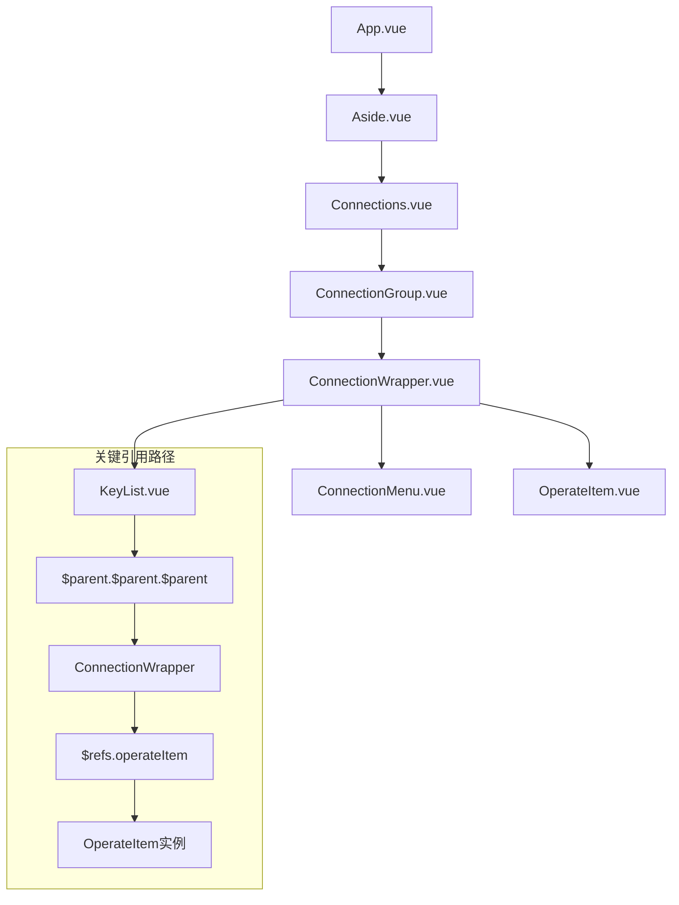
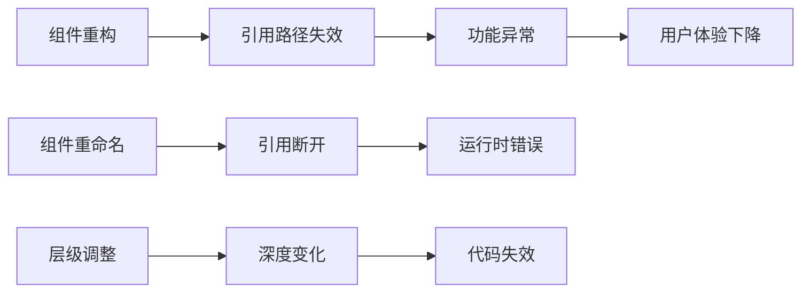
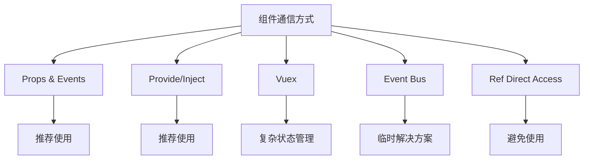

# 深层父级引用模式

<cite>
**本文档中引用的文件**
- [KeyList.vue](file://src/components/KeyList.vue)
- [OperateItem.vue](file://src/components/OperateItem.vue)
- [ConnectionWrapper.vue](file://src/components/ConnectionWrapper.vue)
- [bus.js](file://src/bus.js)
- [App.vue](file://src/App.vue)
</cite>

## 目录
1. [引言](#引言)
2. [问题背景](#问题背景)
3. [组件层级结构分析](#组件层级结构分析)
4. [深层引用实现原理](#深层引用实现原理)
5. [技术动因分析](#技术动因分析)
6. [可维护性风险评估](#可维护性风险评估)
7. [替代方案建议](#替代方案建议)
8. [最佳实践建议](#最佳实践建议)
9. [总结](#总结)

## 引言

在Vue.js应用程序开发中，组件间的通信是一个核心设计挑战。本文档深入分析了Another Redis Desktop Manager项目中KeyList.vue组件采用的深层父级引用模式（`$parent.$parent.$parent`），探讨其技术实现、设计动机以及潜在的架构风险。

这种引用模式在项目中被用来直接访问OperateItem组件实例，以控制搜索图标状态和取消扫描按钮的显示。虽然这种实现方式在短期内解决了特定功能需求，但长期来看可能带来严重的维护性问题。

## 问题背景

在Redis桌面管理器应用中，KeyList组件负责处理键值列表的展示和搜索功能。为了实现搜索过程中的状态反馈，需要实时更新搜索图标状态和显示/隐藏取消扫描按钮。这些操作需要直接访问OperateItem组件的方法和属性。

## 组件层级结构分析

基于代码分析，当前的组件层级结构如下：



**图表来源**
- [App.vue](file://src/App.vue#L1-L50)
- [ConnectionWrapper.vue](file://src/components/ConnectionWrapper.vue#L1-L50)

### 层级深度详解

从KeyList.vue到OperateItem.vue的完整引用路径为：
1. **KeyList.vue** → `$parent` → **ConnectionWrapper.vue**
2. **ConnectionWrapper.vue** → `$parent` → **ConnectionMenu.vue**
3. **ConnectionMenu.vue** → `$parent` → **Connections.vue**
4. **Connections.vue** → `$parent` → **Aside.vue**
5. **Aside.vue** → `$parent` → **App.vue**

这种深层引用揭示了组件间存在过度耦合的问题，违反了Vue.js推荐的组件通信原则。

**章节来源**
- [KeyList.vue](file://src/components/KeyList.vue#L84-L86)
- [KeyList.vue](file://src/components/KeyList.vue#L119-L121)
- [KeyList.vue](file://src/components/KeyList.vue#L224-L233)

## 深层引用实现原理

### 核心实现机制

KeyList.vue通过以下方式实现深层引用：

#### 1. 状态检查机制
```javascript
// 在computed属性中检查搜索状态
searching() {
  return this.$parent.$parent.$parent.$refs.operateItem.searchIcon == 'el-icon-loading';
}
```

#### 2. 方法调用机制
```javascript
// 设置搜索状态
setSearchStatus() {
  this.$parent.$parent.$parent.$refs.operateItem.searchIcon = 'el-icon-loading';
  this.$parent.$parent.$parent.$refs.operateItem.toggleCancelIcon(true);
}

// 重置搜索状态
resetSearchStatus() {
  this.$parent.$parent.$parent.$refs.operateItem.searchIcon = 'el-icon-search';
  this.$parent.$parent.$parent.$refs.operateItem.toggleCancelIcon(false);
}
```

#### 3. 参数传递机制
```javascript
// 获取搜索匹配模式
getMatchMode(fillStar = true) {
  let match = this.$parent.$parent.$parent.$refs.operateItem.searchMatch;
  // ... 处理逻辑
}
```

**章节来源**
- [KeyList.vue](file://src/components/KeyList.vue#L84-L86)
- [KeyList.vue](file://src/components/KeyList.vue#L224-L233)
- [KeyList.vue](file://src/components/KeyList.vue#L257-L265)

## 技术动因分析

### 设计决策背景

1. **快速实现需求**：开发者选择直接引用而非重构现有架构，以快速满足功能需求
2. **避免大规模修改**：不愿改变现有的组件通信机制和数据流
3. **性能考虑**：认为直接引用比事件总线更高效

### 功能需求驱动

- **搜索状态同步**：需要实时反映搜索进度
- **用户交互反馈**：提供即时的视觉反馈
- **取消功能支持**：允许用户中断长时间运行的扫描操作

## 可维护性风险评估

### 架构脆弱性



### 具体风险点

#### 1. 结构重构风险
- **组件位置变更**：任何上层组件的结构调整都会导致引用失效
- **条件渲染影响**：如果某个中间组件使用了v-if/v-else，可能导致引用链断裂
- **动态组件切换**：使用component标签动态切换组件类型

#### 2. 维护成本增加
- **代码可读性差**：深层引用降低了代码的可理解性
- **调试困难**：错误定位需要追溯复杂的引用链
- **测试复杂度高**：单元测试难以隔离依赖

#### 3. 团队协作障碍
- **新成员学习曲线**：不熟悉深层引用模式的开发者难以快速上手
- **代码审查难度**：审查人员需要深入理解整个组件树结构

**章节来源**
- [KeyList.vue](file://src/components/KeyList.vue#L1-L350)

## 替代方案建议

### 方案一：事件总线模式

利用项目已有的bus.js实现组件间通信：

```javascript
// KeyList.vue 中的改进实现
methods: {
  setSearchStatus() {
    this.$bus.$emit('searchStatusChanged', {
      icon: 'el-icon-loading',
      showCancel: true
    });
  },
  
  resetSearchStatus() {
    this.$bus.$emit('searchStatusChanged', {
      icon: 'el-icon-search',
      showCancel: false
    });
  }
}
```

```javascript
// OperateItem.vue 中的监听实现
created() {
  this.$bus.$on('searchStatusChanged', this.handleSearchStatus);
},
methods: {
  handleSearchStatus(status) {
    this.searchIcon = status.icon;
    this.showCancelIcon = status.showCancel;
    // 延迟显示取消按钮
    if (status.showCancel) {
      this.toggleCancelIcon(true);
    }
  }
}
```

### 方案二：Vuex状态管理

对于更复杂的状态管理需求，可以引入Vuex：

```javascript
// store/modules/search.js
export default {
  state: {
    searchIcon: 'el-icon-search',
    showCancelIcon: false,
    loadingAll: false
  },
  mutations: {
    SET_SEARCH_STATUS(state, { icon, showCancel }) {
      state.searchIcon = icon;
      state.showCancelIcon = showCancel;
    }
  },
  actions: {
    updateSearchStatus({ commit }, status) {
      commit('SET_SEARCH_STATUS', status);
    }
  }
}
```

### 方案三：provide/inject模式

利用Vue的provide/inject机制实现跨层级通信：

```javascript
// ConnectionWrapper.vue (提供者)
export default {
  provide() {
    return {
      searchStateManager: this
    };
  },
  methods: {
    setSearchStatus(icon, showCancel) {
      // 实现状态设置逻辑
    }
  }
}

// KeyList.vue (消费者)
export default {
  inject: ['searchStateManager'],
  methods: {
    setSearchStatus() {
      this.searchStateManager.setSearchStatus('el-icon-loading', true);
    }
  }
}
```

**章节来源**
- [bus.js](file://src/bus.js#L1-L19)
- [OperateItem.vue](file://src/components/OperateItem.vue#L143-L162)

## 最佳实践建议

### 1. 组件通信优先级



### 2. 代码重构指导原则

#### 短期修复策略
```javascript
// 临时解决方案：添加错误处理和注释
setSearchStatus() {
  try {
    const operateItem = this.$parent.$parent.$parent.$refs.operateItem;
    if (operateItem) {
      operateItem.searchIcon = 'el-icon-loading';
      operateItem.toggleCancelIcon(true);
    } else {
      console.warn('OperateItem reference not found');
    }
  } catch (error) {
    console.error('Failed to set search status:', error);
  }
}
```

#### 长期重构计划
1. **识别依赖关系**：绘制完整的组件通信图
2. **制定重构时间表**：分阶段实施重构
3. **编写迁移指南**：为团队提供清晰的迁移路径
4. **建立测试覆盖**：确保重构过程中的功能完整性

### 3. 监控和预防措施

#### 代码质量监控
- **静态分析工具**：配置ESLint检测深层引用
- **架构审查**：定期检查组件间的依赖关系
- **技术债务跟踪**：记录和跟踪此类问题的解决进度

#### 开发规范制定
```javascript
// ESLint规则示例
{
  "rules": {
    "vue/no-parent-access": "warn",
    "vue/max-depth": ["warn", 3]
  }
}
```

## 总结

KeyList.vue中使用的`$parent.$parent.$parent`深层引用模式反映了现代Web应用开发中常见的架构权衡。虽然这种实现方式在短期内解决了功能需求，但从长期维护的角度来看，它带来了显著的架构风险和维护成本。

### 关键发现

1. **技术可行性**：深层引用确实实现了所需功能，但代价是破坏了组件的封装性
2. **维护风险**：任何组件结构的调整都可能导致功能失效
3. **团队协作影响**：增加了新成员的学习难度和代码审查复杂度
4. **扩展性限制**：未来功能扩展可能受到现有架构的制约

### 推荐行动方案

1. **立即措施**：为现有深层引用添加错误处理和详细的代码注释
2. **短期目标**：在下一个功能迭代中逐步替换为事件总线模式
3. **长期规划**：制定完整的组件通信架构重构计划
4. **团队培训**：加强Vue.js最佳实践和组件设计原则的培训

通过采用更符合Vue.js设计哲学的组件通信方式，不仅可以消除当前的技术债务，还能为项目的长期发展奠定坚实的基础。这将提高代码的可维护性、可测试性和团队协作效率，最终提升产品的整体质量和用户体验。