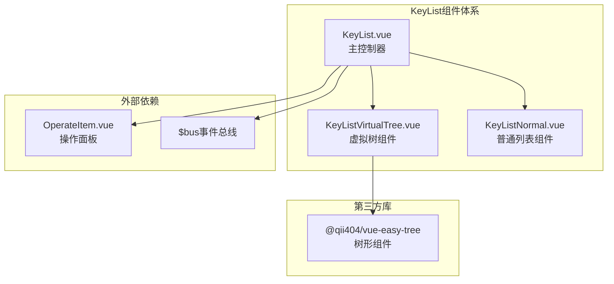
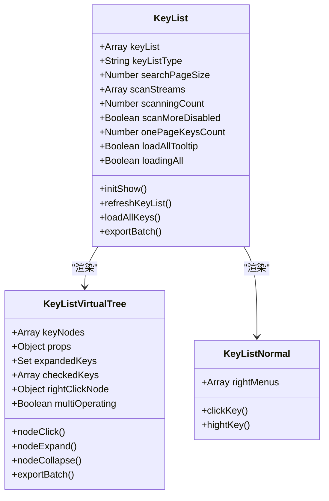
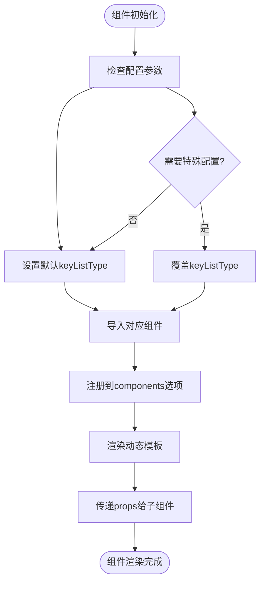
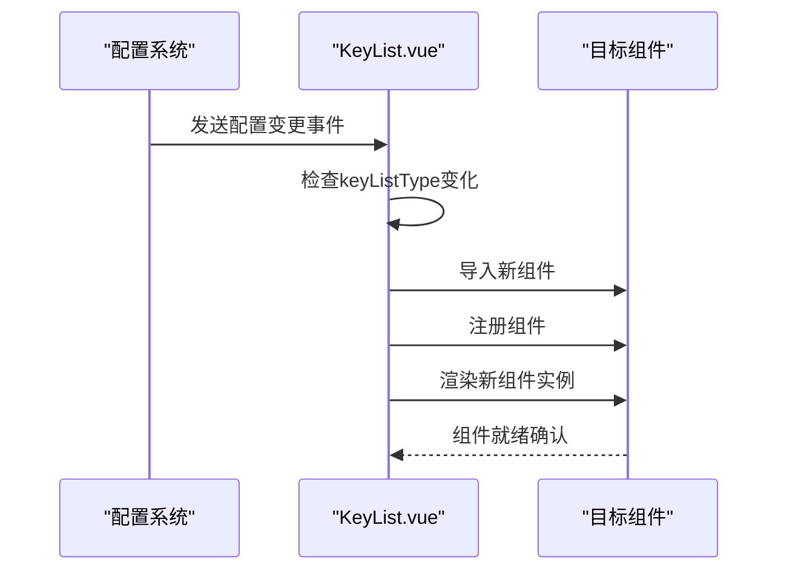
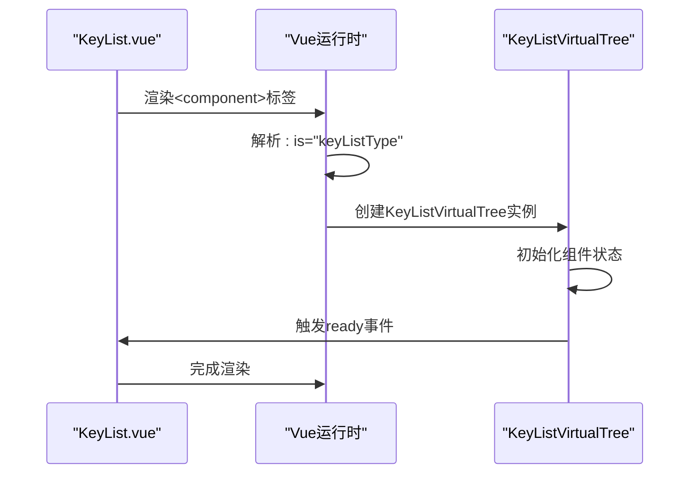
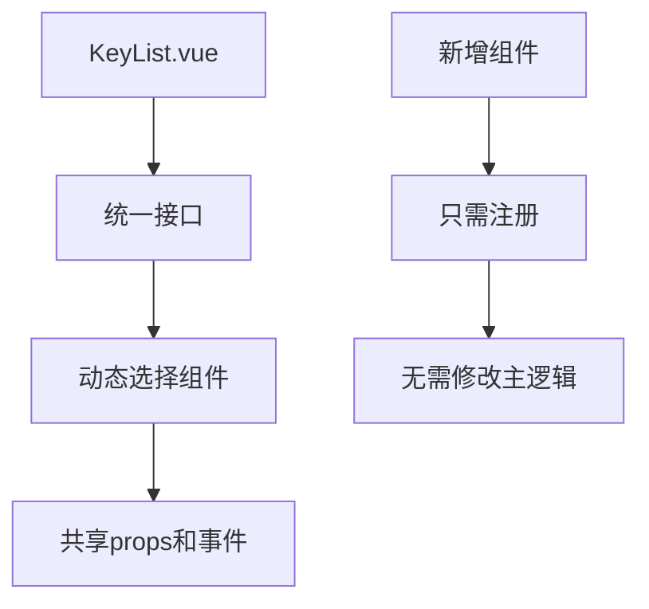
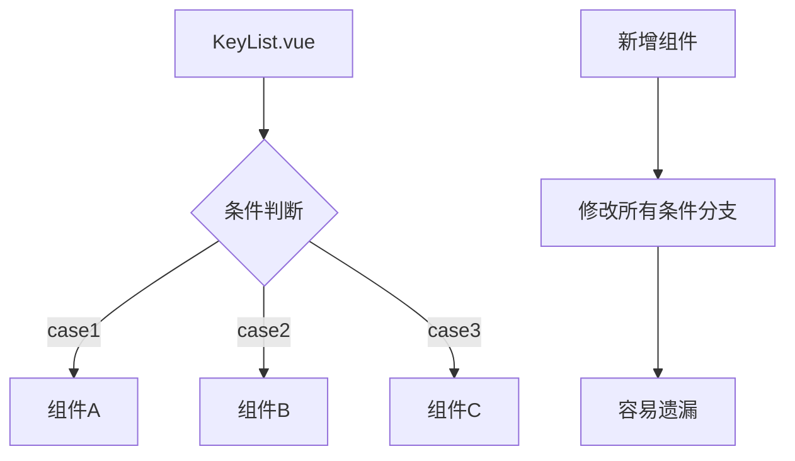
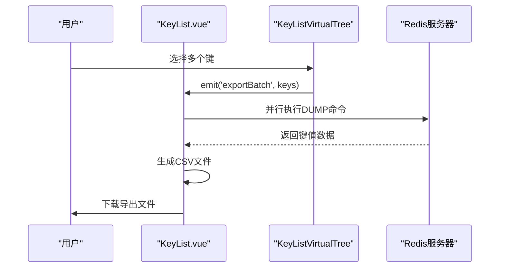
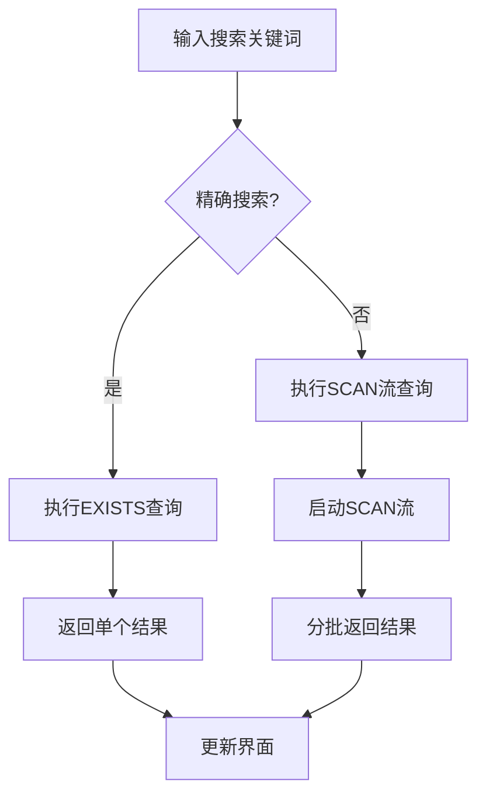

# 动态组件选择机制深度解析

<cite>
**本文档引用的文件**
- [KeyList.vue](file://src/components/KeyList.vue)
- [KeyListVirtualTree.vue](file://src/components/KeyListVirtualTree.vue)
- [KeyListNormal.vue](file://src/components/KeyListNormal.vue)
- [OperateItem.vue](file://src/components/OperateItem.vue)
</cite>

## 目录
1. [引言](#引言)
2. [项目结构概览](#项目结构概览)
3. [核心组件分析](#核心组件分析)
4. [动态组件选择架构](#动态组件选择架构)
5. [keyListType数据属性详解](#keylisttype数据属性详解)
6. [组件导入与注册机制](#组件导入与注册机制)
7. [模板中的动态渲染](#模板中的动态渲染)
8. [动态组件vs条件渲染的优势](#动态组件vs条件渲染的优势)
9. [实际应用示例](#实际应用示例)
10. [性能优化考虑](#性能优化考虑)
11. [总结](#总结)

## 引言

KeyList.vue是Another Redis Desktop Manager项目中的核心组件之一，它采用了先进的动态组件选择机制来根据不同的配置和需求渲染不同的键列表展示策略。这种设计模式不仅提高了代码的可维护性，还为用户提供了灵活的界面选择体验。

本文档将深入分析KeyList.vue中动态组件选择机制的实现原理，重点探讨keyListType数据属性如何根据配置决定渲染的子组件，以及在created生命周期中通过import引入组件的实现方式。

## 项目结构概览

KeyList系列组件构成了Redis桌面管理器中键列表展示的核心功能模块：



**图表来源**
- [KeyList.vue](file://src/components/KeyList.vue#L1-L350)
- [KeyListVirtualTree.vue](file://src/components/KeyListVirtualTree.vue#L1-L623)
- [KeyListNormal.vue](file://src/components/KeyListNormal.vue#L1-L100)

## 核心组件分析

### KeyList.vue - 主控制器

KeyList.vue作为整个键列表展示系统的核心控制器，负责协调不同展示策略之间的切换和数据流转。

#### 关键特性：
- **动态组件渲染**：通过`keyListType`属性控制渲染哪个子组件
- **状态管理**：维护键列表数据、扫描状态等关键状态
- **事件处理**：监听全局事件并作出相应响应
- **配置驱动**：根据全局设置动态调整行为

#### 数据属性分析：



**图表来源**
- [KeyList.vue](file://src/components/KeyList.vue#L46-L60)
- [KeyListVirtualTree.vue](file://src/components/KeyListVirtualTree.vue#L80-L101)
- [KeyListNormal.vue](file://src/components/KeyListNormal.vue#L19-L39)

**章节来源**
- [KeyList.vue](file://src/components/KeyList.vue#L1-L350)

## 动态组件选择架构

### 架构设计理念

KeyList.vue采用基于配置的动态组件选择模式，这种设计遵循了以下原则：

1. **单一职责原则**：KeyList.vue专注于组件选择和状态管理
2. **开闭原则**：易于添加新的展示策略而无需修改现有代码
3. **依赖倒置原则**：通过抽象的keyListType属性解耦具体实现

### 组件选择流程



**图表来源**
- [KeyList.vue](file://src/components/KeyList.vue#L43-L60)

## keyListType数据属性详解

### 默认值设定

在KeyList.vue的data函数中，keyListType被初始化为`'KeyListVirtualTree'`：

```javascript
// KeyList.vue 第49行
keyListType: 'KeyListVirtualTree',
```

这个默认值决定了当没有特殊配置时，系统会优先使用虚拟树形展示策略。

### 配置驱动的组件选择

虽然当前实现中keyListType保持默认值，但架构设计支持通过配置动态切换组件类型：



**图表来源**
- [KeyList.vue](file://src/components/KeyList.vue#L322-L332)

### 组件类型对比

| 特性 | KeyListVirtualTree | KeyListNormal |
|------|-------------------|---------------|
| 展示形式 | 树形结构，支持层级展开 | 简单列表，线性排列 |
| 性能表现 | 虚拟滚动，适合大量数据 | 基础渲染，适合少量数据 |
| 交互功能 | 复杂的右键菜单、多选操作 | 基础点击、右键菜单 |
| 内存占用 | 较高，需要维护树状结构 | 较低，简单数组存储 |
| 适用场景 | 大量键值对，需要分类展示 | 少量键值对，简单浏览 |

**章节来源**
- [KeyList.vue](file://src/components/KeyList.vue#L49-L57)
- [KeyListVirtualTree.vue](file://src/components/KeyListVirtualTree.vue#L1-L623)
- [KeyListNormal.vue](file://src/components/KeyListNormal.vue#L1-L100)

## 组件导入与注册机制

### ES6动态导入

KeyList.vue使用ES6的import语法在编译时静态导入KeyListVirtualTree组件：

```javascript
// KeyList.vue 第43行
import KeyListVirtualTree from '@/components/KeyListVirtualTree';
```

这种导入方式具有以下优势：
- **编译时优化**：构建工具可以在编译时分析依赖关系
- **Tree Shaking支持**：未使用的代码可以被自动移除
- **类型安全**：IDE可以提供更好的代码提示和检查

### 组件注册

导入后，组件通过components选项进行注册：

```javascript
// KeyList.vue 第60行
components: { KeyListVirtualTree },
```

### 运行时组件解析

Vue.js在运行时根据keyListType的值解析对应的组件：

```mermaid
flowchart LR
Template["<component :is=\"keyListType\">"] --> Runtime["Vue运行时"]
Runtime --> Resolve["解析组件名称"]
Resolve --> Lookup["查找注册组件"]
Lookup --> Instantiate["实例化组件"]
Instantiate --> Render["渲染DOM"]
```

**图表来源**
- [KeyList.vue](file://src/components/KeyList.vue#L4-L10)

**章节来源**
- [KeyList.vue](file://src/components/KeyList.vue#L43-L60)

## 模板中的动态渲染

### 动态组件标签

KeyList.vue使用Vue的内置`<component>`标签配合`:is`动态绑定属性来实现组件的动态渲染：

```html
<!-- KeyList.vue 第4-10行 -->
<component
  :is="keyListType"
  :config="config"
  :client="client"
  :keyList="keyList"
  @exportBatch="exportBatch">
</component>
```

### Props传递机制

动态组件接收来自KeyList.vue的所有必要props：

| Prop名称 | 类型 | 描述 |
|----------|------|------|
| config | Object | 全局配置对象 |
| client | Object | Redis客户端实例 |
| keyList | Array | 键列表数据 |
| exportBatch | Function | 批量导出回调 |

### 事件监听

KeyList.vue通过`@exportBatch`监听子组件发出的批量导出事件，实现了父子组件间的通信。

### 渲染流程



**图表来源**
- [KeyList.vue](file://src/components/KeyList.vue#L4-L10)

**章节来源**
- [KeyList.vue](file://src/components/KeyList.vue#L1-L11)

## 动态组件vs条件渲染的优势

### 代码维护性优势

#### 动态组件模式



#### 条件渲染模式



### 扩展性优势

#### 动态组件的可扩展性

1. **零侵入式扩展**：添加新组件类型不需要修改现有代码
2. **配置驱动**：通过配置即可切换展示策略
3. **热插拔能力**：运行时动态切换组件类型

#### 条件渲染的局限性

1. **硬编码依赖**：每种组件都需要单独的条件分支
2. **维护成本高**：组件数量增加时代码复杂度呈指数级增长
3. **难以测试**：每个条件分支都需要独立测试

### 性能优势

#### 动态组件性能特点

- **按需加载**：只有当前激活的组件会被完全加载
- **内存隔离**：不同组件实例之间没有直接依赖
- **缓存友好**：Vue的组件缓存机制更有效

#### 条件渲染性能特点

- **预加载风险**：所有可能的组件都会被加载到内存中
- **状态冲突**：多个组件的状态可能会相互影响
- **初始化开销**：每次切换都需要重新初始化

**章节来源**
- [KeyList.vue](file://src/components/KeyList.vue#L43-L60)

## 实际应用示例

### 基本使用场景

#### 1. 默认虚拟树展示

当用户连接到Redis服务器时，默认使用虚拟树展示：

```javascript
// KeyList.vue 第49行
keyListType: 'KeyListVirtualTree',
```

这提供了最佳的用户体验，特别是对于包含大量键值对的数据库。

#### 2. 批量操作场景

KeyList.vue通过`exportBatch`方法处理批量导出操作：



**图表来源**
- [KeyList.vue](file://src/components/KeyList.vue#L293-L319)
- [KeyListVirtualTree.vue](file://src/components/KeyListVirtualTree.vue#L297-L314)

#### 3. 实时数据更新

KeyList.vue通过事件总线监听键的变化：

```javascript
// KeyList.vue 第89-103行
this.$bus.$on('refreshKeyList', (client, key = '', type = 'del') => {
  if (client !== this.client) return;
  
  if (!key) {
    return this.refreshKeyList();
  }
  
  (type == 'del') && this.removeKeyFromKeyList(key);
  (type == 'add') && this.addKeyToKeyList(key);
});
```

### 高级应用场景

#### 1. 搜索模式切换

KeyList.vue支持精确搜索和模糊搜索两种模式：



**图表来源**
- [KeyList.vue](file://src/components/KeyList.vue#L119-L127)
- [KeyList.vue](file://src/components/KeyList.vue#L237-L247)

#### 2. 分页加载机制

对于大量数据的处理，KeyList.vue实现了智能分页加载：

| 参数 | 默认值 | 说明 |
|------|--------|------|
| keysPageSize | 500 | 每页键的数量 |
| searchPageSize | 10000 | 搜索模式下的页大小 |
| loadAllThreshold | 50000 | 全量加载阈值 |

**章节来源**
- [KeyList.vue](file://src/components/KeyList.vue#L48-L78)
- [KeyList.vue](file://src/components/KeyList.vue#L147-L212)

## 性能优化考虑

### 内存管理

#### 1. 组件卸载优化

KeyList.vue在重置键列表时会清理所有扫描流：

```javascript
// KeyList.vue 第214-222行
resetKeyList() {
  this.cancelScanning();
  this.keyList = [];
  this.scanStreams = [];
  this.onePageKeysCount = 0;
  this.scanMoreDisabled = false;
  this.loadingAll = false;
}
```

#### 2. 数据结构优化

- **Buffer对象复用**：避免频繁的字符串转换
- **Set集合去重**：确保键列表的唯一性
- **流式处理**：大数据集采用流式扫描

### 渲染性能

#### 1. 虚拟滚动

KeyListVirtualTree组件使用虚拟滚动技术处理大量数据：


#### 2. 懒加载策略

- **按需导入**：只在需要时加载特定组件
- **异步渲染**：大型组件采用异步渲染避免阻塞主线程
- **防抖处理**：搜索输入采用防抖机制减少不必要的刷新

### 网络优化

#### 1. 批量操作

KeyList.vue实现了批量Redis命令执行：

```javascript
// KeyList.vue 第296-302行
for (const key of keys) {
  const promise = this.client.callBuffer('DUMP', key);
  const promise1 = this.client.callBuffer('PTTL', key);
  promiseQueue.push(promise, promise1);
}
```

#### 2. 连接池管理

- **连接复用**：多个扫描操作共享Redis连接
- **超时控制**：设置合理的命令超时时间
- **错误恢复**：网络异常时的自动重试机制

**章节来源**
- [KeyList.vue](file://src/components/KeyList.vue#L214-L222)
- [KeyList.vue](file://src/components/KeyList.vue#L296-L319)

## 总结

KeyList.vue中的动态组件选择机制体现了现代前端开发的最佳实践，通过以下关键技术实现了高度灵活和可维护的架构：

### 核心优势

1. **架构清晰**：单一职责的组件设计，职责分离明确
2. **扩展性强**：支持无缝添加新的展示策略
3. **性能优异**：针对不同数据规模优化渲染策略
4. **维护便捷**：零侵入式的组件扩展机制

### 技术亮点

- **ES6模块系统**：利用现代JavaScript的模块化特性
- **Vue动态组件**：充分发挥Vue框架的动态渲染能力
- **事件总线通信**：实现松耦合的组件间通信
- **配置驱动设计**：通过配置控制组件行为

### 应用价值

这种设计模式不仅适用于键列表展示场景，也为其他类似的需求提供了优秀的解决方案参考。通过合理的抽象和封装，开发者可以构建出既功能强大又易于维护的用户界面系统。

KeyList.vue的动态组件选择机制展示了如何在复杂的业务场景中平衡功能性、性能和可维护性的关系，为构建高质量的前端应用提供了宝贵的实践经验。