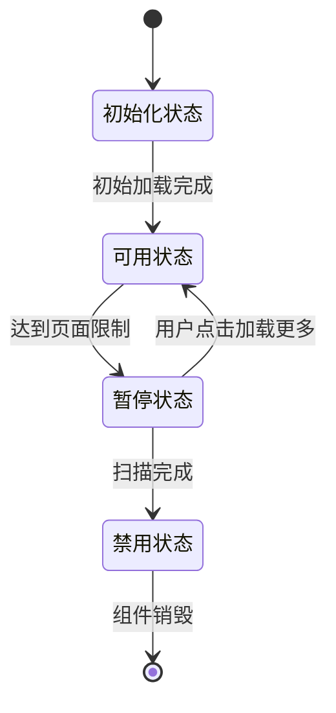
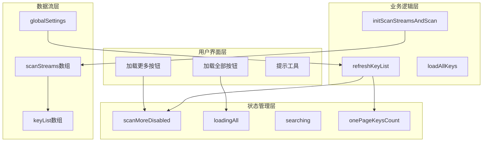
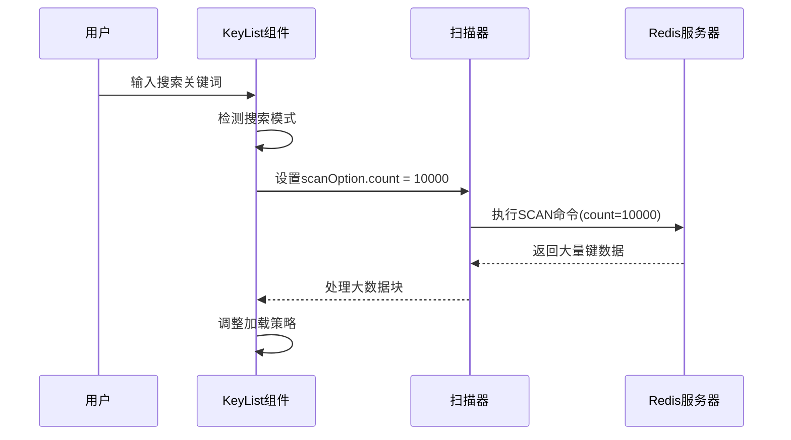
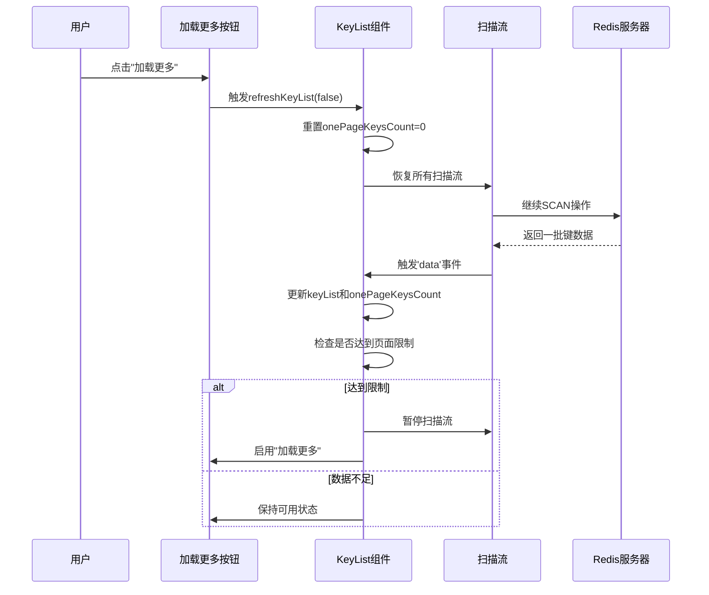
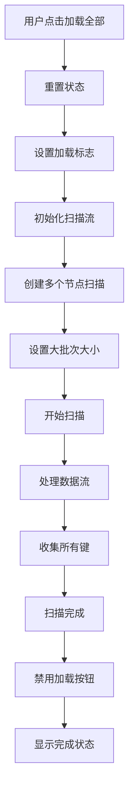
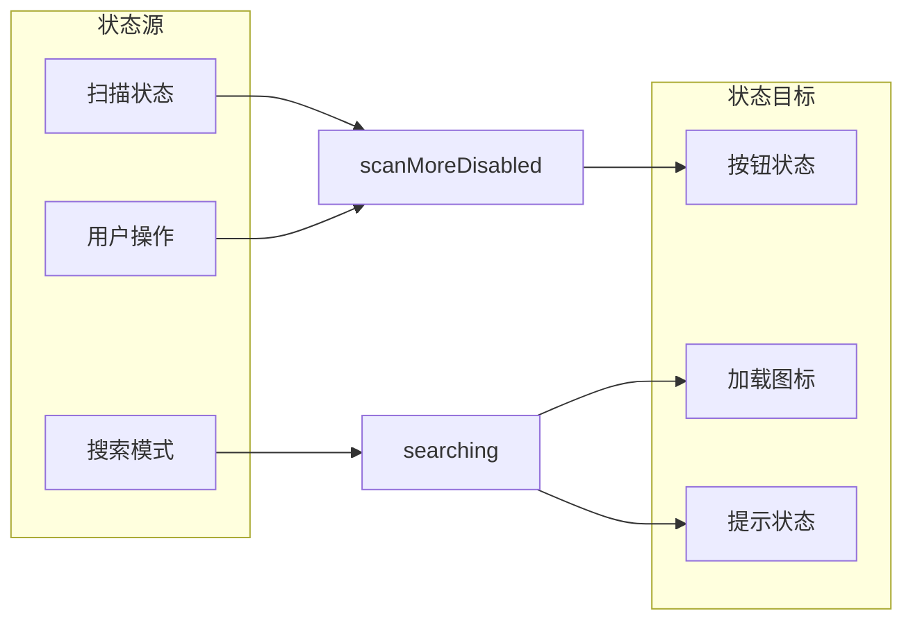
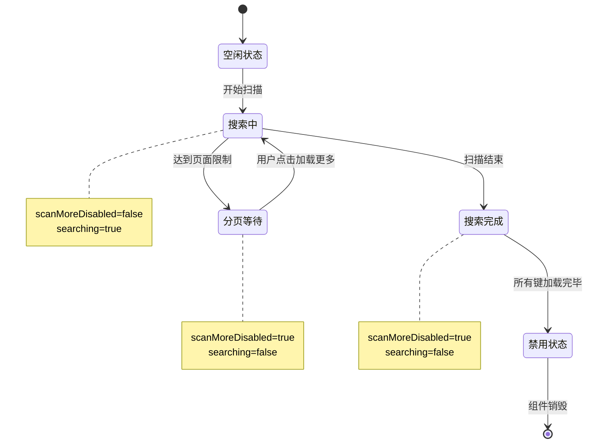

# 分页控制机制

<cite>
**本文档引用的文件**
- [KeyList.vue](file://src/components/KeyList.vue)
- [KeyListVirtualTree.vue](file://src/components/KeyListVirtualTree.vue)
- [OperateItem.vue](file://src/components/OperateItem.vue)
- [Setting.vue](file://src/components/Setting.vue)
- [util.js](file://src/util.js)
</cite>

## 目录
1. [简介](#简介)
2. [核心变量机制](#核心变量机制)
3. [分页逻辑架构](#分页逻辑架构)
4. [keysPageSize计算机制](#keyspagesize计算机制)
5. [两种加载模式详解](#两种加载模式详解)
6. [状态管理与事件流](#状态管理与事件流)
7. [用户交互与状态同步](#用户交互与状态同步)
8. [性能优化策略](#性能优化策略)
9. [故障排除指南](#故障排除指南)
10. [总结](#总结)

## 简介

KeyList.vue是Another Redis Desktop Manager中负责键列表展示的核心组件，其分页控制机制通过精心设计的状态管理和数据流控制，实现了高效的Redis键扫描和展示功能。该系统支持两种主要的分页模式：`loadMoreKeys`（分页加载）和`loadAllKeys`（一次性加载），并通过多个核心变量协同工作来确保用户体验和系统性能的平衡。

## 核心变量机制

### scanMoreDisabled变量作用机制

`scanMoreDisabled`是分页控制的核心状态变量，用于控制"加载更多"按钮的可用性状态。



**图表来源**
- [KeyList.vue](file://src/components/KeyList.vue#L53)

**段落来源**
- [KeyList.vue](file://src/components/KeyList.vue#L53)

### onePageKeysCount变量作用机制

`onePageKeysCount`是一个关键的计数器变量，用于跟踪当前页面已加载的键数量。

```mermaid
flowchart TD
开始扫描 --> 接收数据块
接收数据块 --> 更新计数器
更新计数器 --> 检查阈值
检查阈值 --> 达到阈值? : onePageKeysCount >= keysPageSize
达到阈值? --> |是| 暂停扫描
达到阈值? --> |否| 继续扫描
暂停扫描 --> 等待用户操作
等待用户操作 --> 用户点击加载更多
用户点击加载更多 --> 恢复扫描
恢复扫描 --> 继续扫描
```

**图表来源**
- [KeyList.vue](file://src/components/KeyList.vue#L170)
- [KeyList.vue](file://src/components/KeyList.vue#L173)

**段落来源**
- [KeyList.vue](file://src/components/KeyList.vue#L54)

## 分页逻辑架构

### 整体架构设计

KeyList组件采用基于流式扫描的数据加载架构，通过多个层次的状态管理和事件协调实现复杂的分页控制逻辑。



**图表来源**
- [KeyList.vue](file://src/components/KeyList.vue#L12-L37)
- [KeyList.vue](file://src/components/KeyList.vue#L46-L57)

**段落来源**
- [KeyList.vue](file://src/components/KeyList.vue#L46-L57)

## keysPageSize计算机制

### 全局设置读取流程

`keysPageSize`计算是分页系统的基础，它根据用户的全局配置和当前连接类型动态调整扫描批次大小。

```mermaid
flowchart TD
开始计算 --> 读取全局设置
读取全局设置 --> 检查自定义值
检查自定义值 --> 有自定义值? : keysPageSize > 0
有自定义值? --> |是| 检查集群模式
有自定义值? --> |否| 使用默认值500
检查集群模式 --> 是集群模式?
是集群模式? --> |是| 计算分片大小
是集群模式? --> |否| 返回原始值
计算分片大小 --> 分片计算 : keysPageSize / masterNodes
分片计算 --> 返回结果
使用默认值500 --> 返回结果
```

**图表来源**
- [KeyList.vue](file://src/components/KeyList.vue#L62-L78)

**段落来源**
- [KeyList.vue](file://src/components/KeyList.vue#L62-L78)

### 集群模式下的分片计算逻辑

在Redis集群环境中，`keysPageSize`会自动进行分片计算以优化集群节点间的负载均衡。

| 连接类型 | 计算方式 | 默认值 | 特殊处理 |
|---------|---------|--------|----------|
| 单机模式 | 原始值 | 500 | 无 |
| 集群模式 | `keysPageSize / masterNodes` | 500 | 自动分片 |
| 搜索模式 | 固定值10000 | 10000 | 大批量扫描 |

**段落来源**
- [KeyList.vue](file://src/components/KeyList.vue#L68-L71)

### searchPageSize在搜索场景下的特殊处理

`searchPageSize`是一个专门针对搜索场景优化的固定值，当处于搜索模式时会覆盖常规的`keysPageSize`。



**图表来源**
- [KeyList.vue](file://src/components/KeyList.vue#L159)

**段落来源**
- [KeyList.vue](file://src/components/KeyList.vue#L50)

## 两种加载模式详解

### loadMoreKeys模式（分页加载）

`loadMoreKeys`模式是最常用的分页加载方式，通过逐步加载实现内存友好的大数据集浏览。



**图表来源**
- [KeyList.vue](file://src/components/KeyList.vue#L112-L137)

**段落来源**
- [KeyList.vue](file://src/components/KeyList.vue#L112-L137)

### loadAllKeys模式（一次性加载）

`loadAllKeys`模式适用于需要快速查看所有键的场景，虽然可能消耗较多内存，但提供了更好的用户体验。



**图表来源**
- [KeyList.vue](file://src/components/KeyList.vue#L139-L146)

**段落来源**
- [KeyList.vue](file://src/components/KeyList.vue#L139-L146)

## 状态管理与事件流

### scanMoreDisabled和searching的动态更新

这两个状态变量通过复杂的事件流机制实现动态更新，确保用户界面与后台扫描状态保持同步。



**图表来源**
- [KeyList.vue](file://src/components/KeyList.vue#L84-L86)

**段落来源**
- [KeyList.vue](file://src/components/KeyList.vue#L84-L86)

### 数据流事件的协调机制

KeyList组件通过Vue的响应式系统和事件总线实现多层级的状态协调。

| 事件类型 | 触发条件 | 影响范围 | 处理方式 |
|---------|---------|----------|----------|
| `refreshKeyList` | 用户操作或配置变更 | 全局刷新 | 重新初始化扫描流 |
| `closeConnection` | 连接异常 | 错误处理 | 关闭连接并显示错误 |
| `refreshKeyList` | 键变更通知 | 实时更新 | 添加/删除单个键 |

**段落来源**
- [KeyList.vue](file://src/components/KeyList.vue#L89-L103)

## 用户交互与状态同步

### loadMoreKeys按钮的禁用条件

按钮的禁用状态由多个条件共同决定，形成了一个复杂的布尔表达式。

```mermaid
flowchart TD
按钮检查 --> 条件1: scanMoreDisabled
条件1 --> 条件1结果
条件1结果 --> 条件2: searching
条件2 --> 条件2结果
条件2结果 --> 最终状态
最终状态 --> 启用 : scanMoreDisabled=false 且 searching=false
最终状态 --> 禁用 : 任一条件为真
```

**图表来源**
- [KeyList.vue](file://src/components/KeyList.vue#L18)

**段落来源**
- [KeyList.vue](file://src/components/KeyList.vue#L18)

### 内部状态机的同步过程

KeyList组件维护了一个复杂的状态机来协调各种用户交互和系统状态变化。



**图表来源**
- [KeyList.vue](file://src/components/KeyList.vue#L218-L221)

**段落来源**
- [KeyList.vue](file://src/components/KeyList.vue#L218-L221)

## 性能优化策略

### 内存管理优化

系统采用了多种策略来优化内存使用，特别是在处理大规模键集合时。

| 优化策略 | 实现方式 | 效果 |
|---------|---------|------|
| 流式处理 | 使用SCAN命令的流式接口 | 避免一次性加载大量数据 |
| 分片计算 | 集群模式下的自动分片 | 平衡各节点负载 |
| 懒加载 | 按需加载子树节点 | 减少初始内存占用 |
| 缓存清理 | 及时清理扫描流资源 | 防止内存泄漏 |

**段落来源**
- [KeyList.vue](file://src/components/KeyList.vue#L249-L254)

### 网络优化策略

通过智能的扫描参数调整和错误处理机制，系统实现了网络传输的最优化。

```mermaid
flowchart TD
请求扫描 --> 参数优化
参数优化 --> 检查搜索模式
检查搜索模式 --> 搜索模式? : match != '*'
搜索模式? --> |是| 增加扫描数量
搜索模式? --> |否| 使用常规数量
增加扫描数量 --> 执行SCAN
使用常规数量 --> 执行SCAN
执行SCAN --> 错误处理
错误处理 --> 连接异常? : SCAN命令被禁用
连接异常? --> |是| 显示错误消息
连接异常? --> |否| 显示通用错误
```

**图表来源**
- [KeyList.vue](file://src/components/KeyList.vue#L158-L160)

**段落来源**
- [KeyList.vue](file://src/components/KeyList.vue#L158-L160)

## 故障排除指南

### 常见问题诊断

| 问题症状 | 可能原因 | 解决方案 |
|---------|---------|----------|
| 加载按钮始终禁用 | scanMoreDisabled未正确重置 | 检查resetKeyList方法调用 |
| 内存使用过高 | loadAllKeys模式下数据过多 | 考虑切换到分页加载 |
| 扫描速度过慢 | keysPageSize设置过大 | 调整全局设置中的扫描数量 |
| 搜索功能异常 | searchIcon状态不一致 | 检查OperateItem组件状态同步 |

**段落来源**
- [KeyList.vue](file://src/components/KeyList.vue#L214-L221)

### 调试技巧

开发者可以通过以下方式调试分页控制机制：

1. **状态监控**：观察`scanMoreDisabled`和`onePageKeysCount`的变化
2. **事件追踪**：监听`refreshKeyList`事件的触发时机
3. **网络分析**：检查SCAN命令的执行频率和返回数据量
4. **内存分析**：监控keyList数组的增长趋势

**段落来源**
- [KeyList.vue](file://src/components/KeyList.vue#L322-L331)

## 总结

KeyList.vue的分页控制机制是一个精心设计的复杂系统，通过多个核心变量的协同工作实现了高效的数据加载和用户交互。`scanMoreDisabled`和`onePageKeysCount`作为关键状态变量，配合`keysPageSize`的智能计算和两种不同的加载模式，为用户提供了灵活而高效的Redis键浏览体验。

该系统的主要优势包括：
- **内存友好**：通过流式处理和分片计算避免内存溢出
- **响应迅速**：智能的缓存和预加载机制提升用户体验
- **扩展性强**：支持单机和集群环境的无缝切换
- **容错性好**：完善的错误处理和状态恢复机制

这种设计模式不仅解决了大规模数据集的展示问题，也为其他类似场景提供了宝贵的参考价值。