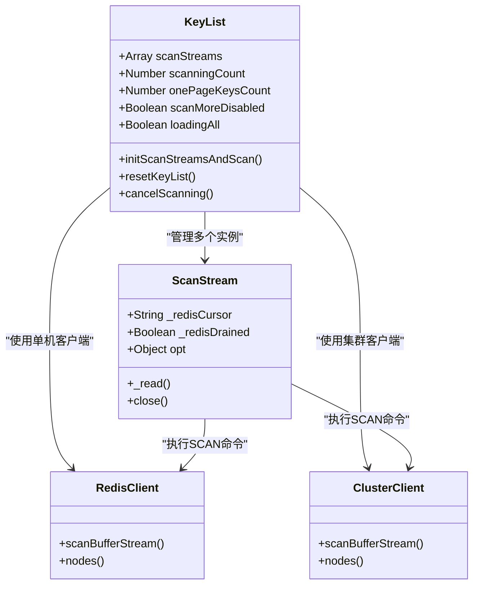
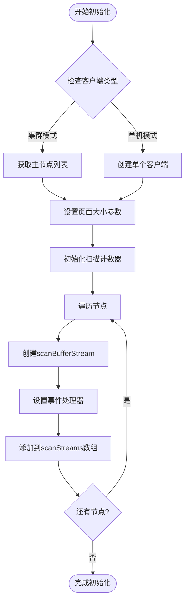
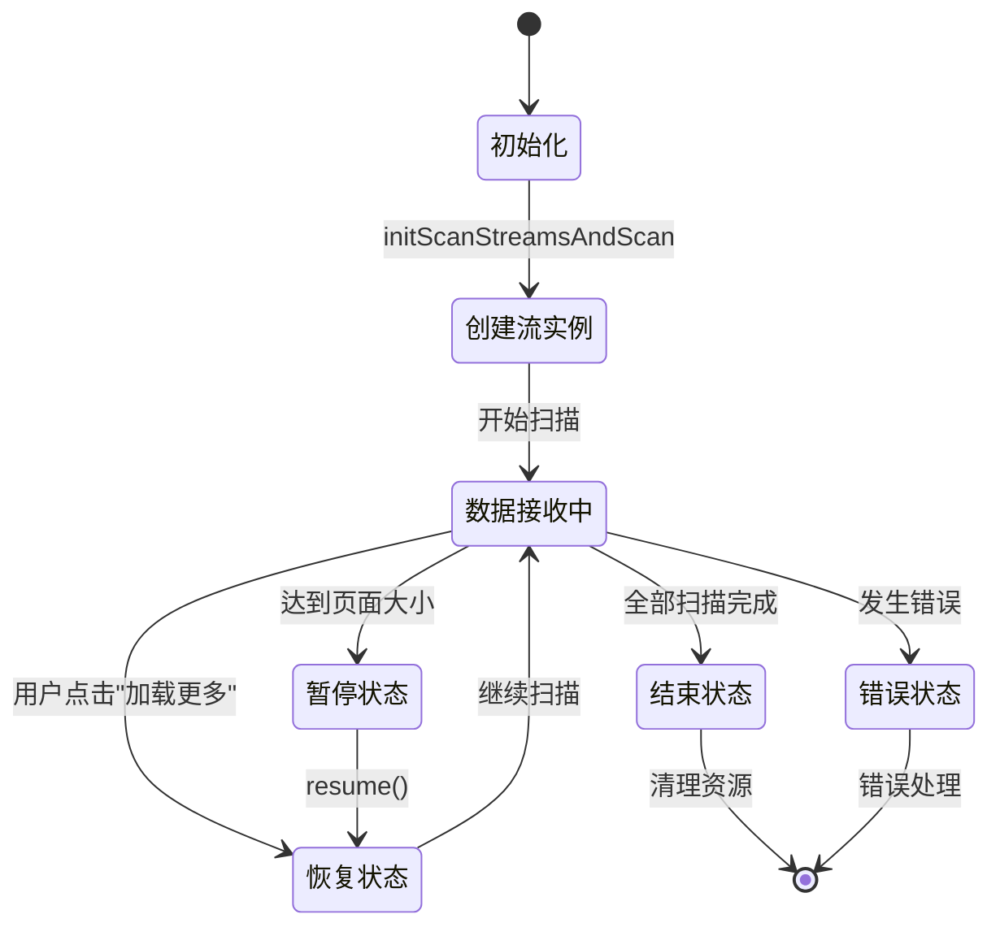
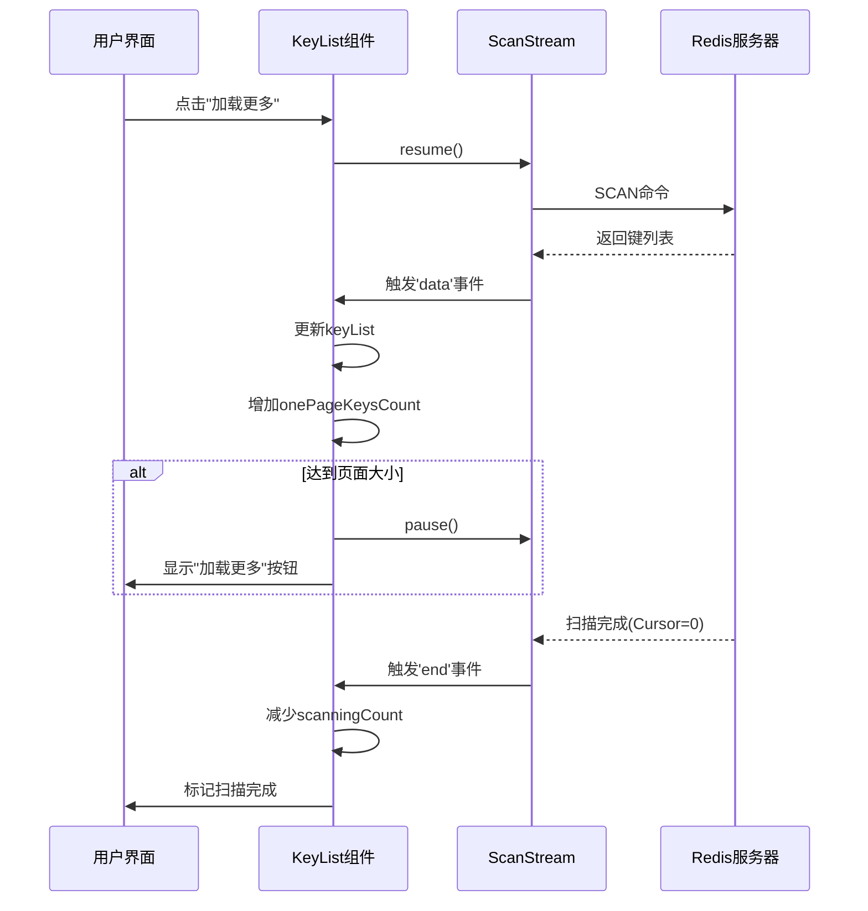
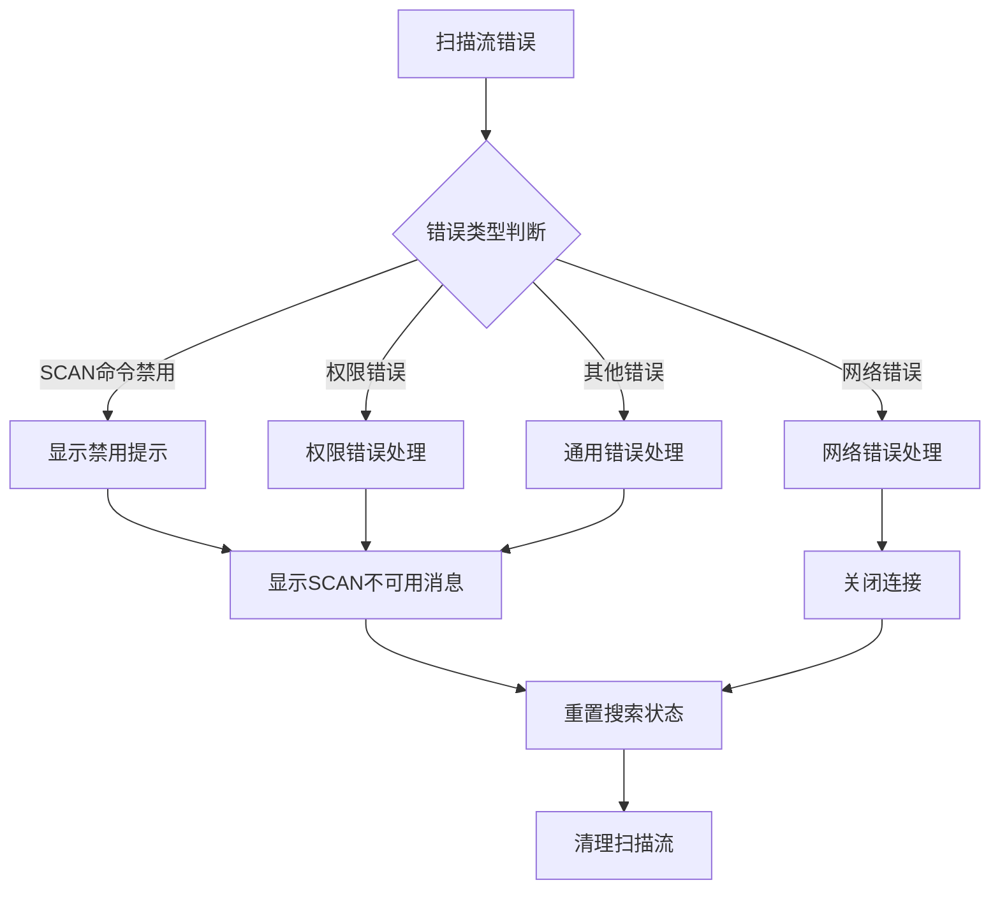

# 扫描流管理

<cite>
**本文档中引用的文件**
- [KeyList.vue](file://src/components/KeyList.vue)
- [redisClient.js](file://src/redisClient.js)
- [ScanStream.js](file://node_modules/ioredis/built/ScanStream.js)
- [Redis.js](file://node_modules/ioredis/built/Redis.js)
- [cluster/index.js](file://node_modules/ioredis/built/cluster/index.js)
</cite>

## 目录
1. [概述](#概述)
2. [scanStreams数组结构](#scanstreams数组结构)
3. [initScanStreamsAndScan方法详解](#initscanstreamsandscan方法详解)
4. [分页加载生命周期管理](#分页加载生命周期管理)
5. [连接模式差异](#连接模式差异)
6. [错误处理与恢复机制](#错误处理与恢复机制)
7. [性能优化策略](#性能优化策略)
8. [总结](#总结)

## 概述

KeyList.vue中的scanStreams数组是Redis键扫描功能的核心组件，负责管理多个扫描流实例以实现高效的数据检索。该系统支持单机、集群和哨兵等多种连接模式，通过智能的流控制机制确保在大数据量场景下的稳定性和性能。

## scanStreams数组结构

scanStreams是一个数组，用于存储所有活跃的扫描流实例：



**图表来源**
- [KeyList.vue](file://src/components/KeyList.vue#L47-L57)
- [ScanStream.js](file://node_modules/ioredis/built/ScanStream.js#L7-L49)

**章节来源**
- [KeyList.vue](file://src/components/KeyList.vue#L47-L57)

## initScanStreamsAndScan方法详解

initScanStreamsAndScan方法是扫描流管理的核心入口，负责根据不同的连接模式创建相应的scanBufferStream实例：

### 方法流程图



**图表来源**
- [KeyList.vue](file://src/components/KeyList.vue#L147-L212)

### 连接模式处理逻辑

#### 单机模式处理
当客户端不是集群模式时，直接使用当前客户端创建扫描流：

```javascript
// 单机模式：使用当前客户端
const nodes = [this.client];
```

#### 集群模式处理
集群模式下需要为每个主节点创建独立的扫描流：

```javascript
// 集群模式：获取所有主节点
const nodes = this.client.nodes('master');
```

**章节来源**
- [KeyList.vue](file://src/components/KeyList.vue#L148-L149)

### 扫描选项配置

扫描流的配置参数根据加载模式动态调整：

| 参数 | 单机模式 | 集群模式 | 说明 |
|------|----------|----------|------|
| match | 搜索匹配模式 | 搜索匹配模式 | 键名匹配规则 |
| count | keysPageSize | keysPageSize | 每次扫描返回数量 |
| count值 | searchPageSize | keysPageSize | 搜索模式下增加扫描量 |

**章节来源**
- [KeyList.vue](file://src/components/KeyList.vue#L153-L159)

### 流实例创建与注册

每个扫描流实例都经过以下步骤创建和注册：

1. **创建扫描选项**：配置匹配模式和扫描数量
2. **调用scanBufferStream**：创建流实例
3. **添加到scanStreams数组**：维护流实例引用
4. **设置事件处理器**：处理数据、错误和结束事件

**章节来源**
- [KeyList.vue](file://src/components/KeyList.vue#L161-L162)

## 分页加载生命周期管理

scanStreams在分页加载过程中经历完整的生命周期管理，包括创建、暂停、恢复和销毁等阶段。

### 生命周期状态图



**图表来源**
- [KeyList.vue](file://src/components/KeyList.vue#L134-L137)
- [KeyList.vue](file://src/components/KeyList.vue#L173-L177)

### pause/resume控制机制

#### 暂停机制
当扫描达到页面大小限制时，自动暂停当前流：

```javascript
// 达到页面大小时暂停
if (this.onePageKeysCount >= keysPageSize && loadAll === false) {
    stream.pause();
    this.resetSearchStatus();
}
```

#### 恢复机制
用户点击"加载更多"按钮时恢复扫描：

```javascript
// 恢复所有活跃流
for (const stream of this.scanStreams) {
    stream.resume();
}
```

**章节来源**
- [KeyList.vue](file://src/components/KeyList.vue#L173-L177)
- [KeyList.vue](file://src/components/KeyList.vue#L134-L137)

### 数据流处理

扫描流的数据处理遵循以下模式：



**图表来源**
- [KeyList.vue](file://src/components/KeyList.vue#L164-L177)
- [KeyList.vue](file://src/components/KeyList.vue#L205-L209)

**章节来源**
- [KeyList.vue](file://src/components/KeyList.vue#L164-L177)
- [KeyList.vue](file://src/components/KeyList.vue#L205-L209)

## 连接模式差异

不同连接模式下的扫描流创建存在显著差异，主要体现在节点管理和并发处理方面。

### 连接模式对比表

| 特性 | 单机模式 | 集群模式 | 哨兵模式 |
|------|----------|----------|----------|
| 节点数量 | 1个 | 多个主节点 | 主从切换 |
| 并发度 | 单线程 | 多线程 | 动态切换 |
| 容错性 | 基础 | 高 | 最高 |
| 性能影响 | 单点 | 分布式 | 切换开销 |

### 单机模式特点

- **简单性**：只创建一个扫描流实例
- **性能**：无并发开销，适合小规模数据
- **可靠性**：依赖单一连接，故障风险较高

### 集群模式特点

- **分布式处理**：为每个主节点创建独立扫描流
- **负载均衡**：分散扫描压力到多个节点
- **容错能力**：部分节点故障不影响整体扫描

```javascript
// 集群模式下的节点处理逻辑
const nodes = this.client.nodes('master'); // 获取所有主节点
nodes.map((node) => {
    const stream = node.scanBufferStream(scanOption);
    this.scanStreams.push(stream);
});
```

**章节来源**
- [KeyList.vue](file://src/components/KeyList.vue#L148-L149)
- [KeyList.vue](file://src/components/KeyList.vue#L152-L162)

### 哨兵模式特点

哨兵模式下的扫描流管理通过Redis Sentinel进行主从切换监控，确保在主节点故障时能够自动切换到新的主节点。

**章节来源**
- [redisClient.js](file://src/redisClient.js#L65-L68)

## 错误处理与恢复机制

scanStreams的错误处理采用多层次的防护机制，确保系统的稳定性和用户体验。

### 错误分类与处理



**图表来源**
- [KeyList.vue](file://src/components/KeyList.vue#L180-L202)

### 错误处理策略

#### SCAN命令禁用检测
系统能够识别SCAN命令被禁用的情况：

```javascript
// 检测SCAN命令是否被禁用
if (
    (e.message.includes('unknown command') && e.message.includes('scan'))
    || e.message.includes("command 'SCAN' is not allowed")
) {
    return this.$message.error({
        message: this.$t('message.scan_disabled'),
        duration: 1500,
    });
}
```

#### 网络错误恢复
对于网络相关错误，系统提供自动重连机制：

```javascript
// 网络错误后的连接关闭处理
setTimeout(() => {
    this.$bus.$emit('closeConnection');
}, 50);
```

**章节来源**
- [KeyList.vue](file://src/components/KeyList.vue#L184-L191)
- [KeyList.vue](file://src/components/KeyList.vue#194-L202)

### 结束事件处理

扫描流的结束事件用于跟踪扫描进度：

```javascript
stream.on('end', () => {
    // 所有节点扫描完成(Cursor回到0)
    if (--this.scanningCount <= 0) {
        this.scanMoreDisabled = true;
        this.resetSearchStatus();
    }
});
```

**章节来源**
- [KeyList.vue](file://src/components/KeyList.vue#L205-L209)

## 性能优化策略

scanStreams采用了多种性能优化策略，确保在大规模数据场景下的高效运行。

### 内存管理优化

#### 流实例生命周期控制
通过精确的生命周期管理避免内存泄漏：

```javascript
// 重置方法确保完全清理
resetKeyList() {
    this.cancelScanning(); // 取消扫描
    this.keyList = [];     // 清空键列表
    this.scanStreams = []; // 清空流数组
    this.onePageKeysCount = 0;
    this.scanMoreDisabled = false;
    this.loadingAll = false;
}
```

#### 数据累积策略
采用增量累积方式减少内存占用：

```javascript
// 增量更新键列表
this.keyList = this.keyList.concat(keys);
this.onePageKeysCount += keys.length;
```

**章节来源**
- [KeyList.vue](file://src/components/KeyList.vue#L214-L222)
- [KeyList.vue](file://src/components/KeyList.vue#L169-L170)

### 并发控制优化

#### 页面大小调节
根据数据量动态调整扫描批次大小：

```javascript
// 根据连接模式调整页面大小
const keysPageSize = loadAll ? 50000 : this.keysPageSize;
```

#### 流控制机制
通过pause/resume机制实现流量控制：

```javascript
// 达到页面大小时暂停，避免内存溢出
if (this.onePageKeysCount >= keysPageSize && loadAll === false) {
    stream.pause();
    this.resetSearchStatus();
}
```

**章节来源**
- [KeyList.vue](file://src/components/KeyList.vue#L148-L149)
- [KeyList.vue](file://src/components/KeyList.vue#L173-L177)

### 连接池优化

#### 复用现有连接
扫描流复用已建立的Redis连接，避免额外的连接开销：

```javascript
// 使用现有的Redis客户端连接
const stream = node.scanBufferStream(scanOption);
```

#### 异步处理
所有扫描操作都是异步执行，不会阻塞主线程：

```javascript
// 异步数据处理
stream.on('data', (keys) => {
    // 异步处理数据
    this.keyList = this.keyList.concat(keys);
});
```

**章节来源**
- [KeyList.vue](file://src/components/KeyList.vue#L161)
- [KeyList.vue](file://src/components/KeyList.vue#L164-L177)

## 总结

KeyList.vue中的scanStreams数组管理系统是一个精心设计的高性能数据检索解决方案。它通过以下关键特性实现了高效的Redis键扫描：

### 核心优势

1. **多模式支持**：无缝支持单机、集群和哨兵三种连接模式
2. **智能流控制**：通过pause/resume机制实现精确的流量控制
3. **健壮错误处理**：多层次的错误检测和恢复机制
4. **内存效率**：优化的内存管理和增量数据处理
5. **并发优化**：集群模式下的分布式扫描处理

### 技术亮点

- **统一接口设计**：无论哪种连接模式，都提供一致的scanBufferStream接口
- **生命周期管理**：完整的流实例生命周期控制，确保资源正确释放
- **性能调优**：动态页面大小调整和异步处理机制
- **容错机制**：完善的错误检测和自动恢复策略

这个扫描流管理系统为Redis桌面管理器提供了强大而可靠的数据浏览能力，能够在各种部署环境下稳定运行，为用户提供流畅的交互体验。