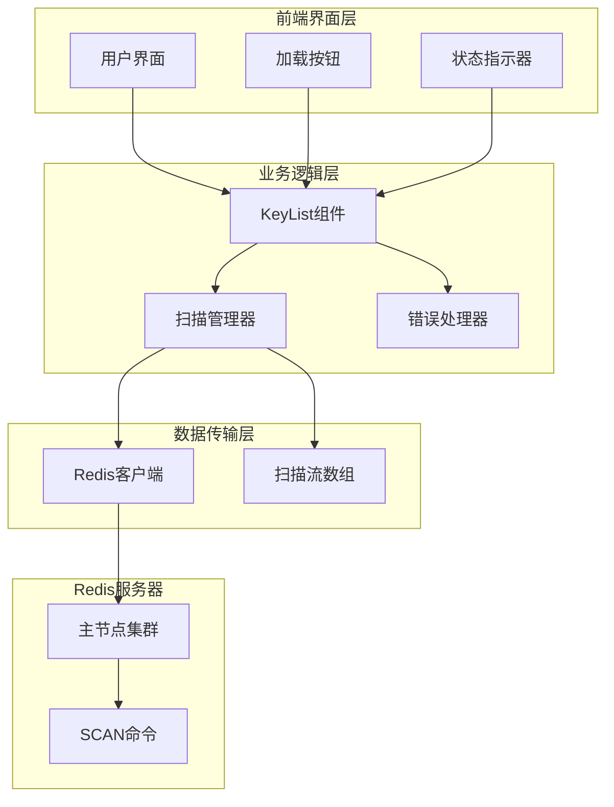
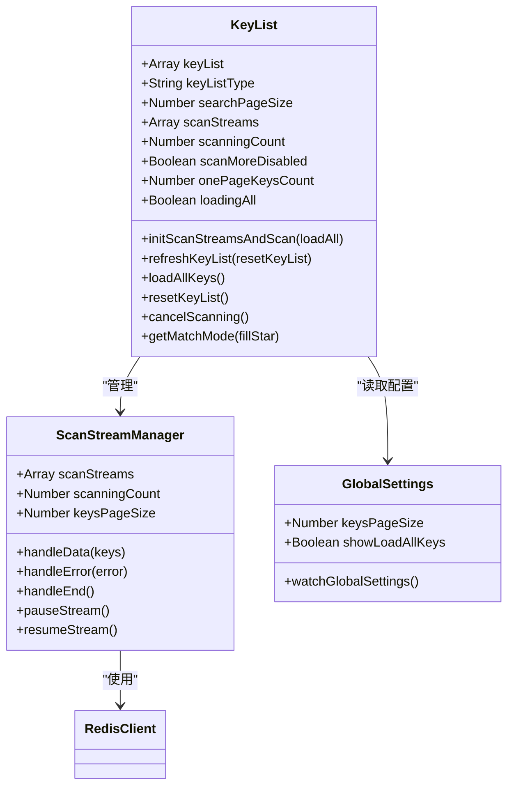
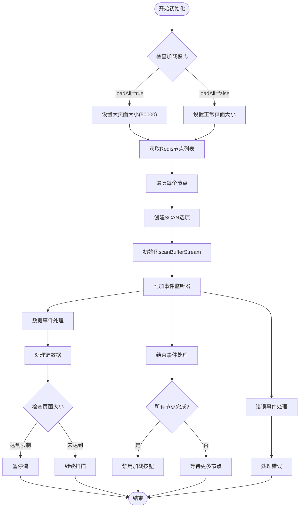
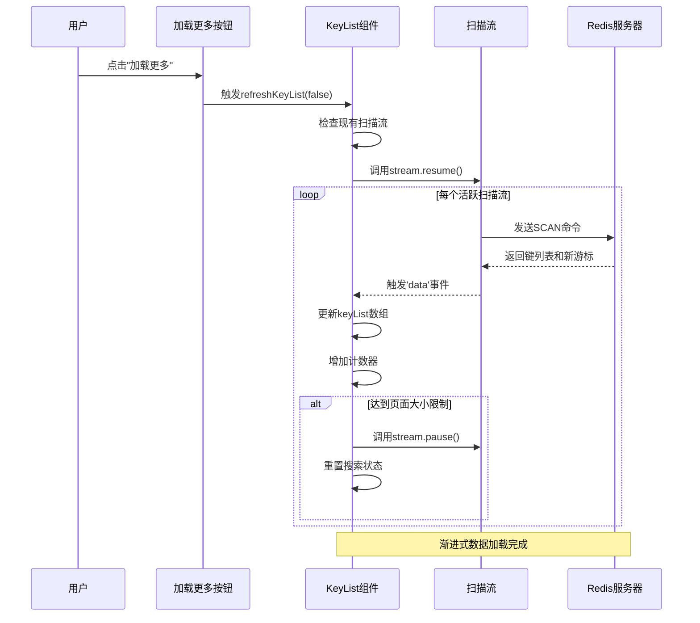
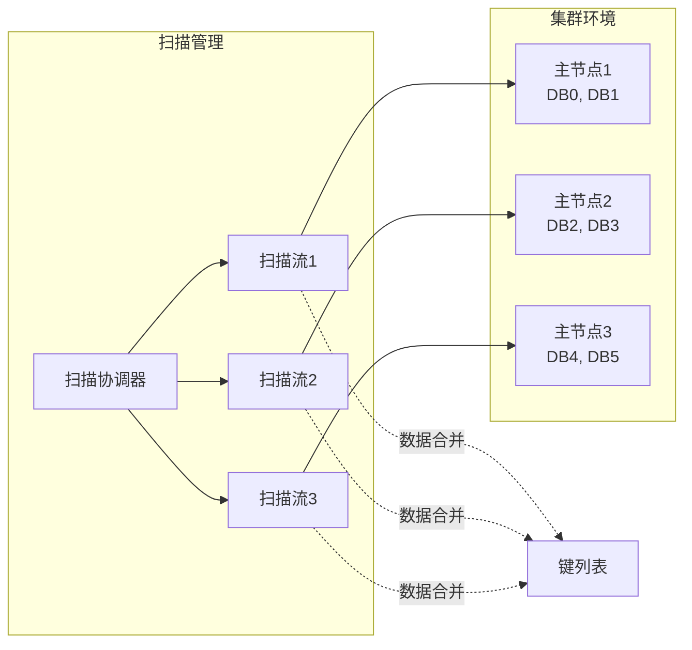
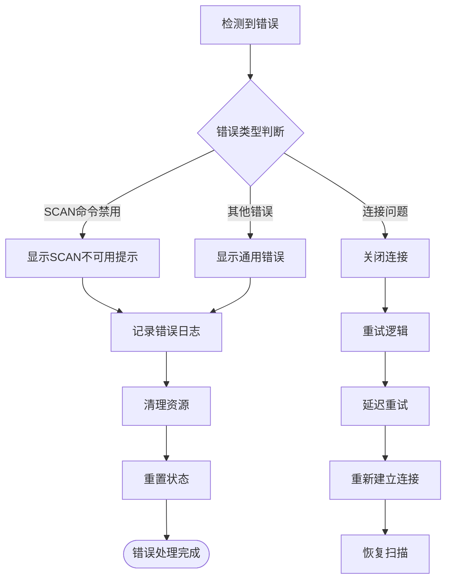
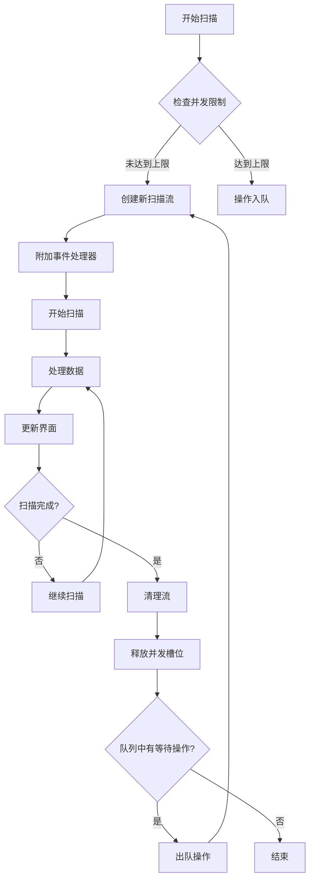

# 数据获取与分页

<cite>
**本文档引用的文件**
- [KeyList.vue](file://src/components/KeyList.vue)
- [redisClient.js](file://src/redisClient.js)
- [util.js](file://src/util.js)
- [storage.js](file://src/storage.js)
- [Setting.vue](file://src/components/Setting.vue)
- [KeyContentSet.vue](file://src/components/contents/KeyContentSet.vue)
- [KeyContentHash.vue](file://src/components/contents/KeyContentHash.vue)
- [KeyContentStream.vue](file://src/components/contents/KeyContentStream.vue)
- [MemoryAnalysis.vue](file://src/components/MemoryAnalysis.vue)
</cite>

## 目录
1. [概述](#概述)
2. [系统架构](#系统架构)
3. [核心组件分析](#核心组件分析)
4. [数据获取机制](#数据获取机制)
5. [分页加载策略](#分页加载策略)
6. [集群模式处理](#集群模式处理)
7. [错误处理与恢复](#错误处理与恢复)
8. [性能优化](#性能优化)
9. [最佳实践](#最佳实践)
10. [总结](#总结)

## 概述

AnotherRedisDesktopManager (ARDM) 实现了一套高效的数据获取与分页机制，专门针对 Redis 键列表的大规模数据集进行优化。该系统基于 ioredis 的 `scanBufferStream` 接口，实现了渐进式数据加载，支持分页加载（Load More）和全量加载（Load All）两种模式。

### 主要特性

- **渐进式数据加载**：使用 Redis SCAN 命令的游标机制，避免阻塞服务器
- **双模式加载**：支持分页加载和全量加载，适应不同使用场景
- **智能分页**：根据配置动态调整页面大小，优化内存使用
- **集群感知**：自动处理 Redis 集群环境下的多节点扫描
- **错误恢复**：完善的错误处理和重连机制

## 系统架构



**图表来源**
- [KeyList.vue](file://src/components/KeyList.vue#L1-L350)
- [redisClient.js](file://src/redisClient.js#L1-L381)

## 核心组件分析

### KeyList 组件结构

KeyList 组件是整个数据获取机制的核心控制器，负责协调各个子组件的工作流程。



**图表来源**
- [KeyList.vue](file://src/components/KeyList.vue#L45-L333)

**章节来源**
- [KeyList.vue](file://src/components/KeyList.vue#L45-L333)

## 数据获取机制

### initScanStreamsAndScan 方法详解

`initScanStreamsAndScan` 是数据获取的核心方法，它初始化扫描流并开始数据获取过程。

#### 方法执行流程



**图表来源**
- [KeyList.vue](file://src/components/KeyList.vue#L147-L212)

#### 关键参数配置

| 参数 | 默认值 | 描述 | 影响因素 |
|------|--------|------|----------|
| `keysPageSize` | 500 | 单次扫描页面大小 | 用户配置、集群节点数 |
| `searchPageSize` | 10000 | 搜索模式下的扫描大小 | 搜索匹配模式 |
| `count` | 动态计算 | SCAN命令的COUNT参数 | 页面大小和搜索模式 |
| `match` | '*'或搜索模式 | SCAN命令的MATCH参数 | 用户输入的搜索条件 |

**章节来源**
- [KeyList.vue](file://src/components/KeyList.vue#L147-L212)

## 分页加载策略

### Load More 模式

Load More 模式提供渐进式加载功能，适合处理大量数据集。

#### 实现机制



**图表来源**
- [KeyList.vue](file://src/components/KeyList.vue#L112-L137)

#### 状态变量管理

| 变量名 | 类型 | 作用 | 控制逻辑 |
|--------|------|------|----------|
| `onePageKeysCount` | Number | 当前页面已加载的键数量 | 监控页面填充进度 |
| `scanMoreDisabled` | Boolean | 是否禁用加载更多按钮 | 防止重复点击 |
| `loadingAll` | Boolean | 是否正在全量加载 | 显示加载状态 |
| `scanningCount` | Number | 正在扫描的节点数量 | 跟踪集群扫描进度 |

**章节来源**
- [KeyList.vue](file://src/components/KeyList.vue#L112-L137)

### Load All 模式

Load All 模式提供一次性加载所有数据的功能，适用于小到中等规模的数据集。

#### 实现特点

- **统一页面大小**：固定使用 50000 的页面大小
- **立即开始扫描**：不设置暂停机制，持续加载直到完成
- **状态标记**：设置 `loadingAll = true` 标识当前状态

**章节来源**
- [KeyList.vue](file://src/components/KeyList.vue#L139-L146)

## 集群模式处理

### 多节点扫描策略

在 Redis 集群环境中，系统需要同时扫描多个主节点以获取完整数据集。



**图表来源**
- [KeyList.vue](file://src/components/KeyList.vue#L148-L150)

#### 集群页面大小计算

```javascript
// 集群模式下，页面大小按节点数平均分配
const nodeCount = this.client.nodes('master').length;
const averagePageSize = parseInt(keysPageSize / nodeCount);
```

这种设计确保：
- 每个节点承担相等的负载
- 避免单节点过载
- 提高整体扫描效率

**章节来源**
- [KeyList.vue](file://src/components/KeyList.vue#L68-L70)

## 错误处理与恢复

### 错误类型识别

系统能够识别并处理多种类型的 Redis 错误：

| 错误类型 | 检测方式 | 处理策略 |
|----------|----------|----------|
| SCAN命令禁用 | 包含"unknown command"或"'SCAN' is not allowed" | 显示友好错误提示 |
| 连接超时 | 异常消息 | 自动断开连接 |
| 内存不足 | 其他Redis错误 | 显示错误信息并尝试重连 |
| 网络中断 | 连接异常 | 触发重连机制 |

### 错误恢复流程



**图表来源**
- [KeyList.vue](file://src/components/KeyList.vue#L180-L202)

**章节来源**
- [KeyList.vue](file://src/components/KeyList.vue#L180-L202)

## 性能优化

### 内存使用优化

#### 数据流控制

系统通过精确控制数据流的暂停和恢复来优化内存使用：

```javascript
// 达到页面大小时暂停流
if (this.onePageKeysCount >= keysPageSize && loadAll === false) {
    stream.pause();  // 暂停以释放内存
    this.resetSearchStatus();
}

// 继续扫描时恢复流
for (const stream of this.scanStreams) {
    stream.resume();  // 恢复扫描
}
```

#### 缓存策略

- **增量更新**：只添加新数据到现有列表
- **及时清理**：扫描完成后立即清理资源
- **状态同步**：保持UI状态与数据状态一致

### 响应性能优化

#### 并发控制



**图表来源**
- [KeyList.vue](file://src/components/KeyList.vue#L148-L150)

#### 界面响应性

- **异步处理**：所有扫描操作都在后台线程执行
- **状态反馈**：实时更新加载状态和进度指示
- **取消机制**：提供扫描取消功能避免长时间等待

**章节来源**
- [KeyList.vue](file://src/components/KeyList.vue#L148-L212)

## 最佳实践

### 配置建议

#### 页面大小设置

根据数据集大小选择合适的页面大小：

| 数据集大小 | 推荐页面大小 | 说明 |
|------------|--------------|------|
| 小于1000个键 | 500 | 快速加载，减少网络开销 |
| 1000-10000个键 | 1000-2000 | 平衡速度和内存使用 |
| 10000-100000个键 | 2000-5000 | 避免内存溢出 |
| 大于100000个键 | 5000-10000 | 使用分页加载 |

#### 集群环境优化

- **监控节点数量**：定期检查集群节点变化
- **动态调整大小**：根据节点数自动调整页面大小
- **负载均衡**：确保各节点扫描负载均匀

### 使用指南

#### 选择合适的加载模式

- **Load More**：适用于大数据集，需要逐步浏览
- **Load All**：适用于小到中等数据集，需要快速查看全部内容

#### 性能监控

- **观察内存使用**：注意系统内存占用情况
- **监控网络流量**：大型扫描可能产生较多网络流量
- **关注响应时间**：及时发现性能瓶颈

## 总结

AnotherRedisDesktopManager 的键列表数据获取机制展现了优秀的工程设计：

### 核心优势

1. **高效的数据获取**：基于 Redis SCAN 命令的渐进式加载
2. **灵活的加载模式**：支持分页和全量两种加载方式
3. **智能的集群处理**：自动适配 Redis 集群环境
4. **健壮的错误处理**：完善的错误检测和恢复机制
5. **优化的性能表现**：通过流控制和内存管理提升用户体验

### 技术亮点

- **ioredis scanBufferStream**：充分利用底层库的高性能特性
- **Vue.js 响应式设计**：实时更新界面状态
- **模块化架构**：清晰的组件分离和职责划分
- **配置驱动**：支持用户自定义加载行为

这套机制为处理大规模 Redis 数据集提供了可靠、高效的解决方案，是现代数据库管理工具设计的优秀范例。