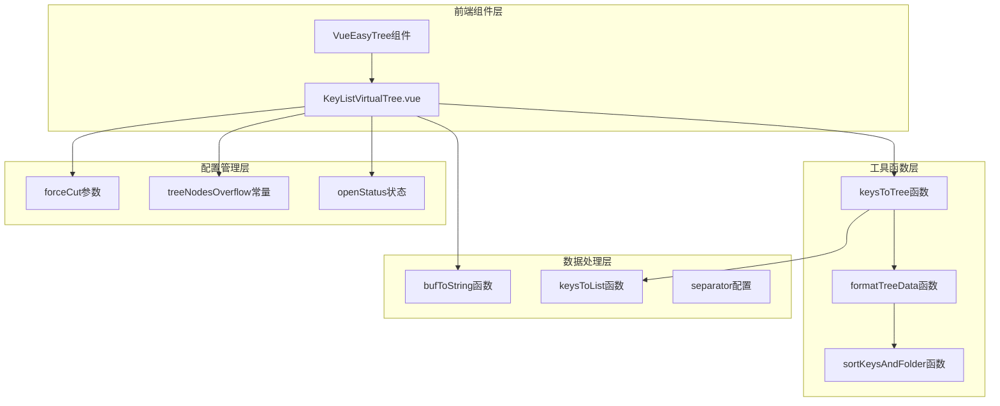
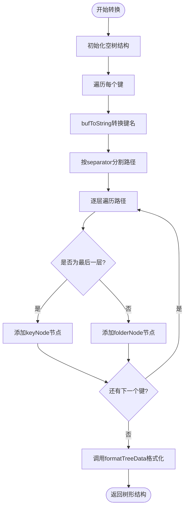
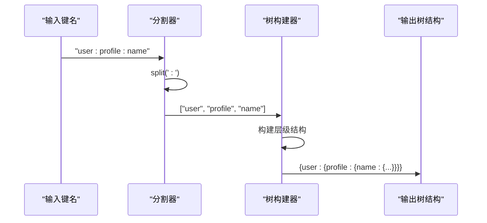
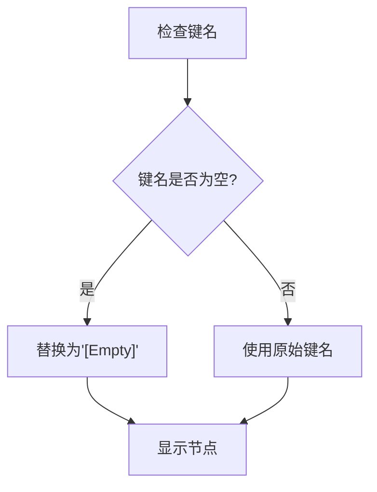
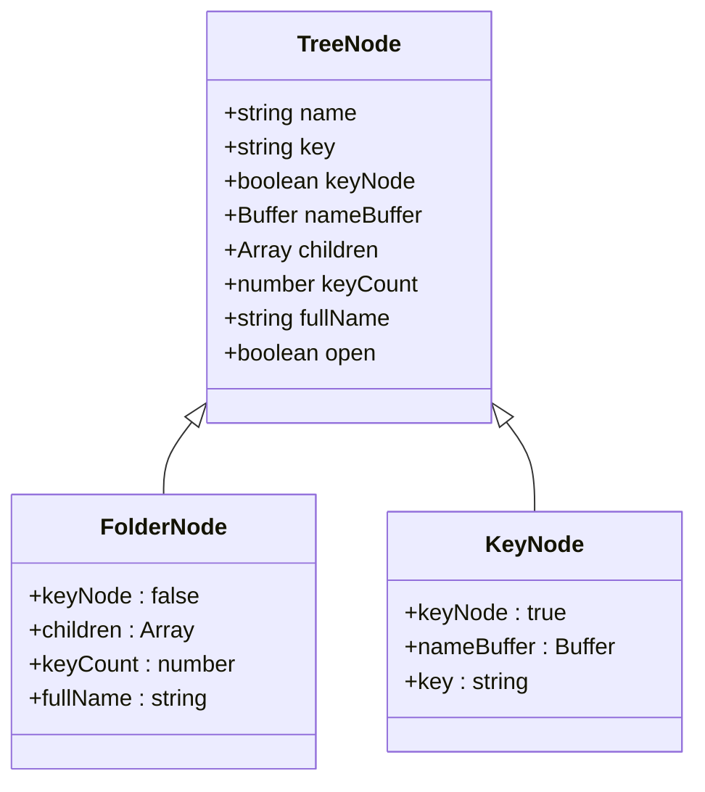
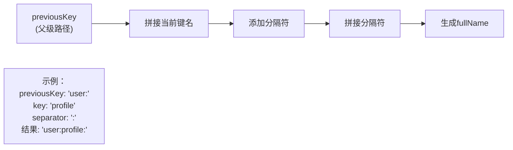
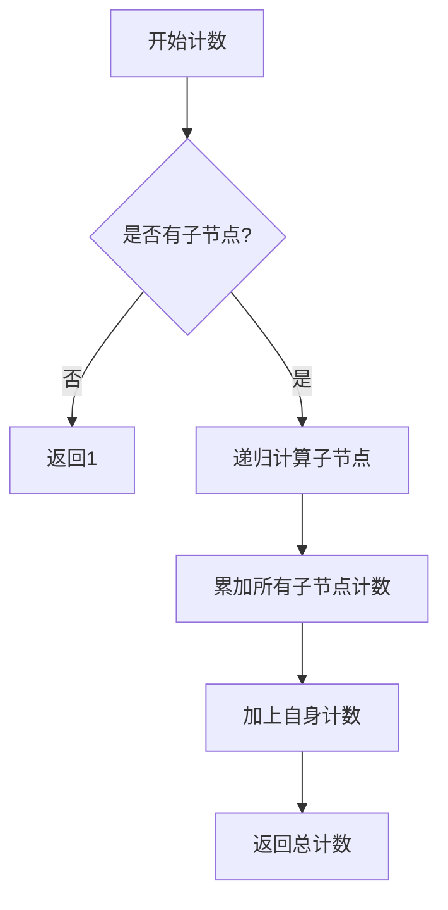
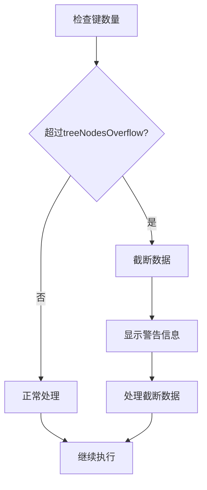

# 虚拟树数据转换机制详细文档

<cite>
**本文档中引用的文件**
- [src/util.js](file://src/util.js)
- [src/components/KeyListVirtualTree.vue](file://src/components/KeyListVirtualTree.vue)
- [src/main.js](file://src/main.js)
</cite>

## 目录
1. [概述](#概述)
2. [项目架构](#项目架构)
3. [核心数据转换函数](#核心数据转换函数)
4. [分离符机制详解](#分离符机制详解)
5. [空字符串键名处理](#空字符串键名处理)
6. [节点类型区分逻辑](#节点类型区分逻辑)
7. [fullName字段生成规则](#fullname字段生成规则)
8. [keyCount计数器机制](#keycount计数器机制)
9. [大数据集强制截断策略](#大数据集强制截断策略)
10. [性能优化考虑](#性能优化考虑)
11. [实际应用示例](#实际应用示例)
12. [总结](#总结)

## 概述

虚拟树数据转换机制是Another Redis Desktop Manager中用于高效展示Redis键值对层次结构的核心功能。该机制通过将扁平化的键名列表转换为树形结构，实现了对大量Redis键的快速浏览和管理。系统采用分层设计，包含数据预处理、树形结构构建、节点类型识别、计数统计等核心功能模块。

## 项目架构



**图表来源**
- [src/components/KeyListVirtualTree.vue](file://src/components/KeyListVirtualTree.vue#L1-L623)
- [src/util.js](file://src/util.js#L240-L300)

**章节来源**
- [src/components/KeyListVirtualTree.vue](file://src/components/KeyListVirtualTree.vue#L1-L623)
- [src/util.js](file://src/util.js#L1-L392)

## 核心数据转换函数

### keysToTree方法详解

`keysToTree`函数是整个数据转换机制的核心入口点，负责将扁平化的键名数组转换为树形结构。该函数采用逐层构建的方式，通过遍历每个键名并根据分隔符进行路径分割来构建树形结构。



**图表来源**
- [src/util.js](file://src/util.js#L240-L267)

### 数据转换流程

转换过程遵循以下步骤：

1. **初始化阶段**：创建根节点树结构
2. **键名处理**：将Buffer类型的键名转换为字符串
3. **路径解析**：根据分隔符将键名分解为路径段
4. **树构建**：逐层构建树形结构
5. **格式化输出**：调用辅助函数完成最终格式化

**章节来源**
- [src/util.js](file://src/util.js#L240-L267)

## 分离符机制详解

### 分离符的作用原理

分离符（separator）是路径解析的核心机制，用于标识键名中的层级关系。默认使用冒号（:）作为分隔符，但系统支持自定义分隔符配置。



**图表来源**
- [src/util.js](file://src/util.js#L244-L246)
- [src/components/KeyListVirtualTree.vue](file://src/components/KeyListVirtualTree.vue#L103-L105)

### 分离符配置机制

分离符配置通过Vue组件的计算属性实现动态获取：

- **默认值**：使用配置中的separator属性，未设置时默认为':'
- **动态切换**：支持运行时修改分隔符设置
- **兼容性**：同时支持传统冒号分隔符和自定义分隔符

**章节来源**
- [src/components/KeyListVirtualTree.vue](file://src/components/KeyListVirtualTree.vue#L103-L105)

## 空字符串键名处理

### 显示处理机制

当键名为空字符串时，系统采用特殊的显示处理方式，将其显示为"[Empty]"以避免界面显示问题。



**图表来源**
- [src/util.js](file://src/util.js#L270)

### 实现细节

在`formatTreeData`函数中，空键名的处理逻辑如下：
- 检查键名是否为空字符串
- 如果为空，则使用"[Empty]"作为显示名称
- 保持内部键名不变，确保数据完整性

**章节来源**
- [src/util.js](file://src/util.js#L270)

## 节点类型区分逻辑

### folder节点与key节点的识别

系统通过两种不同的标记机制来区分folder节点和key节点：



**图表来源**
- [src/util.js](file://src/util.js#L250-L255)
- [src/util.js](file://src/util.js#L291-L296)

### 区分逻辑实现

1. **folder节点特征**：
   - `keyNode`属性为false
   - 包含子节点（`Object.keys(tree[key]).length > 0`）
   - 具有`children`属性

2. **key节点特征**：
   - `keyNode`属性为true
   - 不包含子节点
   - 包含`nameBuffer`属性存储原始键数据

**章节来源**
- [src/util.js](file://src/util.js#L272-L296)

## fullName字段生成规则

### 生成算法

fullName字段用于唯一标识树形结构中的每个节点，其生成遵循严格的层级拼接规则：



**图表来源**
- [src/util.js](file://src/util.js#L275)

### 唯一性保证

为了防止fullName冲突，系统采用以下策略：
- 在folder节点前添加"F"前缀
- 使用完整的路径拼接
- 确保每个节点的fullName全局唯一

**章节来源**
- [src/util.js](file://src/util.js#L278-L289)

## keyCount计数器机制

### 计数逻辑

keyCount计数器采用递归统计方式，准确计算每个folder节点下的子节点数量：



**图表来源**
- [src/util.js](file://src/util.js#L282)

### 统计规则

keyCount的计算遵循以下规则：
- **folder节点**：子节点数量之和 + 1（自身）
- **key节点**：固定值1
- **递归计算**：从叶子节点向上累加

**章节来源**
- [src/util.js](file://src/util.js#L282)

## 大数据集强制截断策略

### 截断机制

当键的数量超过阈值时，系统采用强制截断策略来保证性能：



**图表来源**
- [src/components/KeyListVirtualTree.vue](file://src/components/KeyListVirtualTree.vue#L394-L404)

### forceCut参数详解

forceCut参数控制树形结构的最大节点数量，默认值为20000：

- **触发条件**：键数量 > forceCut
- **处理方式**：截断为前forceCut个元素
- **用户体验**：显示警告信息告知用户数据被截断
- **数据完整性**：保留用户已选择的节点状态

**章节来源**
- [src/components/KeyListVirtualTree.vue](file://src/components/KeyListVirtualTree.vue#L89)
- [src/components/KeyListVirtualTree.vue](file://src/components/KeyListVirtualTree.vue#L394-L404)

## 性能优化考虑

### 内存管理

系统采用多种策略优化内存使用：

1. **延迟加载**：仅在展开时加载子节点
2. **数据压缩**：使用Buffer对象减少字符串存储开销
3. **状态缓存**：维护expandedKeys集合避免重复计算

### 排序优化

系统实现了智能排序机制：
- **folder优先**：folder节点始终排在前面
- **字母排序**：同类型节点按字母顺序排列
- **异步排序**：仅对展开的folder进行排序

**章节来源**
- [src/util.js](file://src/util.js#L304-L322)
- [src/components/KeyListVirtualTree.vue](file://src/components/KeyListVirtualTree.vue#L418)

## 实际应用示例

### 基本使用场景

假设有一个Redis数据库包含以下键名：
- "user:1001:profile"
- "user:1001:settings"
- "user:1002:profile"
- "system:config:version"

经过`keysToTree`转换后，将生成如下树形结构：

```javascript
// 转换后的树形结构示例
{
  "user": {
    "1001": {
      "profile": {...},
      "settings": {...}
    },
    "1002": {
      "profile": {...}
    }
  },
  "system": {
    "config": {
      "version": {...}
    }
  }
}
```

### 高级应用场景

对于大型Redis数据库，系统能够有效处理：
- 数十万级别的键名
- 复杂的嵌套层级结构
- 动态的分隔符配置
- 实时的状态同步

**章节来源**
- [src/components/KeyListVirtualTree.vue](file://src/components/KeyListVirtualTree.vue#L410-L412)

## 总结

虚拟树数据转换机制是Another Redis Desktop Manager的核心功能之一，通过精心设计的算法和优化策略，实现了对大规模Redis键值对数据的高效管理和可视化展示。该机制的主要优势包括：

1. **高性能**：采用分层构建和延迟加载策略
2. **灵活性**：支持自定义分隔符和截断策略
3. **可扩展性**：模块化设计便于功能扩展
4. **用户体验**：智能排序和状态保持

通过深入理解这些机制，开发者可以更好地利用系统功能，并在需要时进行定制化开发。