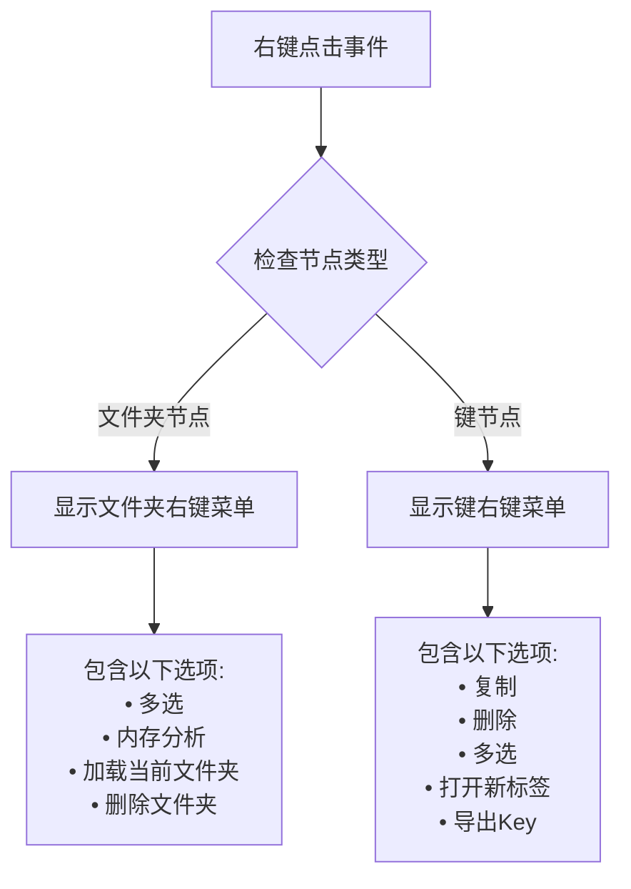
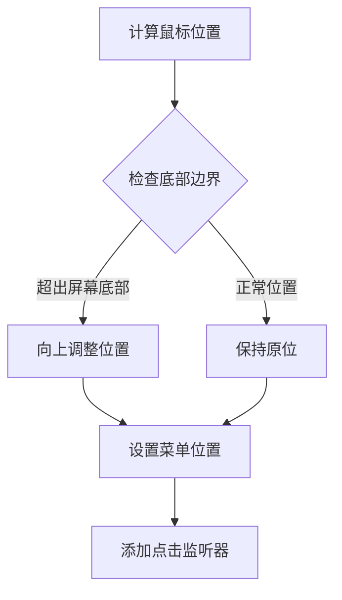
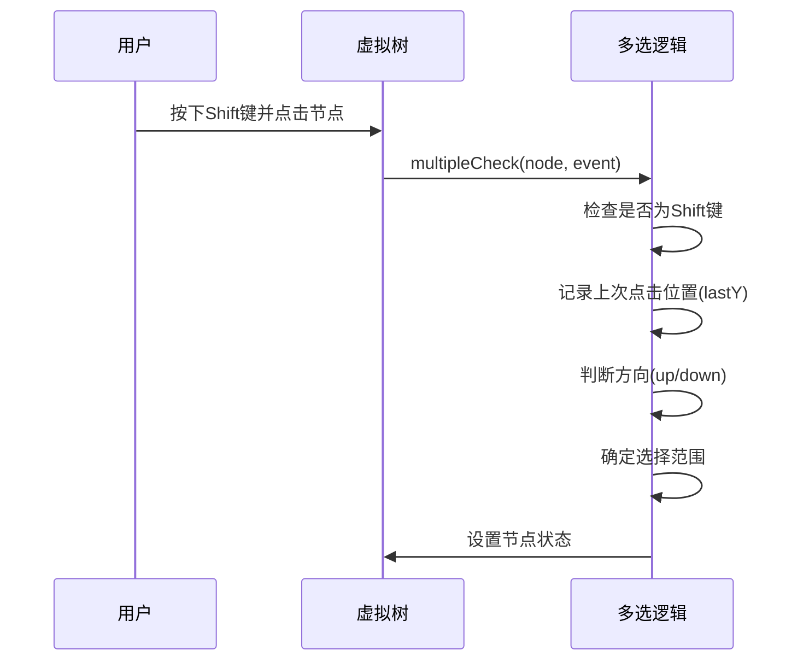
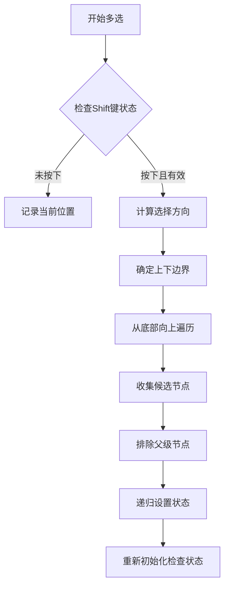
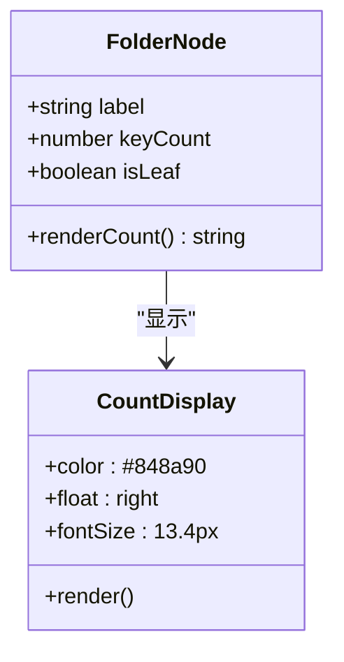
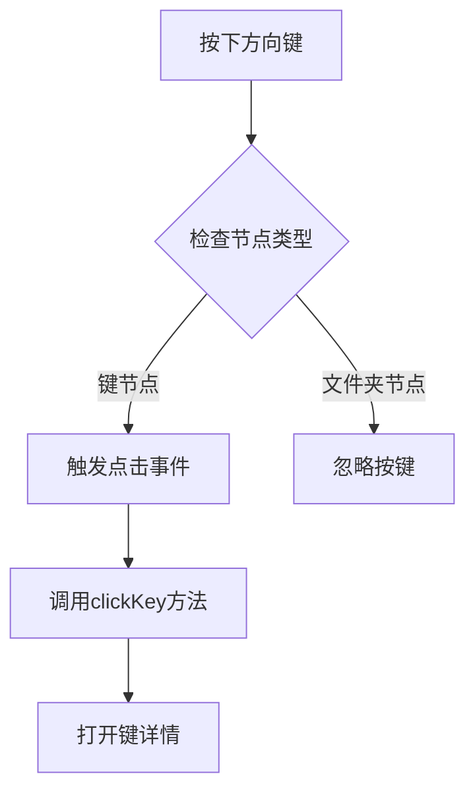
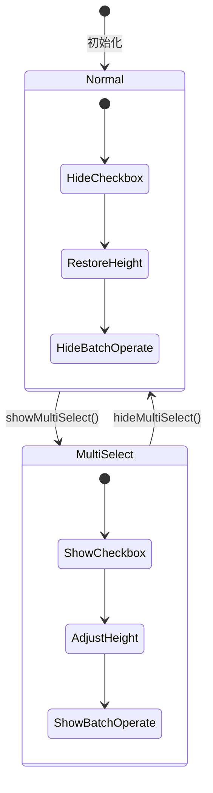
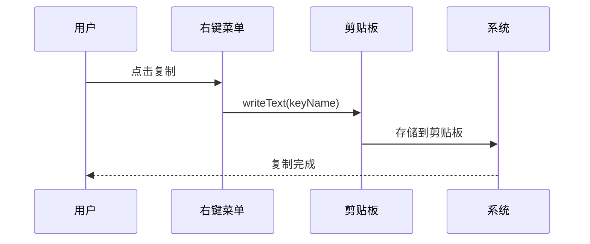
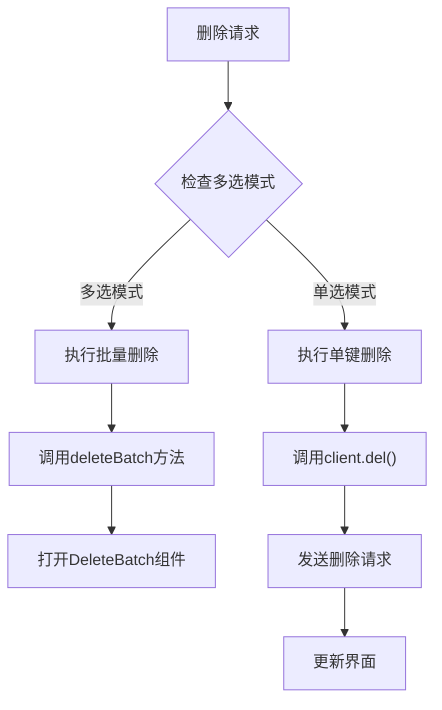

# 虚拟树用户交互特性深度文档

<cite>
**本文档引用的文件**
- [KeyListVirtualTree.vue](file://src/components/KeyListVirtualTree.vue)
- [RightClickMenu.vue](file://src/components/RightClickMenu.vue)
- [DeleteBatch.vue](file://src/components/DeleteBatch.vue)
- [OperateItem.vue](file://src/components/OperateItem.vue)
- [KeyListNormal.vue](file://src/components/KeyListNormal.vue)
</cite>

## 目录
1. [概述](#概述)
2. [右键菜单差异化显示逻辑](#右键菜单差异化显示逻辑)
3. [Shift键多选实现原理](#shift键多选实现原理)
4. [文件夹计数显示UI实现](#文件夹计数显示ui实现)
5. [键盘导航行为](#键盘导航行为)
6. [批量操作栏联动机制](#批量操作栏联动机制)
7. [右键菜单项具体实现](#右键菜单项具体实现)
8. [性能优化考虑](#性能优化考虑)

## 概述

虚拟树组件是AnotherRedisDesktopManager中的核心交互界面，提供了丰富的用户交互特性，包括智能的右键菜单、Shift键多选、文件夹计数显示、键盘导航等功能。这些特性共同构成了一个高效、直观的Redis键管理界面。

## 右键菜单差异化显示逻辑

### 文件夹右键菜单

当用户右键点击文件夹节点时，系统会显示专门针对文件夹的操作选项：

**图表来源**
- [KeyListVirtualTree.vue](file://src/components/KeyListVirtualTree.vue#L58-L72)

### 键右键菜单

键节点的右键菜单提供更丰富的操作选项，支持直接对单个键进行操作：

**节来源**
- [KeyListVirtualTree.vue](file://src/components/KeyListVirtualTree.vue#L58-L72)

### 右键菜单定位算法

系统采用智能定位算法确保右键菜单不会超出屏幕边界：

**图表来源**
- [KeyListVirtualTree.vue](file://src/components/KeyListVirtualTree.vue#L115-L128)

**节来源**
- [KeyListVirtualTree.vue](file://src/components/KeyListVirtualTree.vue#L108-L129)

## Shift键多选实现原理

### 方向判断机制

Shift键多选的核心在于准确判断用户的选择方向：

**图表来源**
- [KeyListVirtualTree.vue](file://src/components/KeyListVirtualTree.vue#L319-L388)

### 节点遍历算法

系统使用高效的节点遍历算法来确定需要选择的节点范围：

**图表来源**
- [KeyListVirtualTree.vue](file://src/components/KeyListVirtualTree.vue#L346-L388)

### 父子节点排除机制

为了避免意外影响整个文件夹结构，系统实现了智能的父子节点排除机制：

**节来源**
- [KeyListVirtualTree.vue](file://src/components/KeyListVirtualTree.vue#L334-L388)

## 文件夹计数显示UI实现

### 显示逻辑

文件夹计数显示通过Vue模板动态渲染，提供实时的键数量信息：

**图表来源**
- [KeyListVirtualTree.vue](file://src/components/KeyListVirtualTree.vue#L50-L52)

### 性能考虑

为了确保大量数据下的流畅性能，系统采用了以下优化策略：

1. **条件渲染**: 只有非叶子节点才显示计数
2. **样式优化**: 使用CSS浮动而非Flex布局减少重排
3. **颜色主题**: 支持深色模式适配

**节来源**
- [KeyListVirtualTree.vue](file://src/components/KeyListVirtualTree.vue#L50-L52)
- [KeyListVirtualTree.vue](file://src/components/KeyListVirtualTree.vue#L545-L552)

## 键盘导航行为

### 方向键导航

系统支持ArrowUp和ArrowDown键在键节点间的导航：

**图表来源**
- [KeyListVirtualTree.vue](file://src/components/KeyListVirtualTree.vue#L175-L178)

### 回车键行为

虽然代码中没有显式处理回车键，但系统通过`node-click`事件自然支持回车键导航：

**节来源**
- [KeyListVirtualTree.vue](file://src/components/KeyListVirtualTree.vue#L167-L179)

## 批量操作栏联动机制

### 显示/隐藏逻辑

批量操作栏的显示与隐藏完全依赖于多选模式的状态：

**图表来源**
- [KeyListVirtualTree.vue](file://src/components/KeyListVirtualTree.vue#L180-L195)

### 样式联动

批量操作栏的显示通过CSS类名控制：

**节来源**
- [KeyListVirtualTree.vue](file://src/components/KeyListVirtualTree.vue#L180-L195)
- [KeyListVirtualTree.vue](file://src/components/KeyListVirtualTree.vue#L555-L561)

## 右键菜单项具体实现

### 复制功能

复制功能通过Electron的clipboard模块实现：

**图表来源**
- [KeyListVirtualTree.vue](file://src/components/KeyListVirtualTree.vue#L212-L215)

### 删除功能

删除功能根据当前模式执行不同策略：

**图表来源**
- [KeyListVirtualTree.vue](file://src/components/KeyListVirtualTree.vue#L217-L238)

### 导出功能

导出功能支持单键和批量导出：

**节来源**
- [KeyListVirtualTree.vue](file://src/components/KeyListVirtualTree.vue#L211-L269)

## 性能优化考虑

### 虚拟滚动优化

系统使用VueEasyTree组件实现虚拟滚动，支持大量数据的高效展示：

1. **固定项目高度**: itemSize设置为22px
2. **延迟加载**: 只渲染可见区域的节点
3. **内存管理**: 自动回收不可见节点的DOM

### 数据量限制

当节点数量超过阈值时，系统自动截断并提示用户：

**节来源**
- [KeyListVirtualTree.vue](file://src/components/KeyListVirtualTree.vue#L394-L404)

### 事件处理优化

1. **事件委托**: 使用单一事件监听器处理多个节点
2. **防抖处理**: 关键操作使用防抖避免频繁触发
3. **异步处理**: 大量数据操作使用nextTick避免阻塞

**节来源**
- [KeyListVirtualTree.vue](file://src/components/KeyListVirtualTree.vue#L394-L426)

## 总结

虚拟树组件通过精心设计的用户交互特性，为用户提供了高效、直观的Redis键管理体验。从智能的右键菜单到灵活的Shift键多选，从实时的文件夹计数到流畅的键盘导航，每个特性都经过深思熟虑的实现和优化，确保了在处理大量数据时的性能和用户体验。