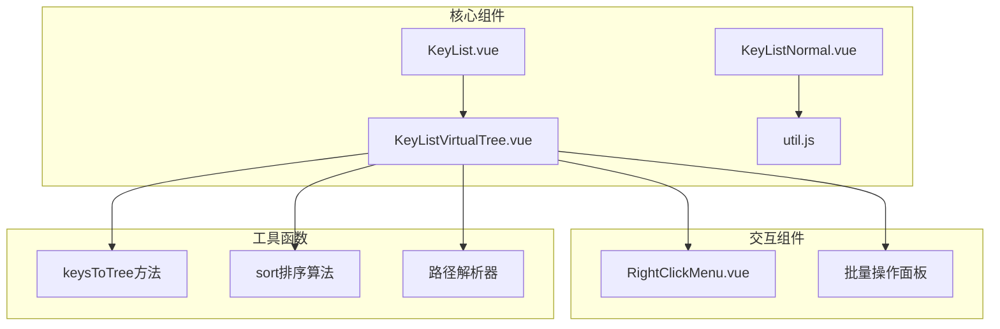
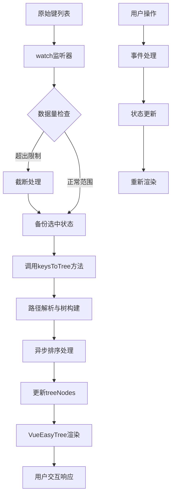
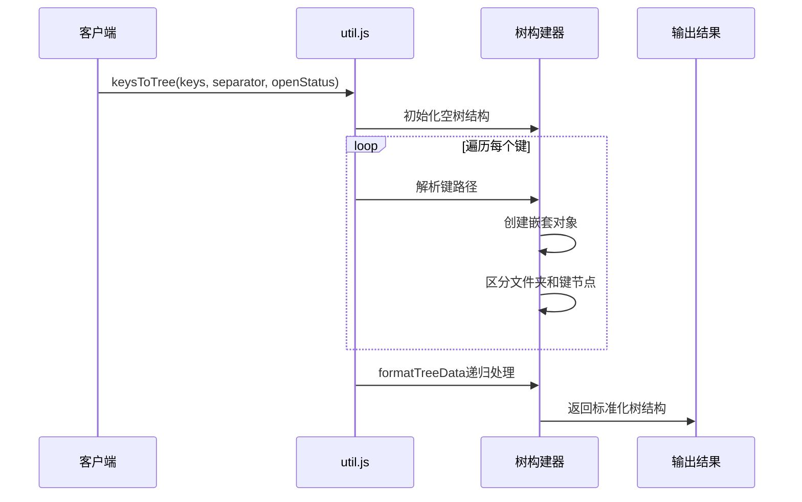
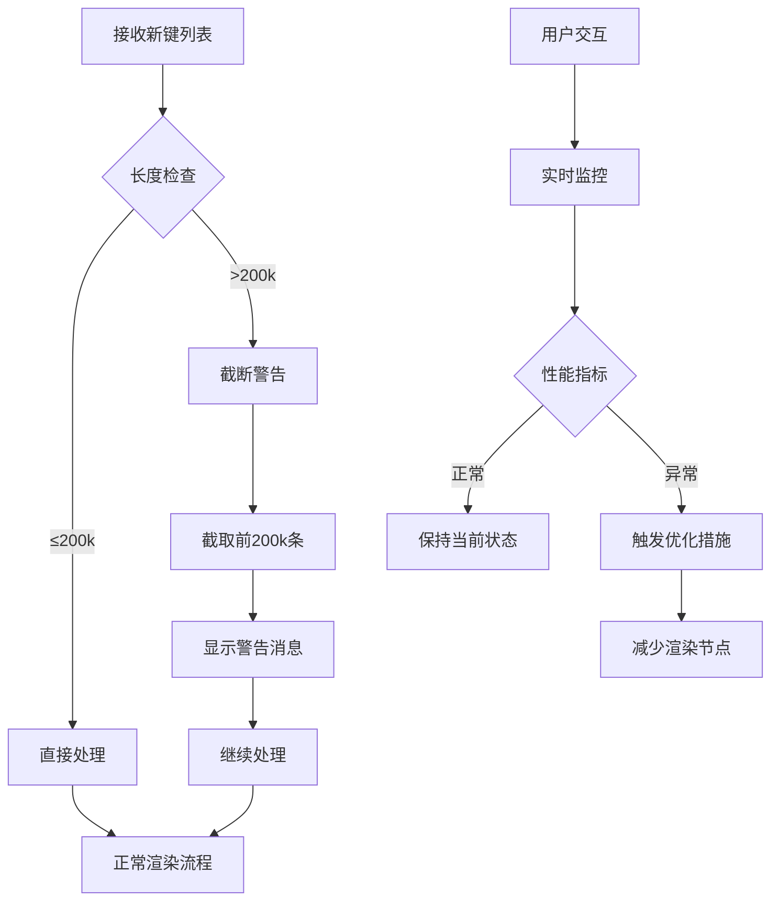
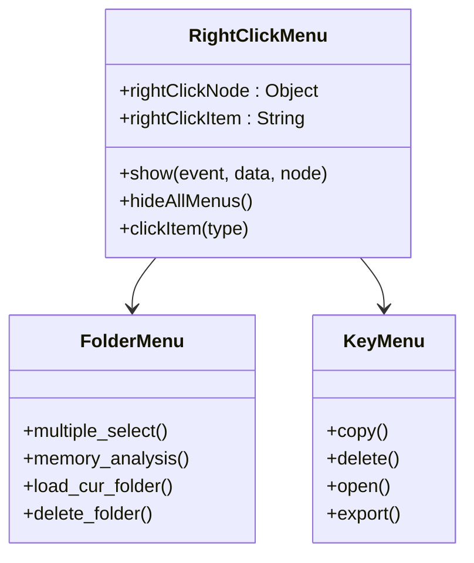
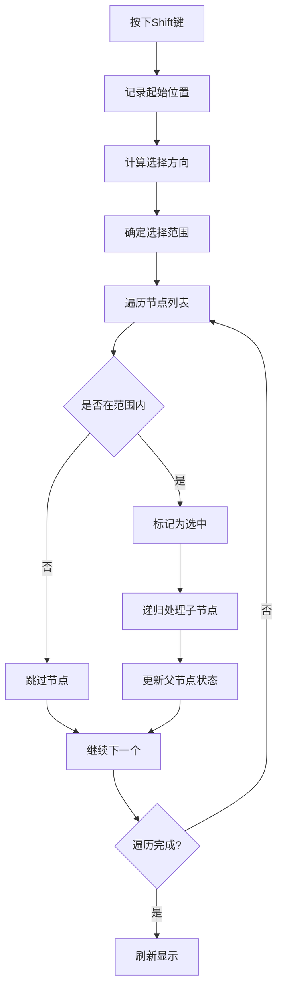
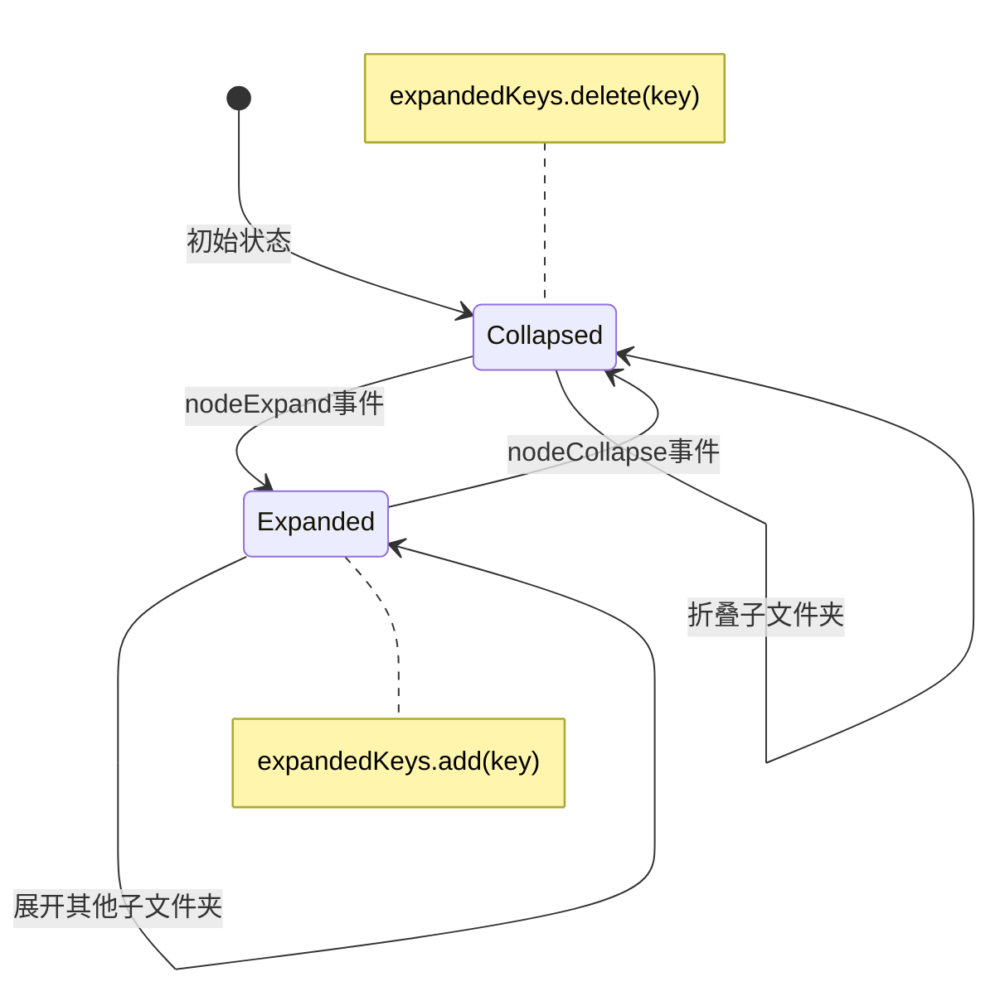
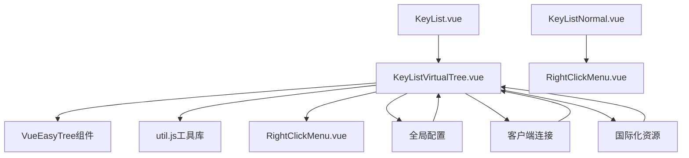

# 虚拟树渲染

<cite>
**本文档中引用的文件**
- [KeyListVirtualTree.vue](file://src/components/KeyListVirtualTree.vue)
- [util.js](file://src/util.js)
- [KeyList.vue](file://src/components/KeyList.vue)
- [KeyListNormal.vue](file://src/components/KeyListNormal.vue)
- [RightClickMenu.vue](file://src/components/RightClickMenu.vue)
</cite>

## 目录
1. [简介](#简介)
2. [项目结构](#项目结构)
3. [核心组件](#核心组件)
4. [架构概览](#架构概览)
5. [详细组件分析](#详细组件分析)
6. [依赖关系分析](#依赖关系分析)
7. [性能考虑](#性能考虑)
8. [故障排除指南](#故障排除指南)
9. [结论](#结论)

## 简介

虚拟树渲染是Another Redis Desktop Manager中用于高效展示大量Redis键值对的核心技术。该系统通过VueEasyTree组件实现了高性能的树形结构渲染，支持超大数据集的流畅浏览，同时提供了丰富的交互功能，包括右键菜单、Shift多选、文件夹计数等特性。

## 项目结构

该项目采用模块化的Vue.js架构，主要包含以下关键文件：

**图表来源**
- [KeyList.vue](file://src/components/KeyList.vue#L1-L50)
- [KeyListVirtualTree.vue](file://src/components/KeyListVirtualTree.vue#L1-L100)

**章节来源**
- [KeyList.vue](file://src/components/KeyList.vue#L1-L350)
- [KeyListVirtualTree.vue](file://src/components/KeyListVirtualTree.vue#L1-L623)

## 核心组件

### KeyListVirtualTree组件

KeyListVirtualTree是整个虚拟树渲染系统的核心组件，负责将扁平的键列表转换为树形结构并进行渲染。

#### 主要配置参数

| 参数名称 | 类型 | 默认值 | 描述 |
|---------|------|--------|------|
| treeNodesOverflow | Number | 200000 | 树节点数量限制，超过此值将截断数据 |
| vtreeHeight | String | 'calc(100vh - 248px)' | 虚拟树高度计算公式 |
| separator | String | ':' | 键名分隔符，默认使用冒号 |
| expandedKeys | Set | new Set() | 维护展开状态的文件夹集合 |

#### 关键属性和方法

- **keyNodes**: 存储转换后的树形结构数据
- **props**: 定义树节点的标签和子节点字段映射
- **multiOperating**: 控制多选模式的状态标志

**章节来源**
- [KeyListVirtualTree.vue](file://src/components/KeyListVirtualTree.vue#L80-L100)

## 架构概览

虚拟树渲染系统采用分层架构设计，从数据处理到最终渲染形成完整的流水线：

**图表来源**
- [KeyListVirtualTree.vue](file://src/components/KeyListVirtualTree.vue#L390-L427)
- [util.js](file://src/util.js#L240-L299)

## 详细组件分析

### 数据转换与树构建

#### keysToTree方法详解

util.js中的keysToTree方法是树形结构转换的核心算法：

**图表来源**
- [util.js](file://src/util.js#L240-L299)

#### 分隔符配置机制

separator配置项在路径解析中起到关键作用：

- **默认行为**: 使用':'作为键名分隔符
- **自定义配置**: 支持用户自定义分隔符
- **兼容性**: 自动处理未定义或无效的分隔符

**章节来源**
- [KeyListVirtualTree.vue](file://src/components/KeyListVirtualTree.vue#L102-L105)
- [util.js](file://src/util.js#L240-L266)

### 性能优化机制

#### treeNodesOverflow限制机制

系统实现了多层次的性能保护机制：

**图表来源**
- [KeyListVirtualTree.vue](file://src/components/KeyListVirtualTree.vue#L394-L404)

#### 虚拟滚动优化

VueEasyTree组件提供了内置的虚拟滚动功能：

- **itemSize**: 每个节点固定高度22px
- **height**: 动态计算容器高度
- **indent**: 缩进设置为10px
- **vue-recycle-scroller**: 底层虚拟滚动实现

**章节来源**
- [KeyListVirtualTree.vue](file://src/components/KeyListVirtualTree.vue#L24-L47)

### 用户交互功能

#### 右键菜单系统

右键菜单提供了丰富的上下文操作：

**图表来源**
- [KeyListVirtualTree.vue](file://src/components/KeyListVirtualTree.vue#L108-L130)
- [RightClickMenu.vue](file://src/components/RightClickMenu.vue#L15-L106)

#### Shift多选机制

系统实现了复杂的Shift键多选功能：

**图表来源**
- [KeyListVirtualTree.vue](file://src/components/KeyListVirtualTree.vue#L319-L388)

#### 批量操作面板

多选模式下的批量操作功能：

| 操作类型 | 快捷键 | 功能描述 |
|---------|--------|----------|
| 全选/取消全选 | Ctrl+A | 一键选择所有可见节点 |
| 删除选中项 | Del | 批量删除选中的键 |
| 导出选中项 | Ctrl+E | 将选中的键导出为CSV格式 |
| 取消多选 | Esc | 退出多选模式 |

**章节来源**
- [KeyListVirtualTree.vue](file://src/components/KeyListVirtualTree.vue#L180-L206)

### 状态管理与持久化

#### expandedKeys集合管理

expandedKeys是一个Set类型的响应式数据，用于维护文件夹的展开状态：

**图表来源**
- [KeyListVirtualTree.vue](file://src/components/KeyListVirtualTree.vue#L145-L155)

#### 多选状态同步

系统通过多个方法协同工作实现多选状态的精确控制：

- **setCheckedLeafKeys**: 恢复之前选中的叶子节点
- **setCheckedAll**: 实现全选功能
- **getCheckedNodes**: 获取当前选中的节点列表
- **setChecked**: 单独设置某个节点的选中状态

**章节来源**
- [KeyListVirtualTree.vue](file://src/components/KeyListVirtualTree.vue#L280-L282)
- [KeyListVirtualTree.vue](file://src/components/KeyListVirtualTree.vue#L283-L296)

## 依赖关系分析

### 组件间依赖关系

**图表来源**
- [KeyList.vue](file://src/components/KeyList.vue#L42-L61)
- [KeyListVirtualTree.vue](file://src/components/KeyListVirtualTree.vue#L77-L101)

### 外部依赖

系统依赖以下外部库和模块：

- **@qii404/vue-easy-tree**: 提供虚拟树渲染能力
- **Element UI**: 基础UI组件库
- **Electron**: 桌面应用框架（用于剪贴板操作）
- **各种序列化库**: 支持多种数据格式解析

**章节来源**
- [KeyListVirtualTree.vue](file://src/components/KeyListVirtualTree.vue#L77-L78)

## 性能考虑

### 内存优化策略

1. **数据截断**: 当键数量超过20万时自动截断
2. **懒加载**: 只渲染可视区域内的节点
3. **事件委托**: 减少DOM事件监听器数量
4. **缓存机制**: 缓存计算结果避免重复处理

### 渲染性能优化

1. **虚拟滚动**: 使用vue-recycle-scroller实现高性能滚动
2. **异步排序**: 在nextTick中执行耗时的排序操作
3. **批量更新**: 合并多个状态变更操作
4. **防抖处理**: 对频繁触发的操作进行防抖

### 用户体验优化

1. **渐进式加载**: 大数据集分批加载显示
2. **进度提示**: 显示加载状态和警告信息
3. **键盘导航**: 支持键盘快捷键操作
4. **响应式设计**: 适配不同屏幕尺寸

## 故障排除指南

### 常见问题及解决方案

#### 树节点过多警告

**问题描述**: 当键数量超过20万时显示警告信息

**解决方案**:
1. 检查数据源是否合理
2. 考虑使用更精确的搜索条件
3. 分批加载数据而非一次性加载全部

#### 性能卡顿问题

**问题描述**: 大数据集下界面响应缓慢

**解决方案**:
1. 启用treeNodesOverflow限制
2. 优化搜索匹配模式
3. 减少同时展开的文件夹数量
4. 使用键盘导航代替鼠标点击

#### 右键菜单不显示

**问题描述**: 右键点击无反应或菜单不出现

**解决方案**:
1. 检查浏览器JavaScript执行权限
2. 确认DOM元素正确渲染
3. 验证事件监听器绑定状态

**章节来源**
- [KeyListVirtualTree.vue](file://src/components/KeyListVirtualTree.vue#L394-L404)
- [KeyListVirtualTree.vue](file://src/components/KeyListVirtualTree.vue#L108-L130)

## 结论

虚拟树渲染系统通过巧妙的设计实现了高性能的数据展示和交互体验。系统的核心优势包括：

1. **高性能渲染**: 基于虚拟滚动技术，支持超大数据集的流畅浏览
2. **智能优化**: 多层次的性能保护机制确保系统稳定性
3. **丰富功能**: 完整的交互功能满足各种使用场景
4. **易于扩展**: 模块化设计便于功能扩展和维护

该系统为Redis桌面管理器提供了强大的键值对浏览能力，是现代Web应用中树形结构渲染的优秀实践案例。通过合理的架构设计和性能优化，成功解决了大规模数据展示的技术挑战，为用户提供了流畅的使用体验。