# 键列表渲染机制深度文档

<cite>
**本文档引用的文件**
- [KeyList.vue](file://src/components/KeyList.vue)
- [KeyListVirtualTree.vue](file://src/components/KeyListVirtualTree.vue)
- [KeyListNormal.vue](file://src/components/KeyListNormal.vue)
- [bus.js](file://src/bus.js)
- [redisClient.js](file://src/redisClient.js)
- [util.js](file://src/util.js)
- [RightClickMenu.vue](file://src/components/RightClickMenu.vue)
- [main.js](file://src/main.js)
</cite>

## 目录
1. [概述](#概述)
2. [系统架构](#系统架构)
3. [核心组件分析](#核心组件分析)
4. [动态组件选择机制](#动态组件选择机制)
5. [数据流与渲染流程](#数据流与渲染流程)
6. [Redis SCAN命令集成](#redis-scan命令集成)
7. [分页加载机制](#分页加载机制)
8. [事件总线通信](#事件总线通信)
9. [性能优化策略](#性能优化策略)
10. [开发者指南](#开发者指南)
11. [故障排除](#故障排除)

## 概述

键列表渲染机制是Another Redis Desktop Manager的核心功能模块，负责高效展示Redis数据库中的键列表。该系统采用动态组件选择策略，支持虚拟树形结构和普通列表两种渲染模式，同时集成了Redis SCAN命令进行大数据量处理，并通过事件总线实现实时状态同步。

## 系统架构

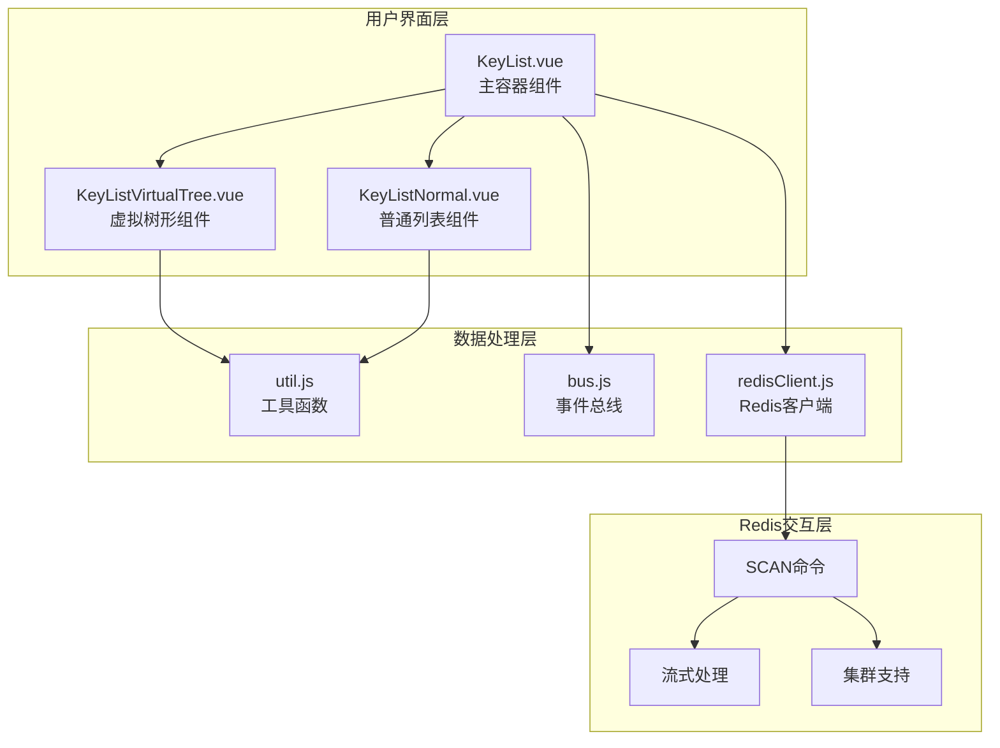

**图表来源**
- [KeyList.vue](file://src/components/KeyList.vue#L1-L40)
- [KeyListVirtualTree.vue](file://src/components/KeyListVirtualTree.vue#L1-L50)
- [KeyListNormal.vue](file://src/components/KeyListNormal.vue#L1-L20)

## 核心组件分析

### KeyList.vue - 主容器组件

KeyList.vue作为整个键列表渲染系统的入口点，负责协调不同渲染组件的选择和数据传递。

#### 组件特性

| 特性 | 描述 | 实现位置 |
|------|------|----------|
| 动态组件选择 | 根据配置自动选择渲染组件 | [第4行](file://src/components/KeyList.vue#L4-L10) |
| 分页控制 | 提供"加载更多"和"加载全部"功能 | [第14-36行](file://src/components/KeyList.vue#L14-L36) |
| 状态管理 | 维护扫描状态和加载状态 | [第46-57行](file://src/components/KeyList.vue#L46-L57) |
| 事件监听 | 响应连接状态变化 | [第88-103行](file://src/components/KeyList.vue#L88-L103) |

#### 关键方法

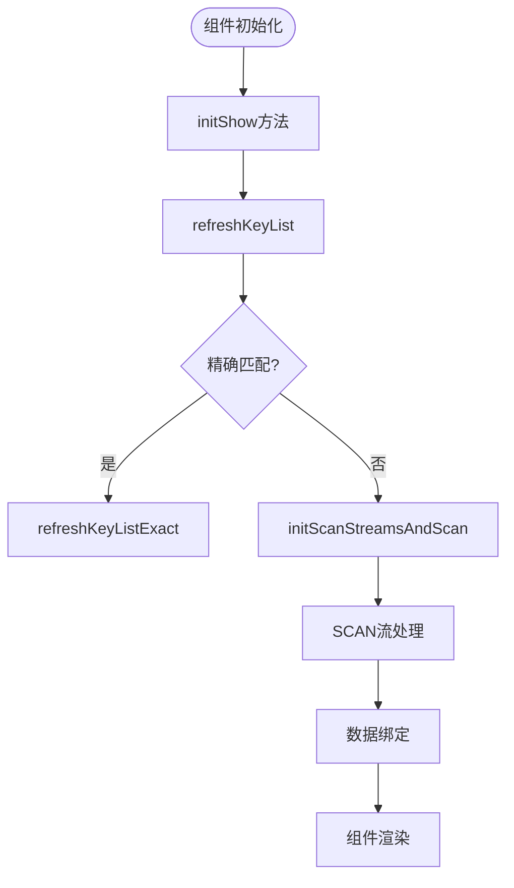

**图表来源**
- [KeyList.vue](file://src/components/KeyList.vue#L106-L147)

**章节来源**
- [KeyList.vue](file://src/components/KeyList.vue#L1-L350)

### KeyListVirtualTree.vue - 虚拟树形组件

虚拟树形组件提供了高效的树形结构展示能力，特别适用于具有层次结构的键命名空间。

#### 核心功能

| 功能 | 实现方式 | 性能特点 |
|------|----------|----------|
| 层次化展示 | 基于分隔符的键分割 | O(n)时间复杂度 |
| 虚拟滚动 | 基于vue-recycle-scroller | 内存占用最小化 |
| 多选操作 | 支持Shift键多选 | 高效的批量操作 |
| 右键菜单 | 完整的上下文操作 | 用户体验优化 |

#### 渲染流程

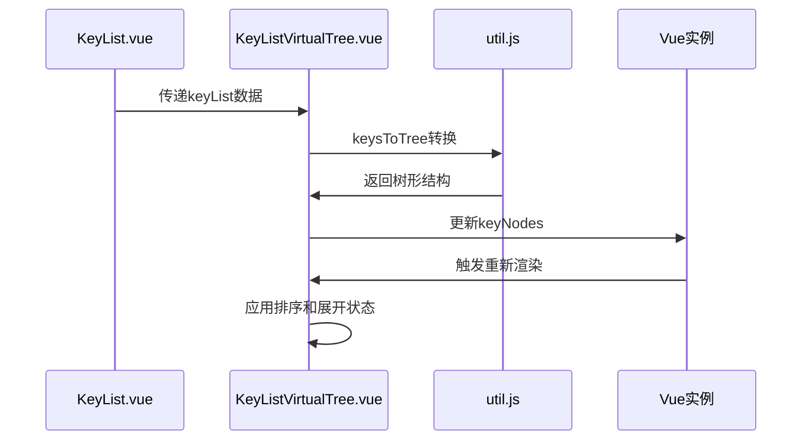

**图表来源**
- [KeyListVirtualTree.vue](file://src/components/KeyListVirtualTree.vue#L390-L427)
- [util.js](file://src/util.js#L240-L299)

**章节来源**
- [KeyListVirtualTree.vue](file://src/components/KeyListVirtualTree.vue#L1-L623)

### KeyListNormal.vue - 普通列表组件

普通列表组件提供简洁的线性展示方式，适用于不需要层次结构的场景。

#### 设计特点

- **简单高效**：直接使用原生DOM元素
- **右键菜单**：提供基本操作选项
- **高亮显示**：增强用户交互体验

**章节来源**
- [KeyListNormal.vue](file://src/components/KeyListNormal.vue#L1-L100)

## 动态组件选择机制

系统通过计算属性和条件渲染实现了智能的组件选择机制。

### 选择策略

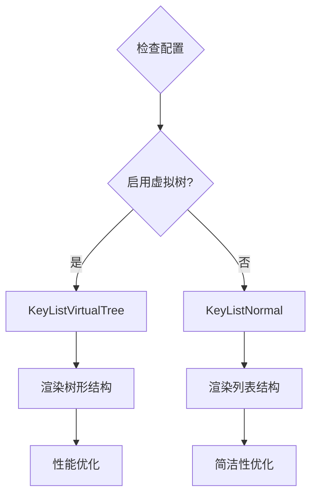

**图表来源**
- [KeyList.vue](file://src/components/KeyList.vue#L48-L50)

### 数据绑定方式

组件间的数据传递采用Vue的props和事件机制：

| 绑定类型 | 方向 | 数据内容 | 实现方式 |
|----------|------|----------|----------|
| 单向绑定 | 父→子 | client, config, keyList | Props传递 |
| 事件绑定 | 子→父 | exportBatch事件 | 自定义事件 |
| 状态共享 | 全局 | 连接状态 | 事件总线 |

**章节来源**
- [KeyList.vue](file://src/components/KeyList.vue#L4-L10)

## 数据流与渲染流程

### 初始化流程

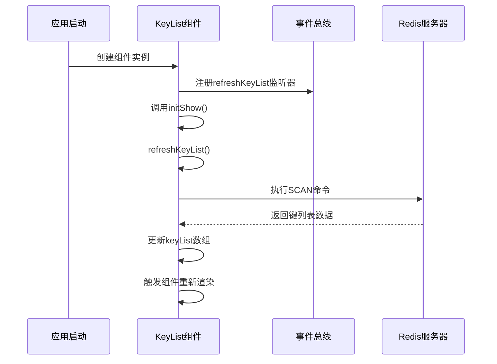

**图表来源**
- [KeyList.vue](file://src/components/KeyList.vue#L106-L112)
- [bus.js](file://src/bus.js#L1-L19)

### 数据转换过程

util.js提供了关键的数据转换函数：

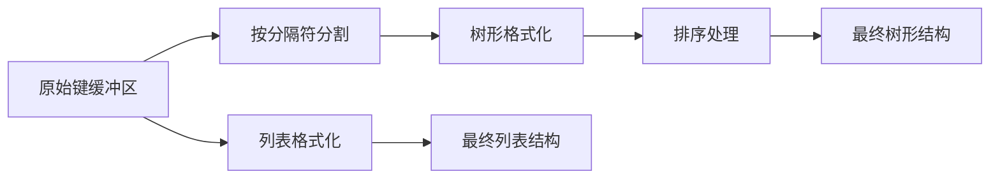

**图表来源**
- [util.js](file://src/util.js#L240-L299)

**章节来源**
- [KeyList.vue](file://src/components/KeyList.vue#L106-L147)
- [util.js](file://src/util.js#L240-L344)

## Redis SCAN命令集成

### SCAN命令特性

系统充分利用Redis SCAN命令的特性来处理大规模键数据：

| 特性 | 优势 | 实现应用 |
|------|------|----------|
| 无阻塞 | 不影响其他操作 | 流式处理 |
| 渐进式 | 支持大集合遍历 | 分页加载 |
| 模式匹配 | 支持通配符搜索 | 搜索功能 |
| 计数控制 | 可调节返回数量 | 性能平衡 |

### 流式处理架构

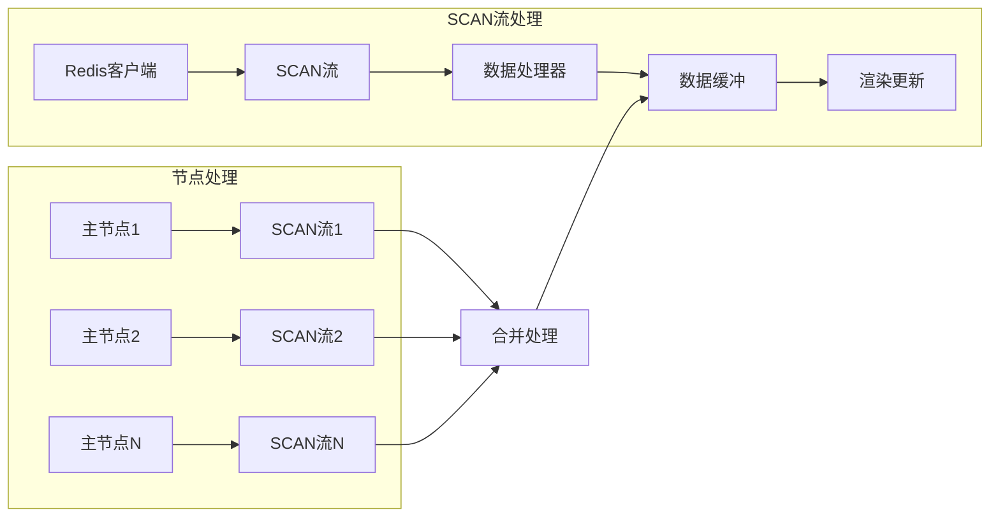

**图表来源**
- [KeyList.vue](file://src/components/KeyList.vue#L148-L212)

### 错误处理机制

系统实现了完善的错误处理策略：

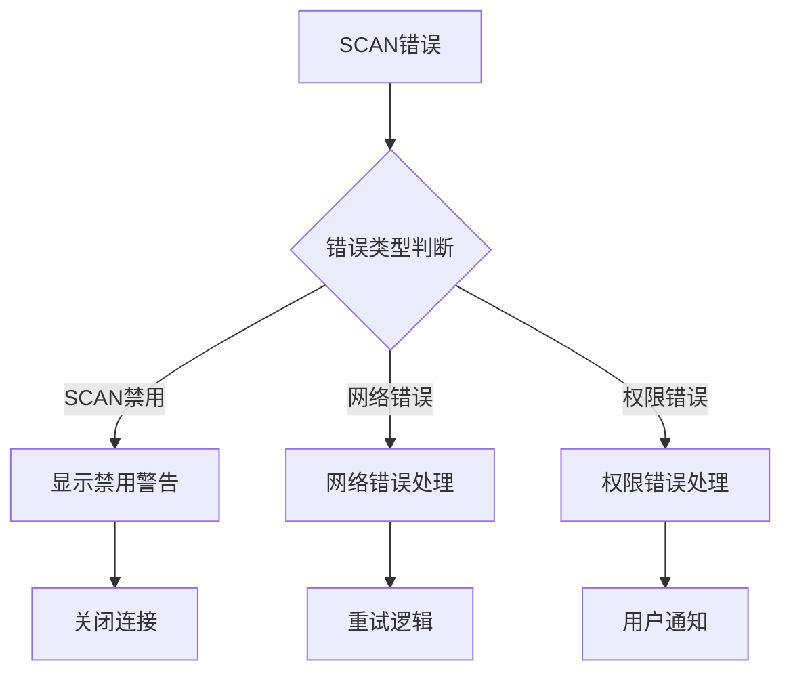

**图表来源**
- [KeyList.vue](file://src/components/KeyList.vue#L180-L203)

**章节来源**
- [KeyList.vue](file://src/components/KeyList.vue#L147-L212)

## 分页加载机制

### 分页策略对比

| 加载模式 | 适用场景 | 性能特点 | 用户体验 |
|----------|----------|----------|----------|
| 分页加载 | 大量键数据 | 内存友好，响应快 | 渐进式加载 |
| 全量加载 | 小规模数据 | 一次性加载，查询快 | 即时可用 |
| 精确匹配 | 已知键名 | 最优性能，确定性结果 | 立即反馈 |

### 页面大小配置

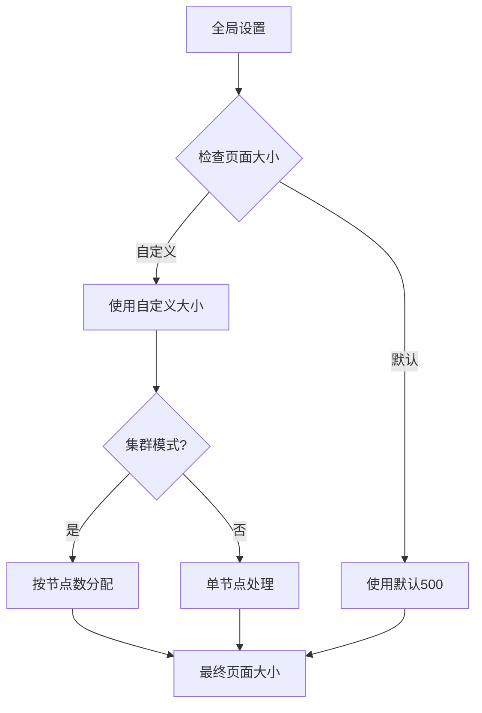

**图表来源**
- [KeyList.vue](file://src/components/KeyList.vue#L62-L78)

### 搜索模式处理

系统支持精确匹配和模糊匹配两种搜索模式：

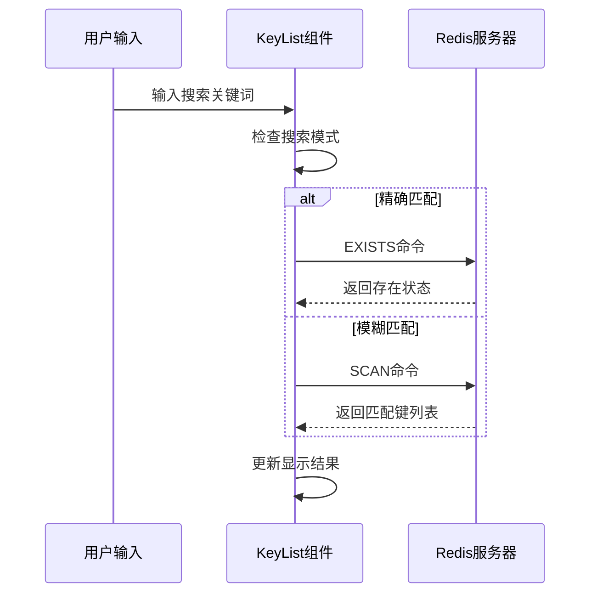

**图表来源**
- [KeyList.vue](file://src/components/KeyList.vue#L237-L247)
- [KeyList.vue](file://src/components/KeyList.vue#L120-L122)

**章节来源**
- [KeyList.vue](file://src/components/KeyList.vue#L62-L78)
- [KeyList.vue](file://src/components/KeyList.vue#L237-L247)

## 事件总线通信

### 事件总线架构

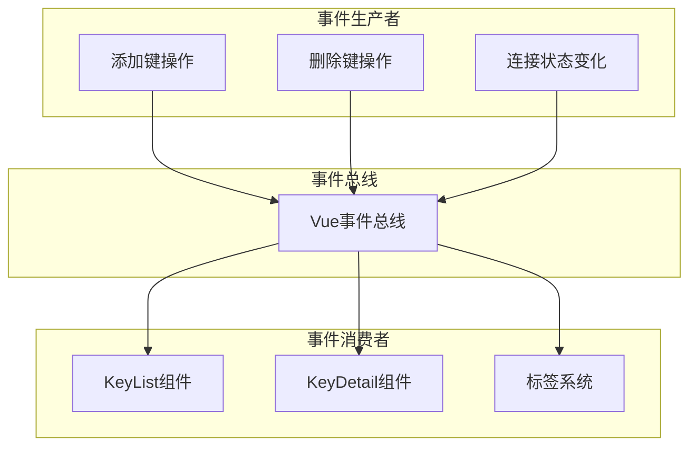

**图表来源**
- [bus.js](file://src/bus.js#L1-L19)
- [main.js](file://src/main.js#L16-L18)

### 关键事件类型

| 事件名称 | 触发时机 | 参数 | 用途 |
|----------|----------|------|------|
| refreshKeyList | 键状态变更 | client, key, type | 刷新键列表 |
| clickedKey | 键点击 | client, key, newTab | 打开键详情 |
| closeConnection | 连接断开 | - | 关闭连接 |
| memoryAnalysis | 内存分析 | client, pattern | 内存分析 |

### 连接状态响应

系统通过事件总线实时响应连接状态变化：

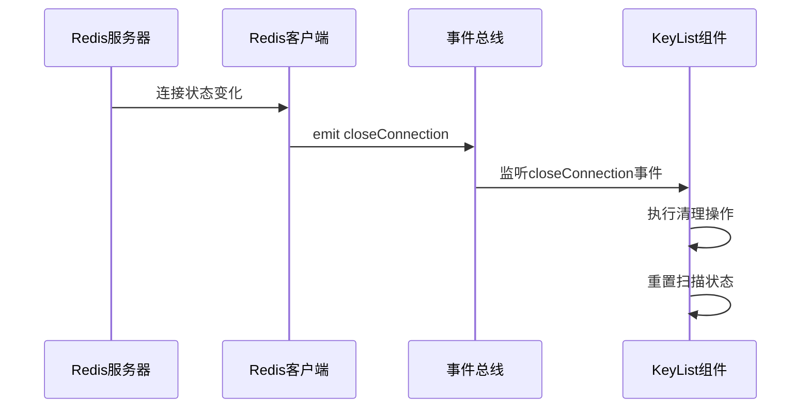

**图表来源**
- [KeyList.vue](file://src/components/KeyList.vue#L89-L103)
- [bus.js](file://src/bus.js#L16-L18)

**章节来源**
- [bus.js](file://src/bus.js#L1-L19)
- [KeyList.vue](file://src/components/KeyList.vue#L89-L103)

## 性能优化策略

### 内存管理

系统采用了多层次的内存优化策略：

| 优化层级 | 策略 | 效果 |
|----------|------|------|
| 数据结构 | 使用Buffer对象 | 减少字符串转换开销 |
| 渲染优化 | 虚拟滚动 | 控制DOM元素数量 |
| 缓存机制 | 展开状态缓存 | 避免重复计算 |
| 垃圾回收 | 及时清理流对象 | 防止内存泄漏 |

### 渲染性能

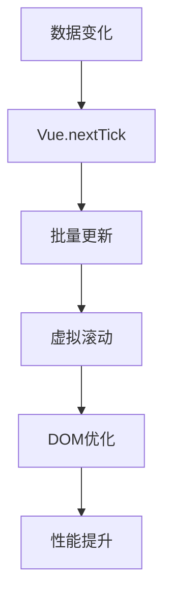

**图表来源**
- [KeyListVirtualTree.vue](file://src/components/KeyListVirtualTree.vue#L416-L426)

### 大数据量处理

对于超过阈值的大数据集，系统实现了智能截断和警告机制：

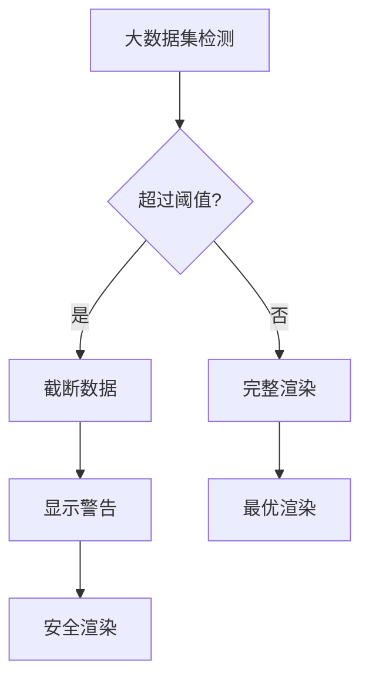

**图表来源**
- [KeyListVirtualTree.vue](file://src/components/KeyListVirtualTree.vue#L395-L404)

**章节来源**
- [KeyListVirtualTree.vue](file://src/components/KeyListVirtualTree.vue#L390-L427)

## 开发者指南

### 扩展新渲染策略

要添加新的键列表渲染策略，需要遵循以下步骤：

#### 1. 创建新组件

```javascript
// 新渲染组件示例结构
export default {
  name: 'CustomKeyList',
  props: ['client', 'config', 'keyList'],
  data() {
    return {
      // 组件特定状态
    };
  },
  methods: {
    // 自定义渲染逻辑
  }
};
```

#### 2. 修改KeyList.vue

在KeyList.vue中添加新的组件选择逻辑：

```javascript
computed: {
  keyListType() {
    // 添加新的选择条件
    if (this.config.useCustomRenderer) {
      return 'CustomKeyList';
    }
    return 'KeyListVirtualTree';
  }
}
```

#### 3. 实现数据转换

确保新组件能够正确处理传入的数据：

```javascript
watch: {
  keyList(newList) {
    // 实现自定义的数据处理逻辑
    this.processKeyList(newList);
  }
}
```

### 条件渲染实现细节

系统通过Vue的动态组件机制实现条件渲染：

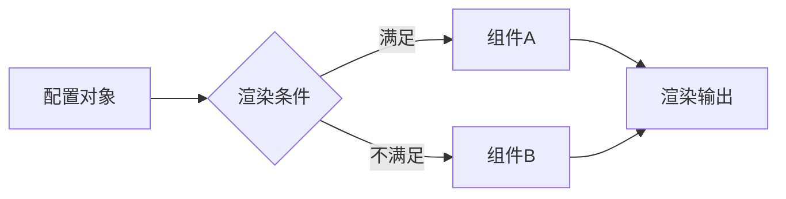

**图表来源**
- [KeyList.vue](file://src/components/KeyList.vue#L4-L10)

### 最佳实践

| 实践领域 | 建议 | 原因 |
|----------|------|------|
| 性能优化 | 使用虚拟滚动 | 处理大量数据 |
| 错误处理 | 实现全面的异常捕获 | 提升稳定性 |
| 代码组织 | 模块化设计 | 提高可维护性 |
| 测试覆盖 | 单元测试和集成测试 | 确保质量 |

**章节来源**
- [KeyList.vue](file://src/components/KeyList.vue#L4-L10)
- [KeyListVirtualTree.vue](file://src/components/KeyListVirtualTree.vue#L1-L50)

## 故障排除

### 常见问题及解决方案

| 问题类型 | 症状 | 可能原因 | 解决方案 |
|----------|------|----------|----------|
| 渲染卡顿 | 键列表加载缓慢 | 数据量过大 | 启用虚拟滚动 |
| 内存泄漏 | 应用内存持续增长 | 流对象未正确清理 | 检查流关闭逻辑 |
| 连接中断 | 键列表无法更新 | 网络或权限问题 | 重新建立连接 |
| 搜索失效 | 模糊匹配无结果 | SCAN命令被禁用 | 检查Redis配置 |

### 调试技巧

1. **使用Vue DevTools**：监控组件状态和数据流
2. **浏览器开发者工具**：检查网络请求和JavaScript错误
3. **日志记录**：在关键路径添加日志输出
4. **性能分析**：使用浏览器性能面板识别瓶颈

### 性能监控指标

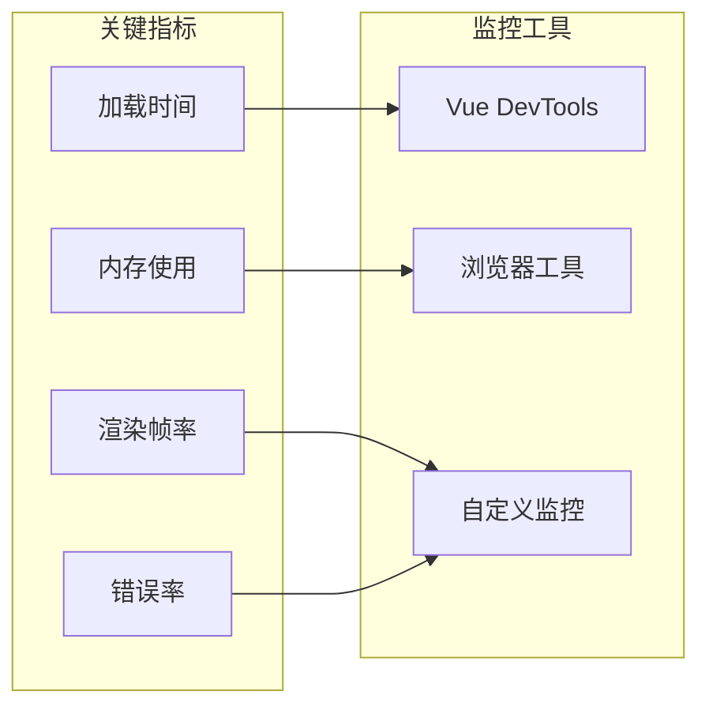

**章节来源**
- [KeyList.vue](file://src/components/KeyList.vue#L180-L203)
- [KeyListVirtualTree.vue](file://src/components/KeyListVirtualTree.vue#L395-L404)

## 结论

键列表渲染机制通过精心设计的架构和优化策略，成功实现了高性能、高可用的Redis键展示功能。系统的核心优势包括：

- **灵活的组件选择**：根据配置自动选择最适合的渲染方式
- **高效的分页处理**：利用Redis SCAN命令实现大数据量的渐进式加载
- **实时的状态同步**：通过事件总线确保界面与数据的一致性
- **完善的错误处理**：提供健壮的异常处理和恢复机制

这种设计不仅满足了当前的功能需求，还为未来的功能扩展奠定了坚实的基础。开发者可以通过遵循本文档提供的指导原则，轻松地扩展和定制键列表渲染功能，以适应不同的业务场景和技术要求。