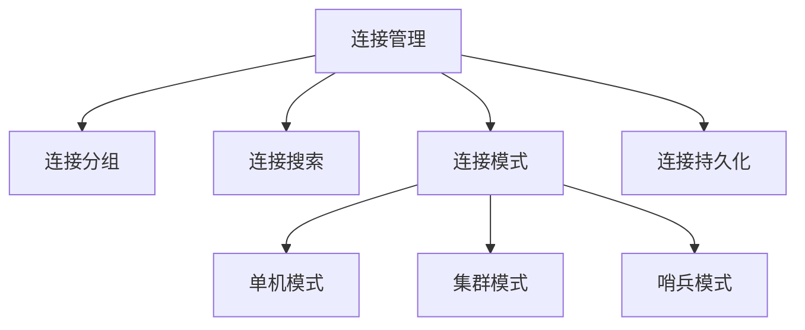
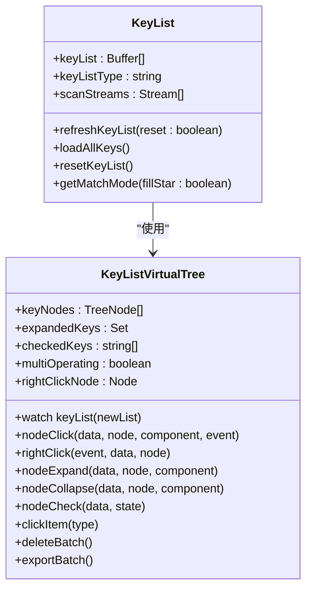
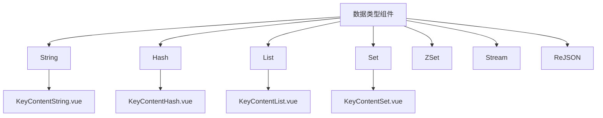

# 核心功能

<cite>
**本文档引用的文件**  
- [App.vue](file://src/App.vue)
- [main.js](file://src/main.js)
- [Connections.vue](file://src/components/Connections.vue)
- [KeyList.vue](file://src/components/KeyList.vue)
- [KeyListVirtualTree.vue](file://src/components/KeyListVirtualTree.vue)
- [KeyContentString.vue](file://src/components/contents/KeyContentString.vue)
- [KeyContentHash.vue](file://src/components/contents/KeyContentHash.vue)
- [KeyContentList.vue](file://src/components/contents/KeyContentList.vue)
- [KeyContentSet.vue](file://src/components/contents/KeyContentSet.vue)
- [redisClient.js](file://src/redisClient.js)
</cite>

## 目录
1. [简介](#简介)
2. [连接管理](#连接管理)
3. [键列表与虚拟滚动](#键列表与虚拟滚动)
4. [数据类型查看与编辑](#数据类型查看与编辑)
5. [数据查看器](#数据查看器)
6. [操作工作流](#操作工作流)

## 简介

Another Redis Desktop Manager 是一款功能强大的 Redis 图形化管理工具，支持单机、集群和哨兵模式的连接管理。本系统提供直观的用户界面，支持多语言，并具备高效的数据浏览与操作能力。核心功能包括连接管理、键列表的虚拟滚动展示、多种数据类型的查看与编辑，以及丰富的数据查看器支持。

**Section sources**
- [App.vue](file://src/App.vue#L1-L576)
- [main.js](file://src/main.js#L1-L47)

## 连接管理

Another Redis Desktop Manager 支持管理单机、集群和哨兵模式的 Redis 连接。用户可以通过左侧导航栏的"我的连接"图标进入连接管理界面。系统支持连接分组管理，用户可以创建自定义分组并为分组设置图标和颜色标记。

连接管理功能通过 `Connections.vue` 组件实现，该组件支持连接搜索过滤，当连接数量达到一定阈值时会显示搜索输入框。用户可以通过右键菜单或界面按钮添加新的连接分组，分组信息包括名称、颜色和自定义图标。系统使用 `storage.js` 进行连接和分组信息的持久化存储。

对于不同模式的 Redis 连接，系统通过 `redisClient.js` 创建相应的客户端实例。单机模式使用标准 Redis 客户端，集群模式使用 Redis Cluster 客户端，哨兵模式则通过哨兵机制发现主节点并建立连接。

**Diagram sources**
- [Connections.vue](file://src/components/Connections.vue#L1-L326)
- [redisClient.js](file://src/redisClient.js)

**Section sources**
- [Connections.vue](file://src/components/Connections.vue#L1-L326)

## 键列表与虚拟滚动

键列表功能是 Another Redis Desktop Manager 的核心浏览功能，通过 `KeyList.vue` 和 `KeyListVirtualTree.vue` 组件实现。系统采用虚拟滚动技术（Virtual Tree）来高效展示大量键，避免了传统列表在大数据量下的性能问题。

`KeyList.vue` 组件作为容器，根据配置决定使用哪种键列表展示方式，默认使用 `KeyListVirtualTree`。该组件支持分页加载和全量加载两种模式，用户可以通过"加载更多"按钮逐步加载键，或通过"加载全部"按钮一次性加载所有键。对于集群模式，系统会根据主节点数量自动调整每页的键数量。

`KeyListVirtualTree.vue` 组件实现了树形结构的键展示，支持使用分隔符（如冒号）将键名解析为树形结构。例如，键名 "user:profile:name" 会被解析为 user > profile > name 的层级结构。组件支持多选操作、右键菜单、批量删除和导出功能。当键数量超过预设阈值时，系统会显示警告信息。

键列表支持搜索过滤功能，用户可以在搜索框中输入关键词，系统会使用 Redis 的 SCAN 命令进行模式匹配。对于精确搜索，系统使用 EXISTS 命令进行快速验证。虚拟滚动技术确保了即使在数百万个键的情况下，界面也能保持流畅响应。

**Diagram sources**
- [KeyList.vue](file://src/components/KeyList.vue#L1-L350)
- [KeyListVirtualTree.vue](file://src/components/KeyListVirtualTree.vue#L1-L623)

**Section sources**
- [KeyList.vue](file://src/components/KeyList.vue#L1-L350)
- [KeyListVirtualTree.vue](file://src/components/KeyListVirtualTree.vue#L1-L623)

## 数据类型查看与编辑

Another Redis Desktop Manager 为不同的 Redis 数据类型提供了专门的查看和编辑组件，所有组件均位于 `src/components/contents/` 目录下。每个组件都实现了统一的接口，确保用户体验的一致性。

### String 类型

`KeyContentString.vue` 组件用于查看和编辑 String 类型的键值。组件使用 `FormatViewer` 子组件来展示内容，支持多种格式化选项。用户可以直接在编辑器中修改字符串内容，并通过"保存"按钮将更改持久化到 Redis 服务器。保存操作会触发 SET 命令，并根据需要设置 TTL（生存时间）。

### Hash 类型

`KeyContentHash.vue` 组件用于管理 Hash 类型的数据。组件以表格形式展示 Hash 的字段和值，支持分页加载和搜索过滤。用户可以添加新字段、编辑现有字段或删除字段。对于 Redis 7.4 及以上版本，组件还支持为 Hash 字段设置独立的 TTL。编辑操作使用 HSET 命令，删除操作使用 HDEL 命令。

### List 类型

`KeyContentList.vue` 组件用于处理 List 类型的数据。与 Hash 组件类似，它也以表格形式展示 List 的元素。用户可以向 List 末尾添加新元素（RPUSH），或编辑现有元素。由于 List 元素没有键名，编辑操作通过 LINSERT 和 LREM 命令组合实现：先在原元素后插入新值，然后删除原元素。

### Set 类型

`KeyContentSet.vue` 组件用于管理 Set 类型的数据。组件以表格形式展示 Set 的所有成员。用户可以添加新成员或删除现有成员。添加操作使用 SADD 命令，如果成员已存在则会收到提示。删除操作使用 SREM 命令。由于 Set 是无序集合，表格中的顺序仅用于展示。

**Diagram sources**
- [KeyContentString.vue](file://src/components/contents/KeyContentString.vue#L1-L104)
- [KeyContentHash.vue](file://src/components/contents/KeyContentHash.vue#L1-L334)
- [KeyContentList.vue](file://src/components/contents/KeyContentList.vue#L1-L296)
- [KeyContentSet.vue](file://src/components/contents/KeyContentSet.vue#L1-L284)

**Section sources**
- [KeyContentString.vue](file://src/components/contents/KeyContentString.vue#L1-L104)
- [KeyContentHash.vue](file://src/components/contents/KeyContentHash.vue#L1-L334)
- [KeyContentList.vue](file://src/components/contents/KeyContentList.vue#L1-L296)
- [KeyContentSet.vue](file://src/components/contents/KeyContentSet.vue#L1-L284)

## 数据查看器

Another Redis Desktop Manager 提供了多种数据查看器来处理不同格式的数据，这些查看器位于 `src/components/viewers/` 目录下。`FormatViewer.vue` 组件作为统一的入口，根据数据内容自动选择合适的查看器。

系统内置了多种查看器，包括 `ViewerJson.vue` 用于 JSON 数据的格式化展示和编辑，`ViewerText.vue` 用于纯文本数据的展示，`ViewerBinary.vue` 用于二进制数据的展示。此外，还有专门的查看器用于压缩数据（如 Gzip、Brotli）、序列化数据（如 Java Serialize、PHP Serialize）和特殊格式（如 Protobuf、Msgpack）。

`ViewerJson.vue` 是最常用的查看器，它提供了语法高亮、错误检测和格式化功能。当用户编辑 JSON 数据时，查看器会实时验证语法正确性，确保保存到 Redis 的数据是有效的 JSON。`ViewerText.vue` 支持大文本的高效展示，避免了长文本导致的界面卡顿。

查看器系统的设计允许轻松扩展，开发者可以添加新的查看器组件来支持更多数据格式。这种插件化的架构使得 Another Redis Desktop Manager 能够适应各种使用场景。

**Section sources**
- [FormatViewer.vue](file://src/components/FormatViewer.vue)
- [ViewerJson.vue](file://src/components/viewers/ViewerJson.vue)
- [ViewerText.vue](file://src/components/viewers/ViewerText.vue)
- [ViewerBinary.vue](file://src/components/viewers/ViewerBinary.vue)

## 操作工作流

Another Redis Desktop Manager 提供了从基础浏览到高级操作的完整工作流。用户首先通过连接管理界面建立与 Redis 服务器的连接，然后选择要操作的数据库。在键列表中，用户可以通过搜索或浏览找到目标键。

点击键名后，系统会根据键的类型自动选择相应的 `KeyContent` 组件来展示数据。对于 String 类型，用户可以直接编辑内容并保存。对于复合类型如 Hash、List、Set，用户可以在表格中进行增删改操作。

所有数据操作都会生成相应的 Redis 命令并执行，操作结果会实时反映在界面上。系统通过事件总线（`$bus`）协调各组件之间的通信，例如当删除一个键时，`KeyList` 组件会收到通知并从列表中移除该键。

高级功能包括批量操作、数据导出和内存分析。用户可以通过多选模式选择多个键进行批量删除或导出。导出功能将键的 DUMP 和 PTTL 结果保存为 CSV 文件，便于数据迁移和备份。内存分析功能可以帮助用户识别占用内存较大的键模式。

**Section sources**
- [App.vue](file://src/App.vue#L1-L576)
- [KeyList.vue](file://src/components/KeyList.vue#L1-L350)
- [KeyContentString.vue](file://src/components/contents/KeyContentString.vue#L1-L104)
- [bus.js](file://src/bus.js)