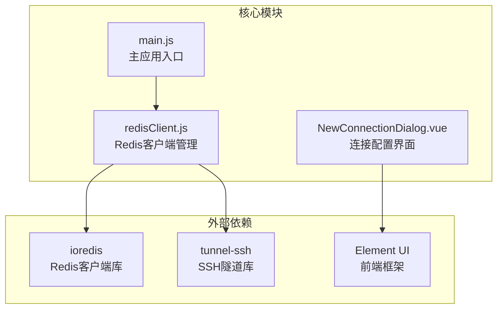
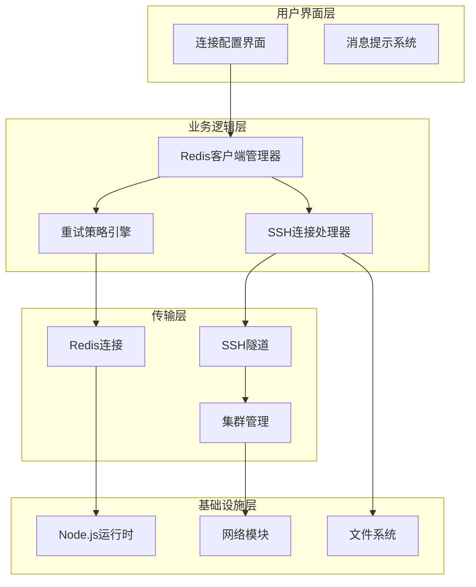
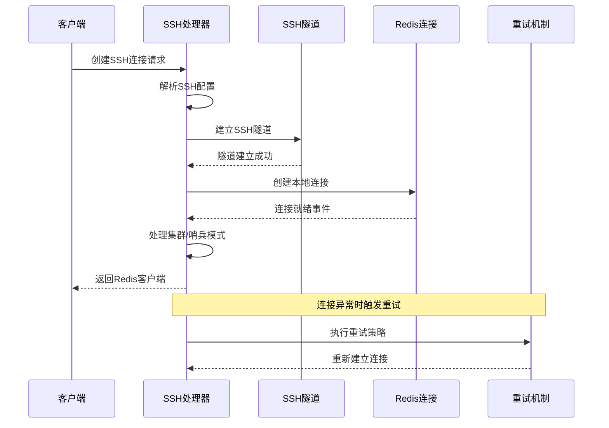
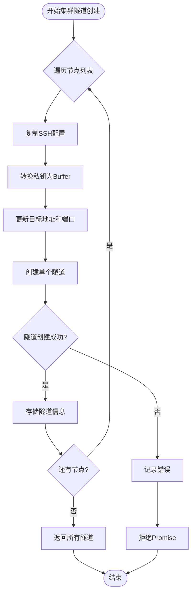
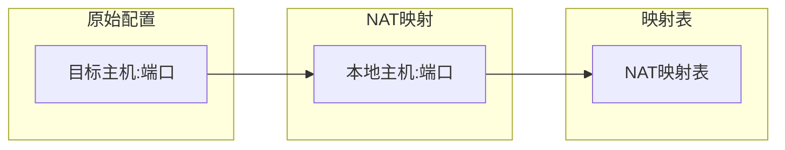
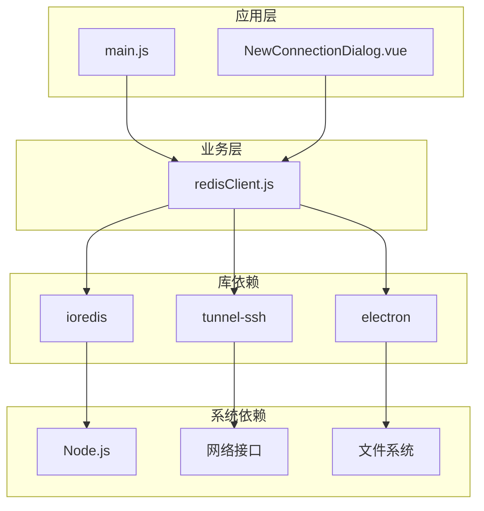

# SSH连接稳定性优化

<cite>
**本文档引用的文件**
- [redisClient.js](file://src/redisClient.js)
- [main.js](file://src/main.js)
- [NewConnectionDialog.vue](file://src/components/NewConnectionDialog.vue)
</cite>

## 目录
1. [引言](#引言)
2. [项目结构概览](#项目结构概览)
3. [核心组件分析](#核心组件分析)
4. [架构概览](#架构概览)
5. [详细组件分析](#详细组件分析)
6. [依赖关系分析](#依赖关系分析)
7. [性能考虑](#性能考虑)
8. [故障排除指南](#故障排除指南)
9. [结论](#结论)

## 引言

本文档深入分析了Another Redis Desktop Manager中SSH连接的稳定性保障机制，重点解析`redisClient.js`中`createSSHConnection`方法的连接生命周期管理，包括连接建立、保持和重连策略。通过详细说明关键配置参数如`keepaliveInterval`（10秒）和`readyTimeout`的作用原理，以及集群模式下的多隧道管理和NAT映射机制，为开发者提供全面的SSH连接稳定性优化指导。

## 项目结构概览

该项目采用模块化的JavaScript架构，主要包含以下核心文件：



**图表来源**
- [redisClient.js](file://src/redisClient.js#L1-L10)
- [main.js](file://src/main.js#L1-L47)

**章节来源**
- [redisClient.js](file://src/redisClient.js#L1-L381)
- [main.js](file://src/main.js#L1-L47)

## 核心组件分析

### SSH连接生命周期管理

SSH连接的稳定性保障主要体现在以下几个方面：

1. **连接建立阶段**：通过`createSSHConnection`方法实现
2. **连接保持机制**：利用`keepaliveInterval`维持连接活跃
3. **异常重连策略**：基于`retryStrategy`的智能重试
4. **集群隧道管理**：批量建立和管理多个SSH隧道

### 关键配置参数

| 参数名称 | 默认值 | 配置位置 | 影响范围 |
|---------|--------|----------|----------|
| keepaliveInterval | 10000ms | SSH选项 | 连接保活 |
| readyTimeout | 30000ms | SSH选项 | 连接准备超时 |
| connectTimeout | 30000ms | Redis选项 | 建立连接超时 |
| retryStrategy | 指数退避 | 自定义函数 | 重连策略 |

**章节来源**
- [redisClient.js](file://src/redisClient.js#L185-L187)
- [redisClient.js](file://src/redisClient.js#L210-L211)

## 架构概览

SSH连接稳定性架构采用分层设计，确保各层次职责明确：



**图表来源**
- [redisClient.js](file://src/redisClient.js#L51-L164)
- [main.js](file://src/main.js#L16-L20)

## 详细组件分析

### createSSHConnection方法深度解析

`createSSHConnection`是SSH连接稳定性的核心方法，实现了完整的连接生命周期管理：



**图表来源**
- [redisClient.js](file://src/redisClient.js#L90-L164)

#### 连接建立流程

1. **配置解析阶段**：使用`getSSHOptions`方法构建SSH连接参数
2. **隧道建立阶段**：通过`tunnel-ssh`库创建SSH隧道
3. **连接类型判断**：根据配置自动识别单机、集群或哨兵模式
4. **本地连接创建**：在隧道基础上创建本地Redis连接

#### keepaliveInterval配置原理

`keepaliveInterval`参数设置为10秒，具有以下重要作用：

- **网络中断检测**：定期发送keepalive包检测网络状态
- **防火墙穿透**：避免中间设备因长时间无数据而断开连接
- **资源占用平衡**：10秒间隔在稳定性和资源消耗间取得平衡

#### readyTimeout配置影响

`readyTimeout`设置为30秒，确保：
- **连接稳定性**：给予足够时间完成SSH认证和隧道建立
- **用户体验**：避免过短超时导致的误报失败
- **网络适应性**：适应不同网络环境的延迟差异

**章节来源**
- [redisClient.js](file://src/redisClient.js#L90-L164)
- [redisClient.js](file://src/redisClient.js#L166-L200)

### createClusterSSHTunnels方法分析

该方法负责在集群模式下批量建立SSH隧道，实现高可用性连接：



**图表来源**
- [redisClient.js](file://src/redisClient.js#L277-L313)

#### 并发隧道管理

该方法采用并发方式创建多个SSH隧道，提高效率的同时保证稳定性：

- **独立配置**：每个节点使用独立的SSH配置副本
- **异步处理**：使用Promise.all实现并行隧道创建
- **错误隔离**：单个隧道失败不影响其他节点

#### initNatMap机制详解

`initNatMap`方法建立地址映射关系，支持复杂的网络环境：



**图表来源**
- [redisClient.js](file://src/redisClient.js#L315-L323)

**章节来源**
- [redisClient.js](file://src/redisClient.js#L277-L323)

### retryStrategy智能重试机制

重试策略实现了指数退避算法，最大重试3次：

```mermaid
flowchart TD
START([连接失败]) --> COUNT{重试次数检查}
COUNT --> |< 3次| CALC[计算重试间隔]
CALC --> BACKOFF[指数退避: min(times*200, 1000)]
BACKOFF --> WAIT[等待重试]
WAIT --> RETRY[重新尝试连接]
RETRY --> SUCCESS{连接成功?}
SUCCESS --> |是| RETURN[返回连接]
SUCCESS --> |否| COUNT
COUNT --> |>= 3次| ERROR[显示错误信息]
ERROR --> CLOSE[关闭连接]
RETURN --> END([结束])
CLOSE --> END
```

**图表来源**
- [redisClient.js](file://src/redisClient.js#L344-L355)

#### 重试策略特点

1. **指数退避**：每次重试间隔逐渐增加，避免频繁重试
2. **最大限制**：最多重试3次，防止无限循环
3. **用户反馈**：提供清晰的错误信息和状态提示
4. **优雅降级**：达到最大重试次数后安全退出

**章节来源**
- [redisClient.js](file://src/redisClient.js#L344-L355)

## 依赖关系分析

### 核心依赖图



**图表来源**
- [redisClient.js](file://src/redisClient.js#L1-L10)
- [main.js](file://src/main.js#L1-L10)

### 外部库集成

1. **ioredis**：提供高性能的Redis客户端功能
2. **tunnel-ssh**：实现SSH隧道的建立和管理
3. **electron**：提供跨平台桌面应用支持

**章节来源**
- [redisClient.js](file://src/redisClient.js#L1-L10)

## 性能考虑

### 连接池优化

虽然当前实现未显式使用连接池，但通过以下机制间接实现性能优化：

- **连接复用**：同一SSH隧道可支持多个Redis连接
- **并发控制**：合理设置超时参数避免资源浪费
- **内存管理**：及时清理断开的连接和隧道

### 网络优化策略

1. **keepalive机制**：减少网络中断导致的连接丢失
2. **超时配置**：平衡响应时间和资源占用
3. **错误处理**：快速失败和优雅降级

### 资源释放最佳实践

- **自动关闭**：`autoClose: false`确保连接可控
- **错误监听**：及时发现和处理连接异常
- **状态监控**：实时跟踪连接状态变化

## 故障排除指南

### 常见问题及解决方案

#### SSH连接失败

**症状**：无法建立SSH隧道
**原因分析**：
- 网络连接问题
- 认证凭据错误
- SSH服务不可用

**解决步骤**：
1. 检查网络连通性
2. 验证SSH凭据
3. 确认SSH服务状态

#### 连接超时问题

**症状**：连接建立过程卡住
**原因分析**：
- 网络延迟过高
- 服务器负载过大
- 防火墙阻断

**解决步骤**：
1. 增加超时时间配置
2. 检查网络质量
3. 调整防火墙规则

#### 集群节点连接失败

**症状**：集群模式下部分节点无法连接
**原因分析**：
- NAT映射配置错误
- 网络隔离问题
- 权限不足

**解决步骤**：
1. 验证NAT映射表
2. 检查网络可达性
3. 确认访问权限

**章节来源**
- [redisClient.js](file://src/redisClient.js#L155-L160)
- [redisClient.js](file://src/redisClient.js#L344-L355)

## 结论

Another Redis Desktop Manager的SSH连接稳定性机制通过多层次的设计实现了可靠的连接管理：

1. **完善的生命周期管理**：从连接建立到异常处理的全流程覆盖
2. **智能重试策略**：基于指数退避的最大3次重试机制
3. **高效的集群支持**：批量隧道管理和NAT映射优化
4. **灵活的配置选项**：可调的超时和保活参数

这些特性共同构成了一个健壮的SSH连接解决方案，能够适应各种复杂的网络环境和使用场景。对于需要部署类似系统的开发者，建议参考这些设计原则，并根据具体需求调整相关参数配置。