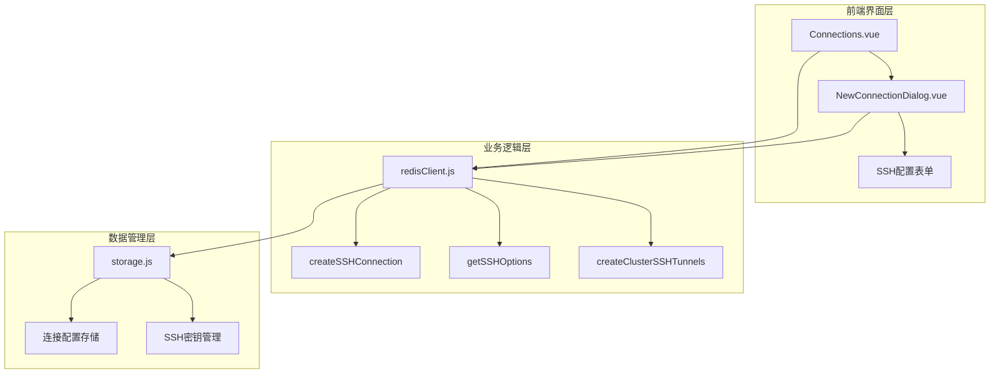
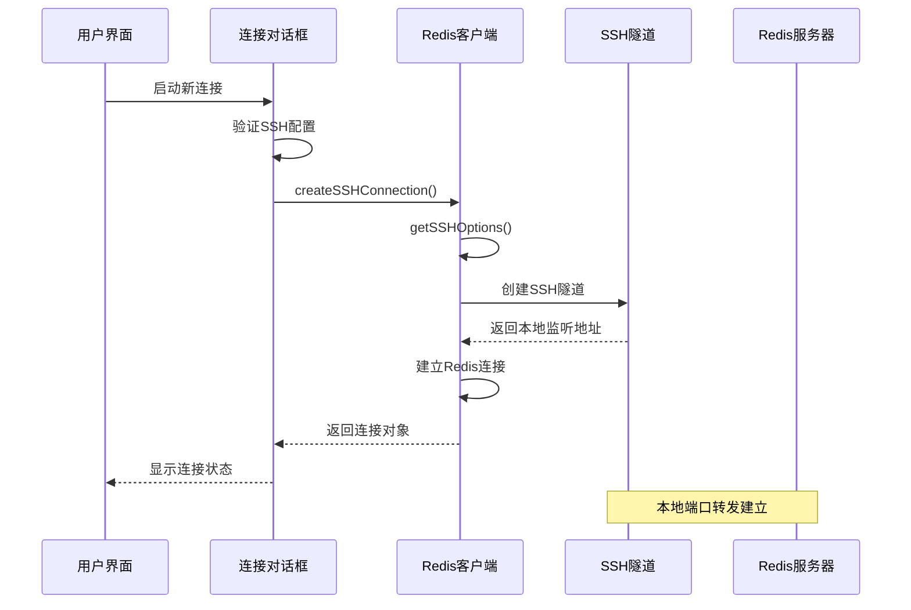
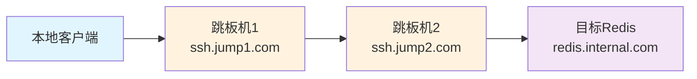
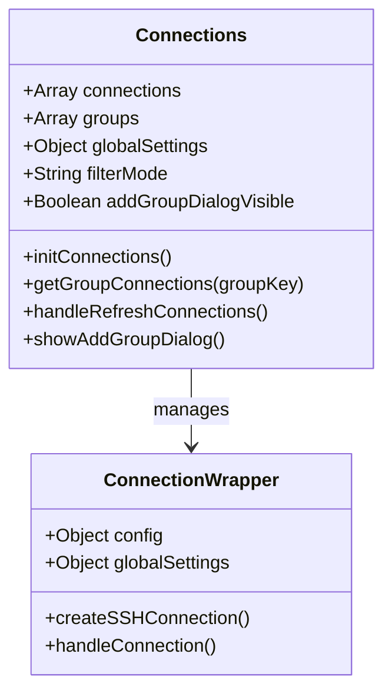
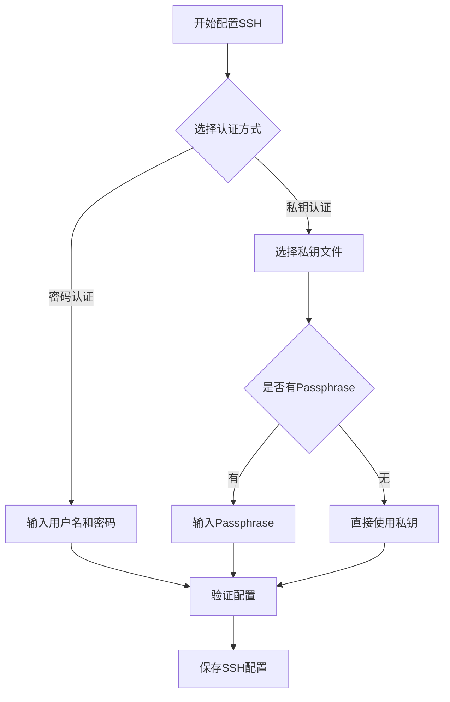
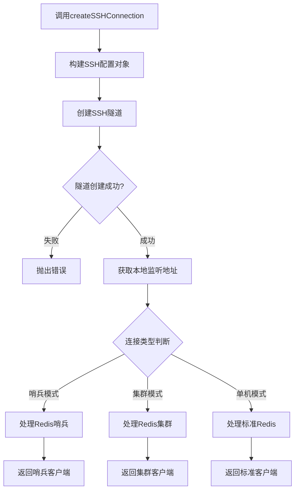
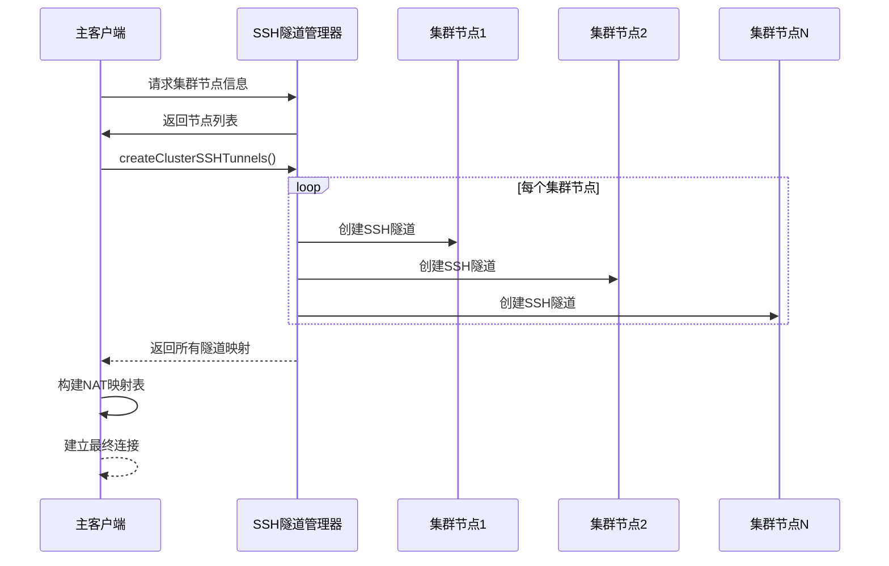
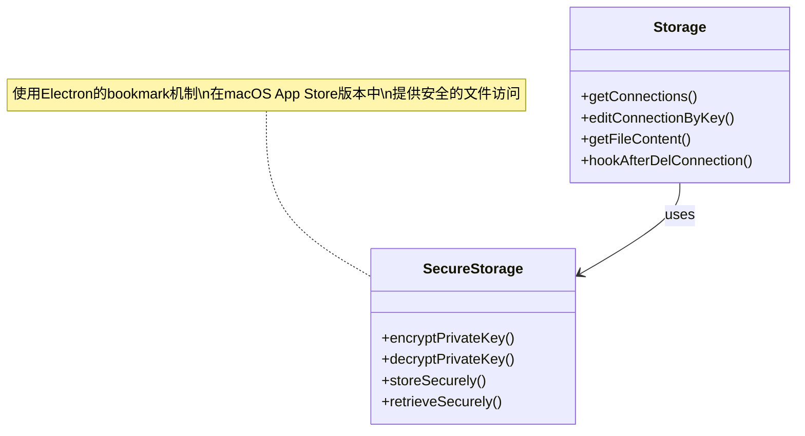
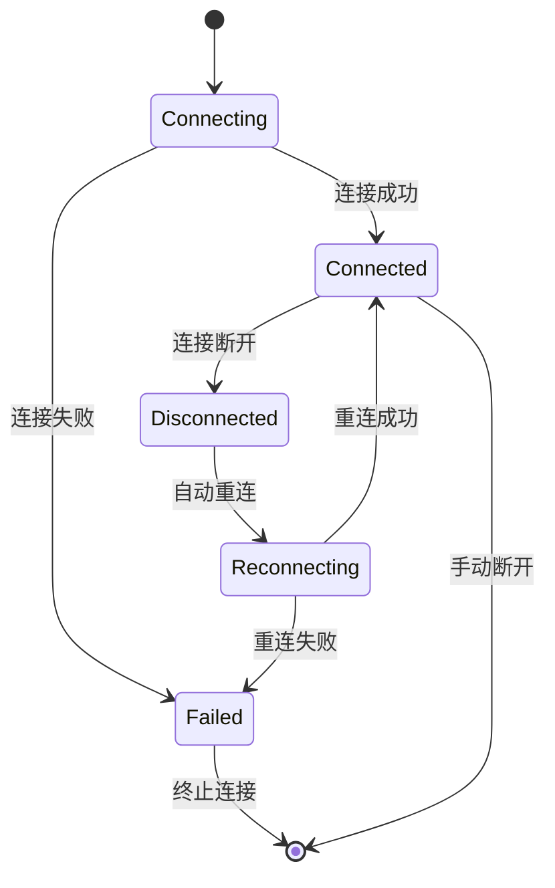

# SSH隧道连接

<cite>
**本文档引用的文件**
- [redisClient.js](file://src/redisClient.js)
- [storage.js](file://src/storage.js)
- [Connections.vue](file://src/components/Connections.vue)
- [NewConnectionDialog.vue](file://src/components/NewConnectionDialog.vue)
- [util.js](file://src/util.js)
</cite>

## 目录
1. [简介](#简介)
2. [项目结构概览](#项目结构概览)
3. [核心组件分析](#核心组件分析)
4. [SSH连接架构](#ssh连接架构)
5. [详细组件分析](#详细组件分析)
6. [实际应用案例](#实际应用案例)
7. [性能优化与故障排除](#性能优化与故障排除)
8. [总结](#总结)

## 简介

Another Redis Desktop Manager (ARDM) 提供了强大的SSH隧道连接功能，允许用户安全地访问位于内网或受保护网络环境中的Redis服务。该功能通过集成`tunnel-ssh`库实现了本地端口转发，支持多种认证方式（密码和私钥），并提供了完整的连接生命周期管理。

SSH隧道连接功能的核心价值在于：
- **安全性**：通过SSH加密通道保护Redis通信
- **灵活性**：支持跳板机、代理服务器等多种网络拓扑
- **易用性**：提供直观的图形界面配置SSH连接参数
- **可靠性**：内置重连机制和错误处理

## 项目结构概览

SSH隧道连接功能主要分布在以下关键模块中：



**图表来源**
- [Connections.vue](file://src/components/Connections.vue#L1-L326)
- [NewConnectionDialog.vue](file://src/components/NewConnectionDialog.vue#L1-L772)
- [redisClient.js](file://src/redisClient.js#L1-L381)
- [storage.js](file://src/storage.js#L1-L329)

## 核心组件分析

### SSH连接创建流程

SSH隧道连接的创建遵循严格的流程控制，确保每个步骤都得到正确处理：



**图表来源**
- [redisClient.js](file://src/redisClient.js#L90-L163)
- [NewConnectionDialog.vue](file://src/components/NewConnectionDialog.vue#L180-L438)

### SSH配置对象构建

`getSSHOptions`方法负责构建SSH连接所需的配置对象，该对象包含四个关键部分：

| 配置项 | 类型 | 描述 | 默认值 |
|--------|------|------|--------|
| tunnelOptions | Object | 隧道行为控制 | `{autoClose: false}` |
| serverOptions | Object | 本地TCP服务器配置 | 动态分配端口 |
| sshOptions | Object | SSH服务器连接参数 | 包含主机、端口、认证信息 |
| forwardOptions | Object | 端口转发配置 | 目标主机和端口 |

**节来源**
- [redisClient.js](file://src/redisClient.js#L166-L200)

## SSH连接架构

### 认证方式支持

系统支持两种主要的SSH认证方式：

#### 密码认证
```javascript
// 密码认证配置示例
{
  host: 'ssh.example.com',
  port: 22,
  username: 'admin',
  password: 'secure_password',
  privateKey: undefined,
  passphrase: undefined
}
```

#### 私钥认证
```javascript
// 私钥认证配置示例
{
  host: 'ssh.example.com',
  port: 22,
  username: 'admin',
  password: undefined,
  privateKey: Buffer.from(privateKeyContent),
  passphrase: 'key_passphrase'
}
```

### 跳板机配置

对于复杂的网络环境，系统支持多级跳板机配置：



**图表来源**
- [redisClient.js](file://src/redisClient.js#L277-L312)

## 详细组件分析

### Connections.vue - 连接管理界面

Connections组件提供了SSH连接的统一管理界面，支持：

- **连接列表展示**：显示所有已保存的SSH连接
- **分组管理**：按组织结构对连接进行分类
- **快速连接**：双击连接即可建立SSH隧道
- **编辑功能**：修改现有连接的SSH配置



**图表来源**
- [Connections.vue](file://src/components/Connections.vue#L100-L262)

**节来源**
- [Connections.vue](file://src/components/Connections.vue#L1-L326)

### NewConnectionDialog.vue - SSH配置表单

连接对话框是SSH配置的主要入口点，提供了丰富的配置选项：

#### SSH配置字段详解

| 字段名称 | 类型 | 必填 | 描述 | 示例值 |
|----------|------|------|------|--------|
| SSH主机 | String | 是 | SSH服务器地址 | `ssh.example.com` |
| SSH端口 | Number | 是 | SSH服务端口 | `22` |
| 登录类型 | String | 是 | 认证方式选择 | `password` 或 `privatekey` |
| 用户名 | String | 是 | SSH登录用户名 | `admin` |
| 密码 | Password | 可选 | 密码认证 | `secure123` |
| 私钥文件 | File | 可选 | RSA/DSA私钥文件 | `/path/to/private.key` |
| Passphrase | Password | 可选 | 私钥解密密码 | `key_passphrase` |
| 超时设置 | Number | 否 | 连接超时时间（秒） | `30` |

#### 认证方式切换逻辑



**图表来源**
- [NewConnectionDialog.vue](file://src/components/NewConnectionDialog.vue#L195-L221)

**节来源**
- [NewConnectionDialog.vue](file://src/components/NewConnectionDialog.vue#L1-L772)

### redisClient.js - SSH连接核心逻辑

#### createSSHConnection方法实现

这是SSH隧道连接的核心方法，负责协调整个连接过程：



**图表来源**
- [redisClient.js](file://src/redisClient.js#L90-L163)

#### 集群SSH隧道管理

对于Redis集群，系统需要为每个节点创建独立的SSH隧道：



**图表来源**
- [redisClient.js](file://src/redisClient.js#L277-L312)

**节来源**
- [redisClient.js](file://src/redisClient.js#L90-L381)

### storage.js - 安全存储机制

#### SSH密钥加密存储

系统采用安全的存储机制来保护敏感的SSH信息：



**图表来源**
- [storage.js](file://src/storage.js#L1-L329)

#### 连接配置关联关系

SSH连接与Redis连接之间建立了明确的关联关系：

| 关联类型 | 存储位置 | 数据结构 | 示例 |
|----------|----------|----------|------|
| SSH配置 | localStorage | `sshOptions` | `{host:'ssh.com',port:22}` |
| Redis连接 | localStorage | `connections` | `{name:'Redis Prod',host:'127.0.0.1'}` |
| 认证信息 | 加密存储 | `privatekey`, `password` | Base64编码的密钥数据 |
| 连接状态 | 内存缓存 | `connectionStatus` | `connected`, `disconnected` |

**节来源**
- [storage.js](file://src/storage.js#L1-L329)

## 实际应用案例

### 案例1：Docker容器内Redis访问

**场景描述**：开发环境中的Docker容器运行Redis服务，需要通过SSH隧道安全访问。

**配置步骤**：
1. 在宿主机上配置SSH访问权限
2. 设置SSH隧道到Docker容器内部IP
3. 使用私钥认证确保安全性

**配置示例**：
```javascript
// SSH配置
{
  host: 'localhost',
  port: 2222,
  username: 'docker',
  privateKey: '/home/user/.ssh/docker_rsa',
  passphrase: ''
}

// Redis配置
{
  host: '172.17.0.2',  // Docker容器IP
  port: 6379,
  auth: 'redis_password'
}
```

### 案例2：局域网设备Redis访问

**场景描述**：公司内网中的Redis服务器，需要通过跳板机访问。

**网络拓扑**：
```
外部网络 -> 跳板机 -> 内网Redis服务器
```

**配置要点**：
- 跳板机作为SSH代理
- 内网Redis服务器的防火墙配置
- 私钥认证的安全性保障

### 案例3：云服务器（AWS/Azure）Redis实例

**场景描述**：云环境中托管的Redis实例，仅开放SSH访问。

**最佳实践**：
1. 使用IAM角色而非密码认证
2. 配置安全组规则限制SSH访问
3. 定期轮换私钥和Passphrase

**节来源**
- [NewConnectionDialog.vue](file://src/components/NewConnectionDialog.vue#L180-L221)

## 性能优化与故障排除

### SSH连接生命周期管理

#### 连接建立阶段
- **超时控制**：默认30秒连接超时，可配置
- **重试机制**：最多3次重试，间隔递增
- **Keep-Alive**：每10秒发送心跳包保持连接活跃

#### 连接维护阶段
- **健康检查**：定期检测隧道状态
- **自动重连**：连接断开时自动尝试恢复
- **资源清理**：及时释放不再使用的隧道资源

### 异常断开与重连策略



**图表来源**
- [redisClient.js](file://src/redisClient.js#L344-L355)

### 隧道稳定性优化

#### 性能监控指标
- **延迟测量**：记录SSH隧道的响应时间
- **带宽利用率**：监控网络传输效率
- **错误率统计**：跟踪连接失败频率

#### 优化建议
1. **合理设置Keep-Alive间隔**：避免频繁的心跳包影响性能
2. **启用压缩传输**：减少网络带宽占用
3. **使用持久连接**：避免频繁建立和销毁隧道

### 常见问题诊断

| 问题类型 | 症状 | 可能原因 | 解决方案 |
|----------|------|----------|----------|
| 连接超时 | 无法建立SSH隧道 | 网络不通、防火墙阻拦 | 检查网络连通性、调整防火墙规则 |
| 认证失败 | SSH登录被拒绝 | 用户名密码错误、私钥损坏 | 验证认证凭据、重新生成密钥 |
| 隧道中断 | 连接突然断开 | 网络不稳定、服务器重启 | 启用自动重连、增加Keep-Alive |
| 性能下降 | 查询响应缓慢 | 网络延迟高、隧道配置不当 | 优化网络路径、调整隧道参数 |

**节来源**
- [redisClient.js](file://src/redisClient.js#L344-L381)

## 总结

Another Redis Desktop Manager的SSH隧道连接功能是一个设计精良、功能完备的企业级解决方案。它不仅提供了强大的网络访问能力，还通过完善的安全机制和用户体验设计，确保了系统的可靠性和易用性。

### 核心优势

1. **安全性**：支持多种认证方式，私钥加密存储
2. **灵活性**：适应各种网络拓扑和部署环境
3. **可靠性**：完善的错误处理和重连机制
4. **易用性**：直观的图形界面和详细的配置指导

### 技术特色

- **模块化设计**：清晰的职责分离和接口定义
- **异步处理**：Promise-based的异步操作模型
- **资源管理**：智能的连接池和资源回收机制
- **扩展性**：支持未来功能的平滑扩展

### 应用价值

SSH隧道连接功能为企业用户提供了一种安全、可靠的Redis数据库访问方式，特别适用于：
- 内网环境中的数据库管理
- 云服务提供商的数据库访问
- 开发测试环境的隔离访问
- 多租户环境下的资源隔离

通过深入理解和正确使用这一功能，用户可以显著提升Redis数据库的管理效率和安全性，同时降低网络架构的复杂度。