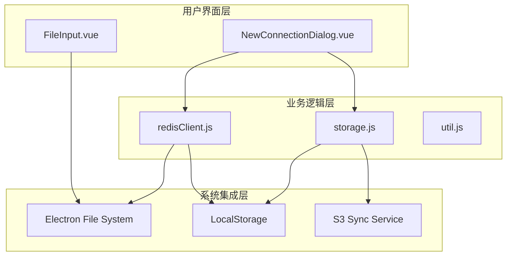
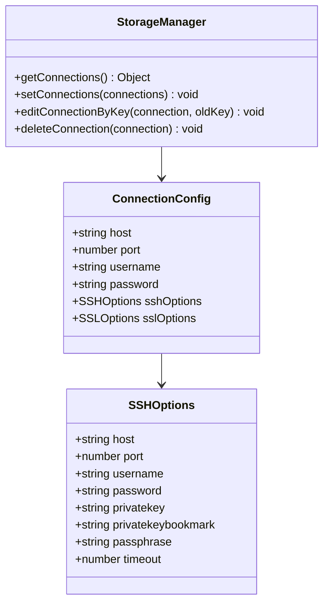
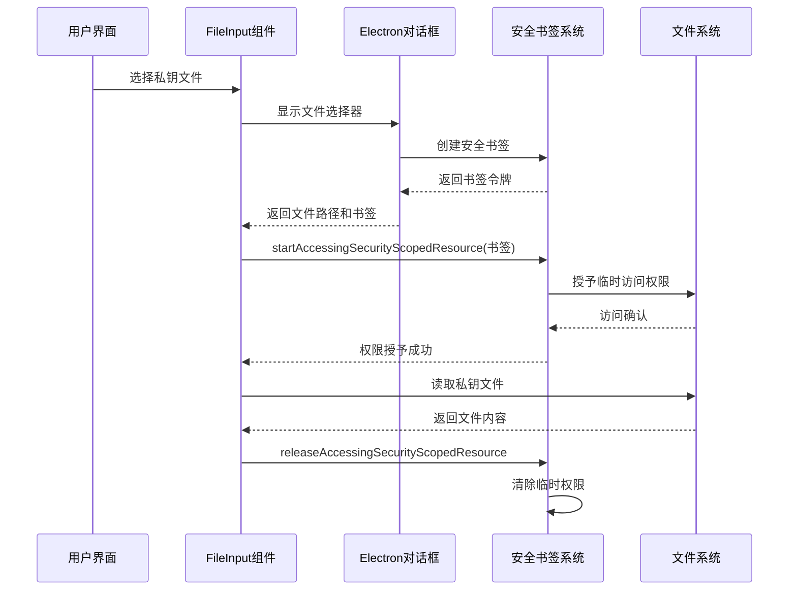
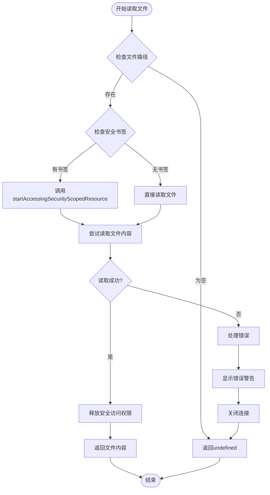
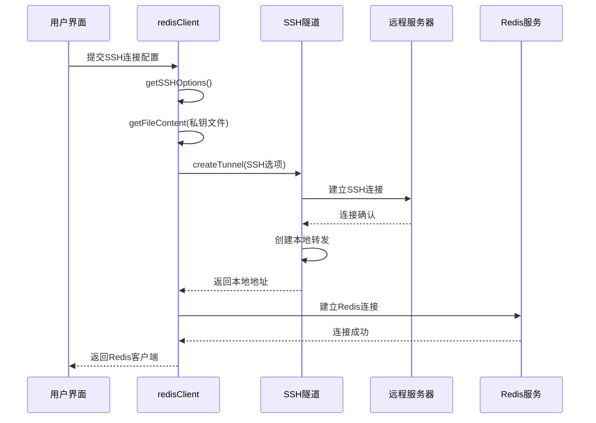
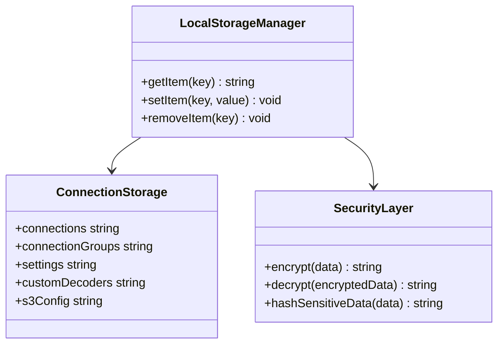
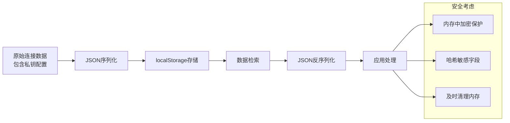
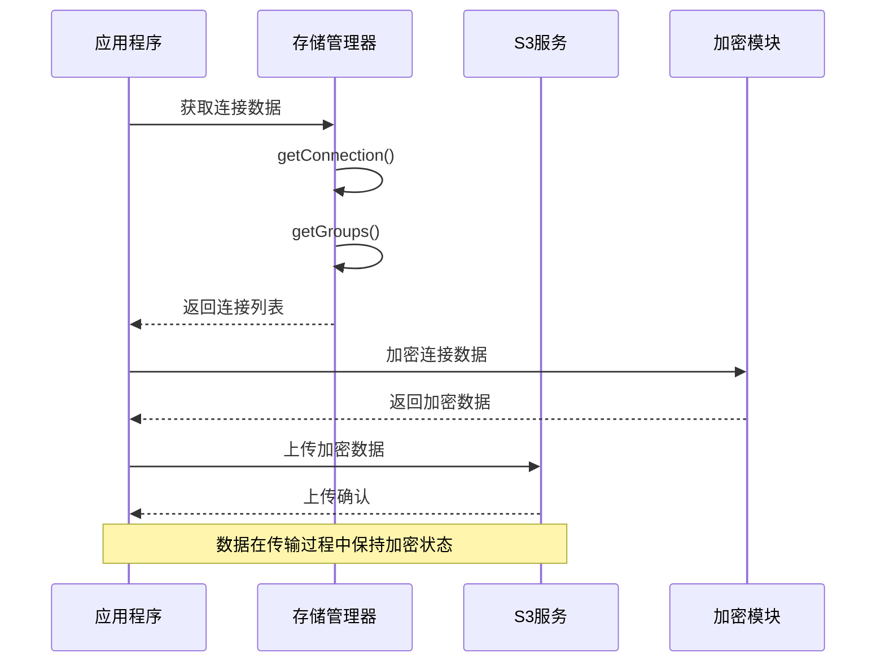

# 私钥管理与安全存储

<cite>
**本文档引用的文件**
- [storage.js](file://src/storage.js)
- [redisClient.js](file://src/redisClient.js)
- [util.js](file://src/util.js)
- [FileInput.vue](file://src/components/FileInput.vue)
- [NewConnectionDialog.vue](file://src/components/NewConnectionDialog.vue)
- [main.js](file://src/main.js)
- [s3Sync.js](file://src/s3Sync.js)
</cite>

## 目录
1. [简介](#简介)
2. [项目架构概览](#项目架构概览)
3. [私钥存储机制](#私钥存储机制)
4. [macOS安全文件访问](#macos安全文件访问)
5. [私钥传输与连接安全](#私钥传输与连接安全)
6. [本地存储与加密保护](#本地存储与加密保护)
7. [S3同步安全机制](#s3同步安全机制)
8. [最佳实践建议](#最佳实践建议)
9. [故障排除指南](#故障排除指南)
10. [总结](#总结)

## 简介

Another Redis Desktop Manager (ARDM) 是一个基于 Electron 的 Redis 客户端应用程序，提供了完整的 SSH 私钥安全管理机制。该系统通过多层次的安全策略，确保私钥文件的安全存储、传输和使用，同时兼容 macOS 应用商店的安全要求。

本文档深入分析了 ARDM 中 SSH 私钥的安全管理机制，包括私钥文件的加密存储策略、macOS 系统安全文件访问实现、私钥在 localStorage 中的存储方式与保护措施，以及从文件选择到 SSH 隧道建立全过程的数据保护策略。

## 项目架构概览

ARDM 采用模块化的架构设计，将私钥管理功能分布在多个核心组件中：



**图表来源**
- [NewConnectionDialog.vue](file://src/components/NewConnectionDialog.vue#L306-L356)
- [redisClient.js](file://src/redisClient.js#L51-L381)
- [storage.js](file://src/storage.js#L5-L339)

**章节来源**
- [NewConnectionDialog.vue](file://src/components/NewConnectionDialog.vue#L306-L356)
- [redisClient.js](file://src/redisClient.js#L51-L381)
- [storage.js](file://src/storage.js#L5-L339)

## 私钥存储机制

### 存储结构设计

ARDM 将私钥信息存储在连接配置对象中，支持多种认证方式：



**图表来源**
- [NewConnectionDialog.vue](file://src/components/NewConnectionDialog.vue#L341-L348)
- [storage.js](file://src/storage.js#L192-L266)

### 私钥字段说明

| 字段名 | 类型 | 描述 | 安全级别 |
|--------|------|------|----------|
| `privatekey` | string | 私钥文件路径 | 低 - 仅存储路径 |
| `privatekeybookmark` | string | macOS 安全书签 | 中 - 临时访问令牌 |
| `passphrase` | string | 私钥密码短语 | 高 - 内存中保护 |

**章节来源**
- [NewConnectionDialog.vue](file://src/components/NewConnectionDialog.vue#L341-L348)

## macOS安全文件访问

### securityScopedResource 实现

ARDM 通过 Electron 的 `securityScopedResource` 机制实现 macOS 系统的安全文件访问控制：



**图表来源**
- [FileInput.vue](file://src/components/FileInput.vue#L33-L45)
- [redisClient.js](file://src/redisClient.js#L363-L370)

### getFileContent 方法详解

`getFileContent` 方法实现了安全的私钥文件读取机制：



**图表来源**
- [redisClient.js](file://src/redisClient.js#L357-L379)

**章节来源**
- [redisClient.js](file://src/redisClient.js#L357-L379)
- [FileInput.vue](file://src/components/FileInput.vue#L33-L45)

## 私钥传输与连接安全

### SSH隧道建立流程

ARDM 在建立 SSH 隧道时，确保私钥数据在整个传输过程中的安全性：



**图表来源**
- [redisClient.js](file://src/redisClient.js#L90-L164)

### TLS/SSL证书安全

对于 SSL/TLS 连接，系统同样使用安全书签机制读取证书文件：

| 证书类型 | 字段名 | 安全机制 |
|----------|--------|----------|
| CA证书 | `ca` | 安全书签读取 |
| 私钥证书 | `key` | 安全书签读取 |
| 客户端证书 | `cert` | 安全书签读取 |

**章节来源**
- [redisClient.js](file://src/redisClient.js#L325-L341)

## 本地存储与加密保护

### localStorage 存储策略

ARDM 使用浏览器的 localStorage 存储连接配置信息，包括私钥相关配置：



**图表来源**
- [storage.js](file://src/storage.js#L5-L339)

### 数据序列化与保护

系统对敏感数据进行 JSON 序列化存储：



**图表来源**
- [storage.js](file://src/storage.js#L196-L205)

**章节来源**
- [storage.js](file://src/storage.js#L196-L205)

## S3同步安全机制

### 数据传输加密

当启用 S3 同步功能时，系统会对连接数据进行加密传输：



**图表来源**
- [s3Sync.js](file://src/s3Sync.js#L158-L174)

### 同步数据结构

S3 同步使用以下数据结构：

| 字段 | 类型 | 描述 | 安全级别 |
|------|------|------|----------|
| `version` | number | 数据格式版本 | 公开 |
| `timestamp` | string | ISO时间戳 | 公开 |
| `connections` | Array | 连接配置数组 | 敏感 |
| `groups` | Array | 分组配置数组 | 敏感 |

**章节来源**
- [s3Sync.js](file://src/s3Sync.js#L165-L169)

## 最佳实践建议

### 文件权限设置

1. **私钥文件权限**
   - Windows: `600` 或 `rw-------`
   - Linux/macOS: `600` 或 `rw-------`
   - 确保只有文件所有者可读写

2. **目录权限**
   - 私钥存放目录：`700` 或 `rwx------`
   - 配置文件目录：`750` 或 `rwxr-x---`

### 私钥密码保护

1. **强密码策略**
   - 长度至少12字符
   - 包含大小写字母、数字和特殊符号
   - 避免使用字典词汇

2. **密码轮换**
   - 定期更换私钥密码
   - 使用不同的密码用于不同环境

### 敏感信息泄露防护

1. **内存保护**
   - 及时清理敏感数据
   - 使用内存安全的字符串处理

2. **日志记录**
   - 避免在日志中记录私钥信息
   - 使用脱敏的日志输出

3. **网络传输**
   - 使用加密通道传输敏感数据
   - 实施适当的访问控制

### 应用程序安全配置

1. **Electron 安全**
   - 启用 Node.js 集成限制
   - 使用内容安全策略 (CSP)
   - 禁用不必要的原生功能

2. **更新机制**
   - 定期更新依赖库
   - 及时修复已知漏洞
   - 使用代码签名验证

## 故障排除指南

### 常见问题诊断

1. **私钥文件访问失败**
   - 检查文件路径是否正确
   - 验证文件权限设置
   - 确认安全书签有效性

2. **SSH连接超时**
   - 检查网络连接状态
   - 验证SSH服务器可达性
   - 确认防火墙规则

3. **私钥解密失败**
   - 验证私钥密码正确性
   - 检查私钥格式兼容性
   - 确认加密算法支持

### 调试技巧

1. **启用详细日志**
   ```javascript
   // 在开发环境中启用调试模式
   console.log('SSH Options:', sshOptions);
   ```

2. **检查存储状态**
   ```javascript
   // 检查localStorage中的连接配置
   console.log('Stored Connections:', localStorage.connections);
   ```

3. **验证文件访问**
   ```javascript
   // 测试文件读取权限
   const content = redisClient.getFileContent(filePath, bookmark);
   console.log('File Content Length:', content ? content.length : 0);
   ```

**章节来源**
- [redisClient.js](file://src/redisClient.js#L357-L379)

## 总结

Another Redis Desktop Manager 通过多层次的安全机制，为 SSH 私钥管理提供了全面的保护：

1. **文件级安全**：利用 macOS 的 securityScopedResource 机制实现安全文件访问
2. **传输级安全**：在 SSH 隧道建立过程中保护私钥数据
3. **存储级安全**：通过 localStorage 和 S3 同步提供安全的数据持久化
4. **应用级安全**：实施完整的权限管理和错误处理机制

该系统的设计充分考虑了现代应用程序的安全需求，既保证了用户体验的流畅性，又确保了敏感数据的安全性。通过遵循本文档提供的最佳实践建议，可以进一步增强系统的安全性，防止潜在的安全威胁。