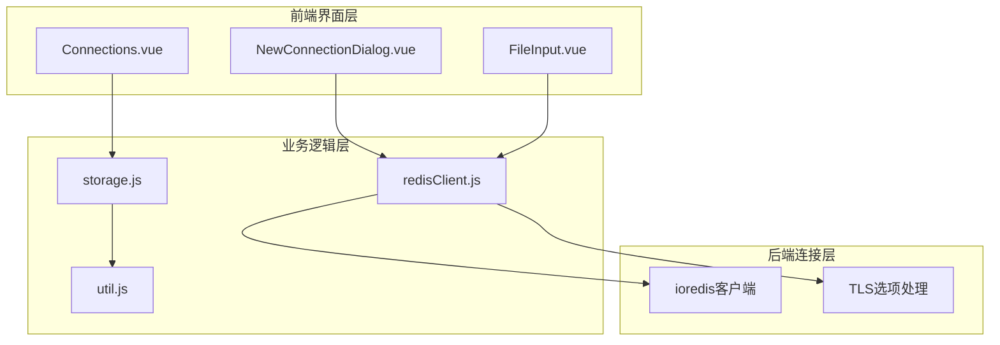
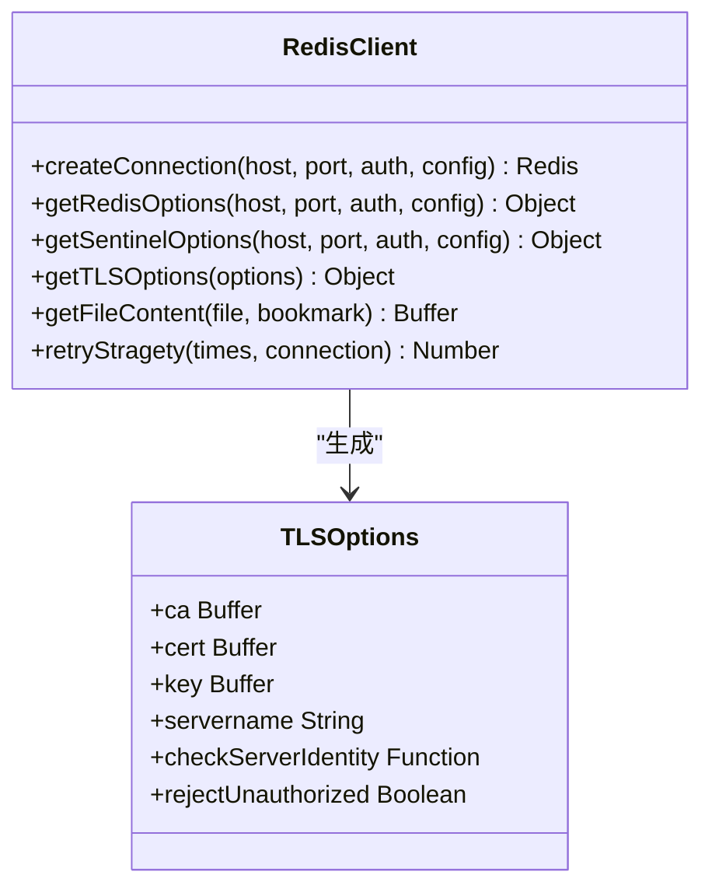
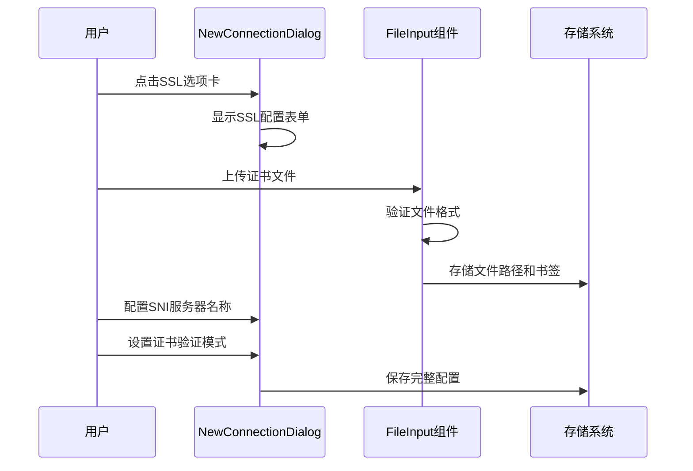
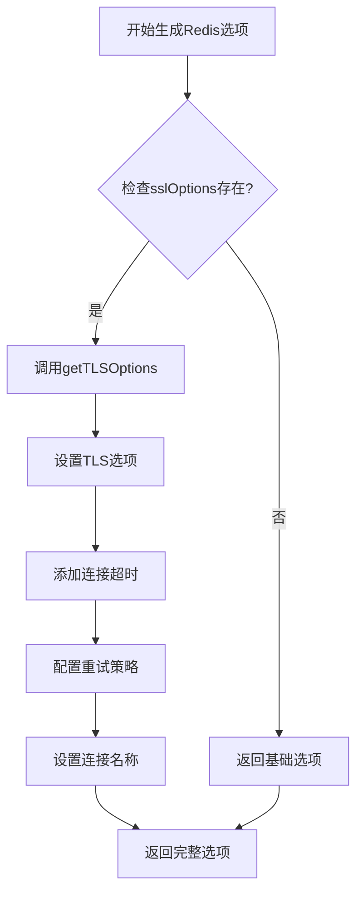
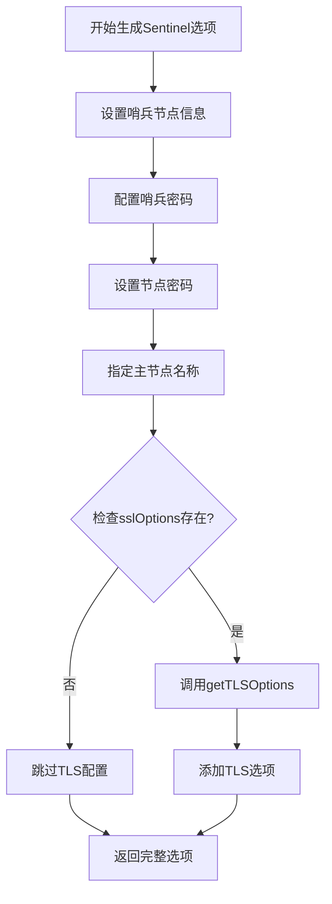
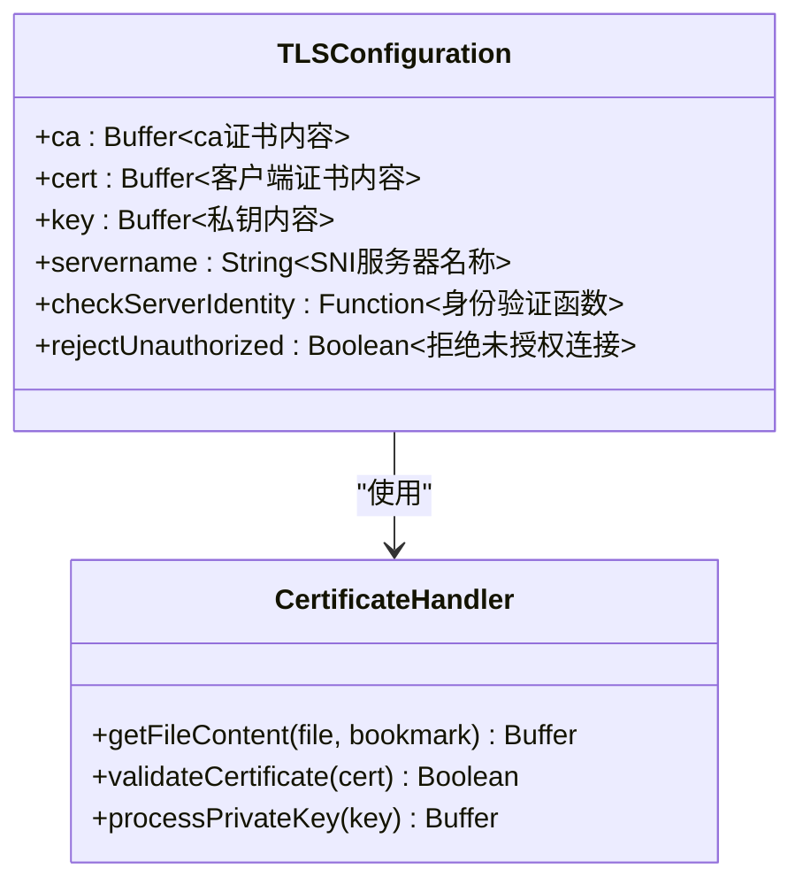
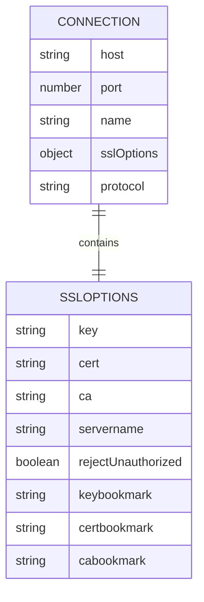
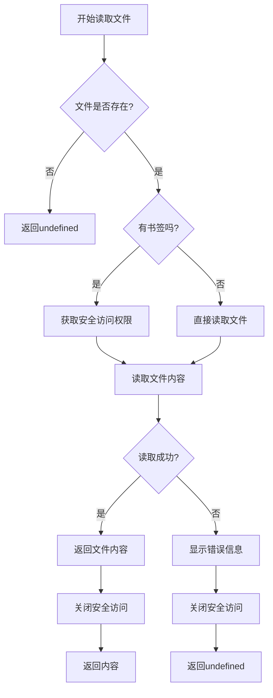
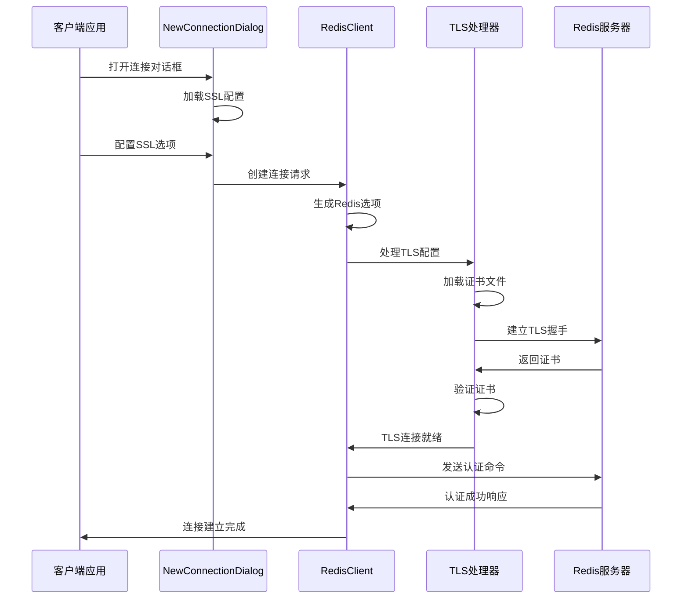
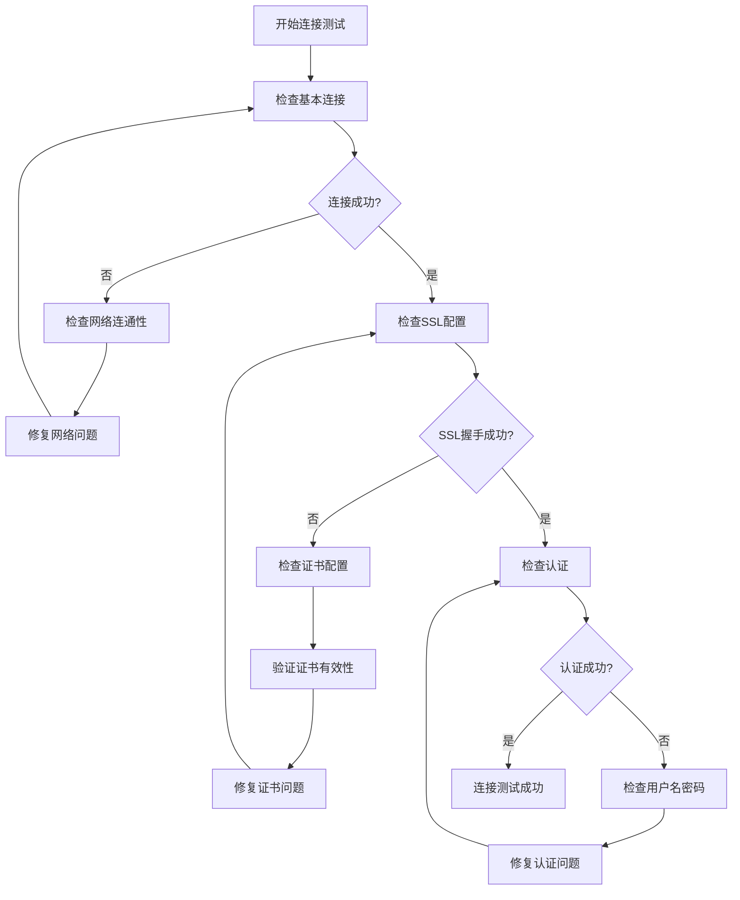

# SSL/TLS加密连接

<cite>
**本文档引用的文件**
- [redisClient.js](file://src/redisClient.js)
- [NewConnectionDialog.vue](file://src/components/NewConnectionDialog.vue)
- [Connections.vue](file://src/components/Connections.vue)
- [storage.js](file://src/storage.js)
- [FileInput.vue](file://src/components/FileInput.vue)
- [util.js](file://src/util.js)
</cite>

## 目录
1. [简介](#简介)
2. [项目结构概览](#项目结构概览)
3. [核心组件分析](#核心组件分析)
4. [SSL/TLS配置界面设计](#ssltls配置界面设计)
5. [TLS连接选项生成机制](#tls连接选项生成机制)
6. [证书文件管理](#证书文件管理)
7. [连接建立流程](#连接建立流程)
8. [云服务配置指南](#云服务配置指南)
9. [常见问题与解决方案](#常见问题与解决方案)
10. [安全优势对比](#安全优势对比)
11. [故障排除指南](#故障排除指南)
12. [总结](#总结)

## 简介

Another Redis Desktop Manager提供了完整的SSL/TLS加密连接功能，确保Redis通信的安全性。该系统支持多种证书类型（CA证书、客户端证书、私钥），并提供了灵活的配置选项，包括严格的证书验证和宽松的SNI服务器名称验证。

## 项目结构概览

SSL/TLS功能主要分布在以下核心模块中：



**图表来源**
- [NewConnectionDialog.vue](file://src/components/NewConnectionDialog.vue#L1-L772)
- [redisClient.js](file://src/redisClient.js#L1-L381)
- [storage.js](file://src/storage.js#L1-L329)

## 核心组件分析

### redisClient.js - 连接管理核心

redisClient.js是SSL/TLS功能的核心实现，负责生成TLS连接选项和管理连接生命周期。

#### 主要方法架构



**图表来源**
- [redisClient.js](file://src/redisClient.js#L203-L341)

**章节来源**
- [redisClient.js](file://src/redisClient.js#L203-L341)

### Connections.vue - 连接管理界面

Connections.vue提供了连接分组和管理功能，支持对已保存连接的SSL配置进行查看和编辑。

**章节来源**
- [Connections.vue](file://src/components/Connections.vue#L1-L326)

## SSL/TLS配置界面设计

### NewConnectionDialog.vue - 完整配置界面

SSL/TLS配置界面位于连接对话框的"SSL/TLS"标签页，提供了直观的配置选项：

#### 配置项详解

| 配置项 | 类型 | 描述 | 默认值 |
|--------|------|------|--------|
| 启用SSL | 勾选框 | 开启SSL/TLS加密连接 | false |
| 公钥证书 | 文件输入 | 客户端公钥证书文件 | - |
| 私钥文件 | 文件输入 | 客户端私钥文件 | - |
| CA证书 | 文件输入 | 服务器CA证书文件 | - |
| 拒绝未授权连接 | 勾选框 | 严格证书验证模式 | false |
| SNI服务器名称 | 文本输入 | 服务器名称指示(SNI) | - |

#### 用户交互流程



**图表来源**
- [NewConnectionDialog.vue](file://src/components/NewConnectionDialog.vue#L140-L177)
- [FileInput.vue](file://src/components/FileInput.vue#L1-L50)

**章节来源**
- [NewConnectionDialog.vue](file://src/components/NewConnectionDialog.vue#L140-L177)

### FileInput.vue - 证书文件上传组件

FileInput组件专门处理证书文件的上传和存储，支持macOS应用商店版本的安全访问机制。

#### 文件处理特性

- **安全访问**: 支持macOS安全作用域书签
- **格式验证**: 自动验证文件扩展名(.pem, .crt, .key)
- **权限管理**: 提供文件权限检查和错误提示

**章节来源**
- [FileInput.vue](file://src/components/FileInput.vue#L1-L50)

## TLS连接选项生成机制

### getRedisOptions方法

getRedisOptions方法是SSL/TLS配置的核心入口点，负责生成标准Redis连接选项：



**图表来源**
- [redisClient.js](file://src/redisClient.js#L203-L222)

### getSentinelOptions方法

Sentinel模式下的SSL/TLS配置遵循相同的TLS选项生成逻辑：



**图表来源**
- [redisClient.js](file://src/redisClient.js#L225-L239)

### getTLSOptions方法

getTLSOptions方法是SSL/TLS配置的核心实现，负责处理所有证书和验证选项：

#### TLS选项配置详解



**图表来源**
- [redisClient.js](file://src/redisClient.js#L325-L341)

#### 关键配置项说明

1. **证书加载机制**: 使用getFileContent方法安全加载证书文件
2. **SNI支持**: 通过servername字段支持服务器名称指示
3. **验证控制**: 
   - `rejectUnauthorized: false`: 默认关闭严格验证
   - `checkServerIdentity: undefined`: 跳过主机名验证

**章节来源**
- [redisClient.js](file://src/redisClient.js#L325-L341)

## 证书文件管理

### storage.js - 安全存储机制

storage.js负责安全存储SSL/TLS配置信息，包括证书文件路径和加密配置：

#### 存储结构设计



**图表来源**
- [storage.js](file://src/storage.js#L182-L329)

#### 安全存储特性

1. **文件路径存储**: 只存储证书文件路径而非内容
2. **书签支持**: macOS应用商店版本使用安全作用域书签
3. **配置隔离**: SSL配置与其他连接配置分离存储

**章节来源**
- [storage.js](file://src/storage.js#L182-L329)

### getFileContent方法

getFileContent方法实现了安全的证书文件读取机制：



**图表来源**
- [redisClient.js](file://src/redisClient.js#L357-L378)

**章节来源**
- [redisClient.js](file://src/redisClient.js#L357-L378)

## 连接建立流程

### 完整连接建立序列



**图表来源**
- [redisClient.js](file://src/redisClient.js#L52-L87)
- [NewConnectionDialog.vue](file://src/components/NewConnectionDialog.vue#L456-L495)

### 不同连接模式的SSL处理

#### 标准Redis连接
- 直接应用TLS选项到Redis实例
- 支持所有证书类型的配置

#### Sentinel模式连接
- 在哨兵连接中包含TLS配置
- 支持哨兵节点和主节点的SSL连接

#### 集群模式连接
- 为每个集群节点应用TLS配置
- 支持NAT映射环境下的SSL连接

**章节来源**
- [redisClient.js](file://src/redisClient.js#L52-L87)

## 云服务配置指南

### Azure Cache for Redis

Azure Cache for Redis支持SSL连接，需要配置相应的证书：

#### 配置步骤
1. **获取证书**: 从Azure门户下载客户端证书
2. **配置连接**: 在连接对话框中启用SSL
3. **证书设置**:
   - 公钥证书: 客户端证书文件
   - 私钥文件: 对应的私钥文件
   - CA证书: Azure根证书

#### 注意事项
- Azure Cache默认启用SSL
- 使用SNI服务器名称指向特定缓存实例
- 推荐启用严格的证书验证

### AWS ElastiCache

AWS ElastiCache Redis支持SSL/TLS加密，配置要求：

#### 配置要点
1. **TLS端口**: 使用6380端口而非6379
2. **证书验证**: 需要配置CA证书
3. **安全组**: 确保安全组允许SSL流量

#### 示例配置
```javascript
// AWS ElastiCache SSL配置示例
{
  sslOptions: {
    ca: '/path/to/aws-ca-cert.pem',
    rejectUnauthorized: true,
    servername: 'your-cache-endpoint.amazonaws.com'
  }
}
```

### 其他云服务

#### Alibaba Cloud Redis
- 支持SSL连接
- 需要配置客户端证书
- 使用标准Redis端口

#### Tencent Cloud Redis
- 支持SSL加密
- 需要上传客户端证书
- 支持SNI配置

## 常见问题与解决方案

### 证书链不完整

**问题描述**: SSL握手失败，提示证书链不完整

**解决方案**:
1. **检查证书链**: 确保包含中间证书
2. **合并证书**: 将中间证书附加到客户端证书
3. **验证工具**: 使用openssl验证证书链

**诊断命令**:
```bash
openssl s_client -connect your-redis-host:6379 -showcerts
```

### 域名不匹配

**问题描述**: 证书验证失败，域名不匹配

**解决方案**:
1. **启用SNI**: 在sslOptions中设置servername
2. **跳过验证**: 临时设置`rejectUnauthorized: false`
3. **证书更新**: 获取正确的证书

### 权限问题

**问题描述**: 无法读取证书文件

**解决方案**:
1. **文件权限**: 确保证书文件可读
2. **路径正确**: 检查文件路径是否正确
3. **书签权限**: macOS应用商店版本需要重新授权

### 连接超时

**问题描述**: SSL连接建立超时

**解决方案**:
1. **网络检查**: 确认网络连通性
2. **防火墙**: 检查防火墙设置
3. **超时配置**: 增加连接超时时间

## 安全优势对比

### 明文连接 vs SSL连接

| 特性 | 明文连接 | SSL/TLS连接 |
|------|----------|-------------|
| 数据传输 | 明文传输 | 加密传输 |
| 中间人攻击 | 易受攻击 | 防护中间人攻击 |
| 数据完整性 | 无保障 | 保证数据完整性 |
| 身份验证 | 无身份验证 | 强身份验证 |
| 性能影响 | 最小 | 轻微性能开销 |
| 配置复杂度 | 简单 | 中等复杂度 |

### SSL连接的安全优势

1. **数据加密**: 所有传输数据都经过加密
2. **身份验证**: 通过证书验证服务器身份
3. **完整性保护**: 防止数据在传输过程中被篡改
4. **前向保密**: 即使私钥泄露，历史通信仍安全

## 故障排除指南

### 连接测试流程



### 常见错误代码

| 错误类型 | 错误信息 | 解决方案 |
|----------|----------|----------|
| 证书错误 | "certificate verify failed" | 检查证书有效性 |
| 连接超时 | "ECONNRESET" | 检查网络连接 |
| 权限错误 | "EACCES" | 检查文件权限 |
| 配置错误 | "invalid configuration" | 验证SSL配置 |

### 调试技巧

1. **启用调试日志**: 在开发环境中启用详细日志
2. **使用网络抓包**: 使用Wireshark分析网络流量
3. **证书验证**: 使用openssl手动测试SSL连接
4. **逐步排查**: 从简单配置开始逐步增加复杂性

## 总结

Another Redis Desktop Manager的SSL/TLS加密连接功能提供了完整的安全通信解决方案。通过直观的配置界面、灵活的证书管理和强大的连接处理能力，确保了Redis通信的安全性和可靠性。

### 主要特性总结

1. **完整的证书支持**: 支持CA证书、客户端证书和私钥
2. **灵活的验证模式**: 可选择严格的证书验证或宽松的SNI配置
3. **云服务兼容**: 支持主流云Redis服务的SSL配置
4. **安全存储**: 采用安全的方式存储证书文件路径
5. **易于配置**: 提供直观的图形化配置界面

### 最佳实践建议

1. **生产环境**: 启用严格的证书验证(rejectUnauthorized: true)
2. **开发环境**: 可暂时使用宽松验证以便快速测试
3. **定期更新**: 定期更新证书以保持安全性
4. **备份配置**: 备份SSL配置以防意外丢失

通过合理配置SSL/TLS功能，可以显著提升Redis连接的安全性，保护敏感数据在传输过程中的安全。