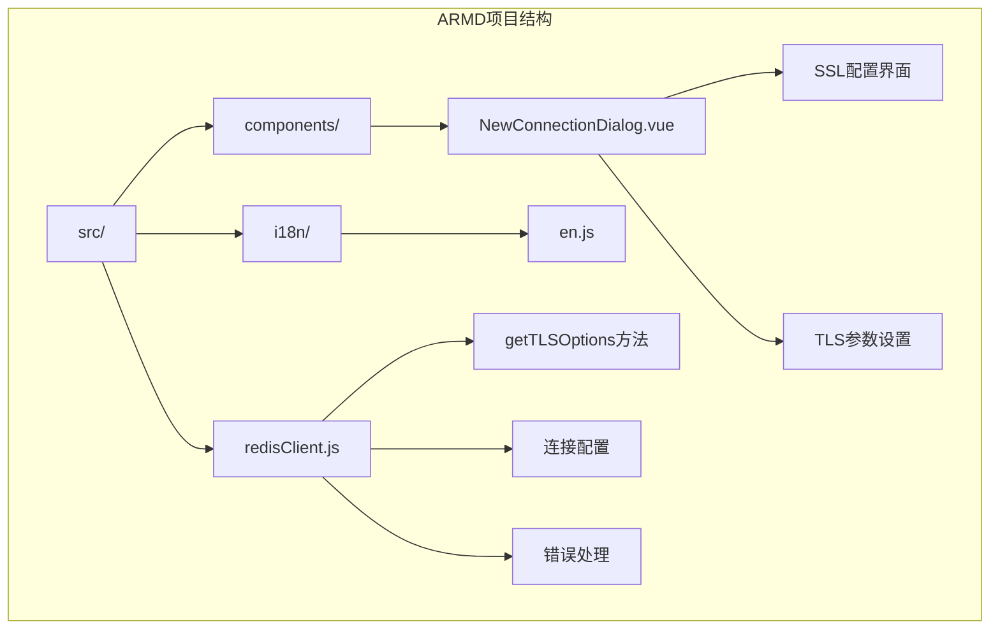
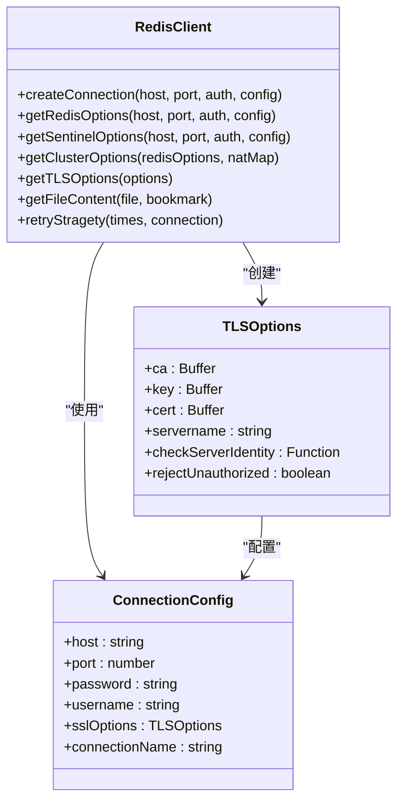
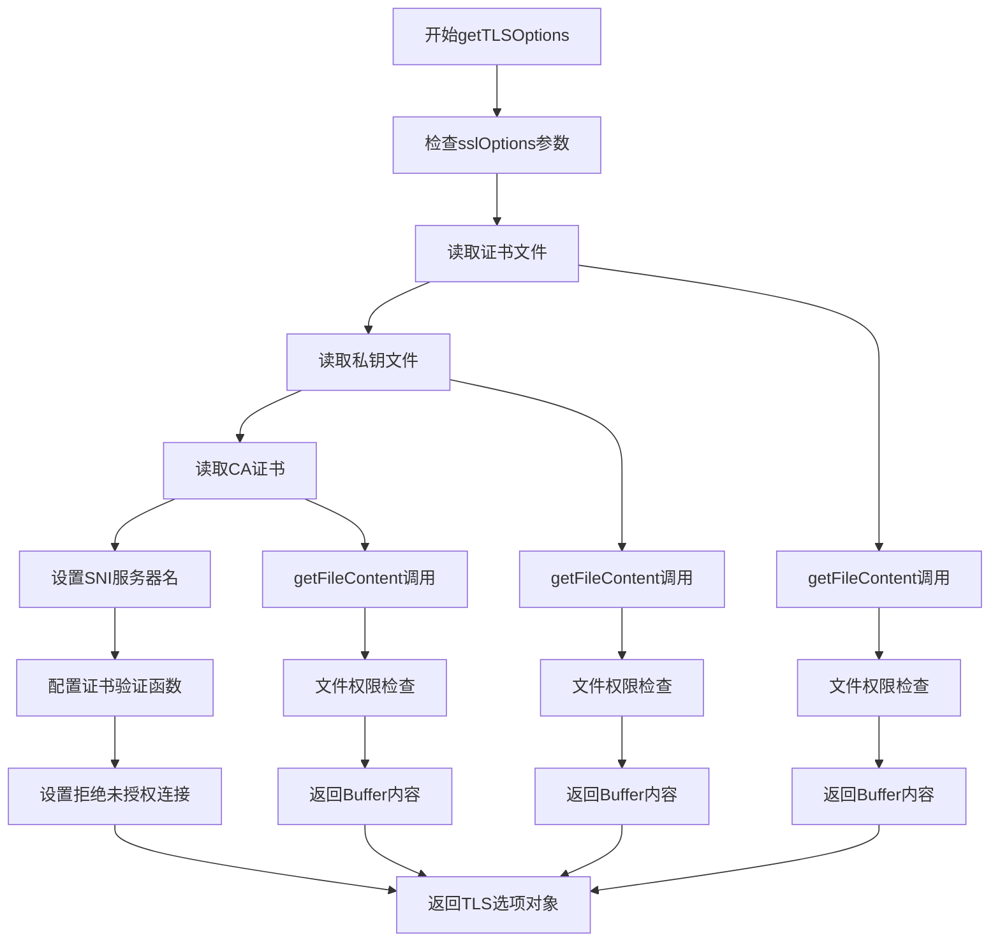
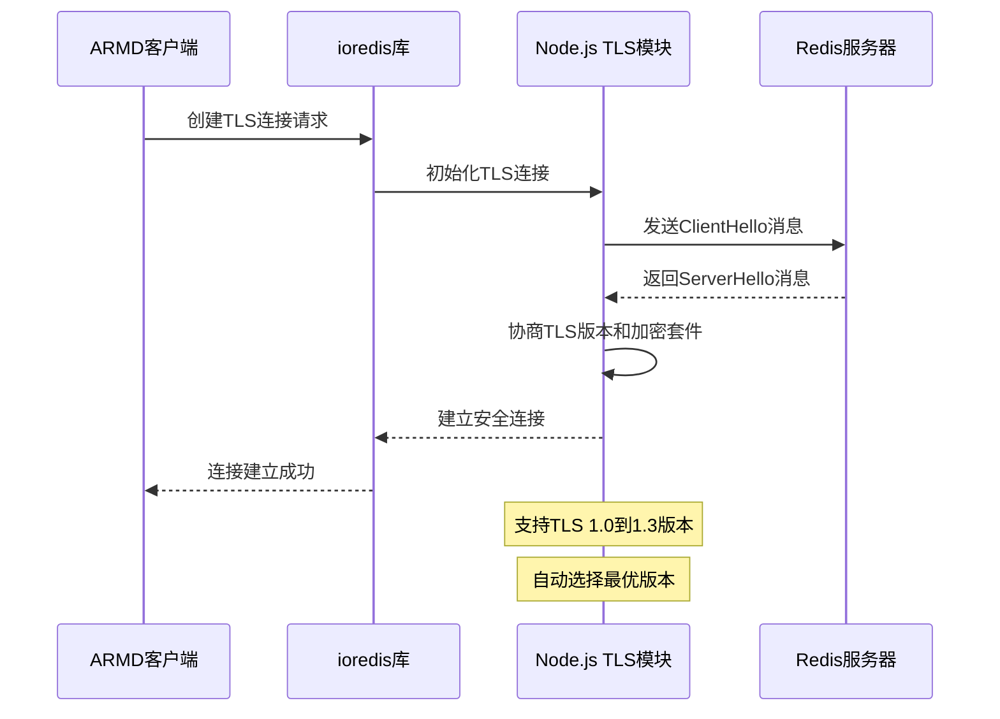
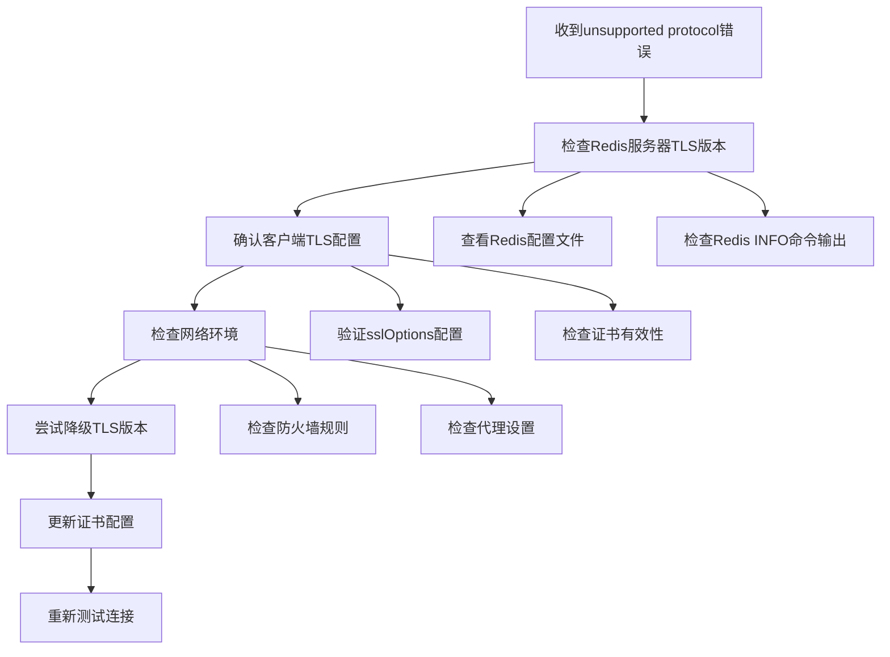
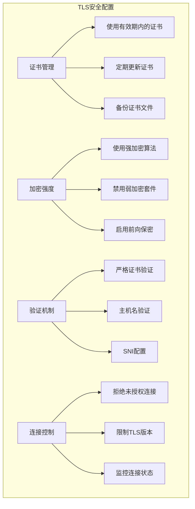
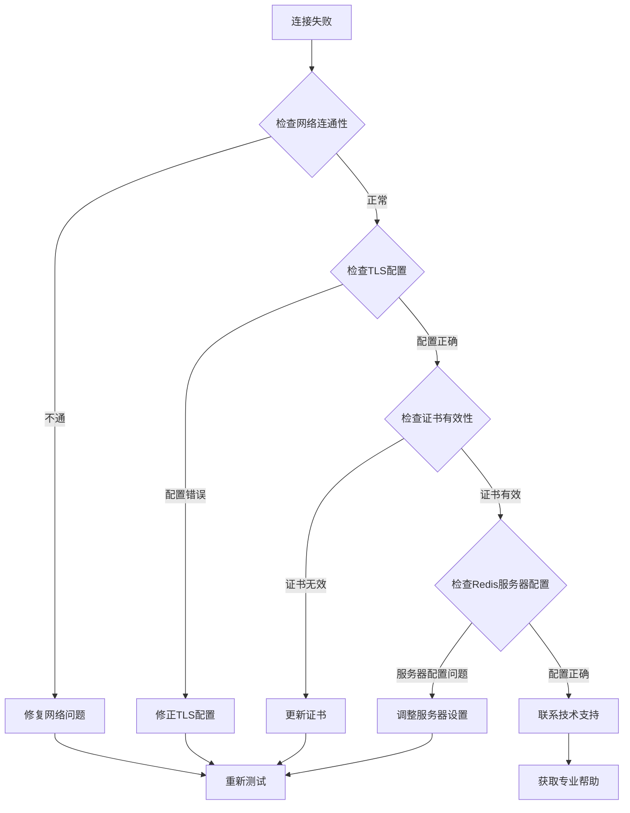

# 加密协议与版本

<cite>
**本文档中引用的文件**
- [redisClient.js](file://src/redisClient.js)
- [NewConnectionDialog.vue](file://src/components/NewConnectionDialog.vue)
- [package.json](file://package.json)
- [en.js](file://src/i18n/langs/en.js)
</cite>

## 目录
1. [简介](#简介)
2. [项目结构概览](#项目结构概览)
3. [核心组件分析](#核心组件分析)
4. [TLS选项对象构建机制](#tls选项对象构建机制)
5. [Node.js TLS模块集成](#nodejs-tls模块集成)
6. [TLS版本兼容性矩阵](#tls版本兼容性矩阵)
7. [错误排查指南](#错误排查指南)
8. [现代TLS安全最佳实践](#现代tls安全最佳实践)
9. [故障排除指南](#故障排除指南)
10. [总结](#总结)

## 简介

Another Redis Desktop Manager (ARDM) 是一个跨平台的Redis桌面管理器，支持多种连接方式，包括直接连接、SSH隧道和集群模式。在安全性方面，ARMD提供了完整的SSL/TLS加密支持，确保数据传输的安全性。本文档深入分析了ARMD中SSL/TLS加密协议的实现机制，重点基于`redisClient.js`中的`getTLSOptions`方法，解释TLS选项对象的构建过程，并提供详细的配置指南和故障排查方案。

## 项目结构概览

ARMD采用现代化的前端架构，主要包含以下关键目录：
- `src/`：源代码目录，包含所有业务逻辑
- `src/redisClient.js`：Redis客户端连接管理的核心文件
- `src/components/`：Vue组件目录，包含用户界面
- `src/i18n/`：国际化语言文件

**图表来源**
- [redisClient.js](file://src/redisClient.js#L1-L381)
- [NewConnectionDialog.vue](file://src/components/NewConnectionDialog.vue#L1-L772)

**章节来源**
- [redisClient.js](file://src/redisClient.js#L1-L50)
- [package.json](file://package.json#L1-L130)

## 核心组件分析

### Redis客户端连接管理

ARMD的Redis连接管理通过`redisClient.js`模块实现，该模块负责：
- 建立与Redis服务器的连接
- 处理不同连接模式（单机、哨兵、集群）
- 管理SSL/TLS加密连接

**图表来源**
- [redisClient.js](file://src/redisClient.js#L51-L381)

**章节来源**
- [redisClient.js](file://src/redisClient.js#L51-L381)

## TLS选项对象构建机制

### getTLSOptions方法详解

`getTLSOptions`方法是ARMD中SSL/TLS配置的核心，它负责构建Node.js TLS选项对象：

**图表来源**
- [redisClient.js](file://src/redisClient.js#L324-L342)

### TLS选项配置细节

ARMD的TLS配置包含以下关键参数：

| 参数名称 | 类型 | 描述 | 默认值 |
|---------|------|------|--------|
| `ca` | Buffer | 证书颁发机构证书 | 可选 |
| `key` | Buffer | 客户端私钥 | 可选 |
| `cert` | Buffer | 客户端公钥证书 | 可选 |
| `servername` | string | SNI服务器名称 | 可选 |
| `checkServerIdentity` | Function | 服务器身份验证函数 | 跳过验证 |
| `rejectUnauthorized` | boolean | 是否拒绝未授权连接 | false |

**章节来源**
- [redisClient.js](file://src/redisClient.js#L324-L342)

## Node.js TLS模块集成

### 自动协商机制

ARMD基于ioredis库实现TLS连接，该库底层使用Node.js的`tls`模块。TLS版本协商由Node.js自动处理：

**图表来源**
- [redisClient.js](file://src/redisClient.js#L217-L219)
- [redisClient.js](file://src/redisClient.js#L237-L239)

### TLS版本支持范围

根据Node.js版本和系统配置，ARMD支持的TLS版本范围如下：

| TLS版本 | 支持状态 | 推荐程度 | 安全级别 |
|---------|----------|----------|----------|
| TLS 1.0 | 可能支持 | 不推荐 | 低 |
| TLS 1.1 | 可能支持 | 不推荐 | 中 |
| TLS 1.2 | 完全支持 | 推荐 | 高 |
| TLS 1.3 | 完全支持 | 最佳 | 最高 |

**章节来源**
- [package.json](file://package.json#L42-L43)

## TLS版本兼容性矩阵

### Redis服务端兼容性

不同Redis部署环境对TLS版本的支持情况：

| 服务提供商 | Redis版本 | TLS 1.2 | TLS 1.3 | 推荐配置 |
|-----------|-----------|---------|---------|----------|
| Redis官方 | 6.0+ | ✅ | ✅ | 使用TLS 1.3 |
| AWS ElastiCache | 6.0+ | ✅ | ✅ | 使用TLS 1.3 |
| Google Cloud Memorystore | 6.0+ | ✅ | ✅ | 使用TLS 1.3 |
| Azure Cache for Redis | 6.0+ | ✅ | ✅ | 使用TLS 1.3 |
| 自建Redis | 5.0+ | ✅ | ⚠️ | 使用TLS 1.2 |

### 兼容性测试建议

为确保连接成功，建议进行以下测试：
1. **基础连接测试**：验证基本的TLS握手
2. **版本协商测试**：确认支持的TLS版本
3. **证书验证测试**：检查证书链完整性
4. **性能基准测试**：评估不同TLS版本的性能差异

## 错误排查指南

### 常见TLS错误及解决方案

#### 1. "unsupported protocol" 错误

**症状描述**：连接时出现"unsupported protocol"错误

**可能原因**：
- Redis服务器不支持客户端请求的TLS版本
- 客户端TLS配置与服务器不匹配
- 网络中间设备干扰

**排查步骤**：

**图表来源**
- [redisClient.js](file://src/redisClient.js#L344-L355)

#### 2. 证书验证失败

**症状描述**：证书验证相关错误

**解决方案**：
1. 检查证书文件格式是否正确
2. 验证证书链完整性
3. 确认证书有效期
4. 检查SNI配置

#### 3. 连接超时问题

**症状描述**：TLS握手超时

**排查要点**：
- 检查网络延迟
- 验证防火墙规则
- 确认服务器负载情况

**章节来源**
- [redisClient.js](file://src/redisClient.js#L344-L355)

## 现代TLS安全最佳实践

### 安全配置建议

ARMD在TLS实现中体现了以下安全最佳实践：

### 配置优化策略

1. **证书管理**：
   - 使用受信任的CA签发的证书
   - 实施证书轮换策略
   - 妥善保管私钥文件

2. **加密配置**：
   - 优先使用TLS 1.3
   - 启用强加密算法（AES-256, ChaCha20-Poly1305）
   - 禁用已知存在漏洞的加密套件

3. **安全验证**：
   - 启用严格的证书验证
   - 实施主机名验证
   - 正确配置SNI

**章节来源**
- [redisClient.js](file://src/redisClient.js#L336-L341)
- [NewConnectionDialog.vue](file://src/components/NewConnectionDialog.vue#L140-L180)

## 故障排除指南

### 连接诊断流程

当遇到TLS连接问题时，按照以下流程进行诊断：

### 性能优化建议

1. **连接池管理**：
   - 合理设置连接池大小
   - 实施连接健康检查
   - 及时释放空闲连接

2. **TLS性能优化**：
   - 使用硬件加速的加密
   - 优化证书链长度
   - 启用会话复用

3. **监控和告警**：
   - 监控连接成功率
   - 跟踪TLS握手时间
   - 设置异常告警机制

### 最佳实践总结

1. **开发阶段**：
   - 在测试环境中充分验证TLS配置
   - 使用自动化测试覆盖各种TLS场景
   - 建立完善的文档记录

2. **生产环境**：
   - 实施渐进式TLS升级策略
   - 建立回滚机制
   - 持续监控连接质量

3. **运维管理**：
   - 制定证书管理流程
   - 建立应急响应预案
   - 定期进行安全审计

**章节来源**
- [redisClient.js](file://src/redisClient.js#L344-L355)
- [NewConnectionDialog.vue](file://src/components/NewConnectionDialog.vue#L140-L180)

## 总结

Another Redis Desktop Manager通过精心设计的TLS实现机制，为用户提供安全可靠的Redis连接体验。其核心特性包括：

1. **灵活的TLS配置**：支持多种证书类型和验证选项
2. **自动版本协商**：基于Node.js底层库的智能协议选择
3. **全面的错误处理**：提供详细的诊断信息和解决方案
4. **现代化的安全实践**：遵循最新的TLS安全标准

通过本文档的详细分析，用户可以深入理解ARMD的SSL/TLS工作机制，正确配置连接参数，并在遇到问题时快速定位和解决。随着TLS技术的不断发展，ARMD将继续优化其加密实现，为用户提供更加安全、高效的Redis管理体验。