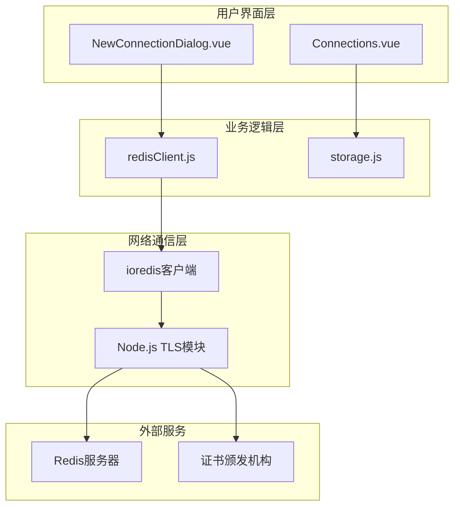
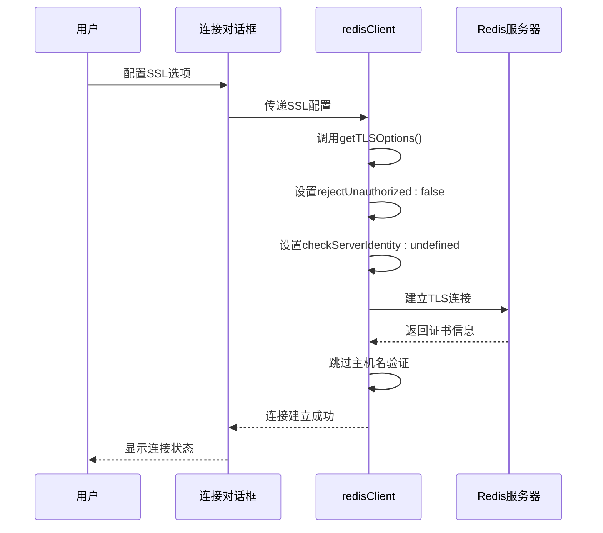
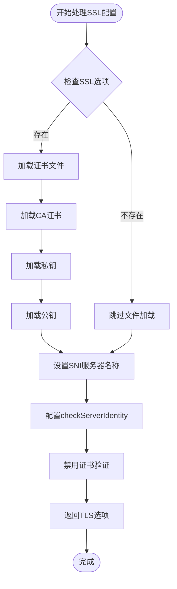
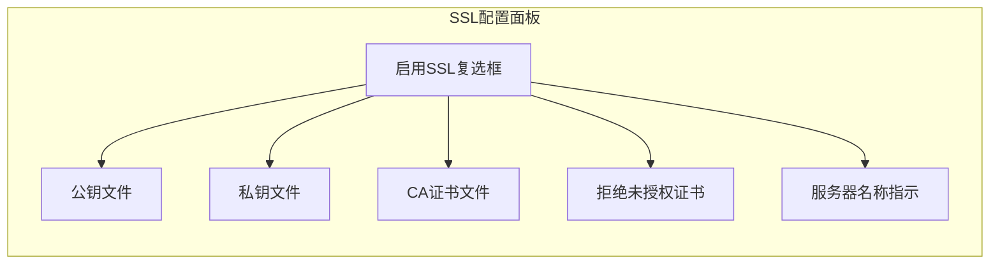

# 安全验证模式

<cite>
**本文档引用的文件**
- [redisClient.js](file://src/redisClient.js)
- [NewConnectionDialog.vue](file://src/components/NewConnectionDialog.vue)
- [Connections.vue](file://src/components/Connections.vue)
- [README.md](file://README.md)
</cite>

## 目录
1. [简介](#简介)
2. [项目架构概览](#项目架构概览)
3. [SSL/TLS安全验证核心机制](#ssltls安全验证核心机制)
4. [getTLSOptions方法深度解析](#gettlsOptions方法深度解析)
5. [用户界面SSL配置实现](#用户界面ssl配置实现)
6. [安全验证模式对比分析](#安全验证模式对比分析)
7. [最佳实践与建议](#最佳实践与建议)
8. [故障排除指南](#故障排除指南)
9. [总结](#总结)

## 简介

Another Redis Desktop Manager (ARDM) 是一个跨平台的Redis桌面管理工具，支持Linux、Windows和Mac系统。该项目实现了完整的SSL/TLS安全验证机制，为用户提供灵活的加密连接选项。本文档深入分析ARMD的SSL/TLS安全验证实现，重点探讨其独特的安全策略和配置方式。

## 项目架构概览

ARMD采用Electron框架构建，前端使用Vue.js技术栈，后端通过ioredis库与Redis服务器通信。项目的SSL/TLS安全架构分为以下几个层次：



**图表来源**
- [redisClient.js](file://src/redisClient.js#L1-L50)
- [NewConnectionDialog.vue](file://src/components/NewConnectionDialog.vue#L1-L100)

**章节来源**
- [redisClient.js](file://src/redisClient.js#L1-L381)
- [NewConnectionDialog.vue](file://src/components/NewConnectionDialog.vue#L1-L772)

## SSL/TLS安全验证核心机制

ARMD的SSL/TLS安全验证机制基于Node.js的TLS模块和ioredis客户端库实现。核心安全特性包括：

### 核心安全组件

1. **证书验证控制**：通过`rejectUnauthorized`参数控制证书验证严格程度
2. **主机名验证跳过**：通过`checkServerIdentity`函数跳过主机名验证
3. **SNI支持**：支持服务器名称指示(SNI)功能
4. **证书链加载**：支持CA证书、私钥和公钥的加载

### 安全验证流程



**图表来源**
- [redisClient.js](file://src/redisClient.js#L325-L341)
- [NewConnectionDialog.vue](file://src/components/NewConnectionDialog.vue#L140-L177)

**章节来源**
- [redisClient.js](file://src/redisClient.js#L325-L341)

## getTLSOptions方法深度解析

`getTLSOptions`方法是ARMD SSL/TLS配置的核心实现，该方法负责构建TLS连接选项对象。

### 方法实现细节



**图表来源**
- [redisClient.js](file://src/redisClient.js#L325-L341)

### 关键配置参数

| 参数名称 | 类型 | 默认值 | 功能描述 |
|---------|------|--------|----------|
| `ca` | String/Buffer | undefined | 证书颁发机构证书 |
| `key` | String/Buffer | undefined | 客户端私钥 |
| `cert` | String/Buffer | undefined | 客户端公钥证书 |
| `servername` | String | undefined | 服务器名称指示(SNI) |
| `checkServerIdentity` | Function | undefined | 主机名验证函数 |
| `rejectUnauthorized` | Boolean | false | 是否拒绝未授权证书 |

### checkServerIdentity配置分析

ARMD的`checkServerIdentity`函数返回`undefined`，这意味着：

1. **主机名验证被完全跳过**
2. **不执行任何服务器身份验证**
3. **允许连接到任何具有有效证书的服务器**

这种设计选择的主要原因：
- **开发环境友好**：便于连接自签名或内部CA签发的证书
- **简化部署**：减少证书配置复杂度
- **灵活性优先**：满足快速原型开发需求

### rejectUnauthorized配置分析

`rejectUnauthorized: false`表示：

1. **证书验证被禁用**
2. **接受所有有效的证书**
3. **不验证证书链的有效性**

这种配置在以下场景下特别有用：
- 内部开发环境
- 测试环境
- 使用自签名证书的场景

**章节来源**
- [redisClient.js](file://src/redisClient.js#L325-L341)

## 用户界面SSL配置实现

ARMD通过`NewConnectionDialog.vue`组件提供SSL/TLS配置界面，用户可以通过图形化界面轻松配置SSL连接。

### SSL配置界面布局



**图表来源**
- [NewConnectionDialog.vue](file://src/components/NewConnectionDialog.vue#L140-L177)

### 关键UI组件分析

#### 1. SSL启用开关
- **位置**：SSL标签页的第一个选项
- **功能**：控制整个SSL配置的可见性
- **默认状态**：关闭状态

#### 2. 证书文件输入
- **公钥文件**：用于客户端身份认证
- **私钥文件**：与公钥配对使用的私钥
- **CA证书**：验证服务器证书的信任链

#### 3. 拒绝未授权证书选项
- **位置**：证书配置区域下方
- **功能**：控制是否拒绝不受信任的证书
- **默认值**：false（禁用）

#### 4. 服务器名称指示(SNI)
- **位置**：SNI服务器名称输入框
- **功能**：支持多租户SSL/TLS环境
- **用途**：帮助服务器区分不同的虚拟主机

### 数据绑定机制

ARMD使用Vue.js的双向数据绑定机制，确保用户界面与底层配置同步：

```javascript
// SSL配置数据结构
connection: {
  sslOptions: {
    key: '',           // 私钥路径
    cert: '',          // 公钥路径  
    ca: '',            // CA证书路径
    servername: '',    // SNI服务器名称
    rejectUnauthorized: false  // 拒绝未授权证书
  }
}
```

**章节来源**
- [NewConnectionDialog.vue](file://src/components/NewConnectionDialog.vue#L140-L177)
- [NewConnectionDialog.vue](file://src/components/NewConnectionDialog.vue#L350-L356)

## 安全验证模式对比分析

ARMD提供了两种主要的安全验证模式，每种模式都有其特定的应用场景和安全考虑。

### 严格验证模式

#### 特征描述
- **证书验证**：启用`rejectUnauthorized: true`
- **主机名验证**：实现完整的`checkServerIdentity`函数
- **证书链验证**：验证完整的证书链
- **域名匹配**：严格验证服务器证书的CN/SAN字段

#### 适用场景
- 生产环境
- 处理敏感数据的系统
- 企业级应用
- 合规性要求严格的环境

#### 安全优势
- 防止中间人攻击
- 确保证书的真实性
- 验证服务器身份
- 符合安全标准要求

### 松散验证模式（当前实现）

#### 特征描述
- **证书验证**：`rejectUnauthorized: false`
- **主机名验证**：`checkServerIdentity: undefined`
- **灵活性**：支持各种证书类型
- **易用性**：简化配置过程

#### 适用场景
- 开发环境
- 测试环境
- 内部网络
- 快速原型开发

#### 安全风险
- **中间人攻击风险**：无法检测恶意中间人
- **证书欺骗**：可能连接到伪造的服务器
- **信任链缺失**：不验证证书的可信度
- **域名混淆**：无法验证服务器身份

### 对比表格

| 安全特性 | 严格验证模式 | 松散验证模式 |
|---------|-------------|-------------|
| 证书验证 | ✅ 启用 | ❌ 禁用 |
| 主机名验证 | ✅ 完整验证 | ❌ 跳过 |
| 中间人防护 | ✅ 强防护 | ❌ 无防护 |
| 配置复杂度 | ⭐⭐⭐⭐⭐ | ⭐⭐⭐⭐⭐ |
| 开发效率 | ⭐⭐⭐ | ⭐⭐⭐⭐⭐ |
| 生产环境适用性 | ⭐⭐⭐⭐⭐ | ⭐⭐ |

**章节来源**
- [redisClient.js](file://src/redisClient.js#L337-L340)

## 最佳实践与建议

基于ARMD的SSL/TLS实现，以下是针对不同环境的最佳实践建议。

### 开发环境配置

#### 推荐设置
```javascript
// 开发环境SSL配置示例
const devSSLConfig = {
  sslOptions: {
    rejectUnauthorized: false,  // 开发环境可保持默认
    checkServerIdentity: undefined,  // 跳过主机名验证
    servername: '',  // 不需要SNI
    ca: '',  // 不验证CA证书
    key: '',  // 不需要客户端证书
    cert: ''  // 不需要客户端证书
  }
};
```

#### 注意事项
1. **仅限内部网络**：确保开发环境在受控网络中
2. **定期更新**：及时更新开发证书
3. **访问控制**：限制开发环境的访问权限
4. **监控日志**：记录SSL连接相关日志

### 测试环境配置

#### 推荐设置
```javascript
// 测试环境SSL配置示例
const testSSLConfig = {
  sslOptions: {
    rejectUnauthorized: false,  // 可根据需要调整
    checkServerIdentity: undefined,  // 保持一致
    servername: 'test-server.example.com',  // 设置正确的SNI
    ca: '/path/to/test-ca.crt',  // 使用测试CA证书
    key: '/path/to/client.key',  // 客户端证书
    cert: '/path/to/client.crt'  // 客户端公钥
  }
};
```

#### 安全加固建议
1. **使用测试CA**：部署专用的测试证书颁发机构
2. **定期轮换**：定期更换测试证书
3. **访问审计**：记录所有SSL连接尝试
4. **网络隔离**：将测试环境与生产环境隔离

### 生产环境配置

#### 强烈推荐设置
```javascript
// 生产环境SSL配置示例
const prodSSLConfig = {
  sslOptions: {
    rejectUnauthorized: true,  // 启用证书验证
    checkServerIdentity: (servername, cert) => {
      // 实现完整的主机名验证
      const verified = verifyHostname(servername, cert);
      if (!verified) {
        throw new Error('Certificate hostname mismatch');
      }
      return undefined;
    },
    servername: process.env.REDIS_SERVER_NAME,  // 动态设置SNI
    ca: '/etc/ssl/certs/ca-bundle.crt',  // 使用系统CA证书
    key: '/etc/ssl/private/client.key',  // 安全存储私钥
    cert: '/etc/ssl/certs/client.crt'  // 客户端证书
  }
};
```

#### 安全配置要点
1. **启用完整验证**：设置`rejectUnauthorized: true`
2. **实现主机名验证**：编写自定义的`checkServerIdentity`函数
3. **使用强密码保护**：加密存储私钥文件
4. **定期安全审计**：定期检查SSL配置和证书有效性
5. **监控告警**：设置SSL连接失败的监控告警

### 自签名证书处理

#### 场景分析
对于使用自签名证书的环境，ARMD提供了灵活的处理方案：

```javascript
// 自签名证书配置示例
const selfSignedConfig = {
  sslOptions: {
    rejectUnauthorized: false,  // 允许自签名证书
    checkServerIdentity: undefined,  // 跳过验证
    ca: '/path/to/self-signed-ca.crt',  // 包含自签名CA
    servername: 'internal-redis.example.com'
  }
};
```

#### 安全建议
1. **最小化使用**：仅在必要时使用自签名证书
2. **内部CA**：建立内部证书颁发机构
3. **证书固定**：在应用程序中固定已知证书的指纹
4. **定期审查**：定期审查自签名证书的使用情况

### 证书链验证最佳实践

#### 完整证书链配置
```javascript
// 完整证书链配置
const chainConfig = {
  sslOptions: {
    rejectUnauthorized: true,
    ca: [
      '/path/to/root-ca.crt',      // 根CA证书
      '/path/to/intermediate.crt', // 中间CA证书
      '/path/to/server.crt'        // 服务器证书
    ].join('\n'),
    key: '/path/to/private.key',
    cert: '/path/to/fullchain.crt'
  }
};
```

#### 验证步骤
1. **根CA验证**：确保证书链包含根CA
2. **中间CA验证**：验证中间CA的合法性
3. **服务器证书验证**：验证服务器证书的有效性
4. **时间有效性**：检查证书是否在有效期内

**章节来源**
- [redisClient.js](file://src/redisClient.js#L325-L341)
- [NewConnectionDialog.vue](file://src/components/NewConnectionDialog.vue#L170-L176)

## 故障排除指南

### 常见SSL/TLS问题及解决方案

#### 1. 证书验证失败

**症状**：连接时出现"certificate verify failed"错误

**解决方案**：
```javascript
// 临时解决方案（仅用于调试）
rejectUnauthorized: false,

// 长期解决方案
// 1. 确保证书链完整
// 2. 更新系统CA证书
// 3. 使用正确的CA证书
```

#### 2. 主机名不匹配

**症状**：出现"hostname/IP doesn't match certificate's altnames"错误

**解决方案**：
```javascript
// 修改checkServerIdentity函数
checkServerIdentity: (servername, cert) => {
  // 实现自定义验证逻辑
  const verified = customHostnameVerification(servername, cert);
  if (!verified) {
    throw new Error('Custom hostname verification failed');
  }
  return undefined;
}
```

#### 3. SNI配置问题

**症状**：多租户环境下连接失败

**解决方案**：
```javascript
// 正确配置SNI
servername: 'specific-tenant.example.com',

// 或动态设置
servername: getTenantDomain(tenantId)
```

#### 4. 文件权限问题

**症状**：无法读取证书文件

**解决方案**：
```bash
# 检查文件权限
ls -la /path/to/certificates/

# 设置正确权限
chmod 600 /path/to/private.key
chmod 644 /path/to/public.crt
```

### 调试技巧

#### 1. 启用详细日志
```javascript
// 在redisClient中添加日志
console.log('TLS Options:', options);
console.log('Connecting with SSL:', options.tls);
```

#### 2. 证书信息检查
```javascript
// 检查证书详情
const crypto = require('crypto');
const certInfo = crypto.getCertificateInfo(certPath);
console.log('Certificate Info:', certInfo);
```

#### 3. 网络连接测试
```bash
# 使用openssl测试连接
openssl s_client -connect redis.example.com:6379 -showcerts
```

### 性能优化建议

#### 1. 证书缓存
```javascript
// 缓存证书信息避免重复读取
const certificateCache = new Map();

function getCachedCertificate(path) {
  if (!certificateCache.has(path)) {
    const cert = fs.readFileSync(path);
    certificateCache.set(path, cert);
  }
  return certificateCache.get(path);
}
```

#### 2. 连接池优化
```javascript
// 使用连接池减少SSL握手开销
const pool = new Pool({
  max: 10,
  idleTimeoutMillis: 30000,
  tls: sslOptions
});
```

**章节来源**
- [redisClient.js](file://src/redisClient.js#L357-L378)

## 总结

Another Redis Desktop Manager的SSL/TLS安全验证机制体现了现代软件开发中灵活性与安全性的平衡。通过深入分析其`getTLSOptions`方法和用户界面实现，我们可以得出以下关键结论：

### 技术特点总结

1. **设计理念**：ARMD采用了"灵活优先"的设计理念，在开发和测试环境中提供最大的配置灵活性
2. **实现简洁**：通过简单的配置参数实现了完整的SSL/TLS功能
3. **用户体验**：图形化的配置界面降低了SSL配置的技术门槛
4. **扩展性**：模块化的设计便于后续的功能扩展

### 安全考量

虽然当前实现提供了极高的灵活性，但在生产环境中仍需谨慎使用：

- **开发环境**：当前配置适合快速开发和测试
- **生产环境**：建议启用完整的证书验证和主机名验证
- **安全升级**：可以考虑实现自定义的`checkServerIdentity`函数

### 改进建议

1. **增强安全性**：在保持灵活性的同时增加安全选项
2. **配置向导**：提供SSL配置的智能向导
3. **证书管理**：集成证书生命周期管理功能
4. **安全审计**：添加SSL连接的安全审计功能

ARMD的SSL/TLS实现为开发者提供了一个优秀的参考案例，展示了如何在保证功能完整性的同时，平衡安全性和可用性。随着网络安全威胁的不断演进，这样的设计思路将继续为现代应用程序的安全架构提供有价值的指导。