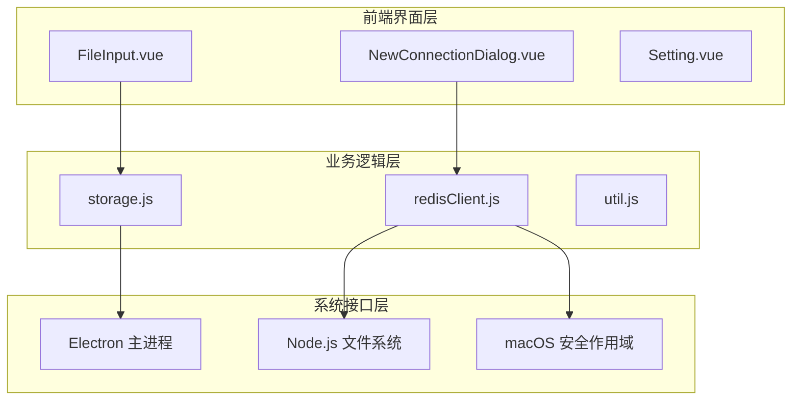
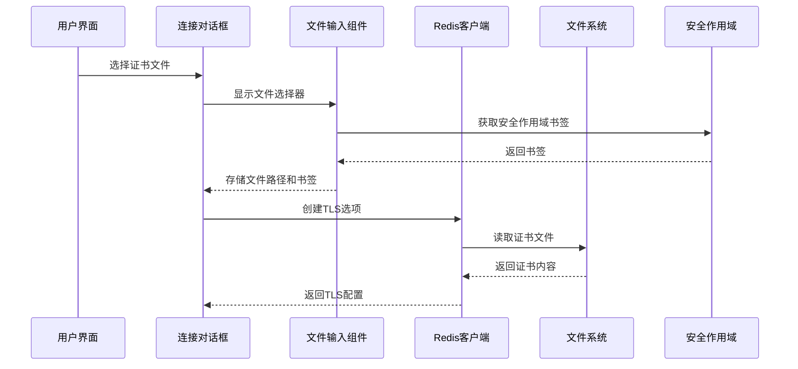
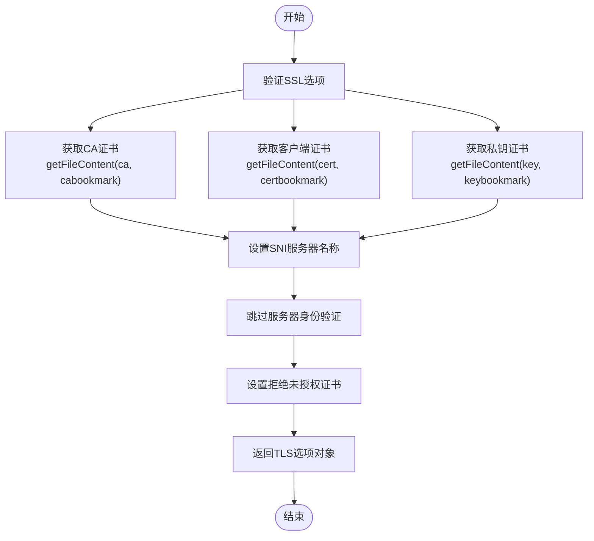
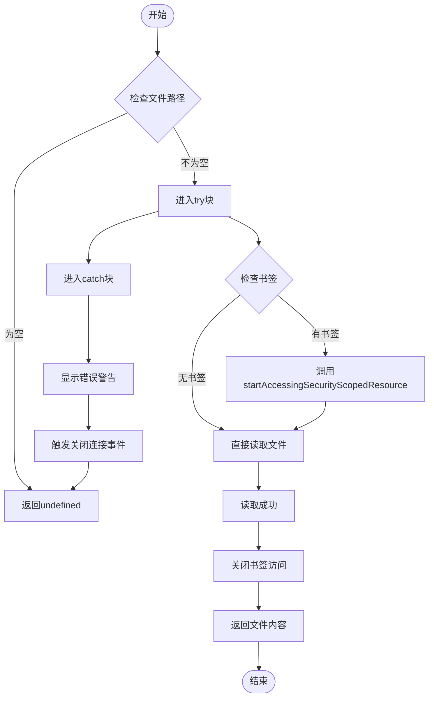
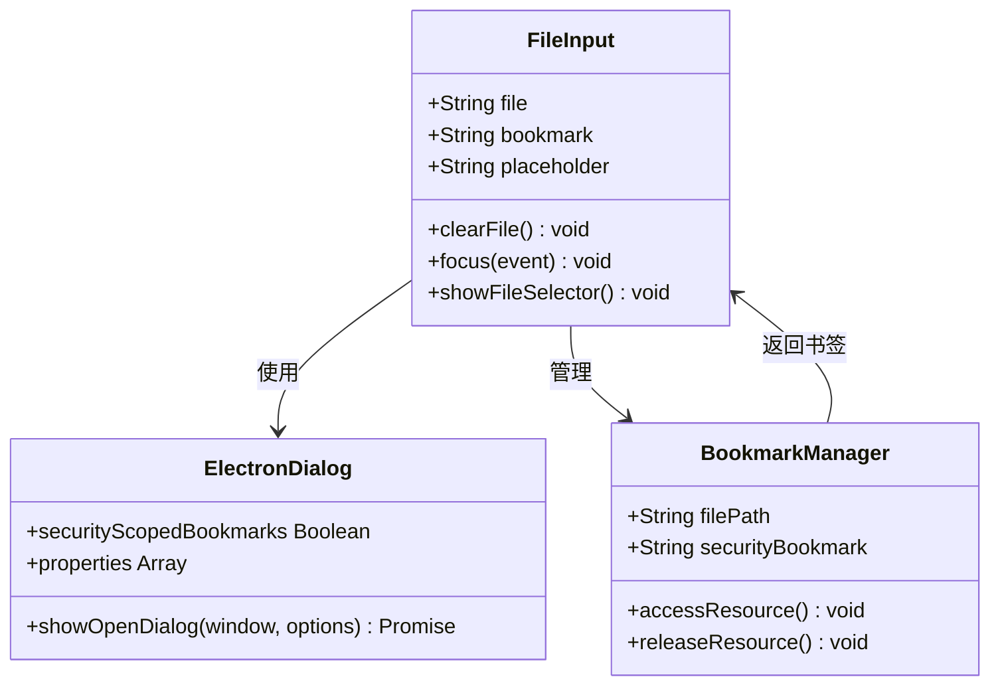
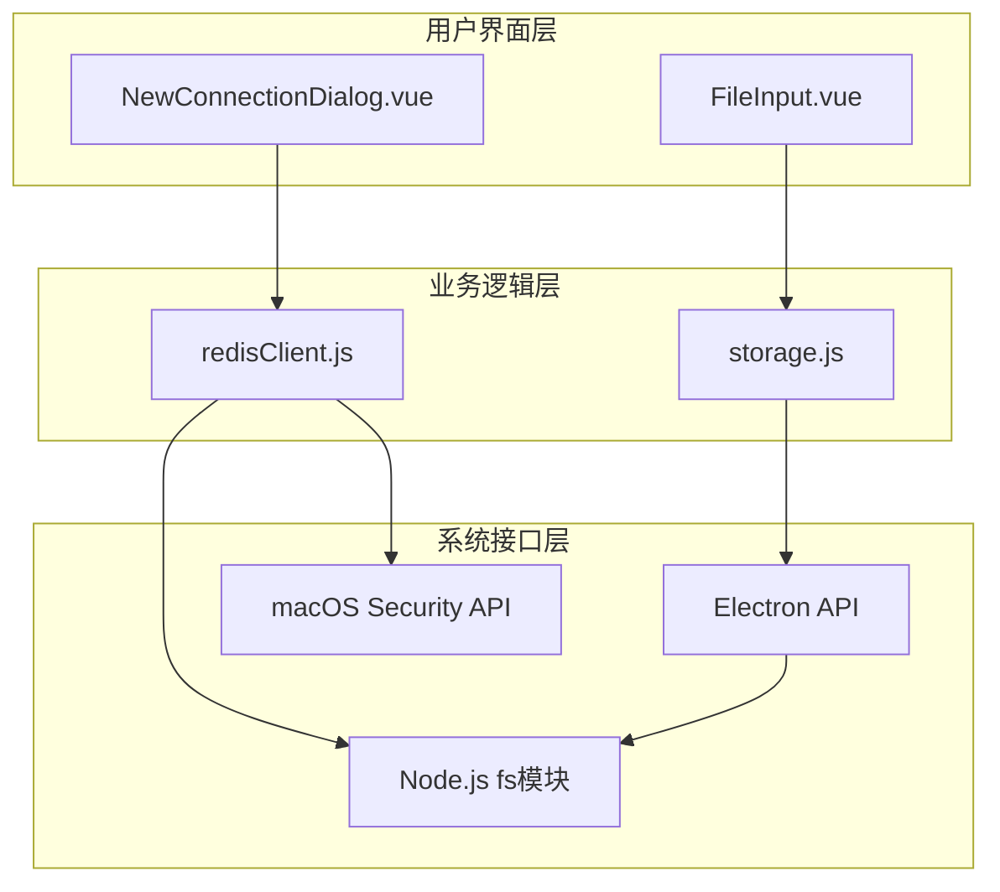

# 证书配置

<cite>
**本文档引用的文件**
- [redisClient.js](file://src/redisClient.js)
- [storage.js](file://src/storage.js)
- [util.js](file://src/util.js)
- [NewConnectionDialog.vue](file://src/components/NewConnectionDialog.vue)
- [FileInput.vue](file://src/components/FileInput.vue)
- [README.md](file://README.md)
</cite>

## 目录
1. [简介](#简介)
2. [项目结构概览](#项目结构概览)
3. [核心组件分析](#核心组件分析)
4. [架构概览](#架构概览)
5. [详细组件分析](#详细组件分析)
6. [依赖关系分析](#依赖关系分析)
7. [性能考虑](#性能考虑)
8. [故障排除指南](#故障排除指南)
9. [结论](#结论)

## 简介

Another Redis Desktop Manager (ARDM) 是一个跨平台的 Redis 桌面管理工具，支持在 Linux、Windows 和 macOS 上运行。该应用程序提供了强大的 SSL/TLS 连接功能，允许用户通过加密通道安全地连接到 Redis 服务器。本文档详细解析了 ARDM 中 SSL/TLS 证书配置机制，重点关注 `redisClient.js` 中的 `getTLSOptions` 函数如何安全读取和处理证书文件，以及如何在 macOS 应用沙盒环境下处理安全作用域资源访问。

## 项目结构概览

ARDM 采用 Electron 架构构建，主要包含以下关键模块：



**图表来源**
- [NewConnectionDialog.vue](file://src/components/NewConnectionDialog.vue#L1-L50)
- [redisClient.js](file://src/redisClient.js#L1-L50)
- [storage.js](file://src/storage.js#L1-L50)

## 核心组件分析

### SSL/TLS 配置数据结构

ARDM 使用标准化的 SSL/TLS 配置对象来管理证书设置：

| 配置项 | 类型 | 描述 | 必需 |
|--------|------|------|------|
| `ca` | 字符串 | CA 证书文件路径 | 否 |
| `cert` | 字符串 | 客户端公钥证书文件路径 | 否 |
| `key` | 字符串 | 客户端私钥证书文件路径 | 否 |
| `servername` | 字符串 | SNI (Server Name Indication) 服务器名称 | 否 |
| `rejectUnauthorized` | 布尔值 | 是否拒绝未经授权的证书 | 否 |

**章节来源**
- [redisClient.js](file://src/redisClient.js#L325-L342)
- [NewConnectionDialog.vue](file://src/components/NewConnectionDialog.vue#L146-L174)

## 架构概览

SSL/TLS 证书配置系统采用分层架构设计，确保安全性与易用性的平衡：



**图表来源**
- [NewConnectionDialog.vue](file://src/components/NewConnectionDialog.vue#L146-L174)
- [FileInput.vue](file://src/components/FileInput.vue#L32-L46)
- [redisClient.js](file://src/redisClient.js#L357-L379)

## 详细组件分析

### getTLSOptions 函数实现

`getTLSOptions` 函数是 SSL/TLS 配置的核心入口点，负责将用户提供的证书文件路径转换为 Redis 客户端可识别的 TLS 选项：



**图表来源**
- [redisClient.js](file://src/redisClient.js#L325-L342)

#### 关键特性

1. **安全文件读取**: 使用 `getFileContent` 方法安全读取证书文件
2. **SNI 支持**: 允许指定服务器名称指示
3. **灵活的身份验证**: 可配置是否拒绝未授权的证书
4. **错误处理**: 提供完善的异常处理机制

**章节来源**
- [redisClient.js](file://src/redisClient.js#L325-L342)

### getFileContent 方法详解

`getFileContent` 方法实现了安全的证书文件读取机制，特别针对 macOS 应用沙盒环境进行了优化：



**图表来源**
- [redisClient.js](file://src/redisClient.js#L357-L379)

#### macOS 沙盒环境适配

对于 macOS App Store 版本，系统实现了特殊的安全作用域资源访问机制：

1. **书签机制**: 使用 `remote.app.startAccessingSecurityScopedResource(bookmark)` 获取临时访问权限
2. **自动清理**: 在文件读取完成后自动关闭安全作用域访问
3. **异常处理**: 完善的错误捕获和用户提示机制

**章节来源**
- [redisClient.js](file://src/redisClient.js#L362-L379)

### FileInput 组件集成

FileInput 组件提供了用户友好的证书文件选择界面，并集成了安全作用域书签功能：



**图表来源**
- [FileInput.vue](file://src/components/FileInput.vue#L15-L49)

**章节来源**
- [FileInput.vue](file://src/components/FileInput.vue#L1-L49)

### 存储机制设计

storage.js 负责持久化存储证书文件路径，而不是证书内容本身，确保敏感信息的安全性：

| 存储类型 | 数据格式 | 安全级别 | 用途 |
|----------|----------|----------|------|
| 证书路径 | 字符串 | 高 | 存储文件系统路径 |
| 书签信息 | 字符串 | 高 | macOS 安全作用域标识 |
| TLS 配置 | 对象 | 中 | 完整的 SSL/TLS 设置 |

**章节来源**
- [storage.js](file://src/storage.js#L1-L339)

## 依赖关系分析

SSL/TLS 证书配置系统的依赖关系展现了清晰的分层架构：



**图表来源**
- [redisClient.js](file://src/redisClient.js#L1-L10)
- [storage.js](file://src/storage.js#L1-L5)

### 外部依赖

1. **ioredis**: Redis 客户端库，提供 TLS 支持
2. **tunnel-ssh**: SSH 隧道支持
3. **electron**: 跨平台桌面应用框架
4. **fs**: Node.js 文件系统模块

**章节来源**
- [redisClient.js](file://src/redisClient.js#L1-L10)

## 性能考虑

### 文件读取优化

1. **延迟加载**: 仅在需要时读取证书文件
2. **缓存策略**: 利用 Electron 的内存缓存机制
3. **异步处理**: 非阻塞的文件操作

### 内存管理

1. **及时释放**: 读取完成后立即释放安全作用域访问
2. **错误恢复**: 异常情况下确保资源正确清理
3. **最小权限**: 仅在必要时获取文件访问权限

## 故障排除指南

### 常见问题及解决方案

#### 1. macOS 权限错误

**症状**: 文件选择器无法访问某些目录
**原因**: macOS 应用沙盒限制
**解决方案**: 
- 使用 FileInput 组件的书签功能
- 确保证书文件位于受信任的目录

#### 2. 证书格式错误

**症状**: 连接失败，提示证书无效
**原因**: PEM 格式不正确或文件损坏
**解决方案**:
- 验证证书文件格式
- 确保证书内容完整

#### 3. SNI 配置问题

**症状**: 服务器名称验证失败
**原因**: SNI 服务器名称不匹配
**解决方案**:
- 检查服务器证书的 CN 或 SAN
- 正确配置 `servername` 参数

**章节来源**
- [redisClient.js](file://src/redisClient.js#L373-L378)

### 配置示例

#### 单向认证配置

```javascript
// SSL/TLS 配置示例
const sslOptions = {
  ca: '/path/to/ca.crt',
  rejectUnauthorized: true,
  servername: 'redis.example.com'
};
```

#### 双向认证配置

```javascript
// SSL/TLS 配置示例
const sslOptions = {
  ca: '/path/to/ca.crt',
  cert: '/path/to/client.crt',
  key: '/path/to/client.key',
  rejectUnauthorized: true,
  servername: 'redis.example.com'
};
```

## 结论

Another Redis Desktop Manager 的 SSL/TLS 证书配置系统展现了现代桌面应用在安全性与用户体验之间的精妙平衡。通过分层架构设计、安全作用域资源管理和智能的文件读取机制，该系统不仅提供了强大的加密连接能力，还确保了敏感信息的安全存储和传输。

### 主要优势

1. **安全性**: 证书内容不存储在本地，仅存储文件路径
2. **兼容性**: 支持跨平台部署，特别是 macOS 沙盒环境
3. **易用性**: 直观的用户界面和智能的文件选择机制
4. **灵活性**: 支持单向和双向认证模式

### 最佳实践建议

1. **定期更新**: 及时更新证书文件以保持安全性
2. **权限控制**: 限制证书文件的访问权限
3. **备份策略**: 定期备份证书文件和配置
4. **监控日志**: 监控 SSL/TLS 连接状态和错误

该证书配置机制为 Redis 客户端提供了可靠的安全通信基础，是现代数据库管理工具的重要组成部分。