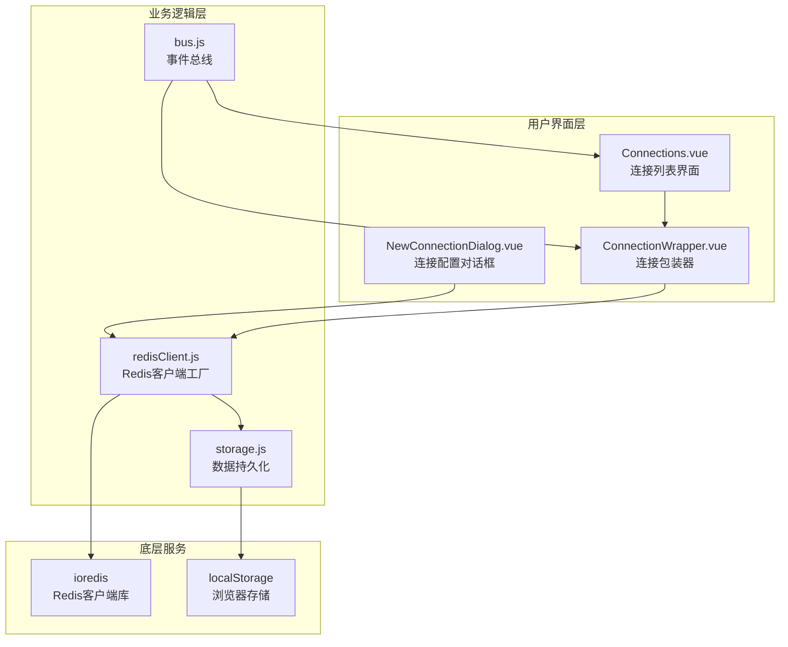
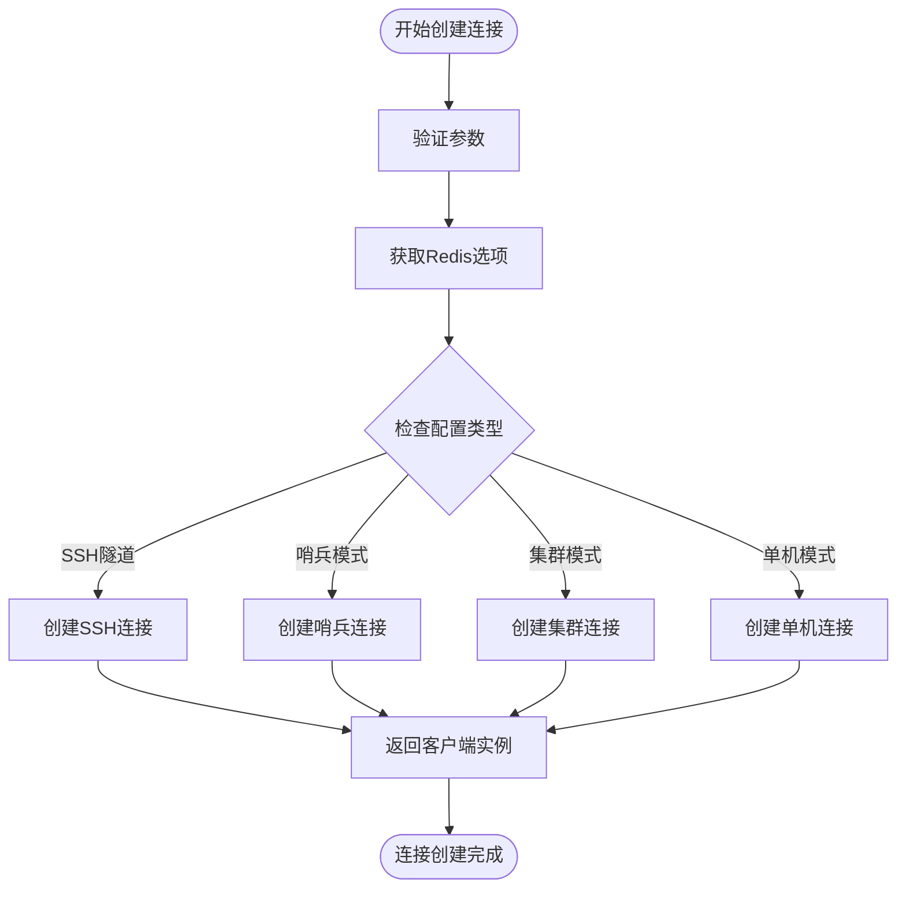
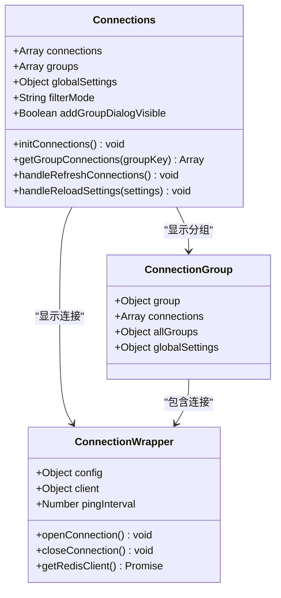
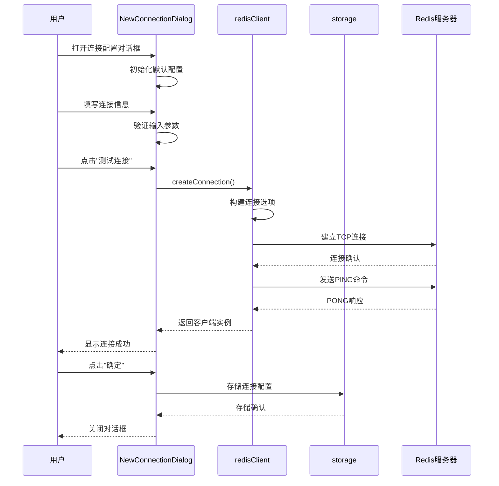
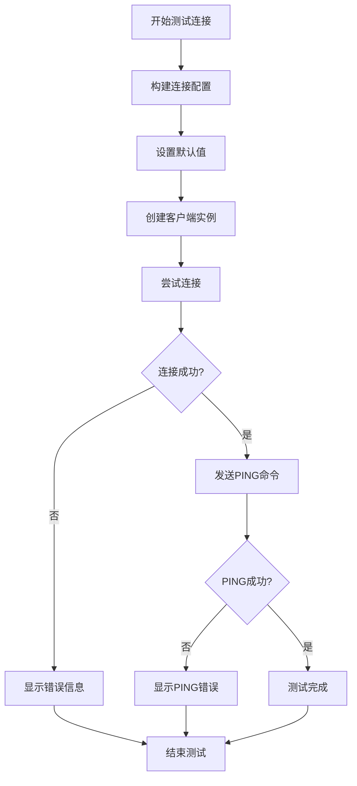
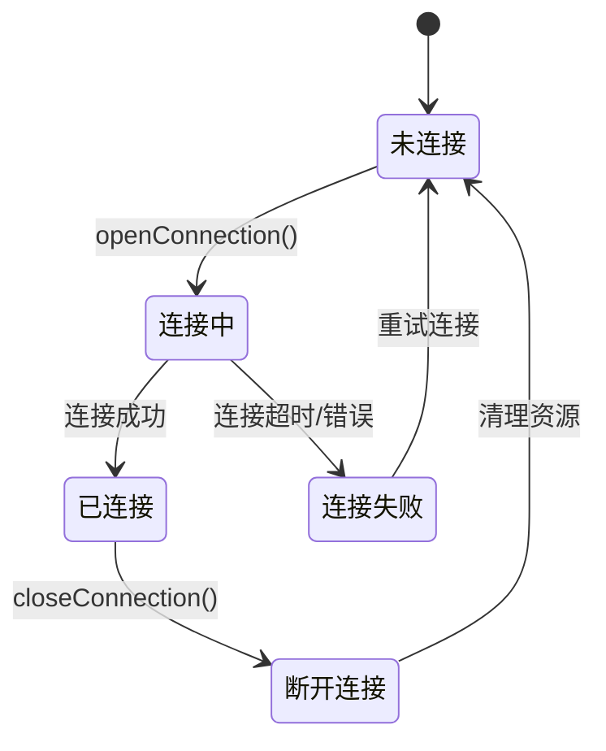
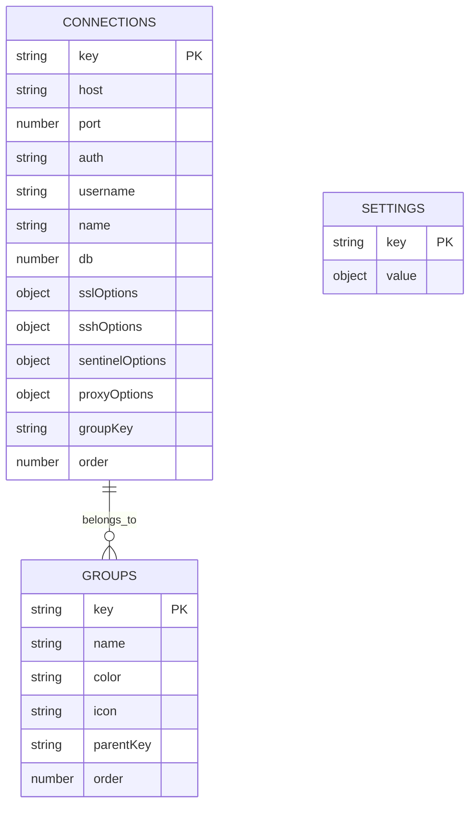
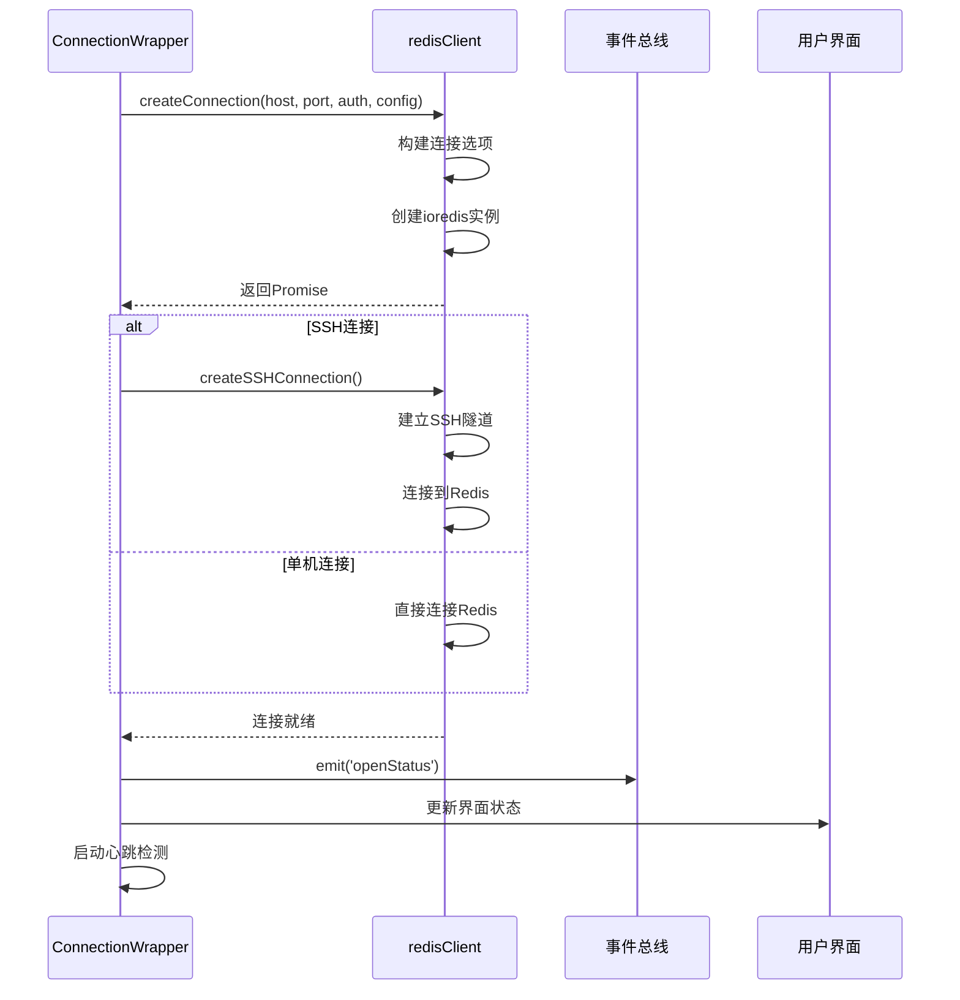
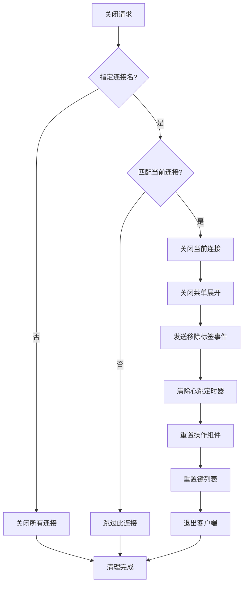
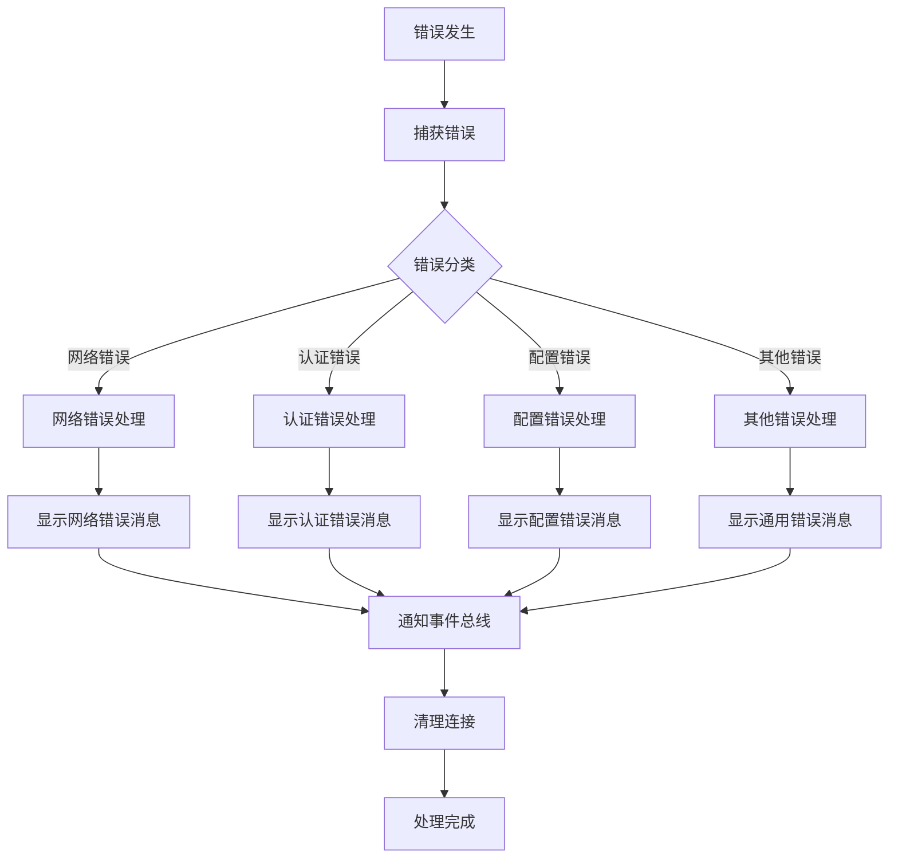

# 单机连接

<cite>
**本文档中引用的文件**
- [redisClient.js](file://src/redisClient.js)
- [Connections.vue](file://src/components/Connections.vue)
- [NewConnectionDialog.vue](file://src/components/NewConnectionDialog.vue)
- [ConnectionWrapper.vue](file://src/components/ConnectionWrapper.vue)
- [storage.js](file://src/storage.js)
- [bus.js](file://src/bus.js)
- [main.js](file://src/main.js)
- [util.js](file://src/util.js)
</cite>

## 目录
1. [简介](#简介)
2. [系统架构概览](#系统架构概览)
3. [核心组件分析](#核心组件分析)
4. [连接配置与创建机制](#连接配置与创建机制)
5. [UI界面设计与交互](#ui界面设计与交互)
6. [数据持久化机制](#数据持久化机制)
7. [连接生命周期管理](#连接生命周期管理)
8. [错误处理与状态通知](#错误处理与状态通知)
9. [操作示例与最佳实践](#操作示例与最佳实践)
10. [扩展开发指南](#扩展开发指南)

## 简介

Another Redis Desktop Manager (ARDM) 是一个功能强大的Redis桌面管理工具，支持多种连接模式，其中单机连接是最基础也是最常用的连接方式。本文档详细解析了ARDM中单机Redis连接的配置、创建、管理和维护机制，为开发者提供深入的技术理解和实用的操作指导。

单机连接是指直接连接到单一Redis服务器实例的连接方式，不涉及集群、哨兵或SSH隧道等复杂场景。这种连接方式简单直观，适合大多数日常开发和运维场景。

## 系统架构概览

ARDM采用模块化的架构设计，单机连接功能主要由以下几个核心模块组成：



**图表来源**
- [Connections.vue](file://src/components/Connections.vue#L1-L326)
- [NewConnectionDialog.vue](file://src/components/NewConnectionDialog.vue#L1-L772)
- [ConnectionWrapper.vue](file://src/components/ConnectionWrapper.vue#L1-L263)
- [redisClient.js](file://src/redisClient.js#L1-L381)
- [storage.js](file://src/storage.js#L1-L329)

## 核心组件分析

### redisClient.js - 连接工厂

redisClient.js是整个连接系统的核心，负责创建和管理各种类型的Redis连接。对于单机连接，主要通过`createConnection`方法实现。

#### createConnection方法详解



**图表来源**
- [redisClient.js](file://src/redisClient.js#L52-L87)

该方法接受以下关键参数：
- `host`: Redis服务器主机地址
- `port`: Redis服务器端口号  
- `auth`: 认证密码
- `config`: 完整的连接配置对象
- `promise`: 是否返回Promise
- `forceStandalone`: 强制使用单机模式
- `removeDb`: 移除数据库索引

#### getRedisOptions方法

这是单机连接的核心配置生成器，负责构建ioredis客户端所需的连接选项：

| 配置项 | 类型 | 默认值 | 描述 |
|--------|------|--------|------|
| host | string | 必需 | Redis服务器主机名或IP地址 |
| port | number | 必需 | Redis服务器端口号 |
| family | number | 0 | 网络协议族 (0: IPv4和IPv6, 4: IPv4, 6: IPv6) |
| connectTimeout | number | 30000 | 连接超时时间(毫秒) |
| retryStrategy | function | 自动重试 | 连接失败时的重试策略 |
| connectionName | string | null | 连接名称标识 |
| password | string | null | Redis访问密码 |
| db | number | undefined | 数据库索引 |
| username | string | undefined | ACL用户名 |
| tls | object | undefined | TLS/SSL配置 |
| connectionReadOnly | boolean | undefined | 只读模式 |

**节来源**
- [redisClient.js](file://src/redisClient.js#L203-L222)

### Connections.vue - 连接管理界面

Connections.vue组件负责显示和管理所有已保存的连接，包括单机连接和其他类型的连接。

#### 组件结构与数据流



**图表来源**
- [Connections.vue](file://src/components/Connections.vue#L100-L262)
- [ConnectionWrapper.vue](file://src/components/ConnectionWrapper.vue#L43-L241)

**节来源**
- [Connections.vue](file://src/components/Connections.vue#L100-L162)

### NewConnectionDialog.vue - 连接配置界面

NewConnectionDialog.vue是一个复杂的多标签配置对话框，支持单机连接的所有配置选项。

#### 配置标签页结构

| 标签页 | 功能描述 | 主要配置项 |
|--------|----------|------------|
| 基础配置 | 主机、端口、认证信息 | host, port, auth, username |
| 高级配置 | 超时、视图、过滤器 | connectionTimeout, executeTimeout, defaultView |
| 数据库别名 | DB索引到名称映射 | dbAliases |
| SSL/TLS | 加密连接配置 | sslOptions |
| SSH隧道 | SSH代理连接 | sshOptions |
| 哨兵模式 | Redis哨兵高可用 | sentinelOptions |
| 集群模式 | Redis集群连接 | cluster |
| 网络代理 | 代理服务器配置 | proxyOptions |

**节来源**
- [NewConnectionDialog.vue](file://src/components/NewConnectionDialog.vue#L389-L400)

## 连接配置与创建机制

### 单机连接的创建流程

单机连接的创建遵循严格的验证和配置流程：



**图表来源**
- [NewConnectionDialog.vue](file://src/components/NewConnectionDialog.vue#L456-L471)
- [redisClient.js](file://src/redisClient.js#L52-L87)

### 连接参数处理逻辑

#### 默认值设置机制

系统为每个连接参数设置了合理的默认值：

```javascript
// NewConnectionDialog.vue 中的默认配置
connection: {
  host: '',
  port: '',
  auth: '',
  username: '',
  name: '',
  separator: ':',
  protocol: 'tcp',
  cluster: false,
  connectionReadOnly: false,
  groupKey: '',
  keysPattern: '*',
  connectionTimeout: 60,
  executeTimeout: 60,
  defaultView: 'tree',
  scanCount: 10000,
  dbFilterMode: 'all',
  dbFilterList: '',
  markColor: '',
  dbAliases: [],
  sshOptions: {
    host: '',
    port: 22,
    username: '',
    password: '',
    privatekey: '',
    passphrase: '',
    timeout: 30,
  },
  sslOptions: {
    key: '',
    cert: '',
    ca: '',
    servername: '',
    rejectUnauthorized: false,
  },
  sentinelOptions: {
    masterName: 'mymaster',
    nodePassword: '',
  },
  proxyOptions: {
    type: 'socks5',
    host: '',
    port: 1080,
    username: '',
    password: '',
  },
}
```

#### 输入验证与格式化

系统对用户输入进行严格的验证和格式化：

1. **主机地址验证**: 支持IPv4、IPv6和域名格式
2. **端口范围检查**: 1-65535的有效端口号
3. **密码安全性**: 支持明文和加密存储
4. **数据库索引**: 0-15的整数范围
5. **超时时间**: 最小1秒，最大3600秒

**节来源**
- [NewConnectionDialog.vue](file://src/components/NewConnectionDialog.vue#L321-L367)

### 连接测试机制

连接测试是确保配置正确性的重要环节：



**图表来源**
- [NewConnectionDialog.vue](file://src/components/NewConnectionDialog.vue#L456-L469)

**节来源**
- [NewConnectionDialog.vue](file://src/components/NewConnectionDialog.vue#L456-L469)

## UI界面设计与交互

### 连接表单的UI设计

NewConnectionDialog.vue采用了现代化的卡片式布局设计，提供了直观的用户体验：

#### 表单布局特点

1. **标签导航**: 左侧垂直导航栏，右侧内容区域
2. **响应式设计**: 支持不同屏幕尺寸的自适应布局
3. **视觉层次**: 清晰的标题、子标题和内容区域划分
4. **交互反馈**: 实时的输入验证和状态提示

#### 字段验证与提示

| 字段类型 | 验证规则 | 错误提示 | 用户体验 |
|----------|----------|----------|----------|
| 主机地址 | 非空验证 | "主机地址不能为空" | 实时提示 |
| 端口号 | 数字范围(1-65535) | "请输入有效的端口号" | 数字输入框 |
| 密码字段 | 可选验证 | 无强制要求 | 明文/隐藏切换 |
| 数据库索引 | 整数范围(0-15) | "数据库索引无效" | 下拉选择 |
| 超时设置 | 正整数 | "超时时间必须为正整数" | 数字输入 |

**节来源**
- [NewConnectionDialog.vue](file://src/components/NewConnectionDialog.vue#L456-L495)

### 数据绑定机制

Vue.js的双向数据绑定确保了表单数据与组件状态的同步：

```javascript
// 双向绑定示例
<el-input v-model="connection.host" autocomplete="off"></el-input>
<el-input v-model="connection.port" autocomplete="off" placeholder="6379"></el-input>
<InputPassword v-model="connection.auth" :hidepass="editMode" placeholder="Auth"></InputPassword>
<el-input v-model="connection.username" :placeholder="$t('message.redis_username_tip')"></el-input>
```

这种设计使得：
- 用户输入实时反映在组件状态中
- 组件状态变化自动更新到UI
- 提供一致的数据流管理

**节来源**
- [NewConnectionDialog.vue](file://src/components/NewConnectionDialog.vue#L25-L43)

### 连接状态管理

ConnectionWrapper.vue负责管理单个连接的状态和生命周期：

#### 状态跟踪机制



**图表来源**
- [ConnectionWrapper.vue](file://src/components/ConnectionWrapper.vue#L84-L127)

**节来源**
- [ConnectionWrapper.vue](file://src/components/ConnectionWrapper.vue#L44-L193)

## 数据持久化机制

### localStorage存储策略

storage.js模块负责将连接配置持久化到浏览器的localStorage中：

#### 存储结构设计



**图表来源**
- [storage.js](file://src/storage.js#L185-L255)

#### 连接配置存储

连接配置以JSON格式存储在`localStorage.connections`中：

```javascript
// 示例连接配置
{
  "connection_1640995200000_abcde": {
    "host": "127.0.0.1",
    "port": 6379,
    "auth": "",
    "username": "",
    "name": "本地开发",
    "db": 0,
    "separator": ":",
    "keysPattern": "*",
    "connectionTimeout": 60,
    "executeTimeout": 60,
    "defaultView": "tree",
    "scanCount": 10000,
    "dbFilterMode": "all",
    "dbFilterList": "",
    "markColor": "",
    "dbAliases": [],
    "groupKey": "",
    "order": 1
  }
}
```

**节来源**
- [storage.js](file://src/storage.js#L185-L255)

### 连接分组管理

系统支持层次化的连接分组，便于组织和管理大量连接：

#### 分组特性

1. **层次结构**: 支持最多3级嵌套分组
2. **颜色标记**: 每个分组可设置独特的颜色标识
3. **图标支持**: 可上传自定义图标
4. **排序功能**: 支持拖拽排序

#### 分组存储格式

```javascript
// 分组配置示例
{
  "group_1640995200000_abcde": {
    "key": "group_1640995200000_abcde",
    "name": "开发环境",
    "color": "#409EFF",
    "icon": "",
    "parentKey": "",
    "order": 1
  }
}
```

**节来源**
- [storage.js](file://src/storage.js#L7-L89)

## 连接生命周期管理

### 连接建立过程

ConnectionWrapper.vue中的`getRedisClient`方法是连接建立的核心：



**图表来源**
- [ConnectionWrapper.vue](file://src/components/ConnectionWrapper.vue#L157-L193)
- [redisClient.js](file://src/redisClient.js#L52-L87)

### 心跳检测机制

系统实现了定期的心跳检测来监控连接状态：

```javascript
// 心跳检测配置
pingInterval: 10000, // 10秒间隔
startPingInterval() {
  this.pingTimer = setInterval(() => {
    this.client && this.client.ping().then((reply) => {}).catch((e) => {
      // 处理心跳失败
    });
  }, this.pingInterval);
}
```

这种机制能够及时发现连接中断问题，提升用户体验。

**节来源**
- [ConnectionWrapper.vue](file://src/components/ConnectionWrapper.vue#L150-L155)

### 连接关闭与清理

当连接不再需要时，系统会执行完整的清理流程：



**图表来源**
- [ConnectionWrapper.vue](file://src/components/ConnectionWrapper.vue#L129-L148)

**节来源**
- [ConnectionWrapper.vue](file://src/components/ConnectionWrapper.vue#L129-L148)

## 错误处理与状态通知

### 错误分类与处理

系统对不同类型的错误进行了分类处理：

#### 连接错误类型

| 错误类型 | 触发条件 | 处理方式 | 用户提示 |
|----------|----------|----------|----------|
| 连接超时 | TCP连接超过设定时间 | 自动重试3次 | "连接超时，请检查网络" |
| 认证失败 | 密码或用户名错误 | 立即停止重试 | "认证失败，请检查凭据" |
| 主机不可达 | DNS解析失败或网络不通 | 显示具体错误信息 | "无法连接到主机" |
| 端口拒绝 | Redis服务未运行或防火墙阻止 | 显示端口相关错误 | "端口被拒绝连接" |
| SSL/TLS错误 | 证书验证失败 | 提供SSL配置建议 | "SSL连接失败" |

#### 错误处理流程



**图表来源**
- [ConnectionWrapper.vue](file://src/components/ConnectionWrapper.vue#L179-L190)

**节来源**
- [ConnectionWrapper.vue](file://src/components/ConnectionWrapper.vue#L179-L190)

### 事件总线通信

bus.js提供了全局的事件通信机制：

#### 核心事件类型

```javascript
// 事件总线接口
export default {
  $on(...event) { eventHub.$on(...event); },      // 订阅事件
  $off(...event) { eventHub.$off(...event); },    // 取消订阅
  $once(...event) { eventHub.$once(...event); },  // 一次性订阅
  $emit(...event) { eventHub.$emit(...event); },  // 发布事件
}
```

#### 连接相关事件

| 事件名称 | 触发时机 | 参数 | 用途 |
|----------|----------|------|------|
| openConnection | 打开特定连接 | connectionName | 切换到指定连接 |
| closeConnection | 关闭连接 | connectionName | 关闭指定连接或所有连接 |
| refreshConnections | 刷新连接列表 | 无 | 重新加载所有连接 |
| openStatus | 连接状态变更 | client, connectionName | 更新状态指示器 |
| removeAllTab | 移除所有标签 | connectionName | 关闭相关标签页 |

**节来源**
- [bus.js](file://src/bus.js#L1-L19)
- [main.js](file://src/main.js#L15-L17)

## 操作示例与最佳实践

### 快速连接本地Redis实例

以下是连接本地Redis实例的完整操作示例：

#### 步骤1：打开连接配置对话框

1. 在主界面左侧连接列表区域点击"+"按钮
2. 选择"新建连接"选项
3. 系统自动打开连接配置对话框

#### 步骤2：填写基本连接信息

```javascript
// 默认配置示例
{
  name: "本地Redis",           // 连接名称
  host: "127.0.0.1",          // 主机地址
  port: 6379,                 // 端口号
  auth: "",                   // 密码（如果有的话）
  username: "",               // 用户名（ACL支持）
  protocol: "tcp"             // 协议类型
}
```

#### 步骤3：测试连接

1. 点击"测试连接"按钮
2. 系统会尝试建立连接并发送PING命令
3. 如果连接成功，会显示"连接成功"的消息

#### 步骤4：保存连接

1. 点击"确定"按钮保存配置
2. 连接会出现在连接列表中
3. 可以立即双击连接进入Redis管理界面

### 常见配置场景

#### 开发环境配置

```javascript
// 开发环境典型配置
{
  name: "开发服务器",
  host: "dev.redis.example.com",
  port: 6379,
  auth: "development_password",
  db: 0,
  connectionTimeout: 30,
  executeTimeout: 60,
  defaultView: "tree",
  scanCount: 5000
}
```

#### 生产环境配置

```javascript
// 生产环境安全配置
{
  name: "生产环境",
  host: "prod.redis.example.com",
  port: 6379,
  auth: "production_password",
  sslOptions: {
    ca: "/path/to/ca.crt",
    cert: "/path/to/client.crt",
    key: "/path/to/client.key",
    rejectUnauthorized: true
  },
  connectionTimeout: 10,
  executeTimeout: 30
}
```

#### 集群环境配置

```javascript
// Redis集群配置
{
  name: "Redis集群",
  host: "cluster.redis.example.com",
  port: 7000,
  cluster: true,
  connectionReadOnly: false
}
```

### 连接故障排除指南

#### 连接超时问题

**症状**: 连接建立缓慢或超时
**原因分析**:
- 网络延迟过高
- Redis服务器负载过大
- 防火墙规则限制

**解决方案**:
1. 检查网络连通性：`ping redis-server`
2. 调整超时设置：增加`connectionTimeout`值
3. 使用本地回环地址测试
4. 检查Redis服务器性能指标

#### 认证失败问题

**症状**: 连接建立但无法执行命令
**原因分析**:
- 密码错误
- 用户名不存在
- ACL权限不足

**解决方案**:
1. 验证密码是否正确
2. 检查Redis ACL配置
3. 使用管理员账户测试
4. 查看Redis日志获取详细错误信息

#### SSL连接问题

**症状**: SSL握手失败
**原因分析**:
- 证书链不完整
- 证书过期
- 协议版本不匹配

**解决方案**:
1. 验证证书有效性
2. 检查证书链完整性
3. 确认服务器支持的TLS版本
4. 测试证书文件路径

## 扩展开发指南

### 自定义连接参数

开发者可以通过修改配置对象来添加自定义参数：

#### 添加新的配置选项

```javascript
// 在NewConnectionDialog.vue中添加新配置
data() {
  return {
    connection: {
      // 现有配置...
      customParam: '',           // 新增自定义参数
      customEnabled: false,      // 新增开关选项
      advancedSettings: {       // 新增复杂配置对象
        option1: true,
        option2: 'default',
        option3: 100
      }
    }
  }
}
```

#### 修改redisClient.js以支持新参数

```javascript
// 在getRedisOptions方法中添加处理逻辑
getRedisOptions(host, port, auth, config) {
  const options = {
    // 现有选项...
    customParam: config.customParam,
    advancedOption: config.advancedSettings.option1
  };
  
  // 添加自定义参数验证
  if (config.customEnabled && !config.customParam) {
    throw new Error('自定义参数不能为空');
  }
  
  return options;
}
```

### 扩展现有功能

#### 添加新的连接类型

1. **扩展配置界面**: 在NewConnectionDialog.vue中添加新标签页
2. **修改连接创建逻辑**: 在redisClient.js中添加新的连接类型处理
3. **更新UI组件**: 在Connections.vue中添加相应的显示逻辑

#### 实现连接池管理

```javascript
// 连接池管理示例
class ConnectionPool {
  constructor(maxConnections = 10) {
    this.maxConnections = maxConnections;
    this.pool = [];
    this.inUse = new Set();
  }
  
  async getConnection(config) {
    // 实现连接池逻辑
    let client;
    
    if (this.pool.length > 0) {
      client = this.pool.pop();
    } else {
      client = await redisClient.createConnection(
        config.host, config.port, config.auth, config
      );
    }
    
    this.inUse.add(client);
    return client;
  }
  
  releaseConnection(client) {
    if (this.inUse.has(client)) {
      this.inUse.delete(client);
      
      if (this.pool.length < this.maxConnections) {
        this.pool.push(client);
      } else {
        client.quit();
      }
    }
  }
}
```

### 性能优化建议

#### 连接复用策略

```javascript
// 连接复用示例
const connectionCache = new Map();

function getCachedConnection(config) {
  const cacheKey = JSON.stringify({
    host: config.host,
    port: config.port,
    db: config.db
  });
  
  if (connectionCache.has(cacheKey)) {
    const cached = connectionCache.get(cacheKey);
    if (cached.status === 'ready') {
      return cached;
    }
  }
  
  // 创建新连接
  const client = redisClient.createConnection(config.host, config.port, config.auth, config);
  connectionCache.set(cacheKey, client);
  return client;
}
```

#### 批量操作优化

```javascript
// 批量操作示例
async function batchOperations(commands) {
  const client = await getConnection();
  
  try {
    // 使用pipeline提高效率
    const pipeline = client.pipeline();
    
    commands.forEach(cmd => {
      pipeline[cmd.method](...cmd.args);
    });
    
    const results = await pipeline.exec();
    return results;
  } finally {
    client.release();
  }
}
```

**节来源**
- [redisClient.js](file://src/redisClient.js#L52-L87)
- [NewConnectionDialog.vue](file://src/components/NewConnectionDialog.vue#L321-L367)

## 结论

Another Redis Desktop Manager的单机连接功能展现了现代桌面应用在数据库连接管理方面的最佳实践。通过模块化的架构设计、完善的错误处理机制和友好的用户界面，系统为用户提供了稳定可靠的Redis连接体验。

关键技术特点包括：
- **灵活的配置系统**: 支持多种连接参数和高级配置选项
- **强大的错误处理**: 分类处理不同类型的连接错误
- **优雅的用户界面**: 直观的表单设计和实时反馈机制
- **可靠的数据持久化**: 基于localStorage的安全配置存储
- **完善的生命周期管理**: 从创建到销毁的全过程控制

对于开发者而言，理解这些机制不仅有助于更好地使用工具，也为开发类似的数据库管理应用提供了宝贵的参考。随着Redis生态系统的不断发展，这些基础功能将继续演进，为用户提供更加丰富和高效的数据库管理体验。