# 哨兵连接

<cite>
**本文档引用的文件**
- [redisClient.js](file://src/redisClient.js)
- [storage.js](file://src/storage.js)
- [Connections.vue](file://src/components/Connections.vue)
- [NewConnectionDialog.vue](file://src/components/NewConnectionDialog.vue)
- [addon.js](file://src/addon.js)
- [ConnectionMenu.vue](file://src/components/ConnectionMenu.vue)
</cite>

## 目录
1. [简介](#简介)
2. [项目结构概览](#项目结构概览)
3. [核心组件分析](#核心组件分析)
4. [哨兵连接架构](#哨兵连接架构)
5. [详细组件分析](#详细组件分析)
6. [配置存储机制](#配置存储机制)
7. [连接流程详解](#连接流程详解)
8. [故障处理与恢复](#故障处理与恢复)
9. [性能考虑](#性能考虑)
10. [故障排除指南](#故障排除指南)
11. [总结](#总结)

## 简介

Another Redis Desktop Manager (ARDM) 提供了对Redis哨兵模式的完整支持，允许用户连接到由多个哨兵服务器组成的高可用Redis架构。哨兵模式是Redis官方提供的高可用解决方案，能够自动监控主从节点状态，并在主节点故障时自动进行故障转移。

本文档深入分析了ARDM中哨兵连接功能的实现，包括连接创建、配置管理、故障处理和监控机制。

## 项目结构概览

ARDM的哨兵连接功能主要分布在以下核心模块中：

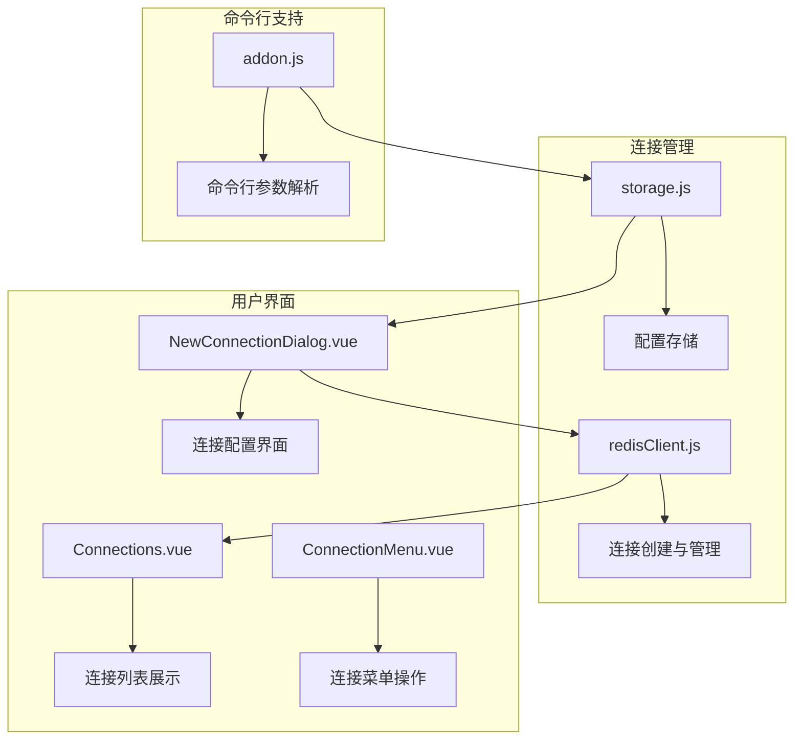

**图表来源**
- [redisClient.js](file://src/redisClient.js#L51-L87)
- [storage.js](file://src/storage.js#L182-L220)
- [NewConnectionDialog.vue](file://src/components/NewConnectionDialog.vue#L312-L375)

## 核心组件分析

### redisClient.js - 连接核心

`redisClient.js`是整个哨兵连接功能的核心，负责创建和管理Redis连接。

#### createConnection方法

该方法是连接创建的入口点，根据不同的配置类型选择相应的连接策略：

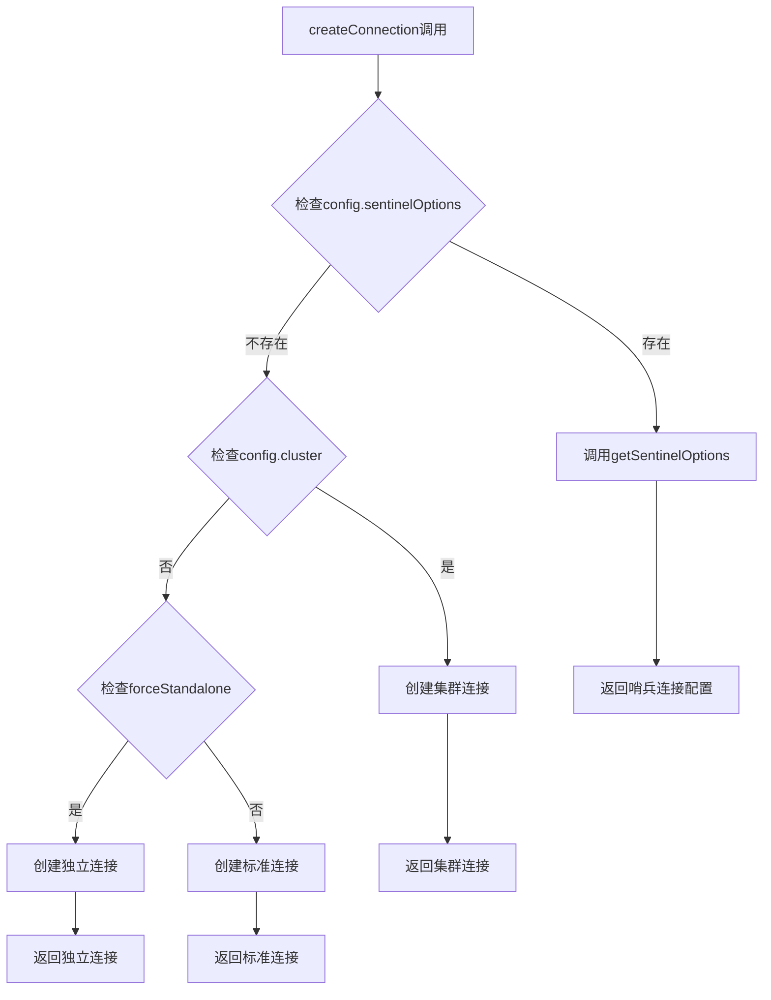

**图表来源**
- [redisClient.js](file://src/redisClient.js#L51-L87)

#### getSentinelOptions函数

该函数专门用于构建哨兵连接所需的配置对象：

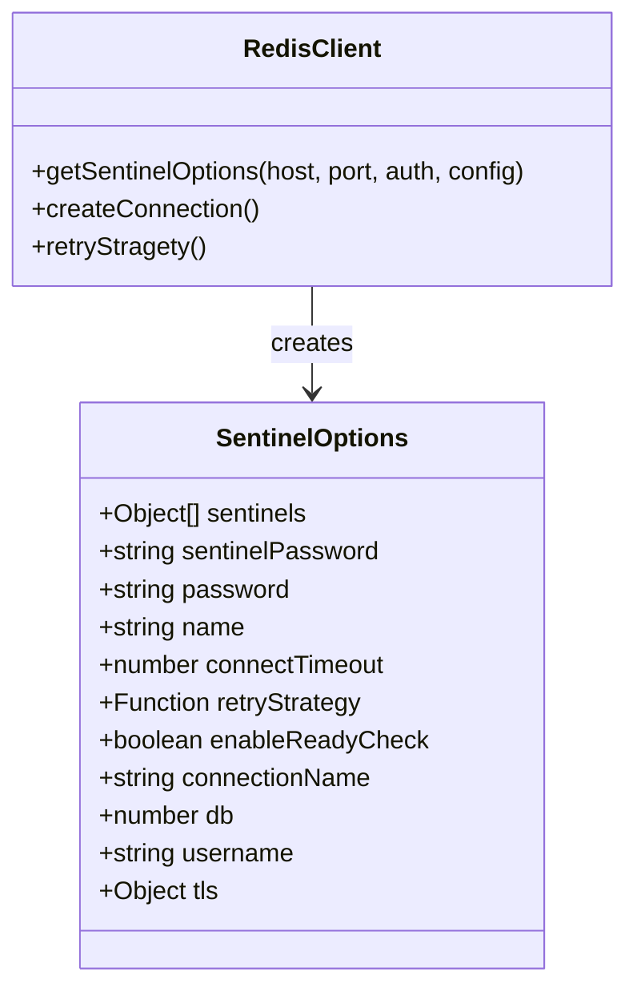

**图表来源**
- [redisClient.js](file://src/redisClient.js#L225-L239)

**章节来源**
- [redisClient.js](file://src/redisClient.js#L51-L239)

### storage.js - 配置存储

`storage.js`负责持久化存储哨兵连接配置，支持复杂的连接关系管理。

#### 连接配置结构

哨兵连接配置包含以下关键字段：

| 字段名 | 类型 | 描述 | 必需 |
|--------|------|------|------|
| sentinelOptions.masterName | string | 主节点组名称 | 是 |
| sentinelOptions.nodePassword | string | 节点密码 | 否 |
| host | string | 哨兵服务器地址 | 是 |
| port | number | 哨兵服务器端口 | 是 |
| auth | string | 哨兵认证密码 | 否 |
| connectionName | string | 连接名称 | 否 |

**章节来源**
- [storage.js](file://src/storage.js#L182-L220)

## 哨兵连接架构

### 连接层次结构

ARDM中的哨兵连接采用分层架构设计：

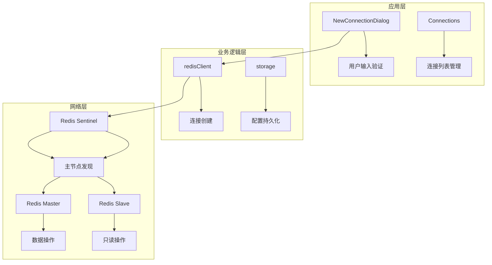

**图表来源**
- [redisClient.js](file://src/redisClient.js#L51-L87)
- [NewConnectionDialog.vue](file://src/components/NewConnectionDialog.vue#L312-L375)

### 连接生命周期

哨兵连接的完整生命周期包括以下阶段：

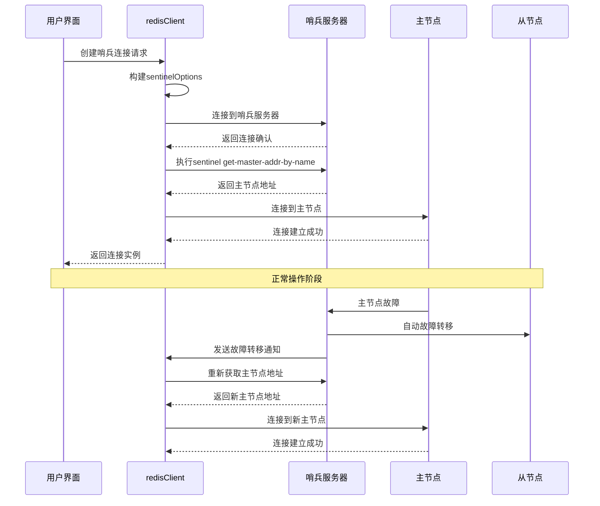

**图表来源**
- [redisClient.js](file://src/redisClient.js#L92-L118)

## 详细组件分析

### NewConnectionDialog.vue - 连接配置界面

该组件提供了完整的哨兵连接配置界面，包含以下关键特性：

#### 哨兵配置表单

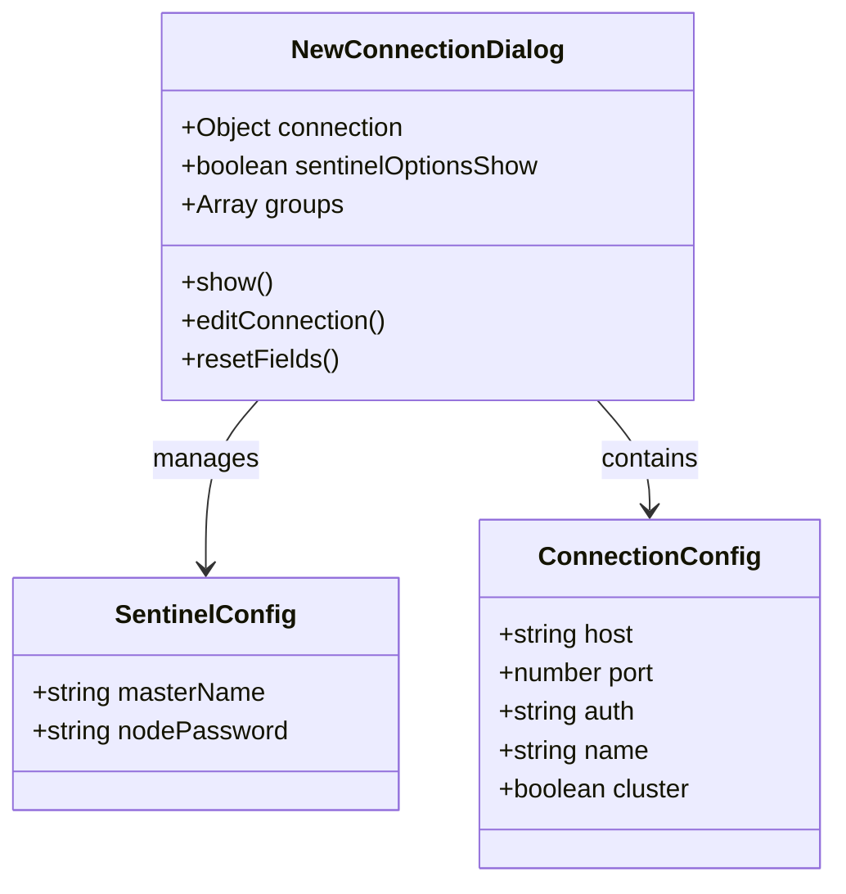

**图表来源**
- [NewConnectionDialog.vue](file://src/components/NewConnectionDialog.vue#L312-L375)

#### 表单验证规则

哨兵连接表单包含以下验证规则：

| 字段 | 验证规则 | 错误提示 |
|------|----------|----------|
| masterName | 必填且非空 | 主节点名称不能为空 |
| nodePassword | 可选但有效 | 节点密码格式错误 |
| host | 有效IP或域名 | 主机地址无效 |
| port | 数字且范围1-65535 | 端口号无效 |

**章节来源**
- [NewConnectionDialog.vue](file://src/components/NewConnectionDialog.vue#L227-L243)
- [NewConnectionDialog.vue](file://src/components/NewConnectionDialog.vue#L496-L527)

### Connections.vue - 连接管理界面

该组件负责显示和管理所有连接，包括哨兵连接：

#### 连接列表渲染

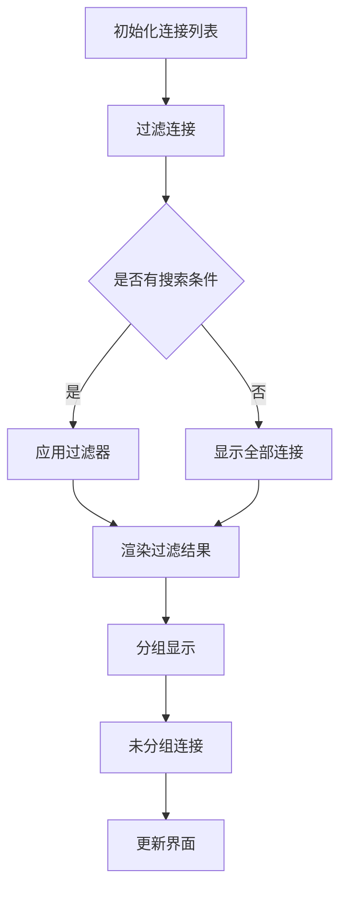

**图表来源**
- [Connections.vue](file://src/components/Connections.vue#L123-L132)

**章节来源**
- [Connections.vue](file://src/components/Connections.vue#L100-L262)

## 配置存储机制

### 结构化存储

ARDM使用localStorage进行配置存储，哨兵配置以JSON格式保存：

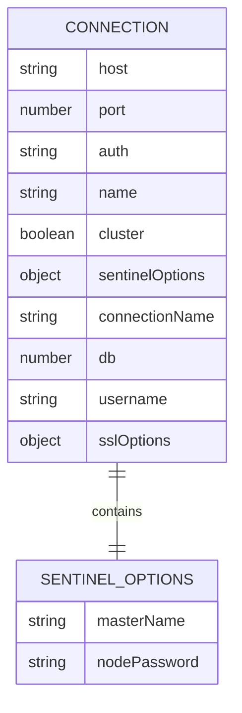

**图表来源**
- [storage.js](file://src/storage.js#L182-L220)

### 多哨兵实例支持

虽然当前实现主要支持单个哨兵实例，但架构设计为扩展到多哨兵实例做好准备：

```javascript
// 当前实现（单哨兵）
sentinels: [{ host, port }],

// 扩展方向（多哨兵）
sentinels: [
  { host: 'sentinel1.example.com', port: 26379 },
  { host: 'sentinel2.example.com', port: 26379 },
  { host: 'sentinel3.example.com', port: 26379 }
]
```

**章节来源**
- [storage.js](file://src/storage.js#L182-L329)

## 连接流程详解

### 完整连接流程

从配置哨兵连接到成功访问主从架构Redis的完整流程：

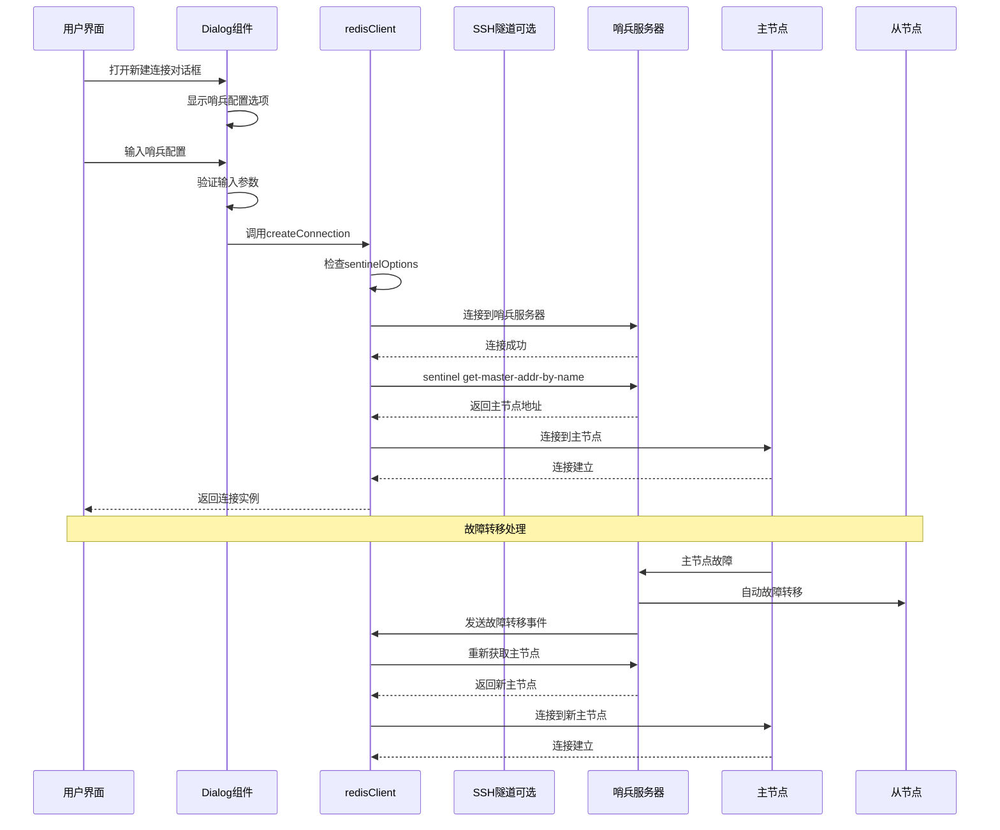

**图表来源**
- [redisClient.js](file://src/redisClient.js#L51-L87)
- [redisClient.js](file://src/redisClient.js#L92-L118)

### SSH隧道支持

ARDM还支持通过SSH隧道连接哨兵服务器，这对于跨网络的安全连接非常重要：

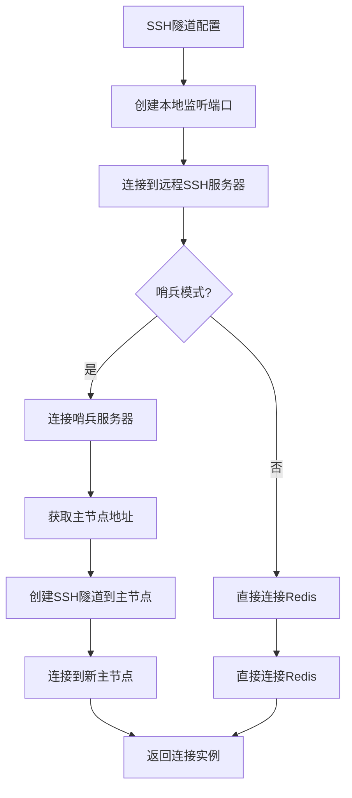

**图表来源**
- [redisClient.js](file://src/redisClient.js#L92-L118)

**章节来源**
- [redisClient.js](file://src/redisClient.js#L90-L163)

## 故障处理与恢复

### 连接恢复机制

ARDM实现了完善的连接恢复机制来处理哨兵环境中的各种故障情况：

#### 故障检测与处理

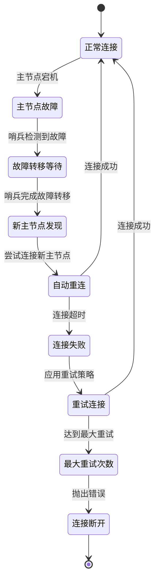

#### 重试策略

ARDM使用指数退避算法实现智能重试：

```javascript
// 重试策略实现
retryStrategy(times) {
  const maxRetryTimes = 3;
  
  if (times >= maxRetryTimes) {
    vue.$message.error('尝试重连次数过多，请检查服务器状态！');
    vue.$bus.$emit('closeConnection');
    return false;
  }
  
  // 重连间隔：200ms, 400ms, 800ms...
  return Math.min(times * 200, 1000);
}
```

**章节来源**
- [redisClient.js](file://src/redisClient.js#L344-L355)

### 主节点变更通知

哨兵系统会主动向客户端发送主节点变更通知：

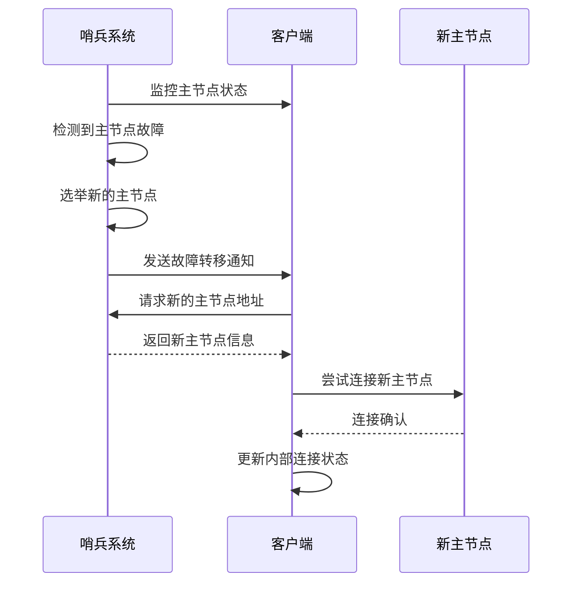

**图表来源**
- [redisClient.js](file://src/redisClient.js#L92-L118)

## 性能考虑

### 连接池优化

虽然当前实现没有显式的连接池，但通过合理的重连策略和连接复用机制来优化性能：

| 优化策略 | 实现方式 | 性能收益 |
|----------|----------|----------|
| 连接超时控制 | 30秒连接超时 | 避免长时间等待 |
| 指数退避重试 | 200ms, 400ms, 800ms | 减少服务器压力 |
| 连接复用 | 单例连接管理 | 降低连接开销 |
| 异步操作 | Promise链式调用 | 提升响应速度 |

### 内存管理

ARDM在处理大量连接时需要注意内存管理：

```javascript
// 连接清理机制
hookAfterDelConnection(connection) {
  const connectionName = this.getConnectionName(connection);
  const types = Object.keys(this.getStorageKeyMap());
  
  const willRemovedKeys = [];
  for (const type of types) {
    willRemovedKeys.push(this.getStorageKeyByName(type, connectionName));
  }
  
  willRemovedKeys.forEach(k => localStorage.removeItem(k));
}
```

**章节来源**
- [redisClient.js](file://src/redisClient.js#L344-L355)
- [storage.js](file://src/storage.js#L316-L328)

## 故障排除指南

### 常见问题诊断

#### 连接失败问题

| 问题症状 | 可能原因 | 解决方案 |
|----------|----------|----------|
| 无法连接哨兵 | 网络不通或防火墙阻拦 | 检查网络连接和防火墙设置 |
| 主节点名称错误 | sentinel master-name配置错误 | 验证哨兵配置中的masterName |
| 认证失败 | 密码或用户名错误 | 检查哨兵和Redis节点的认证配置 |
| 连接超时 | 服务器负载过高 | 增加连接超时时间或优化服务器性能 |

#### 故障转移测试

为了验证哨兵系统的可靠性，可以执行以下测试步骤：

```bash
# 1. 获取当前主节点
redis-cli -h sentinel-host -p sentinel-port sentinel get-master-addr-by-name mymaster

# 2. 模拟主节点故障
redis-cli -h master-host -p master-port debug sleep 60

# 3. 观察故障转移过程
redis-cli -h sentinel-host -p sentinel-port monitor

# 4. 验证新主节点
redis-cli -h sentinel-host -p sentinel-port sentinel get-master-addr-by-name mymaster
```

### 监控指标

建议监控以下关键指标来确保哨兵系统的健康运行：

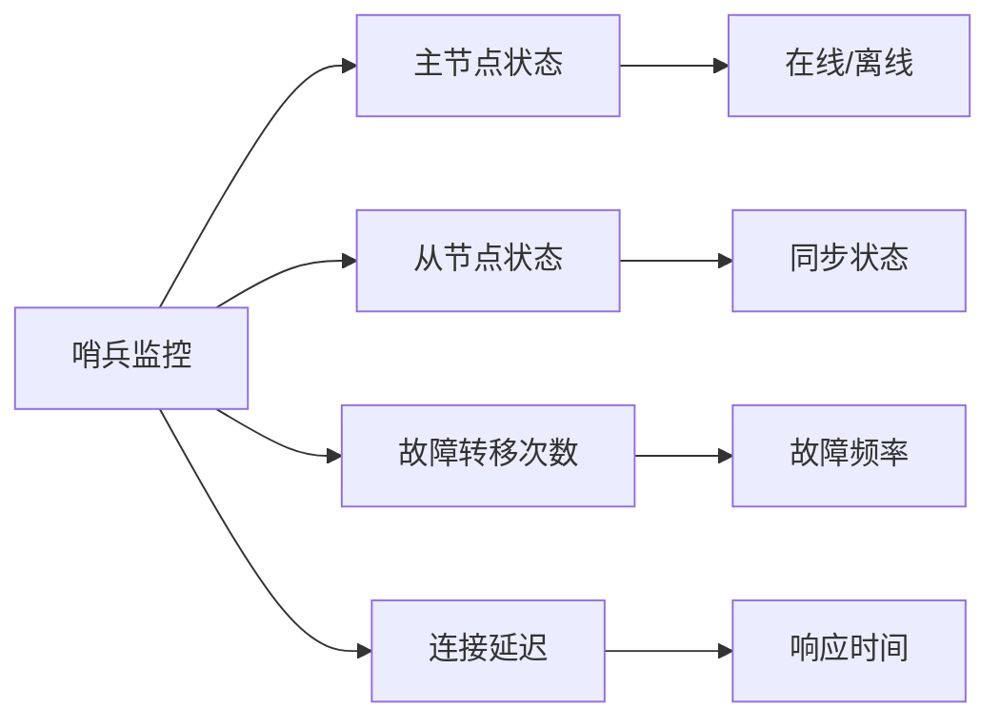

## 总结

Another Redis Desktop Manager的哨兵连接功能提供了完整的企业级Redis高可用解决方案。通过深入分析其架构和实现，我们可以看到：

### 核心优势

1. **完整的哨兵支持**：从基本连接到高级故障转移的全面支持
2. **用户友好的界面**：直观的配置界面和完善的验证机制
3. **强大的扩展性**：模块化设计便于功能扩展和维护
4. **健壮的错误处理**：完善的重试机制和故障恢复策略

### 技术特点

- **异步连接管理**：基于Promise的异步连接创建和管理
- **智能重连策略**：指数退避算法避免服务器过载
- **SSH隧道支持**：安全的跨网络连接能力
- **配置持久化**：可靠的本地存储机制

### 适用场景

ARDM的哨兵连接功能特别适用于：
- 生产环境的Redis高可用部署
- 需要自动化故障转移的应用场景
- 对连接稳定性和可靠性要求较高的企业应用
- 需要可视化管理和监控的Redis运维团队

通过本文档的详细分析，开发者可以深入理解ARDM哨兵连接功能的实现原理，并能够基于此进行二次开发或故障排查。这种深入的技术洞察对于构建可靠的Redis应用程序至关重要。