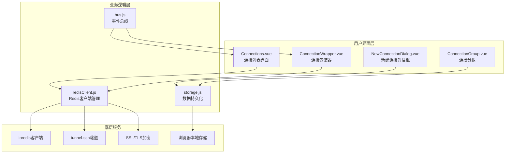
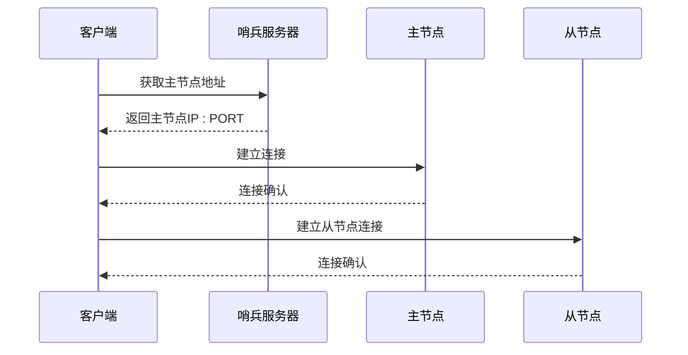
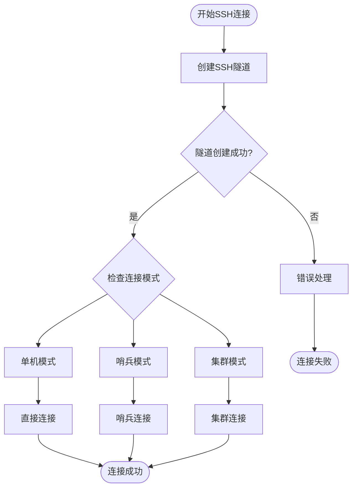
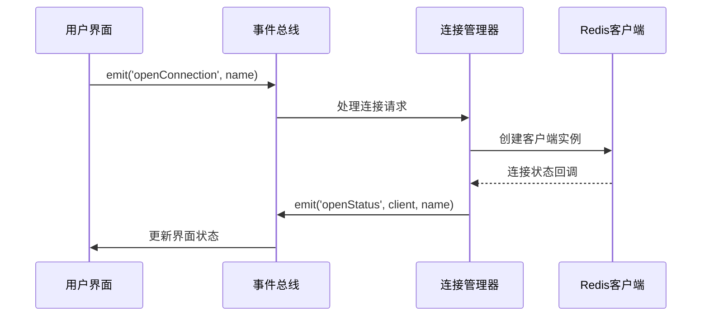
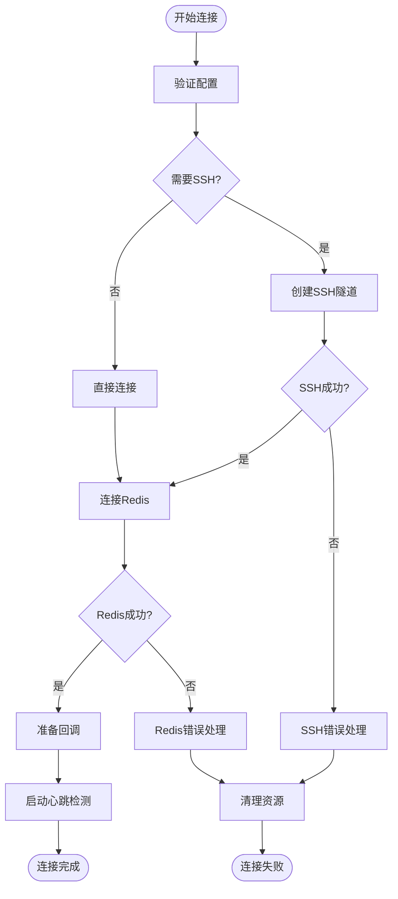
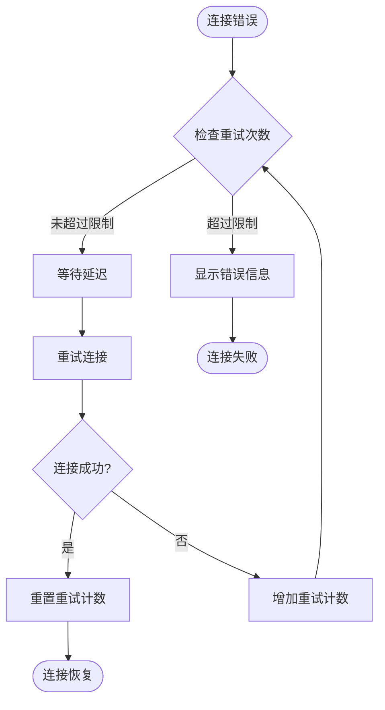

# 连接管理

<cite>
**本文档引用的文件**
- [src/components/Connections.vue](file://src/components/Connections.vue)
- [src/redisClient.js](file://src/redisClient.js)
- [src/storage.js](file://src/storage.js)
- [src/bus.js](file://src/bus.js)
- [src/components/NewConnectionDialog.vue](file://src/components/NewConnectionDialog.vue)
- [src/components/ConnectionWrapper.vue](file://src/components/ConnectionWrapper.vue)
- [src/components/ConnectionGroup.vue](file://src/components/ConnectionGroup.vue)
- [src/util.js](file://src/util.js)
- [src/addon.js](file://src/addon.js)
</cite>

## 目录
1. [简介](#简介)
2. [项目架构概览](#项目架构概览)
3. [核心组件分析](#核心组件分析)
4. [连接类型与实现机制](#连接类型与实现机制)
5. [存储与持久化](#存储与持久化)
6. [事件总线与状态管理](#事件总线与状态管理)
7. [连接生命周期管理](#连接生命周期管理)
8. [错误处理与重连机制](#错误处理与重连机制)
9. [用户界面交互](#用户界面交互)
10. [最佳实践与扩展指南](#最佳实践与扩展指南)

## 简介

Another Redis Desktop Manager (ARDM) 是一个功能强大的 Redis 客户端管理工具，提供了完整的连接管理功能。该系统支持多种 Redis 部署模式，包括单机、集群和哨兵模式，并集成了 SSH 隧道、SSL/TLS 加密等高级特性。

连接管理系统的核心目标是：
- 提供统一的连接配置界面
- 支持多种 Redis 连接模式
- 实现连接状态的实时监控
- 提供完善的错误处理和重连机制
- 支持连接的分组管理和持久化存储

## 项目架构概览

ARDM 的连接管理采用模块化架构设计，主要由以下核心模块组成：



**图表来源**
- [src/components/Connections.vue](file://src/components/Connections.vue#L1-L326)
- [src/redisClient.js](file://src/redisClient.js#L1-L381)
- [src/storage.js](file://src/storage.js#L1-L329)

## 核心组件分析

### Connections.vue - 连接列表管理

Connections.vue 是连接管理的核心组件，负责展示所有已保存的连接和连接分组。

#### 主要功能特性：
- **连接分组显示**：支持树形结构的连接分组管理
- **搜索过滤**：提供连接名称搜索功能
- **拖拽排序**：支持连接和分组的拖拽重新排序
- **批量操作**：提供添加分组、编辑连接等批量操作

#### 数据结构管理：
```javascript
// 连接数据结构
{
  connections: [],           // 所有连接列表
  groups: [],              // 分组列表
  globalSettings: {},      // 全局设置
  filterMode: '',          // 搜索关键词
  addGroupDialogVisible: false  // 添加分组对话框状态
}
```

**章节来源**
- [src/components/Connections.vue](file://src/components/Connections.vue#L93-L115)

### NewConnectionDialog.vue - 连接配置界面

NewConnectionDialog.vue 提供了完整的连接配置界面，支持多种连接参数的设置。

#### 界面标签页设计：
- **基础配置**：主机地址、端口、认证信息
- **高级配置**：超时设置、视图选项、数据库过滤
- **SSL/TLS**：证书配置和加密选项
- **SSH隧道**：SSH服务器配置
- **哨兵模式**：哨兵服务器配置
- **集群模式**：集群节点配置
- **网络代理**：HTTP/SOCKS代理配置

#### 连接测试功能：
```javascript
async testConnection() {
  this.testing = true;
  const config = JSON.parse(JSON.stringify(this.connection));
  
  try {
    const client = redisClient.createConnection(config);
    await client.ping();
    client.quit();
    this.$message.success(this.$t('message.connect_success'));
  } catch (e) {
    this.$message.error(`${this.$t('message.connect_fail')}: ${e.message}`);
  }
  this.testing = false;
}
```

**章节来源**
- [src/components/NewConnectionDialog.vue](file://src/components/NewConnectionDialog.vue#L456-L470)

### ConnectionWrapper.vue - 连接实例管理

ConnectionWrapper.vue 负责单个连接实例的生命周期管理。

#### 核心职责：
- **连接建立**：根据配置创建 Redis 客户端实例
- **状态监控**：维护连接状态和心跳检测
- **错误处理**：捕获和处理连接错误
- **资源清理**：正确关闭连接和清理资源

#### 连接状态管理：
```javascript
// 连接状态检查
if (client.status != 'ready') {
  client.on('ready', () => {
    // 连接就绪后的处理
    this.startPingInterval();
  });
}
```

**章节来源**
- [src/components/ConnectionWrapper.vue](file://src/components/ConnectionWrapper.vue#L71-L128)

## 连接类型与实现机制

### 单机连接 (Standalone)

最基础的 Redis 连接模式，直接连接到单一 Redis 实例。

#### 实现特点：
- 使用标准的 ioredis 客户端
- 支持密码认证和用户名认证
- 可选择特定的数据库编号
- 支持 SSL/TLS 加密连接

#### 配置参数：
```javascript
const redisOptions = {
  host: '127.0.0.1',
  port: 6379,
  password: 'auth_password',
  db: 0,
  connectTimeout: 30000,
  retryStrategy: times => this.retryStragety(times, { host, port })
};
```

**章节来源**
- [src/redisClient.js](file://src/redisClient.js#L203-L222)

### 哨兵模式 (Sentinel)

用于高可用 Redis 集群的连接模式，通过哨兵服务器发现主从节点。

#### 实现流程：


**图表来源**
- [src/redisClient.js](file://src/redisClient.js#L92-L163)

#### 哨兵配置：
```javascript
const sentinelOptions = {
  sentinels: [{ host: 'sentinel-host', port: 26379 }],
  sentinelPassword: 'sentinel_auth',
  password: 'node_password',
  name: 'master_name',
  connectTimeout: 30000
};
```

**章节来源**
- [src/redisClient.js](file://src/redisClient.js#L225-L239)

### 集群模式 (Cluster)

支持 Redis Cluster 的分布式连接模式。

#### 集群节点发现：
```javascript
// 获取集群节点信息
client.call('cluster', 'nodes').then((reply) => {
  const nodes = this.getClusterNodes(reply);
  // 创建SSH隧道连接到各个节点
  this.createClusterSSHTunnels(sshConfig, nodes);
});
```

#### NAT映射处理：
```javascript
// 初始化NAT映射表
initNatMap(tunnels) {
  const natMap = {};
  for (const line of tunnels) {
    natMap[`${line.dstHost}:${line.dstPort}`] = 
      { host: line.localHost, port: line.localPort };
  }
  return natMap;
}
```

**章节来源**
- [src/redisClient.js](file://src/redisClient.js#L277-L323)

### SSH隧道连接

通过SSH隧道建立安全的Redis连接通道。

#### SSH隧道建立流程：


**图表来源**
- [src/redisClient.js](file://src/redisClient.js#L92-L163)

#### SSH配置参数：
```javascript
const sshOptions = {
  host: 'ssh-host',
  port: 22,
  username: 'ssh-user',
  password: 'ssh-password',
  privateKey: privateKeyBuffer,
  passphrase: 'key-passphrase',
  readyTimeout: 30000,
  keepaliveInterval: 10000
};
```

**章节来源**
- [src/redisClient.js](file://src/redisClient.js#L166-L187)

### SSL/TLS加密连接

支持Redis的SSL/TLS加密连接，确保数据传输安全。

#### SSL配置选项：
```javascript
const tlsOptions = {
  ca: caCertificateBuffer,
  key: privateKeyBuffer,
  cert: clientCertificateBuffer,
  servername: 'redis-server-name',
  checkServerIdentity: () => undefined,
  rejectUnauthorized: false
};
```

#### 文件内容读取：
```javascript
getFileContent(file, bookmark = '') {
  if (!file) return undefined;
  
  try {
    if (bookmark) {
      const bookmarkClose = remote.app.startAccessingSecurityScopedResource(bookmark);
    }
    
    const content = fs.readFileSync(file);
    (typeof bookmarkClose === 'function') && bookmarkClose();
    return content;
  } catch (e) {
    alert(`${vue.$t('message.key_no_permission')}\n[${e.message}]`);
    return undefined;
  }
}
```

**章节来源**
- [src/redisClient.js](file://src/redisClient.js#L325-L379)

## 存储与持久化

### 数据存储架构

ARDM 使用浏览器的 localStorage 进行连接配置的持久化存储。

#### 存储结构：
```javascript
// 连接存储格式
localStorage.connections = JSON.stringify({
  "connection_key_1": {
    "host": "127.0.0.1",
    "port": 6379,
    "name": "Local Redis",
    "auth": "password",
    "db": 0,
    "groupKey": "group_key_1"
  }
});

// 分组存储格式
localStorage.connectionGroups = JSON.stringify({
  "group_key_1": {
    "name": "Development",
    "color": "#409EFF",
    "icon": "base64_icon_data",
    "parentKey": "",
    "order": 1
  }
});
```

**章节来源**
- [src/storage.js](file://src/storage.js#L1-L329)

### 连接管理API

#### 连接操作接口：
```javascript
// 添加连接
addConnection(connection)

// 编辑连接
editConnectionByKey(connection, oldKey)

// 删除连接
deleteConnection(connection)

// 获取连接列表
getConnections(returnList = false)

// 更新连接名称
updateConnectionName(connection, connections)

// 排序连接
sortConnections(connections)
```

#### 分组管理接口：
```javascript
// 添加分组
addGroup(group)

// 编辑分组
editGroup(group)

// 删除分组
deleteGroup(groupKey)

// 获取子分组
getChildGroups(parentKey)

// 分组排序
reOrderGroups(groups)
```

**章节来源**
- [src/storage.js](file://src/storage.js#L43-L89)

### 连接键值生成

为了确保连接的唯一性，系统实现了智能的键值生成算法：

```javascript
getConnectionKey(connection, forceUnique = false) {
  if (connection.key) return connection.key;
  
  if (forceUnique) {
    return `${new Date().getTime()}_${randomString(5)}`;
  }
  
  return connection.host + connection.port + connection.name;
}
```

**章节来源**
- [src/storage.js](file://src/storage.js#L257-L270)

## 事件总线与状态管理

### 事件总线架构

ARDM 使用 Vue 实例作为事件总线，实现组件间的通信和状态同步。

#### 事件总线API：
```javascript
// 发送事件
$bus.$emit('eventName', data);

// 监听事件
$bus.$on('eventName', callback);

// 移除事件监听
$bus.$off('eventName', callback);

// 一次性事件监听
$bus.$once('eventName', callback);
```

**章节来源**
- [src/bus.js](file://src/bus.js#L1-L19)

### 连接状态同步

#### 关键事件类型：
- **refreshConnections**：刷新连接列表
- **openConnection**：打开指定连接
- **closeConnection**：关闭指定连接
- **reloadSettings**：重新加载设置
- **commandLog**：命令执行日志

#### 事件处理流程：


**图表来源**
- [src/components/ConnectionWrapper.vue](file://src/components/ConnectionWrapper.vue#L55-L64)

### 心跳检测机制

系统实现了定期的心跳检测来监控连接状态：

```javascript
startPingInterval() {
  this.pingTimer = setInterval(() => {
    this.client && this.client.ping().then(() => {}).catch((e) => {
      // 处理心跳失败
    });
  }, this.pingInterval);
}
```

**章节来源**
- [src/components/ConnectionWrapper.vue](file://src/components/ConnectionWrapper.vue#L150-L155)

## 连接生命周期管理

### 连接建立流程

#### 完整的连接建立过程：



**图表来源**
- [src/components/ConnectionWrapper.vue](file://src/components/ConnectionWrapper.vue#L157-L193)

### 连接关闭流程

#### 资源清理步骤：
```javascript
closeConnection(connectionName) {
  // 检查是否为目标连接
  if (connectionName && (connectionName != this.config.connectionName)) {
    return;
  }
  
  // 关闭菜单
  this.$refs.connectionMenu && this.$refs.connectionMenu.close(this.config.connectionName);
  
  // 移除所有标签页
  this.$bus.$emit('removeAllTab', connectionName);
  
  // 清理心跳定时器
  clearInterval(this.pingTimer);
  
  // 重置操作项状态
  this.$refs.operateItem && this.$refs.operateItem.resetStatus();
  
  // 重置键列表
  this.$refs.keyList && this.$refs.keyList.resetKeyList(true);
  
  // 关闭Redis连接
  this.client && this.client.quit && this.client.quit();
  this.client = null;
}
```

**章节来源**
- [src/components/ConnectionWrapper.vue](file://src/components/ConnectionWrapper.vue#L129-L148)

## 错误处理与重连机制

### 错误分类与处理

#### 连接错误类型：
1. **网络错误**：网络不通、主机不可达
2. **认证错误**：密码错误、权限不足
3. **协议错误**：Redis协议不匹配
4. **超时错误**：连接超时、操作超时

#### 错误处理策略：
```javascript
// 连接错误处理
client.on('error', (error) => {
  this.$message.error({
    message: `Client On Error: ${error} Config right?`,
    duration: 3000,
    customClass: 'redis-on-error-message'
  });
  
  this.$bus.$emit('closeConnection');
});
```

**章节来源**
- [src/components/ConnectionWrapper.vue](file://src/components/ConnectionWrapper.vue#L179-L187)

### 重连机制

#### 重试策略配置：
```javascript
retryStragety(times, connection) {
  const maxRetryTimes = 3;
  
  if (times >= maxRetryTimes) {
    vue.$message.error('Too Many Attempts To Reconnect. Please Check The Server Status!');
    vue.$bus.$emit('closeConnection');
    return false;
  }
  
  // 指数退避策略
  return Math.min(times * 200, 1000);
}
```

#### 重连流程：


**图表来源**
- [src/redisClient.js](file://src/redisClient.js#L344-L355)

### SSH隧道错误处理

#### SSH连接错误处理：
```javascript
createTunnel(...Object.values(sshOptionsDict)).then(([server, connection]) => {
  // 成功处理
}).catch((e) => {
  // SSH错误处理
  reject(e);
});
```

**章节来源**
- [src/redisClient.js](file://src/redisClient.js#L156-L160)

## 用户界面交互

### 连接列表界面

#### 主要功能区域：
1. **搜索栏**：连接名称过滤
2. **连接列表**：显示所有连接和分组
3. **操作按钮**：添加连接、刷新等
4. **分组管理**：支持嵌套分组

#### 界面交互特性：
- **拖拽排序**：支持连接和分组的拖拽重新排列
- **右键菜单**：提供上下文菜单操作
- **双击打开**：双击连接快速打开
- **颜色标记**：支持连接颜色标记

**章节来源**
- [src/components/Connections.vue](file://src/components/Connections.vue#L1-L326)

### 新建连接对话框

#### 界面设计特点：
- **标签页布局**：按功能分组的配置选项
- **动态显示**：根据启用的功能动态显示相应配置
- **实时预览**：连接测试功能
- **导入导出**：支持Redis URL格式导入

#### 配置验证：
```javascript
// URL格式解析
parseClipboard() {
  const text = clipboard.readText();
  const urlMatch = text.match(/^rediss?:\/\/(?:([^:]+):)?([^@]+)?@?([^:]+):(\d+)\/?.*$/);
  
  if (urlMatch) {
    this.connection.username = urlMatch[1] || '';
    this.connection.auth = urlMatch[2] || '';
    this.connection.host = urlMatch[3] || '';
    this.connection.port = urlMatch[4] || '';
  }
}
```

**章节来源**
- [src/components/NewConnectionDialog.vue](file://src/components/NewConnectionDialog.vue#L472-L494)

### 分组管理界面

#### 分组特性：
- **嵌套结构**：支持最多3级嵌套分组
- **图标标记**：可自定义分组图标
- **颜色标识**：支持颜色标记
- **拖拽排序**：支持分组内连接的拖拽排序

#### 分组操作：
```javascript
// 添加子分组
addSubGroup() {
  storage.addGroup({
    name: this.newSubGroupName.trim(),
    color: this.newSubGroupColor,
    icon: this.newSubGroupIcon,
    parentKey: this.group.key,
  });
}
```

**章节来源**
- [src/components/ConnectionGroup.vue](file://src/components/ConnectionGroup.vue#L277-L289)

## 最佳实践与扩展指南

### 连接配置最佳实践

#### 安全配置建议：
1. **使用强密码**：为Redis实例设置复杂密码
2. **启用SSL/TLS**：生产环境必须启用加密连接
3. **限制访问范围**：通过防火墙限制Redis访问
4. **定期更新证书**：及时更新SSL证书

#### 性能优化建议：
1. **合理设置超时**：根据网络状况调整连接和执行超时
2. **选择合适的数据库**：避免使用默认数据库0
3. **启用只读模式**：对于只读操作启用只读模式
4. **优化扫描数量**：根据数据量调整SCAN命令的COUNT参数

### 自定义连接类型的扩展

#### 扩展步骤：
1. **继承基础类**：扩展redisClient.js中的createConnection方法
2. **添加配置界面**：在NewConnectionDialog.vue中添加新的配置选项
3. **实现连接逻辑**：在redisClient.js中实现具体的连接逻辑
4. **注册事件处理**：在ConnectionWrapper.vue中处理连接状态变化

#### 示例扩展点：
```javascript
// 在redisClient.js中添加新的连接类型
createCustomConnection(host, port, auth, config) {
  // 实现自定义连接逻辑
}

// 在NewConnectionDialog.vue中添加配置选项
tabs: [
  { key: 'basic', label: this.$t('message.basic_config') },
  { key: 'advanced', label: this.$t('message.advanced_config') },
  { key: 'custom', label: this.$t('message.custom_config') }  // 新增自定义配置
]
```

### 故障排除指南

#### 常见问题解决：

1. **连接超时**
   - 检查网络连接
   - 验证防火墙设置
   - 调整超时参数

2. **认证失败**
   - 验证用户名密码
   - 检查ACL配置
   - 确认Redis版本兼容性

3. **SSL连接失败**
   - 验证证书有效性
   - 检查证书链完整性
   - 确认服务器名称匹配

4. **SSH隧道问题**
   - 验证SSH服务器可达性
   - 检查SSH密钥配置
   - 确认端口转发设置

#### 调试技巧：
- 启用详细日志记录
- 使用网络抓包工具分析流量
- 检查浏览器控制台错误信息
- 验证Redis服务器状态

### 性能监控与优化

#### 连接性能指标：
- **连接建立时间**：从发起连接到建立成功的耗时
- **命令响应时间**：Redis命令的平均响应时间
- **内存使用情况**：应用程序和Redis的内存占用
- **并发连接数**：同时保持的连接数量

#### 优化建议：
```javascript
// 连接池配置优化
const redisOptions = {
  connectTimeout: 10000,        // 减少连接超时时间
  retryStrategy: times => Math.min(times * 100, 5000),  // 优化重试策略
  maxRetriesPerRequest: 3,      // 限制重试次数
  lazyConnect: true             // 延迟连接建立
};
```

通过遵循这些最佳实践和扩展指南，开发者可以充分利用 ARDM 的连接管理功能，构建稳定可靠的 Redis 应用程序。