# NAT映射配置

<cite>
**本文档引用的文件**
- [redisClient.js](file://src/redisClient.js)
- [storage.js](file://src/storage.js)
- [util.js](file://src/util.js)
- [NewConnectionDialog.vue](file://src/components/NewConnectionDialog.vue)
- [ConnectionMenu.vue](file://src/components/ConnectionMenu.vue)
- [package.json](file://package.json)
</cite>

## 目录
1. [简介](#简介)
2. [项目架构概览](#项目架构概览)
3. [核心组件分析](#核心组件分析)
4. [NAT映射机制详解](#nat映射机制详解)
5. [SSH隧道与NAT映射流程](#ssh隧道与nat映射流程)
6. [存储与持久化](#存储与持久化)
7. [实际应用场景](#实际应用场景)
8. [故障排除指南](#故障排除指南)
9. [总结](#总结)

## 简介

NAT（Network Address Translation）映射是现代分布式系统中解决网络地址转换问题的关键技术。在Redis集群环境中，特别是在容器化部署（如Docker）、云服务（如AWS）等复杂网络环境下，内部网络地址与外部访问地址往往不一致，这就需要NAT映射来建立正确的连接映射关系。

本文档深入分析Another Redis Desktop Manager（ARDM）项目中NAT映射的实现机制，重点关注`redisClient.js`中`getClusterOptions`函数如何使用`natMap`参数处理集群节点的内外网地址映射，以及`initNatMap`函数如何将SSH隧道信息转换为ioredis所需的NAT映射结构。

## 项目架构概览

ARDM是一个跨平台的Redis桌面管理器，支持多种连接方式，包括直接连接、SSH隧道连接、SSL加密连接等。其网络连接架构如下：

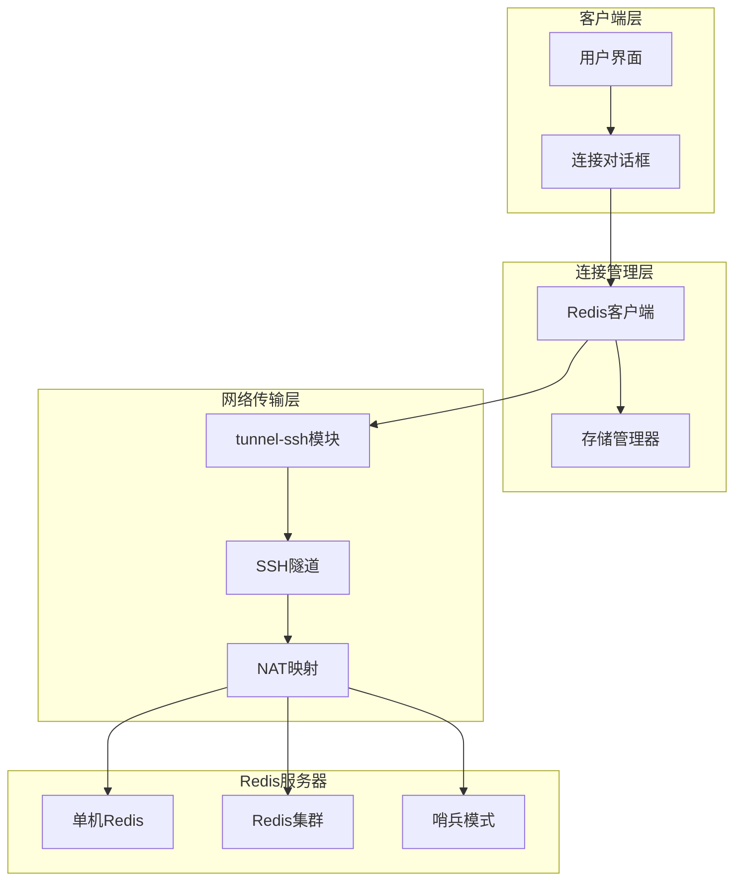

**图表来源**
- [redisClient.js](file://src/redisClient.js#L51-L381)
- [storage.js](file://src/storage.js#L1-L339)

**章节来源**
- [redisClient.js](file://src/redisClient.js#L1-L50)
- [package.json](file://package.json#L35-L56)

## 核心组件分析

### Redis客户端核心类

Redis客户端是整个NAT映射系统的核心，负责建立各种类型的Redis连接：

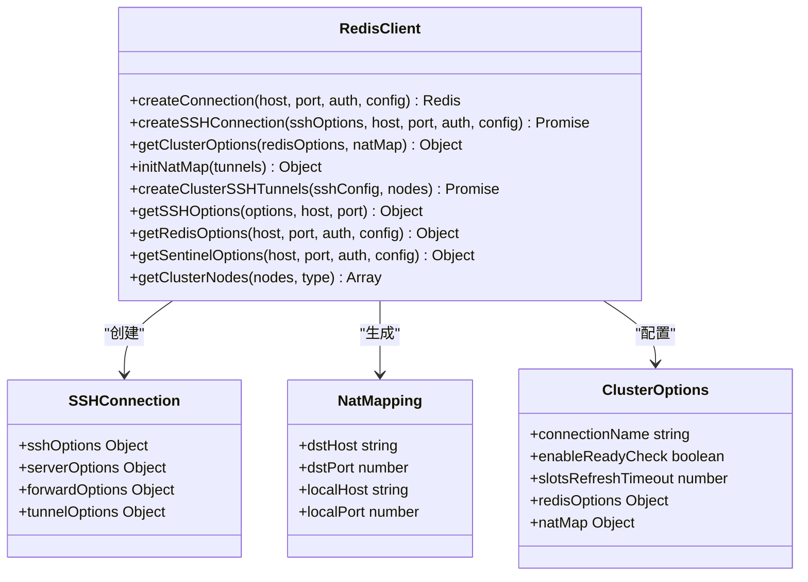

**图表来源**
- [redisClient.js](file://src/redisClient.js#L51-L381)

### 存储管理系统

存储管理器负责持久化连接配置，包括复杂的NAT映射信息：

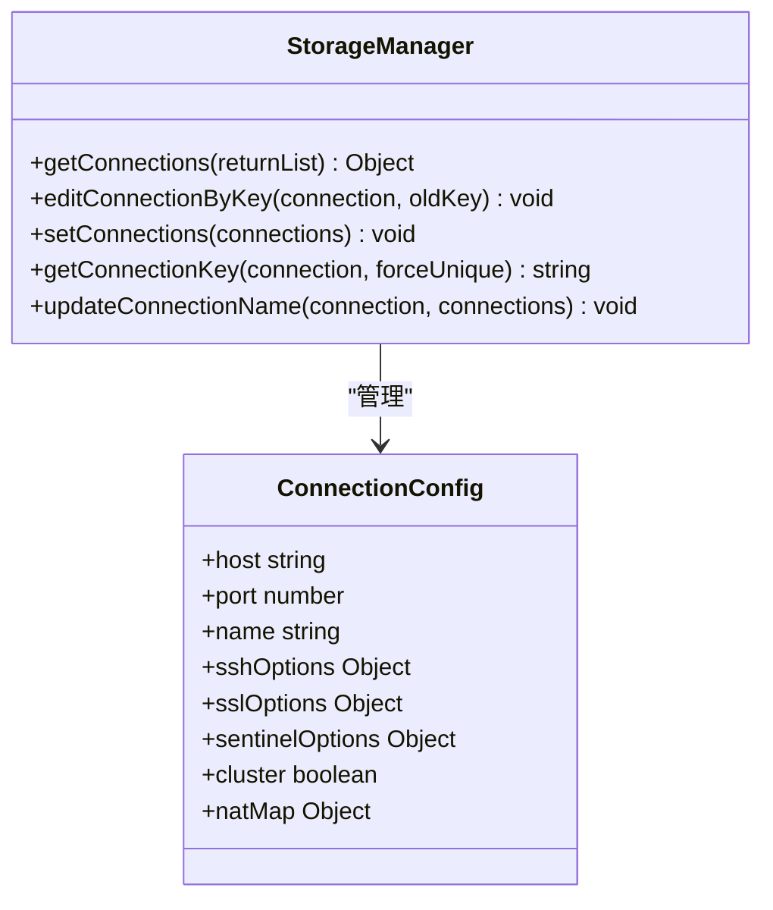

**图表来源**
- [storage.js](file://src/storage.js#L195-L306)

**章节来源**
- [redisClient.js](file://src/redisClient.js#L51-L381)
- [storage.js](file://src/storage.js#L195-L306)

## NAT映射机制详解

### getClusterOptions函数的NAT映射处理

`getClusterOptions`函数是NAT映射机制的核心入口点，它接收Redis选项和NAT映射作为参数：

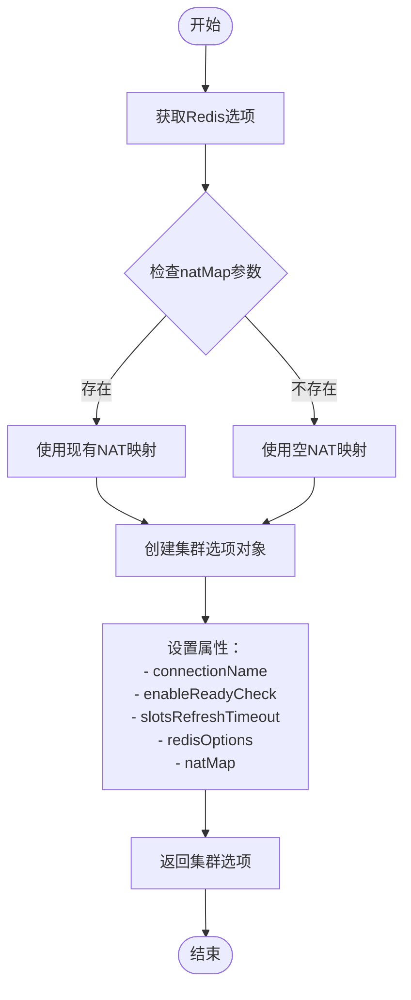

**图表来源**
- [redisClient.js](file://src/redisClient.js#L242-L249)

该函数的关键特性：
- 支持可选的`natMap`参数，默认为空对象
- 将NAT映射直接传递给ioredis的集群连接器
- 维护连接名称的一致性
- 配置适当的超时和检查参数

### initNatMap函数的映射生成

`initNatMap`函数负责将SSH隧道信息转换为ioredis所需的NAT映射结构：

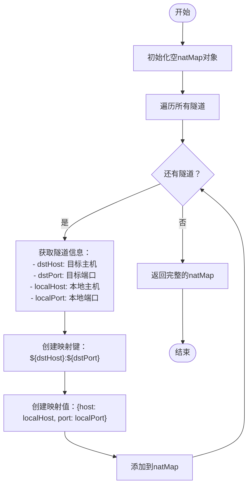

**图表来源**
- [redisClient.js](file://src/redisClient.js#L315-L322)

映射结构示例：
```javascript
{
  "10.0.1.10:6379": { host: "127.0.0.1", port: 54321 },
  "10.0.1.11:6379": { host: "127.0.0.1", port: 54322 },
  "10.0.1.12:6379": { host: "127.0.0.1", port: 54323 }
}
```

**章节来源**
- [redisClient.js](file://src/redisClient.js#L242-L249)
- [redisClient.js](file://src/redisClient.js#L315-L322)

## SSH隧道与NAT映射流程

### createClusterSSHTunnels函数的工作原理

该函数创建多个SSH隧道以连接Redis集群的所有节点：

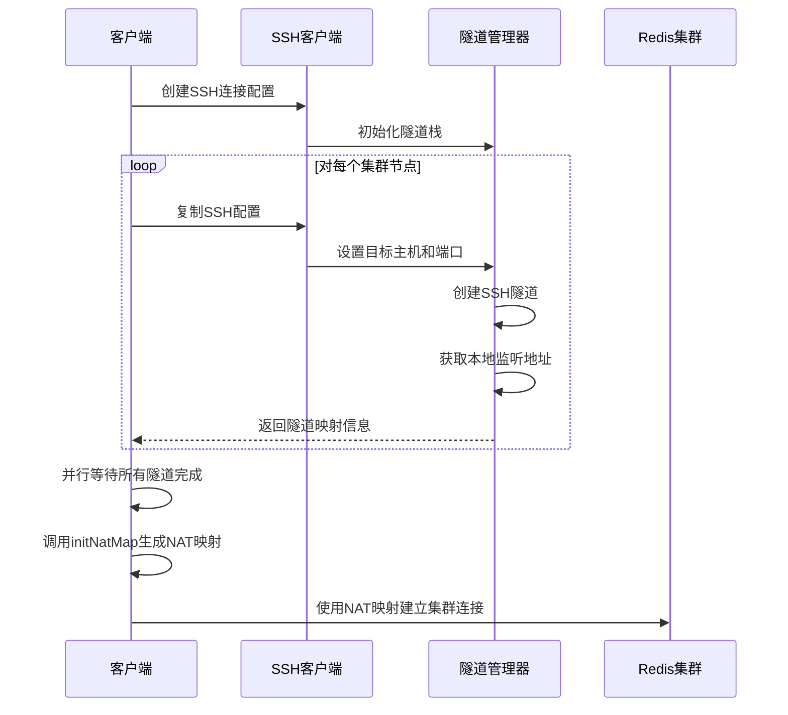

**图表来源**
- [redisClient.js](file://src/redisClient.js#L277-L313)

### 隧道映射信息结构

每个隧道返回的信息包含以下关键字段：

| 字段 | 类型 | 描述 |
|------|------|------|
| `localHost` | string | 本地监听主机地址 |
| `localPort` | number | 本地监听端口号 |
| `dstHost` | string | 目标Redis节点主机地址 |
| `dstPort` | number | 目标Redis节点端口号 |

这种映射关系确保了客户端能够通过本地端口访问内部网络中的Redis节点。

### SSH连接配置流程

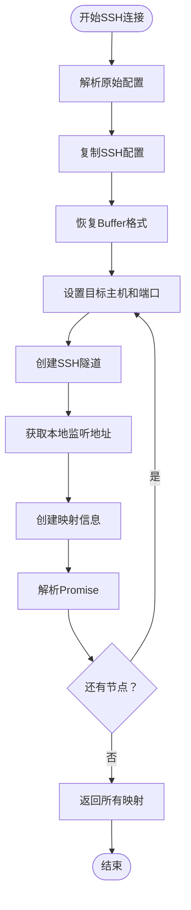

**图表来源**
- [redisClient.js](file://src/redisClient.js#L277-L313)

**章节来源**
- [redisClient.js](file://src/redisClient.js#L277-L313)
- [redisClient.js](file://src/redisClient.js#L315-L322)

## 存储与持久化

### 连接配置的序列化

存储管理器负责将包含NAT映射的连接配置序列化并持久化到localStorage：

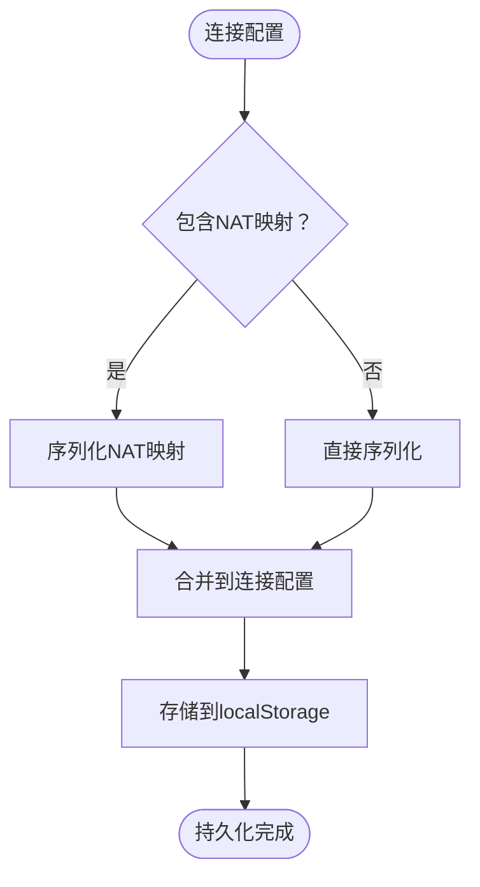

**图表来源**
- [storage.js](file://src/storage.js#L195-L306)

### 配置项结构

连接配置对象包含以下与NAT映射相关的字段：

| 字段名 | 类型 | 描述 |
|--------|------|------|
| `host` | string | Redis服务器主机地址 |
| `port` | number | Redis服务器端口号 |
| `cluster` | boolean | 是否为集群模式 |
| `natMap` | Object | NAT映射配置对象 |
| `sshOptions` | Object | SSH连接选项 |
| `sentinelOptions` | Object | 哨兵模式选项 |

### 持久化策略

存储系统采用JSON序列化策略，确保：
- 复杂对象结构的完整保存
- 数组和嵌套对象的正确处理
- 数据类型的安全转换
- 键值对的有序存储

**章节来源**
- [storage.js](file://src/storage.js#L195-L306)

## 实际应用场景

### Docker容器环境

在Docker环境中，Redis容器通常运行在私有网络中，外部无法直接访问：

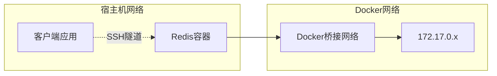

**图表来源**
- [redisClient.js](file://src/redisClient.js#L125-L141)

在这种场景下，NAT映射的作用：
- 将容器内部地址映射到宿主机可访问的地址
- 通过SSH隧道建立安全的连接通道
- 自动处理端口映射和地址转换

### AWS云环境

在AWS等云平台上，Redis实例通常部署在VPC内部：

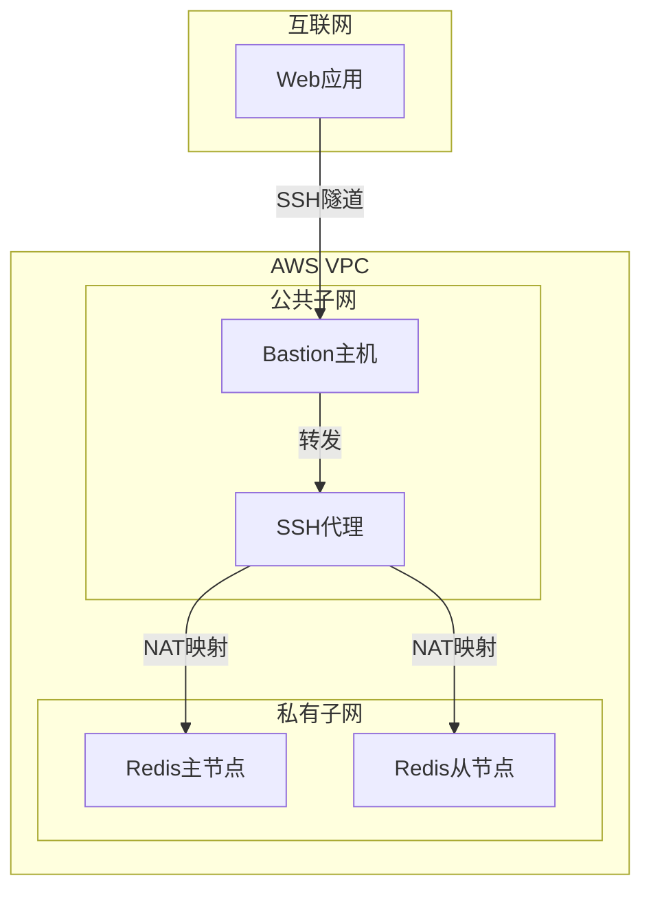

**图表来源**
- [redisClient.js](file://src/redisClient.js#L125-L141)

### Kubernetes集群

在Kubernetes环境中，Redis服务可能通过Service暴露：

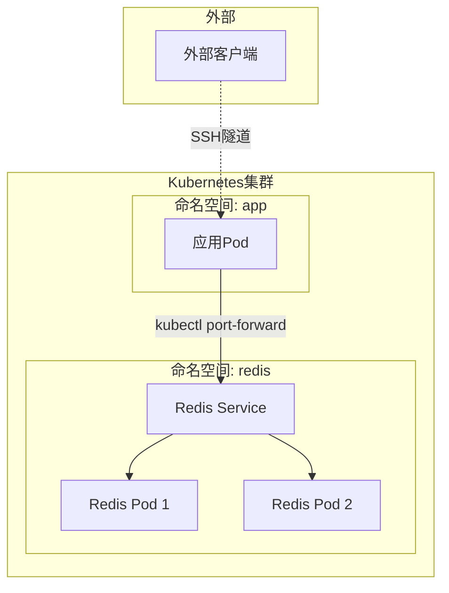

**图表来源**
- [redisClient.js](file://src/redisClient.js#L125-L141)

## 故障排除指南

### 常见问题诊断

#### 1. NAT映射失败

**症状**：连接超时或拒绝连接
**原因**：SSH隧道未正确建立或NAT映射配置错误
**解决方案**：
- 检查SSH连接配置
- 验证目标主机可达性
- 确认端口映射正确性

#### 2. 集群节点发现失败

**症状**：无法识别集群节点
**原因**：SSH隧道创建失败或节点信息解析错误
**解决方案**：
- 检查SSH权限配置
- 验证集群节点状态
- 确认防火墙规则

#### 3. 内存泄漏

**症状**：长时间运行后内存占用过高
**原因**：SSH隧道未正确关闭
**解决方案**：
- 实现隧道生命周期管理
- 添加自动清理机制
- 监控连接状态

### 调试工具和方法

#### 日志记录

启用详细的日志记录来跟踪NAT映射过程：

```javascript
// 在关键位置添加日志
console.log('Creating SSH tunnel:', { dstHost, dstPort, localHost, localPort });
console.log('Generated NAT mapping:', natMap);
```

#### 连接测试

实现连接测试功能验证NAT映射的有效性：

```javascript
// 测试NAT映射是否工作正常
async testNatMapping(natMap, testHost, testPort) {
  try {
    const client = new Redis({
      host: natMap[`${testHost}:${testPort}`].host,
      port: natMap[`${testHost}:${testPort}`].port
    });
    await client.ping();
    return true;
  } catch (error) {
    return false;
  }
}
```

**章节来源**
- [redisClient.js](file://src/redisClient.js#L125-L141)
- [redisClient.js](file://src/redisClient.js#L315-L322)

## 总结

NAT映射配置是ARDM项目中处理复杂网络环境的关键技术。通过深入分析`redisClient.js`中的实现，我们可以看到：

1. **模块化设计**：NAT映射功能被清晰地分离到独立的函数中，便于维护和扩展
2. **灵活配置**：支持多种网络环境和连接方式，包括SSH隧道、SSL加密等
3. **自动化处理**：从SSH隧道创建到NAT映射生成的完整自动化流程
4. **持久化支持**：完整的配置序列化和存储机制
5. **错误处理**：完善的异常处理和重试机制

该实现不仅解决了Docker、AWS等复杂环境下的连接问题，还为未来的网络架构演进提供了良好的扩展基础。通过合理使用这些NAT映射机制，开发者可以构建更加稳定和可靠的Redis连接解决方案。