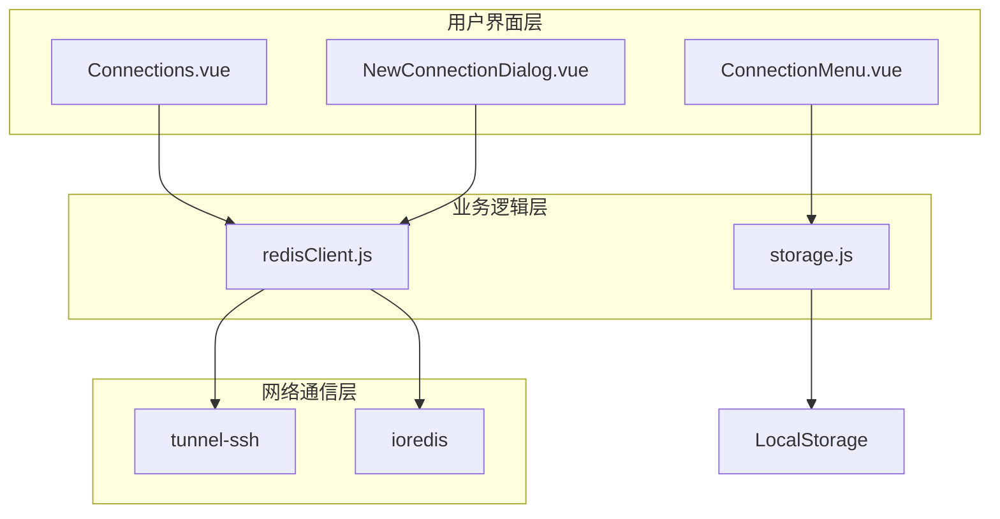
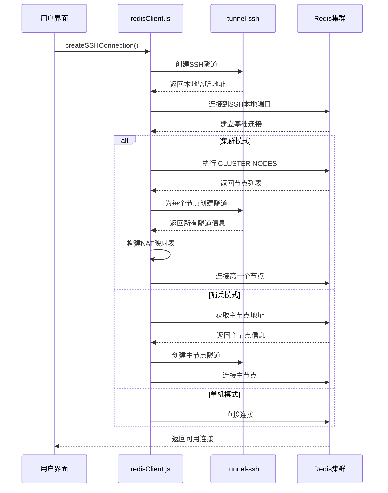
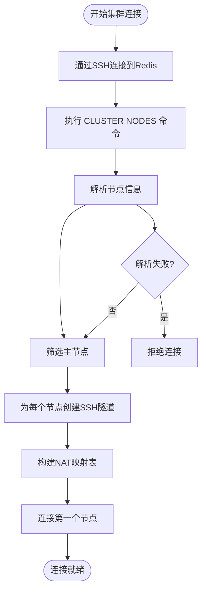
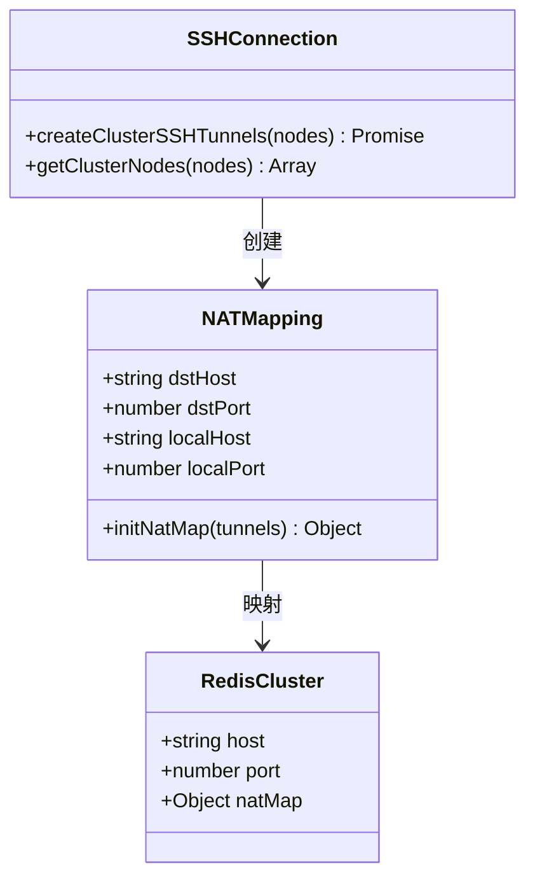
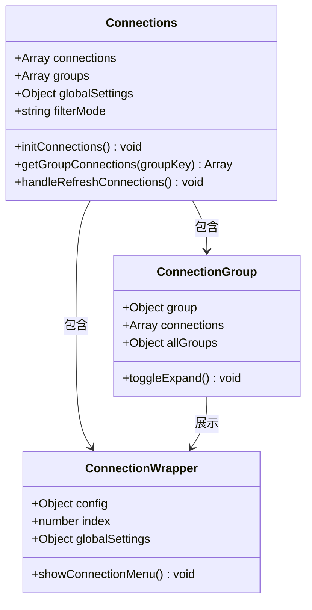
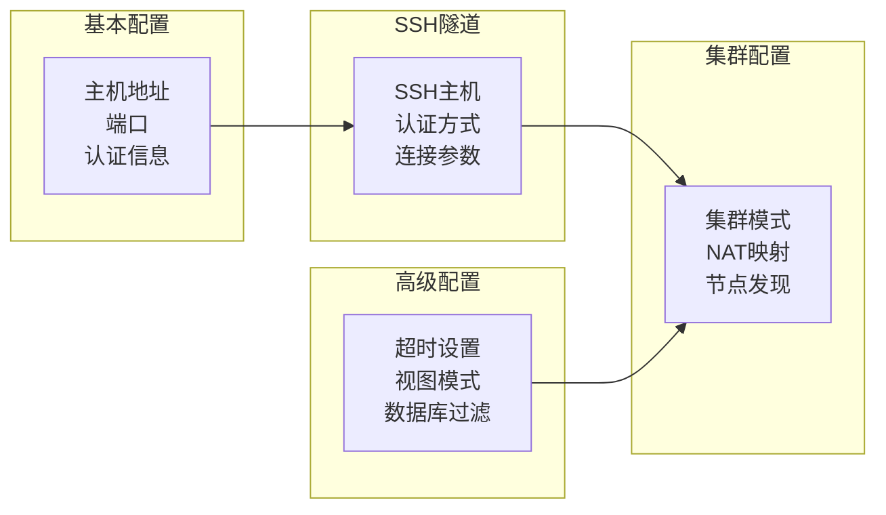
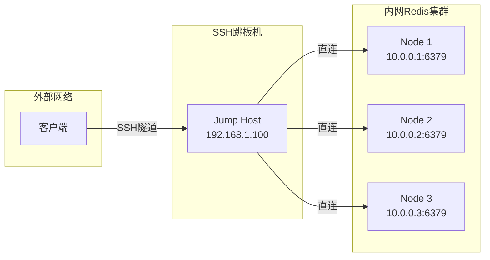

# 内网集群连接

<cite>
**本文档引用的文件**
- [README.md](file://README.md)
- [src/redisClient.js](file://src/redisClient.js)
- [src/components/Connections.vue](file://src/components/Connections.vue)
- [src/components/NewConnectionDialog.vue](file://src/components/NewConnectionDialog.vue)
- [src/storage.js](file://src/storage.js)
- [src/components/ConnectionMenu.vue](file://src/components/ConnectionMenu.vue)
</cite>

## 目录
1. [简介](#简介)
2. [项目架构概览](#项目架构概览)
3. [SSH隧道连接原理](#ssh隧道连接原理)
4. [集群模式连接详解](#集群模式连接详解)
5. [连接界面设计](#连接界面设计)
6. [实际操作指南](#实际操作指南)
7. [故障排除](#故障排除)
8. [最佳实践](#最佳实践)

## 简介

Another Redis Desktop Manager (ARDM) 提供了一套完整的解决方案来连接内网Redis集群，特别是通过SSH隧道实现的安全连接方式。该系统支持多种连接模式，包括单机、集群、哨兵模式，并提供了直观的图形化界面来配置复杂的SSH+集群连接。

### 核心特性

- **SSH隧道支持**：通过SSH跳板机安全访问内网Redis集群
- **集群模式适配**：自动处理Redis Cluster的多节点连接
- **NAT映射机制**：解决内网环境中的IP地址转换问题
- **多种认证方式**：支持密码和私钥两种SSH认证方式
- **可视化配置界面**：简化复杂连接参数的设置

## 项目架构概览

ARDM采用模块化的架构设计，主要包含以下核心组件：



**图表来源**
- [src/components/Connections.vue](file://src/components/Connections.vue#L1-L50)
- [src/redisClient.js](file://src/redisClient.js#L1-L50)
- [src/storage.js](file://src/storage.js#L1-L50)

**章节来源**
- [src/components/Connections.vue](file://src/components/Connections.vue#L1-L326)
- [src/redisClient.js](file://src/redisClient.js#L1-L381)

## SSH隧道连接原理

### SSH隧道创建流程

ARDM通过`createSSHConnection`方法实现SSH隧道连接，该方法是整个SSH+集群连接的核心。



**图表来源**
- [src/redisClient.js](file://src/redisClient.js#L90-L164)

### SSH配置参数详解

SSH连接需要配置以下关键参数：

| 参数名称 | 类型 | 必需 | 描述 |
|---------|------|------|------|
| host | string | 是 | SSH服务器地址 |
| port | number | 否 | SSH服务器端口，默认22 |
| username | string | 是 | SSH登录用户名 |
| password | string | 可选 | SSH密码认证 |
| privatekey | string | 可选 | 私钥文件路径 |
| passphrase | string | 可选 | 私钥密码保护 |
| timeout | number | 否 | 连接超时时间(秒) |

**章节来源**
- [src/redisClient.js](file://src/redisClient.js#L166-L201)

## 集群模式连接详解

### CLUSTER NODES信息获取

在集群模式下，系统首先需要获取所有集群节点的信息：



**图表来源**
- [src/redisClient.js](file://src/redisClient.js#L125-L142)

### NAT映射机制

由于内网环境中Redis节点可能使用内部IP地址，系统通过NAT映射来解决地址转换问题：



**图表来源**
- [src/redisClient.js](file://src/redisClient.js#L315-L323)

**章节来源**
- [src/redisClient.js](file://src/redisClient.js#L252-L323)

## 连接界面设计

### Connections.vue组件架构

Connections组件负责管理所有的Redis连接，提供分组、搜索和排序功能：



**图表来源**
- [src/components/Connections.vue](file://src/components/Connections.vue#L92-L120)

### NewConnectionDialog配置界面

新连接对话框提供了完整的连接配置选项：



**图表来源**
- [src/components/NewConnectionDialog.vue](file://src/components/NewConnectionDialog.vue#L1-L200)

**章节来源**
- [src/components/Connections.vue](file://src/components/Connections.vue#L92-L326)
- [src/components/NewConnectionDialog.vue](file://src/components/NewConnectionDialog.vue#L1-L772)

## 实际操作指南

### 案例1：Docker环境连接

假设您有一个运行在Docker容器中的Redis集群，可以通过以下步骤连接：

#### 步骤1：获取内部IP地址
1. 通过SSH连接到宿主机
2. 在Redis容器中执行：
   ```bash
   docker exec -it redis-cluster redis-cli
   ```
3. 执行命令获取节点信息：
   ```bash
   CLUSTER NODES
   ```
4. 记录返回结果中的任意节点IP和端口

#### 步骤2：配置连接参数
在ARMD中创建新连接：

| 配置项 | 值 |
|--------|-----|
| 主机地址 | 宿主机IP |
| 端口 | SSH端口(默认22) |
| SSH用户名 | 宿主机用户名 |
| SSH密码/私钥 | 认证凭据 |
| Redis主机 | Docker容器内部IP |
| Redis端口 | Redis服务端口 |
| 集群模式 | 启用 |

### 案例2：局域网(LAN)连接

对于位于同一局域网的Redis集群：

#### 步骤1：确定网络拓扑
- 确认SSH跳板机位置
- 获取Redis集群各节点的内部IP
- 验证网络连通性

#### 步骤2：配置连接


### 案例3：AWS云环境连接

在AWS环境中连接ECS或EC2上的Redis集群：

#### 步骤1：准备SSH连接
- 确保SSH密钥对已配置
- 验证安全组规则允许SSH连接
- 获取实例的公网IP或私有IP

#### 步骤2：配置集群连接
- 使用ECS服务发现或EC2标签获取节点信息
- 配置适当的NAT映射
- 测试连接稳定性

**章节来源**
- [README.md](file://README.md#L312-L317)

## 故障排除

### 常见连接问题

#### 1. SSH连接失败
**症状**：无法建立SSH隧道
**解决方案**：
- 检查SSH凭据是否正确
- 验证网络连通性
- 确认防火墙规则
- 检查SSH服务状态

#### 2. 集群节点发现失败
**症状**：无法获取CLUSTER NODES信息
**解决方案**：
- 确认Redis集群正常运行
- 检查认证凭据
- 验证网络策略
- 查看Redis日志

#### 3. NAT映射错误
**症状**：节点间通信失败
**解决方案**：
- 重新获取集群节点信息
- 检查NAT映射配置
- 验证端口转发规则

### 调试技巧

#### 启用详细日志
```javascript
// 在redisClient.js中添加调试输出
console.log('SSH Tunnel Created:', listenAddress);
console.log('Cluster Nodes:', nodes);
console.log('NAT Map:', configRaw.natMap);
```

#### 网络连通性测试
```bash
# 测试SSH连接
ssh -i key.pem user@jump-host

# 测试Redis连接
redis-cli -h localhost -p 6379 ping
```

**章节来源**
- [src/redisClient.js](file://src/redisClient.js#L155-L161)

## 最佳实践

### 安全配置建议

1. **使用SSH密钥认证**
   - 优先使用私钥而非密码
   - 设置适当的密钥权限(600)
   - 定期轮换密钥

2. **网络隔离**
   - 限制SSH访问源IP
   - 使用专用VPC/Subnet
   - 配置安全组规则

3. **连接监控**
   - 启用连接日志记录
   - 设置连接超时参数
   - 监控连接状态

### 性能优化

1. **连接池管理**
   - 合理设置连接数量
   - 实现连接复用机制
   - 定期清理无效连接

2. **网络优化**
   - 使用压缩传输
   - 优化超时参数
   - 实现重连策略

3. **资源管理**
   - 监控内存使用
   - 控制并发连接数
   - 实现优雅降级

### 维护建议

1. **定期检查**
   - 验证连接配置
   - 更新认证凭据
   - 检查网络变更

2. **备份策略**
   - 备份连接配置
   - 记录修改历史
   - 制定恢复计划

3. **文档维护**
   - 记录网络拓扑
   - 更新操作手册
   - 培训团队成员

通过遵循这些最佳实践，您可以确保SSH+集群连接的稳定性和安全性，同时提高运维效率。