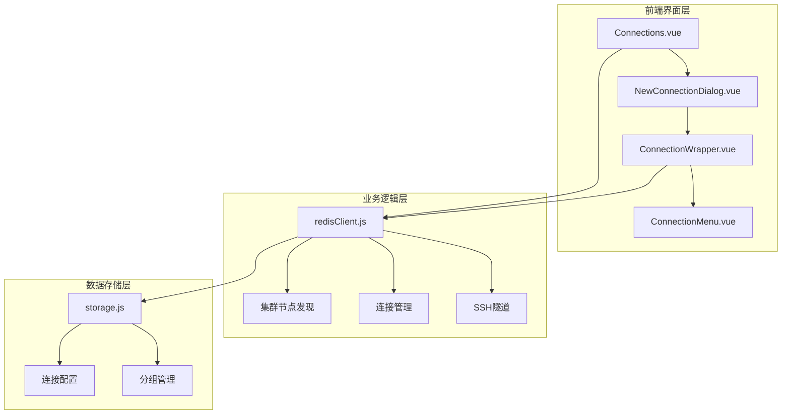
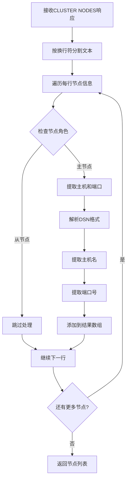
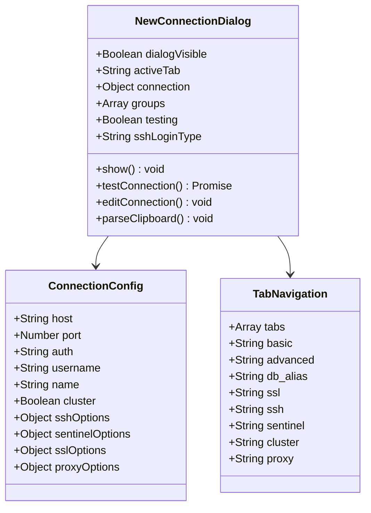
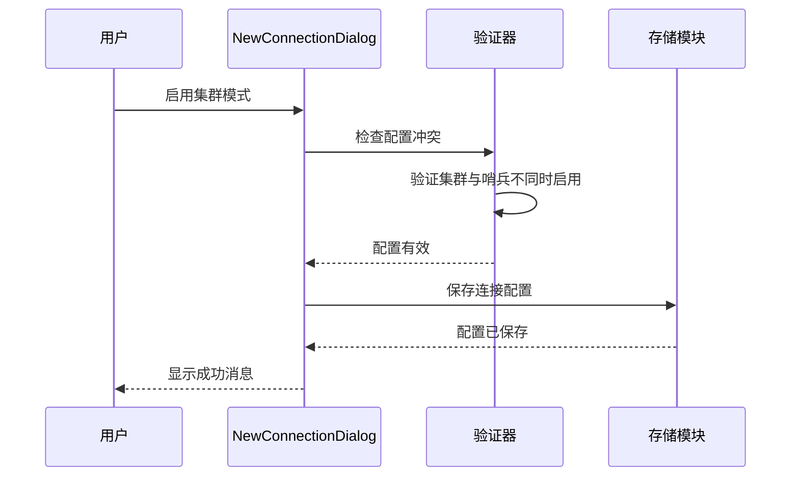
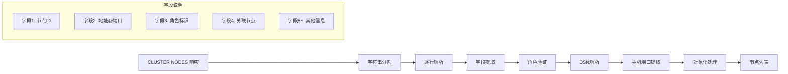
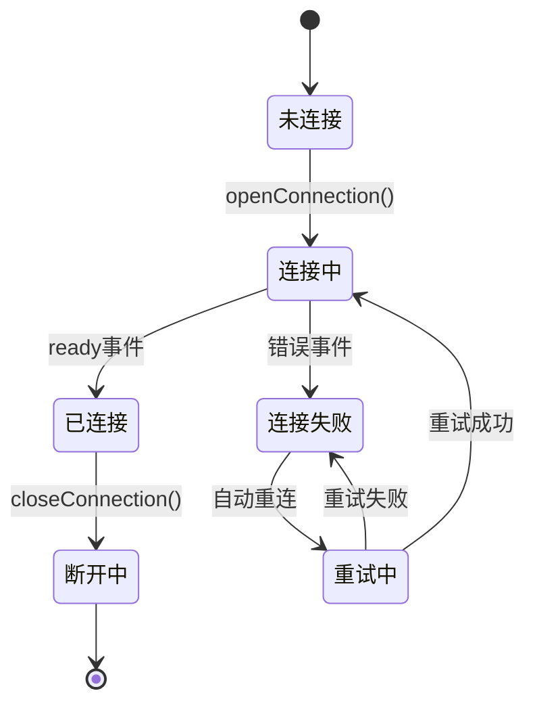
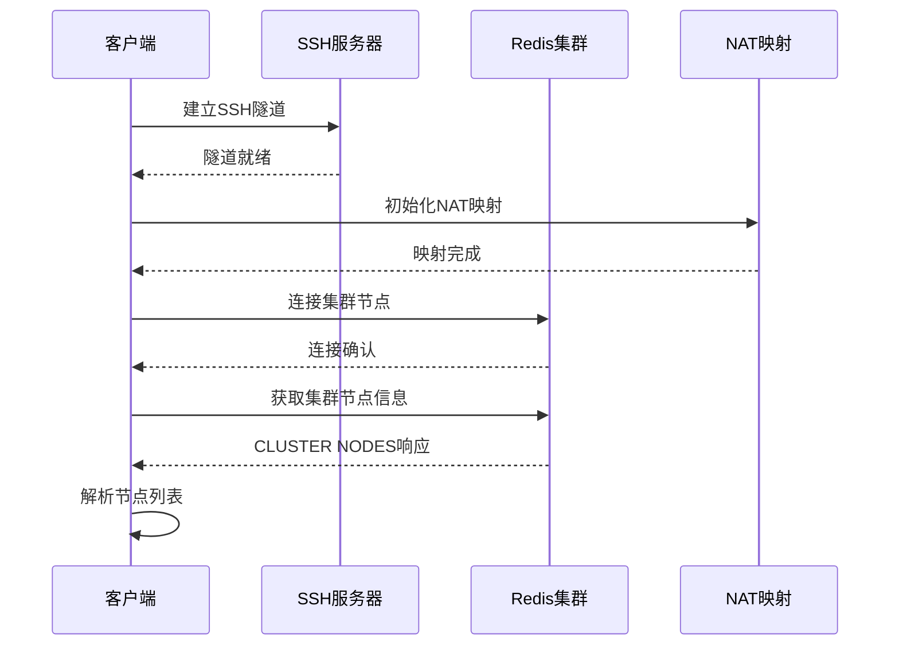
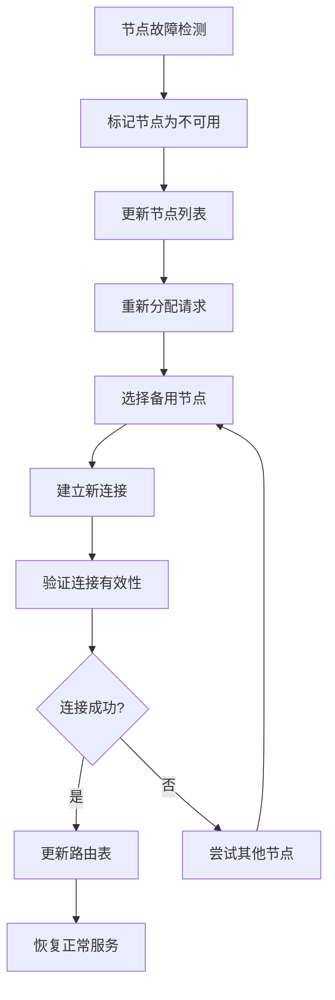

# 集群节点管理

<cite>
**本文档引用的文件**
- [redisClient.js](file://src/redisClient.js)
- [NewConnectionDialog.vue](file://src/components/NewConnectionDialog.vue)
- [Connections.vue](file://src/components/Connections.vue)
- [ConnectionWrapper.vue](file://src/components/ConnectionWrapper.vue)
- [ConnectionMenu.vue](file://src/components/ConnectionMenu.vue)
- [Status.vue](file://src/components/Status.vue)
- [addon.js](file://src/addon.js)
- [README.md](file://README.md)
</cite>

## 目录
1. [简介](#简介)
2. [项目架构概览](#项目架构概览)
3. [集群节点发现机制](#集群节点发现机制)
4. [连接配置界面设计](#连接配置界面设计)
5. [节点信息解析过程](#节点信息解析过程)
6. [连接建立与维护](#连接建立与维护)
7. [故障转移与性能优化](#故障转移与性能优化)
8. [总结](#总结)

## 简介

Another Redis Desktop Manager 是一个跨平台的 Redis 桌面管理工具，支持多种 Redis 部署模式，包括单机、哨兵（Sentinel）、集群（Cluster）和 SSH 隧道连接。本文档详细分析了该系统中集群节点的发现与管理机制，重点阐述了 Redis 客户端如何解析集群拓扑结构，并在连接界面中提供用户友好的配置体验。

## 项目架构概览

该项目采用 Vue.js 前端框架构建，后端逻辑主要集中在 Redis 客户端模块中。整体架构包含以下核心组件：

**图表来源**
- [Connections.vue](file://src/components/Connections.vue#L1-L50)
- [NewConnectionDialog.vue](file://src/components/NewConnectionDialog.vue#L1-L100)
- [redisClient.js](file://src/redisClient.js#L1-L50)

**章节来源**
- [Connections.vue](file://src/components/Connections.vue#L1-L326)
- [NewConnectionDialog.vue](file://src/components/NewConnectionDialog.vue#L1-L772)
- [redisClient.js](file://src/redisClient.js#L1-L381)

## 集群节点发现机制

### CLUSTER NODES 命令解析

系统的核心在于 `getClusterNodes` 方法，该方法负责解析 Redis 集群返回的 `CLUSTER NODES` 命令输出：

**图表来源**
- [redisClient.js](file://src/redisClient.js#L252-L274)

该方法的关键实现逻辑包括：

1. **节点过滤**：只处理指定类型的节点（默认为主节点）
2. **DSN 解析**：从节点描述字符串中提取主机和端口信息
3. **格式标准化**：确保返回的节点信息格式一致

### 节点角色识别

系统能够识别不同类型的 Redis 节点角色：

| 节点角色 | 标识字符串 | 处理方式 |
|---------|-----------|----------|
| 主节点 | 包含 "master" 字样 | 作为集群的主要工作节点 |
| 从节点 | 包含 "slave" 或 "replica" 字样 | 用于数据复制和故障转移 |
| 故障节点 | 包含 "fail" 或 "handshake" 字样 | 标记为不可用状态 |

**章节来源**
- [redisClient.js](file://src/redisClient.js#L252-L274)

## 连接配置界面设计

### 新连接对话框架构

`NewConnectionDialog.vue` 组件提供了完整的连接配置界面，支持多种部署模式：

**图表来源**
- [NewConnectionDialog.vue](file://src/components/NewConnectionDialog.vue#L305-L400)

### 集群配置选项

在集群模式标签页中，用户可以启用集群支持：

**图表来源**
- [NewConnectionDialog.vue](file://src/components/NewConnectionDialog.vue#L496-L526)

### 用户交互流程

连接配置界面提供了直观的用户交互体验：

1. **基础配置**：主机、端口、认证信息
2. **高级选项**：超时设置、视图偏好、数据库过滤
3. **协议选择**：TCP/Unix Socket 支持
4. **模式切换**：单机、集群、哨兵、SSH 隧道

**章节来源**
- [NewConnectionDialog.vue](file://src/components/NewConnectionDialog.vue#L246-L253)

## 节点信息解析过程

### 数据结构转换

系统需要将 Redis 返回的原始节点信息转换为可用的数据结构：

**图表来源**
- [redisClient.js](file://src/redisClient.js#L252-L274)

### 网络地址提取算法

节点地址提取遵循以下步骤：

1. **DSN 分割**：使用 '@' 符号分割节点描述字符串
2. **主机提取**：从分割后的第一部分提取主机信息
3. **端口定位**：查找最后一个 ':' 字符的位置
4. **字符串截取**：分别提取主机名和端口号

### 错误处理机制

系统实现了完善的错误处理机制：

- **空行跳过**：忽略无效或空白的节点信息行
- **格式验证**：确保节点信息符合预期格式
- **异常捕获**：处理解析过程中的各种异常情况

**章节来源**
- [redisClient.js](file://src/redisClient.js#L252-L274)

## 连接建立与维护

### 连接生命周期管理

`ConnectionWrapper.vue` 组件负责管理每个连接的完整生命周期：

**图表来源**
- [ConnectionWrapper.vue](file://src/components/ConnectionWrapper.vue#L71-L148)

### SSH 隧道支持

对于内部网络访问，系统支持 SSH 隧道连接：

**图表来源**
- [redisClient.js](file://src/redisClient.js#L130-L141)

### 连接状态监控

系统实现了实时的连接状态监控：

- **心跳检测**：定期发送 PING 命令检测连接状态
- **错误恢复**：自动重连机制处理临时性连接问题
- **状态通知**：向用户界面报告连接状态变化

**章节来源**
- [ConnectionWrapper.vue](file://src/components/ConnectionWrapper.vue#L150-L155)
- [redisClient.js](file://src/redisClient.js#L130-L141)

## 故障转移与性能优化

### 节点列表的作用

集群节点列表在系统中发挥着关键作用：

| 功能领域 | 节点列表用途 | 实现方式 |
|---------|-------------|----------|
| 故障检测 | 监控节点健康状态 | 定期PING检查 |
| 负载均衡 | 分散请求到不同节点 | 轮询或哈希分配 |
| 故障转移 | 自动切换到备用节点 | 主从切换机制 |
| 性能监控 | 评估集群整体性能 | 节点统计信息 |

### 连接故障转移机制

当某个节点发生故障时，系统会执行以下流程：

### 性能优化策略

系统采用了多种性能优化策略：

1. **连接池管理**：复用连接减少建立开销
2. **异步处理**：非阻塞的节点发现和连接操作
3. **缓存机制**：缓存节点信息避免重复查询
4. **批量操作**：合并多个节点的操作请求

### 内网映射支持

对于复杂的网络环境，系统支持 NAT 映射：

- **自动映射**：根据 SSH 隧道信息自动生成映射关系
- **透明转发**：对上层应用透明的地址转换
- **动态更新**：支持运行时修改映射配置

**章节来源**
- [redisClient.js](file://src/redisClient.js#L315-L321)
- [Status.vue](file://src/components/Status.vue#L335-L375)

## 总结

Another Redis Desktop Manager 的集群节点管理机制体现了现代分布式系统设计的最佳实践。通过 `redisClient.js` 中的 `getClusterNodes` 方法，系统能够准确解析 Redis 集群的拓扑结构；通过 `NewConnectionDialog.vue` 提供的用户界面，管理员可以方便地配置和管理复杂的集群连接；而 `ConnectionWrapper.vue` 则确保了连接的稳定性和可靠性。

该系统的几个关键优势：

1. **自动化程度高**：自动发现和维护集群拓扑结构
2. **用户体验优秀**：直观的配置界面和完善的错误处理
3. **扩展性强**：支持多种部署模式和网络环境
4. **稳定性好**：完善的故障检测和恢复机制

这种设计不仅提高了 Redis 管理的效率，也为用户提供了可靠的集群管理工具，是现代 Redis 管理系统的重要参考实现。