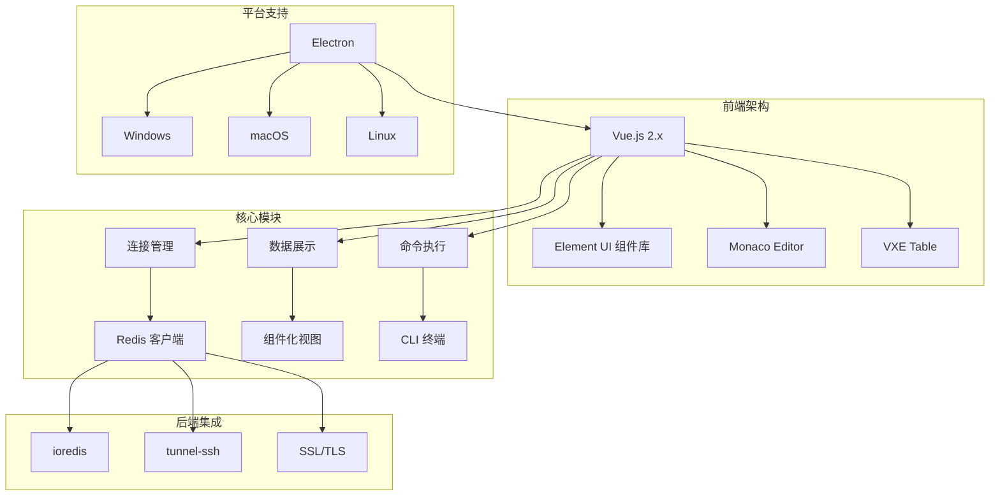
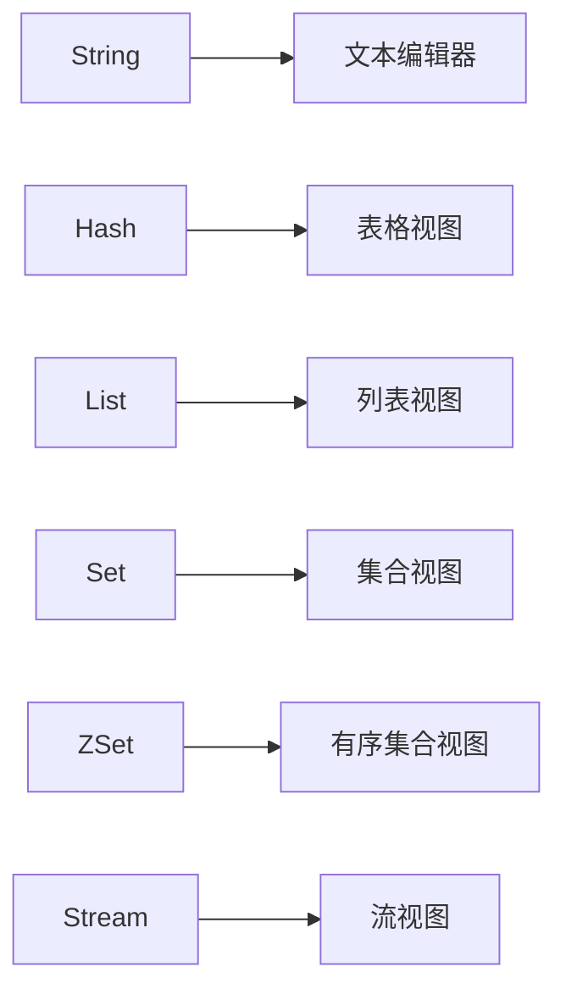
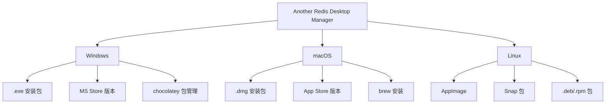

# Another Redis Desktop Manager 项目概述

<cite>
**本文档引用的文件**
- [README.md](file://README.md)
- [README.zh-CN.md](file://README.zh-CN.md)
- [package.json](file://package.json)
- [src/main.js](file://src/main.js)
- [src/App.vue](file://src/App.vue)
- [src/Aside.vue](file://src/Aside.vue)
- [src/components/Tabs.vue](file://src/components/Tabs.vue)
- [src/components/Connections.vue](file://src/components/Connections.vue)
- [src/components/MemoryAnalysis.vue](file://src/components/MemoryAnalysis.vue)
- [src/components/CliContent.vue](file://src/components/CliContent.vue)
- [src/components/KeyDetail.vue](file://src/components/KeyDetail.vue)
- [src/redisClient.js](file://src/redisClient.js)
- [src/addon.js](file://src/addon.js)
- [src/commands.js](file://src/commands.js)
- [src/i18n/i18n.js](file://src/i18n/i18n.js)
- [src/components/Setting.vue](file://src/components/Setting.vue)
</cite>

## 目录
1. [项目简介](#项目简介)
2. [核心价值与设计理念](#核心价值与设计理念)
3. [技术架构概览](#技术架构概览)
4. [主要功能特性](#主要功能特性)
5. [目标用户群体](#目标用户群体)
6. [支持的Redis模式](#支持的redis模式)
7. [数据类型支持](#数据类型支持)
8. [高级功能模块](#高级功能模块)
9. [跨平台部署能力](#跨平台部署能力)
10. [项目优势对比](#项目优势对比)
11. [应用场景分析](#应用场景分析)
12. [总结](#总结)

## 项目简介

Another Redis Desktop Manager (ARDM) 是一款专为Redis数据库设计的跨平台桌面管理工具，采用Electron框架构建，提供现代化的图形化界面来管理和操作Redis实例。该项目致力于为用户提供快速、稳定且功能丰富的Redis可视化管理体验，特别强调在处理大量数据时的性能表现和用户体验。

项目自2019年孵化以来，已经发展成为一个成熟的开源项目，在GitHub上获得了广泛的关注和支持。其核心理念是"更快、更好、更稳定"，旨在解决传统Redis管理工具在大数据量场景下的性能瓶颈问题。

**章节来源**
- [README.md](file://README.md#L1-L50)
- [package.json](file://package.json#L1-L10)

## 核心价值与设计理念

### 设计目标

ARDM的设计围绕以下几个核心目标展开：

1. **性能优先**：针对海量键值对的高效加载和显示，避免传统工具在大数据量场景下的卡顿和崩溃
2. **用户体验**：提供直观易用的图形界面，降低Redis管理的学习门槛
3. **功能完整性**：覆盖Redis的所有核心功能，从基础的数据操作到高级的集群管理
4. **跨平台兼容**：支持Windows、macOS和Linux三大主流操作系统

### 技术定位

作为基于Electron构建的桌面应用，ARDM具有以下技术特点：

- **原生性能**：利用Electron框架实现接近原生应用的性能表现
- **实时响应**：采用异步架构确保界面操作的流畅性
- **扩展性强**：模块化设计便于功能扩展和维护
- **资源优化**：针对大数据量场景进行专门的内存和渲染优化

**章节来源**
- [README.md](file://README.md#L5-L10)
- [src/main.js](file://src/main.js#L1-L20)

## 技术架构概览

ARDM采用现代化的前端技术栈，构建了一个功能完整的桌面应用架构。

**图表来源**
- [src/main.js](file://src/main.js#L1-L15)
- [package.json](file://package.json#L35-L60)

### 架构特点

1. **模块化设计**：采用Vue.js的组件化架构，每个功能模块独立封装
2. **状态管理**：通过全局事件总线实现组件间通信
3. **插件机制**：支持自定义格式化器和扩展功能
4. **国际化支持**：内置多语言切换机制

**章节来源**
- [src/App.vue](file://src/App.vue#L1-L50)
- [src/main.js](file://src/main.js#L1-L47)

## 主要功能特性

ARDM提供了全面的Redis管理功能，涵盖了从基础连接到高级运维的各种需求。

### 连接管理功能

- **多连接支持**：同时管理多个Redis实例和集群
- **连接分组**：支持按业务或环境对连接进行分类管理
- **连接状态监控**：实时显示连接健康状况
- **连接克隆**：快速复制现有连接配置

### 数据操作功能

- **键值浏览**：支持所有Redis数据类型的可视化展示
- **批量操作**：支持批量删除、重命名等操作
- **搜索功能**：全文搜索和模式匹配
- **导入导出**：支持不同格式的数据迁移

### 性能分析功能

- **内存分析**：深度扫描和统计内存使用情况
- **慢查询分析**：记录和分析执行缓慢的命令
- **实时监控**：连接状态和性能指标监控

**章节来源**
- [src/Aside.vue](file://src/Aside.vue#L1-L50)
- [src/components/Connections.vue](file://src/components/Connections.vue#L1-L100)

## 目标用户群体

ARDM面向广泛的Redis用户群体，提供针对性的功能支持：

### 开发人员

- **快速调试**：通过图形界面快速验证Redis操作
- **数据探索**：方便地浏览和分析Redis中的数据结构
- **开发测试**：在开发环境中进行Redis功能测试

### 运维工程师

- **集群管理**：管理复杂的Redis集群环境
- **性能监控**：监控Redis实例的运行状态和性能指标
- **故障排查**：快速定位和解决Redis相关问题

### 数据库管理员

- **数据备份**：定期备份和恢复Redis数据
- **容量规划**：分析数据增长趋势和存储需求
- **安全审计**：监控和审计Redis访问行为

**章节来源**
- [README.md](file://README.md#L15-L30)

## 支持的Redis模式

ARDM全面支持Redis的各种部署模式，适应不同的生产环境需求。

### 单机模式

- **标准连接**：支持传统的Redis单机实例连接
- **认证机制**：支持密码认证和用户名密码组合
- **SSL加密**：支持SSL/TLS加密传输

### 集群模式

- **自动发现**：自动识别集群节点和拓扑结构
- **负载均衡**：智能路由到合适的集群节点
- **故障转移**：支持主从切换和故障恢复

### 哨兵模式

- **高可用**：支持Redis Sentinel的高可用部署
- **自动切换**：主节点故障时自动切换到备用节点
- **配置管理**：集中管理哨兵配置和监控

### SSH隧道支持

- **安全连接**：通过SSH隧道建立安全的Redis连接
- **端口转发**：支持复杂的网络拓扑和防火墙环境
- **密钥认证**：支持SSH私钥和密码认证

**章节来源**
- [src/redisClient.js](file://src/redisClient.js#L50-L100)
- [src/addon.js](file://src/addon.js#L47-L93)

## 数据类型支持

ARDM为每种Redis数据类型提供了专门的可视化界面和操作功能。

### 基础数据类型

**图表来源**
- [src/components/KeyDetail.vue](file://src/components/KeyDetail.vue#L60-L80)

### 专用数据类型

- **JSON类型**：支持RedisJSON扩展的数据结构
- **二进制数据**：提供十六进制和文本两种查看模式
- **消息队列**：Stream类型的消息消费和生产
- **地理位置**：GeoHash相关的地理数据操作

### 扩展数据类型

- **ReJSON**：RedisJSON扩展的JSON文档存储
- **Bloom Filter**：布隆过滤器的可视化管理
- **Time Series**：时间序列数据的分析和展示

**章节来源**
- [src/components/KeyDetail.vue](file://src/components/KeyDetail.vue#L60-L80)

## 高级功能模块

### CLI终端功能

ARDM内置了功能强大的命令行界面，支持：

- **语法高亮**：Redis命令的语法高亮显示
- **自动补全**：智能的命令和参数补全
- **历史记录**：保存和重用之前的命令
- **批量执行**：支持从文件导入和批量执行命令

### 内存分析工具

- **深度扫描**：递归扫描所有键值对的内存使用
- **排序功能**：按大小排序和筛选
- **实时监控**：动态显示内存使用变化
- **导出报告**：生成详细的内存分析报告

### 慢查询分析

- **命令记录**：自动记录执行时间超过阈值的命令
- **性能分析**：分析命令执行的性能瓶颈
- **优化建议**：提供性能优化的建议

**章节来源**
- [src/components/CliContent.vue](file://src/components/CliContent.vue#L1-L50)
- [src/components/MemoryAnalysis.vue](file://src/components/MemoryAnalysis.vue#L1-L100)

## 跨平台部署能力

ARDM提供了完整的跨平台解决方案，支持主流的操作系统。

### 平台支持

**图表来源**
- [README.md](file://README.md#L20-L45)

### 部署方式

- **官方发布**：通过GitHub Releases提供各种格式的安装包
- **包管理器**：支持各平台的包管理器安装
- **便携版本**：提供无需安装的便携版本
- **容器化**：支持Docker等容器化部署

### 平台特性

- **Windows**：支持Win Store和传统安装方式
- **macOS**：支持Apple Silicon和Intel芯片
- **Linux**：支持主流发行版和包管理器

**章节来源**
- [README.md](file://README.md#L20-L45)

## 项目优势对比

与传统的Redis管理工具相比，ARDM具有显著的技术优势：

### 性能优势

| 特性 | ARDM | 传统工具 |
|------|------|----------|
| 大数据量处理 | 异步加载，内存优化 | 同步加载，容易卡顿 |
| 界面响应性 | 实时更新，流畅操作 | 操作后长时间无响应 |
| 资源占用 | 低内存占用，高效渲染 | 内存占用较高 |
| 稳定性 | 断线重连，错误恢复 | 容易崩溃，数据丢失风险 |

### 功能优势

- **可视化程度**：提供直观的数据结构可视化
- **操作便捷性**：图形化操作替代复杂命令
- **功能完整性**：覆盖Redis的所有核心功能
- **扩展性**：支持自定义格式化器和插件

### 技术优势

- **现代架构**：基于Vue.js和Electron的现代化技术栈
- **跨平台统一**：一套代码支持多个平台
- **持续更新**：活跃的社区维护和功能迭代
- **开源透明**：完全开源，可定制和扩展

**章节来源**
- [README.md](file://README.md#L5-L10)

## 应用场景分析

### 开发阶段

- **本地开发**：开发者在本地环境中进行Redis功能验证
- **单元测试**：测试Redis相关的业务逻辑
- **数据建模**：设计和验证Redis数据结构

### 测试阶段

- **集成测试**：验证Redis在整体系统中的表现
- **性能测试**：测试大数据量场景下的性能表现
- **压力测试**：评估系统的极限处理能力

### 生产环境

- **日常运维**：日常的数据管理和监控
- **故障排查**：快速定位和解决生产问题
- **容量规划**：分析数据增长趋势和存储需求

### 团队协作

- **知识共享**：团队成员之间的经验分享
- **标准化操作**：建立统一的Redis操作规范
- **培训教育**：新员工的Redis技能培训

**章节来源**
- [README.md](file://README.md#L15-L30)

## 总结

Another Redis Desktop Manager作为一个专业的Redis桌面管理工具，成功地解决了传统Redis管理工具在大数据量场景下的性能瓶颈问题。通过采用现代化的技术架构和设计理念，ARDM不仅提供了丰富的功能特性，更重要的是在用户体验和系统稳定性方面达到了新的高度。

### 核心价值

1. **性能卓越**：专门针对大数据量场景优化，避免了传统工具的性能瓶颈
2. **功能完整**：覆盖Redis的所有核心功能，满足各种使用场景
3. **易于使用**：图形化界面降低了Redis管理的学习门槛
4. **跨平台支持**：一套工具支持多个主流操作系统

### 发展前景

随着Redis在微服务架构和云原生应用中的广泛应用，ARDM将继续发挥重要作用。项目的开源特性和活跃的社区支持确保了其能够持续演进，适应不断变化的技术需求。

对于需要高效管理Redis实例的开发团队和运维人员来说，Another Redis Desktop Manager无疑是一个值得信赖的选择。它不仅提高了工作效率，更重要的是为Redis的稳定运行提供了有力保障。