# CLI终端

<cite>
**本文档中引用的文件**
- [CliTab.vue](file://src/components/CliTab.vue)
- [redisClient.js](file://src/redisClient.js)
- [commands.js](file://src/commands.js)
- [bus.js](file://src/bus.js)
- [CliContent.vue](file://src/components/CliContent.vue)
- [util.js](file://src/util.js)
- [storage.js](file://src/storage.js)
</cite>

## 目录
1. [简介](#简介)
2. [项目结构](#项目结构)
3. [核心组件](#核心组件)
4. [架构概览](#架构概览)
5. [详细组件分析](#详细组件分析)
6. [依赖关系分析](#依赖关系分析)
7. [性能考虑](#性能考虑)
8. [故障排除指南](#故障排除指南)
9. [结论](#结论)

## 简介

CLI终端是Another Redis Desktop Manager中的核心交互式Redis命令行界面组件，提供了完整的Redis命令执行环境。该组件实现了智能命令补全、历史记录管理、多命令执行模式、订阅模式和监控模式等高级功能，为用户提供了类似原生命令行的体验。

## 项目结构

CLI终端功能主要分布在以下关键文件中：

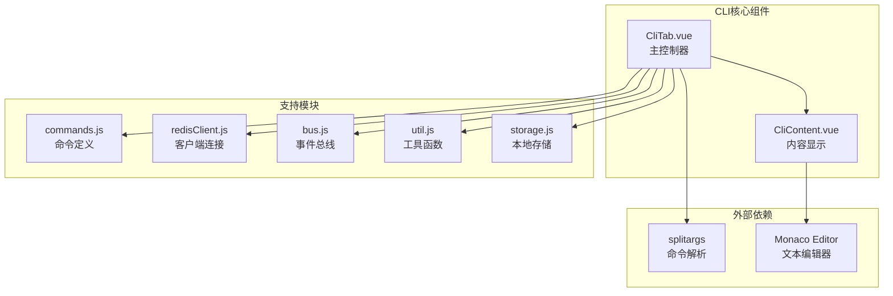

**图表来源**
- [CliTab.vue](file://src/components/CliTab.vue#L1-L50)
- [CliContent.vue](file://src/components/CliContent.vue#L1-L30)
- [commands.js](file://src/commands.js#L1-L200)

**章节来源**
- [CliTab.vue](file://src/components/CliTab.vue#L1-L467)
- [CliContent.vue](file://src/components/CliContent.vue#L1-L166)

## 核心组件

### CliTab.vue - 主控制器

CliTab.vue是CLI终端的核心控制器，负责：
- 命令输入和解析
- 结果显示和格式化
- 历史记录管理
- 多命令执行模式
- 订阅和监控模式

### CliContent.vue - 内容显示器

CliContent.vue基于Monaco Editor提供：
- 语法高亮显示
- 自动滚动到底部
- 只读模式保护
- 字体和主题定制

**章节来源**
- [CliTab.vue](file://src/components/CliTab.vue#L37-L110)
- [CliContent.vue](file://src/components/CliContent.vue#L12-L95)

## 架构概览

CLI终端采用分层架构设计，确保了良好的可维护性和扩展性：

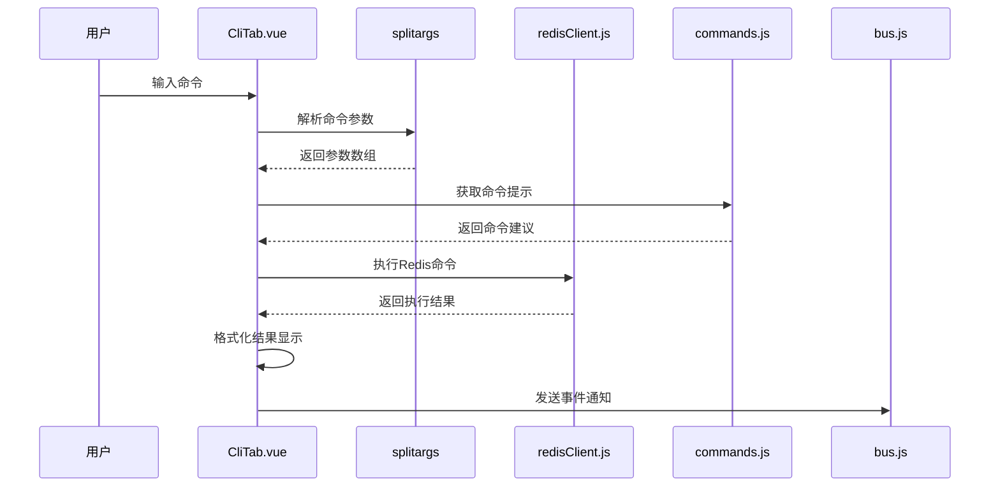

**图表来源**
- [CliTab.vue](file://src/components/CliTab.vue#L188-L285)
- [redisClient.js](file://src/redisClient.js#L9-L38)

## 详细组件分析

### 命令自动补全功能

#### 基于allCMD的命令提示系统

CLI终端实现了智能的命令自动补全功能，基于`allCMD`对象提供完整的Redis命令支持：

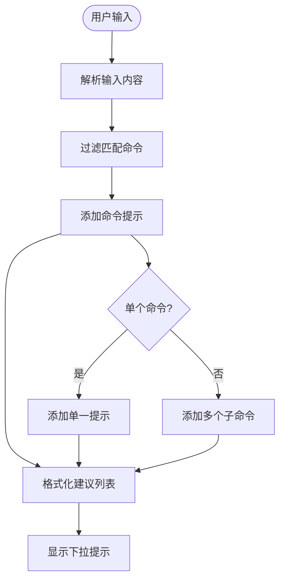

**图表来源**
- [CliTab.vue](file://src/components/CliTab.vue#L118-L162)
- [commands.js](file://src/commands.js#L197-L200)

#### 参数建议机制

系统根据当前输入的命令动态提供参数建议：

| 命令类型 | 提供建议内容 | 实现位置 |
|---------|-------------|----------|
| 单一命令 | 完整命令语法 | `addCMDTips` 方法 |
| 子命令集合 | 所有可用子命令 | 遍历 `allCMD` 对象 |
| 特殊命令 | 动态参数提示 | 条件判断分支 |

**章节来源**
- [CliTab.vue](file://src/components/CliTab.vue#L118-L162)
- [commands.js](file://src/commands.js#L1-L200)

### 历史记录管理机制

#### 命令存储策略

CLI终端实现了高效的历史记录管理系统：

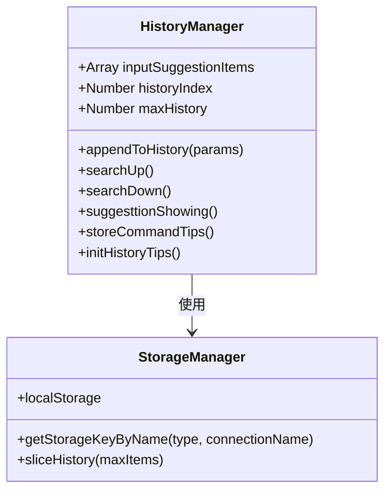

**图表来源**
- [CliTab.vue](file://src/components/CliTab.vue#L412-L425)
- [storage.js](file://src/storage.js#L310-L315)

#### 快捷键操作实现

历史记录支持上下箭头导航：

| 操作 | 快捷键 | 实现方法 | 功能描述 |
|------|--------|----------|----------|
| 向上查找 | ↑ | `searchUp()` | 查找上一条历史命令 |
| 向下查找 | ↓ | `searchDown()` | 查找下一条历史命令 |
| 清空输入 | Ctrl+L | `initShortcut()` | 清空命令输入框 |

**章节来源**
- [CliTab.vue](file://src/components/CliTab.vue#L362-L391)
- [CliTab.vue](file://src/components/CliTab.vue#L401-L411)

### 多命令执行模式（MULTI/EXEC）

#### MULTI/EXEC事务处理

CLI终端支持Redis的MULTI/EXEC事务模式：

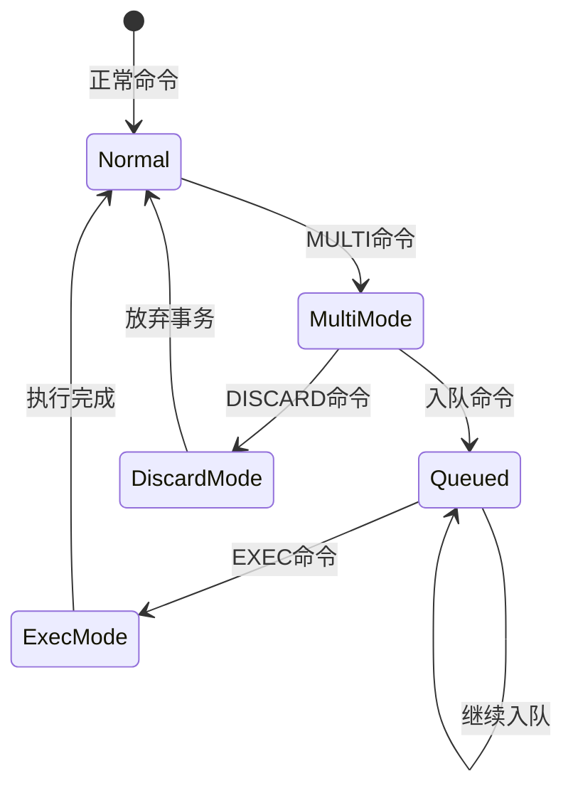

**图表来源**
- [CliTab.vue](file://src/components/CliTab.vue#L212-L246)

#### 事务状态管理

| 命令 | 状态变化 | 处理逻辑 | 错误处理 |
|------|----------|----------|----------|
| MULTI | 进入事务模式 | 初始化命令队列 | 无 |
| 其他命令 | 入队到multiQueue | 添加到事务队列 | QUEUED响应 |
| EXEC | 执行事务 | 批量执行所有命令 | 返回批量结果 |
| DISCARD | 放弃事务 | 清空命令队列 | OK响应 |

**章节来源**
- [CliTab.vue](file://src/components/CliTab.vue#L212-L246)

### 订阅模式（SUBSCRIBE）和监控模式（MONITOR）

#### 订阅模式特殊处理

订阅模式需要特殊的生命周期管理：

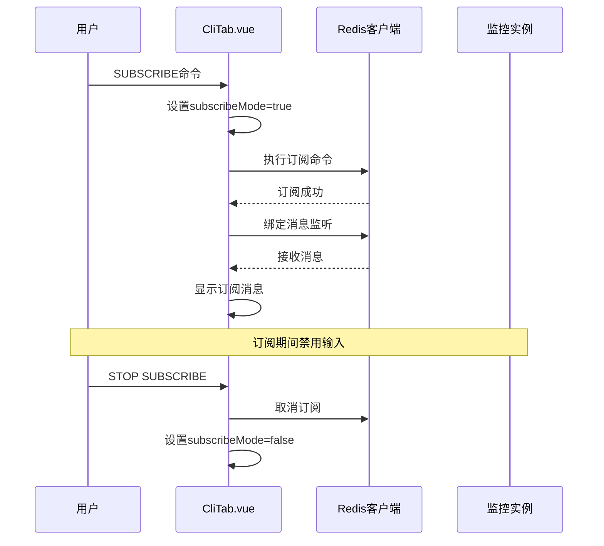

**图表来源**
- [CliTab.vue](file://src/components/CliTab.vue#L254-L257)
- [CliTab.vue](file://src/components/CliTab.vue#L163-L174)

#### 监控模式实现

监控模式提供实时的Redis命令监控：

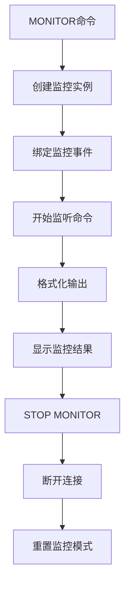

**图表来源**
- [CliTab.vue](file://src/components/CliTab.vue#L259-L268)

**章节来源**
- [CliTab.vue](file://src/components/CliTab.vue#L254-L268)
- [CliTab.vue](file://src/components/CliTab.vue#L163-L174)

### 命令解析和结果处理

#### splitargs命令解析

系统使用`@qii404/redis-splitargs`库进行精确的命令解析：

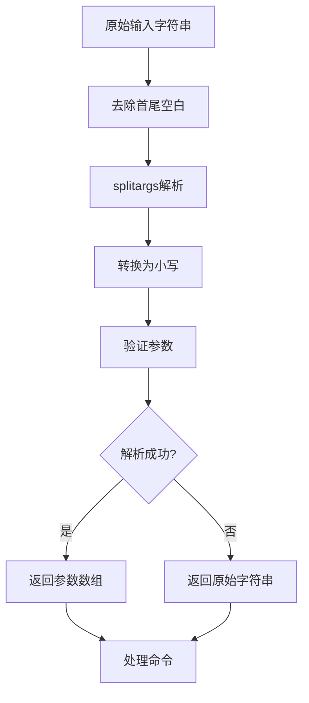

**图表来源**
- [CliTab.vue](file://src/components/CliTab.vue#L56-L66)

#### resolveResult结果处理

复杂的结果处理逻辑支持多种数据类型的格式化：

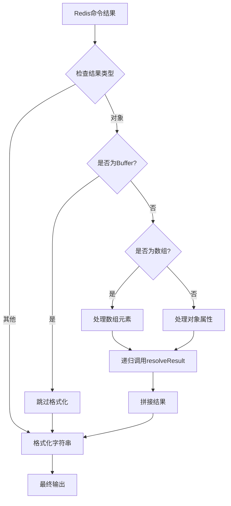

**图表来源**
- [CliTab.vue](file://src/components/CliTab.vue#L329-L361)

**章节来源**
- [CliTab.vue](file://src/components/CliTab.vue#L56-L66)
- [CliTab.vue](file://src/components/CliTab.vue#L329-L361)

### 与redisClient.js的交互

#### 客户端连接管理

CLI终端通过复制客户端连接避免状态冲突：

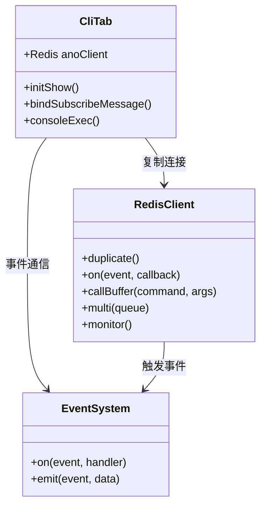

**图表来源**
- [CliTab.vue](file://src/components/CliTab.vue#L96-L105)
- [redisClient.js](file://src/redisClient.js#L51-L87)

#### 错误处理流程

系统实现了完善的错误处理机制：

| 错误类型 | 处理方式 | 用户反馈 | 恢复策略 |
|---------|----------|----------|----------|
| 命令解析错误 | 捕获异常 | 显示错误信息 | 清空输入框 |
| Redis连接错误 | Promise.catch | 显示连接失败 | 尝试重新连接 |
| 事务错误 | 特殊处理 | 显示错误详情 | 放弃当前事务 |
| 订阅错误 | 状态重置 | 显示停止订阅 | 清空订阅状态 |

**章节来源**
- [CliTab.vue](file://src/components/CliTab.vue#L277-L284)
- [CliTab.vue](file://src/components/CliTab.vue#L235-L243)

### 事件总线通信

#### 与其他组件的通信

CLI终端通过事件总线与应用其他部分通信：

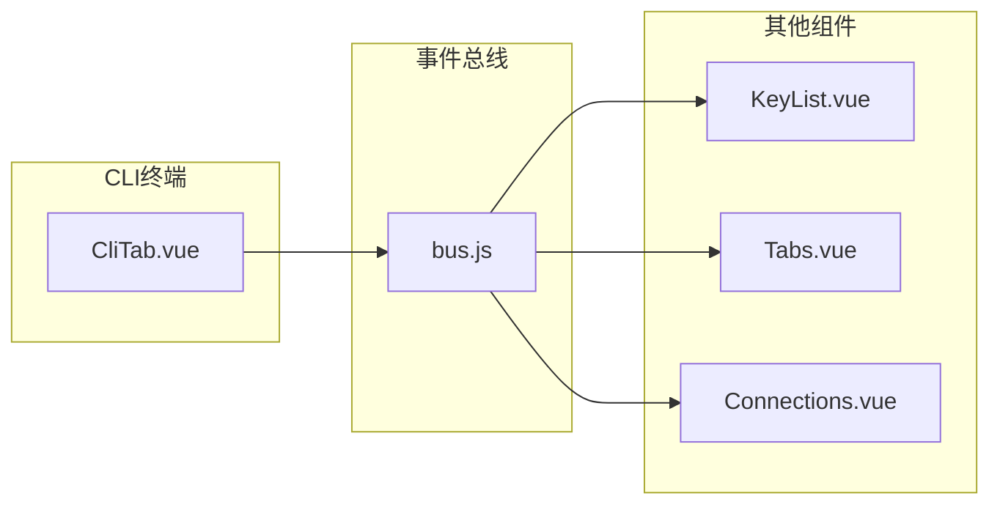

**图表来源**
- [CliTab.vue](file://src/components/CliTab.vue#L286-L300)
- [bus.js](file://src/bus.js#L1-L19)

**章节来源**
- [CliTab.vue](file://src/components/CliTab.vue#L286-L300)
- [bus.js](file://src/bus.js#L1-L19)

## 依赖关系分析

### 核心依赖图

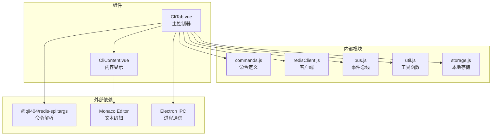

**图表来源**
- [CliTab.vue](file://src/components/CliTab.vue#L32-L35)
- [storage.js](file://src/storage.js#L1-L10)

### 模块间耦合度分析

| 耦合类型 | 耦合程度 | 说明 | 改进建议 |
|---------|----------|------|----------|
| 数据耦合 | 中等 | 通过props传递数据 | 保持现状 |
| 控制耦合 | 低 | 事件总线通信 | 优化事件命名 |
| 内容耦合 | 低 | 函数调用关系 | 模块化重构 |
| 公共耦合 | 低 | 共享配置对象 | 抽象配置层 |

**章节来源**
- [CliTab.vue](file://src/components/CliTab.vue#L32-L35)
- [redisClient.js](file://src/redisClient.js#L1-L10)

## 性能考虑

### 内存管理优化

CLI终端实现了多项内存优化策略：

1. **历史记录限制**：最多保存2000条命令历史
2. **内容截断**：当内容超过最大历史限制时自动截断
3. **及时清理**：组件销毁时清理事件监听器

### 响应性优化

1. **防抖处理**：命令建议的防抖延迟设置为10ms
2. **异步处理**：Redis命令执行采用Promise链式调用
3. **增量更新**：只更新变化的内容区域

### 网络优化

1. **连接复用**：通过复制客户端连接避免状态冲突
2. **错误重试**：实现指数退避重试机制
3. **连接池管理**：合理管理Redis连接生命周期

## 故障排除指南

### 常见问题及解决方案

#### 命令执行失败

**问题症状**：命令输入后没有响应或显示错误

**排查步骤**：
1. 检查网络连接状态
2. 验证Redis服务器是否正常运行
3. 确认命令语法是否正确
4. 查看浏览器控制台错误信息

**解决方案**：
- 重新建立Redis连接
- 检查防火墙设置
- 验证认证凭据

#### 命令补全不工作

**问题症状**：输入命令时没有出现自动补全提示

**排查步骤**：
1. 检查浏览器JavaScript是否启用
2. 验证Vue组件是否正确加载
3. 确认命令定义是否完整

**解决方案**：
- 刷新页面重新加载组件
- 检查网络连接
- 清除浏览器缓存

#### 订阅模式异常

**问题症状**：订阅命令执行后无法接收消息

**排查步骤**：
1. 检查订阅通道名称是否正确
2. 验证发布者是否正常工作
3. 确认网络连接稳定

**解决方案**：
- 重新执行订阅命令
- 检查发布者状态
- 重启CLI会话

**章节来源**
- [CliTab.vue](file://src/components/CliTab.vue#L277-L284)
- [CliTab.vue](file://src/components/CliTab.vue#L163-L174)

## 结论

Another Redis Desktop Manager的CLI终端是一个功能完整、设计精良的交互式Redis命令行界面。它成功地将复杂的Redis功能封装在直观易用的界面中，同时保持了高性能和良好的用户体验。

### 主要优势

1. **功能完整性**：支持所有Redis命令和高级特性
2. **用户体验**：智能命令补全和历史记录管理
3. **技术先进性**：采用现代Web技术栈
4. **可扩展性**：模块化设计便于功能扩展

### 改进建议

1. **性能优化**：进一步优化大量数据的显示性能
2. **功能增强**：添加更多高级编辑功能
3. **错误处理**：完善错误恢复机制
4. **文档完善**：提供更详细的使用指南

CLI终端作为Redis桌面管理器的核心功能，为用户提供了专业级的Redis命令行体验，是现代数据库管理工具的重要组成部分。