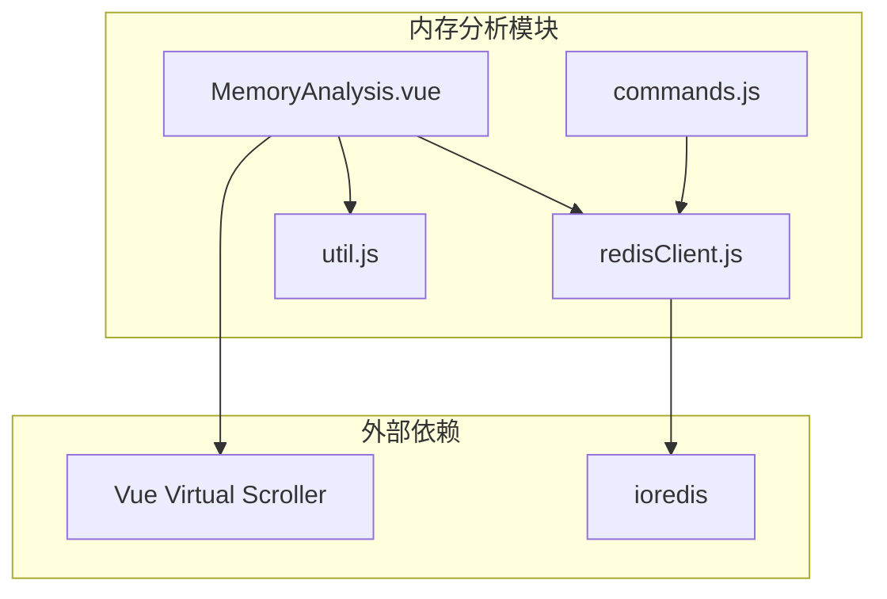
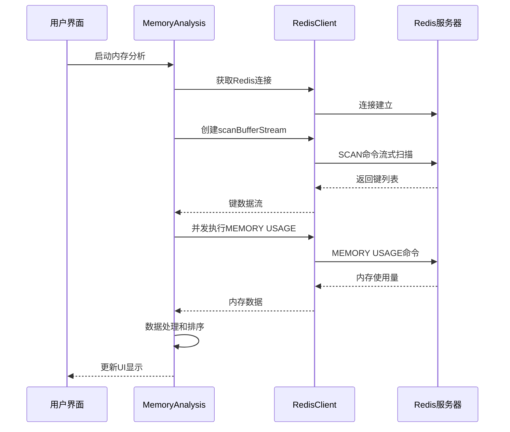
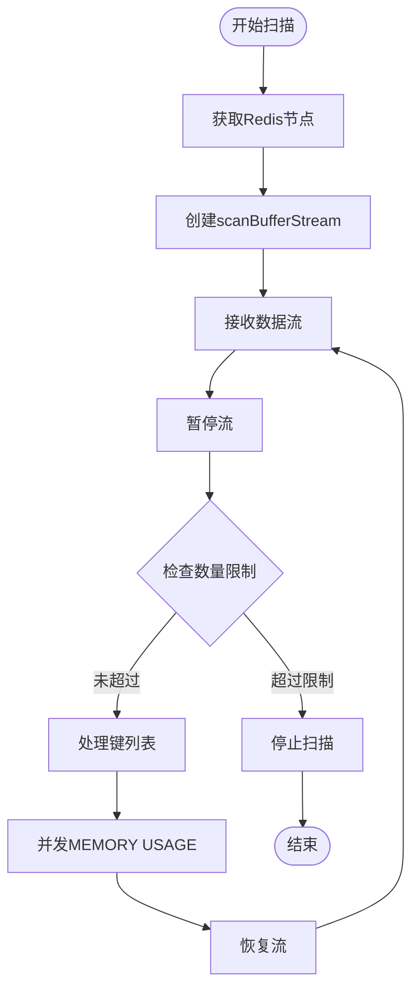
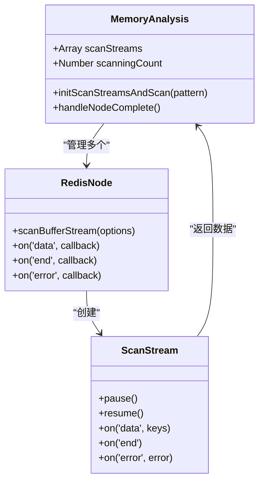
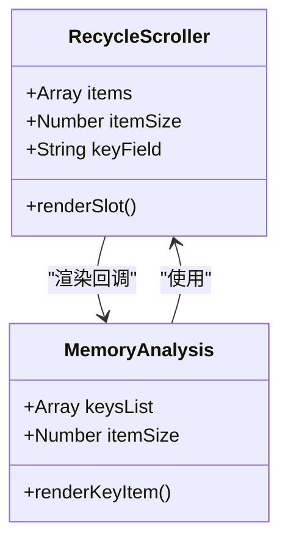
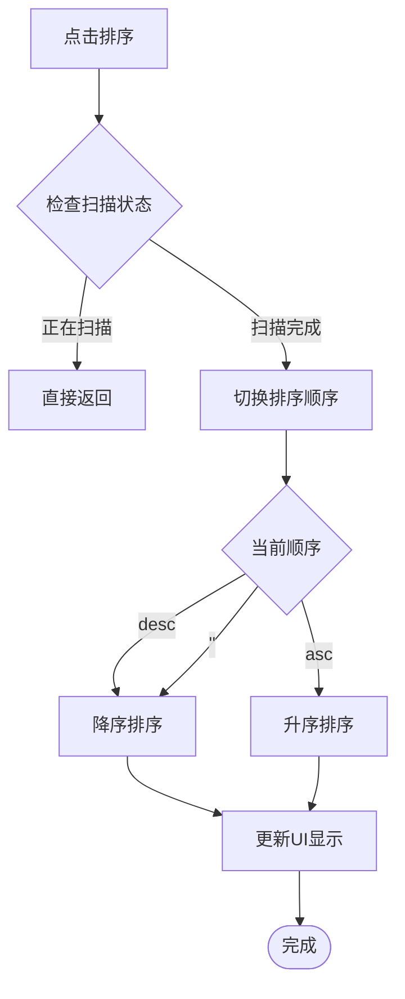
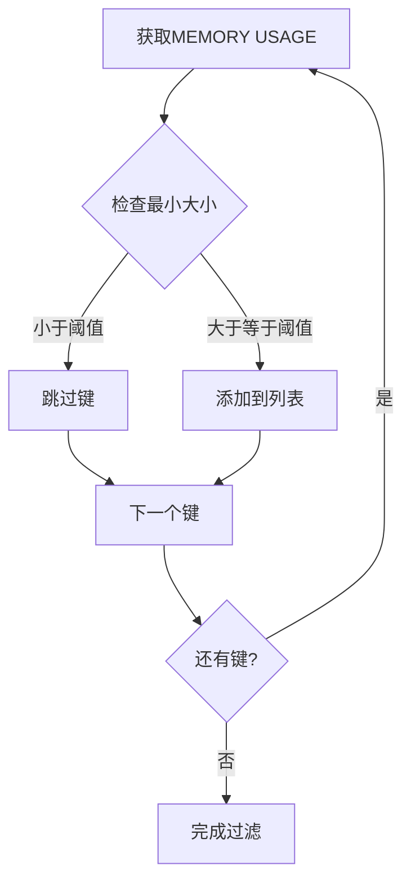
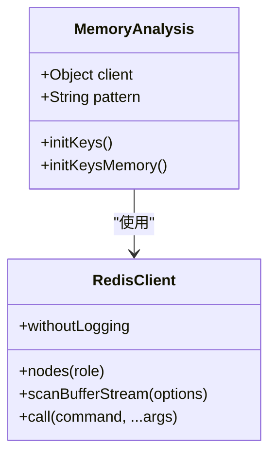
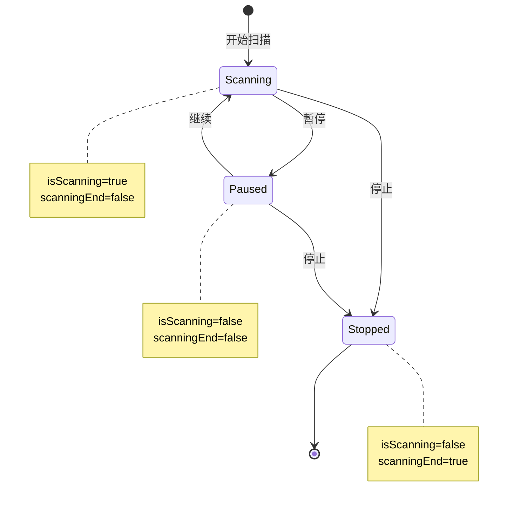
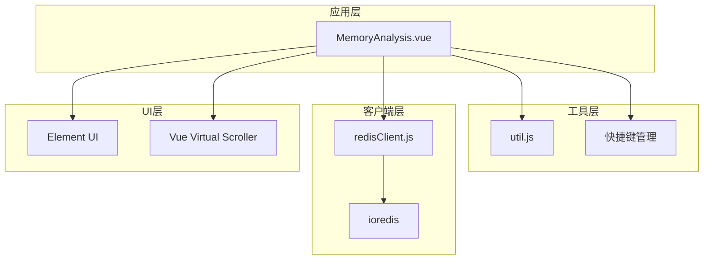

# 内存分析功能详细文档

<cite>
**本文档中引用的文件**
- [MemoryAnalysis.vue](file://src/components/MemoryAnalysis.vue)
- [redisClient.js](file://src/redisClient.js)
- [util.js](file://src/util.js)
- [commands.js](file://src/commands.js)
- [cn.js](file://src/i18n/langs/cn.js)
</cite>

## 目录
1. [简介](#简介)
2. [项目结构](#项目结构)
3. [核心组件](#核心组件)
4. [架构概览](#架构概览)
5. [详细组件分析](#详细组件分析)
6. [依赖关系分析](#依赖关系分析)
7. [性能考虑](#性能考虑)
8. [故障排除指南](#故障排除指南)
9. [结论](#结论)

## 简介

内存分析功能是Another Redis Desktop Manager (ARDM)中的一个重要特性，专门用于帮助用户分析Redis数据库中的内存使用情况。该功能通过MEMORY USAGE命令获取键的内存占用信息，采用流式扫描策略处理大型数据库，并结合虚拟滚动技术优化大量数据的显示性能。

## 项目结构

内存分析功能主要由以下核心文件组成：

**图表来源**
- [MemoryAnalysis.vue](file://src/components/MemoryAnalysis.vue#L79-L96)
- [redisClient.js](file://src/redisClient.js#L1-L10)

**章节来源**
- [MemoryAnalysis.vue](file://src/components/MemoryAnalysis.vue#L1-L331)
- [redisClient.js](file://src/redisClient.js#L1-L381)

## 核心组件

### MemoryAnalysis.vue 组件

MemoryAnalysis.vue是内存分析功能的核心组件，实现了完整的内存分析流程，包括键扫描、内存计算、排序和显示等功能。

#### 主要数据属性

| 属性名 | 类型 | 默认值 | 描述 |
|--------|------|--------|------|
| keysList | Array | [] | 存储分析结果的键列表 |
| isScanning | Boolean | false | 当前是否正在扫描状态 |
| scanningEnd | Boolean | false | 扫描是否已完成 |
| scanStreams | Array | [] | 扫描流数组，支持多节点并行扫描 |
| sortOrder | String | '' | 排序顺序（asc/desc） |
| scanMax | Number | 200000 | 最大扫描数量限制 |
| scanPageSize | Number | 2000 | 每次扫描的页面大小 |
| totalSize | Number | 0 | 总内存使用量 |
| minSizeKB | Number | 0 | 最小内存大小过滤阈值 |

#### 关键方法

1. **initKeys()**: 初始化扫描过程，重置所有状态
2. **initScanStreamsAndScan()**: 创建扫描流并开始扫描
3. **initKeysMemory()**: 并发执行MEMORY USAGE命令获取内存信息
4. **toggleScanning()**: 控制扫描的暂停/继续
5. **toggleOrder()**: 切换排序方式
6. **reOrder()**: 执行实际的排序操作

**章节来源**
- [MemoryAnalysis.vue](file://src/components/MemoryAnalysis.vue#L81-L101)
- [MemoryAnalysis.vue](file://src/components/MemoryAnalysis.vue#L102-L259)

## 架构概览

内存分析功能采用分层架构设计，从底层的Redis连接到顶层的用户界面，形成了完整的分析流水线。

**图表来源**
- [MemoryAnalysis.vue](file://src/components/MemoryAnalysis.vue#L103-L162)
- [redisClient.js](file://src/redisClient.js#L51-L87)

## 详细组件分析

### 流式扫描策略

#### scanBufferStream的使用

MemoryAnalysis组件利用ioredis提供的scanBufferStream方法实现高效的流式扫描：

**图表来源**
- [MemoryAnalysis.vue](file://src/components/MemoryAnalysis.vue#L110-L162)

#### 多节点并行扫描

对于Redis集群环境，系统支持多节点并行扫描：

**图表来源**
- [MemoryAnalysis.vue](file://src/components/MemoryAnalysis.vue#L110-L162)
- [redisClient.js](file://src/redisClient.js#L51-L87)

**章节来源**
- [MemoryAnalysis.vue](file://src/components/MemoryAnalysis.vue#L110-L162)

### 虚拟滚动优化

#### RecycleScroller的集成

为了处理大量键的显示，系统集成了vue-virtual-scroller的RecycleScroller组件：

**图表来源**
- [MemoryAnalysis.vue](file://src/components/MemoryAnalysis.vue#L53-L67)

#### 性能优化机制

虚拟滚动通过以下机制实现性能优化：

1. **视口渲染**: 只渲染可见区域的内容
2. **固定高度**: 使用固定的item-size减少布局计算
3. **延迟加载**: 通过setTimeout实现渐进式渲染
4. **内存管理**: 自动回收不可见元素的DOM

**章节来源**
- [MemoryAnalysis.vue](file://src/components/MemoryAnalysis.vue#L53-L67)

### 排序功能实现

#### 内存大小排序

系统支持按内存大小进行升序或降序排序：

**图表来源**
- [MemoryAnalysis.vue](file://src/components/MemoryAnalysis.vue#L222-L238)

#### 排序算法

排序功能使用JavaScript原生的sort方法，时间复杂度为O(n log n)：

- **降序排序**: `(a, b) => b.size - a.size`
- **升序排序**: `(a, b) => a.size - b.size`

**章节来源**
- [MemoryAnalysis.vue](file://src/components/MemoryAnalysis.vue#L222-L238)

### 过滤功能

#### 最小大小过滤

系统提供了基于内存大小的过滤功能：

**图表来源**
- [MemoryAnalysis.vue](file://src/components/MemoryAnalysis.vue#L176-L178)

#### 模式匹配搜索

支持通配符模式匹配，通过SCAN命令的match参数实现：

- `*`: 匹配任意字符
- `prefix*`: 以指定前缀开头
- `*suffix`: 以指定后缀结尾
- `*middle*`: 包含指定中间字符串

**章节来源**
- [MemoryAnalysis.vue](file://src/components/MemoryAnalysis.vue#L115-L117)

### 与Redis客户端的集成

#### redisClient.js的适配

MemoryAnalysis组件通过props接收redisClient实例，支持多种Redis部署模式：

**图表来源**
- [MemoryAnalysis.vue](file://src/components/MemoryAnalysis.vue#L95-L95)
- [redisClient.js](file://src/redisClient.js#L51-L87)

#### 版本兼容性处理

系统通过以下方式处理不同Redis版本的兼容性：

1. **MEMORY USAGE命令检测**: 如果命令被禁用，返回0值
2. **错误处理**: 捕获并优雅处理命令执行异常
3. **降级策略**: 在不支持的环境中提供基本功能

**章节来源**
- [MemoryAnalysis.vue](file://src/components/MemoryAnalysis.vue#L183-L186)
- [redisClient.js](file://src/redisClient.js#L12-L37)

### 控制逻辑

#### 暂停/继续扫描

系统提供了灵活的扫描控制机制：

**图表来源**
- [MemoryAnalysis.vue](file://src/components/MemoryAnalysis.vue#L197-L221)

#### 快捷键支持

系统支持键盘快捷键操作：

- **Ctrl+R / Cmd+R / F5**: 重新启动扫描
- 扫描进行中时快捷键无效

**章节来源**
- [MemoryAnalysis.vue](file://src/components/MemoryAnalysis.vue#L240-L249)

## 依赖关系分析

### 外部依赖

**图表来源**
- [MemoryAnalysis.vue](file://src/components/MemoryAnalysis.vue#L79-L96)
- [redisClient.js](file://src/redisClient.js#L1-L10)

### 内部依赖

系统内部各模块之间的依赖关系清晰明确：

1. **MemoryAnalysis.vue** → **util.js**: 使用humanFileSize格式化函数
2. **MemoryAnalysis.vue** → **redisClient.js**: 通过props接收客户端实例
3. **MemoryAnalysis.vue** → **i18n**: 使用翻译文本
4. **MemoryAnalysis.vue** → **快捷键系统**: 集成键盘快捷键

**章节来源**
- [MemoryAnalysis.vue](file://src/components/MemoryAnalysis.vue#L79-L96)
- [util.js](file://src/util.js#L190-L196)

## 性能考虑

### 扫描参数优化

系统提供了可配置的性能参数：

| 参数 | 默认值 | 说明 | 调优建议 |
|------|--------|------|----------|
| scanPageSize | 2000 | 每次扫描的键数量 | 根据内存容量调整，避免过大导致内存溢出 |
| scanMax | 200000 | 最大扫描数量 | 根据实际需求设置，平衡完整性和性能 |
| itemSize | 24px | 虚拟滚动项高度 | 固定高度有助于提高渲染性能 |

### 内存使用优化

1. **流式处理**: 避免一次性加载所有数据到内存
2. **并发控制**: 通过setTimeout实现渐进式渲染
3. **及时清理**: 组件销毁时自动清理扫描流
4. **缓存策略**: 对于重复扫描，复用已有的扫描流

### 网络优化

1. **批量请求**: 将多个MEMORY USAGE请求合并处理
2. **错误重试**: 实现智能的错误处理和重试机制
3. **连接池**: 充分利用ioredis的连接池特性

## 故障排除指南

### 常见问题及解决方案

#### MEMORY命令被禁用

当Redis服务器禁用了MEMORY命令时，系统会显示警告信息：
- **症状**: 键的内存使用量显示为0
- **原因**: Redis配置中禁用了MEMORY命令
- **解决方案**: 检查Redis配置，确保MEMORY命令可用

#### 扫描超时

- **症状**: 扫描长时间无响应
- **原因**: 数据库过大或网络延迟
- **解决方案**: 调整scanPageSize参数，增加超时时间

#### 内存不足

- **症状**: 应用程序卡顿或崩溃
- **原因**: 处理的数据量过大
- **解决方案**: 减少scanMax限制，启用虚拟滚动

#### 权限问题

- **症状**: 无法执行MEMORY USAGE命令
- **原因**: Redis用户权限不足
- **解决方案**: 确保用户具有足够的权限执行MEMORY命令

**章节来源**
- [MemoryAnalysis.vue](file://src/components/MemoryAnalysis.vue#L12-L13)
- [MemoryAnalysis.vue](file://src/components/MemoryAnalysis.vue#L151-L152)

### 性能调优建议

#### 扫描参数调优

1. **scanPageSize**: 根据服务器性能和内存容量调整
   - 小型服务器：1000-2000
   - 中型服务器：2000-5000
   - 大型服务器：5000-10000

2. **scanMax**: 根据分析需求设置
   - 一般分析：50000-100000
   - 详细分析：200000-500000
   - 完整分析：1000000+

#### 显示优化

1. **虚拟滚动**: 确保item-size设置合理
2. **过滤功能**: 合理使用最小大小过滤减少显示数量
3. **排序策略**: 根据需求选择合适的排序方式

#### 网络优化

1. **连接池**: 配置适当的连接池大小
2. **超时设置**: 根据网络状况调整超时时间
3. **重试机制**: 实现指数退避的重试策略

## 结论

内存分析功能通过精心设计的架构和优化策略，成功解决了大型Redis数据库内存分析的挑战。该功能的主要优势包括：

1. **高效扫描**: 基于scanBufferStream的流式扫描策略，能够处理大规模数据集
2. **性能优化**: 虚拟滚动技术确保了大量数据的流畅显示
3. **灵活控制**: 提供了丰富的控制选项，满足不同场景需求
4. **错误处理**: 完善的错误处理和降级策略保证了系统的稳定性
5. **用户体验**: 直观的界面设计和快捷键支持提升了使用体验

该功能为Redis管理员和开发者提供了强大的内存分析工具，有助于更好地理解和优化Redis数据库的内存使用情况。通过合理的配置和调优，可以在各种规模的Redis部署中发挥重要作用。