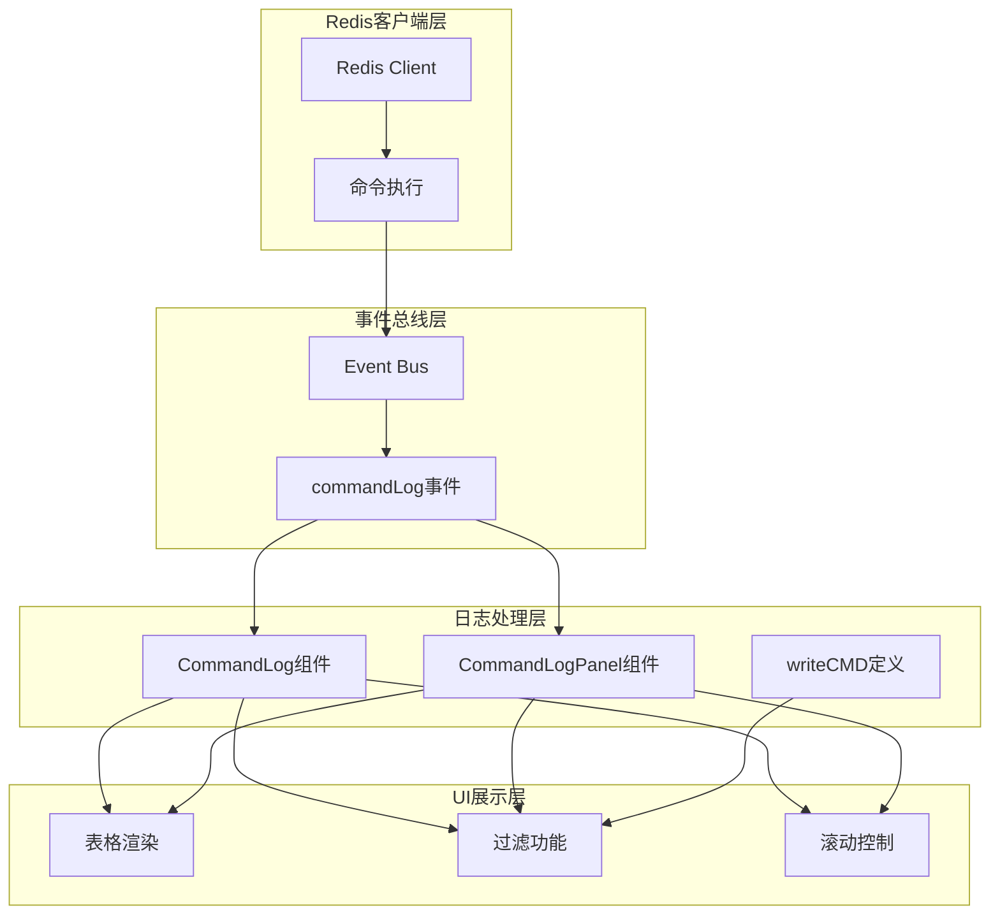
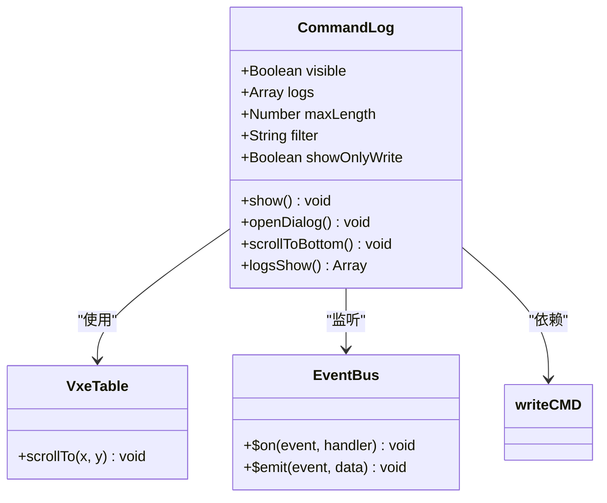
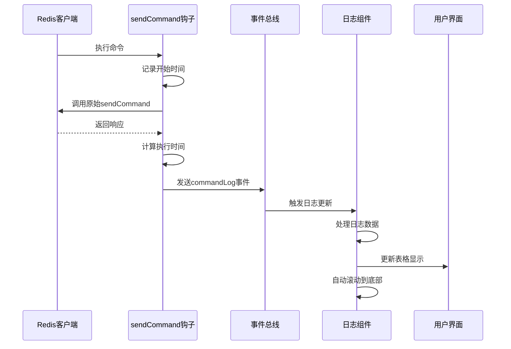
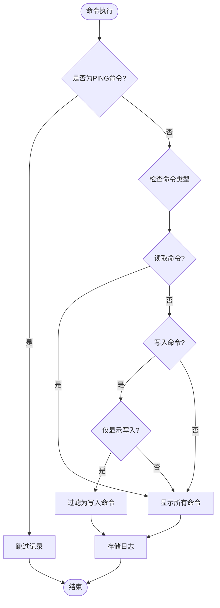
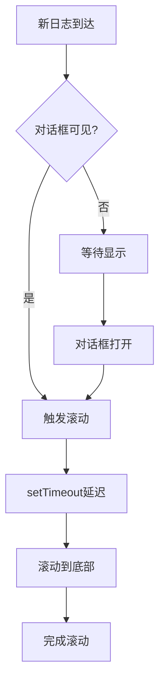
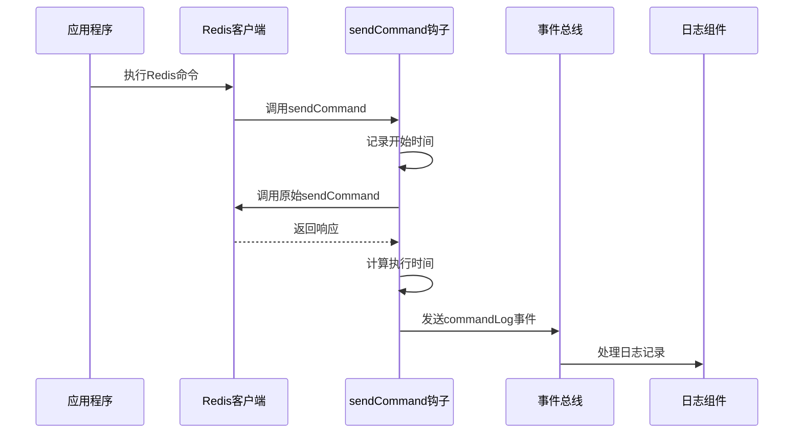

# 命令日志功能详细文档

<cite>
**本文档中引用的文件**
- [CommandLog.vue](file://src/components/CommandLog.vue)
- [CommandLogPanel.vue](file://src/components/CommandLogPanel.vue)
- [commands.js](file://src/commands.js)
- [redisClient.js](file://src/redisClient.js)
- [bus.js](file://src/bus.js)
- [Aside.vue](file://src/Aside.vue)
- [App.vue](file://src/App.vue)
- [storage.js](file://src/storage.js)
</cite>

## 目录
1. [简介](#简介)
2. [系统架构概览](#系统架构概览)
3. [核心组件分析](#核心组件分析)
4. [事件总线机制](#事件总线机制)
5. [日志过滤功能](#日志过滤功能)
6. [性能优化策略](#性能优化策略)
7. [用户界面交互](#用户界面交互)
8. [与Redis客户端集成](#与redis客户端集成)
9. [扩展方案](#扩展方案)
10. [故障排除指南](#故障排除指南)

## 简介

命令日志功能是Another Redis Desktop Manager中的一个重要特性，它能够实时捕获和展示Redis命令的执行历史。该功能通过事件总线机制监听命令执行事件，提供丰富的过滤选项，并采用多种性能优化策略确保系统的高效运行。

该功能主要包含两个核心组件：
- **CommandLog.vue**: 对话框形式的日志查看器，适合临时查看
- **CommandLogPanel.vue**: 面板形式的日志查看器，适合长期监控

## 系统架构概览

命令日志功能采用事件驱动架构，通过Vue的事件总线实现组件间的解耦通信。



**图表来源**
- [redisClient.js](file://src/redisClient.js#L12-L38)
- [bus.js](file://src/bus.js#L1-L19)
- [CommandLog.vue](file://src/components/CommandLog.vue#L49-L66)
- [CommandLogPanel.vue](file://src/components/CommandLogPanel.vue#L78-L95)

## 核心组件分析

### CommandLog.vue 组件

CommandLog组件是一个对话框形式的日志查看器，提供简洁的命令历史展示功能。

#### 组件结构



**图表来源**
- [CommandLog.vue](file://src/components/CommandLog.vue#L38-L97)
- [commands.js](file://src/commands.js#L109-L195)

#### 关键特性

1. **实时日志捕获**: 通过事件总线监听`commandLog`事件
2. **智能过滤**: 支持按连接名称、命令类型和关键字搜索
3. **性能优化**: 自动限制日志条目数量，避免内存溢出
4. **用户体验**: 滚动到底部功能，自动显示最新日志

**章节来源**
- [CommandLog.vue](file://src/components/CommandLog.vue#L1-L121)

### CommandLogPanel.vue 组件

CommandLogPanel组件是一个面板形式的日志查看器，提供更丰富的过滤和管理功能。

#### 高级功能

1. **多连接支持**: 可以按连接名称筛选日志
2. **持久化连接列表**: 动态加载当前可用的连接
3. **高级过滤**: 结合连接筛选、命令类型筛选和关键字搜索
4. **状态管理**: 维护完整的日志状态和过滤条件

**章节来源**
- [CommandLogPanel.vue](file://src/components/CommandLogPanel.vue#L1-L195)

## 事件总线机制

命令日志功能的核心是基于Vue事件总线的事件驱动架构。

### 事件流程图



**图表来源**
- [redisClient.js](file://src/redisClient.js#L12-L38)
- [bus.js](file://src/bus.js#L1-L19)

### 事件数据结构

每个`commandLog`事件携带以下数据：

| 字段 | 类型 | 描述 |
|------|------|------|
| time | Date | 命令执行时间 |
| connectionName | String | 连接名称标识 |
| command | Object | 命令对象，包含name和args属性 |
| cost | Number | 命令执行耗时（毫秒） |

**章节来源**
- [redisClient.js](file://src/redisClient.js#L32-L35)

## 日志过滤功能

### 过滤器类型

命令日志提供了多层次的过滤功能：

#### 1. 命令类型过滤
基于`commands.js`中的`writeCMD`定义，区分读取命令和写入命令。



**图表来源**
- [CommandLog.vue](file://src/components/CommandLog.vue#L50-L66)
- [CommandLogPanel.vue](file://src/components/CommandLogPanel.vue#L78-L95)

#### 2. 关键字搜索
支持在命令名称和参数中进行模糊搜索。

#### 3. 连接筛选
CommandLogPanel组件提供按连接名称筛选的功能。

**章节来源**
- [commands.js](file://src/commands.js#L109-L195)
- [CommandLog.vue](file://src/components/CommandLog.vue#L69-L81)
- [CommandLogPanel.vue](file://src/components/CommandLogPanel.vue#L107-L124)

## 性能优化策略

### 内存管理

#### 最大日志条数限制
- 默认最大容量：5000条日志
- 自动截断策略：超出限制时保留最新的日志条目

```javascript
// 自动清理逻辑
this.logs.length > this.maxLength && (this.logs = this.logs.slice(-this.maxLength));
```

#### 数据格式优化

1. **参数长度限制**: 超过100字符的参数显示为前100字符加省略号
2. **敏感信息保护**: `AUTH`命令的密码参数显示为`***`
3. **时间格式化**: 使用本地时间格式，减少字符串处理开销

### 渲染性能优化

#### 虚拟滚动
使用`vxe-table`组件的虚拟滚动功能，确保大量日志的流畅显示。

#### 延迟渲染
通过`setTimeout`实现延迟滚动，避免频繁DOM操作影响性能。

**章节来源**
- [CommandLog.vue](file://src/components/CommandLog.vue#L64-L66)
- [CommandLogPanel.vue](file://src/components/CommandLogPanel.vue#L93-L95)

## 用户界面交互

### 表格渲染

#### 列配置
| 列名 | 宽度 | 特性 | 样式类 |
|------|------|------|--------|
| Time | 90px | 固定宽度，显示时间 | - |
| Connection | 168px/150px | 显示连接名称 | - |
| CMD | 130px/120px | 加粗字体，突出命令 | command-cmd |
| Args | 可变宽度 | 显示命令参数 | - |
| Cost(ms) | 90px | 显示执行耗时 | command-cost |

#### 交互功能
1. **悬停高亮**: 行悬停时显示背景色
2. **可调整列宽**: 支持拖拽调整列宽
3. **滚动控制**: 支持垂直滚动查看完整内容

### 滚动到底部功能



**图表来源**
- [CommandLog.vue](file://src/components/CommandLog.vue#L90-L95)
- [CommandLogPanel.vue](file://src/components/CommandLogPanel.vue#L130-L135)

### 清空功能

提供两种清空方式：
1. **按钮清空**: 点击"Clear"按钮清空当前日志
2. **快捷键清空**: 在CommandLogPanel中使用删除图标

**章节来源**
- [CommandLog.vue](file://src/components/CommandLog.vue#L28-L29)
- [CommandLogPanel.vue](file://src/components/CommandLogPanel.vue#L32-L34)

## 与Redis客户端集成

### 命令拦截机制

Redis客户端通过重写`sendCommand`方法实现命令拦截：



**图表来源**
- [redisClient.js](file://src/redisClient.js#L12-L38)

### 性能数据收集

钩子函数精确测量每个命令的执行时间：

1. **开始时间**: 使用`performance.now()`记录
2. **结束时间**: 命令响应返回后记录
3. **耗时计算**: `(结束时间 - 开始时间)`得到毫秒数
4. **精度保证**: 使用高精度时间戳确保准确性

### 只读模式处理

对于只读连接，写入命令会被阻止执行，但仍然会记录到日志中以便调试。

**章节来源**
- [redisClient.js](file://src/redisClient.js#L15-L18)
- [redisClient.js](file://src/redisClient.js#L28-L35)

## 扩展方案

### 自定义日志级别

开发者可以通过修改事件数据结构来实现不同级别的日志记录：

#### 基础级别
- 命令名称
- 参数列表
- 执行时间
- 连接信息

#### 高级级别
- 响应结果
- 错误信息
- 命令来源
- 执行上下文

### 过滤器扩展

可以添加新的过滤条件：
1. **命令耗时阈值**: 只显示超过特定时间的命令
2. **错误过滤**: 只显示失败的命令
3. **时间范围**: 按时间段筛选日志
4. **正则表达式**: 支持复杂的搜索模式

### 存储后端扩展

目前日志存储在内存中，可以扩展为：
1. **本地存储**: 将日志保存到localStorage或IndexedDB
2. **远程同步**: 将日志发送到远程服务器
3. **文件导出**: 支持CSV或JSON格式导出

**章节来源**
- [redisClient.js](file://src/redisClient.js#L32-L35)

## 故障排除指南

### 常见问题及解决方案

#### 1. 日志不显示
**可能原因**: 
- 事件总线未正确初始化
- 命令执行被过滤（如PING命令）

**解决方法**:
- 检查`bus.js`是否正确导入
- 确认命令不是被显式过滤

#### 2. 性能问题
**可能原因**:
- 日志条目过多
- 频繁的DOM操作

**解决方法**:
- 调整`maxLength`参数
- 检查是否有其他组件干扰滚动

#### 3. 连接筛选失效
**可能原因**:
- 连接名称不匹配
- 连接列表未正确更新

**解决方法**:
- 检查连接名称格式
- 确认`loadConnections`方法调用

### 调试技巧

1. **浏览器开发者工具**: 监控事件总线消息
2. **Vue DevTools**: 检查组件状态变化
3. **网络面板**: 查看命令执行时间统计

**章节来源**
- [bus.js](file://src/bus.js#L1-L19)
- [CommandLog.vue](file://src/components/CommandLog.vue#L49-L66)

## 总结

命令日志功能通过精心设计的架构实现了高效的Redis命令监控。它不仅提供了实时的日志记录能力，还通过多种优化策略确保了良好的用户体验。该功能的模块化设计使其易于扩展和维护，为开发者提供了强大的调试和监控工具。

通过事件总线机制，系统实现了组件间的松耦合，使得日志功能可以独立于其他业务逻辑运行。智能的过滤机制和性能优化策略确保了即使在高负载情况下也能保持良好的响应性能。