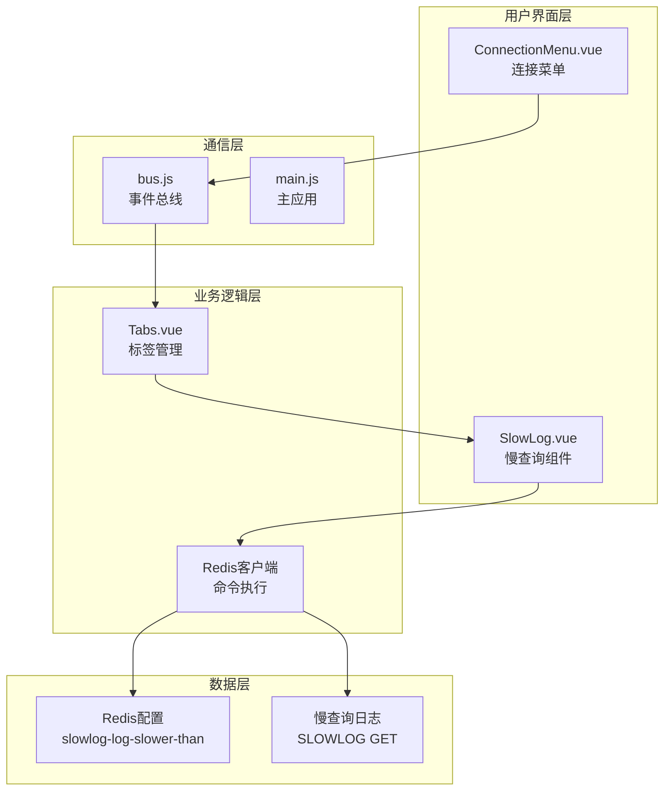
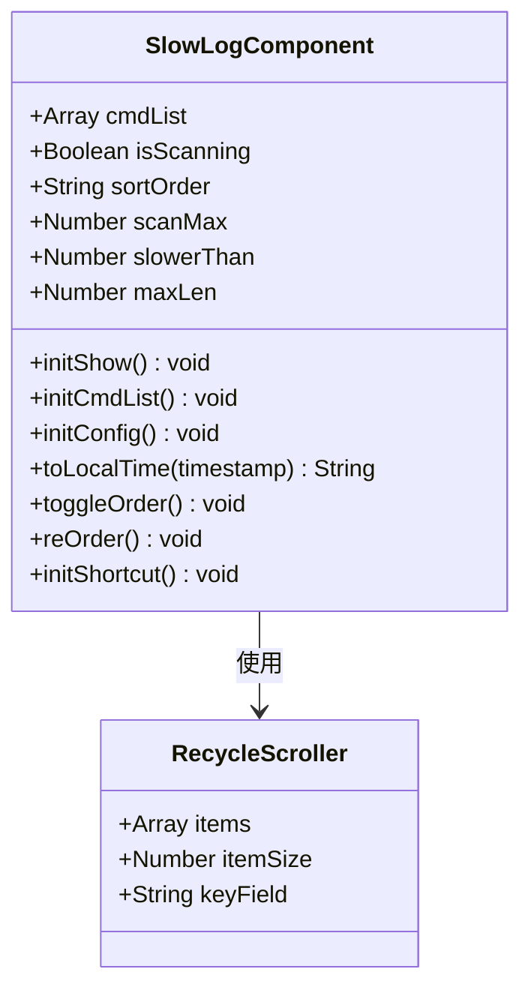
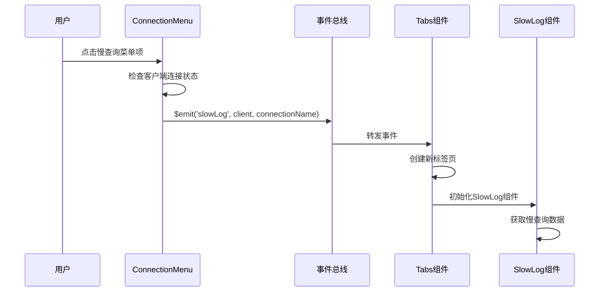
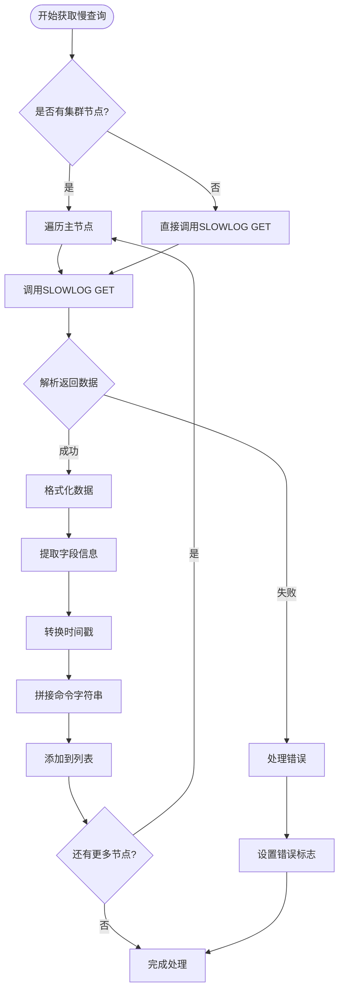
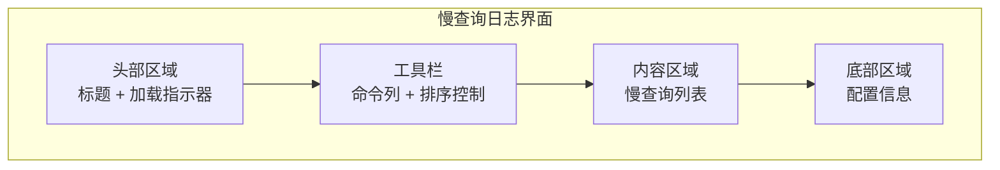
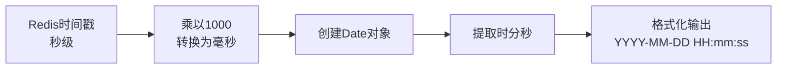
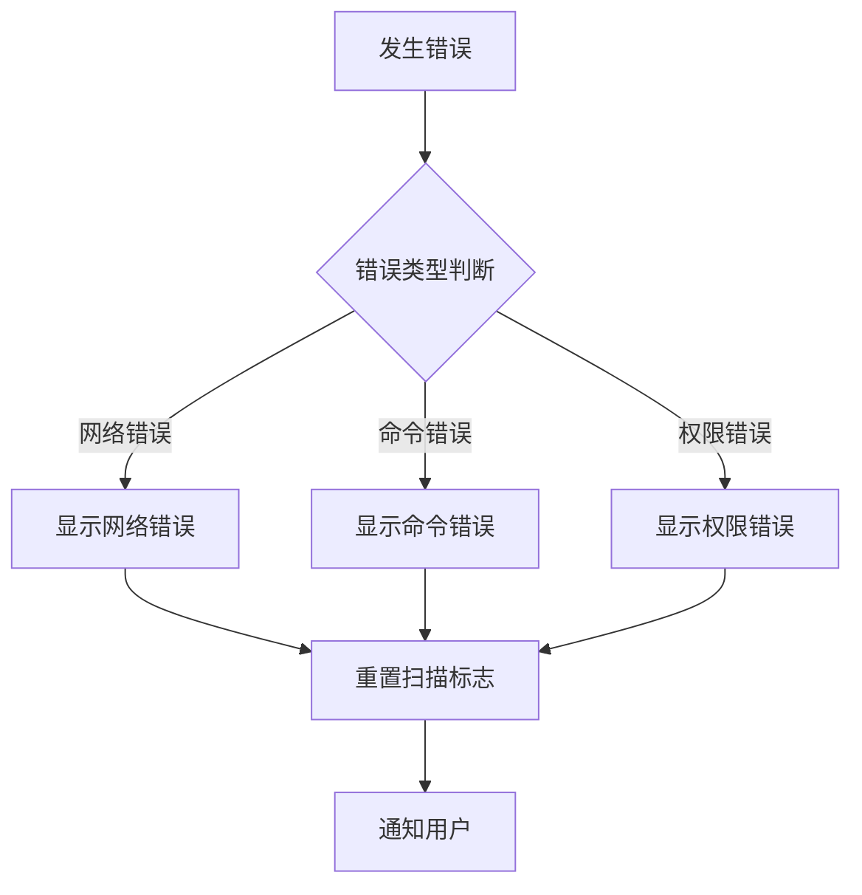
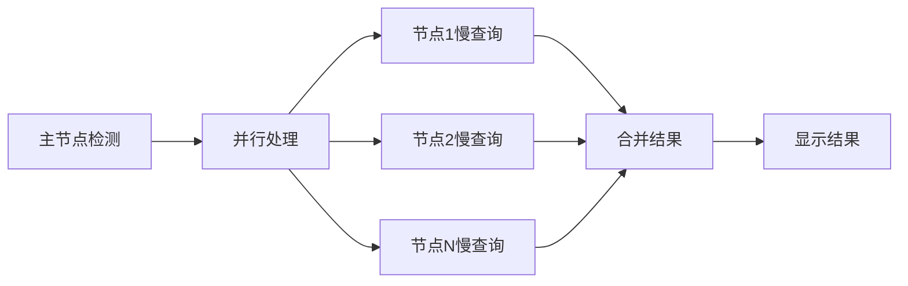

# 慢查询日志功能详细文档

<cite>
**本文档引用的文件**
- [SlowLog.vue](file://src/components/SlowLog.vue)
- [ConnectionMenu.vue](file://src/components/ConnectionMenu.vue)
- [bus.js](file://src/bus.js)
- [main.js](file://src/main.js)
- [Tabs.vue](file://src/components/Tabs.vue)
- [cn.js](file://src/i18n/langs/cn.js)
- [Commands.js](file://src/commands.js)
</cite>

## 目录
1. [简介](#简介)
2. [系统架构概览](#系统架构概览)
3. [核心组件分析](#核心组件分析)
4. [事件总线通信机制](#事件总线通信机制)
5. [Redis慢查询命令交互](#redis慢查询命令交互)
6. [用户界面设计](#用户界面设计)
7. [数据处理与格式化](#数据处理与格式化)
8. [错误处理机制](#错误处理机制)
9. [性能优化特性](#性能优化特性)
10. [扩展功能建议](#扩展功能建议)
11. [故障排除指南](#故障排除指南)

## 简介

慢查询日志功能是Another Redis Desktop Manager中的一个重要监控工具，专门用于捕获和展示Redis服务器中执行时间超过阈值的慢查询命令。该功能通过事件总线机制接收慢查询请求，调用Redis的SLOWLOG GET命令获取慢查询记录，并以直观的方式展示给用户。

慢查询日志对于Redis性能优化至关重要，它帮助开发者识别执行时间过长的命令，从而进行针对性的优化。该功能支持实时监控、排序筛选、时间戳转换和命令参数截断等实用特性。

## 系统架构概览

慢查询日志功能采用模块化架构设计，主要包含以下核心组件：



**图表来源**
- [ConnectionMenu.vue](file://src/components/ConnectionMenu.vue#L289-L295)
- [bus.js](file://src/bus.js#L1-L19)
- [Tabs.vue](file://src/components/Tabs.vue#L83-L86)

## 核心组件分析

### SlowLog.vue 组件

SlowLog.vue是慢查询日志功能的核心组件，负责展示慢查询记录的用户界面和交互逻辑。

#### 组件结构



**图表来源**
- [SlowLog.vue](file://src/components/SlowLog.vue#L65-L165)

#### 数据模型

组件维护以下关键状态：

| 属性名 | 类型 | 默认值 | 描述 |
|--------|------|--------|------|
| cmdList | Array | [] | 慢查询命令列表 |
| isScanning | Boolean | false | 是否正在扫描状态 |
| sortOrder | String | '' | 排序顺序（asc/desc） |
| scanMax | Number | 20000 | 最大扫描数量 |
| slowerThan | Number | 0 | 慢查询时间阈值（微秒） |
| maxLen | Number | 0 | 最大慢查询记录数 |

**章节来源**
- [SlowLog.vue](file://src/components/SlowLog.vue#L65-L73)

### ConnectionMenu.vue 集成点

ConnectionMenu.vue作为慢查询功能的入口点，提供了触发慢查询查看的用户界面。

#### 触发机制



**图表来源**
- [ConnectionMenu.vue](file://src/components/ConnectionMenu.vue#L289-L295)
- [Tabs.vue](file://src/components/Tabs.vue#L83-L86)

**章节来源**
- [ConnectionMenu.vue](file://src/components/ConnectionMenu.vue#L289-L295)

## 事件总线通信机制

### 事件总线架构

系统采用Vue实例作为事件总线，实现了组件间的解耦通信。

```mermaid
graph LR
subgraph "事件发射"
CM[ConnectionMenu<br/>$emit('slowLog')]
end
subgraph "事件总线"
BUS[bus.js<br/>Vue事件实例]
end
subgraph "事件监听"
TABS[Tabs.vue<br/>$on('slowLog')]
SL[SlowLog.vue<br/>初始化]
end
CM --> BUS
BUS --> TABS
TABS --> SL
```

**图表来源**
- [bus.js](file://src/bus.js#L1-L19)
- [ConnectionMenu.vue](file://src/components/ConnectionMenu.vue#L289-L295)

### 事件生命周期

事件从触发到处理的完整流程：

1. **事件触发阶段**：用户在连接菜单点击慢查询选项
2. **事件传播阶段**：通过事件总线传播到标签管理系统
3. **组件创建阶段**：动态创建慢查询日志组件实例
4. **数据初始化阶段**：组件自动发起慢查询数据获取

**章节来源**
- [bus.js](file://src/bus.js#L1-L19)
- [Tabs.vue](file://src/components/Tabs.vue#L83-L86)

## Redis慢查询命令交互

### SLOWLOG GET命令详解

慢查询功能基于Redis的SLOWLOG命令系列，主要包括：

| 命令 | 参数 | 功能 | 返回格式 |
|------|------|------|----------|
| SLOWLOG GET | [count] | 获取慢查询记录 | 数组格式 |
| SLOWLOG LEN | 无 | 获取慢查询记录总数 | 数字 |
| SLOWLOG RESET | 无 | 清空慢查询日志 | OK |

### 数据获取流程



**图表来源**
- [SlowLog.vue](file://src/components/SlowLog.vue#L84-L109)

### 配置参数获取

慢查询功能同时获取Redis的两个重要配置参数：

| 配置项 | 命令 | 单位 | 描述 |
|--------|------|------|------|
| slowlog-log-slower-than | CONFIG GET slowlog-log-slower-than | 微秒 | 慢查询时间阈值 |
| slowlog-max-len | CONFIG GET slowlog-max-len | 条数 | 最大慢查询记录数 |

**章节来源**
- [SlowLog.vue](file://src/components/SlowLog.vue#L111-L118)

## 用户界面设计

### 界面布局结构

慢查询日志界面采用卡片式布局，包含以下主要区域：



**图表来源**
- [SlowLog.vue](file://src/components/SlowLog.vue#L2-L56)

### 表格列设计

| 列名 | 宽度 | 内容 | 功能 |
|------|------|------|------|
| 序号 | 自动 | 索引编号 | 标识记录位置 |
| 时间 | 88px | 时间戳 | 显示命令执行时间 |
| 命令 | Flex 1 | 命令字符串 | 显示完整命令 |
| 耗时 | 自动 | 执行时间 | 以标签形式显示毫秒数 |

### 响应式设计特性

界面采用弹性布局，确保在不同屏幕尺寸下的良好显示效果：

- **最小高度**：100px
- **列表项高度**：24px（固定）
- **容器高度**：calc(100vh - 268px)
- **命令列宽度**：Flex 1（自动扩展）

**章节来源**
- [SlowLog.vue](file://src/components/SlowLog.vue#L185-L234)

## 数据处理与格式化

### 时间戳转换

系统将Redis返回的时间戳（秒级）转换为本地时间格式：



**图表来源**
- [SlowLog.vue](file://src/components/SlowLog.vue#L119-L129)

### 命令参数处理

Redis慢查询返回的命令参数数组被转换为可读的字符串：

- **原始格式**：`['GET', 'mykey']`
- **转换后**：`GET mykey`
- **截断策略**：超出长度限制的参数会被省略

### 数据排序功能

系统提供两种排序方式：
- **升序**：按执行时间从小到大排列
- **降序**：按执行时间从大到小排列

**章节来源**
- [SlowLog.vue](file://src/components/SlowLog.vue#L131-L145)

## 错误处理机制

### 异常情况处理

系统针对以下异常情况提供相应的错误处理：

| 异常类型 | 处理方式 | 用户提示 |
|----------|----------|----------|
| 连接失败 | 显示错误消息 | 显示具体错误信息 |
| SLOWLOG命令失败 | 设置扫描状态为false | 显示错误消息 |
| 配置获取失败 | 忽略错误继续运行 | 使用默认值 |
| 空结果集 | 显示"无慢查询记录" | 提示用户无数据 |

### 错误恢复机制



**图表来源**
- [SlowLog.vue](file://src/components/SlowLog.vue#L105-L108)

**章节来源**
- [SlowLog.vue](file://src/components/SlowLog.vue#L105-L108)

## 性能优化特性

### 虚拟滚动技术

慢查询日志使用`vue-virtual-scroller`库实现虚拟滚动，提高大量数据的渲染性能：

- **单个列表项高度**：24px
- **预估显示数量**：20000条
- **内存优化**：只渲染可见区域的数据

### 数据缓存策略

- **配置信息缓存**：慢查询阈值和最大长度配置
- **时间戳缓存**：避免重复的时间格式化计算
- **排序状态保持**：维持用户的排序偏好

### 并发处理优化

对于Redis集群环境，系统采用并行处理多个节点的慢查询数据：



**图表来源**
- [SlowLog.vue](file://src/components/SlowLog.vue#L85-L109)

**章节来源**
- [SlowLog.vue](file://src/components/SlowLog.vue#L28-L35)

## 扩展功能建议

### 慢查询阈值配置

建议增加动态调整慢查询阈值的功能：

1. **配置界面**：提供图形化界面调整阈值
2. **实时生效**：支持动态修改而不需重启Redis
3. **历史记录**：保存阈值变更历史

### 自动告警功能

实现智能告警机制：

1. **阈值告警**：当慢查询数量超过设定阈值时提醒
2. **趋势分析**：分析慢查询数量的变化趋势
3. **邮件通知**：支持发送告警邮件

### 查询优化建议

基于慢查询数据提供优化建议：

1. **命令分析**：识别常见低效命令模式
2. **索引建议**：推荐合适的索引策略
3. **批量操作**：建议使用管道或批量命令

### 数据导出功能

增加慢查询数据的导出功能：

1. **CSV格式**：便于数据分析工具处理
2. **JSON格式**：保持数据结构完整性
3. **定时导出**：支持定期自动导出

## 故障排除指南

### 常见问题诊断

| 问题症状 | 可能原因 | 解决方案 |
|----------|----------|----------|
| 无慢查询记录 | Redis未启用慢查询功能 | 检查slowlog-log-slower-than配置 |
| 显示加载错误 | 网络连接不稳定 | 检查Redis连接状态 |
| 数据不准确 | 时间同步问题 | 确保客户端和服务器时间同步 |
| 性能问题 | 慢查询数据量过大 | 调整scanMax参数 |

### 调试技巧

1. **检查Redis配置**：确认slowlog-log-slower-than设置
2. **验证连接状态**：确保Redis客户端正常连接
3. **查看浏览器控制台**：检查JavaScript错误信息
4. **网络抓包分析**：分析Redis命令传输过程

### 性能监控指标

建议监控以下关键指标：

- **慢查询数量**：评估系统负载情况
- **平均执行时间**：识别性能瓶颈
- **命令分布**：分析高频慢查询命令
- **资源使用率**：监控CPU和内存消耗

**章节来源**
- [SlowLog.vue](file://src/components/SlowLog.vue#L111-L118)

## 结论

慢查询日志功能是Another Redis Desktop Manager中的重要监控工具，通过事件总线机制实现了高效的组件间通信，通过Redis SLOWLOG命令获取慢查询数据，并以直观的方式展示给用户。该功能具有良好的用户体验、强大的性能优化特性和完善的错误处理机制，为Redis性能优化提供了有力支持。

随着功能的不断完善和扩展，慢查询日志功能将在Redis运维和性能优化中发挥越来越重要的作用。开发者可以根据实际需求，进一步扩展功能特性，提升系统的实用价值。