# 批量操作功能详细文档

<cite>
**本文档中引用的文件**
- [DeleteBatch.vue](file://src/components/DeleteBatch.vue)
- [KeyList.vue](file://src/components/KeyList.vue)
- [KeyListVirtualTree.vue](file://src/components/KeyListVirtualTree.vue)
- [redisClient.js](file://src/redisClient.js)
- [Tabs.vue](file://src/components/Tabs.vue)
</cite>

## 目录
1. [简介](#简介)
2. [系统架构概览](#系统架构概览)
3. [核心组件分析](#核心组件分析)
4. [批量删除功能详解](#批量删除功能详解)
5. [与KeyList组件的集成机制](#与keylist组件的集成机制)
6. [用户界面交互设计](#用户界面交互设计)
7. [性能优化措施](#性能优化措施)
8. [错误处理策略](#错误处理策略)
9. [安全注意事项](#安全注意事项)
10. [扩展开发指南](#扩展开发指南)
11. [总结](#总结)

## 简介

AnotherRedisDesktopManager的批量操作功能是一个强大的工具，允许用户一次性删除多个Redis键。该功能通过DeleteBatch.vue组件实现，提供了直观的用户界面和高效的后端处理能力。系统支持多种操作模式，包括精确匹配、通配符匹配和手动选择，并针对不同类型的Redis部署（单机、集群、哨兵）进行了优化。

## 系统架构概览

批量操作功能采用模块化架构设计，主要由以下核心组件构成：

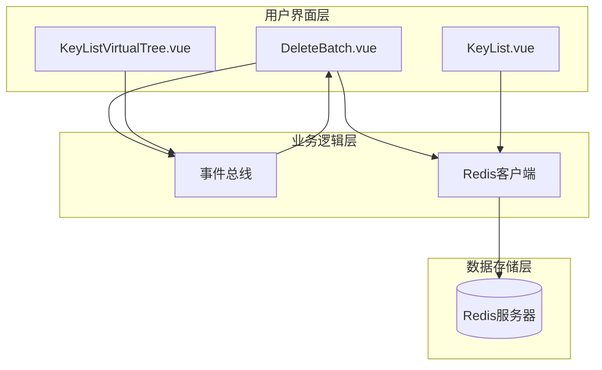

**图表来源**
- [DeleteBatch.vue](file://src/components/DeleteBatch.vue#L1-L257)
- [KeyListVirtualTree.vue](file://src/components/KeyListVirtualTree.vue#L1-L623)
- [Tabs.vue](file://src/components/Tabs.vue#L34-L90)

## 核心组件分析

### DeleteBatch.vue组件

DeleteBatch.vue是批量删除功能的核心组件，负责处理键的选择、扫描、显示和删除操作。

#### 组件结构

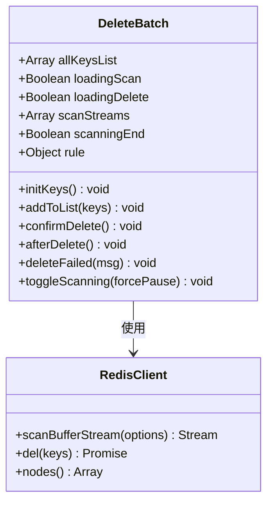

**图表来源**
- [DeleteBatch.vue](file://src/components/DeleteBatch.vue#L45-L223)

#### 关键属性和方法

| 属性/方法 | 类型 | 描述 |
|-----------|------|------|
| `allKeysList` | Array | 存储扫描到的所有键对象 |
| `loadingScan` | Boolean | 扫描状态指示器 |
| `loadingDelete` | Boolean | 删除状态指示器 |
| `rule` | Object | 包含键列表和模式规则的对象 |
| `initKeys()` | Function | 初始化键扫描过程 |
| `confirmDelete()` | Function | 执行批量删除操作 |
| `toggleScanning()` | Function | 控制扫描流的暂停/恢复 |

**章节来源**
- [DeleteBatch.vue](file://src/components/DeleteBatch.vue#L45-L223)

### KeyListVirtualTree.vue组件

KeyListVirtualTree.vue提供了树形结构的键管理界面，支持多选操作和批量处理。

#### 多选机制

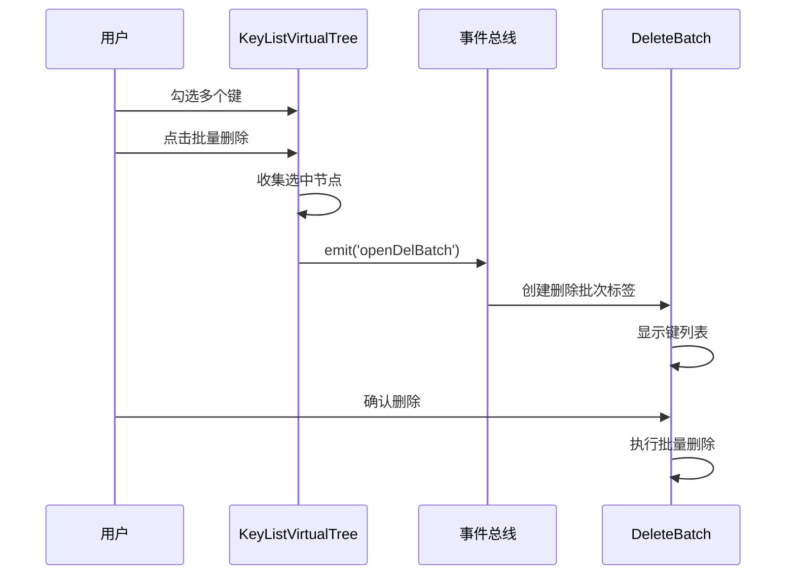

**图表来源**
- [KeyListVirtualTree.vue](file://src/components/KeyListVirtualTree.vue#L283-L296)
- [Tabs.vue](file://src/components/Tabs.vue#L73-L76)

**章节来源**
- [KeyListVirtualTree.vue](file://src/components/KeyListVirtualTree.vue#L283-L315)

## 批量删除功能详解

### 键扫描机制

DeleteBatch组件实现了智能的键扫描机制，能够高效地处理大量键数据：

#### 扫描流程

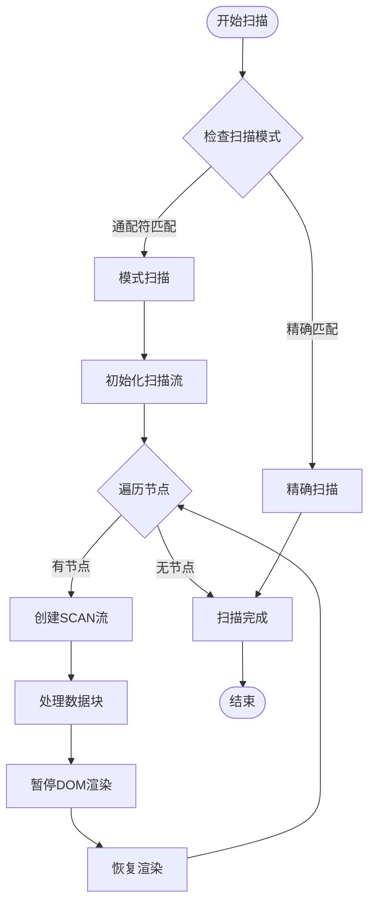

**图表来源**
- [DeleteBatch.vue](file://src/components/DeleteBatch.vue#L58-L108)

#### 分批处理策略

系统根据Redis部署类型采用不同的删除策略：

| 部署类型 | 删除策略 | 批次大小 | 性能特点 |
|----------|----------|----------|----------|
| 单机Redis | 批量删除 | 5000个键/批次 | 高效，减少网络往返 |
| Redis集群 | 单键删除 | 1个键/批次 | 避免跨节点操作 |
| 哨兵模式 | 批量删除 | 取决于主节点 | 标准批量处理 |

**章节来源**
- [DeleteBatch.vue](file://src/components/DeleteBatch.vue#L138-L183)

### 删除确认流程

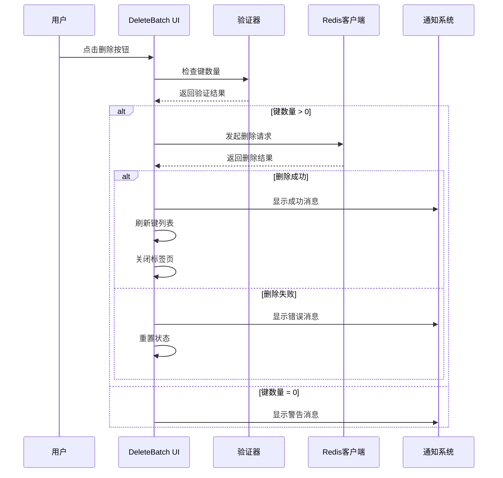

**图表来源**
- [DeleteBatch.vue](file://src/components/DeleteBatch.vue#L127-L183)

**章节来源**
- [DeleteBatch.vue](file://src/components/DeleteBatch.vue#L127-L205)

## 与KeyList组件的集成机制

### 事件总线通信

系统通过Vue的事件总线实现组件间的通信：

```mermaid
graph LR
subgraph "KeyList组件"
KL[KeyList.vue]
KVT[KeyListVirtualTree.vue]
end
subgraph "事件总线"
Bus[Vue Bus]
end
subgraph "DeleteBatch组件"
DB[DeleteBatch.vue]
end
KVT --> |emit('openDelBatch')| Bus
Bus --> |on('openDelBatch')| DB
KL --> |emit('refreshKeyList')| Bus
Bus --> |on('refreshKeyList')| KL
```

**图表来源**
- [KeyListVirtualTree.vue](file://src/components/KeyListVirtualTree.vue#L295)
- [Tabs.vue](file://src/components/Tabs.vue#L73-L76)

### 键选择机制

#### 手动选择模式

用户可以通过复选框手动选择要删除的键：

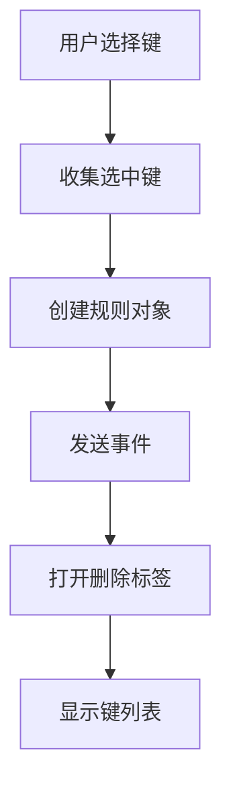

**图表来源**
- [KeyListVirtualTree.vue](file://src/components/KeyListVirtualTree.vue#L283-L296)

#### 模式匹配选择

系统支持基于模式的自动键选择：

| 模式类型 | 示例 | 匹配范围 |
|----------|------|----------|
| 通配符模式 | `user:*` | 所有以"user:"开头的键 |
| 正则表达式 | `*session*` | 包含"session"的键 |
| 精确匹配 | `config:app` | 特定名称的键 |

**章节来源**
- [KeyListVirtualTree.vue](file://src/components/KeyListVirtualTree.vue#L251-L254)

## 用户界面交互设计

### 键列表显示

DeleteBatch组件使用虚拟滚动技术处理大量键数据：

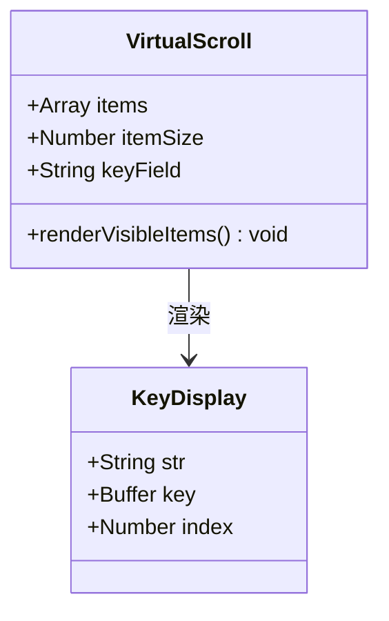

**图表来源**
- [DeleteBatch.vue](file://src/components/DeleteBatch.vue#L26-L37)

### 状态指示器

系统提供了丰富的状态反馈：

| 状态 | 图标 | 文本 | 含义 |
|------|------|------|------|
| 扫描中 | 🔄 | Scanning... | 正在扫描键 |
| 删除中 | 🔄 | Deleting... | 正在删除键 |
| 完成 | ✅ | Total: N | 显示键总数 |

**章节来源**
- [DeleteBatch.vue](file://src/components/DeleteBatch.vue#L5-L12)

### 操作控制

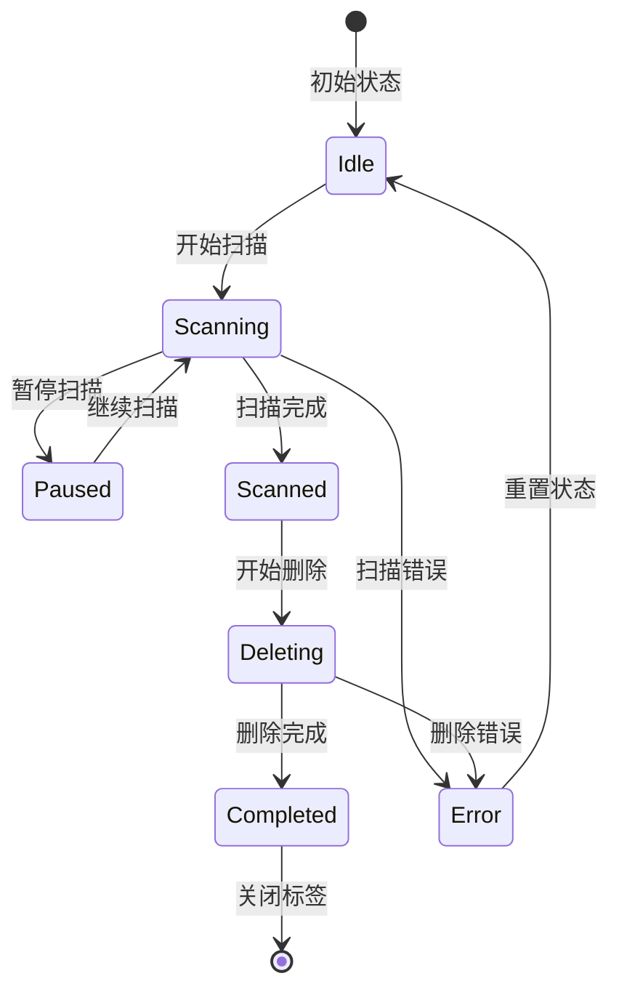

**图表来源**
- [DeleteBatch.vue](file://src/components/DeleteBatch.vue#L118-L126)

## 性能优化措施

### 虚拟滚动技术

DeleteBatch组件使用vue-virtual-scroller库实现虚拟滚动：

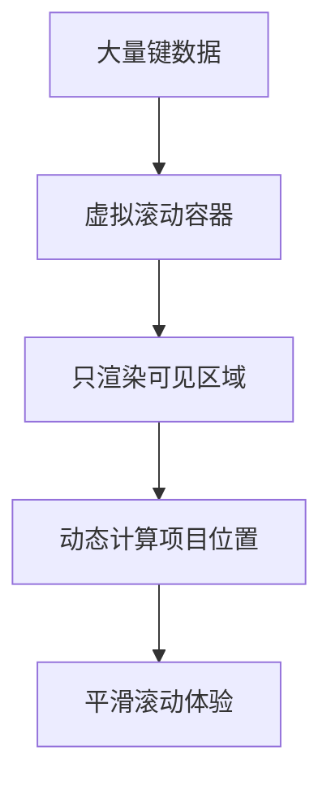

**图表来源**
- [DeleteBatch.vue](file://src/components/DeleteBatch.vue#L26-L37)

### DOM渲染优化

系统采用防抖和节流技术优化DOM更新：

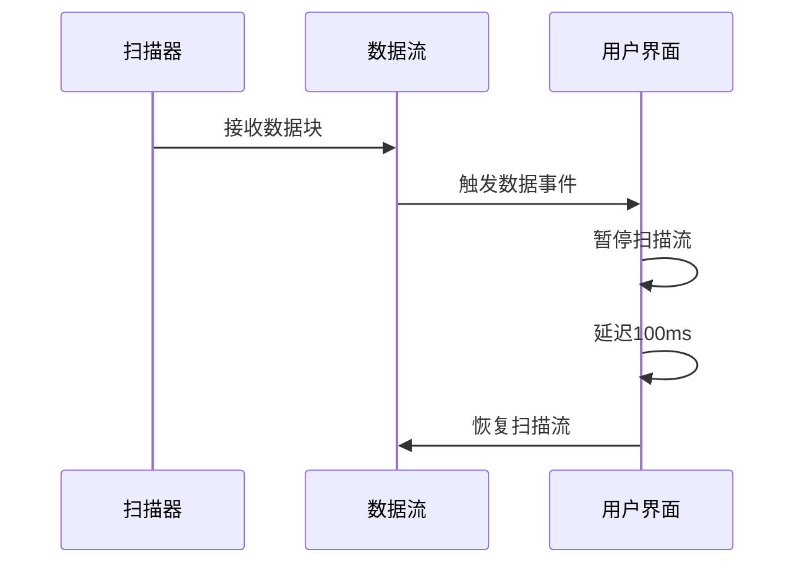

**图表来源**
- [DeleteBatch.vue](file://src/components/DeleteBatch.vue#L86-L90)

### 内存管理

系统实现了完善的内存清理机制：

| 清理时机 | 清理内容 | 目的 |
|----------|----------|------|
| 组件销毁 | 取消扫描流 | 防止内存泄漏 |
| 删除完成 | 清空键列表 | 释放内存 |
| 错误发生 | 重置状态 | 恢复正常状态 |

**章节来源**
- [DeleteBatch.vue](file://src/components/DeleteBatch.vue#L218-L222)

## 错误处理策略

### 异常分类处理

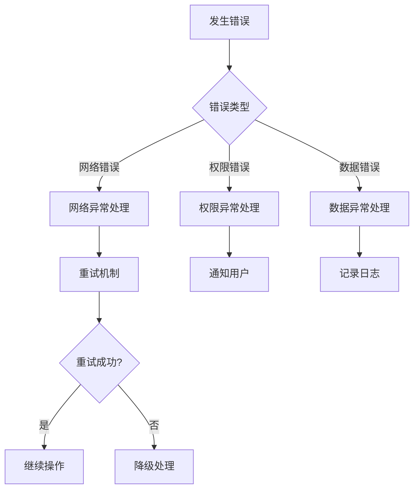

**图表来源**
- [DeleteBatch.vue](file://src/components/DeleteBatch.vue#L93-L107)

### 错误恢复机制

| 错误类型 | 恢复策略 | 用户反馈 |
|----------|----------|----------|
| 扫描中断 | 自动重试 | 显示重试提示 |
| 删除失败 | 单键重试 | 标记失败键 |
| 连接超时 | 断线重连 | 提示重新连接 |
| 权限不足 | 降级处理 | 显示权限错误 |

**章节来源**
- [DeleteBatch.vue](file://src/components/DeleteBatch.vue#L93-L107)

## 安全注意事项

### 不可逆性警告

系统在删除前提供明确的安全警告：

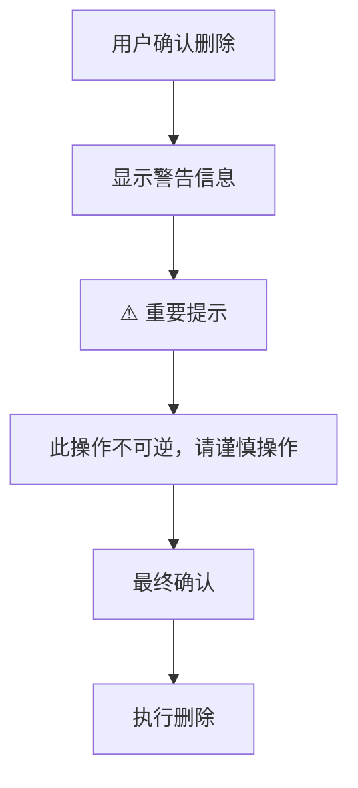

**图表来源**
- [DeleteBatch.vue](file://src/components/DeleteBatch.vue#L6)

### 权限控制

系统实现了多层次的权限控制：

| 控制层级 | 检查内容 | 处理方式 |
|----------|----------|----------|
| 用户界面 | 按钮禁用状态 | 根据加载状态调整 |
| 业务逻辑 | 键数量验证 | 防止空操作 |
| 后端验证 | Redis命令权限 | 确保操作合法性 |

**章节来源**
- [DeleteBatch.vue](file://src/components/DeleteBatch.vue#L14-L15)

## 扩展开发指南

### 支持其他批量命令

系统架构支持轻松扩展其他批量操作命令：

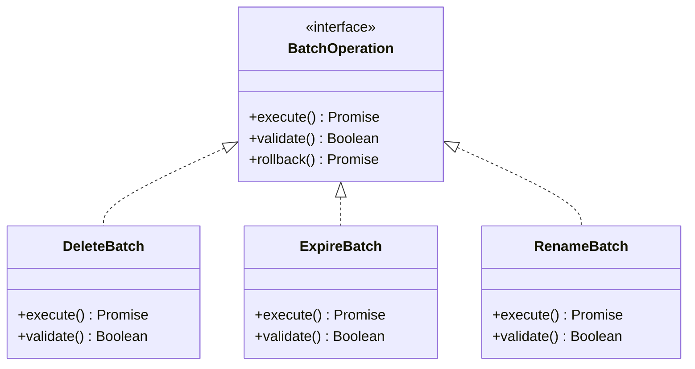

### 实现新命令的步骤

1. **创建新的组件**：继承基础的批量操作组件
2. **实现命令逻辑**：在`confirmDelete`方法中添加具体命令
3. **更新UI界面**：添加相应的操作按钮和状态指示
4. **测试验证**：确保新功能与现有系统兼容

### 批量命令扩展表

| 命令类型 | 实现难度 | 性能影响 | 使用场景 |
|----------|----------|----------|----------|
| EXPIRE | 中等 | 低 | 设置键过期时间 |
| RENAME | 简单 | 中等 | 重命名键 |
| MOVE | 简单 | 低 | 移动键到其他数据库 |
| TYPE | 简单 | 极低 | 获取键类型信息 |

**章节来源**
- [DeleteBatch.vue](file://src/components/DeleteBatch.vue#L138-L183)

## 总结

AnotherRedisDesktopManager的批量操作功能展现了优秀的软件架构设计和用户体验理念。通过DeleteBatch.vue组件，系统实现了高效、安全、易用的批量键删除功能。该功能不仅满足了日常运维需求，还为未来的功能扩展奠定了坚实的基础。

### 主要优势

1. **高性能**：采用虚拟滚动和分批处理技术，能够处理大规模数据
2. **高可用**：完善的错误处理和恢复机制，确保操作稳定性
3. **易扩展**：模块化架构支持快速添加新的批量操作命令
4. **用户友好**：直观的界面设计和丰富的状态反馈

### 技术亮点

- 智能的键扫描和过滤机制
- 针对不同Redis部署类型的优化策略
- 实时的状态监控和进度反馈
- 完善的内存管理和资源清理

这个批量操作功能为Redis管理提供了一个强大而可靠的工具，显著提升了用户的工作效率和操作体验。