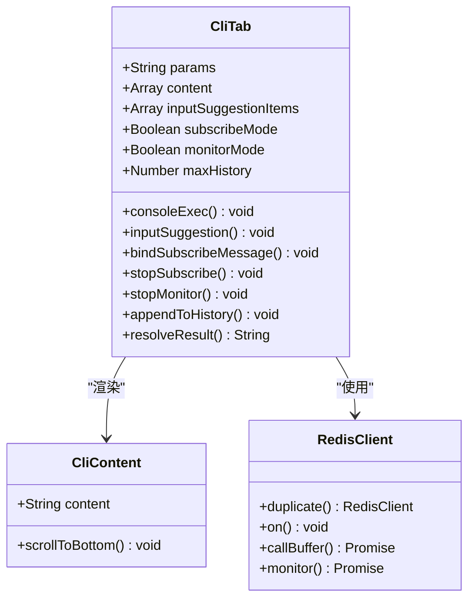
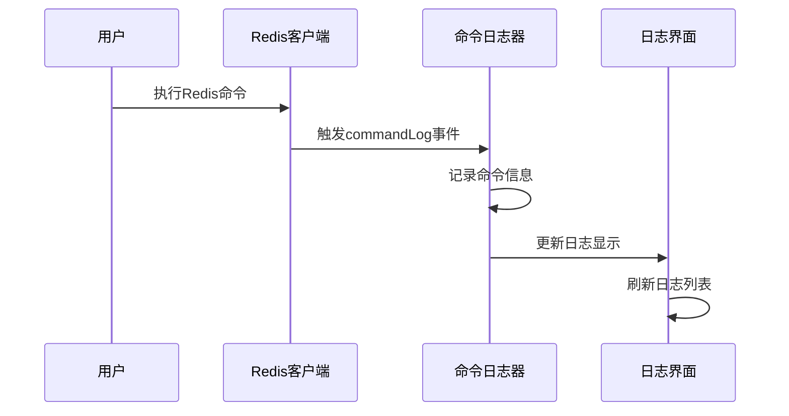
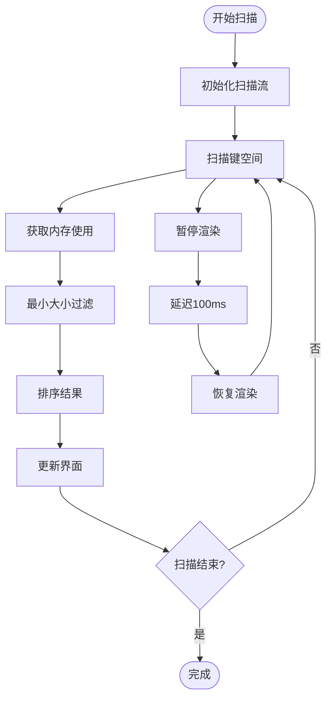
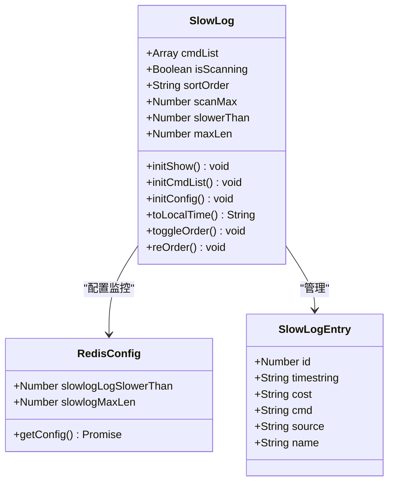
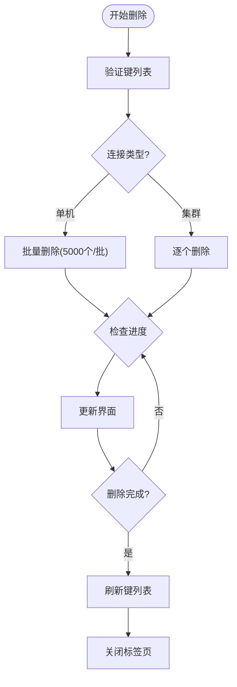

# 高级功能

<cite>
**本文档引用的文件**
- [CliTab.vue](file://src/components/CliTab.vue)
- [CommandLog.vue](file://src/components/CommandLog.vue)
- [CommandLogPanel.vue](file://src/components/CommandLogPanel.vue)
- [MemoryAnalysis.vue](file://src/components/MemoryAnalysis.vue)
- [SlowLog.vue](file://src/components/SlowLog.vue)
- [DeleteBatch.vue](file://src/components/DeleteBatch.vue)
- [commands.js](file://src/commands.js)
- [util.js](file://src/util.js)
- [redisClient.js](file://src/redisClient.js)
- [cn.js](file://src/i18n/langs/cn.js)
</cite>

## 目录
1. [简介](#简介)
2. [CLI终端功能](#cli终端功能)
3. [命令日志系统](#命令日志系统)
4. [内存分析工具](#内存分析工具)
5. [慢日志查看器](#慢日志查看器)
6. [批量删除功能](#批量删除功能)
7. [使用场景与最佳实践](#使用场景与最佳实践)
8. [故障排除指南](#故障排除指南)
9. [总结](#总结)

## 简介

Another Redis Desktop Manager 提供了一套强大的高级功能，专为Redis管理员和开发者设计。这些功能包括交互式CLI终端、命令审计日志、内存分析工具、慢查询监控和批量操作等，帮助用户进行性能优化、问题排查和日常维护工作。

## CLI终端功能

### 功能概述

CliTab.vue 组件提供了完整的交互式Redis命令行界面，支持实时命令执行、自动补全、历史记录和多种高级特性。



**图表来源**
- [CliTab.vue](file://src/components/CliTab.vue#L32-L467)

### 核心特性

#### 命令自动补全
- 基于Redis命令集的智能提示
- 支持子命令和参数提示
- 实时命令验证和语法检查

#### 历史记录管理
- 最大支持2000条命令历史
- 上下箭头浏览历史记录
- 自动保存和恢复历史记录

#### 多模式支持
- **普通模式**: 执行标准Redis命令
- **订阅模式**: 支持发布/订阅消息监听
- **监控模式**: 实时监控所有Redis命令执行

#### 高级命令支持
- **MULTI/EXEC事务**: 支持Redis事务操作
- **SUBSCRIBE/PSUBSCRIBE**: 发布订阅功能
- **MONITOR**: 命令监控和调试

### 使用示例

#### 基本命令执行
```bash
# 获取键值
GET mykey

# 设置键值对
SET mykey "Hello World"

# 批量操作
MGET key1 key2 key3
```

#### 事务处理
```bash
# 开始事务
MULTI

# 添加命令到队列
SET key1 "value1"
SET key2 "value2"

# 执行事务
EXEC
```

#### 订阅模式
```bash
# 订阅频道
SUBSCRIBE mychannel

# 模式订阅
PSUBSCRIBE my*
```

**章节来源**
- [CliTab.vue](file://src/components/CliTab.vue#L190-L300)

## 命令日志系统

### 系统架构

命令日志系统通过事件总线机制实现，提供实时的命令执行记录和审计功能。



**图表来源**
- [redisClient.js](file://src/redisClient.js#L11-L38)
- [CommandLog.vue](file://src/components/CommandLog.vue#L49-L66)

### CommandLog组件

提供独立的日志查看对话框，适合临时审计需求。

#### 主要功能
- **实时记录**: 自动记录所有Redis命令执行
- **过滤功能**: 支持按命令类型、关键字过滤
- **性能指标**: 显示命令执行时间和成本
- **连接区分**: 支持多连接命令分离显示

#### 配置选项
- **最大记录数**: 默认5000条，超出自动截断
- **只显示写命令**: 过滤只读命令，专注变更操作
- **关键字搜索**: 支持命令和参数的模糊匹配

### CommandLogPanel组件

提供嵌入式的日志面板，集成在主界面中。

#### 增强功能
- **多连接支持**: 支持同时监控多个Redis连接
- **连接筛选**: 可按连接名称筛选日志
- **持久化存储**: 日志数据持久化保存
- **实时同步**: 与其他组件实时同步连接状态

### 审计价值

#### 合规性要求
- **操作追踪**: 完整记录所有数据库操作
- **时间戳精确**: 精确到毫秒的时间记录
- **参数脱敏**: 敏感参数自动脱敏处理

#### 性能分析
- **执行时间统计**: 分析命令执行性能
- **频率分析**: 统计高频操作
- **资源消耗**: 监控命令对系统的影响

**章节来源**
- [CommandLog.vue](file://src/components/CommandLog.vue#L34-L121)
- [CommandLogPanel.vue](file://src/components/CommandLogPanel.vue#L58-L195)

## 内存分析工具

### 功能概览

MemoryAnalysis组件提供全面的Redis内存使用分析，帮助用户识别内存热点和优化存储结构。



**图表来源**
- [MemoryAnalysis.vue](file://src/components/MemoryAnalysis.vue#L103-L220)

### 核心特性

#### 智能扫描算法
- **并发扫描**: 支持多节点并行扫描
- **流式处理**: 大数据量下的内存友好处理
- **增量加载**: 支持暂停和恢复扫描过程

#### 内存计算精度
- **精确测量**: 使用MEMORY USAGE命令获取准确内存占用
- **单位转换**: 自动转换为人类可读的文件大小格式
- **集群支持**: 正确处理Redis集群环境

#### 排序和过滤
- **多维度排序**: 按内存大小、键名等维度排序
- **大小过滤**: 设置最小内存阈值过滤小键
- **模式匹配**: 支持键名模式匹配

### 使用场景

#### 内存优化
- **识别大键**: 快速定位占用大量内存的键
- **内存分布**: 分析不同类型键的内存分布
- **清理策略**: 基于内存使用制定清理计划

#### 性能调优
- **热点识别**: 发现访问频繁的大键
- **存储优化**: 识别可以压缩或重构的数据
- **容量规划**: 预估存储需求和扩展计划

### 配置参数

| 参数 | 默认值 | 说明 |
|------|--------|------|
| scanMax | 200000 | 最大扫描键数限制 |
| scanPageSize | 2000 | 单次扫描页面大小 |
| minSizeKB | 0 | 最小内存阈值(KB) |

**章节来源**
- [MemoryAnalysis.vue](file://src/components/MemoryAnalysis.vue#L1-L331)

## 慢日志查看器

### 系统设计

SlowLog组件提供Redis慢查询日志的实时监控和分析功能。



**图表来源**
- [SlowLog.vue](file://src/components/SlowLog.vue#L62-L235)

### 核心功能

#### 实时监控
- **自动刷新**: 支持F5快捷键刷新慢日志
- **配置同步**: 实时获取Redis慢日志配置
- **时间格式化**: 本地时间格式显示

#### 数据分析
- **执行时间排序**: 支持升序和降序排列
- **命令统计**: 分析慢查询的命令类型分布
- **性能瓶颈**: 识别系统性能瓶颈点

#### 配置管理
- **阈值监控**: 显示slowlog-log-slower-than配置
- **长度限制**: 显示slowlog-max-len配置
- **动态调整**: 支持运行时配置修改

### 性能优化指导

#### 查询优化
- **识别热点**: 发现执行时间最长的查询
- **索引优化**: 基于慢查询优化索引策略
- **批量操作**: 减少单个命令的执行时间

#### 系统调优
- **资源配置**: 根据慢查询调整系统资源
- **连接管理**: 优化连接池配置
- **缓存策略**: 改善缓存命中率

### 配置参数解读

| 配置项 | 说明 | 单位 |
|--------|------|------|
| slowlog-log-slower-than | 慢查询阈值 | 微秒(μs) |
| slowlog-max-len | 慢日志最大长度 | 条数 |

**章节来源**
- [SlowLog.vue](file://src/components/SlowLog.vue#L1-L235)

## 批量删除功能

### 功能架构

DeleteBatch组件提供安全高效的批量键删除功能，支持模式匹配和精确删除。



**图表来源**
- [DeleteBatch.vue](file://src/components/DeleteBatch.vue#L127-L200)

### 核心特性

#### 智能扫描
- **模式匹配**: 支持通配符模式扫描
- **增量加载**: 大数据量下的渐进式加载
- **暂停恢复**: 支持扫描过程的暂停和恢复

#### 安全保护
- **预览功能**: 删除前预览将要删除的键
- **确认机制**: 删除前二次确认
- **进度监控**: 实时显示扫描和删除进度

#### 性能优化
- **批量处理**: 单机模式下的批量删除优化
- **流控制**: 避免阻塞Redis服务器
- **错误处理**: 完善的异常处理机制

### 使用场景

#### 清理维护
- **过期数据清理**: 基于时间戳的键清理
- **测试数据清理**: 批量删除测试环境数据
- **存储优化**: 清理无用或重复的键

#### 迁移准备
- **数据迁移**: 在数据迁移前清理目标键
- **环境准备**: 准备干净的测试环境
- **容量管理**: 控制数据库存储空间

### 操作流程

#### 1. 键扫描阶段
- 输入删除模式（如：`test:*`）
- 开始异步扫描匹配的键
- 支持暂停和恢复扫描

#### 2. 预览确认阶段
- 显示扫描结果和统计信息
- 提供删除前的最终确认
- 支持取消操作

#### 3. 批量删除阶段
- 根据连接类型采用不同删除策略
- 实时显示删除进度和统计
- 删除完成后自动刷新界面

### 注意事项

#### 性能考虑
- **大数据量**: 对于大量键的删除，建议分批进行
- **网络延迟**: 考虑网络状况对删除性能的影响
- **服务器负载**: 避免在高负载时段进行大批量删除

#### 安全措施
- **备份策略**: 删除前确保重要数据已备份
- **权限控制**: 确保有足够的删除权限
- **误操作防护**: 利用确认机制防止误删

**章节来源**
- [DeleteBatch.vue](file://src/components/DeleteBatch.vue#L1-L257)

## 使用场景与最佳实践

### CLI终端最佳实践

#### 开发调试
- **实时测试**: 使用CLI进行实时命令测试和验证
- **脚本编写**: 在CLI中编写和测试Redis脚本
- **性能测试**: 使用MONITOR模式监控命令执行

#### 运维管理
- **紧急修复**: 快速执行关键运维命令
- **批量操作**: 使用MULTI/EXEC进行批量事务
- **监控诊断**: 实时监控Redis状态和性能

### 命令日志审计

#### 合规要求
- **操作记录**: 完整记录所有数据库操作
- **责任追溯**: 通过日志追踪操作责任人
- **定期审查**: 定期审查日志发现异常行为

#### 性能分析
- **热点识别**: 通过日志分析高频操作
- **趋势分析**: 分析操作模式和趋势变化
- **容量规划**: 基于日志数据进行容量规划

### 内存分析优化

#### 存储优化
- **定期分析**: 定期运行内存分析找出大键
- **清理策略**: 基于分析结果制定清理计划
- **结构优化**: 优化数据结构减少内存占用

#### 性能调优
- **热点监控**: 监控内存使用热点
- **容量预警**: 设置内存使用阈值预警
- **扩容决策**: 基于内存分析做出扩容决策

### 慢日志分析

#### 查询优化
- **定期审查**: 定期审查慢日志发现问题
- **索引优化**: 基于慢查询优化索引
- **批量改进**: 批量优化相似的慢查询

#### 系统调优
- **资源配置**: 根据慢查询调整系统配置
- **连接优化**: 优化连接池和超时设置
- **缓存策略**: 改善缓存命中率

### 批量删除安全

#### 操作规范
- **权限分离**: 实行严格的权限分离制度
- **操作审批**: 对大批量删除实行审批制度
- **回滚准备**: 准备数据回滚方案

#### 技术保障
- **分批执行**: 大数据量分批执行避免阻塞
- **进度监控**: 实时监控删除进度和状态
- **错误处理**: 完善的错误处理和恢复机制

## 故障排除指南

### CLI终端常见问题

#### 命令执行失败
**问题**: 某些Redis命令执行失败
**解决方案**: 
- 检查Redis版本兼容性
- 验证命令语法正确性
- 确认客户端连接状态

#### 自动补全失效
**问题**: 命令自动补全功能不工作
**解决方案**:
- 检查网络连接状态
- 重启CLI终端
- 清除历史记录缓存

#### 历史记录丢失
**问题**: 输入历史记录无法保存
**解决方案**:
- 检查浏览器存储权限
- 验证localStorage可用性
- 重新初始化历史记录

### 命令日志问题

#### 日志记录缺失
**问题**: 某些命令没有被记录
**解决方案**:
- 检查PING命令过滤设置
- 验证日志组件是否正常启动
- 确认事件总线通信状态

#### 日志显示异常
**问题**: 日志界面显示不正常
**解决方案**:
- 刷新日志界面
- 检查网络连接状态
- 重启应用解决缓存问题

### 内存分析问题

#### 扫描速度慢
**问题**: 内存分析扫描速度过慢
**解决方案**:
- 调整扫描页面大小
- 增加扫描并发数
- 优化Redis服务器性能

#### 内存计算错误
**问题**: 内存使用量计算不准确
**解决方案**:
- 检查MEMORY命令可用性
- 验证Redis配置权限
- 使用备用计算方法

### 慢日志问题

#### 日志为空
**问题**: 慢日志界面显示无数据
**解决方案**:
- 检查Redis慢日志配置
- 验证慢查询阈值设置
- 确认Redis服务器状态

#### 性能影响
**问题**: 慢日志监控影响服务器性能
**解决方案**:
- 调整监控频率
- 优化查询条件
- 使用采样模式

### 批量删除问题

#### 删除失败
**问题**: 批量删除操作失败
**解决方案**:
- 检查连接权限设置
- 验证键是否存在
- 分批重试删除操作

#### 数据泄露
**问题**: 删除操作意外删除了不应删除的数据
**解决方案**:
- 仔细核对删除模式
- 使用预览功能确认
- 实行双重确认机制

## 总结

Another Redis Desktop Manager 的高级功能为Redis管理和运维提供了强大而灵活的工具集。通过CLI终端的实时交互、命令日志的完整审计、内存分析的深度洞察、慢日志的性能监控和批量删除的安全操作，用户可以：

- **提升运维效率**: 通过自动化和批量操作减少人工干预
- **保障系统稳定**: 通过监控和审计及时发现和解决问题
- **优化系统性能**: 基于数据分析制定针对性的优化策略
- **满足合规要求**: 通过完整的审计日志满足合规性要求

这些功能的合理使用和持续优化，将显著提升Redis数据库的管理水平和整体性能表现。建议用户根据实际需求选择合适的工具组合，并建立相应的操作规范和监控机制。